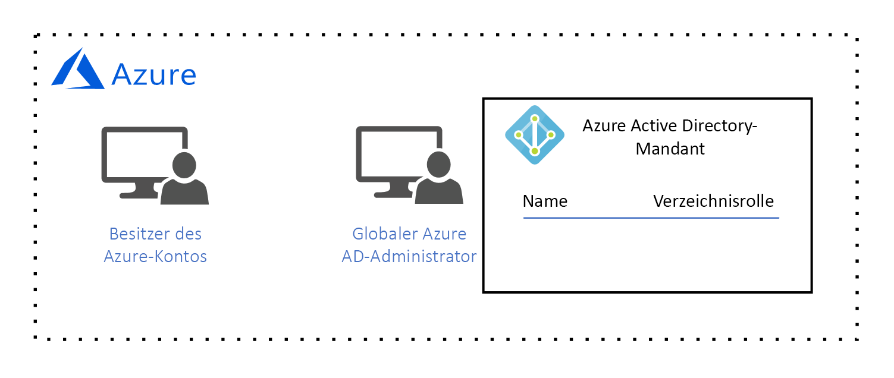

# Azure-Governance-Entwurfshandbuch

Die Zielgruppe für dieses Entwurfshandbuch sind die *zentralen IT-Mitarbeiter* in Ihrer Organisation. Die *zentralen IT-Mitarbeiter* sind für das Entwerfen und Implementieren der Cloud-Governance-Architektur Ihrer Organisation verantwortlich. In der Beschreibung unter [Was ist die Cloudressourcenkontrolle?](governance-explainer.md) haben Sie erfahren, dass mit „Kontrolle“ (Governance) das fortlaufende Verwalten, Überwachen und Überprüfen der Nutzung von Azure-Ressourcen gemeint ist, um die Ziele und Anforderungen Ihrer Organisation zu erfüllen.

In diesem Leitfaden soll vermittelt werden, wie Sie die Governance-Architektur für Ihre Organisation entwerfen, indem Sie sich einige hypothetische Governance-Ziele und -Anforderungen ansehen. Anschließend wird beschrieben, wie Sie die Governance-Tools von Azure konfigurieren, um diese Ziele zu erreichen. 

In der grundlegenden Einführungsphase besteht das Ziel darin, eine einfache Workload in Azure bereitzustellen. Dies führt zu den folgenden Anforderungen:
* Identitätsverwaltung für einen einzelnen **Workloadbesitzer**, der für das Bereitstellen und Warten der einfachen Workload verantwortlich ist. Der Workloadbesitzer benötigt die Berechtigung zum Erstellen, Lesen, Aktualisieren und Löschen von Ressourcen sowie die Berechtigung zum Delegieren dieser Rechte an andere Benutzer im Identitätsverwaltungssystem.
* Verwaltung aller Ressourcen für die einfache Workload zusammen in einer Verwaltungseinheit.

## Lizenzieren von Azure

Bevor wir damit beginnen, das Governance-Modell zu entwerfen, ist es wichtig, dass wir uns mit der Azure-Lizenzierung vertraut machen. Der Grund ist, dass die Administratorkonten, die Ihrer Azure-Lizenz zugeordnet sind, über die höchste Zugriffsebene auf Ihre gesamten Azure-Ressourcen verfügen. Diese Administratorkonten bilden die Grundlage Ihres Governance-Modells.  

> [!NOTE]
> Wenn Ihre Organisation über ein vorhandenes [Microsoft Enterprise Agreement](https://www.microsoft.com/en-us/licensing/licensing-programs/enterprise.aspx) verfügt, in dem Azure nicht enthalten ist, kann Azure hinzugefügt werden, indem Sie vorab eine Zahlungsverpflichtung eingehen. Weitere Informationen finden Sie unter [Lizenzierung von Azure für das Unternehmen](https://azure.microsoft.com/pricing/enterprise-agreement/). 

Wenn Azure dem Enterprise Agreement Ihrer Organisation hinzugefügt wird, wird Ihre Organisation aufgefordert, ein **Azure-Konto** zu erstellen. Bei der Erstellung des Kontos wurden ein **Azure-Kontobesitzer** und ein Azure Active Directory-Mandant (Azure AD) mit einem Konto vom Typ **Globaler Administrator** erstellt. Ein Azure AD-Mandant ist ein logisches Konstrukt, das eine sichere, dedizierte Instanz von Azure AD darstellt.

*Abbildung 1: Azure-Konto mit einem Azure-Konto-Manager und globalem Azure AD-Administrator*

## Identitätsverwaltung

Da für Azure nur [Azure AD](/azure/active-directory) vertrauenswürdig ist, was die Authentifizierung von Benutzern und die Autorisierung des Benutzerzugriffs auf Ressourcen betrifft, ist Azure AD unser Identitätsverwaltungssystem. Der globale Azure AD-Administrator verfügt über Berechtigungen der höchsten Ebene und kann identitätsbezogene Aktionen durchführen, z.B. das Erstellen von Benutzern und das Zuweisen von Berechtigungen. 

Wir benötigen eine Identitätsverwaltung für einen einzelnen **Workloadbesitzer**, der für das Bereitstellen und Warten der einfachen Workload verantwortlich ist. Der Workloadbesitzer benötigt die Berechtigung zum Erstellen, Lesen, Aktualisieren und Löschen von Ressourcen sowie die Berechtigung zum Delegieren dieser Rechte an andere Benutzer im Identitätsverwaltungssystem.

Unser globaler Azure AD-Administrator erstellt das **Workloadbesitzer**-Konto für den **Workloadbesitzer**:

*Abbildung 2: Globaler Azure AD-Administrator erstellt das Workloadbesitzer-Konto.*

Wir können die Zugriffsberechtigung für Ressourcen erst zuweisen, nachdem dieser Benutzer einem **Abonnement** hinzugefügt wurde. Dies führen wir in den nächsten beiden Abschnitten durch. 

## Ressourcenverwaltungsbereich

Wenn die Anzahl der von Ihrer Organisation bereitgestellten Ressourcen zunimmt, erhöht sich auch die Komplexität in Bezug auf die Steuerung dieser Ressourcen. Azure implementiert eine logische Containerhierarchie, damit Ihre Organisation die Ressourcen in Gruppen mit unterschiedlicher Granularität verwalten kann. Dies wird auch als **Bereich** (Scope) bezeichnet. 

Die oberste Ebene des Ressourcenverwaltungsbereichs ist die Ebene **Abonnement**. Ein Abonnement wird vom Azure-**Kontobesitzer** erstellt, der die Zahlungsverpflichtung einrichtet und für die Bezahlung aller Azure-Ressourcen verantwortlich ist, die dem Abonnement zugeordnet sind:

*Abbildung 3: Der Azure-Kontobesitzer erstellt ein Abonnement.*

Bei der Erstellung des Abonnements ordnet der Azure-**Kontobesitzer** dem Abonnement einen Azure AD-Mandanten zu, und dieser Azure AD-Mandant wird verwendet, um Benutzer zu authentifizieren und zu autorisieren:

*Abbildung 4: Der Azure-Kontobesitzer ordnet den Azure AD-Mandanten dem Abonnement zu.*

Unter Umständen haben Sie bemerkt, dass dem Abonnement derzeit kein Benutzer zugeordnet ist. Dies bedeutet, dass keine Person über die Berechtigung zum Verwalten von Ressourcen verfügt. In Wirklichkeit ist der **Kontobesitzer** der Besitzer des Abonnements und verfügt über die Berechtigung zur Durchführung aller Aktionen für eine Ressource des Abonnements. Aber in der Praxis ist der **Kontobesitzer** in Ihrer Organisation wahrscheinlich eher ein Mitarbeiter der Finanzabteilung und nicht dafür verantwortlich, Ressourcen zu erstellen, zu lesen, zu aktualisieren und zu löschen. Diese Aufgaben werden vom **Workloadbesitzer** übernommen. Daher müssen wir den **Workloadbesitzer** dem Abonnement hinzufügen und Berechtigungen zuweisen.

Da der **Kontobesitzer** derzeit der einzige Benutzer mit der Berechtigung zum Hinzufügen des **Workloadbesitzers** zum Abonnement ist, übernimmt er die Aufgabe, den **Workloadbesitzer** dem Abonnement hinzuzufügen:

*Abbildung 5: Azure-Kontobesitzer fügt den **Workloadbesitzer** dem Abonnement hinzu.*

Der Azure-**Kontobesitzer** erteilt dem **Workloadbesitzer** Berechtigungen, indem eine RBAC-Rolle ([Role-Based Access Control, rollenbasierte Zugriffssteuerung](/azure/role-based-access-control/)) zugewiesen wird. Mit der RBAC-Rolle wird ein Satz mit Berechtigungen angegeben, über die der **Workloadbesitzer** für einen oder mehrere Ressourcentypen verfügt.

Beachten Sie, dass der **Kontobesitzer** in diesem Beispiel die [integrierte Rolle **Besitzer**](/azure/role-based-access-control/built-in-roles#owner) zugewiesen hat: 

*Abbildung 6: Dem Workloadbesitzer wurde die integrierte Rolle „Besitzer“ zugewiesen.*

Mit der integrierten Rolle **Besitzer** werden für den **Workloadbesitzer** alle Berechtigungen für den Abonnementbereich gewährt. 

> [!IMPORTANT]
> Der Azure-**Kontobesitzer** ist für die Zahlungsverpflichtung verantwortlich, die dem Abonnement zugeordnet ist, aber der **Workloadbesitzer** verfügt über die gleichen Berechtigungen. Der **Kontobesitzer** muss darauf vertrauen, dass der **Workloadbesitzer** Ressourcen bereitstellt, die sich innerhalb des Abonnementbudgets bewegen.

Die nächste Ebene des Verwaltungsbereichs ist die Ebene **Ressourcengruppe**. Eine Ressourcengruppe ist ein logischer Container für Ressourcen. Vorgänge, die auf der Ressourcengruppenebene angewendet werden, gelten für alle Ressourcen einer Gruppe. Es ist auch wichtig zu beachten, dass die Berechtigungen für die einzelnen Benutzer von der nächsthöheren Ebene geerbt werden, sofern sie in diesem Bereich nicht explizit geändert werden. 

Zur Verdeutlichung sehen wir uns an, was passiert, wenn der **Workloadbesitzer** eine Ressourcengruppe erstellt:

*Abbildung 7: Der Workloadbesitzer erstellt eine Ressourcengruppe und erbt die integrierte Rolle „Besitzer“ für den Ressourcengruppenbereich.*

Mit der integrierten Rolle **Besitzer** werden für den **Workloadbesitzer** wiederum alle Berechtigungen für den Ressourcengruppenbereich gewährt. Wie bereits beschrieben, wird diese Rolle von der Abonnementebene geerbt. Wenn diesem Benutzer für diesen Bereich eine andere Rolle zugewiesen wird, gilt dies nur für den Bereich.

Die niedrigste Ebene des Verwaltungsbereichs ist die Ebene **Ressource**. Vorgänge, die auf Ressourcenebene durchgeführt werden, gelten nur für die Ressource selbst. Auch hier werden die Berechtigungen der Ressourcenebene vom Ressourcengruppenbereich geerbt. Wir können uns beispielsweise ansehen, was passiert, wenn der **Workloadbesitzer** in der Ressourcengruppe ein [virtuelles Netzwerk](/azure/virtual-network/virtual-networks-overview) bereitstellt:

*Abbildung 8: Der Workloadbesitzer erstellt eine Ressource und erbt die integrierte Rolle „Besitzer“ für den Ressourcenbereich.*

Der **Workloadbesitzer** erbt die Rolle „Besitzer“ für den Ressourcenbereich. Dies bedeutet, dass der Workloadbesitzer über alle Berechtigungen für das virtuelle Netzwerk verfügt. 

## Zusammenfassung

In diesem Artikel wurde Folgendes beschrieben:

* Azure sieht in Bezug auf die Identitätsverwaltung nur Azure AD als vertrauenswürdig an.
* Ein Abonnement weist den höchsten Bereich für die Ressourcenverwaltung auf, und jedes Abonnement ist einem Azure AD-Mandanten zugeordnet. Nur Benutzer unter dem zugeordneten Azure AD-Mandanten können auf Ressourcen im Abonnement zugreifen.
* Der Ressourcenverwaltungsbereich hat drei Ebenen: Abonnement, Ressourcengruppe und Ressource. Berechtigungen werden für jeden Bereich mit RBAC-Rollen zugewiesen. RBAC-Rollen werden vom höheren Bereich an den niedrigeren Bereich vererbt.

## Nächste Schritte

Kehren Sie zur [Übersicht über die grundlegende Einführungsphase](overview.md) zurück, um zu erfahren, wie Sie dieses Governance-Modell implementieren. Wählen Sie anschließend einen Workloadtyp aus, und informieren Sie sich darüber, wie Sie die Bereitstellung durchführen.