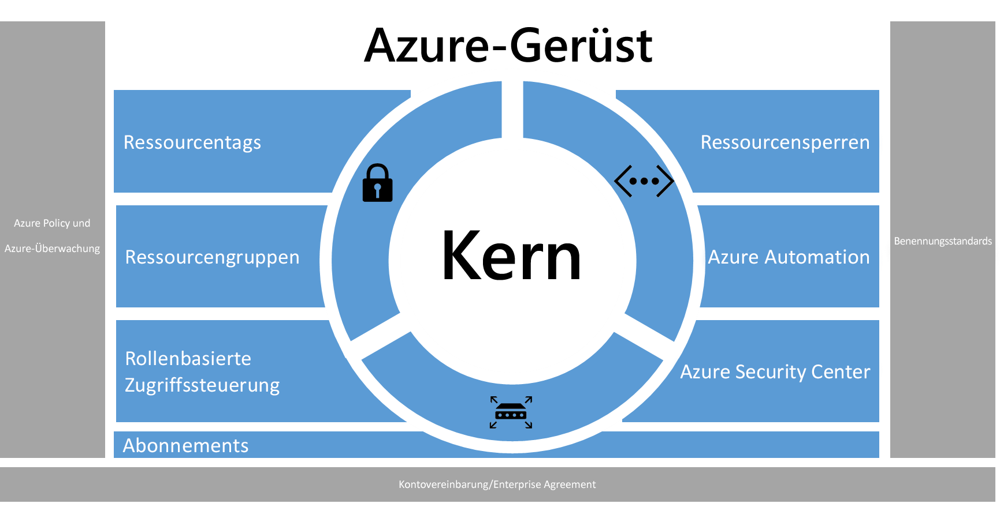
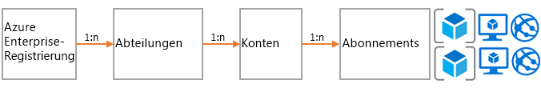
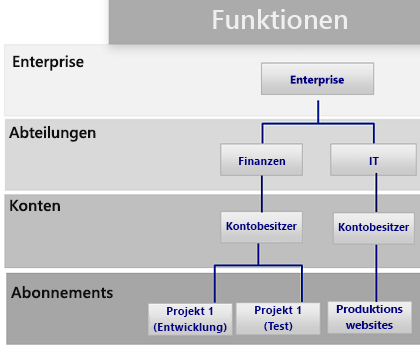
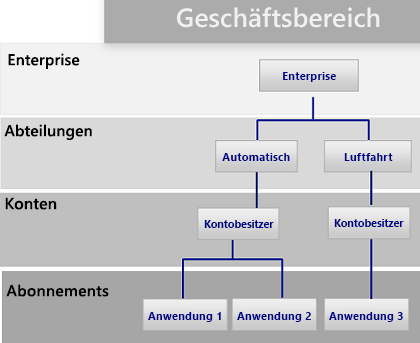
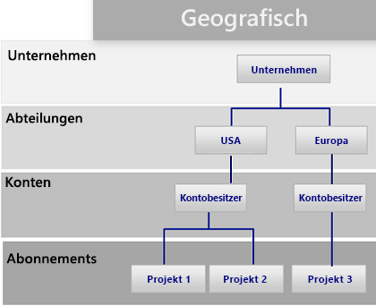
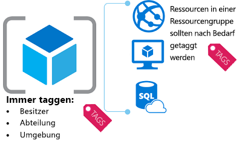
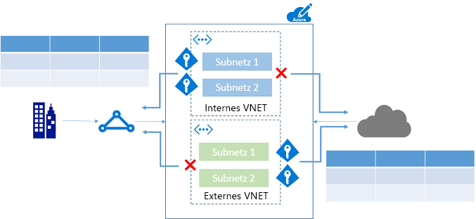
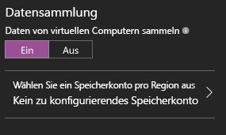

# Azure-Unternehmensgerüst – präskriptive AbonnementgovernanceAzure enterprise scaffold - prescriptive subscription governance
Immer mehr Unternehmen führen für Mobilität und Flexibilität eine öffentliche Cloud ein.Enterprises are increasingly adopting the public cloud for its agility and flexibility. Sie nutzen die Stärken der Cloud, um Umsatz zu generieren oder Ressourcen für das Unternehmen zu optimieren.They are utilizing the cloud's strengths to generate revenue or optimize resources for the business. Microsoft Azure bietet eine Vielzahl von Diensten, die Unternehmen wie Bausteine zusammenstellen können, um ein großes Spektrum von Workloads und Anwendungen zu berücksichtigen.Microsoft Azure provides a multitude of services that enterprises can assemble like building blocks to address a wide array of workloads and applications. 

Allerdings ist der Anfang oft schwierig.But, knowing where to begin is often difficult. Nachdem der Entschluss gefasst wurde, Azure zu verwenden, ergeben sich häufig einige Fragen:After deciding to use Azure, a few questions commonly arise:

* Wie erfülle ich die rechtlichen Vorgaben hinsichtlich der Datenhoheit in bestimmten Ländern?"How do I meet our legal requirements for data sovereignty in certain countries?"
* Wie stelle ich sicher, dass kritische Systeme nicht versehentlich geändert werden?"How do I ensure that someone does not inadvertently change a critical system?"
* Wie erfahre ich, was die einzelnen Ressourcen unterstützen, damit ich sie genau zuordnen und abrechnen kann?"How do I know what every resource is supporting so I can account for it and bill it back accurately?"

Die Vorstellung eines leeren Abonnements ohne Schutzmaßnahmen wirkt abschreckendThe prospect of an empty subscription with no guard rails is daunting. und kann Ihre Umstellung auf Azure behindern.This blank space can hamper your move to Azure.

Dieser Artikel bietet einen Ausgangspunkt für technische-Experten, die die Notwendigkeit von Governance berücksichtigen und auf die Notwendigkeit von Agilität abstimmen müssen.This article provides a starting point for technical professionals to address the need for governance, and balance it with the need for agility. Er führt das Konzept eines Unternehmensgerüsts ein, das Organisationen beim Implementieren und Verwalten von Azure-Abonnements hilft.It introduces the concept of an enterprise scaffold that guides organizations in implementing and managing their Azure subscriptions. 

## Notwendigkeit von GovernanceNeed for governance
Beim Wechsel zu Azure müssen Sie das Thema Governance früh angehen, um die erfolgreiche Verwendung der Cloud innerhalb des Unternehmens sicherzustellen.When moving to Azure, you must address the topic of governance early to ensure the successful use of the cloud within the enterprise. Leider bedeuten die Zeit und der Aufwand beim Erstellen eines umfassenden Systems für Governance, dass sich einige Unternehmensgruppen direkt an Lieferanten wenden, ohne die Unternehmens-IT einzubeziehen.Unfortunately, the time and bureaucracy of creating a comprehensive governance system means some business groups go directly to vendors without involving enterprise IT. Durch diesen Ansatz können im Unternehmen Sicherheitsrisiken bestehen bleiben, wenn die Ressourcen nicht richtig verwaltet werden.This approach can leave the enterprise open to vulnerabilities if the resources are not properly managed. Die Eigenschaften der öffentlichen Cloud – Agilität, Flexibilität und nutzungsbasierte Preise – sind wichtig für Unternehmensgruppen, die schnell die Anforderungen von Kunden (intern und extern) erfüllen müssen.The characteristics of the public cloud - agility, flexibility, and consumption-based pricing - are important to business groups that need to quickly meet the demands of customers (both internal and external). Aber die Unternehmens-IT muss sicherstellen, dass Daten und Systeme effektiv geschützt sind.But, enterprise IT needs to ensure that data and systems are effectively protected.

In der Praxis wird ein Gerüst verwendet, um die Basis der Struktur zu erstellen.In real life, scaffolding is used to create the basis of the structure. Das Gerüst gibt die allgemeine Gliederung vor und bietet Ankerpunkte für die Bereitstellung permanenterer Systeme.The scaffold guides the general outline, and provides anchor points for more permanent systems to be mounted. Ein Unternehmensgerüst entspricht einer Reihe von flexiblen Steuerelementen und Azure-Funktionen, die der Umgebung eine Struktur geben, sowie Ankern für die in der öffentlichen Cloud erstellten Dienste.An enterprise scaffold is the same: a set of flexible controls and Azure capabilities that provide structure to the environment, and anchors for services built on the public cloud. Es bietet den Entwicklern (IT und Unternehmensgruppen) eine Grundlage zum Erstellen und Einbinden von neuen Diensten.It provides the builders (IT and business groups) a foundation to create and attach new services.

Das Gerüst basiert auf Methoden, die wir bei der Zusammenarbeit mit vielen Kunden verschiedener Größen gesammelt haben.The scaffold is based on practices we have gathered from many engagements with clients of various sizes. Zu diesen Kunden gehören kleine Unternehmen, die Lösungen in der Cloud entwickeln, aber auch Fortune 500-Unternehmen und unabhängige Softwarehersteller, die Lösungen in die Cloud migrieren und dort entwickeln.Those clients range from small organizations developing solutions in the cloud to Fortune 500 enterprises and independent software vendors who are migrating and developing solutions in the cloud. Das Unternehmensgerüst wurde speziell so flexibel entwickelt, dass es sowohl herkömmliche IT-Workloads als auch agile Workloads unterstützt, wie z.B. Entwickler, die Software-as-a-Service-Anwendungen (SaaS) auf der Grundlage von Azure-Funktionen erstellen.The enterprise scaffold is "purpose-built" to be flexible to support both traditional IT workloads and agile workloads; such as, developers creating software-as-a-service (SaaS) applications based on Azure capabilities.

Das Unternehmensgerüst ist als Basis für jedes neue Abonnement in Azure vorgesehen.The enterprise scaffold is intended to be the foundation of each new subscription within Azure. Administratoren können damit sicherstellen, dass Workloads in einer Organisation die minimalen Anforderungen an Governance erfüllen, ohne zu verhindern, dass Unternehmensgruppen und Entwickler schnell ihre eigenen Ziele erreichen.It enables administrators to ensure workloads meet the minimum governance requirements of an organization without preventing business groups and developers from quickly meeting their own goals.

> [!IMPORTANT]
> Governance ist entscheidend für den Erfolg von Azure.Governance is crucial to the success of Azure. In diesem Artikel wird die technische Implementierung eines Unternehmensgerüsts behandelt, auf den umfassenden Prozess und die Beziehungen zwischen den Komponenten wird jedoch nur am Rande eingegangen.This article targets the technical implementation of an enterprise scaffold but only touches on the broader process and relationships between the components. Die Richtliniengovernance verläuft von oben nach unten und richtet sich danach, was das Unternehmen erreichen möchte.Policy governance flows from the top down and is determined by what the business wants to achieve. Natürlich sind beim Erstellen eines Governancemodells für Azure Vertreter aus der IT beteiligt, wichtiger jedoch ist eine nachhaltige Unterstützung durch Führungskräfte von Unternehmensgruppen sowie aus dem Bereich Sicherheits- und Risikomanagement.Naturally, the creation of a governance model for Azure includes representatives from IT, but more importantly it should have strong representation from business group leaders, and security and risk management. Bei einem Unternehmensgerüst geht es letztlich um die Minderung von Unternehmensrisiken, um Mission und Ziele der Organisation zu fördern.In the end, an enterprise scaffold is about mitigating business risk to facilitate an organization's mission and objectives.
> 
> 

Die folgende Abbildung beschreibt die Komponenten des Gerüsts.The following image describes the components of the scaffold. Das Fundament ist ein gut durchdachter Plan für Abteilungen, Konten und Abonnements.The foundation relies on a solid plan for departments, accounts, and subscriptions. Die Säulen bestehen aus Resource Manager-Richtlinien und soliden Benennungsstandards.The pillars consist of Resource Manager policies and strong naming standards. Das restliche Gerüst bilden zentrale Azure-Funktionen und -Features, die eine sichere und verwaltbare Umgebung ermöglichen.The rest of the scaffold comes from core Azure capabilities and features that enable a secure and manageable environment.

> [!NOTE]
> Seit der Einführung im Jahr 2008 ist Azure schnell gewachsen.Azure has grown rapidly since its introduction in 2008. Aufgrund dieses Wachstums mussten die Microsoft-Entwicklerteams ihre Herangehensweise beim Verwalten und Bereitstellen von Diensten überdenken.This growth required Microsoft engineering teams to rethink their approach for managing and deploying services. Das Azure Resource Manager-Modell wurde 2014 eingeführt und ersetzt das klassische Bereitstellungsmodell.The Azure Resource Manager model was introduced in 2014 and replaces the classic deployment model. Mit Resource Manager können Organisationen Azure-Ressourcen leichter bereitstellen, organisieren und steuern.Resource Manager enables organizations to more easily deploy, organize, and control Azure resources. Resource Manager umfasst eine Parallelisierung beim Erstellen von Ressourcen, sodass komplexe, voneinander abhängige Lösungen schneller bereitgestellt werden können.Resource Manager includes parallelization when creating resources for faster deployment of complex, interdependent solutions. Dazu gehört auch eine präzise Zugriffssteuerung und die Möglichkeit, Ressourcen mit Metadaten zu markieren.It also includes granular access control, and the ability to tag resources with metadata. Microsoft empfiehlt, alle Ressourcen mit dem Resource Manager-Modell zu erstellen.Microsoft recommends that you create all resources through the Resource Manager model. Das Unternehmensgerüst wurde explizit für das Resource Manager-Modell konzipiert.The enterprise scaffold is explicitly designed for the Resource Manager model.
> 
> 

## Definieren der HierarchieDefine your hierarchy
Die Grundlage für das Gerüst ist die Unternehmensregistrierung bei Azure (und im Enterprise Portal).The foundation of the scaffold is the Azure Enterprise Enrollment (and the Enterprise Portal). Die Unternehmensregistrierung definiert die Form und die Nutzung der Azure-Dienste in einem Unternehmen und die zentrale Governancestruktur.The enterprise enrollment defines the shape and use of Azure services within a company and is the core governance structure. Im Rahmen des Enterprise Agreement können Kunden die Umgebung in Abteilungen, Konten und Abonnements weiter unterteilen.Within the enterprise agreement, customers are able to further subdivide the environment into departments, accounts, and finally, subscriptions. Ein Azure-Abonnement ist die grundlegende Einheit, in der alle Ressourcen enthalten sind.An Azure subscription is the basic unit where all resources are contained. Es definiert außerdem einige Beschränkungen in Azure, wie z.B. die Anzahl der Kerne, Ressourcen usw.It also defines several limits within Azure, such as number of cores, resources, etc.

Alle Unternehmen sind unterschiedlich, und in der Hierarchie der vorherigen Abbildung wird eine enorme Flexibilität im Hinblick auf den Aufbau von Azure im Unternehmen berücksichtigt.Every enterprise is different and the hierarchy in the previous image allows for significant flexibility in how Azure is organized within the company. Vor der Implementierung der in diesem Dokument enthaltenen Richtlinien sollten Sie Ihre Hierarchie modellieren und die Auswirkungen auf die Abrechnung, den Zugriff auf Ressourcen und die Komplexität verstehen.Before implementing the guidance contained in this document, you should model your hierarchy and understand the impact on billing, resource access, and complexity.

Die drei allgemeinen Muster für Azure-Registrierungen sind:The three common patterns for Azure Enrollments are:

* Das auf **Funktionen** basierende MusterThe **functional** pattern
  
    
* Das auf **Unternehmenseinheiten** basierende MusterThe **business unit** pattern 
  
    
* Das auf **geografischen Regionen** basierende MusterThe **geographic** pattern
  
    

Sie wenden das Gerüst auf Abonnementebene an, um die Anforderungen an Governance in Ihrem Unternehmen auf das Abonnement auszudehnen.You apply the scaffold at the subscription level to extend the governance requirements of the enterprise into the subscription.

## BenennungsstandardsNaming standards
Die erste Säule des Gerüsts sind Benennungsstandards.The first pillar of the scaffold is naming standards. Mit sorgfältig konzipierten Benennungsstandards können Sie Ressourcen im Portal, auf einer Rechnung und innerhalb von Skripts identifizieren.Well-designed naming standards enable you to identify resources in the portal, on a bill, and within scripts. Wahrscheinlich verwenden Sie bereits Benennungsstandards für die lokale Infrastruktur.Most likely, you already have naming standards for on-premises infrastructure. Wenn Sie Azure zu Ihrer Umgebung hinzufügen, sollten Sie diese Benennungsstandards für Azure-Ressourcen übernehmen.When adding Azure to your environment, you should extend those naming standards to your Azure resources. Benennungsstandards ermöglichen eine effizientere Verwaltung der Umgebung auf allen Ebenen.Naming standard facilitate more efficient management of the environment at all levels.

> [!TIP]
> Informationen zu Benennungskonventionen:For naming conventions:
> * Lesen Sie den [Leitfaden mit Mustern und Verfahren](../best-practices/naming-conventions.md), und übernehmen Sie ihn wo möglich.Review and adopt where possible the [Patterns and Practices guidance](../best-practices/naming-conventions.md). Dieser Leitfaden hilft Ihnen bei der Entscheidung für einen sinnvollen Benennungsstandard.This guidance helps you decide on a meaningful naming standard.
> * Verwenden Sie die Höckerschreibweise für Namen von Ressourcen (z.B. meineRessourcengruppe und VnetNetzwerkname).Use camelCasing for names of resources (such as myResourceGroup and vnetNetworkName). Hinweis: Es gibt bestimmte Ressourcen, z.B. Speicherkonten, bei denen nur Kleinbuchstaben (und keine anderen Sonderzeichen) verwendet werden dürfen.Note: There are certain resources, such as storage accounts, where the only option is to use lower case (and no other special characters).
> * Sie könnten Azure Resource Manager-Richtlinien (im nächsten Abschnitt beschrieben) nutzen, um die Benennungsstandards zu erzwingen.Consider using Azure Resource Manager policies (described in the next section) to enforce naming standards.
> 
> Die vorstehenden Tipps sollen Ihnen das Implementieren einer einheitlichen Benennungskonvention erleichtern.The preceding tips help you implement a consistent naming convention.

## Richtlinien und ÜberwachungPolicies and auditing
Die zweite Säule des Gerüsts umfasst das Erstellen von [Azure-Richtlinien](/azure/azure-policy/azure-policy-introduction) und das [Überwachen des Aktivitätsprotokolls](/azure/azure-resource-manager/resource-group-audit).The second pillar of the scaffold involves creating [Azure policies](/azure/azure-policy/azure-policy-introduction) and [auditing the activity log](/azure/azure-resource-manager/resource-group-audit). Resource Manager-Richtlinien bieten Ihnen die Möglichkeit, mit Risiken in Azure umzugehen.Resource Manager policies provide you with the ability to manage risk in Azure. Sie können Richtlinien definieren, die die Datenhoheit sicherstellen, indem Sie bestimmte Aktionen einschränken, erzwingen oder überwachen.You can define policies that ensure data sovereignty by restricting, enforcing, or auditing certain actions. 

* Richtlinien sind standardmäßig ein **Zulassungssystem**.Policy is a default **allow** system. Aktionen werden durch das Definieren und Zuweisen von Richtlinien zu Ressourcen gesteuert, die Aktionen für Ressourcen verweigern oder überwachen.You control actions by defining and assigning policies to resources that deny or audit actions on resources.
* Richtlinien werden von Richtliniendefinitionen in einer Richtliniendefinitionssprache (If-Then-Bedingungen) beschrieben.Policies are described by policy definitions in a policy definition language (if-then conditions).
* Sie erstellen Richtlinien mit Dateien, die mit JSON (JavaScript Object Notation) formatiert sind.You create polices with JSON (Javascript Object Notation) formatted files. Nach dem Definieren einer Richtlinie weisen Sie ihr einen bestimmten Bereich zu: Abonnement, Ressourcengruppe oder Ressource.After defining a policy, you assign it to a particular scope: subscription, resource group, or resource.

Richtlinien weisen mehrere Aktionen auf, die einen differenzierten Ansatz für Ihre Szenarien ermöglichen.Policies have multiple actions that allow for a fine-grained approach to your scenarios. Die Aktionen sind:The actions are:

* **Verweigern**: Blockiert die Ressourcenanforderung**Deny**: Blocks the resource request
* **Überwachen**: Lässt die Anforderung zu, fügt jedoch eine Zeile zum Aktivitätsprotokoll hinzu (die für Warnungen oder zum Auslösen von Runbooks verwendet werden kann)**Audit**: Allows the request but adds a line to the activity log (which can be used to provide alerts or to trigger runbooks)
* **Anfügen**: Fügt angegebene Informationen zur Ressource hinzu.**Append**: Adds specified information to the resource. Beispiel: Wenn eine Ressource kein Tag „Kostenstelle“ aufweist, fügen Sie dieses Tag mit einem Standardwert hinzu.For example, if there is not a "CostCenter" tag on a resource, add that tag with a default value.

### Allgemeine Verwendungsmöglichkeiten von Resource Manager-RichtlinienCommon uses of Resource Manager policies
Azure Resource Manager-Richtlinien sind ein leistungsstarkes Tool im Azure-Toolkit.Azure Resource Manager policies are a powerful tool in the Azure toolkit. Sie können damit unerwartete Kosten vermeiden, durch Tags eine Kostenstelle für Ressourcen identifizieren und sicherstellen, dass die Anforderungen an die Compliance erfüllt werden.They enable you to avoid unexpected costs, to identify a cost center for resources through tagging, and to ensure that compliancy requirements are met. Wenn Richtlinien mit integrierten Überwachungsfeatures kombiniert werden, können Sie komplexe und flexible Lösungen herstellen.When policies are combined with the built-in auditing features, you can fashion complex and flexible solutions. Richtlinien ermöglichen Unternehmen die Steuerung von Workloads der „herkömmlichen IT“ und von „agilen“ Workloads, z.B. das Entwickeln von Kundenanwendungen.Policies allow companies to provide controls for "Traditional IT" workloads and "Agile" workloads; such as, developing customer applications. Die am häufigsten verwendeten Muster für Richtlinien sind:The most common patterns we see for policies are:

* **Geografische Compliance/Datenhoheit**: Azure bietet Regionen auf der ganzen Welt.**Geo-compliance/data sovereignty** - Azure provides regions across the world. Unternehmen möchten häufig steuern, wo Ressourcen erstellt werden (um Datenhoheit sicherzustellen oder nur um sicherzustellen, dass Ressourcen in der Nähe der Endbenutzer der Ressourcen erstellt werden).Enterprises often wish to control where resources are created (whether to ensure data sovereignty or just to ensure resources are created close to the end consumers of the resources).
* **Kostenverwaltung**: Ein Azure-Abonnement kann Ressourcen vieler Typen und Größen enthalten.**Cost management** - An Azure subscription can contain resources of many types and scale. Unternehmen möchten häufig sicherstellen, dass für Standardabonnements keine unnötig umfangreichen Ressourcen verwendet werden, die pro Monat hohe Kosten verursachen.Corporations often wish to ensure that standard subscriptions avoid using unnecessarily large resources, which can cost hundreds of dollars a month or more.
* **Standardgovernance durch erforderliche Tags**: Das Anfordern von Tags ist eine der Funktionen, die am häufigsten verwendet und gewünscht wird.**Default governance through required tags** - Requiring tags is one of the most common and highly desired features. Mithilfe von Azure Resource Manager-Richtlinien können Unternehmen sicherstellen, dass eine Ressource entsprechend mit Tags versehen wird.Using Azure Resource Manager Policies enterprises are able to ensure that a resource is appropriately tagged. Die am häufigsten verwendeten Tags sind: Abteilung, Ressourcenbesitzer und Umgebungstyp (z.B. Produktion, Test, Entwicklung)The most common tags are: Department, Resource Owner, and Environment type (for example - production, test, development)

**Beispiele****Examples**

Abonnement der „herkömmlichen IT“ für Branchenanwendungen"Traditional IT" subscription for line-of-business applications

* Erzwingen der Tags für Abteilung und Besitzer für alle RessourcenEnforce Department and Owner tags on all resources
* Beschränken der Erstellung von Ressourcen auf die Region NordamerikaRestrict resource creation to the North American Region
* Beschränken der Möglichkeit, virtuelle Computer der G-Serie und HDInsight-Cluster zu erstellenRestrict the ability to create G-Series VMs and HDInsight Clusters

„Agile“ Umgebung für eine Unternehmenseinheit zum Erstellen von Cloudanwendungen"Agile" Environment for a business unit creating cloud applications

* Zulassen der Erstellung von Ressourcen NUR in einer bestimmten Region, um die Anforderungen an die Datenhoheit zu erfüllen.To meet data sovereignty requirements, allow the creation of resources ONLY in a specific region.
* Erzwingen des Umgebungstags für alle Ressourcen.Enforce Environment tag on all resources. Wenn eine Ressource ohne Tag erstellt wird, fügen Sie das Tag **Umgebung: Unbekannt** an die Ressource an.If a resource is created without a tag, append the **Environment: Unknown** tag to the resource.
* Überwachen, wenn Ressourcen außerhalb von Nordamerika erstellt werden, dies jedoch nicht verhindern.Audit when resources are created outside of North America but do not prevent.
* Überwachen, wenn Ressourcen erstellt werden, die hohe Kosten verursachen.Audit when high-cost resources are created.

> [!TIP]
> Die häufigste Verwendung von Resource Manager-Richtlinien in Organisationen besteht darin zu steuern, *wo* Ressourcen erstellt werden können und *welche* Arten von Ressourcen erstellt werden können.The most common use of Resource Manager policies across organizations is to control *where* resources can be created and *what* types of resources can be created. Viele Unternehmen steuern mit Richtlinien nicht nur, *wo* und *welche* Ressourcen erstellt werden, sondern stellen auf diese Weise auch sicher, dass Ressourcen die entsprechenden Metadaten aufweisen, um die Nutzung abzurechnen.In addition to providing controls on *where* and *what*, many enterprises use policies to ensure resources have the appropriate metadata to bill back for consumption. Sie sollten Richtlinien auf Abonnementebene für Folgendes anzuwenden:We recommend applying policies at the subscription level for:
> 
> * Geografische Compliance/DatenhoheitGeo-compliance/data sovereignty
> * KostenverwaltungCost management
> * Erforderliche Tags (festgelegt durch die Anforderungen des Unternehmens, z.B. für den Rechnungsempfänger oder den Anwendungsbesitzer)Required tags (Determined by business need, such as BillTo, Application Owner)
> 
> Sie können weitere Richtlinien auf niedrigeren Ebenen des Bereichs anwenden.You can apply additional policies at lower levels of scope.
> 
> 

### Überwachen – was ist passiert?Audit - what happened?
Um anzuzeigen, wie Ihre Umgebung funktioniert, müssen Sie die Benutzeraktivitäten überwachen.To view how your environment is functioning, you need to audit user activity. Die meisten Ressourcentypen in Azure erstellen Diagnoseprotokolle, die Sie über ein Protokolltool oder in Azure Log Analytics analysieren können.Most resource types within Azure create diagnostic logs that you can analyze through a log tool or in Azure Log Analytics. Sie können Aktivitätsprotokolle aus mehreren Abonnements erfassen, um Abteilungs- oder Unternehmensansichten bereitzustellen.You can gather activity logs across multiple subscriptions to provide a departmental or enterprise view. Überwachungsdatensätze sind ein wichtiges Tool für die Diagnose und ein entscheidender Mechanismus zum Auslösen von Ereignissen in der Azure-Umgebung.Audit records are both an important diagnostic tool and a crucial mechanism to trigger events in the Azure environment.

Mit Aktivitätsprotokollen aus Resource Manager-Bereitstellungen können Sie bestimmen, welche **Vorgänge** ausgeführt wurden und wer sie ausgeführt hat.Activity logs from Resource Manager deployments enable you to determine the **operations** that took place and who performed them. Aktivitätsprotokolle können mit Tools wie Log Analytics gesammelt und aggregiert werden.Activity logs can be collected and aggregated using tools like Log Analytics.

## RessourcentagsResource tags
Wenn Benutzer in Ihrer Organisation Ressourcen zum Abonnement hinzufügen, wird es zunehmend wichtig, die Ressourcen der entsprechenden Abteilung, dem Kunden und der Umgebung zuzuordnen.As users in your organization add resources to the subscription, it becomes increasingly important to associate resources with the appropriate department, customer, and environment. Sie können über [Tags](/azure/azure-resource-manager/resource-group-using-tags) Metadaten an Ressourcen anfügen.You can attach metadata to resources through [tags](/azure/azure-resource-manager/resource-group-using-tags). Verwenden Sie Tags, um Informationen zur Ressource oder zum Besitzer bereitzustellen.You use tags to provide information about the resource or the owner. Mit Tags können Sie Ressourcen nicht nur auf verschiedene Arten aggregieren und gruppieren, Sie können diese Daten auch für die verbrauchsbasierte Kostenzuteilung verwenden.Tags enable you to not only aggregate and group resources in various ways, but use that data for the purposes of chargeback. Sie können Ressourcen mit bis zu 15 Schlüssel-Wert-Paaren markieren.You can tag resources with up to 15 key:value pairs. 

Ressourcentags sind flexibel und sollten den meisten Ressourcen angefügt werden.Resource tags are flexible and should be attached to most resources. Beispiele für gängige Ressourcentags sind:Examples of common resource tags are:

* BillToBillTo
* Abteilung (oder Unternehmenseinheit)Department (or Business Unit)
* Umgebung (Produktion, Staging, Entwicklung)Environment (Production, Stage, Development)
* Ebene (Webebene, Anwendungsebene)Tier (Web Tier, Application Tier)
* AnwendungsbesitzerApplication Owner
* ProjectNameProjectName

Weitere Beispiele für Tags finden Sie unter [Empfohlene Benennungskonventionen für Azure-Ressourcen](../best-practices/naming-conventions.md).For more examples of tags, see [Recommended naming conventions for Azure resources](../best-practices/naming-conventions.md).

> [!TIP]
> Sie könnten eine Richtlinie erstellen, die Tags für Folgendes erfordert:Consider making a policy that mandates tagging for:
> 
> * RessourcengruppenResource groups
> * SpeicherStorage
> * Virtual MachinesVirtual Machines
> * App Service-Umgebungen/WebserverApplication Service Environments/web servers
> 
> Durch diese Tagstrategie wird für alle Ihre Abonnements festgelegt, welche Metadaten für die Bereiche Unternehmen, Finanzen, Sicherheit, Risikomanagement und Verwaltung der vollständigen Umgebung benötigt werden.This tagging strategy identifies across your subscriptions what metadata is needed for the business, finance, security, risk management, and overall management of the environment. 

## RessourcengruppeResource group
Mit Resource Manager können Sie Ressourcen in aussagekräftige Gruppen für Verwaltung, Abrechnung oder natürliche Affinität aufnehmen.Resource Manager enables you to put resources into meaningful groups for management, billing, or natural affinity. Wie bereits erwähnt, weist Azure zwei Bereitstellungsmodelle auf.As mentioned earlier, Azure has two deployment models. Im älteren klassischen Modell war die grundlegende Verwaltungseinheit das Abonnement.In the earlier Classic model, the basic unit of management was the subscription. Es war schwierig, Ressourcen innerhalb eines Abonnements aufzuschlüsseln. Dies hat zur Erstellung einer großen Anzahl von Abonnements geführt.It was difficult to break down resources within a subscription, which led to the creation of large numbers of subscriptions. Mit dem Resource Manager-Modell wurden auch Ressourcengruppen eingeführt.With the Resource Manager model, we saw the introduction of resource groups. Ressourcengruppen sind Container für Ressourcen, die einen gemeinsamen Lebenszyklus aufweisen oder gleiche Attribute wie „alle SQL Server“ oder „Anwendung A“ verwenden.Resource groups are containers of resources that have a common lifecycle or share an attribute such as "all SQL servers" or "Application A".

Ressourcengruppen können nicht ineinander enthalten sein, und Ressourcen können nur einer einzigen Ressourcengruppe angehören.Resource groups cannot be contained within each other and resources can only belong to one resource group. Sie können bestimmte Aktionen auf alle Ressourcen in einer Ressourcengruppe anwenden.You can apply certain actions on all resources in a resource group. Durch das Löschen einer Ressourcengruppe werden beispielsweise alle Ressourcen innerhalb der Ressourcengruppe entfernt.For example, deleting a resource group removes all resources within the resource group. In der Regel nehmen Sie eine vollständige Anwendung oder ein verknüpftes System in die gleiche Ressourcengruppe auf.Typically, you place an entire application or related system in the same resource group. Beispielsweise würde eine Anwendung mit drei Ebenen namens „Contoso-Webanwendung“ den Webserver, den Anwendungsserver und den SQL-Server in der gleichen Ressourcengruppe enthalten.For example, a three-tier application called Contoso Web Application would contain the web server, application server and SQL server in the same resource group.

> [!TIP]
> Wie Sie die Ressourcengruppen organisieren, kann je nach Workload der „herkömmlichen IT“ und der „agilen IT“ variieren:How you organize your resource groups may vary from "Traditional IT" workloads to "Agile IT" workloads:
> 
> * Workloads der „herkömmlichen IT“ werden meist nach Elementen innerhalb des gleichen Lebenszyklus gruppiert (z.B. eine Anwendung)."Traditional IT" workloads are most commonly grouped by items within the same lifecycle, such as an application. Eine Gruppierung nach Anwendung ermöglicht die Verwaltung einzelner Anwendungen.Grouping by application allows for individual application management.
> * Workloads der „agilen IT“ konzentrieren sich in der Regel auf Cloudanwendungen, die externen Kunden zugänglich sind."Agile IT" workloads tend to focus on external customer-facing cloud applications. Die Ressourcengruppen sollten die Ebenen der Bereitstellung (z.B. Webebene, App-Ebene) und der Verwaltung widerspiegeln.The resource groups should reflect the layers of deployment (such as Web Tier, App Tier) and management.
> 
> Das Verständnis Ihrer Workloads erleichtert es Ihnen, eine Strategie für Ressourcengruppen zu entwickeln.Understanding your workload helps you develop a resource group strategy.

## Rollenbasierte ZugriffssteuerungRole-based access control
Sie fragen sich wahrscheinlich, wer Zugriff auf Ressourcen haben sollteYou probably are asking yourself "who should have access to resources?" und wie dieser Zugriff gesteuert werden kann.and "how do I control this access?" Das Zulassen oder Untersagen von Zugriff auf das Azure-Portal und das Steuern des Zugriffs auf Ressourcen im Portal ist entscheidend.Allowing or disallowing access to the Azure portal, and controlling access to resources in the portal is crucial. 

Als Azure ursprünglich veröffentlicht wurde, waren Zugriffssteuerungen für ein Abonnement einfach: Administrator oder Co-Administrator.When Azure was initially released, access controls to a subscription were basic: Administrator or Co-Administrator. Durch den Zugriff auf ein Abonnement im klassischen Modell war Zugriff auf alle Ressourcen im Portal möglich.Access to a subscription in the Classic model implied access to all the resources in the portal. Dieses Fehlen einer präziseren Steuerung hat zur Zunahme von Abonnements geführt, um eine angemessene Zugriffssteuerung für eine Azure-Registrierung bereitzustellen.This lack of fine-grained control led to the proliferation of subscriptions to provide a level of reasonable access control for an Azure Enrollment.

Diese Zunahme von Abonnements ist nicht mehr erforderlich.This proliferation of subscriptions is no longer needed. Mit der rollenbasierten Zugriffssteuerung können Sie Benutzer zu Standardrollen (z.B. zu den allgemeinen Rollentypen „Leser“ und „Autor“) zuweisen.With role-based access control, you can assign users to standard roles (such as common "reader" and "writer" types of roles). Sie können auch benutzerdefinierte Rollen definieren.You can also define custom roles.

> [!TIP]
> So implementieren Sie die rollenbasierte Zugriffssteuerung:To implement role-based access control:
> * Verbinden Sie den Identitätsspeicher Ihres Unternehmens (meist Active Directory) über das AD Connect-Tool mit Azure Active Directory.Connect your corporate identity store (most commonly Active Directory) to Azure Active Directory using the AD Connect tool.
> * Kontrollieren Sie den Administrator/Co-Administrator eines Abonnements mithilfe einer verwalteten Identität.Control the Admin/Co-Admin of a subscription using a managed identity. Weisen Sie den Administrator/Co-Administrator **nicht** einem neuen Abonnementbesitzer zu.**Don't** assign Admin/Co-admin to a new subscription owner. Verwenden Sie stattdessen die RBAC-Rollen, um die Rechte eines **Besitzers** für eine Gruppe oder eine Einzelperson bereitzustellen.Instead, use RBAC roles to provide **Owner** rights to a group or individual.
> * Fügen Sie Azure-Benutzer einer Gruppe (z.B. Besitzer von Anwendung X) in Active Directory hinzu.Add Azure users to a group (for example, Application X Owners) in Active Directory. Verwenden Sie die synchronisierte Gruppe, um Mitgliedern der Gruppe die erforderlichen Rechte zum Verwalten der Ressourcengruppe, die die Anwendung enthält, zu gewähren.Use the synced group to provide group members the appropriate rights to manage the resource group containing the application.
> * Befolgen Sie das Prinzip, die **geringsten Rechte** zu gewähren, die zur Erledigung der erwarteten Arbeit erforderlich sind.Follow the principle of granting the **least privilege** required to do the expected work. Beispiel: For example:
>   * Bereitstellungsgruppe: Eine Gruppe, die nur Ressourcen bereitstellen kann.Deployment Group: A group that is only able to deploy resources.
>   * Verwaltung virtueller Computer: Eine Gruppe, die virtuelle Computer (für Vorgänge) neu starten kann.Virtual Machine Management: A group that is able to restart VMs (for operations)
> 
> Diese Tipps sollen Sie beim Verwalten des Benutzerzugriffs für Ihr gesamtes Abonnement unterstützen.These tips help you manage user access across your subscription.

## Azure-RessourcensperrenAzure resource locks
Wenn Ihre Organisation dem Abonnement zentrale Dienste hinzufügt, wird es zunehmend wichtig sicherzustellen, dass diese Dienste verfügbar sind, um eine Unterbrechung des Geschäftsbetriebs zu vermeiden.As your organization adds core services to the subscription, it becomes increasingly important to ensure that those services are available to avoid business disruption. [Ressourcensperren](/azure/azure-resource-manager/resource-group-lock-resources) ermöglichen Ihnen, Vorgänge auf wertvollen Ressourcen einzuschränken, bei denen das Ändern oder Löschen einen erheblichen Einfluss auf Ihre Anwendungen oder die Cloudinfrastruktur hätte.[Resource locks](/azure/azure-resource-manager/resource-group-lock-resources) enable you to restrict operations on high-value resources where modifying or deleting them would have a significant impact on your applications or cloud infrastructure. Sie können Sperren auf ein Abonnement, eine Ressourcengruppe oder eine Ressource anwenden.You can apply locks to a subscription, resource group, or resource. Normalerweise wenden Sie Sperren auf grundlegende Ressourcen wie Speicherkonten, virtuelle Netzwerke und Gateways an.Typically, you apply locks to foundational resources such as virtual networks, gateways, and storage accounts. 

Ressourcensperren unterstützen aktuell zwei Werte: CanNotDelete und ReadOnly.Resource locks currently support two values: CanNotDelete and ReadOnly. CanNotDelete bedeutet, dass Benutzer (mit den entsprechenden Berechtigungen) eine Ressource lesen oder ändern können, sie können sie jedoch nicht löschen.CanNotDelete means that users (with the appropriate rights) can still read or modify a resource but cannot delete it. ReadOnly bedeutet, dass autorisierte Benutzer eine Ressource nicht löschen oder ändern können.ReadOnly means that authorized users can't delete or modify a resource.

Zum Erstellen oder Löschen von Verwaltungssperren benötigen Sie Zugriff auf `Microsoft.Authorization/*`- oder `Microsoft.Authorization/locks/*`-Aktionen.To create or delete management locks, you must have access to `Microsoft.Authorization/*` or `Microsoft.Authorization/locks/*` actions.
Unter den integrierten Rollen verfügen nur „Besitzer“ und „Benutzerzugriffsadministrator“ über diese Aktionen.Of the built-in roles, only Owner and User Access Administrator are granted those actions.

> [!TIP]
> Optionen des Kernnetzwerks sollten durch Sperren geschützt sein.Core network options should be protected with locks. Das versehentliche Löschen eines Site-to-Site-VPN mit Gateway wäre katastrophal für ein Azure-Abonnement.Accidental deletion of a gateway, site-to-site VPN would be disastrous to an Azure subscription. Azure lässt das Löschen eines virtuellen Netzwerks, das verwendet wird, nicht zu, aber die Anwendung weiterer Einschränkungen ist eine hilfreiche Sicherheitsmaßnahme.Azure doesn't allow you to delete a virtual network that is in use, but applying more restrictions is a helpful precaution. 
> 
> * Virtuelles Netzwerk: CanNotDeleteVirtual Network: CanNotDelete
> * Netzwerksicherheitsgruppe: CanNotDeleteNetwork Security Group: CanNotDelete
> * Richtlinien: CanNotDeletePolicies: CanNotDelete
> 
> Auch Richtlinien sind für die Aufrechterhaltung der entsprechenden Kontrolle entscheidend.Policies are also crucial to the maintenance of appropriate controls. Sie sollten eine **CanNotDelete**-Sperre auf Richtlinien anwenden, die verwendet werden.We recommend that you apply a **CanNotDelete** lock to polices that are in use.

## Zentrale NetzwerkressourcenCore networking resources
Der Zugriff auf Ressourcen kann intern (innerhalb des Unternehmensnetzwerks) oder extern (über das Internet) erfolgen.Access to resources can be either internal (within the corporation's network) or external (through the internet). Für Benutzer in Ihrer Organisation ist es einfach, versehentlich Ressourcen an der falschen Stelle zu platzieren und so böswilligen Zugriff darauf zu ermöglichen.It is easy for users in your organization to inadvertently put resources in the wrong spot, and potentially open them to malicious access. Wie bei lokalen Geräten müssen Unternehmen die entsprechende Kontrolle implementieren, um sicherzustellen, dass Azure-Benutzer die richtigen Entscheidungen treffen.As with on-premises devices, enterprises must add appropriate controls to ensure that Azure users make the right decisions. Für die Abonnementgovernance wurden Hauptressourcen identifiziert, die eine grundlegende Kontrolle des Zugriffs bieten.For subscription governance, we identify core resources that provide basic control of access. Zu diesen Hauptressourcen gehören:The core resources consist of:

* **Virtuelle Netzwerke** sind Containerobjekte für Subnetze.**Virtual networks** are container objects for subnets. Obwohl dies nicht zwingend notwendig ist, werden sie häufig beim Verbinden von Anwendungen mit internen Unternehmensressourcen verwendet.Though not strictly necessary, it is often used when connecting applications to internal corporate resources.
* **Netzwerksicherheitsgruppen** ähneln einer Firewall und bieten Regeln dafür, wie eine Ressource über das Netzwerk „kommunizieren“ kann.**Network security groups** are similar to a firewall and provide rules for how a resource can "talk" over the network. Mit ihnen können Sie präzise steuern, wie/ob ein Subnetz (oder ein virtueller Computer) eine Verbindung mit dem Internet oder anderen Subnetzen im gleichen virtuellen Netzwerk herstellen kann.They provide granular control over how/if a subnet (or virtual machine) can connect to the Internet or other subnets in the same virtual network.

> [!TIP]
> Für Netzwerke:For networking:
> * Erstellen Sie virtuelle Netzwerke speziell für Workloads mit externem Zugriff und Workloads mit internem Zugriff.Create virtual networks dedicated to external-facing workloads and internal-facing workloads. Dieser Ansatz reduziert die Wahrscheinlichkeit, dass versehentlich virtuelle Computer, die für interne Workloads vorgesehen sind, in einem Bereich mit externem Zugriff platziert werden.This approach reduces the chance of inadvertently placing virtual machines that are intended for internal workloads in an external facing space.
> * Konfigurieren Sie Netzwerksicherheitsgruppen, um den Zugriff zu beschränken.Configure network security groups to limit access. Sie blockieren zumindest den Zugriff aus internen virtuellen Netzwerken auf das Internet und aus externen virtuellen Netzwerken auf das Unternehmensnetzwerk.At a minimum, block access to the internet from internal virtual networks, and block access to the corporate network from external virtual networks.
> 
> Diese Tipps sollen Sie beim Implementieren sicherer Netzwerkressourcen unterstützen.These tips help you implement secure networking resources.

### AutomationAutomation
Das Verwalten von einzelnen Ressourcen ist zeitaufwändig und für bestimmte Vorgänge potenziell fehleranfällig.Managing resources individually is both time-consuming and potentially error prone for certain operations. Azure bietet verschiedene Automatisierungsfunktionen, einschließlich Azure Automation, Logic Apps und Azure Functions.Azure provides various automation capabilities including Azure Automation, Logic Apps, and Azure Functions. Mit [Azure Automation](/azure/automation/automation-intro) können Administratoren Runbooks erstellen und definieren, um häufige Aufgaben bei der Verwaltung von Ressourcen auszuführen.[Azure Automation](/azure/automation/automation-intro) enables administrators to create and define runbooks to handle common tasks in managing resources. Sie erstellen Runbooks mithilfe eines PowerShell-Code-Editors oder eines grafischen Editors.You create runbooks by using either a PowerShell code editor or a graphical editor. Sie können komplexe mehrstufige Workflows erstellen.You can produce complex multi-stage workflows. Azure Automation wird häufig verwendet, um allgemeine Aufgaben wie das Herunterfahren nicht verwendeter Ressourcen oder das Erstellen von Ressourcen als Reaktion auf einen bestimmten Trigger ohne Benutzereingriff auszuführen.Azure Automation is often used to handle common tasks such as shutting down unused resources, or creating resources in response to a specific trigger without needing human intervention.

> [!TIP]
> Für Automation:For automation:
> * Erstellen Sie ein Azure Automation-Konto, und prüfen Sie die verfügbaren Runbooks (grafisch und Befehlszeile) im [Runbookkatalog](/azure/automation/automation-runbook-gallery).Create an Azure Automation account and review the available runbooks (both graphical and command line) available in the [Runbook Gallery](/azure/automation/automation-runbook-gallery).
> * Importieren Sie wichtige Runbooks, und passen Sie sie für Ihre eigenen Zwecke an.Import and customize key runbooks for your own use.
> 
> Ein gängiges Szenario ist das Starten/Herunterfahren virtueller Computer nach einem Zeitplan.A common scenario is the ability to Start/Shutdown virtual machines on a schedule. Es gibt Beispielrunbooks im Katalog, die dieses Szenario ausführen und veranschaulichen, wie Sie es erweitern können.There are example runbooks that are available in the Gallery that both handle this scenario and teach you how to expand it.
> 
> 

## Azure Security CenterAzure Security Center
Eines der größten Hindernisse bei der Einführung der Cloud waren vermutlich Bedenken wegen der Sicherheit.Perhaps one of the biggest blockers to cloud adoption has been the concerns over security. IT-Risikomanager und für die Sicherheit zuständige Abteilungen müssen sicherstellen, dass die Ressourcen in Azure sicher sind.IT risk managers and security departments need to ensure that resources in Azure are secure. 

Das [Azure Security Center](/azure/security-center/security-center-intro) bietet einen zentralen Überblick über den Sicherheitsstatus von Ressourcen in den Abonnements und gibt Empfehlungen, mit deren Hilfe die Gefährdung von Ressourcen verhindert wird.The [Azure Security Center](/azure/security-center/security-center-intro) provides a central view of the security status of resources in the subscriptions, and provides recommendations that help prevent compromised resources. Es kann detailliertere Richtlinien ermöglichen (z.B. Richtlinien auf bestimmte Ressourcengruppen anwenden, mit denen das Unternehmen anpassen kann, wie es einem bestimmten Risiko ausgesetzt wird).It can enable more granular policies (for example, applying policies to specific resource groups that allow the enterprise to tailor their posture to the risk they are addressing). Zudem ist das Azure Security Center eine offene Plattform, über die Microsoft-Partner und unabhängige Softwarehersteller Software erstellen können, die in das Azure Security Center eingebunden wird, um die Funktionen zu erweitern.Finally, Azure Security Center is an open platform that enables Microsoft partners and independent software vendors to create software that plugs into Azure Security Center to enhance its capabilities. 

> [!TIP]
> Das Azure Security Center ist standardmäßig in jedem Abonnement aktiviert.Azure Security Center is enabled by default in each subscription. Allerdings müssen Sie die Datensammlung von virtuellen Computern aktivieren, damit das Azure Security Center den Agent installieren und mit dem Sammeln von Daten beginnen kann.However, you must enable data collection from virtual machines to allow Azure Security Center to install its agent and begin gathering data.
> 
> 
> 
> 

## Nächste SchritteNext steps
* Nachdem Sie sich mit der Abonnementgovernance vertraut gemacht haben, ist es an der Zeit, diese Empfehlungen in der Praxis zu erleben.Now that you have learned about subscription governance, it's time to see these recommendations in practice. Informationen finden Sie unter [Beispiele für das Implementieren eines Azure-Unternehmensgerüsts](subscription-governance-examples.md).See [Examples of implementing Azure subscription governance](subscription-governance-examples.md).
