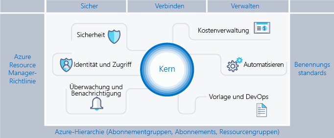
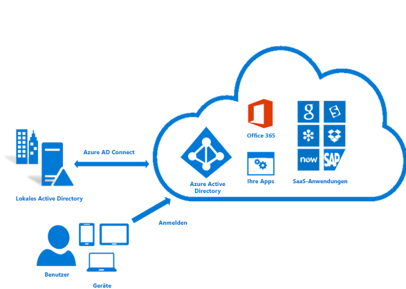
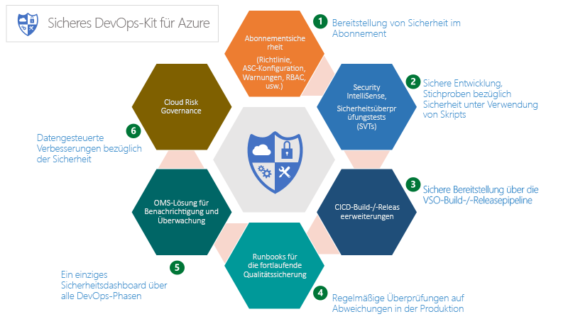
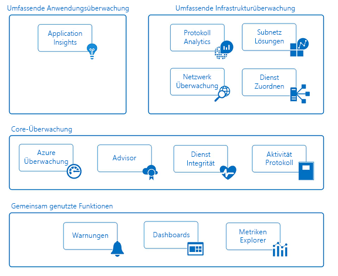

# Azure-Unternehmensgerüst: Präskriptive Abonnementgovernance

Immer mehr Unternehmen führen für Mobilität und Flexibilität eine öffentliche Cloud ein. Sie nutzen die Stärken der Cloud, um Umsatz zu generieren und die Ressourcennutzung im Unternehmen zu optimieren. Microsoft Azure bietet eine Vielzahl von Diensten und Funktionen, die Unternehmen wie Bausteine zusammenstellen können, um ein umfangreiches Spektrum an Workloads und Anwendungen zu berücksichtigen.

Die Entscheidung für Microsoft Azure ist nur der erste Schritt auf dem Weg zur Cloud und ihren Vorteilen. Der zweite Schritt besteht darin, zu erkennen, wie das Unternehmen Azure effektiv einsetzen kann, und die grundlegenden Funktionen zu ermitteln, mit denen folgende Fragen beantwortet werden können:

* Ich mache mir Sorgen um die Datenhoheit – wie kann ich sicherstellen, dass meine Daten und Systeme unsere gesetzlich vorgegebenen Anforderungen erfüllen?
* Wie erfahre ich, was die einzelnen Ressourcen unterstützen, damit ich sie genau zuordnen und abrechnen kann?
* Ich möchte sicherstellen, dass bei allem, was wir in der Cloud tun oder bereitstellen, die Sicherheit immer an oberster Stelle steht. Wie erreiche ich das?

Die Vorstellung eines leeren Abonnements ohne Schutzmaßnahmen wirkt abschreckend und kann Ihre Umstellung auf Azure behindern.

Dieser Artikel bietet einen Ausgangspunkt für technische Experten, die die Notwendigkeit der Governance berücksichtigen und mit der Notwendigkeit der Agilität in Einklang bringen müssen. Es wird das Konzept eines Unternehmensgerüsts vorgestellt, das Organisationen beim sicheren Implementieren und Verwalten ihrer Azure-Umgebungen hilft. Der Artikel stellt das Framework bereit, mit dem sich effektive und effiziente Steuerungsmaßnahmen entwickeln lassen.

## Notwendigkeit von Governance

Beim Wechsel zu Azure müssen Sie das Thema Governance früh angehen, um die erfolgreiche Verwendung der Cloud innerhalb des Unternehmens sicherzustellen. Leider führen der zeitliche und bürokratische Aufwand beim Erstellen eines umfassenden Governancesystems dazu, dass sich einige Unternehmensgruppen direkt an Anbieter wenden, ohne die eigene IT-Abteilung einzubeziehen. Durch diesen Ansatz können im Unternehmen Sicherheitsrisiken entstehen, wenn die Ressourcen nicht richtig verwaltet werden. Die Eigenschaften der öffentlichen Cloud – Agilität, Flexibilität und nutzungsbasierte Preise – sind wichtig für Unternehmensgruppen, die schnell die Anforderungen von Kunden (intern und extern) erfüllen müssen. Aber die Unternehmens-IT muss sicherstellen, dass Daten und Systeme effektiv geschützt sind.

Beim Bau eines Hauses wird ein Gerüst verwendet, um die Basis der Struktur zu erstellen. Das Gerüst gibt die allgemeine Gliederung vor und bietet Ankerpunkte für den Aufbau permanenterer Systeme. Ein Unternehmensgerüst entspricht einer Reihe von flexiblen Steuerelementen und Azure-Funktionen, die der Umgebung eine Struktur geben, sowie Ankern für die in der öffentlichen Cloud erstellten Dienste. Es bietet den Entwicklern (IT und Unternehmensgruppen) eine Grundlage zum Erstellen und Einbinden von neuen Diensten, wobei eine schnelle Bereitstellung eine große Rolle spielt.

Das Gerüst basiert auf Methoden, die wir bei der Zusammenarbeit mit vielen Kunden verschiedener Größen gesammelt haben. Zu diesen Kunden gehören kleine Organisationen, die Lösungen in der Cloud entwickeln, multinationale Großkonzerne sowie unabhängige Softwarehersteller, die Workloads migrieren und Lösungen in der und für die Cloud entwickeln. Das Unternehmensgerüst wurde speziell so flexibel entwickelt, dass es sowohl herkömmliche IT-Workloads als auch agile Workloads unterstützt, wie z.B. Entwickler, die Software-as-a-Service-Anwendungen (SaaS) basierend auf Funktionen der Azure-Plattform erstellen.

Das Unternehmensgerüst ist als Basis für jedes neue Abonnement in Azure vorgesehen. Administratoren können damit sicherstellen, dass Workloads in einer Organisation die minimalen Anforderungen an Governance erfüllen, ohne zu verhindern, dass Unternehmensgruppen und Entwickler schnell ihre eigenen Ziele erreichen. Unsere Erfahrung zeigt, dass dies das Wachstum der öffentlichen Cloud eher beschleunigt als hemmt.

> [!NOTE]
> Microsoft hat eine neue Funktion namens [Azure Blueprints](/azure/governance/blueprints/overview) in der Vorschau bereitgestellt, mit der Sie häufig genutzte Images, Vorlagen, Richtlinien und Skripts über viele Abonnements und Verwaltungsgruppen hinweg packen, verwalten und bereitstellen können. Diese Funktion dient als Brücke zwischen dem Zweck des Gerüsts als Referenzmodell und der Bereitstellung des Modells in Ihrer Organisation.
>
Die folgende Abbildung zeigt die Komponenten des Gerüsts. Das Fundament ist ein gut durchdachter Plan für die Verwaltung von Hierarchien und Abonnements. Die Säulen bestehen aus Resource Manager-Richtlinien und soliden Benennungsstandards. Das restliche Gerüst besteht aus zentralen Azure-Funktionen und -Features, die eine sichere und verwaltbare Umgebung ermöglichen und für die notwendige Vernetzung sorgen.

## Definieren der Hierarchie

Das Gerüst basiert auf der Hierarchie der Azure Enterprise-Registrierung bis hin zu den Abonnements und Ressourcengruppen sowie auf deren Beziehungen untereinander. Die Unternehmensregistrierung definiert die Form und die Nutzung der Azure-Dienste in Ihrem Unternehmen unter vertraglichen Aspekten. Im Rahmen des Enterprise Agreement können Sie die Umgebung weiter in Abteilungen und Konten und schließlich in Abonnements und Ressourcengruppen unterteilen, um Ihre Organisationsstruktur widerzuspiegeln.

Ein Azure-Abonnement ist die grundlegende Einheit, in der alle Ressourcen enthalten sind. Es definiert zudem einige Einschränkungen in Azure, wie z.B. die Anzahl der Kerne, virtuellen Netzwerke und anderer Ressourcen. Mit Azure-Ressourcengruppen lässt sich das Abonnementmodell weiter verfeinern, und die Ressourcen können auf natürlichere Weise gruppiert werden.

Jedes Unternehmen ist anders, und die Hierarchie der oben gezeigten Abbildung lässt sehr viel Flexibilität im Hinblick auf den Aufbau von Azure in Ihrem Unternehmen zu. Die Modellierung Ihrer Hierarchie anhand der Anforderungen Ihres Unternehmens hinsichtlich Abrechnung, Ressourcenverwaltung und Ressourcenzugriff ist die erste – und wichtigste – Entscheidung, die Sie beim Einstieg in die öffentliche Cloud treffen müssen.

### Abteilungen und Konten

Die drei allgemeinen Muster für Azure-Registrierungen sind:

* Das auf **Funktionen** basierende Muster

    
* Das auf **Unternehmenseinheiten** basierende Muster

    
* Das auf **geografischen Regionen** basierende Muster

    

Jedes dieser Muster hat seine Vorteile, Organisationen nutzen aber zunehmend das Muster der **Unternehmenseinheiten**, da dieses sowohl Flexibilität beim Erstellen eines Kostenmodells für die Organisation auch eine große Bandbreite an Steuerungsmöglichkeiten bietet. Die Microsoft-Unternehmensgruppe „Core Engineering and Operations“ hat eine Teilmenge des auf **Unternehmenseinheiten** basierenden Musters erstellt, das sich als sehr effektiv erwiesen hat. Die Hierarchieebenen hierbei sind **Federal**, **State** und **Local**. (Weitere Informationen finden Sie unter [Organizing subscriptions and resource groups within the Enterprise](https://azure.microsoft.com/blog/organizing-subscriptions-and-resource-groups-within-the-enterprise/) [Organisieren von Abonnements und Ressourcengruppen im Unternehmen].)

### Verwaltungsgruppen

Microsoft hat vor Kurzem eine neue Möglichkeit für die Modellierung Ihrer Hierarchie vorgestellt: [Azure-Verwaltungsgruppen](/azure/azure-resource-manager/management-groups-overview). Verwaltungsgruppen sind wesentlich flexibler als Abteilungen und Konten und können auf bis zu sechs Ebenen geschachtelt werden. Mit Verwaltungsgruppen können Sie eine Hierarchie erstellen, die nur zur effizienten Verwaltung Ihrer Ressourcen dient und unabhängig von Ihrer Hierarchie für die Abrechnung ist. Verwaltungsgruppen können Ihre Abrechnungshierarchie spiegeln, und viele Unternehmen fangen auch so an. Die eigentliche Stärke von Verwaltungsgruppen zeigt sich aber erst, wenn Sie damit Ihre Organisation so modellieren, dass miteinander in Beziehung stehende Abonnements – unabhängig davon, auf welcher Ebene der Abrechnungshierarchie sie sich befinden – gruppiert und ihnen gemeinsame Rollen sowie Richtlinien und Initiativen zugewiesen werden. Einige Beispiele:

* **Produktionsbezogen/nicht produktionsbezogen**. Einige Unternehmen erstellen Verwaltungsgruppen, um Abonnements danach zu trennen, ob sie produktionsbezogen sind oder nicht. Diese Kunden können Rollen und Richtlinien mithilfe von Verwaltungsgruppen einfacher verwalten. Ein Beispiel: Entwickler können auf nicht produktionsbezogene Abonnements als „Mitwirkender“ zugreifen, auf Produktionsabonnements dagegen haben sie nur Zugriff als „Leser“.
* **Interne Dienste/Externe Dienste**. Ähnlich wie bei der Unterscheidung zwischen „nicht produktionsbezogen“ und „produktionsbezogen“ für Abonnements gibt es in vielen Unternehmen unterschiedliche Anforderungen, Richtlinien und Rollen für interne und externe (kundenorientierte) Dienste.

Sorgfältig konzipierte Verwaltungsgruppen sind neben Azure Policy und Azure-Initiativen das Rückgrat einer effizienten Governance in Azure.

### Abonnements

Wenn Sie Ihre Abteilungen und Konten (bzw. Verwaltungsgruppen) festlegen, liegt Ihr Hauptaugenmerk darauf, wie Sie Ihre Azure-Umgebung Ihrer Organisation entsprechend aufteilen. In den Abonnements dagegen findet die eigentliche Arbeit statt – daher wirken sich Ihre Entscheidungen hier auf Sicherheit, Skalierbarkeit und Abrechnung aus.  Viele Organisationen nutzen die folgenden Muster als Leitlinien:

* **Anwendung/Dienst:** Abonnements stellen eine Anwendung oder einen Dienst dar (Anwendungsportfolio).
* **Lebenszyklus:** Abonnements stellen einen Lebenszyklus eines Diensts dar (beispielsweise Produktion oder Entwicklung).
* **Abteilung:** Abonnements stellen Abteilungen in der Organisation dar.

Die ersten beiden Muster werden am häufigsten verwendet und sind sehr empfehlenswert. Der Lebenszyklusansatz eignet sich für die meisten Organisationen. In diesem Fall lautet die allgemeine Empfehlung, zwei grundlegende Abonnements zu verwenden. Eines wird als „produktionsbezogen“ festgelegt, das andere als „nicht produktionsbezogen“. Dann verwenden Sie Ressourcengruppen, um die Umgebung weiter zu unterteilen.

### Ressourcengruppen

Mit Azure Resource Manager können Sie Ressourcen in aussagekräftige Gruppen für Verwaltung, Abrechnung oder natürliche Affinität aufteilen. Ressourcengruppen sind Container für Ressourcen, die einen gemeinsamen Lebenszyklus oder gleiche Attribute wie „alle SQL Server-Instanzen“ oder „Anwendung A“ aufweisen.

Ressourcengruppen dürfen nicht geschachtelt sein, und Ressourcen dürfen nur zu einer einzigen Ressourcengruppe gehören. Einige Aktionen gelten für alle Ressourcen in einer Ressourcengruppe. Durch das Löschen einer Ressourcengruppe werden beispielsweise alle Ressourcen innerhalb der Ressourcengruppe entfernt. Ähnlich wie bei Abonnements gibt es beim Erstellen von Ressourcengruppen allgemeine Muster: Workloads der „herkömmlichen IT“ und Workloads der „agilen IT“:

* Workloads der „herkömmlichen IT“ werden meist nach Elementen innerhalb des gleichen Lebenszyklus gruppiert, z.B. nach einer Anwendung. Eine Gruppierung nach Anwendung ermöglicht die Verwaltung einzelner Anwendungen.
* Workloads der „agilen IT“ konzentrieren sich in der Regel auf Cloudanwendungen, die externen Kunden zugänglich sind. Die Ressourcengruppen spiegeln häufig die Ebenen der Bereitstellung (z.B. Webschicht, App-Schicht) und der Verwaltung wider.

> [!NOTE]
> Das Verständnis Ihrer Workloads erleichtert es Ihnen, eine Strategie für Ressourcengruppen zu entwickeln. Diese Muster können nach Bedarf kombiniert werden. Eine Ressourcengruppe für gemeinsame Dienste kann sich beispielsweise im gleichen Abonnement befinden wie „agile“ Ressourcengruppen.

## Benennungsstandards

Die erste Säule des Gerüsts ist ein konsistenter Benennungsstandard. Mit sorgfältig konzipierten Benennungsstandards können Sie Ressourcen im Portal, auf einer Rechnung und innerhalb von Skripts identifizieren. Wahrscheinlich verwenden Sie bereits Benennungsstandards für die lokale Infrastruktur. Wenn Sie Azure zu Ihrer Umgebung hinzufügen, sollten Sie diese Benennungsstandards für Azure-Ressourcen übernehmen.

> [!TIP]
> Informationen zu Benennungskonventionen:
> * Lesen Sie den [Leitfaden mit Mustern und Verfahren](https://docs.microsoft.com/en-us/azure/architecture/best-practices/naming-conventions), und übernehmen Sie ihn wo möglich. Dieser Leitfaden hilft Ihnen bei der Entscheidung für einen sinnvollen Benennungsstandard und bietet viele Beispiele.
> * Verwenden von Resource Manager-Richtlinien zum Durchsetzen von Benennungsstandards
>
>Denken Sie immer daran, dass sich Namen später nur sehr schwer ändern lassen – nehmen Sie sich also jetzt genügend Zeit, damit später keine Probleme auftreten.

Konzentrieren Sie sich bei Ihren Benennungsstandards auf die Ressourcen, die am häufigsten gesucht und verwendet werden.  Ressourcengruppen sollten z.B. aus Gründen der Klarheit einem sehr strikten Standard folgen.

### Ressource Tags

Ressourcentags sind eng an Benennungsstandards gekoppelt. Je mehr Ressourcen den Abonnements hinzugefügt werden, desto wichtiger wird es, diese für Abrechnung, Verwaltung und Betrieb logisch zu kategorisieren. Weitere Informationen finden Sie unter [Verwenden von Tags zum Organisieren von Azure-Ressourcen](https://docs.microsoft.com/en-us/azure/azure-resource-manager/resource-group-using-tags).

> [!IMPORTANT]
> Tags können persönliche Informationen enthalten und fallen möglicherweise unter die DSGVO. Planen Sie die Verwaltung Ihrer Tags sorgfältig. Allgemeine Informationen zur Datenschutz-Grundverordnung finden Sie im [Service Trust Portal](https://servicetrust.microsoft.com/ViewPage/GDPRGetStarted) im Abschnitt zur DSGVO.

Tags dienen neben der Abrechnung und Verwaltung zu vielen weiteren Zwecken. Sie werden häufig im Rahmen der Automatisierung verwendet (siehe Abschnitt weiter unten). Dies kann bei unzureichender Vorausplanung zu Konflikten führen. Die empfohlene Vorgehensweise besteht darin, alle gemeinsamen Tags auf Unternehmensebene (z.B. ApplicationOwner oder CostCenter) zu identifizieren und sie konsistent anzuwenden, wenn Ressourcen automatisiert bereitgestellt werden.

## Azure Policy und Azure-Initiativen

Die zweite Säule des Gerüsts ist die Verwendung von [Azure Policy und Azure-Initiativen](/azure/azure-policy/azure-policy-introduction) für das Risikomanagement, indem Regeln (mit Auswirkungen) für die Ressourcen und Dienste in Ihren Abonnements erzwungen werden. Azure-Initiativen sind Sammlungen aus Richtlinien, die alle einem einzigen Ziel dienen. Azure Policy und Azure-Initiativen werden dann einem Ressourcenbereich zugewiesen, um die Erzwingung dieser Richtlinien zu starten.

Azure Policy und Azure-Initiativen sind noch leistungsstärker, wenn sie mit den oben beschriebenen Verwaltungsgruppen eingesetzt werden. Verwaltungsgruppen ermöglichen die Zuweisung einer Initiative oder Richtlinie zu einer ganzen Gruppe von Abonnements.

### Allgemeine Verwendungsmöglichkeiten von Resource Manager-Richtlinien

Richtlinien und Initiativen sind leistungsfähige Tools im Azure-Toolkit. Mit Richtlinien können Unternehmen Steuerungsmechanismen für Workloads der „herkömmlichen IT“ bereitstellen, um die Stabilität zu gewährleisten, die für LOB-Anwendungen benötigt wird. Gleichzeitig unterstützen die Richtlinien auch „agile“ Workloads, z.B. das Entwickeln von Kundenanwendungen, ohne das Unternehmen zusätzlichen Risiken auszusetzen. Die am häufigsten verwendeten Muster für Richtlinien sind:

* **Geografische Compliance/Datenhoheit**. Die Liste der weltweiten Azure-Regionen wächst kontinuierlich. Unternehmen müssen häufig sicherstellen, dass Ressourcen in einem bestimmten Bereich innerhalb einer geografischen Region bleiben, um gesetzliche Vorschriften zu erfüllen.
* **Vermeidung öffentlich verfügbarer Server**. Azure Policy kann die Bereitstellung bestimmter Ressourcentypen verhindern. Ein gängiges Szenario besteht darin, eine Richtlinie zu erstellen, um das Erstellen einer öffentlichen IP-Adresse innerhalb eines bestimmten Bereichs zu verweigern und so zu verhindern, dass der Server unabsichtlich im Internet verfügbar gemacht wird.
* **Kostenmanagement und Metadaten**. Ressourcentags werden häufig dazu verwendet, wichtige Abrechnungsdaten zu Ressourcen und Ressourcengruppen wie CostCenter, Owner oder anderen hinzuzufügen. Diese Tags sind für eine präzise Abrechnung und Verwaltung der Ressourcen von unschätzbarem Wert. Richtlinien können die Anwendung von Ressourcentags auf alle bereitgestellten Ressourcen erzwingen und vereinfachen damit die Verwaltung.

### Gängige Nutzungsszenarien für Initiativen

Mit der Einführung von Initiativen erhalten Unternehmen eine Möglichkeit, logische Richtlinien zu gruppieren und als Ganzes nachzuverfolgen. Initiativen unternehmen zudem das Unternehmen dabei, die Anforderungen sowohl von „agilen“ als auch von „herkömmlichen“ Workloads zu erfüllen. Wir kennen einige sehr kreative Verwendungen von Initiativen – die häufigsten Szenarien sind aber diese:

* **Aktivieren der Überwachung im Azure Security Center**. Dies ist eine Standardinitiative in Azure Policy und ein ausgezeichnetes Beispiel dafür, was eine Initiative eigentlich ist. Diese Initiative aktiviert Richtlinien, die nicht verschlüsselte SQL-Datenbanken, Sicherheitslücken in VMs und allgemeinere Sicherheitsanforderungen ermitteln.
* **Initiative für bestimmte gesetzliche Vorschriften**. Unternehmen gruppieren häufig Richtlinien, für die die gleiche gesetzliche Vorschrift gilt (z.B. HIPAA), sodass die Steuerungsmechanismen und die Einhaltung dieser Mechanismen effizient nachverfolgt werden können.
* **Ressourcentypen und SKUs**. Mit einer Initiative zur Einschränkung der bereitstellbaren Ressourcentypen und SKUs können Sie Kosten senken und sicherstellen, dass Ihre Organisation nur solche Ressourcen bereitstellt, die von Ihrem Team aufgrund der vorhandenen Kenntnisse und Verfahren unterstützt werden können.

> [!TIP]
> Es empfiehlt sich, immer Initiativendefinitionen zu verwenden, keine Richtliniendefinitionen. Nachdem Sie eine Initiative zu einem Bereich zugewiesen haben, wie z.B. einem Abonnement oder einer Verwaltungsgruppe, können Sie der Initiative ganz einfach weitere Richtlinien hinzufügen, ohne Zuweisungen ändern zu müssen. So erhalten Sie einen wesentlich besseren Überblick darüber, welche Richtlinien angewendet wurden, und können die Compliance einfacher nachverfolgen.

### Richtlinien- und Initiativenzuweisungen

Nachdem Sie Richtlinien erstellt und in logische Initiativen gruppiert haben, müssen Sie eine Richtlinie einem Bereich zuweisen – dabei kann es sich um eine Verwaltungsgruppe, ein Abonnement oder sogar eine Ressourcengruppe handeln. Durch Zuweisungen können Sie auch einen Teilbereich aus der Zuweisung einer Richtlinie ausschließen. Ein Beispiel: Wenn Sie die Erstellung öffentlicher IP-Adressen in einem Abonnement verweigern, können Sie eine Zuweisung mit einem Ausschluss für eine Ressourcengruppe erstellen, die mit Ihrer geschützten DMZ verbunden ist.

In [diesem GitHub-Repository](https://github.com/Azure/azure-policy) finden Sie verschiedene Beispiele, die veranschaulichen, wie Azure Policy und Azure-Initiativen auf verschiedene Ressourcen in Azure angewendet werden können.

## Identitäts- und Zugriffsverwaltung

Eine der ersten und entscheidendsten Fragen, die Sie sich vor dem Einstieg in die öffentliche Cloud stellen sollten, lautet „Wer darf auf die Ressourcen zugreifen und wie dieser Zugriff gesteuert werden kann. Das Zulassen oder Untersagen des Zugriffs auf das Azure-Portal und das Steuern des Zugriffs auf Ressourcen im Portal ist entscheidend für den langfristigen Erfolg und die Sicherheit Ihrer Ressourcen in der Cloud.

Um den Zugriff auf Ihre Ressourcen zu sichern, konfigurieren Sie zuerst Ihren Identitätsanbieter und dann die Rollen und den Zugriff. Azure Active Directory (Azure AD) – verknüpft mit Ihrem lokalen Active Directory – ist die Grundlage von Identitäten in Azure. Azure AD ist allerdings *nicht* Active Directory, und es ist wichtig zu wissen, was ein Azure AD-Mandant ist und wie Mandanten mit Ihrer Azure-Registrierung in Verbindung stehen.  Sehen Sie sich die verfügbaren [Informationen](../getting-started/azure-resource-access.md) an, um ein solides Grundwissen zu Azure AD und AD zu erhalten. Um Ihr Active Directory mit Azure AD zu verbinden und zu synchronisieren, installieren und konfigurieren Sie das [AD Connect-Tool](/azure/active-directory/connect/active-directory-aadconnect) lokal.

Als Azure ursprünglich veröffentlicht wurde, waren Zugriffssteuerungen für ein Abonnement sehr einfach: Administrator oder Co-Administrator. Durch den Zugriff auf ein Abonnement im klassischen Modell war Zugriff auf alle Ressourcen im Portal möglich. Dieses Fehlen einer präziseren Steuerung hat zur Zunahme von Abonnements geführt, um eine angemessene Zugriffssteuerung für eine Azure-Registrierung bereitzustellen. Diese Zunahme von Abonnements ist nicht mehr erforderlich. Mit der rollenbasierten Zugriffssteuerung (Role-Based Access Control, RBAC) können Sie Benutzer zu Standardrollen zuweisen, die Zugriffsrechte als „Besitzer“, „Mitwirkender“ oder „Leser“ gewähren. Sie können auch selbst Rollen erstellen.

Beim Implementieren des rollenbasierten Zugriffs empfiehlt es sich dringend, folgende Punkte zu beachten:

* Kontrollieren Sie den Administrator/Co-Administrator eines Abonnements sehr genau, da diese Rollen über umfassende Berechtigungen verfügen. Sie müssen das Konto „Abonnementbesitzer“ nur dann als Co-Administrator hinzufügen, wenn der Benutzer klassische Azure-Bereitstellungen verwalten soll.

* Verwenden Sie Verwaltungsgruppen, um [Rollen](/azure/azure-resource-manager/management-groups-overview#management-group-access) für mehrere Abonnements zuzuweisen und so den Aufwand für die Verwaltung auf Abonnementebene zu reduzieren.
* Fügen Sie Azure-Benutzer einer Gruppe (z.B. Besitzer von Anwendung X) in Active Directory hinzu. Verwenden Sie die synchronisierte Gruppe, um Mitgliedern der Gruppe die erforderlichen Rechte zum Verwalten der Ressourcengruppe, die die Anwendung enthält, zu gewähren.
* Befolgen Sie das Prinzip, die **geringsten Rechte** zu gewähren, die zur Erledigung der erwarteten Arbeit erforderlich sind.

> [!IMPORTANT]
>Nutzen Sie die Funktionen [Azure AD Privileged Identity Management](/azure/active-directory/privileged-identity-management/pim-configure) (PIM), Azure [Multi-Factor Authentication](/azure/active-directory/authentication/howto-mfa-getstarted) und [Bedingter Zugriff](/azure/active-directory/active-directory-conditional-access-azure-portal), um für mehr Sicherheit und Transparenz für alle administrativen Aktivitäten in sämtlichen Azure-Abonnements zu sorgen. Diese Funktionen werden mit einer gültigen Azure AD Premium-Lizenz (je nach Feature) bereitgestellt, um Ihre Identitäten noch besser zu sichern und zu verwalten. Azure AD PIM ermöglicht den Just-in-Time-Verwaltungszugriff mit einem Genehmigungsworkflow sowie die vollständige Überwachung der Aktivierungen und Aktivitäten eines Administrators. Azure MFA ist eine weitere wichtige Funktion und ermöglicht eine zweistufige Überprüfung bei der Anmeldung beim Azure-Portal. In Kombination mit den Steuerungsmöglichkeiten des bedingten Zugriffs können Sie das Risiko einer Kompromittierung effektiv senken.

Die Planung und Vorbereitung von Identität und Zugriffssteuerung sowie das Befolgen von [bewährten Methoden beim Azure Identity Management](/azure/security/azure-security-identity-management-best-practices) stellt eine der besten Strategien für die Risikominderung dar, die Sie anwenden könne, und sollte für jede Bereitstellung als obligatorisch betrachtet werden.

## Sicherheit

Eines der größten Hindernisse bei der Einführung der Cloud sind seit jeher Bedenken wegen der Sicherheit. IT-Risikomanager und für Sicherheitsabteilungen müssen sicherstellen, dass der Schutz und die Sicherheit der Ressourcen in Azure standardmäßig gewährleistet sind. Azure bietet eine Reihe von Funktionen, mit denen Sie Ressourcen schützen und Bedrohungen dieser Ressourcen erkennen und verhindern können.

### Azure Security Center

Das [Azure Security Center](/azure/security-center/security-center-intro) bietet eine einheitliche Ansicht des Sicherheitsstatus aller Ressourcen in Ihrer Umgebung sowie Funktionen für einen erweiterten Schutz vor Bedrohungen. Das Azure Security Center ist eine offene Plattform, über die Microsoft-Partner Softwareanwendungen erstellen können, die eingebunden werden und die Funktionalität erweitern. Die grundlegenden Funktionen von Azure Security Center (kostenloser Tarif) bieten Bewertungen und Empfehlungen, die Ihren Sicherheitsstatus verbessern. Die zahlungspflichtigen Tarife bieten zusätzliche wertvolle Funktionen wie z.B. Just-in-Time-Zugriff und adaptive Anwendungssteuerung (per Whitelists).

> [!TIP]
>Das Azure Security Center ist ein sehr leistungsfähiges Tool, das fortlaufend erweitert wird und immer neue Funktionen bietet, mit denen Sie Bedrohungen erkennen und Ihr Unternehmen schützen können. Es wird dringend empfohlen, das ASC immer zu aktivieren.

### Azure-Ressourcensperren

Je mehr zentrale Dienste Ihre Organisation zu Abonnements hinzufügt, desto wichtiger wird es, eine Unterbrechung des Geschäftsbetriebs zu vermeiden. Eine Art der Unterbrechung, die sich häufig beobachten lässt, ist eine unbeabsichtigte Folge der Verwendung von Skripts und Tools für ein Azure-Abonnement, wodurch versehentlich Ressourcen gelöscht werden. Mit [Ressourcensperren](/azure/azure-resource-manager/resource-group-lock-resources) können Sie Vorgänge für wertvolle Ressourcen einschränken, bei denen eine Änderung oder Löschung erhebliche Auswirkungen hätte. Sperren können auf ein Abonnement, eine Ressourcengruppe oder sogar auf einzelne Ressourcen angewendet werden. Am häufigsten werden Sperren auf grundlegende Ressourcen wie virtuelle Netzwerke, Gateways, Netzwerksicherheitsgruppen und wichtige Speicherkonten angewendet.

### Secure DevOps Toolkit

Das „Secure DevOps Kit for Azure“ (AzSK) ist eine Sammlung aus Skripts, Tools, Erweiterungen, Automatisierungen usw., die ursprünglich vom Microsoft-IT-Team erstellt und über [GitHub](https://github.com/azsk/DevOpsKit-docs) als Open Source-Features veröffentlicht wurden. Das AzSK erfüllt alle Sicherheitsanforderungen von Azure-Abonnements und -Ressourcen für Teams, indem es eine umfassende Automatisierung und eine nahtlose Integration der Sicherheit in native DevOps-Workflows bietet. So sorgt es für sichere DevOps-Prozesse mit diesen sechs Schwerpunktbereichen:

* Sichern des Abonnements
* Ermöglichen einer sicheren Entwicklung
* Integrieren der Sicherheit in CI/CD
* Fortlaufende Sicherung
* Warnung und Überwachung
* Governance zum Senken von Cloudrisiken

Das AzSK umfasst eine Vielzahl von Tools, Skripts und Informationen, die ein wichtiger Bestandteil einer umfangreichen Azure-Governanceplanung sind. Um die Ziele Ihrer Organisation hinsichtlich des Risikomanagements zu unterstützen, ist es von entscheidender Bedeutung, dieses Toolkit in Ihr Gerüst einzubauen.

### Azure-Updateverwaltung

Eine der wichtigsten Aufgaben bei der Sicherung Ihrer Umgebung ist Folgendes: Sie müssen sicherstellen, dass immer die neuesten Patches auf Ihre Server aufgespielt werden. Es gibt verschiedene Tools für diesen Zweck. Azure bietet die [Azure-Updateverwaltung](/azure/automation/automation-update-management) für die Identifikation und das Rollout wichtiger Betriebssystempatches.  Die Updateverwaltung nutzt dazu Azure Automation (dieser Dienst wird weiter unten in diesem Leitfaden im Abschnitt [Automatisieren](#automate) erläutert).

## Überwachung und Warnungen

Das Sammeln und Analysieren von Telemetriedaten, die Einblicke in die Aktivitäten, Leistungsmetriken, Integrität und Verfügbarkeit der Dienste bieten, die Sie in all Ihren Azure-Abonnements verwenden, ist von entscheidender Bedeutung bei der proaktiven Verwaltung Ihrer Anwendungen und Infrastruktur und eine grundlegende Anforderung jedes Azure-Abonnements. Jeder Azure-Dienst gibt Telemetriedaten in Form von Aktivitätsprotokollen, Metriken und Diagnoseprotokollen aus.

* **Aktivitätsprotokolle** beschreiben alle Vorgänge, die in den Ressourcen in Ihren Abonnements durchgeführt wurden.
* **Metriken** sind Zahlendaten, die von einer Ressource ausgegeben werden und die Leistung und Integrität einer Ressource beschreiben.
* **Diagnoseprotokolle** werden von einem Azure-Dienst ausgegeben und stellen umfangreiche und in kurzen Abständen erfasste Daten zum Betrieb dieses Diensts bereit.

Sie können diese Daten auf verschiedenen Ebenen betrachten und Aktionen daraus ableiten, und die Daten werden kontinuierlich verbessert. Azure bietet **gemeinsam genutzte**, **grundlegende** und **tiefgreifende** Überwachungsfunktionen für Azure-Ressourcen durch die in der Abbildung unten gezeigten Dienste.

### Gemeinsam genutzte Funktionen

* **Warnungen**: Sie können jedes Protokoll, jedes Ereignis und jede Metrik von Azure-Ressourcen erfassen, aber ohne die Möglichkeit, bei kritischen Bedingungen eine Benachrichtigung zu erhalten und reagieren zu können, sind diese Daten nur für Rückschauen und forensische Analysen zu gebrauchen. Azure Alerts benachrichtigt Sie proaktiv bei Bedingungen, die Sie für all Ihre Anwendungen und die gesamte Infrastruktur definieren können. Sie erstellen Warnungsregeln für Protokolle, Ereignisse und Metriken, die Aktionsgruppen verwenden, um bestimmte Empfängergruppen zu benachrichtigen. Aktionsgruppen ermöglichen auch automatische Korrekturen mithilfe von externen Aktionen wie z.B. Webhooks zum Ausführen von Azure Automation-Runbooks und Azure Functions.

* **Dashboards**: Mit Dashboards können Sie ressourcen- und abonnementübergreifend Überwachungsansichten aggregieren und Daten kombinieren, um einen Einblick in die Telemetriedaten Ihrer Azure-Ressourcen im gesamten Unternehmen zu erhalten. Sie können selbst Ansichten erstellen, konfigurieren und mit für andere Benutzer freigeben. Ein Beispiel: Sie können ein aus verschiedenen Kacheln für DBAs bestehendes Dashboard erstellen, um Informationen für sämtliche Azure-Datenbankdienste wie etwa Azure SQL DB, Azure DB for PostgreSQL und Azure DB for MySQL bereitzustellen.

* **Metrik-Explorer**: Metriken sind numerische Werte, die von Azure-Ressourcen generiert werden und Erkenntnisse zu Betrieb und Leistung Ihrer Ressourcen bieten. Beispiele hierfür sind etwa der Prozentsatz der CPU-Auslastung oder Datenträger-E/A-Vorgänge. Mit dem Metrik-Explorer können Sie die Metriken, die Sie interessieren, definieren und zur Aggregation und Analyse an Log Analytics senden.

### Kernüberwachung

* **Azure Monitor**: Azure Monitor ist der grundlegende Plattformdienst, mit dem Sie Ihre Azure-Ressourcen an einem zentralen Ort verwalten können. Die Azure-Portal-Schnittstelle von Azure Monitor bietet einen zentralen Startpunkt für alle Überwachungsfunktionen in Azure, einschließlich der tiefgreifenden Überwachungsfunktionen von Application Insights, Log Analytics, Network Monitoring, Management Solutions und Service Maps. Mit Azure Monitor können Sie Metriken und Protokolle aus Azure-Ressourcen in Ihrer gesamten Cloudstruktur visualisieren, abfragen, weiterleiten und archivieren und ggf. notwendige Maßnahmen ergreifen. Sie können Daten nicht nur über das Portal, sondern auch über PowerShell-Cmdlets, eine plattformübergreifende Befehlszeilenschnittstelle oder die Azure Monitor-REST-APIs abrufen.

* **Azure Advisor**: Azure Advisor überwacht kontinuierlich Telemetriedaten aus allen Ihren Abonnements und Umgebungen und bietet Empfehlungen zu bewährten Methoden, mit denen Sie Ihre Azure-Ressourcen optimieren können, um Geld zu sparen und die Leistung, Sicherheit und Verfügbarkeit der Ressourcen zu verbessern, auf denen Ihre Anwendungen basieren.

* **Service Health**: Azure Service Health erkennt Probleme bei Azure-Diensten, die sich auf Ihre Anwendungen auswirken können, und unterstützt Sie bei der Planung von Wartungsfenstern.

* **Aktivitätsprotokoll**: Im Aktivitätsprotokoll werden sämtliche Vorgänge beschrieben, die für Ressourcen in Ihren Abonnements ausgeführt wurden. Sie erhalten ein Überwachungsprotokoll, mit dem Sie das „Was“, „Wer“ und „Wann“ aller Erstellungs-, Aktualisierungs- und Löschvorgänge in Ressourcen ermitteln können. Aktivitätsprotokollereignisse werden auf der Plattform gespeichert und sind 90 Tage verfügbar. Sie können Aktivitätsprotokolle in Log Analytics einspeisen, um eine längere Beibehaltungsdauer sowie tiefgreifendere Abfragen und Analysen über mehrere Ressourcen hinweg zu erzielen.

### Umfassende Anwendungsüberwachung

* **Application Insights**: Mit Application Insights können Sie anwendungsspezifische Telemetriedaten sammeln und die Leistung, Verfügbarkeit und Nutzung von Anwendungen in der Cloud oder Ihrer lokalen Umgebung überwachen. Statten Sie zu diesem Zweck Ihre Anwendung mit den unterstützten SDKs für verschiedene Sprachen aus, wie etwa .NET, JavaScript, JAVA, Node.js, Ruby und Python. Application Insights-Ereignisse werden im gleichen Log Analytics-Datenspeicher erfasst, der die Infrastruktur- und Sicherheitsüberwachung unterstützt, sodass Sie Ereignisse mithilfe einer umfangreichen Abfragesprache über einen bestimmten Zeitraum korrelieren und aggregieren können.

### Umfassende Infrastrukturüberwachung

* **Log Analytics**: Log Analytics spielt eine zentrale Rolle bei der Azure-Überwachung, da er Telemetriedaten und andere Daten aus vielen verschiedenen Quellen sammelt sowie eine Abfragesprache und eine Analyse-Engine bereitstellt, damit Sie Einblicke in die Abläufe Ihrer Anwendungen und Ressourcen erhalten. Sie können über leistungsfähige Protokollsuchvorgänge und -ansichten direkt mit Log Analytics-Daten interagieren, oder Sie können Analysetools in anderen Azure-Diensten nutzen – z.B. Application Insights oder Azure Security Center –, die Daten in Log Analytics speichern.

* **Netzwerküberwachung**: Mit den Netzwerküberwachungsdiensten von Azure erhalten Sie Einblicke in Netzwerkdatenverkehr, Leistung, Sicherheit, Konnektivität und Engpässe. Ein sorgfältig geplanter Netzwerkentwurf sollte die Konfiguration von Azure-Netzwerküberwachungsdiensten wie z.B. Network Watcher und ExpressRoute Monitor umfassen.

* **Verwaltungslösungen**: Verwaltungslösungen sind Pakete mit Logik, Einblicken und vordefinierten Log Analytics-Abfragen für eine Anwendung oder einen Dienst. Log Analytics bildet die Grundlage für die Speicherung und Analyse von Ereignisdaten. Zu den Verwaltungslösungen gehören beispielsweise die Überwachung von Containern und die Azure SQL-Datenbank-Analyse.

* **Dienstzuordnung**: Die Dienstzuordnung bietet eine grafische Darstellung Ihrer Infrastrukturkomponenten sowie der zugehörigen Prozesse und gegenseitigen Abhängigkeiten mit anderen Computern und externen Prozessen. Die Dienstzuordnung integriert Ereignisse, Leistungsdaten und Verwaltungslösungen in Log Analytics.

> [!TIP]
> Bevor Sie einzelne Warnungen erstellen, erstellen und verwalten Sie einen Satz freigegebener Aktionsgruppen, die für alle Azure-Warnungen verwendet werden können. So können Sie den Lebenszyklus Ihrer Empfängerlisten, Methoden für die Nachrichtenübermittlung (E-Mail, SMS, Telefonnummern) und Webhooks zu externen Aktionen (Azure Automation-Runbooks, Azure Functions / Logic Apps, ITSM) zentral verwalten.

## Kostenverwaltung

Eine der wichtigsten Veränderungen, die ein Umstieg von der lokalen in die öffentliche Cloud mit sich bringt, ist die Art der Finanzierung: Diese verlagert sich vom Kapitalaufwand (Hardwarekauf) hin zum Betriebsaufwand (Zahlung nur für tatsächlich genutzte Dienste). Dieser Wechsel führt auch zu der Notwendigkeit, die Kosten noch sorgfältiger zu kontrollieren. Der große Vorteil der Cloud besteht darin, dass Sie die Kosten eines von Ihnen genutzten Diensts grundlegend und positiv beeinflussen können, indem Sie den Dienst einfach deaktivieren (oder herunterskalieren), wenn Sie ihn nicht benötigen. Die Verwaltung der Kosten in der Cloud ist eine empfohlene Vorgehensweise, die erfahrene Kunden bereits täglich befolgen.

Microsoft stellt Ihnen verschiedene Tools zur Verfügung, mit denen Sie Ihre Kosten visualisieren, nachverfolgen und verwalten können. Wir bieten Ihnen auch einen vollständigen Satz APIs, mit denen Sie das Kostenmanagement anpassen und in Ihre eigenen Tools und Dashboards integrieren können. Diese Tools sind grob in zwei Gruppen zusammengefasst: Azure-Portal-Funktionen und externe Funktionen.

### Azure-Portal-Funktionen

Diese Tools stellen Ihnen sofortige Informationen zu Kosten bereit und bieten die Möglichkeit, sofort Aktionen auszuführen.

* **Kosten für Abonnementressourcen**: Die Ansicht [Azure-Kostenanalyse](/azure/cost-management/overview) im Portal bietet einen schnellen Überblick über Ihre Kosten sowie Informationen zu den täglichen Ausgaben, aufgeschlüsselt nach Ressource oder Ressourcengruppe.
* **Azure Cost Management**: Dieses Produkt ist das Ergebnis der Übernahme von Cloudyn durch Microsoft und ermöglicht es Ihnen, Ihre Azure-Ausgaben sowie Ihre Ausgaben für andere Anbieter öffentlicher Clouds zu verwalten und zu analysieren. Das Produkt bietet sowohl kostenlose als auch kostenpflichtige Tarife sowie eine Vielzahl von Funktionen. In der [Übersicht](/azure/cost-management/overview) finden Sie mehr dazu.
* **Azure-Budgets und Azure-Aktionsgruppen**: Herauszufinden, was wie viel kostet, und diese Kosten möglicherweise zu senken, war bis vor Kurzem eine eher manuelle Aufgabe. Mit der Einführung von Azure-Budgets und der zugehörigen APIs können Sie jetzt Aktionen erstellen, die ausgelöst werden, wenn Kosten einen bestimmten Schwellenwert erreichen. Mehr dazu finden Sie in [diesem](https://channel9.msdn.com/Shows/Azure-Friday/Managing-costs-with-the-Azure-Budgets-API-and-Action-Groups) Beispiel. Ein Beispiel wäre das Herunterfahren einer Ressourcengruppe für Tests, wenn diese 100 % ihres Budgets erreicht hat, oder [anderes Beispiel].
* **Azure Advisor**: Das Wissen, was etwas kostet, ist nur die halbe Miete. Wie dieses Wissen umgesetzt wird, steht auf einem ganz anderen Blatt. [Azure Advisor](/azure/advisor/advisor-overview) bietet Empfehlungen zu Aktionen, durch die Sie Geld sparen, die Zuverlässigkeit verbessern oder sogar die Sicherheit erhöhen können.

### Externe Kostenmanagementtools

* **PowerBI – Azure Consumption Insights**. Möchten Sie selbst Visualisierungen für Ihre Organisation erstellen? Dann ist das Azure Consumption Insights-Inhaltspaket für PowerBI das Tool Ihrer Wahl. Mit diesem Inhaltspaket und PowerBI können Sie benutzerdefinierte Visualisierungen für Ihre Organisation erstellen, tiefer greifende Kostenanalysen durchführen und weitere Datenquellen zur Erweiterung der Lösung hinzufügen.

* **Nutzungs-API**. Die [Nutzungs-API](/rest/api/consumption/) bietet programmgesteuerten Zugriff auf die Kosten- und Nutzungsdaten sowie Informationen zu Budgets, reservierten Instanzen und Marketplace-Gebühren. Diese APIs sind nur für Enterprise-Registrierungen und einige Web Direct-Abonnements zugänglich, bieten Ihnen aber die Möglichkeit, Ihre Kostendaten in Ihre eigenen Tools und Data Warehouses zu integrieren. Sie können auch über die Azure CLI auf diese APIs zugreifen. Nähere Informationen dazu finden Sie [hier](/cli/azure/consumption?view=azure-cli-latest).

Wenn wir die Kunden betrachten, die die Cloud bereits seit Langem verwenden und bereits über Erfahrung in der Nutzung verfügen, erkennen wir eine Vielzahl von dringend empfohlenen Verfahren, wie z.B. die folgenden:

* **Aktive Überwachung der Kosten**. Organisationen, die bereits über viel Erfahrung mit Azure verfügen, überwachen die Kosten fortlaufend und ergreifen bei Bedarf Maßnahmen. Einige Organisationen setzen sogar dediziertes Personal ein, das Analysen durchführt und Änderungen an der Nutzung vorschlägt. Dies macht sich in dem Moment mehr als bezahlt, wenn ein HDInsight-Cluster ermittelt wird, der bereits seit mehreren Monaten ungenutzt ausgeführt wird.
* **Verwenden von reservierten Instanzen**. Ein weiterer wichtiger Faktor für das Kostenmanagement in der Cloud ist die Verwendung des am besten geeigneten Tools für jeden Auftrag. Wenn Sie über eine IaaS-VM verfügen, die rund um die Uhr aktiv bleiben muss, können Sie mit einer reservierten Instanz viel Geld sparen. Um das richtige Gleichgewicht zwischen dem automatischen Herunterfahren von virtuellen Computern und der Verwendung von reservierten Instanzen zu finden, sind viel Erfahrung und sorgfältige Analysen erforderlich.
* **Effektive Verwendung der Automatisierung**: Viele Workloads müssen nicht jeden Tag ausgeführt werden. Selbst wenn Sie einen virtuellen Computer nur 4 Stunden pro Tag abschalten, können Sie 15 % Kosten sparen. Die Automatisierung amortisiert sich sehr schnell.
* **Verwenden von Ressourcentags für mehr Transparenz**: Wie in diesem Artikel bereits ausgeführt, ermöglicht die Verwendung von Ressourcentags eine bessere Kostenanalyse.

Das Kostenmanagement ist eine Fachrichtung, die für die effektive und effiziente Ausführung einer öffentlichen Cloud von entscheidender Bedeutung ist. Erfolgreiche Unternehmen sind in der Lage, ihre Kosten zu kontrollieren und auf den tatsächlichen Bedarf abzustimmen, statt im Übermaß Ressourcen zu erwerben und zu hoffen, dass sich der Bedarf schon einstellen wird.

## Automatisieren

Einer der vielen Aspekte, mit denen sich der Reifegrad von Organisationen bemessen lässt, die mit Cloudanbietern arbeiten, ist das eingesetzte Maß an Automatisierung.  Die Automatisierung ist fortwährender, endloser Prozess und ein Bereich, für dessen Aufbau Sie Ressourcen und Zeit investieren müssen, wenn Ihre Organisation in die Cloud wechselt.  Sie erfüllt viele Zwecke, beispielsweise eine konsistente Zuweisung von Ressourcen zur Lösung von Problemen (hier ist die Automatisierung eng mit einem weiteren grundlegenden Gerüstkonzept verzahnt: Vorlagen und DevOps).  Die Automatisierung ist das „Bindegewebe“ des Azure-Gerüsts und vernetzt die einzelnen Bereiche miteinander.

Für diese Funktion steht eine Vielzahl von Tools zur Verfügung – von Erstanbietertools wie Azure Automation, Event Grid und Azure CLI bis hin zu einer umfangreichen Menge an Drittanbietertools wie Terraform, Jenkins, Chef und Puppet (um nur einige zu nennen). Die wichtigsten Tools, die Ihr Betriebsteam für die Automatisierung benötigt, sind Azure Automation, Event Grid und die Azure Cloud Shell:

* **Azure Automation**: Mit dieser cloudbasierten Funktion können Sie Runbooks erstellen (in PowerShell oder Python) und damit Prozesse automatisieren, Ressourcen konfigurieren und sogar Patches anwenden.  [Azure Automation](/azure/automation/automation-intro) bietet eine umfangreiche Palette an plattformübergreifenden Funktionen, die von großer Bedeutung für Ihre Bereitstellung sind, aber aufgrund ihrer Vielzahl hier nicht im Detail erläutert werden können.
* **Event Grid**: Bei diesem [Dienst](/azure/event-grid) handelt es sich um ein vollständig verwaltetes Ereignisroutingsystem, mit dem Sie auf Ereignisse in Ihrer Azure-Umgebung reagieren können. So wie Automation das Bindegewebe weit entwickelter Cloudorganisationen ist, stellt Event Grid das Bindegewebe einer guten Automatisierungslösung dar. Mit Event Grid können Sie eine einfache serverlose Aktion erstellen, die bei jeder Erstellung einer neuen Ressource eine E-Mail an einen Administrator sendet und diese Ressource in einer Datenbank protokolliert. Event Grid kann Sie auch benachrichtigen, wenn eine Ressource gelöscht wurde, und das Element aus der Datenbank entfernen.
* **Azure Cloud Shell**: Dies ist eine interaktive, browserbasierte [Shell](/azure/cloud-shell/overview) für die Verwaltung von Ressourcen in Azure. Sie stellt eine vollständige Umgebung für PowerShell oder Bash bereit, die nach Bedarf gestartet (und für Sie verwaltet) wird, sodass Sie eine konsistente Umgebung erhalten, in der Sie Ihre Skripts ausführen können. Die Azure Cloud Shell bietet Zugriff auf weitere wichtige und bereits installierte Tools zum Automatisieren Ihrer Umgebung: [Azure CLI](/cli/azure/get-started-with-azure-cli?view=azure-cli-latest), [Terraform](/azure/virtual-machines/linux/terraform-install-configure) sowie eine ständig wachsende Liste zusätzlicher [Tools](https://azure.microsoft.com/updates/cloud-shell-new-cli-tools-and-font-size-selection/), mit denen Sie Container, Datenbanken (sqlcmd) und vieles mehr verwalten können.

Die Automatisierung ist ein Vollzeitjob und wird sehr schnell zu einer der wichtigsten operativen Aufgaben in Ihrem Cloudteam. Organisationen, die die Automatisierung in den Vordergrund stellen, sind erfolgreicher bei der Verwendung von Azure:

* Kostenmanagement: Organisationen suchen aktiv nach Möglichkeiten und nutzen die Automatisierung, um die Größen ihrer Ressourcen anzupassen, Ressourcen zentral hoch- oder herunterzuskalieren und nicht genutzte Ressourcen zu deaktivieren.
* Operative Flexibilität: Durch die Automatisierung (sowie durch Nutzung von Vorlagen und DevOps-Verfahren) erzielen Sie ein Maß an Wiederholbarkeit, das die Verfügbarkeit steigert, die Sicherheit erhöht und es Ihrem Team ermöglicht, sich auf das Lösen von geschäftlichen Problemen zu konzentrieren.

## Vorlagen und DevOps

Wie im Abschnitt zur Automatisierung beschrieben, sollte es das Ziel Ihrer Organisation sein, Ressourcen mithilfe von Vorlagen und Skripts mit Quellcodeverwaltung bereitzustellen und interaktive Konfigurationsaktivitäten in Ihren Umgebungen so weit wie möglich zu reduzieren. Dieser „Infrastruktur als Code“-Ansatz sowie ein strikter DevOps-Prozess für Continuous Deployment kann die Konsistenz sicherstellen und Abweichungen zwischen Ihren Umgebungen minimieren. Nahezu jede Azure-Ressource lässt sich über [Azure Resource Manager (ARM) und JSON-Vorlagen](/azure/azure-resource-manager/resource-group-template-deploy) bereitstellen – in Kombination mit PowerShell oder der plattformübergreifenden Azure CLI und Tools wie Terraform von Hashicorp (mit erstklassigem Support und enger Integration in die Azure Cloud Shell).

In Artikeln wie [diesem](https://blogs.msdn.microsoft.com/mvpawardprogram/2018/05/01/azure-resource-manager/) finden Sie eine hervorragende Beschreibung von Best Practices und Erfahrungswerten bei der Anwendung von DevOps-Verfahren auf ARM-Vorlagen mit der [Azure DevOps](/azure/devops/user-guide/?view=vsts)-Toolkette. Investieren Sie in den Zeit- und Arbeitsaufwand, der notwendig ist, um einen grundlegenden Satz an Vorlagen zu entwickeln, die genau auf die Anforderungen Ihrer Organisation zugeschnitten sind. Entwickeln Sie außerdem Continuous Delivery-Pipelines mit DevOps-Toolketten (Azure DevOps, Jenkins, Bamboo, Teamcity, Concourse) speziell für Ihre Produktions- und QA-Umgebungen. Auf GitHub finden Sie eine umfangreiche Bibliothek mit [Azure-Schnellstartvorlagen](https://github.com/Azure/azure-quickstart-templates), die Sie als Startpunkt für Ihre eigenen Vorlagen verwenden können – so können Sie mit Azure DevOps im Handumdrehen cloudbasierte Bereitstellungspipelines erstellen.

Beherzigen Sie diese Best Practices: Für Produktionsabonnements oder Ressourcengruppen sollte Ihr Ziel immer sein, RBAC-basierte Sicherheitsfunktionen zu verwenden, um interaktive Benutzer standardmäßig zu deaktivieren. Nutzen Sie zudem auf Dienstprinzipalen basierende automatisierte Continuous Delivery-Pipelines, um sämtliche Ressourcen und den gesamten Anwendungscode bereitzustellen. Administratoren oder Entwickler sollten niemals das Azure-Portal verwenden, um Ressourcen interaktiv zu konfigurieren. DevOps auf diesem Level erfordert gemeinsame Anstrengungen und nutzt alle Konzepte des Azure-Gerüsts – so können Sie für eine konsistente und geschützte Umgebung sorgen, in der Ihre Organisation sicher wachsen kann.

> [!TIP]
> Verwenden Sie [verknüpfte Vorlagen](/azure/azure-resource-manager/resource-group-linked-templates), wenn Sie komplexe ARM-Vorlagen entwerfen und entwickeln, um komplexe Ressourcenbeziehungen aus monolithischen JSON-Dateien zu organisieren und neu zu gestalten. So können Sie Ressourcen einzeln verwalten, und Ihre Vorlagen lassen sich besser lesen, testen und wiederverwenden.

Azure ist ein Hyperscale-Cloudanbieter. Wenn Sie beim Umzug Ihrer Organisation aus der Welt der lokalen Server in die Cloud die gleichen Konzepte nutzen wie Cloudanbieter und Anbieter von SaaS-Anwendungen, ermöglicht Azure es Ihnen, auf wesentlich effizientere Weise auf die Anforderungen des Business zu reagieren.

## Kernnetzwerk

Die letzte Komponente des Azure-Gerüsts ist von entscheidender Bedeutung, wenn es darum geht, wie Ihre Organisation sicher auf Azure zugreifen kann. Der Zugriff auf Ressourcen kann intern (innerhalb des Unternehmensnetzwerks) oder extern (über das Internet) erfolgen. Für Benutzer in Ihrer Organisation ist es einfach, versehentlich Ressourcen an der falschen Stelle zu platzieren und so böswilligen Zugriff darauf zu ermöglichen. Wie bei lokalen Geräten müssen Unternehmen die entsprechende Kontrolle implementieren, um sicherzustellen, dass Azure-Benutzer die richtigen Entscheidungen treffen. Für die Abonnementgovernance wurden Hauptressourcen identifiziert, die eine grundlegende Kontrolle des Zugriffs bieten. Zu diesen Hauptressourcen gehören:

* **Virtuelle Netzwerke** sind Containerobjekte für Subnetze. Obwohl dies nicht zwingend notwendig ist, werden sie häufig beim Verbinden von Anwendungen mit internen Unternehmensressourcen verwendet.
* **Benutzerdefinierte Routen** ermöglichen es Ihnen, die Routingtabelle in einem Subnetz zu bearbeiten, sodass Sie Datenverkehr über ein virtuelles Netzwerkgerät oder an ein Remotegateway in einem virtuellen Peernetzwerk senden können.
* **Peering virtueller Netzwerke** ermöglicht es Ihnen, zwei oder mehr virtuelle Azure-Netzwerke nahtlos miteinander zu verbinden und so komplexere Hub & Spoke-Entwürfe oder Netzwerke für gemeinsame Dienste zu erstellen.
* **Dienstendpunkte**: In der Vergangenheit nutzten PaaS-Dienste verschiedene Methoden zum Sichern des Zugriffs auf diese Ressourcen aus Ihren virtuellen Netzwerken. Mit Dienstendpunkten können Sie den Zugriff auf aktivierte PaaS-Dienste NUR auf verbundene Endpunkte beschränken und so die Sicherheit insgesamt erhöhen.
* **Sicherheitsgruppen** sind umfassende Regelsätze, mit denen Sie eingehenden und ausgehenden Datenverkehr an und aus Azure-Ressourcen zulassen oder verweigern können. [Sicherheitsgruppen](/azure/virtual-network/security-overview) bestehen aus Sicherheitsregeln, die mit Folgendem erweitert werden können: **Diensttags** (die häufig verwendete Azure-Dienste wie Azure Key Vault, SQL und andere definieren) und **Anwendungsgruppen** (die eine Anwendungsstruktur definieren, wie z.B. Webserver, App-Server und ähnliches).

> [!TIP]
> Mit Diensttags und Anwendungsgruppen in Ihren Netzwerksicherheitsgruppen erweitern Sie nicht nur die Lesbarkeit Ihrer Regeln – dies ist sehr wichtig, um die Auswirkungen genau zu verstehen –, sondern ermöglichen auch eine effektive Mikrosegmentierung in einem größeren Subnetz. So verringern Sie übermäßige Bereitstellungen und erhöhen die Flexibilität.

### Virtuelles Rechenzentrum

Azure bietet Ihnen sowohl interne Funktionen als auch Drittanbieterfunktionen aus unserem umfangreichen Partnernetzwerk, mit denen Sie Ihre Sicherheitsposition effektiv verstärken können. Wichtiger noch: Microsoft stellt Ihnen über das [virtuelle Azure-Rechenzentrum](/azure/architecture/vdc/networking-virtual-datacenter) Best Practices und Leitfäden zur Verfügung. Wenn Sie nicht mehr nur eine einzelne Workload, sondern mehrere Workloads verwalten, für die Hybridfunktionen erforderlich sind, erhalten Sie mit den Leitfäden aus diesem Rechenzentrum sozusagen das Rezept, mit dem Sie ein flexibles Netzwerk aufbauen können, das mit Ihren Workloads in Azure wächst.  

## Nächste Schritte

Governance ist entscheidend für den Erfolg von Azure. In diesem Artikel wird die technische Implementierung eines Unternehmensgerüsts behandelt, auf den umfassenden Prozess und die Beziehungen zwischen den Komponenten wird jedoch nur am Rande eingegangen. Die Richtliniengovernance verläuft von oben nach unten und richtet sich danach, was das Unternehmen erreichen möchte. Natürlich sind beim Erstellen eines Governancemodells für Azure Vertreter aus der IT beteiligt, wichtiger jedoch ist eine nachhaltige Unterstützung durch Führungskräfte von Unternehmensgruppen sowie aus dem Bereich Sicherheits- und Risikomanagement. Bei einem Unternehmensgerüst geht es letztlich um die Minderung von Unternehmensrisiken, um die Mission und die Ziele der Organisation zu fördern.

Nachdem Sie sich mit der Abonnementgovernance vertraut gemacht haben, ist es an der Zeit, diese Empfehlungen in der Praxis zu erleben. Informationen finden Sie unter [Beispiele für das Implementieren eines Azure-Unternehmensgerüsts](azure-scaffold-examples.md).
