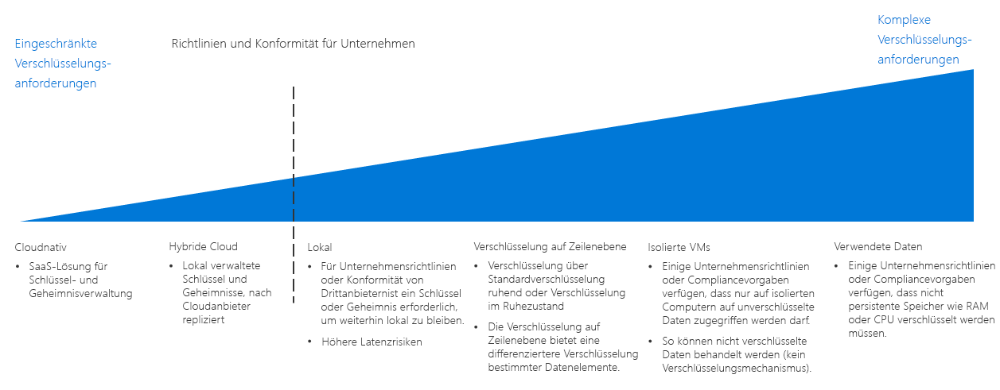

# Leitfaden zur Entscheidungsfindung für die VerschlüsselungEncryption decision guide

Das Verschlüsseln von Daten schützt vor nicht autorisiertem Zugriff.Encrypting data protects it against unauthorized access. Eine ordnungsgemäß implementierte Verschlüsselung bietet zusätzliche Ebenen der Sicherheit für Ihre cloudbasierten Workloads und dient als Schutz vor Angreifern und anderen nicht autorisierten Benutzern – innerhalb und außerhalb Ihrer Organisation und Ihrer Netzwerke.Properly implemented encryption policy provides additional layers of security for your cloud-based workloads and guards against attackers and other unauthorized users from both inside and outside your organization and networks.

Auch wenn die Verschlüsselung von Ressourcen in der Regel wünschenswert ist, stellt sie einen Zusatzaufwand dar, der zu einer höheren Latenz und einer allgemein höheren Ressourcennutzung führen kann.While encrypting resources is generally desirable, encryption does have costs that can increase latency and overall resource usage. Daher ist bei anspruchsvollen Workloads die richtige Balance zwischen Verschlüsselung und Leistung wichtig.For demanding workloads, striking the correct balance between encryption and performance is essential.

Wechseln Sie zu: [Schlüsselverwaltung](#key-management) | [Datenverschlüsselung](#data-encryption) | [Weitere Informationen](#learn-more)Jump to: [Key management](#key-management) | [Data encryption](#data-encryption) | [Learn more](#learn-more)

Der Wendepunkt bei der Bestimmung einer Strategie für die Verschlüsselung richtet sich nach den Richtlinien des Unternehmens und Compliancevorgaben.The inflection point when determining a cloud encryption strategy focuses on corporate policy and compliance mandates.

Es gibt mehrere Möglichkeiten zum Implementieren von Verschlüsselung in einer Cloudumgebung, die Unterschiede bei den Kosten und der Komplexität aufweisen.There are multiple ways to implement encryption in a cloud environment, with varying cost and complexity. Unternehmensrichtlinien und Konformität mit Drittanbietern sind die wichtigsten Aspekte bei der Planung einer Verschlüsselungsstrategie.Corporate policy and third-party compliance are the biggest drivers when planning an encryption strategy. Die meisten cloudbasierten Lösungen bieten Standardmechanismen für die Verschlüsselung von ruhenden und übertragenen Daten.Most cloud-based solutions provide standard mechanisms for encrypting data, whether at rest or in transit. Allerdings müssen Sie für Richtlinien und Complianceanforderungen, die eine strengere Kontrolle erfordern, etwa standardisierte Verwaltung von Geheimnissen und Schlüsseln, Verschlüsselung während der Verwendung oder datenspezifische Verschlüsselung, wahrscheinlich eine komplexe Lösung implementieren.However, for policies and compliance requirements that demand tighter controls, such as standardized secrets and key management, encryption in-use, or data specific encryption, you will likely need to implement a complex solution.

## SchlüsselverwaltungKey management

Moderne Schlüsselverwaltungssysteme sollten für einen besseren Schutz Unterstützung für die Speicherung von Schlüsseln mithilfe von Hardwaresicherheitsmodulen (HSMs) bieten.Modern key management systems should offer support for storing keys using hardware security modules (HSMs) for increased protection. Daher ist ein Schlüsselverwaltungssystem enorm wichtig, damit Ihre Organisation kryptografische Schlüssel, wichtige Kennwörter, Verbindungszeichenfolgen und andere vertrauliche IT-Informationen erstellen und speichern kann.Thus, a key management system is critical to your organization's ability to create and store cryptographic keys, important passwords, connection strings, and other IT confidential information.

Die folgende Tabelle für die Planung einer Cloudmigration zeigt, wie Sie Verschlüsselungsschlüssel, Zertifikate und Geheimnisse, die zum Erstellen sicherer und verwaltbarer Cloudbereitstellungen kritisch sind, speichern und verwalten können:When planning a cloud migration, the following table describes how you can store and manage encryption keys, certificates, and secrets, which are critical for creating secure and manageable cloud deployments:

| FrageQuestion | CloudnativCloud Native | HybridHybrid | LokalOn-premises |
|---------------------------------------------------------------------------------------------------------------------------------------|--------------|--------|-------------|
| Fehlt in Ihrer Organisation eine zentralisierte Schlüssel- und Geheimnisverwaltung?Does your organization lack centralized key and secret management?                                                                    | JaYes          | Nein No     | Nein No          |
| Muss die Erstellung von Schlüsseln und Geheimnissen für Geräte auf lokale Hardware beschränkt werden, wenn diese Schlüssel in der Cloud verwendet werden?Will you need to limit the creation of keys and secrets to devices to your on-premises hardware, while using these keys in the cloud? | Nein No           | JaYes    | Nein No          |
| Verfügt Ihre Organisation über Regeln oder Richtlinien, die das Speichern der Schlüssel und Geheimnisse außerhalb der eigenen Standorte verhindern würde?Does your organization have rules or policies in place that would prevent keys and secrets from being stored offsite?                | Nein No           | Nein No     | JaYes         |

### CloudbasiertCloud native

Bei der cloudnativen Schlüsselverwaltung werden alle Schlüssel und Geheimnisse in einem cloudbasierten Tresor generiert, verwaltet und gespeichert.With cloud native key management, all keys and secrets are generated, managed, and stored in a cloud-based vault. Dieser Ansatz vereinfacht viele IT-Aufgaben im Zusammenhang mit der Schlüsselverwaltung.This approach simplifies many IT tasks related to key management.

Annahmen für die cloudnative Schlüsselverwaltung: Für die Verwendung eines cloudnativen Schlüsselverwaltungssystems wird Folgendes angenommen:Cloud native key management assumptions: Using a cloud native key management system assumes the following:

- Sie vertrauen der Cloudlösung für die Schlüsselverwaltung beim Erstellen, Verwalten und Hosten der Geheimnisse und Schlüssel Ihres Unternehmens.You trust the cloud key management solution with creating, managing, and hosting your organization's secrets and keys.
- Sie ermöglichen allen lokalen Anwendungen und Diensten, die auf den Zugriff auf Verschlüsselungsdienste oder Geheimnisse angewiesen sind, den Zugriff auf das Schlüsselverwaltungssystem in der Cloud.You enable all on-premises applications and services that rely on accessing encryption services or secrets to access the cloud key management system.

### Hybrid (Bring Your Own Key)Hybrid (bring your own key)

Bei einem Bring-Your-Own-Key-Ansatz generieren Sie die Schlüssel auf dedizierter HSM-Hardware in Ihrer lokalen Umgebung und übertragen die Schlüssel dann in ein sicheres Schlüsselverwaltungssystem in der Cloud, damit sie für Cloudressourcen verwendet werden können.With a bring-your-own-key approach, you generate keys on dedicated HSM hardware within your on-premises environment, then transfer the keys to a secure cloud key management system for use with cloud resources.

Annahmen für die hybride Schlüsselverwaltung: Für die Verwendung eines hybriden Schlüsselverwaltungssystems wird Folgendes angenommen:Hybrid key management assumptions: Using a hybrid key management system assumes the following:

- Sie vertrauen der zugrunde liegenden Sicherheits- und Zugriffssteuerungsinfrastruktur der Cloudplattform beim Hosting und der Verwendung Ihrer Schlüssel und Geheimnisse.You trust the underlying security and access control infrastructure of the cloud platform for hosting and using your keys and secrets.
- Sie sind durch gesetzliche Vorgaben oder Organisationsrichtlinien gezwungen, die Erstellung und Verwaltung der Geheimnisse und Schlüssel Ihrer Organisation lokal durchzuführen.You are required by regulatory or organizational policy to keep the creation and management of your organization's secrets and keys on-premises.

### Lokal (Hold-Your-Own-Key)On-premises (hold your own key)

In bestimmten Szenarien liegen möglicherweise gesetzliche Vorschriften, Richtlinien oder technische Gründe vor, aus denen Sie Schlüssel nicht in einem Schlüsselverwaltungssystem, das von einem Dienst in der Public Cloud bereitgestellt wird, speichern dürfen.In certain scenarios, there may be regulatory, policy, or technical reasons why you can't store keys on a key management system provided by a public cloud service. In diesen Fällen müssen Sie die Schlüssel mithilfe lokaler Hardware verwalten und ein Verfahren bereitstellen, mit dem cloudbasierte Ressourcen für die Verschlüsselung auf diese Schlüssel zugreifen können.In these cases, you must maintain keys using on-premises hardware, and provision a mechanism to allow cloud-based resource to access these keys for encryption purposes. Beachten Sie aber, dass die Speicherung der eigenen Schlüssel möglicherweise nicht mit allen Clouddiensten kompatibel ist.Note that a hold your own key approach may not be compatible with all cloud services.

Annahmen für die lokale Schlüsselverwaltung: Für die Verwendung eines lokalen Schlüsselverwaltungssystems wird Folgendes angenommen:On-premises key management assumptions: Using an on-premises key management system assumes the following:

- Sie sind durch gesetzliche Vorgaben oder Organisationsrichtlinien gezwungen, Erstellung, Verwaltung und Hosting der Geheimnisse und Schlüssel Ihrer Organisation lokal durchzuführen.You are required by regulatory or organizational policy to keep the creation, management, and hosting of your organization's secrets and keys on-premises.
- Alle cloudbasierten Anwendungen und Dienste, die auf den Zugriff auf Verschlüsselungsdienste oder Geheimnisse angewiesen sind, können auf das lokale Schlüsselverwaltungssystem zugreifen.Any cloud-based applications or services that rely on accessing encryption services or secrets can access the on-premises key management system.

## DatenverschlüsselungData encryption

Es gibt verschiedene Zustände von Daten mit unterschiedlichen Anforderungen an die Verschlüsselung, die bei der Planung Ihrer Verschlüsselungsrichtlinie berücksichtigt werden müssen:There are several different states of data with different encryption needs to consider when planning your encryption policy:

| DatenzustandData state | DatenData |
|-----|-----|
| Daten während der ÜbertragungData in transit | Interner Netzwerkdatenverkehr, Internetverbindungen, Verbindungen zwischen Rechenzentren oder virtuellen NetzwerkenInternal network traffic, internet connections, connections between datacenters or virtual networks |
| Ruhende DatenData at rest    | Datenbanken, Dateien, virtuelle Laufwerke, PaaS-SpeicherDatabases, files, virtual drives, PaaS storage |
| Daten in GebrauchData in use     | Daten, die in den Arbeitsspeicher oder in CPU-Caches geladen wurdenData loaded in RAM or in CPU caches |

### Daten während der ÜbertragungData in transit

Dies sind Daten, die zwischen internen Ressourcen, zwischen Rechenzentren oder externen Netzwerken oder über das Internet verschoben werden.Data in transit is data moving between resources on the internal, between datacenters or external networks, or over the internet.

Die Verschlüsselung von Daten während der Übertragung erfolgt normalerweise durch das Erzwingen der SSL/TLS-Protokolle für den Datenverkehr.Encrypting data in transit is usually done by requiring SSL/TLS protocols for traffic. Datenverkehr zwischen Ihren in der Cloud gehosteten Ressourcen und externen Netzwerken oder dem öffentlichen Internet sollte immer verschlüsselt werden.Traffic transiting between your cloud-hosted resources to external network or the public internet should always be encrypted. PaaS-Ressourcen erzwingen in der Regel ebenfalls standardmäßig die SSL/TLS-Verschlüsselung für Datenverkehr.PaaS resources generally also enforce SSL/TLS encryption to traffic by default. Ob Sie die Verschlüsselung für Datenverkehr zwischen IaaS-Ressourcen, die in Ihren virtuellen Netzwerken gehostet werden, erzwingen, ist eine Entscheidung Ihres Cloudeinführungsteams und des Workloadbesitzers, es wird jedoch im Allgemeinen empfohlen.Whether you enforce encryption for traffic between IaaS resources hosted inside your virtual networks is a decision for your Cloud Adoption Team and workload owner and is generally recommended.

**Annahmen für die Verschlüsselung von Daten während der Übertragung:****Encrypting data in transit assumptions**. Für die Implementierung einer geeigneten Verschlüsselungsrichtlinie für Daten während der Übertragung wird Folgendes angenommen:Implementing proper encryption policy for data in transit assumes the following:

- Alle öffentlich zugänglichen Endpunkte in Ihrer Cloudumgebung kommunizieren mit dem öffentlichen Internet über SSL/TLS-Protokolle.All publicly accessible endpoints in your cloud environment will communicate with the public internet using SSL/TLS protocols.
- Wenn Cloudnetzwerke über das öffentliche Internet mit einem lokalen oder anderen externen Netzwerk verbunden werden, verwenden Sie verschlüsselte VPN-Protokolle.When connecting cloud networks with on-premises or other external network over the public internet, use encrypted VPN protocols.
- Werden Cloudnetzwerke über eine dedizierte WAN-Verbindung wie ExpressRoute mit lokalen oder anderen externen Netzwerken verbunden, verwenden Sie eine VPN- oder andere lokale Verschlüsselungsappliance, die mit einer entsprechenden virtuellen VPN- oder Verschlüsselungsappliance in Ihrem Cloudnetzwerk gekoppelt ist.When connecting cloud networks with on-premises or other external network using a dedicated WAN connection such as ExpressRoute, you will use a VPN or other encryption appliance on-premises paired with a corresponding virtual VPN or encryption appliance deployed to your cloud network.
- Wenn Sie über vertrauliche Daten verfügen, die nicht in Datenverkehrsprotokolle oder andere Diagnoseberichte, die für IT-Mitarbeiter einsehbar sind, eingeschlossen werden sollten, verschlüsseln Sie sämtlichen Datenverkehr zwischen den Ressourcen in Ihrem virtuellen Netzwerk.If you have sensitive data that shouldn't be included in traffic logs or other diagnostics reports visible to IT staff, you will encrypt all traffic between resources in your virtual network.

### Ruhende DatenData at rest

Ruhende Daten sind alle Daten, die nicht aktiv verschoben oder verarbeitet werden, einschließlich Dateien, Datenbanken, Laufwerken virtueller Computer, PaaS-Speicherkonten oder ähnlicher Ressourcen.Data at rest represents any data not being actively moved or processed, including files, databases, virtual machine drives, PaaS storage accounts, or similar assets. Das Verschlüsseln gespeicherter Daten schützt virtuelle Geräte oder Dateien vor nicht autorisiertem Zugriff durch externes Eindringen in das Netzwerk, böswillige interne Benutzer oder versehentliche Veröffentlichung.Encrypting stored data protects virtual devices or files against unauthorized access either from external network penetration, rogue internal users, or accidental releases.

PaaS-Speicher und Datenbankressourcen erzwingen Verschlüsselung in der Regel standardmäßig.PaaS storage and database resources generally enforce encryption by default. Virtuelle IaaS-Ressourcen können durch Verschlüsselung virtueller Datenträger mithilfe kryptografischer Schlüssel, die in Ihrem Schlüsselverwaltungssystem gespeichert sind, geschützt werden.IaaS virtual resources can be secured through virtual disk encryption using cryptographic keys stored in your key management system.

Die Verschlüsselung ruhender Daten umfasst auch erweiterte Methoden zur Datenbankverschlüsselung, z.B. auf Spalten- und Zeilenebene. Diese bieten deutlich mehr Kontrolle darüber, welche Daten genau geschützt werden.Encryption for data at rest also encompasses more advanced database encryption techniques, such as column-level and row level encryption, which provides much more control over exactly what data is being secured.

Ihre allgemeinen Richtlinien und Complianceanforderungen, die Vertraulichkeit der gespeicherten Daten und die Leistungsanforderungen Ihrer Workloads legen fest, für welche Ressourcen eine Verschlüsselung erforderlich ist.Your overall policy and compliance requirements, the sensitivity of the data being stored, and the performance requirements of your workloads should determine which assets require encryption.

**Annahmen für die Verschlüsselung von ruhenden Daten:****Encrypting Data at Rest Assumptions**. Für die Verschlüsselung von ruhenden Daten wird Folgendes angenommen:Encrypting data at rest assumes the following:

- Sie speichern Daten, die nicht für die öffentliche Nutzung vorgesehen sind.You are storing data that is not meant for public consumption.
- Ihre Workloads vertragen die zusätzliche Latenz durch die Datenträgerverschlüsselung.Your workloads can accept the added latency cost of disk encryption.

### Daten in GebrauchData in use

Die Verschlüsselung von Daten in Gebrauch umfasst das Schützen von Daten in nicht beständigem Speicher, z.B. Arbeitsspeicher oder CPU-Caches.Encryption for data in use involves securing data in nonpersistent storage, such as RAM or CPU caches. Dies setzt die Nutzung von Technologien wie der Verschlüsselung des gesamten Arbeitsspeichers und Enclave-Technologien, z.B. Secure Guard Extensions (SGX) von Intel, voraus.Use of technologies such as full memory encryption, enclave technologies, such as Intel's Secure Guard Extensions (SGX). Außerdem umfasst dieser Bereich kryptografische Techniken, wie die homomorphe Verschlüsselung, die zum Erstellen von sicheren, vertrauenswürdigen Ausführungsumgebungen verwendet werden kann.This also includes cryptographic techniques, such as homomorphic encryption that can be used to create secure, trusted execution environments.

**Annahmen für die Verschlüsselung von Daten in Gebrauch:****Encrypting data in use assumptions**. Für die Verschlüsselung von Daten in Gebrauch wird Folgendes angenommen:Encrypting data in use assumes the following:

- Sie sollen den Besitz der Daten jederzeit von der zugrunde liegenden Cloudplattform trennen – selbst auf den Ebenen von Arbeitsspeicher und CPU.You are required to maintain data ownership separate from the underlying cloud platform at all times, even at the RAM and CPU level.

## Weitere InformationenLearn more

Nachstehend finden Sie weitere Informationen zur Verschlüsselung und der Schlüsselverwaltung auf der Azure-Plattform.See the following for more information about encryption and key management in the Azure platform.

- [Übersicht über die Azure-Verschlüsselung:](/azure/security/security-azure-encryption-overview)[Azure encryption overview](/azure/security/security-azure-encryption-overview). Eine ausführliche Beschreibung zur Verwendung der Verschlüsselung in Azure zum Schutz sowohl ruhender Daten als auch von Daten bei der Übertragung.A detailed description of how Azure uses encryption to secure both data at rest and data in transit.
- [Azure Key Vault](/azure/key-vault/key-vault-overview).[Azure Key Vault](/azure/key-vault/key-vault-overview). Key Vault ist das primäre Schlüsselverwaltungssystem zum Speichern und Verwalten von kryptografischen Schlüsseln, Geheimnissen und Zertifikaten in Azure.Key Vault is the primary key management system for storing and managing cryptographic keys, secrets, and certificates within Azure.
- [Confidential Computing in Azure:](/solutions/confidential-compute)[Confidential computing in Azure](/solutions/confidential-compute). Die Confidential Computing-Initiative von Azure stellt Tools und Technologien zum Erstellen von vertrauenswürdigen Ausführungsumgebungen und anderen Verschlüsselungsmechanismen zum Schützen von Daten in Gebrauch bereit.Azure's confidential computing initiative provides tools and technology to create trusted execution environments or other encryption mechanisms to secure data in use.

## Nächste SchritteNext steps

Erfahren Sie, wie virtualisierte Netzwerkfunktionen für Cloudbereitstellungen von Softwaredefinierten Netzwerken bereitgestellt werden.Learn how Software Defined Networks provide virtualized networking capabilities for cloud deployments.

> [!div class="nextstepaction"]
> [Welches Muster für softwaredefinierte Netzwerke eignet sich für meine Bereitstellung am besten?Which Software Defined Network pattern is best for my deployment?](../software-defined-network/overview.md)
