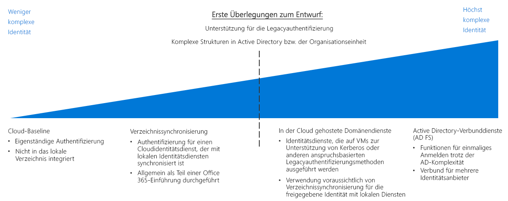

# Leitfaden zur Entscheidungsfindung für die IdentitätsverwaltungIdentity decision guide

In allen Umgebungen, seien es lokale, Hybrid- oder reine Cloudumgebungen, muss die IT-Abteilung genau bestimmen, welche Administratoren, Benutzer und Gruppen Zugriff auf Ressourcen haben.In any environment, whether on-premises, hybrid, or cloud-only, IT needs to control which administrators, users, and groups have access to resources. Dienste für die Identitäts- und Zugriffsverwaltung (Identity and Access Management, IAM) ermöglichen Ihnen das Verwalten der Zugriffssteuerung in der Cloud.Identity and access management (IAM) services enable you to manage access control in the cloud.

Wechseln Sie zu: [Ermitteln der Anforderung an die Identitätsintegration](#determine-identity-integration-requirements) | [Cloudnativ](#cloud-baseline) | [Verzeichnissynchronisierung](#directory-synchronization) | [In der Cloud gehostete Domänendienste](#cloud-hosted-domain-services) | [Active Directory-Verbunddienste (AD FS)](#active-directory-federation-services) | [Sich weiterentwickelnde Identitätsintegration](#evolving-identity-integration) | [Weitere Informationen](#learn-more)Jump to: [Determine Identity Integration Requirements](#determine-identity-integration-requirements) | [Cloud native](#cloud-baseline) | [Directory Synchronization](#directory-synchronization) | [Cloud hosted domain services](#cloud-hosted-domain-services) | [Active Directory Federation Services](#active-directory-federation-services) | [Evolving identity integration](#evolving-identity-integration) | [Learn more](#learn-more)

Es gibt in einer Cloudumgebung mehrere Möglichkeiten der Identitätsverwaltung, die sich hinsichtlich Kosten und Komplexität unterscheiden.There are several ways to manage identity in a cloud environment, which vary in cost and complexity. Ein wesentlicher Faktor bei der Strukturierung Ihrer cloudbasierten Identitätsverwaltungsdienste ist der Grad der Integration in Ihre bestehende lokale Identitätsverwaltungsinfrastruktur.A key factor in structuring your cloud-based identity services is the level of integration required with your existing on-premises identity infrastructure.

Cloudbasierte SaaS-Identitätslösungen (Software as a Service) bieten für Cloudressourcen eine grundlegende Ebene der Zugriffssteuerung und Identitätsverwaltung.Cloud-based software as a service (SaaS) identity solutions provide a base level of access control and identity management for cloud resources. Wenn die Active Directory-Infrastruktur (AD) Ihrer Organisation jedoch eine komplexe Gesamtstruktur oder angepasste Organisationseinheiten aufweist, können Ihre cloudbasierten Workloads eine Verzeichnisreplikation in die Cloud erfordern, um einen einheitlichen Satz von Identitäten, Gruppen und Rollen zwischen der lokalen und der Cloudumgebung zu gewährleisten.However, if your organization's Active Directory (AD) infrastructure has a complex forest structure or customized organizational units (OUs), your cloud-based workloads may require directory replication to the cloud for a consistent set of identities, groups, and roles between your on-premises and cloud environments. Falls für eine globale Lösung eine Verzeichnisreplikation erforderlich ist, kann die Komplexität deutlich zunehmen.If directory replication is required for a global solution, complexity can increase significantly. Darüber hinaus kann die Unterstützung von Anwendungen, die von veralteten Authentifizierungsmechanismen abhängen, die Bereitstellung von Domänendiensten in der Cloud erfordern.Additionally, support for applications dependent on legacy authentication mechanisms may require the deployment of domain services in the cloud.

## Bestimmen der Anforderungen an die IdentitätsintegrationDetermine identity integration requirements

| FrageQuestion | Reine CloudlösungCloud baseline | VerzeichnissynchronisierungDirectory synchronization | In der Cloud gehostete DomänendiensteCloud-hosted Domain Services | Active Directory-Verbunddienste (AD FS)AD Federation Services |
|------|------|------|------|------|
| Fehlt Ihnen derzeit ein lokaler Verzeichnisdienst?Do you currently lack an on-premises directory service? | JaYes | Nein No | Nein No | Nein No |
| Müssen sich Ihre Workloads bei lokalen Identitätsdiensten authentifizieren?Do your workloads need to authenticate against on-premises identity services? | Nein No | JaYes | Nein No | Nein No |
| Sind Ihre Workloads von veralteten Authentifizierungsmechanismen wie Kerberos oder NTLM abhängig?Do your workloads depend on legacy authentication mechanisms, such as Kerberos or NTLM? | Nein No | Nein No | JaYes | Nein No |
| Ist eine Integration zwischen Cloud- und lokalen Identitätsdiensten unmöglich?Is integration between cloud and on-premises identity services impossible? | Nein No | Nein No | JaYes | Nein No |
| Wird einmaliges Anmelden über mehrere Identitätsanbieter benötigt?Do you require single sign-on across multiple identity providers? | Nein No | Nein No | Nein No | JaYes |

Im Rahmen der Planung Ihrer Migration zu Azure müssen Sie entscheiden, wie Sie Ihre bestehenden Identitätsverwaltungs- und Cloudidentitätsdienste am besten integrieren.As part of planning your migration to Azure, you will need to determine how best to integrate your existing identity management and cloud identity services. Es folgen gängige Integrationsszenarien.The following are common integration scenarios.

### Reine CloudlösungCloud baseline

Öffentliche Cloudplattformen bieten ein natives System zur Identitäts- und Zugriffsverwaltung (IAM), über das Benutzer und Gruppen Zugriff auf Verwaltungsfunktionen erhalten.Public cloud platforms provide a native IAM system for granting users and groups access to management features. Wenn es in Ihrem Unternehmen keine nennenswerte lokale Identitätsverwaltungslösung gibt und Sie planen, Workloads so zu migrieren, dass sie mit cloudbasierten Authentifizierungsmechanismen kompatibel sind, sollten Sie Ihre Identitätsinfrastruktur mit einem cloudnativen Identitätsdienst erstellen.If your organization lacks a significant on-premises identity solution, and you plan on migrating workloads to be compatible with cloud-based authentication mechanisms, you should build your identity infrastructure using a cloud-native identity service.

**Annahmen für eine reine Cloudlösung**.**Cloud baseline assumptions**. Für den Einsatz einer rein cloudbasierten Identitätsinfrastruktur wird Folgendes angenommen:Using a purely cloud-native identity infrastructure assumes the following:

- Ihre cloudbasierten Ressourcen weisen keine Abhängigkeiten von lokalen Verzeichnisdiensten oder Active Directory-Servern auf, oder Workloads können so geändert werden, dass diese Abhängigkeiten entfallen.Your cloud-based resources will not have dependencies on on-premises directory services or Active Directory servers, or workloads can be modified to remove those dependencies your.
- Die zu migrierenden Anwendungs- oder Dienstworkloads unterstützen entweder Authentifizierungsmechanismen, die mit Cloudidentitätsanbietern kompatibel sind, oder können problemlos so geändert werden, dass diese unterstützt werden.The application or service workloads being migrated either support authentication mechanisms compatible with cloud identity providers or can be modified easily to support them. Cloudnative Identitätsanbieter greifen auf internetfähige Authentifizierungsmechanismen wie SAML, OAuth und OpenID Connect zurück.Cloud native identity providers rely on internet-ready authentication mechanisms such as SAML, OAuth, and OpenID Connect. Bestehende Workloads, die von veralteten Authentifizierungsmethoden mit Protokollen wie Kerberos oder NTLM abhängen, müssen möglicherweise vor der Migration in die Cloud angepasst werden.Existing workloads that depend on legacy authentication methods using protocols such as Kerberos or NTLM may need to be refactored before migrating to the cloud.

> [!TIP]
> Die meisten cloudnativen Identitätsdienste sind kein vollständiger Ersatz für herkömmliche lokale Verzeichnisse.Most cloud-native identity services are not full replacements for traditional on-premises directories. Verzeichnisfunktionen wie Computerverwaltung oder Gruppenrichtlinien sind möglicherweise nicht ohne zusätzliche Tools oder Dienste verfügbar.Directory features such as computer management or group policy may not be available without using additional tools or services.

Durch die vollständige Migration Ihrer Identitätsdienste zu einem cloudbasierten Anbieter entfällt die Notwendigkeit, Ihre eigene Identitätsinfrastruktur zu pflegen, wodurch Ihre IT-Verwaltung erheblich vereinfacht wird.Completely migrating your identity services to a cloud-based provider eliminates the need to maintain your own identity infrastructure, significantly simplifying your IT management.

### VerzeichnissynchronisierungDirectory synchronization

Für Organisationen mit einer bestehenden Identitätsinfrastruktur ist die Verzeichnissynchronisierung oft die beste Lösung, um die bestehende Benutzer- und Zugriffsverwaltung aufrechtzuerhalten und gleichzeitig die erforderlichen IAM-Funktionen für die Verwaltung von Cloudressourcen bereitzustellen.For organizations with an existing identity infrastructure, directory synchronization is often the best solution for preserving existing user and access management while providing the required IAM capabilities for managing cloud resources. Bei diesem Prozess werden Verzeichnisinformationen kontinuierlich zwischen der Cloud- und der lokalen Umgebung repliziert, wodurch einmaliges Anmelden (SSO) für Benutzer und ein einheitliches Identitäts-, Rollen- und Berechtigungssystem in der gesamten Organisation ermöglicht wird.This process continuously replicates directory information between the cloud and on-premises environments, allowing single sign-on (SSO) for users and a consistent identity, role, and permission system across your entire organization.

Hinweis: Organisationen, die Office 365 eingeführt haben, haben möglicherweise bereits die [Verzeichnissynchronisierung](/office365/enterprise/set-up-directory-synchronization) zwischen ihrer lokalen Active Directory-Infrastruktur und Azure Active Directory eingerichtet.Note: Organizations that have adopted Office 365 may have already implemented [directory synchronization](/office365/enterprise/set-up-directory-synchronization) between their on-premises Active Directory infrastructure and Azure Active Directory.

**Annahmen zur Verzeichnissynchronisierung**.**Directory synchronization assumptions**. Für den Einsatz einer synchronisierten Identitätslösung wird Folgendes angenommen:Using a synchronized identity solution assumes the following:

- Sie benötigen in Ihrer Cloud- und lokalen IT-Infrastruktur einen gemeinsamen Satz von Benutzerkonten und -gruppen.You need to maintain a common set of user accounts and groups across your cloud and on-premises IT infrastructure.
- Ihre lokalen Identitätsdienste unterstützen die Replikation mit Ihrem Cloudidentitätsanbieter.Your on-premises identity services support replication with your cloud identity provider.
- Sie benötigen Mechanismen für einmaliges Anmelden für Benutzer, die auf Cloud- und lokale Identitätsanbieter zugreifen.You require SSO mechanisms for users accessing cloud and on-premises identity providers.

> [!TIP]
> Alle cloudbasierten Workloads, die von veralteten Authentifizierungsmechanismen abhängen, welche nicht von cloudbasierten Identitätsdiensten wie Azure AD unterstützt werden, erfordern weiterhin entweder eine Verbindung mit lokalen Domänendiensten oder virtuellen Servern in der Cloudumgebung, die diese Dienste bereitstellen.Any cloud-based workloads that depend on legacy authentication mechanisms that are not supported by cloud-based identity services like Azure AD will still require either connectivity to on-premises domain services or virtual servers in the cloud environment providing these services. Bei Nutzung lokaler Identitätsdienste entstehen auch Abhängigkeiten von der Konnektivität zwischen der Cloud und lokalen Netzwerken.Using on-premises identity services also introduces dependencies on connectivity between the cloud and on-premises networks.

### In der Cloud gehostete DomänendiensteCloud-hosted domain services

Angenommen, Sie haben Workloads, die von einer anspruchsbasierten Authentifizierung mit älteren Protokollen wie Kerberos oder NTLM abhängen, und diese Workloads nicht so angepasst werden können, dass sie moderne Authentifizierungsprotokolle wie SAML oder OAuth und OpenID Connect unterstützen. Dann müssen Sie möglicherweise einige Ihrer Domänendienste als Teil Ihrer Cloudbereitstellung in die Cloud migrieren.If you have workloads that depend on claims-based authentication using legacy protocols such as Kerberos or NTLM, and those workloads cannot be refactored to accept modern authentication protocols such as SAML or OAuth and OpenID Connect, you may need to migrate some of your domain services to the cloud as part of your cloud deployment.

Diese Art der Bereitstellung erfordert die Bereitstellung virtueller Computer mit ausgeführtem Active Directory in Ihren cloudbasierten virtuellen Netzwerken, um Domänendienste für Ressourcen in der Cloud bereitzustellen.This type of deployment involves deploying virtual machines running Active Directory in your cloud-based virtual networks to provide domain services for resources in the cloud. Alle bestehenden Anwendungen und Dienste, die in Ihr Cloudnetzwerk migrieren, sollten in der Lage sein, nach geringfügigen Änderungen diese von der Cloud gehosteten Verzeichnisserver zu nutzen.Any existing applications and services migrating to your cloud network should be able to use of these cloud-hosted directory servers with minor modifications.

Es ist wahrscheinlich, dass Ihre bestehenden Verzeichnisse und Domänendienste weiterhin in Ihrer lokalen Umgebung verwendet werden.It's likely that your existing directories and domain services will continue to be used in your on-premises environment. In diesem Szenario wird empfohlen, dass Sie auch die Verzeichnissynchronisierung verwenden, um einen gemeinsamen Satz von Benutzern und Rollen sowohl in der Cloud- als auch in der lokalen Umgebung bereitzustellen.In this scenario, it's recommended that you also use directory synchronization to provide a common set of users and roles in both the cloud and on-premises environments.

**Annahmen für in der Cloud gehostete Domänendienste**.**Cloud hosted domain services assumptions**. Für eine Verzeichnismigration wird Folgendes angenommen:Performing a directory migration assumes the following:

- Ihre Workloads hängen von der anspruchsbasierten Authentifizierung mit Protokollen wie Kerberos oder NTLM ab.Your workloads depend on claims-based authentication using protocols like Kerberos or NTLM.
- Die virtuellen Computer Ihrer Workloads müssen für die Verwaltung oder Anwendung von Active Directory-Gruppenrichtlinien der Domäne beitreten.Your workload virtual machines need to be domain-joined for management or application of Active Directory group policy purposes.

> [!TIP]
> Während eine Verzeichnismigration in Verbindung mit in der Cloud gehosteten Domänendiensten eine große Flexibilität bei der Migration bestehender Workloads bietet, erhöht das Hosting virtueller Computer in Ihrem virtuellen Cloudnetzwerk zur Bereitstellung dieser Dienste die Komplexität Ihrer IT-Verwaltungsaufgaben.While a directory migration coupled with cloud-hosted domain services provides great flexibility when migrating existing workloads, hosting virtual machines within your cloud virtual network to provide these services does increase the complexity of your IT management tasks. Mit zunehmender Erfahrung mit der Migration in die Cloud sollten Sie den langfristigen Wartungsbedarf für das Hosting dieser Server untersuchen.As your cloud migration experience matures, examine the long-term maintenance requirements of hosting these servers. Prüfen Sie, ob die Anpassung bestehender Workloads aus Gründen der Kompatibilität mit Cloudidentitätsanbietern wie Azure Active Directory den Bedarf an diesen in der Cloud gehosteten Servern verringern kann.Consider whether refactoring existing workloads for compatibility with cloud identity providers such as Azure Active Directory can reduce the need for these cloud-hosted servers.

### Active Directory-Verbunddienste (AD FS)Active Directory Federation Services

Über den Identitätsverbund werden Vertrauensbeziehungen zwischen mehreren Identitätsverwaltungssystemen aufgebaut, um gemeinsame Authentifizierungs- und Autorisierungsfunktionen zu ermöglichen.Identity federation establishes trust relationships across multiple identity management systems to allow common authentication and authorization capabilities. Sie können dann Funktionen für einmaliges Anmelden in mehreren Domänen innerhalb Ihrer Organisation oder Identitätssysteme unterstützen, die von Ihren Kunden oder Geschäftspartnern verwaltet werden.You can then support single sign-on capabilities across multiple domains within your organization or identity systems managed by your customers or business partners.

Azure AD unterstützt den Verbund lokaler Active Directory-Domänen mithilfe von [Active Directory-Verbunddienste (AD FS)](/azure/active-directory/hybrid/how-to-connect-fed-whatis).Azure AD supports federation of on-premises Active Directory domains using [Active Directory Federation Services](/azure/active-directory/hybrid/how-to-connect-fed-whatis) (AD FS). In der Referenzarchitektur [Erweiterung von AD FS auf Azure](../../../reference-architectures/identity/adfs.md) sehen Sie, wie dies in Azure erfolgen kann.See the reference architecture [Extend AD FS to Azure](../../../reference-architectures/identity/adfs.md) to see how this can be implemented in Azure.

## Weiterentwicklung der IdentitätsintegrationEvolving identity integration

Die Identitätsintegration ist ein iterativer Vorgang.Identity integration is an iterative process. Möglicherweise möchten Sie für eine erste Bereitstellung mit einer cloudnativen Lösung mit einer kleinen Anzahl von Benutzern und entsprechenden Rollen beginnen.You may want to start with a cloud native solution with a small set of users and corresponding roles for an initial deployment. Wenn Sie mehr Erfahrung mit der Migration haben, erwägen Sie den Einsatz eines Verbundmodells oder eine vollständige Verzeichnismigration Ihrer lokalen Identitätsdienste in die Cloud.As your migration matures, consider adopting a federated model or performing a full directory migration of your on-premises identity services to the cloud. Überprüfen Sie Ihre Identitätsstrategie bei jeder Iteration Ihres Migrationsprozesses.Revisit your identity strategy in every iteration of your migration process.

## Weitere InformationenLearn more

Nachstehend finden Sie weitere Informationen zu Identitätsdiensten auf der Azure-Plattform.See the following for more information about identity services on the Azure platform.

- [Azure AD](https://azure.microsoft.com/services/active-directory).[Azure AD](https://azure.microsoft.com/services/active-directory). Azure AD bietet cloudbasierte Identitätsdienste.Azure AD provides cloud-based identity services. Es ermöglicht Ihnen die Verwaltung des Zugriffs auf Ihre Azure-Ressourcen und das Steuern der Identitätsverwaltung, Geräteregistrierung, Benutzerbereitstellung, Anwendungszugriffssteuerung und Datensicherung.It allows you to manage access to your Azure resources and control identity management, device registration, user provisioning, application access control, and data protection.
- [Azure AD Connect](/azure/active-directory/hybrid/whatis-hybrid-identity):[Azure AD Connect](/azure/active-directory/hybrid/whatis-hybrid-identity). Mit dem Tool Azure AD Connect können Sie Azure AD-Instanzen mit Ihren bestehenden Identitätsverwaltungslösungen verbinden und so Ihr bestehendes Verzeichnis in der Cloud synchronisieren.The Azure AD Connect tool allows you to connect Azure AD instances with your existing identity management solutions, allowing synchronization of your existing directory in the cloud.
- [Rollenbasierte Zugriffssteuerung](/azure/role-based-access-control/overview) (RBAC).[Role-based access control](/azure/role-based-access-control/overview) (RBAC). Azure AD bietet RBAC für die effiziente und sichere Verwaltung des Zugriffs auf Ressourcen auf Verwaltungsebene.Azure AD provides RBAC to efficiently and securely manage access to resources in the management plane. Aufträge und Aufgaben sind in Rollen organisiert und Benutzer diesen Rollen zugewiesen.Jobs and responsibilities are organized into roles, and users are assigned to these roles. Mit RBAC können Sie steuern, wer Zugriff auf eine Ressource hat und welche Aktionen ein Benutzer auf diese Ressource anwenden kann.RBAC allows you to control who has access to a resource along with which actions a user can perform on that resource.
- [Azure AD Privileged Identity Management](/azure/active-directory/privileged-identity-management/pim-configure) (PIM).[Azure AD Privileged Identity Management](/azure/active-directory/privileged-identity-management/pim-configure) (PIM). PIM reduziert die Offenlegungszeit von Ressourcenzugriffsrechten und verschafft Ihnen durch Berichte und Warnungen einen besseren Überblick über deren Nutzung.PIM lowers the exposure time of resource access privileges and increases your visibility into their use through reports and alerts. Hierfür werden Benutzern Beschränkungen auferlegt, indem ihnen Berechtigungen nur gemäß des Just-in-Time-Prinzips (JIT) zugeteilt oder nur für eine kurze Dauer zugewiesen und danach automatisch widerrufen werden.It limits users to taking on their privileges "just in time" (JIT), or by assigning privileges for a shorter duration, after which privileges are revoked automatically.
- [Integrieren lokaler Active Directory-Domänen in Azure Active Directory](../../../reference-architectures/identity/azure-ad.md).[Integrate on-premises Active Directory domains with Azure Active Directory](../../../reference-architectures/identity/azure-ad.md). Diese Referenzarchitektur bietet ein Beispiel für die Verzeichnissynchronisierung zwischen lokalen Active Directory-Domänen und Azure AD.This reference architecture provides an example of directory synchronization between on-premises Active Directory domains and Azure AD.
- [Erweitern von Active Directory Domain Services (AD DS) auf Azure](../../../reference-architectures/identity/adds-extend-domain.md).[Extend Active Directory Domain Services (AD DS) to Azure.](../../../reference-architectures/identity/adds-extend-domain.md) Diese Referenzarchitektur bietet ein Beispiel für den Einsatz von AD DS-Servern zur Erweiterung von Domänendiensten auf cloudbasierte Ressourcen.This reference architecture provides an example of deploying AD DS servers to extend domain services to cloud-based resources.
- [Erweitern von Active Directory Federation Services (AD FS) auf Azure](../../../reference-architectures/identity/adfs.md).[Extend Active Directory Federation Services (AD FS) to Azure](../../../reference-architectures/identity/adfs.md). In dieser Referenzarchitektur wird Active Directory-Verbunddienste (AD FS) konfiguriert, um Authentifizierung und Autorisierung im Verbund mit Ihrem Azure AD-Verzeichnis durchzuführen.This reference architecture configures Active Directory Federation Services (AD FS) to perform federated authentication and authorization with your Azure AD directory.

## Nächste SchritteNext steps

Erfahren Sie, wie Sie die Erzwingung von Richtlinien in der Cloud realisieren.Learn how to implement policy enforcement in the cloud.

> [!div class="nextstepaction"]
> [RichtlinienerzwingungPolicy enforcement](../policy-enforcement/overview.md)
