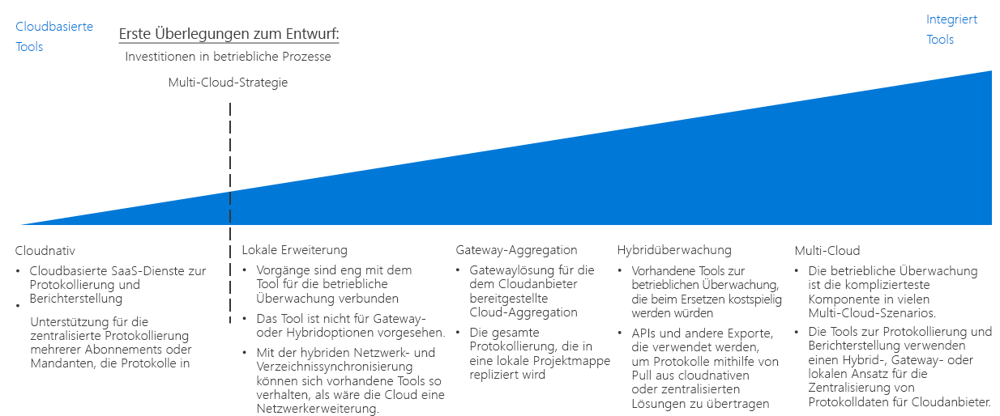

# Leitfaden zur Entscheidungsfindung für Protokollierung und BerichterstellungLogging and reporting decision guide

Alle Organisationen benötigen Mechanismen, um IT-Teams über Leistungs-, Verfügbarkeits- und Sicherheitsprobleme zu informieren, bevor diese zu ernsthaften Problemen werden.All organizations need mechanisms for notifying IT teams of performance, uptime, and security issues before they become serious problems. Eine erfolgreiche Überwachungsstrategie ermöglicht Ihnen, die Leistung der Komponenten zu verstehen, aus denen sich Ihre Workloads und Netzwerkinfrastruktur zusammensetzen.A successful monitoring strategy allows you to understand how the individual components that make up your workloads and networking infrastructure are performing. Im Rahmen einer Migration in die öffentliche Cloud ist die Integration der Protokollierung und Berichterstellung in alle Ihre bestehenden Überwachungssysteme von entscheidender Bedeutung. Dabei werden wichtige Ereignisse und Metriken an die entsprechenden IT-Mitarbeiter weitergegeben, um sicherzustellen, dass Ihr Unternehmen seine Ziele hinsichtlich Betriebsbereitschaft, Sicherheit und Konformität mit Vorschriften erfüllt.Within the context of a public cloud migration, integrating logging and reporting with any of your existing monitoring systems, while surfacing important events and metrics to the appropriate IT staff, is critical in ensuring your organization is meeting uptime, security, and policy compliance goals.

Wechseln Sie zu: [Planen der Überwachungsinfrastruktur](#planning-your-monitoring-infrastructure) | [Cloudnativ](#cloud-native) | [Lokale Erweiterung](#on-premises-extension) | [Gatewayaggregation ](#gateway-aggregation) | [Hybridüberwachung (lokal)](#hybrid-monitoring-on-premises) | [Hybridüberwachung (cloudbasiert)](#hybrid-monitoring-cloud-based) | [Mehrere Clouds ](#multi-cloud) | [Weitere Informationen](#learn-more)Jump to: [Planning your monitoring infrastructure](#planning-your-monitoring-infrastructure) | [Cloud native](#cloud-native) | [On-premises extension](#on-premises-extension) | [Gateway aggregation](#gateway-aggregation) | [Hybrid monitoring (on-premises)](#hybrid-monitoring-on-premises) | [Hybrid monitoring (cloud-based)](#hybrid-monitoring-cloud-based) | [Multi-cloud](#multi-cloud) | [Learn more](#learn-more)

Der Wendepunkt bei der Bestimmung einer cloudbasierten Protokollierungs- und Berichterstellungsstrategie basiert in erster Linie auf bereits getätigten Investitionen Ihres Unternehmens in betriebliche Prozesse und zu einem gewissen Grad auf den Anforderungen, die Sie an die Unterstützung einer Strategie mit mehreren Clouds haben.The inflection point when determining a cloud logging and reporting strategy is based primarily on existing investments your organization has made in operational processes, and to some degree any requirements you have to support a multi-cloud strategy.

Es gibt mehrere Möglichkeiten, Aktivitäten in der Cloud zu protokollieren und zu dokumentieren.There are multiple ways to log and report on activities in the cloud. „Cloudnativ“ und „Zentrale Protokollierung“ sind zwei übliche SaaS-Optionen (Software-as-a-Service), die dem Abonnementmodell und der Anzahl der Abonnements unterliegen.Cloud native and centralized logging are two common software as a service (SaaS) options that are driven by the subscription design and the number of subscriptions.

## Planen der ÜberwachungsinfrastrukturPlanning your monitoring infrastructure

Bei der Planung Ihrer Bereitstellung müssen Sie berücksichtigen, wo Protokolldaten gespeichert werden und wie Sie cloudbasierte Berichts- und Überwachungsdienste in Ihre bestehenden Prozesse und Tools integrieren.When planning your deployment, you need to consider where logging data is stored and how you will integrate cloud-based reporting and monitoring services with your existing processes and tools.

| FrageQuestion | CloudbasiertCloud native | Lokale ErweiterungOn-premises extension | HybridüberwachungHybrid monitoring | GatewayaggregationGateway aggregation |
|-----|-----|-----|-----|-----|
| Haben Sie eine vorhandene lokale Überwachungsinfrastruktur?Do you have an existing on-premises monitoring infrastructure? | Nein No | JaYes | JaYes |  Nein No |
| Bestehen Anforderungen, die die Speicherung von Protokolldaten an externen Speicherorten verhindern?Do you have requirements preventing storage of log data on external storage locations? | Nein No | JaYes | Nein No | Nein No |
| Muss die Cloudüberwachung in lokale Systeme integriert werden?Do you need to integrate cloud monitoring with on-premises systems? | Nein No | Nein No | JaYes | Nein No |
Müssen Sie Telemetriedaten verarbeiten oder filtern, bevor Sie sie an Ihre Überwachungssysteme senden?Do you need to process or filter telemetry data before submitting it to your monitoring systems? | Nein No | Nein No | Nein No | JaYes |

### CloudbasiertCloud native

Wenn es in Ihrer Organisation derzeit an bewährten Protokollierungs- und Berichtssystemen fehlt oder Ihre geplante Cloudbereitstellung nicht in bestehende lokale oder andere externe Überwachungssysteme integriert werden muss, ist eine cloudnative SaaS-Lösung die einfachste Wahl.If your organization currently lacks established logging and reporting systems, or if your planned cloud deployment does not need to be integrated with existing on-premises or other external monitoring systems, a cloud native SaaS solution is the simplest choice.

Bei diesem Szenario werden die Protokolldaten erfasst und in derselben Cloudumgebung wie Ihr Workload gespeichert, während die Protokollierungs- und Berichterstellungstools, die Informationen verarbeiten und IT-Mitarbeitern zugänglich machen, als Teil der Cloudplattform angeboten werden.In this scenario, log data is recorded and stored in the same cloud environment as your workload, while the logging and reporting tools that process and surface information to IT staff are offered as part of the cloud platform.

Cloudnative Protokollierungslösungen können ad hoc abonnement- oder workloadbezogen für kleinere oder experimentelle Bereitstellungen implementiert werden und sind zentral organisiert, um Protokolldaten im gesamten Cloudumfeld zu überwachen.Cloud native logging solutions can be implemented ad hoc per subscription or workload for smaller or experimental deployments and are organized in a centralized manner to monitor log data across your entire cloud estate.

**Annahmen für cloudnative Lösungen**.**Cloud native assumptions**. Für die Verwendung eines cloudnativen Protokollierungs- und Berichterstellungssystems wird Folgendes angenommen:Using a cloud native logging and reporting system assumes the following:

- Sie müssen die Protokolldaten Ihrer Cloudworkloads nicht in bestehende lokale Systeme integrieren.You do not need to integrate the log data from you cloud workloads into existing on-premises systems.
- Sie verwenden Ihre cloudbasierten Berichterstellungssysteme nicht zur Überwachung lokaler Systeme.You will not be using your cloud-based reporting systems to monitor on-premises systems.

### Lokale ErweiterungOn-premises extension

In Szenarien, in denen Sie Cloudtelemetriedaten in lokale Systeme integrieren müssen, die keine hybride Protokollierung und Berichterstellung unterstützen oder die Migration von Anwendungen und Diensten mit einem Minimum an Neuentwicklung unterstützen, müssen Sie Überwachungs-Agents auf VMs bereitstellen, die Protokolldaten direkt an Ihre lokalen Systeme senden, anstatt sie in der Cloudumgebung zu speichern.In scenarios where you need to integrate cloud telemetry with on-premises systems that do not support hybrid logging and reporting, or support the migration of applications and services with a minimum amount of redevelopment, you will need to deploy monitoring agents to VMs that will send log data directly to your on-premises systems, rather than storing it in the cloud environment.

Um diesen Ansatz zu unterstützen, müssen Ihre Cloudressourcen in der Lage sein, über eine Kombination aus [Hybridnetzwerken](../software-defined-network/hybrid.md) und [in der Cloud gehosteten Domänendiensten](../identity/overview.md#cloud-hosted-domain-services) direkt mit Ihren lokalen Systemen zu kommunizieren.In order to support this approach, your cloud resources will need to be able to communicate directly with your on-premises systems through a combination of [hybrid networking](../software-defined-network/hybrid.md) and [cloud hosted domain services](../identity/overview.md#cloud-hosted-domain-services). Bei dieser Konfiguration fungiert das virtuelle Cloudnetzwerk als Netzwerkerweiterung der lokalen Umgebung.With this in place, the cloud virtual network functions as a network extension of the on-premises environment. Daher können in der Cloud gehostete Workloads direkt mit Ihrem lokalen Protokollierungs- und Berichterstellungssystem kommunizieren.Therefore, cloud hosted workloads can communicate directly with your on-premises logging and reporting system.

Dieser Ansatz macht sich Ihre bereits getätigten Investitionen in Überwachungstools zunutze, wobei nur geringfügige Änderungen an allen in der Cloud bereitgestellten Anwendungen oder Diensten vorgenommen werden.This approach capitalizes on your existing investment in monitoring tooling with limited modification to any cloud-deployed applications or services. Dies ist während einer Migration per Lift & Shift oft der schnellste Ansatz zur Unterstützung der Überwachung.This is often the fastest approach to support monitoring during a lift-and-shift migration. Allerdings werden keine Protokolldaten erfasst, die von cloudbasierten PaaS- und SaaS-Ressourcen generiert werden, und es werden alle VM-bezogenen Protokolle ausgeklammert, die von der Cloudplattform selbst erstellt werden, wie z.B. der VM-Status.However, it won’t capture log data produced by cloud-based PaaS and SaaS resources, and it will omit any VM-related logs generated by the cloud platform itself such as VM status. Daher sollte dieses Muster nur eine temporäre Lösung sein, bis eine umfassendere hybride Überwachungslösung implementiert ist.As a result, this pattern should be a temporary solution until a more comprehensive hybrid monitoring solution is implemented.

Annahmen für eine rein lokale Lösung:On-premises only assumptions:

- Sie müssen Protokolldaten nur in Ihrer lokalen Umgebung vorhalten, entweder zur Unterstützung technischer Anforderungen oder aufgrund von gesetzlichen oder richtlinienspezifischen Anforderungen.You need to maintain log data only in your on-premises environment only, either in support of technical requirements or due to regulatory or policy requirements.
- Ihre lokalen Systeme unterstützen keine hybriden Protokollierungs- und Berichterstellungs- bzw. Gatewayaggregationslösungen.Your on-premises systems do not support hybrid logging and reporting or gateway aggregation solutions.
- Ihre cloudbasierten Anwendungen können Telemetriedaten direkt an Ihre lokalen Protokollierungssysteme übermitteln oder Überwachungs-Agents, die Daten an lokale Anwendungen senden, können auf Workload-VMs bereitgestellt werden.Your cloud-based applications can submit telemetry directly to your on-premises logging systems or monitoring agents that submit to on-premises can be deployed to workload VMs.
- Ihre Workloads sind nicht von PaaS- oder PaaS-Diensten abhängig, die eine cloudbasierte Protokollierung und Berichterstellung erfordern.Your workloads are not dependent on PaaS or SaaS services that require cloud-based logging and reporting.

### GatewayaggregationGateway aggregation

Für Szenarien, in denen die Menge der cloudbasierten Telemetriedaten sehr groß ist oder Protokolldaten für bestehende lokale Überwachungssysteme geändert werden müssen, bevor sie verarbeitet werden können, kann ein Dienst zur [Gatewayaggregation](../../../patterns/gateway-aggregation.md) von Protokolldaten erforderlich sein.For scenarios where the amount of cloud-based telemetry data is very large or existing on-premises monitoring systems need log data modified before it can be processed, a log data [gateway aggregation](../../../patterns/gateway-aggregation.md) service may be required.

Ein Gatewaydienst wird bei Ihrem Cloudanbieter bereitgestellt.A gateway service is deployed to your cloud provider. Anschließend werden relevante Anwendungen und Dienste so konfiguriert, dass Telemetriedaten anstatt an ein Standardprotokollierungssystem an das Gateway übertragen werden.Then, relevant applications and services are configured to submit telemetry data to the gateway instead of a default logging system. Das Gateway kann anschließend die Daten verarbeiten, indem es sie aggregiert, kombiniert oder anderweitig formatiert, bevor es sie dann zur Erfassung und Analyse an Ihren Überwachungsdienst übermittelt.The gateway can then process the data: aggregating, combining, or otherwise formatting it before then submitting it to your monitoring service for ingestion and analysis.

Außerdem kann ein Gateway verwendet werden, um Telemetriedaten zu aggregieren und vorzuverarbeiten, die für cloudnative oder Hybridsysteme bestimmt sind.Also, a gateway can be used to aggregate and preprocess telemetry data bound for cloud-native or hybrid systems.

Annahmen für die Gatewayaggregation:Gateway aggregation assumptions:

- Sie erwarten von Ihren cloudbasierten Anwendungen oder Diensten eine sehr große Menge an Telemetriedaten.You expect very high levels of telemetry data from your cloud-based applications or services.
- Sie müssen Telemetriedaten formatieren oder anderweitig optimieren, bevor sie an Ihre Überwachungssysteme übertragen werden.You need to format or otherwise optimize telemetry data before submitting it to your monitoring systems.
- Ihre Überwachungssysteme verfügen über APIs oder andere Mechanismen, um Protokolldaten nach der Verarbeitung durch das Gateway zu erfassen.Your monitoring systems have APIs or other mechanisms available to ingest log data after processing by the gateway.

### Hybridüberwachung (lokal)Hybrid monitoring (on-premises)

Eine Hybridüberwachungslösung kombiniert Protokolldaten sowohl aus Ihren lokalen als auch aus Cloudressourcen, um einen ganzheitlichen Überblick über den Betriebsstatus Ihres IT-Umfelds zu erhalten.A hybrid monitoring solution combines log data from both your on-premises and cloud resources to provide an integrated view into your IT estate's operational status.

Wenn Sie bereits eine Investition in lokale Überwachungssysteme getätigt haben, deren Austausch schwierig oder kostspielig wäre, müssen Sie möglicherweise die Telemetriedaten aus Ihren Cloudworkloads in bereits vorhandene lokale Überwachungslösungen integrieren.If you have an existing investment in on-premises monitoring systems that would be difficult or costly to replace, you may need to integrate the telemetry from your cloud workloads into preexisting on-premises monitoring solutions. In einem hybriden lokalen Überwachungssystem wird für die lokalen Telemetriedaten weiterhin das bestehende lokale Überwachungssystem verwendet.In a hybrid on-premises monitoring system, on-premises telemetry data continues to use the existing on-premises monitoring system. Cloudbasierte Telemetriedaten werden entweder direkt an das Cloudüberwachungssystem gesendet, oder die Daten werden zusammen mit Ihren Workloads in der Cloud gespeichert und dann in regelmäßigen Abständen zusammengestellt und im lokalen System erfasst.Cloud-based telemetry data is either sent to the cloud monitoring system directly, or the data is stored on the cloud alongside your workloads and then compiled and ingested into the on-premises system at regular intervals.

**Annahmen für eine lokale Hybridüberwachungslösung**.**On-premises hybrid monitoring assumptions**. Für die Verwendung eines lokalen Protokollierungs- und Berichterstellungssystems für die Hybridüberwachung wird Folgendes angenommen:Using an on-premises logging and reporting system for hybrid monitoring assumes the following:

- Sie müssen vorhandene lokale Berichtssysteme verwenden, um Cloudworkloads zu überwachen.You need to use existing on-premises reporting systems to monitor cloud workloads.
- Sie müssen den Besitz an Protokolldaten lokal behalten.You need to maintain ownership of log data on-premises.
- Ihre lokalen Verwaltungssysteme verfügen über APIs oder andere Mechanismen, um Protokolldaten aus cloudbasierten Systemen zu erfassen.Your on-premises management systems have APIs or other mechanisms available to ingest log data from cloud-based systems.

> [!TIP]
> Als Teil der iterativen Natur der Migration in die Cloud ist die Umstellung von einer ausgeprägten cloudnativen und lokalen Überwachung auf einen teilhybriden Ansatz wahrscheinlich.As part of the iterative nature of cloud migration, transitioning from distinct cloud-native and on-premises monitoring to a partial hybrid approach is likely. Achten Sie darauf, dass Änderungen an Ihrer Überwachungsarchitektur mit Ihren gesamten IT- und Betriebsprozessen in Einklang sind.Make sure to keep changes to your monitoring architecture in line with your overall IT and operational processes.

### Hybridüberwachung (cloudbasiert)Hybrid monitoring (cloud-based)

Wenn Sie keinen zwingenden Bedarf an der Aufrechterhaltung eines lokalen Überwachungssystems haben oder lokale Überwachungssysteme durch eine SaaS-Lösung ersetzen möchten, können Sie lokale Protokolldaten auch in ein zentrales cloudbasiertes Überwachungssystem integrieren.If you do not have a compelling need to maintain an on-premises monitoring system, or you want to replace on-premises monitoring systems with a SaaS solution, you can also choose to integrate on-premises log data with a centralized cloud-based monitoring system.

In diesem Szenario verwenden Cloudworkloads ihren standardmäßigen Cloudprotokolliermechanismus. Lokale Anwendungen und Dienste senden entweder ein Telemetrieverzeichnis an das cloudbasierte Protokollierungssystem oder aggregieren diese Daten zur Erfassung im Cloudsystem in regelmäßigen Abständen.Mirroring the on-premises centered approach, in this scenario cloud workloads would use their default cloud logging mechanism, and on-premises applications and services would either send telemetry directory to the cloud-based logging system, or aggregate that data for ingestion into the cloud system at regular intervals. Das cloudbasierte Überwachungssystem dient anschließend als primäres Überwachungs- und Berichterstellungssystem für Ihr gesamtes IT-Umfeld.The cloud-based monitoring system would then serve as your primary monitoring and reporting system for your entire IT estate.

Annahmen für eine cloudbasierte Hybridüberwachungslösung: Für die Verwendung eines cloudbasierten Protokollierungs- und Berichterstellungssystems für die Hybridüberwachung wird Folgendes angenommen:Cloud-based hybrid monitoring assumptions: Using cloud-based logging and reporting systems for hybrid monitoring assumes the following:

- Sie sind nicht auf bestehende lokale Überwachungssysteme angewiesen.You are not dependent upon existing on-premises monitoring systems.
- Ihre Workloads unterliegen keinen gesetzlichen oder richtlinienspezifischen Anforderungen zur lokalen Speicherung von Protokolldaten.Your workloads do not have regulatory or policy requirements to store log data on-premises.
- Ihre cloudbasierten Überwachungssysteme verfügen über APIs oder andere Mechanismen, um Protokolldaten aus lokalen Anwendungen und Diensten zu erfassen.Your cloud-based monitoring systems have APIs or other mechanisms available to ingest log data from on-premises applications and services.

### Mehrere CloudsMulti-cloud

Die Integration von Protokollierungs- und Berichterstellungsfunktionen auf einer Plattform mit mehreren Clouds kann kompliziert sein.Integrating logging and reporting capabilities across a multiple-cloud platform can be complicated. Die für die jeweiligen Plattformen angebotenen Dienste sind oft nicht direkt vergleichbar, und auch die Protokollierungs- und Telemetriefunktionen dieser Dienste unterscheiden sich.Services offered between platforms are often not directly comparable, and logging and telemetry capabilities provided by these services differ as well.
Die Unterstützung der Protokollierung mehrerer Clouds erfordert oft den Einsatz von Gatewaydiensten, um Protokolldaten in ein gemeinsames Format zu konvertieren, bevor Daten an eine hybride Protokollierungslösung übermittelt werden.Multi-cloud logging support often requires the use of gateway services to process log data into a common format before submitting data to a hybrid logging solution.

## Weitere InformationenLearn more

[Azure Monitor](/azure/azure-monitor/overview) ist der Azure-Standarddienst für Berichterstellung und Überwachung.[Azure Monitor](/azure/azure-monitor/overview) is the default reporting and monitoring service for Azure. Die Lösung umfasst Folgendes:It provides:

- Eine einheitliche Plattform für das Sammeln von App-Telemetriedaten, Host-Telemetriedaten (wie z.B. VMs), Containermetriken, Azure-Plattformmetriken und Ereignisprotokollen.A unified platform for collecting app telemetry, host telemetry (such as VMs), container metrics, Azure platform metrics, and event logs.
- Visualisierung, Abfragen, Warnungen und Analysetools.Visualization, queries, alerts, and analytical tools. Der Dienst kann Einblicke in virtuelle Computer, Gastbetriebssysteme, virtuelle Netzwerke und workloadbezogene Anwendungsereignisse liefern.It can provide insights into virtual machines, guest operating systems, virtual networks, and workload application events.
- [REST-APIs](/azure/monitoring-and-diagnostics/monitoring-rest-api-walkthrough) für die Integration in externe Dienste und die Automatisierung von Überwachungs- und Benachrichtigungsdiensten.[REST APIs](/azure/monitoring-and-diagnostics/monitoring-rest-api-walkthrough) for integration with external services and automation of monitoring and alerting services
- [Integration](/azure/monitoring-and-diagnostics/monitoring-partners) in zahlreiche beliebte Dienste von Drittanbietern.[Integration](/azure/monitoring-and-diagnostics/monitoring-partners) with many popular third-party vendors.
