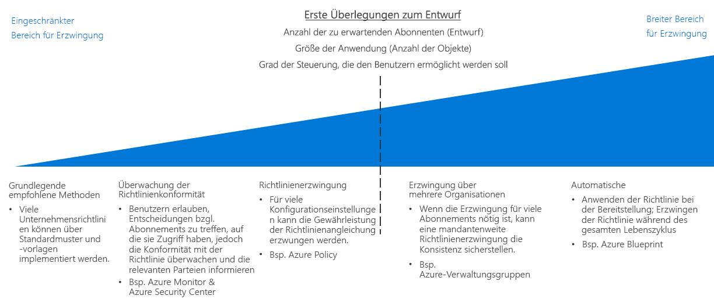

# Leitfaden zur Entscheidungsfindung für die RichtlinienerzwingungPolicy enforcement decision guide

Die Definition von organisationsweiten Richtlinien ist nur wirksam, wenn eine Möglichkeit besteht, sie in Ihrer gesamten Organisation durchzusetzen.Defining organizational policy is not effective unless there is a way to enforce it across your organization. Ein wichtiger Aspekt bei der Planung einer Cloudmigration ist die Festlegung, wie die in der Cloudplattform enthaltenen Tools am besten mit Ihren vorhandenen IT-Prozessen kombiniert werden können, um die Richtlinienkonformität in der gesamten Cloudinfrastruktur zu maximieren.A key aspect to planning any cloud migration is determining how best to combine tools provided by the cloud platform with your existing IT processes to maximize policy compliance across your entire cloud estate.

Wechseln Sie zu: [Grundlegende empfohlene Vorgehensweisen](#baseline-recommended-practices) | [Überwachung der Richtlinienkonformität](#policy-compliance-monitoring) | [Richtlinienerzwingung](#policy-enforcement) | [ Organisationsübergreifende Richtlinie](#cross-organization-policy) | [Automatisierte Durchsetzung](#automated-enforcement)Jump to: [Baseline recommended practices](#baseline-recommended-practices) | [Policy compliance monitoring](#policy-compliance-monitoring) | [Policy enforcement](#policy-enforcement) | [Cross-organization policy](#cross-organization-policy) | [Automated enforcement](#automated-enforcement)

Mit zunehmender Größe Ihrer Cloudumgebung müssen Richtlinien für ein größeres Spektrum von Ressourcen und Abonnements verwaltet und erzwungen werden.As your cloud estate grows, you will be faced with a corresponding need to maintain and enforce policy across a larger array of resources, and subscriptions. Die Vergrößerung Ihrer Umgebung sowie die steigenden Richtlinienanforderungen Ihrer Organisation machen eine Erweiterung Ihrer Richtlinienerzwingungsprozesse erforderlich, um eine konsistente Einhaltung der Richtlinien sowie eine schnelle Erkennung von Verstößen zu gewährleisten.As your estate gets larger and your organization's policy requirements increase, the scope of your policy enforcement processes needs to expand to ensure consistent policy adherence and fast violation detection.

Für kleinere Cloudumgebungen sind in der Regel die von der Plattform bereitgestellten Mechanismen für die Richtlinienerzwingung ausreichend.Platform-provided policy enforcement mechanisms at the resource or subscription level are usually sufficient for smaller cloud estates. Größere Bereitstellungen rechtfertigen ein breiteres Erzwingungsspektrum und erfordern ggf. komplexere Erzwingungsmechanismen mit Bereitstellungsstandards und Ressourcengruppierung/-strukturierung sowie die Integration der Richtlinienerzwingung in Ihre Protokollierungs- und Berichterstellungssysteme.Larger deployments justify a larger enforcement scope and may need to take advantage of more sophisticated enforcement mechanisms involving deployment standards, resource grouping and organization, and integrating policy enforcement with your logging and reporting systems.

Bei der Bestimmung des Umfangs Ihrer Richtlinienerzwingungsprozesse sind in erster Linie die [Cloud Governance-Anforderungen](/azure/architecture/cloud-adoption/governance/overview) Ihrer Organisation, die Größe und Art Ihrer Cloudumgebung sowie die Darstellung Ihrer Organisation in Ihrem [Abonnemententwurf](../subscriptions/overview.md) ausschlaggebend.The primary factors in determining the scope of your policy enforcement processes is your organization's [cloud governance requirements](/azure/architecture/cloud-adoption/governance/overview), the size and nature of your cloud estate, and how your organization is reflected in your [subscription design](../subscriptions/overview.md). Die Vergrößerung Ihrer Umgebung sowie der gestiegene Bedarf für eine zentrale Verwaltung der Richtlinienerzwingung können eine Erweiterung des Erzwingungsspektrums rechtfertigen.An increase in size of your estate or a greater need to centrally manage policy enforcement can both  justify an increase in enforcement scope.

## Grundlegende empfohlene VorgehensweisenBaseline recommended practices

Bei Einzelabonnements und einfachen Cloudbereitstellungen lassen sich viele Unternehmensrichtlinien mithilfe nativer Ressourcen- und Abonnementfeatures der Azure-Plattform erzwingen.For single subscription and simple cloud deployments, many corporate policies can be enforced using features that are native to resources and subscriptions in the Azure platform. Die konsistente Verwendung der Muster aus den [CAF-Leitfäden zur Entscheidungsfindung](../overview.md) trägt zur Etablierung einer grundlegenden Richtlinienkonformität ohne spezielle Investitionen in die Richtlinienerzwingung bei.The consistent use of the patterns discussed throughout the CAF [decision guides](../overview.md) can help establish a baseline level of policy compliance without specific investment in policy enforcement.

Beispiel: For example:

- Mit [Bereitstellungsvorlagen](../resource-consistency/overview.md) können Ressourcen mit standardisierter Struktur und Konfiguration zur Verfügung gestellt werden.[Deployment templates](../resource-consistency/overview.md) can provision resources with standardized structure and configuration.
- Mit [Markierungs- und Benennungsstandards](../resource-tagging/overview.md) können Vorgänge organisiert und Abrechnungs- und Geschäftsanforderungen unterstützt werden.[Tagging and naming standards](../resource-tagging/overview.md) can help organize operations and support accounting and business requirements.
- Einschränkungen für die Datenverkehrsverwaltung und das Netzwerk können über [Software-Defined Networking](../software-defined-network/overview.md) implementiert werden.Traffic management and networking restrictions can be implemented through [software defined networking](../software-defined-network/overview.md).
- Über die [rollenbasierte Zugriffssteuerung](../identity/overview.md) können Ihre Cloudressourcen gesichert und isoliert werden.[Role-based access control](../identity/overview.md) can secure and isolate your cloud resources.

Überprüfen Sie bei Ihrer Planung der Erzwingung von Cloudrichtlinien zunächst, wie sich durch Anwendung der in diesen Leitfäden beschriebenen Standardmuster die in Ihrer Organisation geltenden Anforderungen erfüllen lassen.Start your cloud policy enforcement planning by examining how the application of the standard patterns discussed throughout these guides can help meet your organizational requirements.

## Überwachung der RichtlinienkonformitätPolicy compliance monitoring

Ein erster Schritt, der über die einfache Nutzung der Richtlinienerzwingungsmechanismen der Azure-Plattform hinausgeht, besteht darin, die Überprüfung der Einhaltung von Organisationsrichtlinien für cloudbasierte Anwendungen und Dienste zu ermöglichen.A first step beyond simply relying on the policy enforcement mechanisms provided by the Azure platform, is ensuring ability to verify cloud-based applications and services comply with organizational policy. Dies beinhaltet unter anderem die Implementierung von Benachrichtigungsfunktionen, um Verantwortliche auf nicht mehr konforme Ressourcen aufmerksam zu machen.This includes implementing notification capabilities for alerting responsible parties if a resource becomes noncompliant.  Die wirksame [Protokollierung und Berichterstellung](../log-and-report/overview.md) des Konformitätsstatus Ihrer Cloudworkloads ist ein wichtiger Bestandteil einer Unternehmensstrategie zur Richtlinienerzwingung.Effectively [logging and reporting](../log-and-report/overview.md) the compliance status of your cloud workloads is a critical part of a corporate policy enforcement strategy.

Wenn Ihre Cloudinfrastruktur wächst, können Sie mithilfe zusätzlicher Tools, z.B. [Azure Security Center](/azure/security-center/), die integrierte Sicherheit und Bedrohungserkennung verwenden und die zentrale Richtlinienverwaltung sowie Warnungen für Ihre lokalen und Cloudressourcen nutzen.As your cloud estate grows, additional tools such as [Azure Security Center](/azure/security-center/) can provide integrated security and threat detection, and help apply centralized policy management and alerting for both your on-premises and cloud assets.

## Durchsetzung von RichtlinienPolicy enforcement

In Azure können Konfigurationseinstellungen und Ressourcenerstellungsregeln auf der Verwaltungsgruppen-, Abonnement- oder Ressourcengruppenebene angewendet werden, um die Richtlinieneinhaltung sicherzustellen.In Azure, you can apply configuration settings and resource creation rules at the management group, subscription, or resource group level to help ensure policy alignment.

[Azure Policy](/azure/governance/policy/overview) ist ein Azure-Dienst zum Erstellen, Zuweisen und Verwalten von Richtlinien.[Azure Policy](/azure/governance/policy/overview) is an Azure service for creating, assigning, and managing policies. Mit diesen Richtlinien werden unterschiedliche Regeln und Auswirkungen für Ihre Ressourcen erzwungen, damit diese stets mit Ihren Unternehmensstandards und Vereinbarungen zum Servicelevel konform bleiben.These policies enforce different rules and effects over your resources, so those resources stay compliant with your corporate standards and service level agreements. Mit Azure Policy werden Ihre Ressourcen auf Nichteinhaltung der zugewiesenen Richtlinien überprüft.Azure Policy evaluates your resources for noncompliance with assigned policies. Angenommen, Sie möchten beispielsweise die SKU-Größe von virtuellen Computern in der Umgebung beschränken.For example, you might want to limit the SKU size of virtual machines in your environment. Nachdem eine entsprechende Richtlinie implementiert wurde, wird die Konformität der neuen und vorhandenen Ressourcen dahin gehend geprüft.Once a corresponding policy is implemented, new and existing resources would be evaluated for compliance. Mit der richtigen Richtlinie können vorhandene Ressourcen in Konformität gebracht werden.With the right policy, existing resources can be brought into compliance.

## Organisationsübergreifende RichtlinieCross-organization policy

Wenn Ihre Cloudumgebung wächst und viele Abonnements umfasst, die eine Richtlinienerzwingung erforderlich machen, benötigen Sie eine Erzwingungsstrategie für die gesamte Cloudumgebung, um die Richtlinienkonsistenz zu gewährleisten.As your cloud estate grows to span many subscriptions that require enforcement, you will need to focus on a cloud estate-wide enforcement strategy to ensure policy consistency.

Die Richtlinie muss in Ihrem [Abonnemententwurf](../subscriptions/overview.md) berücksichtigt werden, da sie sich auf Ihre Organisationsstruktur bezieht.Your [subscription design](../subscriptions/overview.md) will need to account for policy as it relates to your organizational structure. Zusätzlich zur Berücksichtigung der komplexen Organisation in Ihrem Abonnemententwurf können [Azure-Verwaltungsgruppen](../subscriptions/overview.md#management-groups) verwendet werden, um Azure Policy-Regeln in mehreren Abonnements zuzuweisen.In addition to helping support complex organization within your subscription design, [Azure management groups](../subscriptions/overview.md#management-groups) can be used to assign Azure Policy rules across multiple subscriptions.

## Automatisierte ErzwingungAutomated enforcement

Während standardisierte Bereitstellungsvorlagen in kleinerem Umfang wirksam sind, ermöglicht [Azure Blueprints](/azure/governance/blueprints/overview) eine umfassende standardisierte Bereitstellung und Bereitstellungsorchestrierung von Azure-Lösungen.While standardized deployment templates are effective at a smaller scale, [Azure Blueprints](/azure/governance/blueprints/overview) allows large-scale standardized provisioning and deployment orchestration of Azure solutions. Workloads in mehreren Abonnements können mit konsistenten Richtlinieneinstellungen für alle erstellten Ressourcen bereitgestellt werden.Workloads across multiple subscriptions can be deployed with consistent policy settings for any resources created.

Für IT-Umgebungen mit Integration von lokalen und Cloudressourcen müssen Sie möglicherweise Protokollierungs- und Berichterstellungssysteme verwenden, um Funktionen für die Hybridüberwachung bereitzustellen.For IT environments integrating cloud and on-premises resources, you may need use logging and reporting systems to provide hybrid monitoring capabilities. Operative Überwachungssysteme von Drittanbietern oder benutzerdefinierte operative Überwachungssysteme umfassen möglicherweise weitere Funktionen zur Richtlinienerzwingung.Your third-party or custom operational monitoring systems may offer additional policy enforcement capabilities. Bei größeren oder schon länger bestehenden Cloudumgebungen sollten Sie sich Gedanken dazu machen, wie Sie diese Systeme am besten mit Ihren Cloudressourcen integrieren.For larger or more mature cloud estates, consider how best to integrate these systems with your cloud assets.

## Nächste SchritteNext steps

Erfahren Sie, wie Sie unter Verwendung der Ressourcenkonsistenz Cloudbereitstellungen zur Unterstützung des Abonnemententwurfs und der Governanceziele organisieren und standardisieren.Learn how resource consistency is used to organize and standardize cloud deployments in support of subscription design and governance goals.

> [!div class="nextstepaction"]
> [RessourcenkonsistenzResource consistency](../resource-consistency/overview.md)
