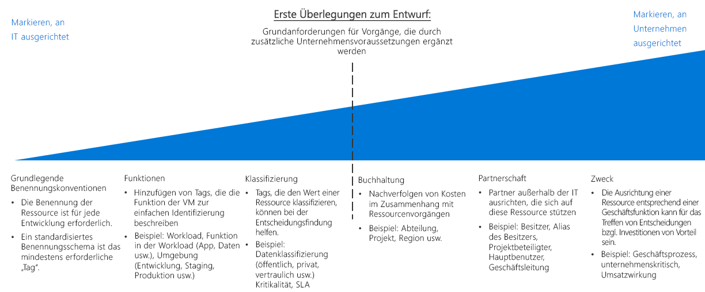

# Leitfaden zur Endscheidungsfindung für Ressourcenorganisation und -markierungResource organization and tagging decision guide

Die Organisation cloudbasierter Ressourcen ist eine der wichtigsten Aufgaben für die IT-Abteilung, wenn Ihre Bereitstellungen nicht extrem einfach aufgebaut sind.Organizing cloud-based resources is one of the most important tasks for IT, unless you have very simple deployments. Die Organisation Ihrer Ressourcen erfüllt drei Hauptaufgaben:Organizing your resources serves three primary purposes:

- **Ressourcenverwaltung**.**Resource Management**. Ihre IT-Teams müssen Ressourcen, die bestimmten Workloads, Umgebungen, Besitzergruppen oder anderen wichtigen Informationen zugeordnet sind, schnell finden.Your IT teams will need to quickly find resources associated with specific workloads, environments, ownership groups, or other important information. Die Organisation von Ressourcen ist wichtig für die Zuweisung organisatorischer Rollen und Zugriffsberechtigungen für die Ressourcenverwaltung.Organizing resources is critical to assigning organizational roles and access permissions for resource management.
- **Automatisierung**.**Automation**. Neben einer Vereinfachung der Ressourcenverwaltung für die IT-Abteilung ermöglicht Ihnen ein angemessenes Organisationsschema die Nutzung der Automatisierung im Rahmen der Ressourcenerstellung, der Betriebsüberwachung und der Erstellung von DevOps-Prozessen.In addition to making resources easier for IT to manage, a proper organizational scheme allows you to take advantage of automation as part of resource creation, operational monitoring, and the creation of DevOps processes.
- **Rechnungsstellung**.**Accounting**. Um Unternehmensgruppen auf den Verbrauch von Cloudressourcen aufmerksam zu machen, muss die IT-Abteilung verstehen, welche Workloads und Teams welche Ressourcen verwenden.Making business groups aware of cloud resource consumption requires IT to understand what workloads and teams are using which resources. Um Ansätze wie z.B. die verbrauchsbasierte Kostenzuteilung zu unterstützen, müssen Cloudressourcen dem Besitz und der Nutzung entsprechend organisiert werden.To support approaches such as chargeback and showback accounting, cloud resources need to be organized to reflect ownership and usage.

## Leitfaden zur Entscheidungsfindung für MarkierungenTagging decision guide

Wechseln Sie zu: [Baselinenamenskonventionen](#baseline-naming-conventions) | [Ressourcenmarkierungsmuster](#resource-tagging-patterns) | [Namens- und Markierungsrichtlinie](#naming-and-tagging-policy) | [Weitere Informationen](#learn-more)Jump to: [Baseline naming conventions](#baseline-naming-conventions) | [Resource tagging patterns](#resource-tagging-patterns) | [Naming and tagging policy](#naming-and-tagging-policy) | [Learn more](#learn-more)

Ihr Markierungsansatz kann einfach oder komplex sein, wobei der Schwerpunkt von der Unterstützung der IT-Teams, die die Cloudworkloads verwalten, bis zur Integration von Informationen zu sämtlichen Aspekten des gesamten Unternehmen reichen kann.Your tagging approach can be simple or complex, with the emphasis ranging from supporting IT teams managing cloud workloads to integrating information relating to all aspects of the entire business.

Ein IT-orientierter Markierungsfokus (etwa Markierungen auf der Grundlage von Workload, Funktion oder Umgebung) macht die Überwachung von Ressourcen weniger komplex und vereinfacht Entscheidungen auf der Grundlage operativer Anforderungen erheblich.An IT aligned tagging focus, such as tagging based on workload, function, or environment, will reduce the complexity of monitoring assets and make management decisions based on operational requirements much easier.

Bei Markierungsschemas mit geschäftlichem Fokus (beispielsweise Buchhaltung, Unternehmensbesitz oder geschäftliche Bedeutung) muss unter Umständen mehr Zeit in die Erstellung von Markierungsstandards investiert werden, die die Geschäftsinteressen widerspiegeln und diese Standards langfristig bewahren.Tagging schemes that include a business aligned focus, such as accounting, business ownership, or business criticality may require a larger time investment to create tagging standards that reflect business interests and maintain those standards over time. Allerdings ist das Ergebnis dieses Prozesses ein Markierungssystem, das eine verbesserte Erfassung der Kosten und des Werts von IT-Ressourcen für das gesamte Unternehmen bietet.However, the result of this process is a tagging system providing an improved ability to account for costs and value of IT assets to the overall business. Diese Verknüpfung des geschäftlichen Werts einer Ressource mit den Betriebskosten ist einer der ersten Schritte, um die Wahrnehmung der IT als Kostenfaktor in Ihrer Organisation zu verändern.This association of an asset's business value to its operational cost is one of the first steps in changing the cost center perception of IT within your wider organization.

## BaselinenamenskonventionenBaseline naming conventions

Eine standardisierte Namenskonvention ist der Ausgangspunkt für die Organisation Ihrer in der Cloud gehosteten Ressourcen.A standardized naming convention is the starting point for organizing your cloud-hosted resources. Mit einem ordnungsgemäß strukturierten Benennungssystem können Sie Ressourcen sowohl zu Verwaltungs- als auch zu Abrechnungszwecken schnell identifizieren.A properly structured naming system allows you to quickly identify resources for both management and accounting purposes. Wenn in anderen Teilen Ihrer Organisation bereits IT-Namenskonventionen vorhanden sind, wägen Sie ab, ob Sie Ihre Namenskonventionen für die Cloud darauf abstimmen oder separate cloudbasierte Standards einrichten möchten.If you have existing IT naming conventions in other parts of your organization, consider whether your cloud naming conventions should align with them or if you should establish separate cloud-based standards.

Beachten Sie auch, dass unterschiedliche Azure-Ressourcentypen unterschiedliche [Benennungsanforderungen](../../../best-practices/naming-conventions.md#naming-rules-and-restrictions) aufweisen.Note also that different Azure resource types have different [naming requirements](../../../best-practices/naming-conventions.md#naming-rules-and-restrictions). Ihre Namenskonventionen müssen mit diesen Benennungsanforderungen kompatibel sein.Your naming conventions must be compatible with these naming requirements.

## RessourcenmarkierungsmusterResource tagging patterns

Für eine komplexere Organisation als eine konsistente Namenskonvention bereitstellen kann, unterstützen Cloudplattformen die Möglichkeit zum Markieren von Ressourcen.For more sophisticated organization than a consistent naming convention only can provide, cloud platforms support the ability to tag resources.

*Markierungen* sind Metadatenelemente, die den Ressourcen zugeordnet werden.*Tags* are metadata elements attached to resources. Markierungen bestehen aus Paaren aus Schlüssel-Wert-Zeichenfolgen.Tags consist of pairs of key/value strings. Welche Werte Sie in diese Paare einschließen, bleibt Ihnen überlassen, aber die Anwendung einer konsistenten Menge globaler Markierungen im Rahmen einer umfassenden Benennungs- und Markierungsrichtlinie ist ein wesentlicher Bestandteil einer allgemein gültigen Governancerichtlinie.The values you include in these pairs is up to you, but the application of a consistent set of global tags, as part of a comprehensive naming and tagging policy, is a critical part of an overall governance policy.

Im Folgenden sind einige Beispiele für allgemeine Markierungsmuster aufgeführt:Here are some examples of common tagging patterns:

<!-- markdownlint-disable MD033 -->

| MarkierungstypTag type | BeispieleExamples | BESCHREIBUNGDescription |
|-----|-----|-----|
| FunktionenFunctional            | app = catalogsearch1app = catalogsearch1  tier = webtier = web  webserver = apachewebserver = apache env = prodenv = prod  env = stagingenv = staging  env = devenv = dev                 | Kategorisieren Sie Ressourcen in Bezug auf ihren Zweck innerhalb einer Workload, auf die Umgebung, in der sie bereitgestellt werden, oder auf andere funktionsbezogene oder operative Details.Categorize resources in relation to their purpose within a workload, what environment they've been deployed to, or other functionality and operational details.                                 |
| ClassificationClassification        | confidentiality=privateconfidentiality=private sla = 24hourssla = 24hours                                 | Klassifiziert eine Ressource danach, wie sie verwendet wird und welche Richtlinien für sie gelten.Classifies a resource by how it is used and what policies apply to it                               |
| BuchhaltungAccounting            | department = financedepartment = finance  project = catalogsearchproject = catalogsearch  region = northamericaregion = northamerica | Ermöglicht die Zuordnung der Ressource zu bestimmten Gruppen innerhalb einer Organisation zu Abrechnungszwecken.Allows resource to be associated with specific groups within an organization for billing purposes |
| PartnerschaftPartnership           | owner = jsmithowner = jsmith  contactalias = catsearchownerscontactalias = catsearchowners stakeholders = user1;user2;user3stakeholders = user1;user2;user3                        | Enthält Informationen dazu, welche Personen (außerhalb der IT) mit der Ressource verknüpft oder in anderer Form von ihr betroffen sind.Provides information about what people (outside of IT) are related or otherwise affected by the resource                      |
| ZweckPurpose               | businessprocess=supportbusinessprocess=support businessimpact=moderatebusinessimpact=moderate revenueimpact=highrevenueimpact=high   | Richtet Ressourcen an Geschäftsfunktionen aus, um Investitionsentscheidungen besser zu unterstützen.Aligns resources to business functions to better support investment decisions  |

<!-- markdownlint-enable MD033 -->

## Namens- und MarkierungsrichtlinieNaming and tagging policy

Ihre Benennungs- und Markierungsrichtlinie wird sich im Laufe der Zeit weiterentwickeln.Your naming and tagging policy will evolve over time. Es ist jedoch entscheidend, dass Sie Ihre wesentlichen organisatorischen Prioritäten zu Beginn einer Cloudmigration festlegen.However, determining your core organizational priorities at the outset of a cloud migration is critical. Erwägen Sie im Rahmen Ihres Planungsprozesses sorgfältig die folgenden Fragen:As part of your planning process, carefully consider the following questions:

- Wie können Ihre Benennungs- und Markierungsrichtlinien am besten in vorhandene Benennungs- und Organisationsrichtlinien innerhalb Ihrer Organisation integriert werden?How best can your naming and tagging policies integrate with existing naming and organizational policies within your organization?
- Werden Sie ein Abrechnungssystem mit verbrauchsbasierter Kostenzuteilung implementieren?Will you implement a chargeback or showback accounting system? Müssen Sie Buchhaltungsinformationen für Abteilungen, Geschäftsbereiche und Teams bereitstellen, die über eine einfache Aufschlüsselung auf der Abonnementebene hinausgehen?Will you need to provide accounting information for departments, business groups, and teams in more detail than a simple subscription-level breakdown allows?
- Welche Markierungsinformationen werden für alle Ressourcen benötigt?What tagging information will be required for all resources? Die Implementierung welcher Markierungsinformationen wird den einzelnen Teams überlassen?What tagging information will be left up to individual teams to implement or not implement?
- Muss die Markierung Details wie Anforderungen zur Einhaltung gesetzlicher Bestimmungen für eine Ressource darstellen?Does tagging need to represent details such regulatory compliance requirements for a resource? Wie sieht es mit betriebsbezogenen Details wie Anforderungen an die Betriebszeiten, Zeitpläne für Patches oder Sicherheitsanforderungen aus?What about operational details such as uptime requirements, patching schedules, or security requirements?

## Weitere InformationenLearn more

Weitere Informationen zur Benennung und Markierung in Azure finden Sie unter:For more information about naming and tagging in Azure, see:

- [Namenskonventionen für Azure-Ressourcen](../../../best-practices/naming-conventions.md).[Naming conventions for Azure resources](../../../best-practices/naming-conventions.md). In dieser Anleitung auf der Website mit Azure-Cloudgrundlagen finden Sie empfohlene Namenskonventionen für Azure-Ressourcen.Refer to this guidance from the Azure Cloud Fundamentals site for recommended naming conventions for Azure resources.
- [Verwenden von Tags zum Organisieren von Azure-Ressourcen](/azure/azure-resource-manager/resource-group-using-tags?toc=/azure/billing/TOC.json).[Use tags to organize your Azure resources](/azure/azure-resource-manager/resource-group-using-tags?toc=/azure/billing/TOC.json). Sie können Tags in Azure sowohl auf der Ressourcengruppenebene als auch auf der Ebene einzelner Ressourcen anwenden. So können Sie Abrechnungsberichte anhand der angewendeten Markierungen unterschiedlich detailliert gestalten.You can apply tags in Azure at both the resource group and individual resource level, giving you flexibility in the granularity of any accounting reports based on applied tags.

## Nächste SchritteNext steps

Erfahren Sie, wie die Verschlüsselung zum Absichern von Daten in Cloudumgebungen verwendet wird.Learn how encryption is used to secure data in cloud environments.

> [!div class="nextstepaction"]
> [VerschlüsselungEncryption](../encryption/overview.md)
