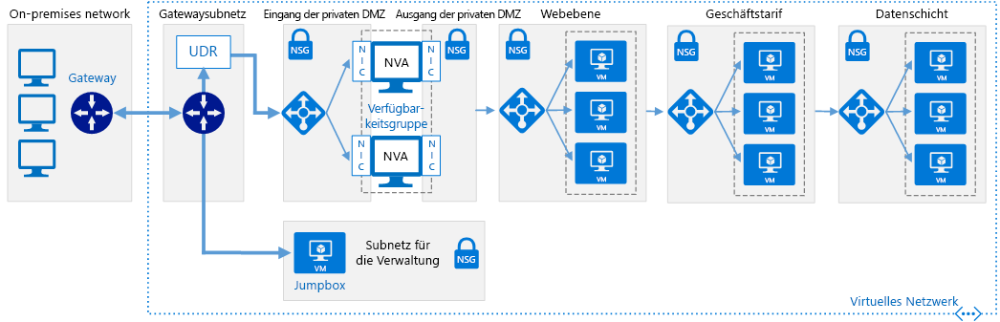

# Softwaredefinierte Netzwerke: Cloud-DMZ

Die Netzwerkarchitektur von Cloud-DMZ ermöglicht einen eingeschränkten Zugriff zwischen Ihren lokalen und cloudbasierten Netzwerken, indem ein virtuelles privates Netzwerk (VPN) zur Verbindung der Netzwerke verwendet wird. Eine DMZ wird in der Cloud bereitgestellt, um den Zugriff auf das lokale Netzwerk aus cloudbasierten Ressourcen zu schützen.

Diese Architektur ist so ausgelegt, dass Szenarien unterstützt werden, in denen Ihr Unternehmen mit der Integration von cloudbasierten Workloads in lokale Workloads beginnen möchte, aber möglicherweise noch keine vollständig ausgereiften Sicherheitsrichtlinien für die Cloud hat oder keine sichere dedizierte WAN-Verbindung zwischen den beiden Umgebungen hergestellt wurde. Daher sollten Cloudnetzwerke wie eine DMZ behandelt werden, um zu gewährleisten, dass lokale Dienste sicher sind.

Die DMZ stellt virtuelle Netzwerkappliances (NVAs) bereit, die Sicherheitsfunktionen wie Firewalls und Paketüberprüfung implementieren. Datenverkehr zwischen lokalen und cloudbasierten Anwendungen oder Diensten muss die DMZ passieren, wo er überprüft werden kann. VPN-Verbindungen und die Regeln, die festlegen, welcher Datenverkehr durch das DMZ-Netzwerk geleitet werden darf, werden von IT-Sicherheitsteams streng kontrolliert.

## Annahmen für Cloud-DMZ

Für die Bereitstellung von Cloud-DMZ wird Folgendes angenommen:

- Ihre Sicherheitsteams haben die lokalen und cloudbasierten Sicherheitsanforderungen und -richtlinien noch nicht vollständig aufeinander abgestimmt.
- Ihre cloudbasierten Workloads erfordern einen eingeschränkten Zugriff auf Dienste, die in Ihren lokalen oder Drittanbieternetzwerken gehostet werden, oder Ihre Benutzer oder Anwendungen in Ihren lokalen Umgebungen benötigen eingeschränkten Zugriff auf in der Cloud gehostete Ressourcen.
- Die Implementierung eines VPN zwischen Ihren lokalen Netzwerken und dem Cloudanbieter wird nicht durch unternehmensinterne Richtlinien, regulatorische Anforderungen oder technische Kompatibilitätsprobleme erschwert.
- Ihre Workloads erfordern entweder nicht mehrere Abonnements, um die Ressourcenbeschränkungen für Abonnements zu umgehen, oder sie umfassen mehrere Abonnements, erfordern aber keine zentrale Verwaltung der Konnektivität oder gemeinsamen Dienste, die von auf mehrere Abonnements verteilten Ressourcen genutzt werden.

Ihr für den Umstieg auf die Cloud zuständiges Team muss die folgenden Aspekte berücksichtigen, wenn die Implementierung einer virtuellen Netzwerkarchitektur mit Cloud-DMZ erwogen wird:

- Durch die Verbindung von lokalen Netzwerken mit Cloudnetzwerken steigt die Komplexität Ihrer Sicherheitsanforderungen. Auch wenn die Verbindung zwischen Cloudnetzwerken und der lokalen Umgebung geschützt ist, müssen Sie dennoch dafür sorgen, dass Cloudressourcen geschützt sind.
- Die Cloud-DMZ-Architektur wird häufig als Ausgangspunkt verwendet, während die Konnektivität weiter abgesichert und die Sicherheitsrichtlinien zwischen lokalen und Cloudnetzwerken abgestimmt werden, was eine breitere Einführung einer vollständig hybriden Netzwerkarchitektur ermöglicht.

## Weitere Informationen

Nachstehend finden Sie weitere Informationen zur Cloud-DMZ-Implementierung auf der Azure-Plattform.

- [Implementieren einer DMZ zwischen Azure und Ihrem lokalen Rechenzentrum](../../../reference-architectures/dmz/secure-vnet-hybrid.md). In diesem Artikel wird das Implementieren einer sicheren hybriden Netzwerkarchitektur in Azure erörtert.
