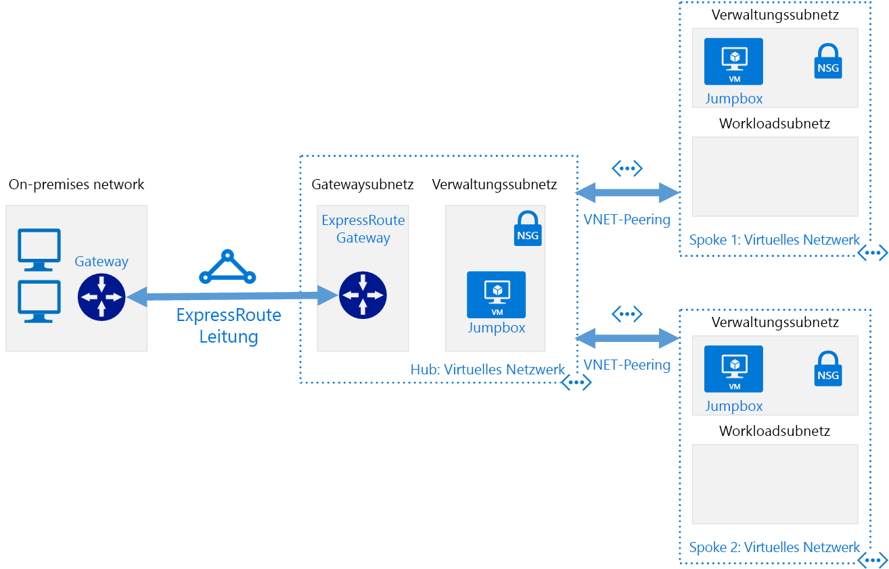

# Softwaredefinierte Netzwerke: Hub-and-Spoke-ModellSoftware Defined Networks: Hub and Spoke

Im Hub-and-Spoke-Netzwerkmodell wird Ihre auf Azure basierende Cloud-Netzwerkinfrastruktur in mehreren verbundenen virtuellen Netzwerken organisiert.The hub and spoke networking model organizes your Azure-based cloud network infrastructure into multiple connected virtual networks. Mithilfe dieses Modells können Sie gängige Kommunikations- oder Sicherheitsanforderungen effizienter bewältigen und mögliche Einschränkungen des Abonnements berücksichtigen.This model allows you to more efficiently manage common communication or security requirements and deal with potential subscription limitations.

Im Hub-and-Spoke-Modell ist der *Hub* ein virtuelles Netzwerk, das als Zentrale für die Verwaltung externer Konnektivitäts- und Hostingdienste dient, die von mehreren Workloads genutzt werden.In the hub and spoke model, the *hub* is a virtual network that acts as a central location for managing external connectivity and hosting services used by multiple workloads. Die *Spokes* sind virtuelle Netzwerke, die Workloads hosten und sich über [Peering virtueller Netzwerke](/virtual-network/virtual-network-peering-overview) mit dem zentralen Hub verbinden.The *spokes* are virtual networks that host workloads and connect to the central hub through [virtual network peering](/virtual-network/virtual-network-peering-overview).

Der gesamte Datenverkehr, der in die oder aus den Spoke-Netzwerken der Workload geleitet wird, wird über das Hub-Netzwerk geleitet, wo er weitergeleitet, inspiziert oder anderweitig von zentral verwalteten IT-Regeln oder -Prozessen verwaltet werden kann.All traffic passing in or out of the workload spoke networks is routed through the hub network where it can be routed, inspected, or otherwise managed by centrally managed IT rules or processes.

Dieses Modell zielt darauf ab, die folgenden Probleme zu lösen:This model aims to address the following issues:

- Kosteneinsparungen und Effizienz der Verwaltung.Cost savings and management efficiency. Zentralisierung von Diensten, die von mehreren Workloads, z.B. Network Virtual Appliances (NVAs) und DNS-Servern an einem zentralen Standort gemeinsam genutzt werden können. Auf diese Weise kann die IT-Abteilung redundante Ressourcen und den Verwaltungsaufwand für mehrere Workloads minimieren.Centralizing services that can be shared by multiple workloads, such as network virtual appliances (NVAs) and DNS servers, in a single location allows IT to minimize redundant resources and management effort across multiple workloads.
- Umgehen von Abonnementgrenzen.Overcoming subscriptions limits. Große cloudbasierte Workloads können den Einsatz von mehr Ressourcen erfordern, als innerhalb eines einzelnen Azure-Abonnements zulässig ist (siehe [Abonnementgrenzen](/azure/azure-subscription-service-limits)).Large cloud-based workloads may require the use of more resources than are allowed within a single Azure subscription (see [subscription limits](/azure/azure-subscription-service-limits)). Durch ein Peering virtueller Netzwerke für eine Workload aus verschiedenen Abonnements zu einem zentralen Hub können diese Grenzwerte umgangen werden.Peering workload virtual networks from different subscriptions to a central hub can overcome these limits.
- Trennung von Zuständigkeiten.Separation of concerns. Die Fähigkeit, einzelne Workloads zwischen zentralen IT-Teams und für Workloads zuständige Teams bereitzustellen.The ability to deploy individual workloads between central IT teams and workloads teams.

Das folgende Diagramm zeigt eine exemplarische Hub-and-Spoke-Architektur mit zentral verwalteter Hybridkonnektivität.The following diagram shows an example hub and spoke architecture including centrally managed hybrid connectivity.

Die Hub-and-Spoke-Architektur wird häufig zusammen mit der hybriden Netzwerkarchitektur verwendet und bietet eine zentral verwaltete Verbindung mit Ihrer lokalen Umgebung, die von mehreren Workloads gemeinsam genutzt wird.The hub and spoke architecture is often used alongside the hybrid networking architecture, providing a centrally managed connection to your on-premises environment shared between multiple workloads. In diesem Szenario durchläuft der gesamte Datenverkehr zwischen den Workloads und den lokalen Standorten den Hub, wo er verwaltet und geschützt werden kann.In this scenario, all traffic traveling between the workloads and on-premises passes through the hub where it can be managed and secured.

## Annahmen für das Hub-and-Spoke-ModellHub and spoke assumptions

Für die Implementieren einer virtuellen Netzwerkarchitektur gemäß Hub-and-Spoke-Modell wird Folgendes angenommen:Implementing a hub and spoke virtual networking architecture assumes the following:

- Ihre Cloudbereitstellungen umfassen Workloads, die in separaten Arbeitsumgebungen wie Entwicklung, Test und Produktion gehostet werden, und die alle auf einer Reihe von gemeinsamen Diensten wie DNS oder Verzeichnisdiensten basieren.Your cloud deployments will involve workloads hosted in separate working environments, such as development, test, and production, that all rely on a set of common services such as DNS or directory services.
- Ihre Workloads müssen nicht miteinander kommunizieren, sondern haben gemeinsame Anforderungen an die externe Kommunikation und gemeinsam genutzte Dienste.Your workloads do not need to communicate with each other but have common external communications and shared services requirements.
- Ihre Workloads erfordern mehr Ressourcen, als innerhalb eines einzelnen Azure-Abonnements verfügbar sind.Your workloads require more resources than are available within a single Azure subscription.
- Sie müssen für Workloads zuständigen Teams delegierte Verwaltungsrechte für ihre eigenen Ressourcen zur Verfügung stellen und gleichzeitig die zentrale Sicherheitskontrolle über die externe Konnektivität beibehalten.You need to provide workload teams with delegated management rights over their own resources while maintaining central security control over external connectivity.

## Globales Hub-and-Spoke-ModellGlobal hub and spoke

Hub-and-Spoke-Architekturen werden häufig mit virtuellen Netzwerken implementiert, die in derselben Azure-Region bereitgestellt werden, um die Wartezeiten zwischen Netzwerken zu minimieren.Hub and spoke architectures are commonly implemented with virtual networks deployed to the same Azure Region to minimize latency between networks. Große Unternehmen mit globaler Reichweite müssen jedoch möglicherweise Workloads in mehreren Regionen bereitstellen, um Verfügbarkeit, Notfallwiederherstellung oder die Erfüllung gesetzlicher Anforderungen zu gewährleisten.However, large organizations with global reach may need to deploy workloads across multiple regions for availability, disaster recovery, or regulatory requirements. Durch den Einsatz eines [globalen Peerings virtueller Netzwerke](/azure/virtual-network/virtual-network-peering-overview) in Azure kann das Hub-and-Spoke-Modell die zentralisierte Verwaltung und die gemeinsamen Dienste regionsübergreifend erweitern, um die über die ganze Welt verteilten Workloads zu unterstützen.Through the use of Azure [global virtual network peering](/azure/virtual-network/virtual-network-peering-overview), the hub and spoke model can extend centralized management and shared services across regions to support workloads distributed across the world.

## Weitere InformationenLearn more

Beispiele der Implementierung von Hub-and-Spoke-Netzwerken in Azure finden Sie in den folgenden Beispielen auf der Website zu Azure Referenzarchitekturen:For examples of how to implement hub and spoke networks on Azure, see the following examples on the Azure Reference Architectures site:

- [Implementieren einer Hub-Spoke-Netzwerktopologie in AzureImplement a hub-spoke network topology in Azure](../../../reference-architectures/hybrid-networking/hub-spoke.md)
- [Implementieren einer Hub-Spoke-Netzwerktopologie mit gemeinsamen Diensten in AzureImplement a hub-spoke network topology with shared services in Azure](../../../reference-architectures/hybrid-networking/shared-services.md)
