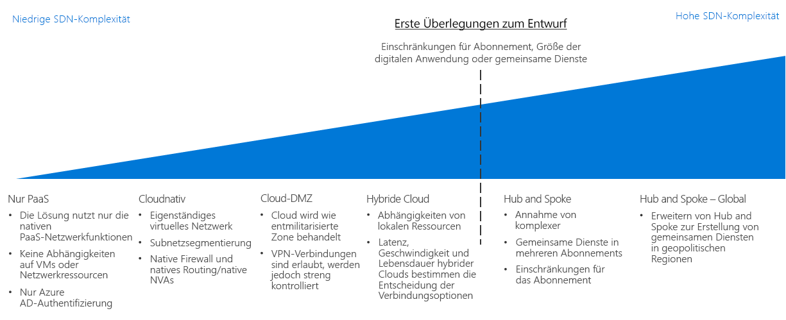

# Framework für die Cloudeinführung (Cloud Adoption Framework, CAF): Leitfaden zur Entscheidungsfindung für softwaredefinierte Netzwerke

Software-Defined Networking (SDN) ist eine Netzwerkarchitektur, die entwickelt wurde, um virtualisierte Netzwerkfunktionen zu ermöglichen, die mithilfe von Software zentral verwaltet, konfiguriert und modifiziert werden können. SDN stellt eine Abstraktionsschicht über der physischen Netzwerkinfrastruktur bereit und stellt virtualisierte Äquivalent zu physischen Routern, Firewalls und anderer Netzwerkhardware zur Verfügung, die Sie auch in einem lokalen Netzwerk vorfinden.

SDN ermöglicht IT-Mitarbeitern, Netzwerkstrukturen und -funktionen zu konfigurieren und bereitzustellen, die Anforderungen von Workloads mithilfe virtualisierter Ressourcen unterstützen. Die Flexibilität der softwarebasierten Bereitstellungsverwaltung ermöglicht eine schnelle Änderung von Netzwerkressourcen und die Unterstützung sowohl agiler als auch herkömmlicher Bereitstellungsmodelle. Mit SDN-Technologie erstellte virtualisierte Netzwerke sind entscheidend beim Aufbau sicherer Netzwerke auf einer öffentlichen Cloudplattform.

## Leitfaden zur Entscheidungsfindung für Netzwerke

Wechseln Sie zu: [Nur PaaS](paas-only.md) | [Cloudnativ](cloud-native.md) | | [Cloud-DMZ](cloud-dmz.md) [Hybrid](hybrid.md) | [Hub-and-Spoke-Modell](hub-spoke.md) | [Weitere Informationen](#learn-more)

SDN bietet mehrere Optionen mit unterschiedlicher Preisgestaltung und Komplexität. Dieser Leitfaden zur Entscheidungsfindung bietet eine Referenz, um diese Optionen schnell zu personalisieren und so optimal auf spezifische Geschäfts- und Technologiestrategien abzustimmen.

Der Kernpunkt in diesem Leitfaden hängt von mehreren wichtigen Entscheidungen ab, die Ihr für die Cloudstrategie verantwortliches Team getroffen hat, bevor es Entscheidungen zur Netzwerkarchitektur trifft. Am wichtigsten sind dabei Entscheidungen, die die [Definition Ihre digitalen Umfelds](../../digital-estate/overview.md) und das [Abonnementmodell](../subscriptions/overview.md) betreffen (was auch Rückmeldungen zu Entscheidungen im Zusammenhang mit Ihrer Cloudabrechnung und Ihren globalen Marktstrategien erfordern kann).

Kleine Bereitstellungen in einer einzelnen Region mit weniger als 1.000 VMs sind weniger wahrscheinlich von diesem Aspekt betroffen. Im Gegensatz dazu können große Umsetzungsanstrengungen mit mehr als 1.000 VMs, mehreren Geschäftsbereichen oder mehreren geopolitischen Märkten erheblich von Ihrer SDN-Entscheidung und diesem wichtigen Aspekt beeinflusst werden.

## Wählen der richtigen virtuellen Netzwerkarchitekturen

Dieser Abschnitt in diesem Leitfaden zur Entscheidungsfindung soll Ihnen helfen, die richtigen virtuellen Netzwerkarchitekturen zu wählen.

Es gibt viele Möglichkeiten, SDN-Technologien zur Erstellung cloudbasierter virtueller Netzwerke zu implementieren. Wie Sie die bei der Migration verwendeten virtuellen Netzwerke strukturieren und wie diese mit Ihrer bestehenden IT-Infrastruktur interagieren, hängt von Ihren Anforderungen an Workloads und Governance ab.

Bei der Festlegung der virtuellen Netzwerkarchitektur oder einer Kombination von Architekturen, die bei der Planung Ihrer Cloudmigration zu berücksichtigen sind, sollten Sie die folgenden Fragen prüfen, um festzustellen, was für Ihr Unternehmen das Richtige ist:

| Frage | Nur PaaS | Cloudnativ | Cloud-DMZ | Hybrid | Hub-and-Spoke-Modell |
|-----|-----|-----|-----|-----|-----|
| Wird Ihre Workload nur PaaS-Dienste nutzen und keine Netzwerkfunktionen benötigen, die über die von den Diensten selbst bereitgestellten hinausgehen? | Ja | Nein  | Nein  | Nein  | Nein  |
| Ist für Ihre Workload eine Integration in lokale Anwendungen erforderlich? | Nein  | Nein  | Ja | Ja | Ja |
| Verfügen Sie über ausgereifte Sicherheitsrichtlinien und sichere Verbindungen zwischen Ihren lokalen und Cloudnetzwerken? | Nein  | Nein  | Nein  | Ja | Ja |
| Erfordert Ihre Workload Authentifizierungsdienste, die nicht von Cloudidentitätsdiensten unterstützt werden, oder benötigen Sie direkten Zugriff auf lokale Domänencontroller? | Nein  | Nein  | Nein  | Ja | Ja |
| Müssen Sie eine große Anzahl von VMs und Workloads bereitstellen und verwalten? | Nein  | Nein  | Nein  | Nein  | Ja |
| Müssen Sie eine zentrale Verwaltung und lokale Konnektivität bereitstellen und gleichzeitig die Kontrolle über die Ressourcen an einzelne für eine Workload zuständige Teams delegieren? | Nein  | Nein  | Nein  | Nein  | Ja |

## Virtuelle Netzwerkarchitekturen

Erfahren Sie mehr über die wichtigsten Software-Defined Networking-Architekturen:

- [**Nur PaaS**](paas-only.md): PaaS-Produkte (Platform as a Service) unterstützen eine begrenzte Anzahl integrierter Netzwerkfunktionen und erfordern möglicherweise kein explizit definiertes softwaredefiniertes Netzwerk zur Unterstützung der Anforderungen der Workload.
- [**Cloudnativ**](cloud-native.md): Ein cloudnatives virtuelles Netzwerk ist die standardmäßige softwaredefinierte Netzwerkarchitektur, wenn Ressourcen auf einer Cloudplattform bereitgestellt werden.
- [**Cloud-DMZ**](cloud-dmz.md): Bietet eingeschränkte Konnektivität zwischen Ihrem lokalen und Cloudnetzwerk, das durch die Implementierung einer DMZ in der Cloudumgebung geschützt ist.
- [**Hybrid**](hybrid.md): Die hybride Cloud-Netzwerkarchitektur ermöglicht in virtuellen Netzwerken, auf Ihre lokalen Ressourcen zuzugreifen und umgekehrt.
- [**Hub-and-Spoke-Modell**](hub-spoke.md): Die Hub-and-Spoke-Architektur ermöglicht Ihnen, externe Konnektivität und gemeinsam genutzte Dienste zentral zu verwalten, einzelne Workloads zu isolieren und mögliche Abonnementgrenzen zu umgehen.

## Weitere Informationen

Nachstehend finden Sie weitere Informationen zu Software-Defined Networking auf der Azure-Plattform.

- [Azure Virtual Network](/azure/virtual-network/virtual-networks-overview). In Azure wird die zentrale SDN-Funktionalität von Azure Virtual Network bereitgestellt, das als Cloud analog zu physischen lokalen Netzwerken fungiert. Virtuelle Netzwerke fungieren auch als Standardisolationsgrenze zwischen Ressourcen auf der Plattform.
- [Bewährte Methoden für Azure-Netzwerksicherheit](/azure/security/azure-security-network-security-best-practices). Empfehlungen des Azure Security-Teams zum Konfigurieren Ihrer virtuellen Netzwerke, um Sicherheitsrisiken zu minimieren.

## Nächste Schritte

Erfahren Sie, wie Protokolle, Überwachung und Berichterstellung von Betriebsteams verwendet werden, um die Integrität und Einhaltung von Richtlinien bei Cloudworkloads sicherzustellen.

> [!div class="nextstepaction"]
> [Protokolle und Berichterstellung](../log-and-report/overview.md)
