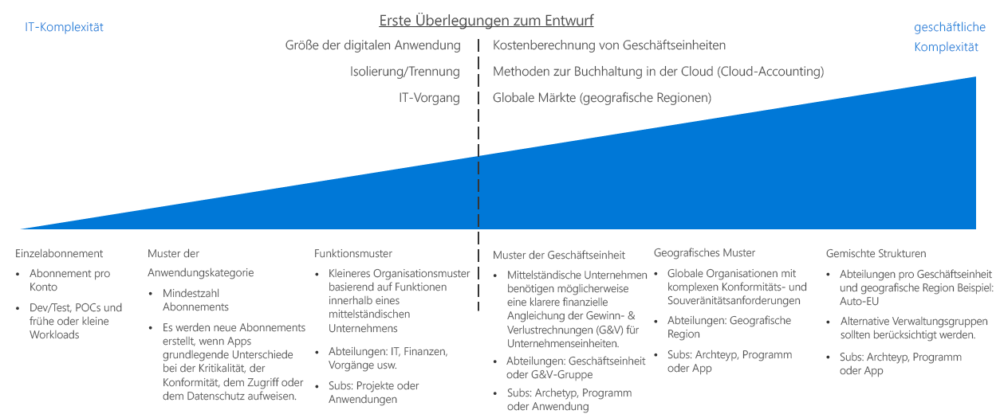
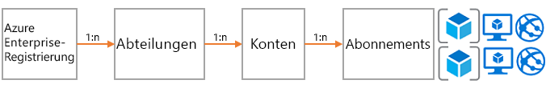
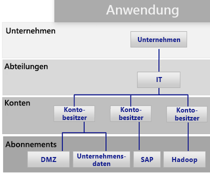
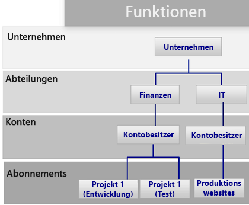
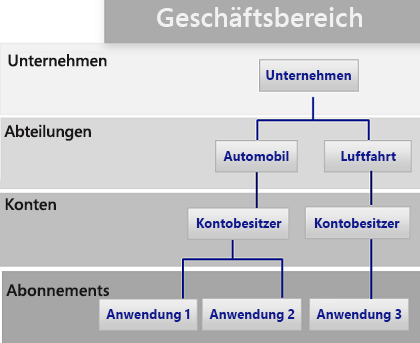
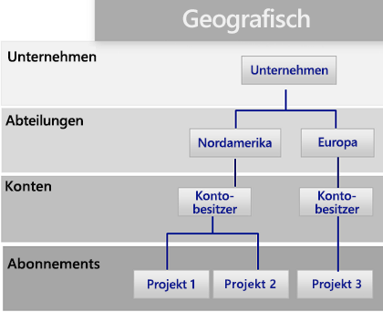

# Leitfaden zur Entscheidungsfindung für AbonnementsSubscription decision guide

Alle Cloudplattformen beruhen im Wesentlichen auf einem Besitzmodell, das Organisationen zahlreiche Optionen zur Abrechnungs- und Ressourcenverwaltung bereitstellt.All cloud platforms are based on a core ownership model that provides organizations with numerous billing and resource management options. Die von Azure verwendete Struktur unterscheidet sich von der anderer Cloudanbieter, weil sie verschiedene Supportoptionen für die Organisationshierarchie und Abonnementbesitzgruppen enthält.The structure that Azure uses is different from other cloud providers because it includes various support options for organizational hierarchy and grouped subscription ownership. Unabhängig davon gibt es in der Regel eine Person, die für die Abrechnung verantwortlich ist, und eine andere, die als Besitzer oberster Ebene für die Verwaltung von Ressourcen festgelegt wird.Regardless, there is generally one individual responsible for billing and another who is assigned as the top-level owner for managing resources.

Wechseln Sie zu: [Abonnemententwurf und Azure Enterprise Agreements](#subscriptions-design-and-azure-enterprise-agreements) | [Abonnemententwurfsmuster](#subscription-design-patterns) | [Verwaltungsgruppen](#management-groups) | [Organisation auf Abonnementebene](#organization-at-the-subscription-level)Jump to: [Subscriptions design and Azure Enterprise Agreements](#subscriptions-design-and-azure-enterprise-agreements) | [Subscription design patterns](#subscription-design-patterns) | [Management groups](#management-groups) | [Organization at the subscription level](#organization-at-the-subscription-level)

Der Abonnemententwurf ist eine der gängigsten Strategien, die Unternehmen bei der Cloudeinführung zum Einrichten einer Struktur oder zum Organisieren von Ressourcen verwenden.Subscription design is one of the most common strategies that companies use to establish a structure or organize assets during cloud adoption.

**Abonnementhierarchie**: Ein *Abonnement* ist eine logische Sammlung von Azure-Diensten (z.B. virtuelle Computer, SQL-Datenbank, App Services oder Container).**Subscription hierarchy**: A *subscription* is a logical collection of Azure services (such as virtual machines, SQL DB, App Services, or containers). Jede Ressource in Azure wird in einem einzigen Abonnement bereitgestellt.Each asset in Azure is deployed to a single subscription. Jedes Abonnement gehört einem *Konto*.Each subscription is then owned by one *account*. Dieses Konto ist ein Benutzerkonto (oder vorzugsweise ein Dienstkonto), das im gesamten Abonnement Zugriff auf Abrechnungs- und Administratoraufgaben bereitstellt.This account is a user account (or preferably a service account) that provides billing and administrative access across a subscription. Für Kunden, die sich dazu verpflichtet haben, im Rahmen eines Enterprise Agreement (EA) eine bestimmte Menge in Azure zu nutzen, wird eine weitere Steuerungsebene hinzugefügt: eine *Abteilung*.For customers who have made a commitment to use a specific amount of Azure through an Enterprise Agreement (EA), another level of control called a *department* is added. Im EA-Portal können Abonnements, Konten und Abteilungen zum Erstellen einer Hierarchie zu Abrechnungs- und Verwaltungszwecken eingesetzt werden.In the EA portal, subscription, accounts, and departments can be used to create a hierarchy for billing and management purposes.

Die Komplexität des Abonnements kann variieren.The complexity of subscription designs varies. Entscheidungen in Bezug auf eine Entwurfsstrategie beinhalten individuelle Wendepunkte, weil sie in der Regel sowohl geschäftliche als auch IT-bezogene Einschränkungen berücksichtigen.Decisions regarding a design strategy have unique inflection points, as they typically involve both business and IT constraints. Bevor sie technische Entscheidungen treffen, müssen IT-Architekten und Entscheidungsträger mit den Projektbeteiligten des Unternehmens und dem Team für Cloudstrategien zusammenarbeiten, um den gewünschten Ansatz für die Cloudabrechnung, die Kostenrechnungsmethoden in Ihren Unternehmenseinheiten sowie die globalen Marktanforderungen für Ihre Organisation zu verstehen.Before making technical decisions, IT architects and decision makers should work with the business stakeholders and the cloud strategy team to understand the desired cloud accounting approach, cost accounting practices within your business units, and global market needs for your organization.

**Wendepunkt**: Die gestrichelte Linie in der obigen Abbildung zeigt einen Wendepunkt zwischen einfachen und komplexeren Mustern für den Abonnemententwurf.**Inflection point**: The dashed line in the image above references an inflection point between simple and more complex patterns for subscription design. Weitere technische Entscheidungspunkte, die auf der Größe der digitalen Umgebung in Relation zu Azure-Abonnementeinschränkungen, auf Isolations- und Trennungsrichtlinien und auf operativen IT-Abteilungen beruhen, haben in der Regel erhebliche Auswirkungen auf den Abonnemententwurf.Additional technical decision points based on digital estate size versus Azure subscription limits, isolation and segregation policies, and IT operational divisions usually have a significant effect on subscription design.

**Weitere Überlegungen**: Ein wichtiger Punkt bei der Auswahl eines Abonnemententwurfs ist, dass Abonnements nicht die einzige Möglichkeit zum Gruppieren von Ressourcen oder Bereitstellungen darstellen.**Other considerations**: An important thing to note when selecting a subscription design is that subscriptions aren’t the only way to group resources or deployments. Abonnements wurden in den Anfängen von Azure erstellt, daher weisen sie Einschränkungen im Zusammenhang mit vorherigen Azure-Lösungen wie Azure Service Manager auf.Subscriptions were created in the early days of Azure, as such they have limitations related to previous Azure solutions like Azure Service Manager.

Bereitstellungsstruktur, Automatisierung und neue Ansätze für das Gruppieren von Ressourcen können sich auf Ihren Strukturabonnemententwurf auswirken.Deployment structure, automation, and new approaches to grouping resources can affect your structure subscription design. Berücksichtigen Sie vor dem Abschließen eines Abonnemententwurfs, wie Entscheidungen zur [Ressourcenkonsistenz](../resource-consistency/overview.md) Ihre Entwurfsentscheidungen beeinflussen können.Before finalizing a subscription design, consider how [resource consistency](../resource-consistency/overview.md) decisions might influence your design choices. Beispiel: Ein großes internationales Unternehmen zieht zunächst ein komplexes Muster für die Abonnementverwaltung in Betracht.For example, a large multinational organization might initially consider a complex pattern for subscription management. Dasselbe Unternehmen kann allerdings größere Vorteile bei einem einfacheren Unternehmenseinheitsmuster feststellen, indem es eine Verwaltungsgruppenhierarchie hinzufügt.However, that same company might realize greater benefits with a simpler business unit pattern by adding a management group hierarchy.

## Abonnemententwurf und Azure Enterprise AgreementsSubscriptions design and Azure Enterprise agreements

Alle Azure-Abonnements sind einem Konto zugeordnet, das mit der Abrechnung und der Zugriffssteuerung der obersten Ebene für die einzelnen Abonnements verbunden ist.All Azure subscriptions are associated with one account, which is connected to billing and top-level access control for each subscription. Ein einzelnes Konto kann mehrere Abonnements besitzen und ein Minimum an Abonnementorganisation bereitstellen.A single account can own multiple subscriptions and can provide a base level of subscriptions organization.

Bei kleinen Azure-Bereitstellungen kann ein einzelnes Abonnement oder eine kleine Sammlung von Abonnements die gesamte Cloudumgebung darstellen.For small Azure deployments, a single subscription or a small collection of subscriptions may compose your entire cloud estate. Große Azure-Bereitstellungen müssen jedoch wahrscheinlich mehrere Abonnements umfassen, um die Organisationsstruktur zu unterstützen und [Abonnementkontingente und -limits](/azure/azure-subscription-service-limits) zu umgehen.However, large Azure deployments likely need to span multiple subscriptions to support your organizational structure and bypass [subscription quotas and limits](/azure/azure-subscription-service-limits).

Jedes Azure Enterprise Agreement bietet eine weitere Möglichkeit zum Organisieren von Abonnements und Konten in Hierarchien, die Ihre organisatorische Prioritäten widerspiegeln.Each Azure Enterprise Agreement provides a further ability to organize subscriptions, and accounts into hierarchies that reflect your organizational priorities. Die Unternehmensregistrierung definiert die Form und die Nutzung der Azure-Dienste in Ihrem Unternehmen unter vertraglichen Aspekten.Your organizational enterprise enrollment defines the shape and use of Azure services within your company from a contractual point of view. Im Rahmen der einzelnen Enterprise Agreements können Sie die Umgebung weiter in Abteilungen, Konten und Abonnements unterteilen, um Ihre Organisationsstruktur abzubilden.Within each enterprise agreement, you can further subdivide the environment into departments, accounts, and subscriptions to match your organization's structure.

## AbonnemententwurfsmusterSubscription design patterns

Jedes Unternehmen ist anders.Every enterprise is different. Aus diesem Grund ermöglicht die Hierarchie aus Abteilungen, Konten und Abonnement im Rahmen eines Azure Enterprise Agreements eine erhebliche Flexibilität im Aufbau von Azure.Therefore, the department/account/subscription hierarchy enabled throughout an Azure Enterprise Agreement allows for significant flexibility in how Azure is organized. Die Modellierung der Hierarchie Ihrer Organisation anhand der Anforderungen Ihres Unternehmens hinsichtlich Abrechnung, Ressourcenverwaltung und Ressourcenzugriff ist die erste – und wichtigste – Entscheidung, die Sie beim Einstieg in die öffentliche Cloud treffen müssen.Modeling your organization's hierarchy to reflect the needs of your company for billing, resource management, and resource access is the first, and most important, decision that you make when starting in the public cloud.

Die folgenden Abonnementmuster zeigen eine allgemeine erhöhte Komplexität beim Abonnemententwurf, um potenzielle organisatorische Prioritäten zu unterstützen:The following subscription patterns reflect a general increase in subscription design complexity to support potential organizational priorities:

### Ein AbonnementSingle subscription

Ein einzelnes Abonnement pro Konto kann für Organisationen ausreichen, die eine kleine Anzahl von in der Cloud gehosteten Ressourcen bereitstellen müssen.A single subscription per account may suffice for organizations that need to deploy a small number of cloud-hosted assets. Dies ist häufig das erste Abonnementmuster, das Sie zu Beginn Ihres Cloudeinführungsprozesses implementieren. So können kleine experimentelle oder Proof of Concept-Bereitstellungen die Funktionen einer Cloudplattform erkunden.This is often the first subscription pattern you implement when beginning your cloud adoption process, allowing small-scale experimental or proof of concept deployments to explore the capabilities of a cloud platform.

Es kann jedoch technische Einschränkungen bei der Anzahl von Ressourcen geben, die von einem einzigen Abonnement unterstützt werden.However, there can be technical limitations to the number of resources that a single subscription will support. Wächst die Größe Ihrer Cloudumgebung, möchten Sie wahrscheinlich auch die Strukturierung Ihrer Ressourcen unterstützen, um Richtlinien und Zugriffssteuerung besser zu organisieren, als es mit einem einzigen Abonnement möglich ist.As the size of your cloud estate grows, you may likely want to also support organizing your resources to better organize policies and access control in a manner not supported with a single subscription.

### AnwendungskategoriemusterApplication category pattern

Wenn der Cloudspeicherbedarf einer Organisation steigt, wird die Verwendung mehrerer Abonnements zunehmend wahrscheinlich.As the size of an organization's cloud footprint grows, the use of multiple subscriptions becomes increasingly likely. In diesem Szenario werden Abonnements im Allgemeinen zur Unterstützung von Anwendungen erstellt, die grundlegende Unterschiede in der Bedeutung für das Unternehmen, in Konformitätsanforderungen, in der Zugriffssteuerung oder in den Datenschutzanforderungen aufweisen.In this scenario, subscriptions are generally created to support applications that have fundamental differences in business criticality, compliance requirements, access controls, or data protection needs. Die Abonnements und Konten, die diese Anwendungskategorien unterstützen, sind alle unter einer einzigen Abteilung organisiert, die den Mitarbeitern der zentralen IT-Abteilung gehört und von diesen verwaltet wird.The subscriptions and accounts supporting these application categories are all organized under a single department which is owned and administered by central IT operations staff.

Jede Organisation wählt eine andere Kategorisierung für ihre Anwendungen. Oft werden Abonnements basierend auf bestimmten Anwendungen oder Diensten oder nach den Anwendungsarchetypen getrennt.Each organization will choose to categorize applications differently, often separating subscriptions based on specific applications or services or along the lines of application archetypes. Hier sind einige Workloads aufgeführt, die ein separates Abonnement im Rahmen dieses Musters rechtfertigen:Workloads that might justify a separate subscription under this pattern include:

- Experimentelle Anwendungen oder Anwendungen mit niedrigem RisikoExperimental or low-risk applications
- Anwendungen mit geschützten DatenApplications with protected data
- Unternehmenskritische WorkloadsMission-critical workloads
- Anwendungen, die behördlichen Anforderungen unterliegen (z.B. HIPAA oder FedRAMP)Applications subject to regulatory requirements (such as HIPAA or FedRAMP)
- BatchworkloadsBatch workloads
- Big Data-Workloads wie HadoopBig data workloads such as Hadoop
- Containerworkloads mit Bereitstellungsorchestratoren wie KubernetesContainerized workloads using deployment orchestrators such as Kubernetes
- AnalyseworkloadsAnalytics workloads

Dieses Muster unterstützt mehrere Kontobesitzer, die für bestimmte Workloads zuständig sind.This pattern supports multiple accounts owners responsible for specific workloads. Da auf der Abteilungsebene der Enterprise Agreement-Hierarchie eine komplexere Struktur fehlt, ist für die Implementierung dieses Musters kein Azure Enterprise Agreement erforderlich.As it lacks a more complex structure at the department level of the enterprise agreement hierarchy, this pattern does not require an Azure Enterprise Agreement to implement.

### Auf Funktionen basierendes MusterFunctional pattern

Dieses Muster organisiert Abonnements und Konten anhand von Geschäftsbereichen wie Finanzen, Vertrieb oder IT-Support. Hierbei wird die Hierarchie aus Unternehmen, Abteilungen, Konten und Abonnements verwendet, die für Azure Enterprise Agreement-Kunden bereitgestellt wird.This pattern organizes subscriptions and accounts along functional lines, such as finance, sales, or IT support, using the Enterprise/Department/Account/subscription hierarchy provided to Azure enterprise agreement customers.

### Auf Unternehmenseinheiten basierendes MusterBusiness unit pattern

Dieses Muster gruppiert Abonnements und Konten basierend auf Kategorien wie Gewinn und Verlust, Geschäftseinheiten, Abteilungen, Profitcenter oder ähnlichen Geschäftsstrukturen anhand der Azure Enterprise Agreement-Hierarchie.This pattern groups subscriptions and accounts based on profit and loss category, business unit, division, profit center, or similar business structure using the Azure Enterprise Agreement hierarchy.

### Auf geografischen Regionen basierendes MusterGeographic pattern

Für global agierende Organisationen gruppiert dieses Muster Abonnements und Konten auf der Grundlage geografischer Regionen anhand der Azure Enterprise Agreement-Hierarchie.For organizations with global operations, this pattern groups subscriptions and accounts based on geographic regions using the Azure Enterprise Agreement hierarchy.

### Gemischte MusterMixed patterns

Hierarchie aus Unternehmen, Abteilungen, Konten und Abonnements.enterprise/department/account/subscriptions hierarchy. Sie können jedoch Muster wie geografische Regionen und Geschäftseinheiten kombinieren, um komplexere Abrechnungs- und Organisationsstrukturen innerhalb Ihres Unternehmens abzubilden.However, you can combine patterns such as geographic region and business unit to reflect more complex billing and organizational structures within your company. Darüber hinaus kann die Governance- und Organisationsstruktur des Abonnemententwurfs durch den [Ressourcenkonsistenzentwurf](../resource-consistency/overview.md) erweitert werden.In addition, your [resource consistency design](../resource-consistency/overview.md) can further extend the governance and organizational structure of your subscription design.

Verwaltungsgruppen, die im folgenden Abschnitt erläutert werden, können kompliziertere Organisationsstrukturen unterstützen.Management groups, as discussed in the following section, can help support more complicated organizational structures.

Verwaltungsgruppen, die im folgenden Abschnitt erläutert werden, können kompliziertere Organisationsstrukturen unterstützen.Management groups, discussed in the following section, can help support more complicated organizational structures.

## VerwaltungsgruppenManagement groups

Zusätzlich zur Abteilungs- und Unternehmensstruktur, die über Enterprise Agreements bereitgestellt wird, bieten [Azure-Verwaltungsgruppen](/azure/governance/management-groups/index) zusätzliche Flexibilität beim abonnementübergreifenden Organisieren von Richtlinien, Zugriffssteuerung und Konformität.In addition to the department and organization structure provided through Enterprise Agreements, [Azure management groups](/azure/governance/management-groups/index) offer additional flexibility for organizing policy, access control, and compliance across multiple subscriptions. Verwaltungsgruppen können in bis zu sechs Ebenen geschachtelt werden, sodass Sie eine Hierarchie erstellen können, die von Ihrer Abrechnungshierarchie getrennt ist.Management groups can be nested up to six levels, allowing you to create a hierarchy that is separate from your billing hierarchy. Diese kann ausschließlich zur effizienten Verwaltung von Ressourcen dienen.This can be solely for efficient management of resources.

Verwaltungsgruppen können Ihre Abrechnungshierarchie spiegeln, und viele Unternehmen beginnen auf diese Weise.Management groups can mirror your billing hierarchy, and often enterprises start that way. Die eigentliche Stärke von Verwaltungsgruppen zeigt sich aber erst, wenn Sie damit Ihre Organisation so modellieren, dass miteinander in Beziehung stehende Abonnements – unabhängig davon, auf welcher Ebene der Abrechnungshierarchie sie sich befinden – gruppiert und ihnen gemeinsame Rollen sowie Richtlinien und Initiativen zugewiesen werden.However, the power of management groups is when you use them to model your organization where related subscriptions &mdash; regardless of where they are in the billing hierarchy &mdash; are grouped together and need common roles assigned along with policies and initiatives.

Beispiele:Examples include:

- Produktionsbezogen/nicht produktionsbezogen: Einige Unternehmen erstellen Verwaltungsgruppen, um Abonnements danach zu trennen, ob sie produktionsbezogen sind oder nicht.Production/non-production: Some enterprises create management groups to identify their production and non-production subscriptions. Diese Kunden können Rollen und Richtlinien mithilfe von Verwaltungsgruppen einfacher verwalten. Ein Beispiel: Entwickler können auf nicht produktionsbezogene Abonnements als „Mitwirkender“ zugreifen, auf Produktionsabonnements dagegen haben sie nur Zugriff als „Leser“.Management groups allow these customers to more easily manage roles and policies, for example: non-production subscription may allow developers "contributor" access, but in production, they have only "reader" access.
- Interne Dienste/externe Dienste: Ähnlich wie bei der Unterscheidung zwischen „produktionsbezogen“ und „nicht produktionsbezogen“ gibt es in vielen Unternehmen unterschiedliche Anforderungen, Richtlinien und Rollen für interne und externe kundenorientierte Dienste.Internal services/external services: Much like production/non-production, enterprises often have different requirements, policies, and roles for internal services versus external customer-facing services.

## Organisation auf AbonnementebeneOrganization at the subscription level

Wenn Sie Ihre Abteilungen und Konten (bzw. Verwaltungsgruppen) festlegen, müssen Sie hauptsächlich entscheiden, wie Sie Ihre Azure-Umgebung Ihrer Organisation entsprechend aufteilen.When determining your departments and accounts (or management groups), you will primarily need to decide how you're going to divide your Azure environment to match your organization. In den Abonnements dagegen findet die eigentliche Arbeit statt – daher wirken sich diese Entscheidungen auf Sicherheit, Skalierbarkeit und Abrechnung aus.However, subscriptions are where the real work happens, and these decisions will impact security, scalability, and billing.

Beachten Sie die folgenden Muster als Richtlinien:Consider the following patterns as guides:

- **Anwendung/Dienst**: Abonnements stellen eine Anwendung oder einen Dienst dar (Anwendungsportfolio).**Application/service**: Subscriptions represent an application or a service (portfolio of applications).

- **Lebenszyklus:** Abonnements stellen einen Lebenszyklus eines Diensts dar (beispielsweise Produktion oder Entwicklung).**Lifecycle**: Subscriptions represent a lifecycle of a service, such as production or development.

- **Abteilung:** Abonnements stellen Abteilungen in der Organisation dar.**Department**: Subscriptions represent departments in the organization.

Die ersten beiden Muster werden am häufigsten verwendet und sind sehr empfehlenswert.The first two patterns are the most commonly used and are both highly recommended. Der Lebenszyklusansatz eignet sich für die meisten Organisationen.The lifecycle approach is appropriate for most organizations. In diesem Fall wird allgemein empfohlen, zwei Standardabonnements zu verwenden: ein produktionsbezogenes und ein nicht produktionsbezogenes. Verwenden Sie anschließend Ressourcengruppen zum weiteren Aufteilen der Umgebungen.In this case, the general recommendation is to use two base subscriptions: production and non-production, and then use resource groups to break out the environments further.

Eine allgemeine Beschreibung zur Verwendung von Azure-Abonnements und Ressourcengruppen zum Gruppieren und Verwalten von Ressourcen finden Sie unter [Ressourcenzugriffsverwaltung in Azure](../../getting-started/azure-resource-access.md).For a general description of how Azure subscriptions and resource groups are used to group and manage resources, see [Resource access management in Azure](../../getting-started/azure-resource-access.md).

## Nächste SchritteNext steps

Erfahren Sie, wie Identitätsdienste für die Zugriffssteuerung und Verwaltung in der Cloud verwendet werden.Learn how identity services are used for access control and management in the cloud.

> [!div class="nextstepaction"]
> [IdentitätIdentity](../identity/overview.md)
