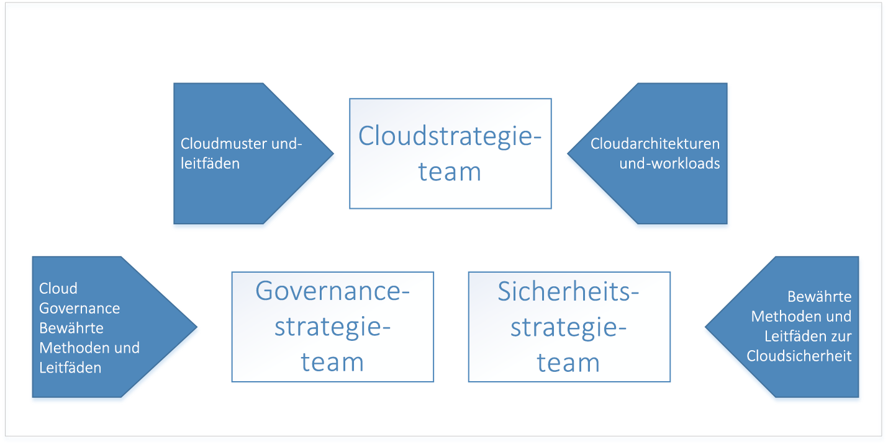
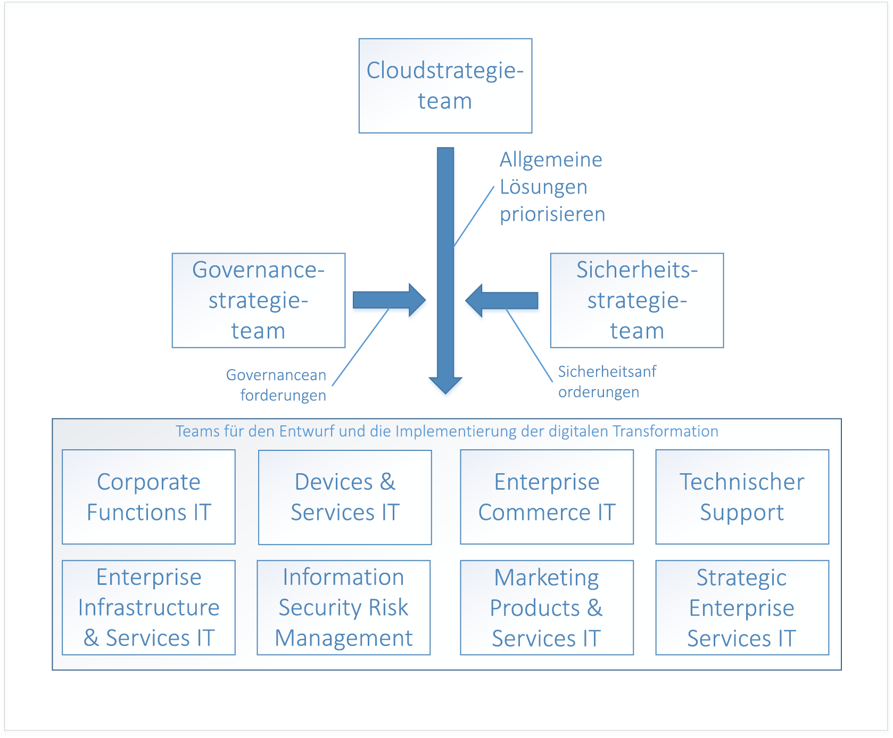

# Enterprise Cloud-Einführung: Erste SchritteEnterprise Cloud Adoption: Getting started 

Die **digitale Transformation** zu Cloud Computing bedeutet eine Verlagerung von der lokalen Umgebung auf eine Cloudumgebung.The **digital transformation** to cloud computing represents a shift from operating on-premises to operating in the cloud. Diese Verlagerung wirkt sich auch auf geschäftliche Abläufe aus. So werden beispielsweise Investitionsaufwendungen für Software und Datencenterhardware zu Betriebsaufwendungen für die Nutzung von Cloudressourcen.This shift includes new ways of doing business - for example, the digital transformation shifts from capital expenditures for software and datacenter hardware to operating expenditures for usage of cloud resources. 

## Digitale Transformation: AblaufDigital transformation: process

Für eine erfolgreiche Cloudeinführung müssen Unternehmen ihre Organisation, Mitarbeiter und Prozesse auf die digitale Transformation vorbereiten.To be successful in adopting the cloud, an enterprise must prepare its organization, people, and processes to be ready for this digital transformation. Da jedes Unternehmen eine andere Organisationsstruktur besitzt, gibt es kein allgemeingültiges Konzept für die organisatorische Bereitschaft.Every enterprise's organizational structure is different, so there is no one-size-fits-all approach to organizational readiness. In diesem Dokument werden daher die allgemeinen Schritte beschrieben, die Ihr Unternehmen zur Vorbereitung ausführen kann.This document outlines the high-level steps your enterprise can take to get ready. Ihre Organisation muss einen detaillierten Plan für jeden der aufgeführten Schritte ausarbeiten.Your organization will have to spend time developing a detailed plan to accomplish each of the listed steps.

Die digitale Transformation umfasst folgende allgemeine Schritte:The high-level process for the digital transformation is:

1. Stellen Sie ein Cloudstrategieteam zusammen.Create a cloud strategy team. Dieses Team ist für die Durchführung der digitalen Transformation zuständig.This team is responsible for leading the digital transformation. Darüber hinaus müssen in dieser Phase auch ein Governance-Team und ein Sicherheitsteam für die digitale Transformation zusammengestellt werden.It's also important at this stage to form a governance team and a security team for the digital transformation.
2. Die Mitglieder des Cloudstrategieteams informieren sich darüber, was bei Cloudtechnologien neu und anders ist.Members of the cloud strategy team learn what's new and different about cloud technologies.  
3. Zur Vorbereitung des Unternehmens erarbeitet das Cloudstrategieteam den Business Case für die digitale Transformation. Dazu erstellt es eine Liste mit allen aktuellen Lücken in der Unternehmensstrategie und ermittelt allgemeine Lösungen, um diese Lücken zu schließen.The cloud strategy team prepares the enterprise by building the business case for digital transformation - enumerates all the current gaps in business strategy and determines the high-level solutions to eliminate them.
4. Stimmen Sie die allgemeinen Lösungen mit Unternehmensgruppen ab.Align high-level solutions with business groups. Bestimmen Sie Projektbeteiligte in den einzelnen Unternehmensgruppen, die sich um den Entwurf und die Implementierung der jeweiligen Lösung kümmern.Identify stakeholders in each business group to own the design and implementation for each solution.
5. Übertragen Sie vorhandene Rollen, Fähigkeiten und Prozesse auf cloudbasierte Rollen, Fähigkeiten und Prozesse.Translate existing roles, skills and process to include cloud roles, skills, and process.  
<!--6. Develop processes for operating in the cloud to make solutions more robust in terms of availability, resiliency, and security. 
7. Optimize solutions for performance, scalability, and cost efficiency.-->

## Schritt 1: Zusammenstellen eines CloudstrategieteamsStep 1: create a cloud strategy team

Der erste Schritt auf dem Weg zur digitalen Transformation Ihres Unternehmens ist die Bildung eines Cloudstrategieteams (CST) unter Einbeziehung von Führungskräften aus der gesamten Organisation.The first step in your enterprise's digital transformation is engaging business leaders from across the organization to create a cloud strategy team (CST). Dieses Team setzt sich aus Führungskräften der Finanz-, IT-Infrastruktur- und Anwendungsgruppen zusammen.This team consists of business leaders from finance, IT infrastructure, and application groups. Diese Teams können bei der Cloudanalyse- und Experimentierphase mitwirken.These teams can help with the cloud analysis and experimentation phase.

Ein Cloudstrategieteam kann beispielsweise vom CTO geleitet werden und Mitglieder des Teams für die Unternehmensarchitektur, Mitarbeiter der IT-Finanzabteilung, erfahrene Technologieexperten aus verschiedenen IT-Anwendungsgruppen (Personalabteilung, Finanzabteilung usw.) sowie Führungskräfte aus dem Infrastruktur-, Sicherheits- und Netzwerkteam umfassen.For instance, a Cloud Strategy Team could be driven by the CTO and consist of members of the enterprise architecture team, IT finance, senior technologists from various IT applications groups (HR, finance, and so on), and leaders from the infrastructure, security, and networking teams.  

Darüber hinaus müssen noch zwei weitere übergeordnete Teams gebildet werden: ein Governance-Team und Sicherheitsteam.It's also important to form two other high-level teams: a governance team, and a security team. Diese Teams sind zuständig für die Gestaltung, die Implementierung und die fortlaufende Überwachung der Governance- und Sicherheitsrichtlinien des Unternehmens.These teams are responsible for designing, implementing, and the ongoing audit of the enterprise's governance and security policies. Das Governance-Team muss Personen enthalten, die mit Ressourcenschutz, Kostenverwaltung, Gruppenrichtlinien und Ähnlichem vertraut sind.The governance team requires members that have worked with asset protection, cost management, group policy and related topics. Die Mitglieder des Sicherheitsteams müssen bestens mit aktuellen branchenspezifischen Sicherheitsstandards sowie mit den Sicherheitsanforderungen des Unternehmens vertraut sein.The security team requires members that are well versed in current industry security standards as well as the enterprise's security requirements.

Das Governance-Team ist dafür zuständig, das Governance-Modell des Unternehmens zu entwerfen und in der Cloud zu implementieren sowie die Ressourcen der freigegebenen Infrastruktur, die Teil der digitalen Transformation sind, bereitzustellen und zu verwalten.The governance team is responsible for designing and implementing the enterprise's governance model in the cloud, as well as deploying and maintaining the shared infrastructure assets that are part of the digital transformation. Hierzu zählen Hardware-, Software- und Cloudressourcen, die benötigt werden, um eine Verbindung zwischen dem lokalen Netzwerk und dem virtuellen Netzwerk in der Cloud herzustellen.These assets include hardware, software, and cloud resources necessary to connect the on-premises network to virtual networking in the cloud.

Die Aufgabe des Sicherheitsteams besteht darin, die Sicherheitsrichtlinie des Unternehmens in der Cloud zu entwerfen und zu implementieren. Dabei arbeitet es eng mit dem Governance-Team zusammen.The security team is responsible for designing and implementing the enterprise's security policy in the cloud, working closely with the governance team. Das Sicherheitsteam ist für die Erweiterung der Sicherheitsgrenze des lokalen Netzwerks auf das virtuelle Netzwerk in der Cloud zuständig.The security team owns the extension of the security boundary of the on-premises network to include virtual networking in the cloud. Dazu muss sich das Team unter Umständen um die Firewalls für ein- und ausgehenden Datenverkehr des virtuellen Cloudnetzwerks kümmern sowie sicherstellen, dass Tools und Richtlinien die Bereitstellung nicht autorisierter Ressourcen verhindern.This may take the form of owning and maintaining the inbound and outbound firewalls on the cloud virtual network as well as ensuring that tools and policy prevent the deployment of unauthorized resources.

## Schritt 2: Informieren über Neuerungen in der CloudStep 2: learn what's new in the cloud
 
Im nächsten Schritt der digitalen Transformation Ihres Unternehmens müssen sich die Mitglieder des Cloudstrategieteams darüber informieren, inwiefern sich die Cloudtechnologie auf die geschäftlichen Abläufe des Unternehmens auswirkt.The next step in your enterprise's digital transformation is for the members of the cloud strategy team to learn about how cloud technology will change the way the enterprise does business. Dieser Schritt dient zur Vorbereitung und Planung von Veränderungen für das Unternehmen, die Mitarbeiter und die Technologie.This is preparation and planning for the changes to your business, people, and technology. Die Mitglieder des Cloudstrategieteams müssen die Neuerungen und Unterschiede der Cloud im Vergleich zur lokalen Umgebung kennen.It's important for the members of the cloud strategy team to understand what's new and different in the cloud as compared to on-premises.

Dazu müssen sie sich zunächst ganz allgemein mit der [Funktionsweise von Azure](what-is-azure.md) vertraut machen.The starting point for understanding the cloud is learning [how Azure works](what-is-azure.md) at a high level. Danach müssen sie sich über die [Grundlagen der Governance in Azure](what-is-governance.md) informieren, bevor sie sich schließlich mit den [Grundlagen der Ressourcenzugriffsverwaltung](azure-resource-access.md) befassen.Next, learn about the basics of [governance in Azure](what-is-governance.md) in preparation for [understanding resource access management](azure-resource-access.md).

Darüber hinaus sollte sich das Governance-Team mit den Konzepten und Entwurfshandbüchern beschäftigen, die im Inhaltsverzeichnis im Abschnitt zu Governance zu finden sind.For advanced learning, the governance team should review the concepts and design guides in the governance section of the table of contents. Die Abschnitte zu Infrastruktur und Workloads enthalten hilfreiche Informationen zu gängigen Architekturen und Workloads in der Cloud.The infrastructure and workloads sections are useful for learning about typical architectures and workloads in the cloud.

## Schritt 3: Ermitteln von Lücken in der UnternehmensstrategieStep 3: identify gaps in business strategy

In diesem Schritt erstellt das Cloudstrategieteam eine Liste mit den geschäftlichen Problemen, die einer Lösung für die digitale Transformation bedürfen.The next step is for the cloud strategy team to enumerate the business problems that require a digital transformation solution. Ein Unternehmen kann beispielweise über ein lokales Rechenzentrum mit älterer Hardware verfügen, die ausgetauscht werden muss.For example, an enterprise may have an existing on-premises data center with end-of-life hardware that requires replacement. Ein weiteres Beispiel wäre ein Unternehmen, das möglicherweise Probleme mit der Markteinführung neuer Features und Dienste hat und deshalb nicht mehr mit den Mitbewerbern Schritt halten kann.In another example, an enterprise may be experiencing difficulty with time-to-market for new features and services and may be falling behind to competition. Diese Lücken stellen die *Ziele* der digitalen Transformation Ihres Unternehmens dar.These gaps represent the *goals* of your enterprise's digital transformation.

Lücken in der Unternehmensstrategie können wie folgt kategorisiert werden:Gaps in business strategy can be classified into the following categories:

|Category (Kategorie)Category|BESCHREIBUNGDescription|
|-----|-----|
|KostenverwaltungCost management|Eine Lücke bei der Bezahlung für Technologie durch das Unternehmen.Represents a gap in the way the Enterprise pays for technology.|
|GovernanceGovernance|Eine Lücke bei den Prozessen, mit denen das Unternehmen seine Ressourcen vor nicht ordnungsgemäßer Verwendung schützt, die möglicherweise zu Budgetüberschreitungen oder zu Sicherheits- oder Kompatibilitätsproblemen führen.Represents a gap in the processes used by the Enterprise to protect its assets from improper usage that might result in cost overruns, security issues, or compliance issues. | 
|ComplianceCompliance|Eine Lücke bei der Einhaltung interner Prozesse und Richtlinien sowie externer Gesetze, Bestimmungen und Standards.Represents a gap in the way the enterprise adheres to its own internal processes and policies as well as external laws, regulations, and standards. |
|SicherheitSecurity|Eine Lücke beim Schutz der Technologie und Datenressourcen vor externen Bedrohungen.Represents a gap in the way the enterprise protects its technology and data assets from external threats. |
|DatengovernanceData governance|Eine Lücke bei der Verwaltung der Daten des Unternehmens (insbesondere Kundendaten).Represents a gap in the way an enterprise manages its data, especially customer data. So gelten beispielsweise in der Europäischen Union aufgrund der neuen Datenschutz-Grundverordnung (DSGVO) strenge Vorgaben für den Schutz von Kundendaten, die ggf. neue Hardware und Software erfordern.For example, new General Data Protection Regulation (GDPR) in the European Union has strict requirements for the protection of customer data that may require new hardware and software.|    

Nachdem Ihr Unternehmen alle Lücken in der Unternehmensstrategie entsprechend kategorisiert hat, müssen als Nächstes allgemeine Lösungen für die einzelnen Probleme gefunden werden.Once your enterprise has classified all business strategy gaps into these categories, the next step is to determine a high-level solution for each problem.

Die folgende Tabelle enthält einige Beispiele dazu:The following table illustrates several examples:

|Lücke in der UnternehmensstrategieBusiness strategy gap|Kategorie &nbsp; &nbsp; &nbsp; &nbsp; &nbsp;Category &nbsp; &nbsp; &nbsp; &nbsp; &nbsp;|Lösung &nbsp;&nbsp;&nbsp;&nbsp;&nbsp;&nbsp;&nbsp;&nbsp;&nbsp;&nbsp;&nbsp;&nbsp;&nbsp;&nbsp;Solution &nbsp;&nbsp;&nbsp;&nbsp;&nbsp;&nbsp;&nbsp;&nbsp;&nbsp;&nbsp;&nbsp;&nbsp;&nbsp;&nbsp;|
|-----|-----|-----|
| Bei lokal gehosteten Diensten kommt es zu Spitzenzeiten mit hoher Auslastung (etwa zehn Prozent der Nutzung) zu Problemen mit der Verfügbarkeit, Resilienz und Skalierbarkeit.Services currently hosted on-premises experience issues with availability, resiliency, and scalability during time of peak demand, which is approximately ten percent of usage. Das lokale Datencenter enthält veraltete Server.Servers in on-premises datacenter are end-of-life. Die IT-Abteilung des Unternehmens rät zum Kauf neuer Hardware für das lokale Datacenter, die zur Bewältigung von Auslastungsspitzen geeignet ist.Enterprise IT recommends purchasing new on-premises hardware for datacenter with specifications to handle peak demand.| KostenverwaltungCost management | Migrieren Sie betroffene lokale Workloads zu skalierbaren Ressourcen in der Cloud, und bezahlen Sie lediglich für die Nutzung.Migrate affected existing on-premises workloads to scalable resources in the cloud, paying for usage only. |
| Aufgrund von externen Gesetzen und Vorschriften zur Datenverwaltung muss das Unternehmen eine Reihe von Standardkontrollen umsetzen, die die Verschlüsselung ruhender Daten erfordern, wofür wiederum neue Hardware und Software nötig sind.External data management laws and regulations require the enterprise to adhere to set of standard controls that require encryption of data at rest, requiring new hardware and software. | DatengovernanceData governance | Migrieren Sie ruhende Daten nach Azure Storage Service Encryption.Move data to Azure storage service encryption for data at rest. |
| Bei öffentlichen, in einem lokalen Datencenter gehosteten Diensten kam es zu DDoS-Angriffen (Distributed Denial of Service).Services hosted in on-premises datacenter been experiencing distributed denial of service (DDoS) attacks on public-facing services. Die Angriffe lassen sich nur schwer abwehren und erfordern neue Hardware und Software sowie neues Sicherheitspersonal, um wirkungsvolle Maßnahmen zu ergreifen.The attacks are difficult to mitigate and require new hardware, software, and security personnel to deal with effectively. | SicherheitSecurity | Migrieren Sie die Dienste nach Azure, um Azure DDoS Protection zu nutzen.Migrate services to Azure, and take advantage of Azure DDoS protection.|

Nachdem alle Lücken in der Geschäftsstrategie aufgelistet und allgemeine Lösungen gefunden wurden, muss die Liste priorisiert werden.When all of the gaps in business strategy have been enumerated and high-level solutions have been determined, prioritize the list. Hierzu können Sie die Lücken in der Geschäftsstrategie mit den kurz- und langfristigen Unternehmenszielen in der jeweiligen Kategorie abgleichen.The list can be prioritized by aligning the business strategy gaps with the enterprise's short and long-term goals in each category. Wenn das Unternehmen also kurzfristig die IT-Ausgaben in den nächsten beiden Geschäftsquartalen senken möchte, können die Lücken in der Kategorie *Kostenverwaltung* auf der Grundlage der jeweils zu erwartenden Kosteneinsparungen priorisiert werden.For example, if the enterprise has a short-term goal to reduce IT spend in the next two fiscal quarters, the business gaps in the *cost management* category may be prioritized by the projected cost saving associated with each.

So erhalten Sie eine nach Rangfolge sortierte Liste allgemeiner Lösungen für Unternehmenskategorien.The output of this process is a stack-ranked list of high-level solutions aligned with business categories. 

## Schritt 4: Abstimmen der allgemeinen Lösungen mit Unternehmensgruppen, um Lösungen zu erarbeitenStep 4: align high-level solutions with business groups to design solutions 

Nachdem es eine Liste mit den Zielen der digitalen Transformation erstellt sowie die Liste priorisiert und allgemeine Lösungen vorgeschlagen hat, besteht der nächste Schritt für das Cloudstrategieteam darin, die einzelnen allgemeinen Lösungen mit Entwurfs- und Implementierungsteams in den einzelnen Unternehmensgruppen abzugleichen.Now that the goals of the digital transformation have been enumerated, prioritized, and high-level solutions proposed, the next step is for the cloud strategy team to align each of the high-level solutions with design and implementation teams in each of the business groups. 

Die Teams arbeiten sich anhand der priorisierten Listen durch die einzelnen allgemeinen Lösungen, um einen entsprechenden Entwurf zu erarbeiten.The teams take the prioritized lists and work through each high-level solution to design each solution. Der Entwurfsprozess umfasst unter anderem Angaben zu neuer Infrastruktur und neuen Workloads.The design process will involve the specification of new infrastructure and new workloads. Unter Umständen verändern sich auch die Rollen der Mitarbeiter sowie die Prozesse, mit denen sie arbeiten.There may also be changes to the roles of the people and the processes they follow. In dieser Phase ist es zudem äußerst wichtig, dass jedes Entwurfsteam sowohl das Governance- als auch das Sicherheitsteam in die Prüfung der jeweiligen Entwürfe mit einbezieht.It's also extremely important at this stage for each of the design teams to include both the governance and security teams for review of each design. Jeder Entwurf muss sich innerhalb der Richtlinien und Verfahren bewegen, die das Governance- und das Sicherheitsteam definiert haben, und diese Teams müssen in die endgültige Freigabe des jeweiligen Entwurfs eingebunden werden.Each design must fall within with the policies and procedures defined by the governance and security teams, and these teams must be included in the final sign off of each design.

Das Entwerfen einer Lösung ist eine anspruchsvolle Aufgabe, und der Entwurf muss jeweils im Kontext anderer Lösungsentwürfe von anderen Teams betrachtet werden.The design of each solution is a non-trivial task and as designs are created, must be considered in context with other solution designs from other teams. Wenn beispielsweise mehrere der Entwürfe die Migration bereits vorhandener lokaler Anwendungen und Dienste in die Cloud vorsehen, ist es unter Umständen effizienter, diese zusammenzufassen und eine allgemeine Migrationsstrategie zu erarbeiten.For example, if several of the designs result in a migration of existing on-premises applications and services to the cloud, it may be more efficient to group these together and design an overall migration strategy. In einem anderen Fall können beispielsweise einige vorhandene lokale Anwendungen und Dienste nicht migriert werden, und die Lösung besteht darin, sie entweder durch Neuentwicklungen oder durch Dienste von Drittanbietern zu ersetzen.In another example, it may not be possible to migrate some existing on-premises applications and services and the solution may be to replace them with either new development or third-party services. In diesem Fall ist es ggf. effizienter, sie zusammenzufassen und die Überschneidung zwischen ihnen zu ermitteln, um zu bestimmen, ob ein Drittanbieterdienst für mehrere Lösungen verwendet werden kann.In this case, it may be more efficient to group these together and determine the overlap between them to determine if a third-party service can be used for more than one solution.

Wenn der Lösungsentwurf fertig ist, beginnt für das Team die Implementierungsphase des jeweiligen Entwurfs.Once the design of the solution is complete, the team moves on to the implementation phase for each design. Die Implementierungsphase für den jeweiligen Lösungsentwurf kann mithilfe gängiger Projektmanagementprozesse durchgeführt werden.The implementation phase for each solution design can be run using standard project management processes.

## Schritt 5: Übertragen vorhandener Rollen, Fähigkeiten und Prozesse auf die CloudStep 5: translate existing roles, skills, and process for the cloud

In jeder Evolutionsphase der IT-Geschichte ging mit besonders bemerkenswerten Veränderungen der Branche häufig auch eine Veränderung der Personalrollen einher.At each evolutionary phase during the history of the IT industry, the most notable industry changes are often marked by changes in staff roles. Während der Umstellung von Mainframes auf das Client-Server-Modell wurden Anlagenbediener größtenteils durch Systemadministratoren ersetzt.During the transition from mainframes to the client/server model, the role of the computer operator largely disappeared, replaced by the system administrator. Mit Anbruch des Virtualisierungszeitalters ging der Bedarf für Personen, die mit physischen Servern arbeiten, zurück. Stattdessen waren nun Experten für Virtualisierung gefragt.When the age of virtualization arrived, the requirement for individuals working with physical servers diminished, replaced with a need for virtualization specialists. Und auch beim Umstieg auf Cloud Computing ist mit ähnlichen Veränderungen zu rechnen.Similarly, as institutions shift to cloud computing, roles will likely change again. So können Datencenterspezialisten beispielsweise durch Cloud-Finanzanalytiker ersetzt werden.For example, datacenter specialists might be replaced with cloud financial analysts. Aber auch in Fällen, in denen die Bezeichnungen für IT-Berufe nicht geändert wurden, haben sich die alltäglichen Arbeitsaufgaben deutlich gewandelt.Even in cases where IT job titles have not changed, the daily work roles have evolved significantly. 

IT-Mitarbeiter machen sich möglicherweise Sorgen um ihre Rollen und Positionen, da ihnen bewusst wird, dass sie für Cloudlösungen andere Fähigkeiten benötigen.IT staff members may feel anxious about their roles and positions as they realize that a different set of skills is needed for the support of cloud solutions. Flexible Mitarbeiter, die sich für neue Cloudtechnologien interessieren und sich mit ihnen vertraut machen, müssen sich jedoch keine Gedanken machen.But agile employees who explore and learn new cloud technologies don’t need to have that fear. Sie können bei der Einführung von Clouddiensten eine Führungsrolle übernehmen und der Organisation dabei helfen, die entsprechenden Veränderungen zu verstehen und umzusetzen.They can lead the adoption of cloud services and help the organization understand and embrace the associated changes. 

### Dokumentieren von ProblemenCapturing concerns

Während der digitalen Transformation sollte jedes Team mögliche Probleme der Mitarbeiter dokumentieren, sobald diese auftreten.During the digital transformation, each team should capture any staff concerns as they arise. Dabei muss Folgendes dokumentiert werden:When capturing concerns, identify the following: 
* Die Art des Problems.The type of concern. Mitarbeiter können sich beispielsweise gegen die veränderten Aufgaben sperren, die mit der digitalen Transformation einhergehen.For example, workers may be resistant to the changes in job duties that accompany the digital transformation.
* Die Folgen des Problems, wenn es nicht behoben wird.The impact of the concern if it is not addressed. Der Widerstand gegen die digitale Transformation kann beispielsweise dazu führen, dass nötige Änderungen nur schleppend umgesetzt werden.For example, resistance to the digital transformation may be result in workers being slow to execute the changes necessary. 
* Der Bereich, der zur Behebung des Problems geeignet ist.The area equipped to address the concern. Wenn beispielsweise IT-Mitarbeiter nicht bereit sind, sich neue Fähigkeiten anzueignen, ist der IT-Bereich am besten geeignet, dieses Problem zu beheben.For example, if workers in the IT department are reluctant to acquire new skills, the IT stakeholder's area is best equipped to address this concern. Bei manchen Problemen ist der Bereich eindeutig identifizierbar. In diesem Fall ist ggf. eine Eskalation an die Unternehmensleitung erforderlich.Identifying the area may be clear for some concerns, and in these cases you may need to escalate to executive leadership. 

### Ermitteln von LückenIdentify gaps

Ein weiterer Aspekt bei der Bewältigung von Problemen mit der digitalen Transformation Ihres Unternehmens ist die Ermittlung von **Lücken**.Another aspect of working through the issues with your enterprise's digital transformation is identifying **gaps**. Bei Lücken handelt es sich um Rollen, Fähigkeiten oder Prozesse, die für die digitale Transformation erforderlich, aber derzeit in Ihrem Unternehmen nicht vorhanden sind.A gap is a role, skill, or process required for your digital transformation that does not currently exist in your enterprise. 

Erstellen Sie zunächst eine Liste mit den neuen Aufgaben, die die digitale Transformation mit sich bringt, und konzentrieren Sie sich dabei auf neue Aufgaben sowie auf aktuelle Aufgaben, die nicht mehr benötigt werden.Begin by enumerating the new responsibilities that accompany the digital transformation, with an emphasis on new responsibilities and current responsibilities to be retired. Ermitteln Sie jeweils den Bereich, der der Aufgabe zugeordnet ist.Identify the area that is aligned with each responsibility. Bestimmen Sie bei neuen Aufgaben, wie eng sie mit dem Bereich verknüpft sind.For new responsibilities, determine how closely aligned it is with the area. Da einige Aufgaben unter Umständen mehrere Bereiche umfassen, ist dies eine gute Gelegenheit für eine bessere Ausrichtung, die als Problem dokumentiert werden sollte.Some responsibilities may span several areas, and this represents an opportunity for better alignment that should be captured as a concern. Sollte kein zuständiger Bereich gefunden werden, dokumentieren Sie dies als Lücke.In the case where no area is identified as being responsible, capture this as a gap.

Ermitteln Sie als Nächstes die Fähigkeiten, die für die Aufgabe nötig sind.Next, identify the skills necessary to support the responsibility. Bestimmen Sie, ob Ihr Unternehmen über vorhandene Ressourcen mit diesen Fähigkeiten verfügt.Determine if your enterprise has existing resources with these skills. Sollten keine entsprechenden Ressourcen vorhanden sein, ermitteln Sie, welche Schulungsprogramme oder Anwerbungsmaßnahmen erforderlich sind.If there are no existing resources, determine what training programs or talent acquisition is necessary. Bestimmen Sie den Zeitrahmen, in dem die Aufgabe unterstützt werden muss, um den Zeitplan Ihrer digitalen Transformation einzuhalten.Determine the time frame by which the responsibility must be supported to keep your digital transformation on track.

Ermitteln Sie abschließend die Rollen, die diese Fähigkeiten umsetzen.Finally, identify the roles that will execute these skills. Einige Ihrer vorhandenen Mitarbeiter können Teile der Rolle übernehmen, in manchen Fällen ist jedoch eine ganz neue Rolle erforderlich.Some of your existing workforce will assume parts of the role, and in other cases an entirely new role may be necessary. 

### Teamübergreifende ZusammenarbeitPartner across teams

Die Fähigkeiten, die zum Füllen der Lücken in der digitalen Transformation Ihrer Organisation erforderlich sind, sind in der Regel nicht auf eine einzelne Rolle und häufig nicht einmal auf eine einzelne Abteilung beschränkt.The skills necessary to fill the gaps in your organization's digital transformation will typically not be confined to a single role, or even a single department. Die Beziehungen und Abhängigkeiten von Fähigkeiten können sich über mehrere Rollen erstrecken, die sich wiederum in verschiedenen Abteilungen befinden können.Skills will have relationships and dependencies that can span a single role or multiple roles, and those roles may exist in several departments. Ein Workloadbesitzer kann beispielsweise darauf angewiesen sein, dass ihm ein IT-Mitarbeiter grundlegende Ressourcen wie Abonnements und Ressourcengruppen zur Verfügung stellt.For example, a workload owner may require someone in an IT role to provision core resources such as subscriptions and resource groups.

Diese Abhängigkeiten stellen neue Prozesse dar, die Ihre Organisation implementiert, um den Workflow zwischen Rollen zu verwalten.These dependencies represent new processes that your organization implements to manage the workflow between roles. Im obigen Beispiel gibt es verschiedene Arten von Prozessen, die die Beziehung zwischen dem Workloadbesitzer und der IT-Rolle unterstützen können.In the above example, there are several different types of process that can support the relationship between the workload owner and the IT role. So kann beispielsweise ein Workflowtool erstellt werden, um den Prozess zu verwalten, oder es kann eine einfache E-Mail-Vorlage verwendet werden.For example, a workflow tool can be created to manage the process, or, a simple email template can be used.

Verfolgen Sie diese Abhängigkeiten, notieren Sie sich die Prozesse, die ihnen zugrunde liegen, und geben Sie an, ob der Prozess derzeit vorhanden ist.Track these dependencies and make note of the processes that will support them, and whether or not the process currently exists. Stellen Sie bei Prozessen, die Tools erfordern, sicher, dass der Zeitplan für die Toolbereitstellung mit dem übergeordneten Zeitplan der digitalen Transformation in Einklang steht.For process that require tooling, ensure that the timeline for deploying any tools aligns with the overall digital transformation schedule.

## Nächste SchritteNext steps

Die digitale Transformation ist ein iterativer Prozess, und jede weitere Iteration macht die beteiligten Teams effizienter.The digital transformation is an iterative process, and with each iteration the teams involved will become more efficient. 

> [!div class="nextstepaction"]
> [Wie funktioniert Azure?Understand how Azure works](what-is-azure.md)