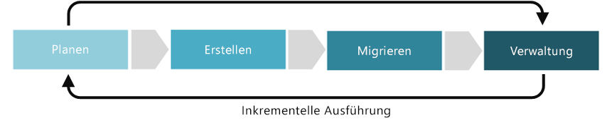

# Verbesserung der Disziplin „Kostenmanagement“Cost Management discipline improvement

Mit der Disziplin „Kostenmanagement“ wird versucht, die wichtigsten Geschäftsrisiken im Zusammenhang mit den Kosten für das Hosting von cloudbasierten Workloads anzugehen.The Cost Management discipline attempts to address core business risks related to expenses incurred when hosting cloud-based workloads. Innerhalb der fünf Disziplinen der Cloudgovernance wird das Kostenmanagement für die Kontrolle der Kosten und Nutzung von Cloudressourcen eingesetzt, mit dem Ziel, einen geplanten Kostenzyklus zu erstellen und zu verwalten.Within the five disciplines of Cloud Governance, Cost Management is involved in controlling cost and usage of cloud resources with the goal of creating and maintaining a planned cost cycle.

Dieser Artikel beschreibt die möglichen Aufgaben, die Ihr Unternehmen zum Erstellen und Weiterentwickeln Ihrer Kostenmanagement-Disziplin ausführen kann.This article outlines potential tasks your company perform to develop and mature your Cost Management discipline. Diese Aufgaben lassen sich in verschiedene Phasen der Implementierung einer Cloudlösung unterteilen: Planung, Erstellung, Einführung und Betrieb. Diese Phasen werden dann durchlaufen und ermöglichen die Entwicklung eines [inkrementellen Ansatzes für die Cloudgovernance](../journeys/overview.md#an-incremental-approach-to-cloud-governance).These tasks can be broken down into planning, building, adopting, and operating phases of implementing a cloud solution, which are then iterated on allowing the development of an [incremental approach to cloud governance](../journeys/overview.md#an-incremental-approach-to-cloud-governance).

*Abbildung 1: Einführungsphasen des inkrementellen Ansatzes für die Cloudgovernance.**Figure 1. Adoption phases of the incremental approach to cloud governance.*

Es ist unmöglich, die Anforderungen aller Unternehmen in einem einzigen Dokument zu berücksichtigen.No single document can account for the requirements of all businesses. Daher werden im vorliegenden Artikel die empfohlenen mindestens auszuführenden Aktivitäten sowie Beispiele für potenzielle Aktivitäten für jede Phase des Weiterentwicklungsprozesses für die Governance beschrieben.As such, this article outlines suggested minimum and potential example activities for each phase of the governance maturation process. Ziel dieser Aktivitäten ist es, Sie beim Aufbau eines [Richtlinien-MVP](../journeys/overview.md#an-incremental-approach-to-cloud-governance) und bei der Einrichtung eines Frameworks für die inkrementelle Weiterentwicklung der Richtlinie zu unterstützen.The initial objective of these activities is to help you build a [Policy MVP](../journeys/overview.md#an-incremental-approach-to-cloud-governance) and establish a framework for incremental policy evolution. Ihr Cloudgovernanceteam muss entscheiden, wie viel in diese Aktivitäten investiert werden soll, um Ihre Funktionen für die Governance des Kostenmanagements zu verbessern.Your Cloud Governance team will need to decide how much to invest in these activities to improve your Cost Management governance capabilities.

> [!CAUTION]
> Weder die in diesem Artikel beschriebenen mindestens erforderlichen noch die potenziellen Aktivitäten sind auf bestimmte Unternehmensrichtlinien oder Complianceanforderungen von Drittanbietern ausgerichtet.Neither the minimum or potential activities outlined in this article are aligned to specific corporate policies or third party compliance requirements. Dieser Leitfaden soll bei Gesprächen über die Ausrichtung beider Anforderungen auf ein Cloudgovernancemodell helfen.This guidance is designed to help facilitate the conversations that will lead to alignment of both requirements with a cloud governance model.

## Planung und BereitschaftPlanning and readiness

Diese Entwicklungsphase der Governance überbrückt die Lücke zwischen Geschäftsergebnissen und umsetzbaren Strategien.This phase of governance maturity bridges the divide between business outcomes and actionable strategies. Während dieses Prozesses definiert das Führungsteam bestimmte Metriken, ordnet diese Metriken dem digitalen Bestand zu und beginnt mit der Planung der gesamten Migration.During this process, the leadership team defines specific metrics, maps those metrics to the digital estate, and begins planning the overall migration effort.

**Mindestens empfohlene Aktivitäten**:**Minimum suggested activities:**

* Bewerten Sie Ihre Optionen für eine [Kostenmanagement-Toolkette](toolchain.md).Evaluate your [Cost Management toolchain](toolchain.md) options.
* Entwerfen Sie ein Dokument mit Architekturrichtlinien, und geben Sie dieses an die wichtigsten Beteiligten weiter.Develop a draft Architecture Guidelines document and distribute to key stakeholders.
* Schulen und beteiligen Sie die Personen und Teams, die von diesen Architekturrichtlinien betroffen sind.Educate and involve the people and teams affected by the development of Architecture Guidelines.

**Potenzielle Aktivitäten**:**Potential activities:**

* Sorgen Sie für finanzielle Entscheidungen, die die geschäftliche Begründung für Ihre Cloudstrategie unterstützen.Ensure budgetary decisions that support the business justification for your cloud strategy.
* Überprüfen Sie Lernmetriken, die Sie für Berichte zur erfolgreichen Zuteilung der finanziellen Mittel verwenden.Validate learning metrics that you use to report on the successful allocation of funding.
* Informieren Sie sich genau über das gewünschte Abrechnungsmodell für die Cloud, das die Art und Weise der Kostenverteilung beeinflusst.Understand the desired cloud accounting model that affects how cloud costs should be accounted for.
* Machen Sie sich mit dem Plan für den digitalen Bestand vertraut, und überprüfen Sie, ob die Kostenerwartungen korrekt sind.Become familiar with the digital estate plan and validate accurate costing expectations.
* Bewerten Sie verschiedene Kaufoptionen, um zu ermitteln, ob eine nutzungsbasierte Bezahlung oder eine Vorabverpflichtung durch Erwerb eines Enterprise Agreement sinnvoller ist.Evaluate buying options to determine if it's better to "pay as you go" or to make a precommitment by purchasing an Enterprise Agreement.
* Richten Sie geschäftliche Ziele an geplanten Budgets aus, und passen Sie ggf. Finanzierungspläne an.Align business goals with planned budgets and adjust budgetary plans as necessary.
* Entwickeln Sie einen Mechanismus zur Berichterstellung für Ziele und Budget, um technische und geschäftliche Beteiligte am Ende jedes Kostenzyklus zu benachrichtigen.Develop a goals and budget reporting mechanism to notify technical and business stakeholders at the end of each cost cycle.

## Aufbau und Aufgaben vor der BereitstellungBuild and pre-deployment

Für die erfolgreiche Migration einer Umgebung muss eine Reihe von technischen und nichttechnischen Voraussetzungen erfüllt werden.A number of technical and nontechnical prerequisites are required to successfully migrate an environment. Bei diesem Prozess geht es primär um die Entscheidungen, die Bereitschaft und die grundlegende Infrastruktur, die eine Migration vorantreiben.This process focuses on the decisions, readiness, and core infrastructure that proceeds a migration.

**Mindestens empfohlene Aktivitäten**:**Minimum suggested activities:**

* Implementieren Sie Ihre [Kostenmanagement-Toolkette](toolchain.md) in einer Phase vor der Bereitstellung.Implement your [Cost Management toolchain](toolchain.md) by rolling out in a pre-deployment phase.
* Aktualisieren Sie das Dokument mit Architekturrichtlinien, und geben Sie dieses an die wichtigsten Beteiligten weiter.Update the Architecture Guidelines document and distribute to key stakeholders.
* Entwickeln Sie Schulungsmaterialien und Dokumentation, Materialien zum Bekanntmachen der Migration, Incentives und weitere Programme, um die Akzeptanz durch die Benutzer zu unterstützen.Develop educational materials and documentation, awareness communications, incentives, and other programs to help drive user adoption.
* Ermitteln Sie, ob der Bedarf an zu erwerbenden Komponenten zu Ihrem Budget und Ihren Zielen passt.Determine if your purchase requirements align with your budgets and goals.

**Potenzielle Aktivitäten**:**Potential activities:**

* Richten Sie Ihre Budgetpläne an der [Abonnementstrategie](../../decision-guides/subscriptions/overview.md) aus, die Ihr grundlegendes Besitzmodell definiert.Align your budgetary plans with the [Subscription Strategy](../../decision-guides/subscriptions/overview.md) that defines your core ownership model.
* Nutzen Sie Ihre [Strategie für die Konsistenz von Ressourcen](../../decision-guides/resource-consistency/overview.md), um Architektur- und Kostenrichtlinien im Lauf der Zeit durchzusetzen.Leverage the [Resource Consistency Strategy](../../decision-guides/resource-consistency/overview.md) to enforce architecture and cost guidelines over time.
* Ermitteln Sie eventuelle Kostenanomalien, die sich auf Ihre Einführungs- und Migrationspläne auswirken können.Determine if there are any cost anomalies that affect your adoption and migration plans.

## Einführen und MigrierenAdopt and migrate

Migration ist ein inkrementeller Prozess, bei dem der Schwerpunkt auf der Verlagerung, dem Testen und der Übernahme von Anwendungen oder Workloads in einem vorhandenen digitalen Bestand liegt.Migration is an incremental process that focuses on the movement, testing, and adoption of applications or workloads in an existing digital estate.

**Mindestens empfohlene Aktivitäten**:**Minimum suggested activities:**

* Migrieren Sie Ihre [Kostenmanagement-Toolkette](toolchain.md) von der Phase vor der Bereitstellung in die Produktionsphase.Migrate your [Cost Management toolchain](toolchain.md) from pre-deployment to production.
* Aktualisieren Sie das Dokument mit Architekturrichtlinien, und geben Sie dieses an die wichtigsten Beteiligten weiter.Update the Architecture Guidelines document and distribute to key stakeholders.
* Entwickeln Sie Schulungsmaterialien und Dokumentation, Materialien zum Bekanntmachen der Migration, Incentives und weitere Programme, um die Akzeptanz durch die Benutzer zu unterstützen.Develop educational materials and documentation, awareness communications, incentives, and other programs to help drive user adoption.

**Potenzielle Aktivitäten**:**Potential activities:**

* Implementieren Sie Ihr Cloudabrechnungsmodell.Implement your Cloud Accounting Model.
* Stellen Sie sicher, dass Ihr Budget Ihre tatsächlichen Ausgaben bei jedem Release widerspiegelt, und passen Sie es nach Bedarf an.Ensure that your budgets reflect your actual spending during each release and adjust as necessary.
* Überwachen Sie Änderungen in Budgetplänen, und besprechen Sie diese mit den Beteiligten, wenn zusätzliche Genehmigungen erforderlich sind.Monitor changes in budgetary plans and validate with stakeholders if additional sign-offs are needed.
* Aktualisieren Sie die Architekturrichtlinien mit den Änderungen, um die tatsächlichen Kosten widerzuspiegeln.Update changes to the Architecture Guidelines document to reflect actual costs.

## Betrieb und Aufgaben nach der ImplementierungOperate and post-implementation

Sobald die Transformation abgeschlossen ist, müssen Governance und Betrieb während des natürlichen Lebenszyklus einer Anwendung oder Workload bestehen bleiben.Once the transformation is complete, governance and operations must live on for the natural lifecycle of an application or workload. In dieser Phase der Ausgereiftheit der Governance geht es um die Aktivitäten, die üblicherweise ausgeführt werden, nachdem die Lösung implementiert wurde und der Transformationszyklus beginnt, sich zu stabilisieren.This phase of governance maturity focuses on the activities that commonly come after the solution is implemented and the transformation cycle begins to stabilize.

**Mindestens empfohlene Aktivitäten**:**Minimum suggested activities:**

* Passen Sie Ihre [Kostenmanagement-Toolkette](toolchain.md) an die Änderungen an den Kostenmanagementanforderungen Ihrer Organisation an.Customize your [Cost Management toolchain](toolchain.md) based on changes in your organization’s cost management needs.
* Erwägen Sie die Automatisierung von Benachrichtigungen und Berichten, um die tatsächlichen Ausgaben widerzuspiegeln.Consider automating any notifications and reports to reflect actual spending.
* Optimieren Sie die Architekturrichtlinien, um zukünftige Einführungsprozesse zu unterstützen.Refine Architecture Guidelines to guide future adoption processes.
* Schulen Sie die betroffenen Teams regelmäßig, um die kontinuierliche Einhaltung der Architekturrichtlinien sicherzustellen.Educate affected teams on a periodic basis to ensure ongoing adherence to the Architecture Guidelines.

**Potenzielle Aktivitäten**:**Potential activities:**

* Bewerten Sie das Cloudbusiness einmal im Vierteljahr, um einen Bericht über den Nutzen für das Geschäft und die zugehörigen Kosten zu erstellen.Execute a quarterly cloud business review to communicate value delivered to the business and associated costs.
* Passen Sie die Pläne vierteljährlich an, um Änderungen an den tatsächlichen Ausgaben widerzuspiegeln.Adjust plans quarterly to reflect changes to actual spending.
* Ermitteln Sie die finanzielle Ausrichtung an der Gewinn- und Verlustrechnung für Abonnements von Geschäftseinheiten.Determine financial alignment to P&Ls for business unit subscriptions.
* Analysieren Sie monatlich die Berichtsmethoden von Beteiligten für Nutzen und Kosten.Analyze stakeholder value and cost reporting methods on a monthly basis.
* Bewerten Sie nicht genutzte Assets, und bestimmen Sie, ob diese weiter im Bestand bleiben sollten.Remediate underused assets and determine if they're worth continuing.
* Ermitteln Sie falsche Ausrichtungen sowie Anomalien zwischen Plan und tatsächlichen Ausgaben.Detect misalignments and anomalies between the plan and actual spending.
* Unterstützen Sie die für die Cloudeinführung und Cloudstrategie zuständigen Teams, indem Sie diese Anomalien beseitigen.Assist the cloud adoption teams and the Cloud Strategy team with understanding and resolving these anomalies.

## Nächste SchritteNext steps

Sie kennen jetzt das Konzept der Cloudidentitätsgovernance. Als Nächstes sollten Sie die [Kostenmanagement-Toolkette](toolchain.md) untersuchen, um die Azure-Tools und -Features zu identifizieren, die Sie bei der Entwicklung der Governancedisziplin „Kostenmanagement“ auf der Azure-Plattform benötigen.Now that you understand the concept of cloud identity governance, examine the [Cost Management toolchain](toolchain.md) to identify Azure tools and features that you'll need when developing the Cost Management governance discipline on the Azure platform.

> [!div class="nextstepaction"]
> [Kostenmanagement-Toolkette für AzureCost Management toolchain for Azure](toolchain.md)