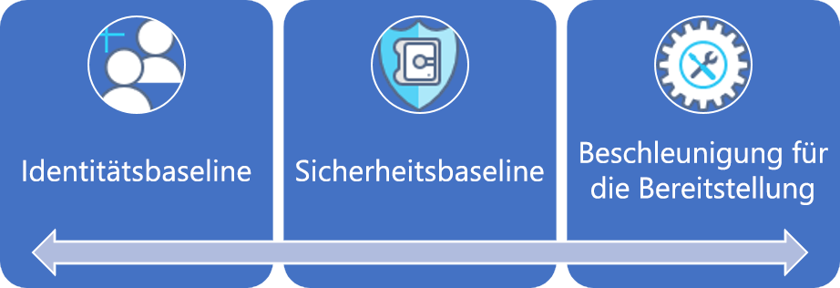
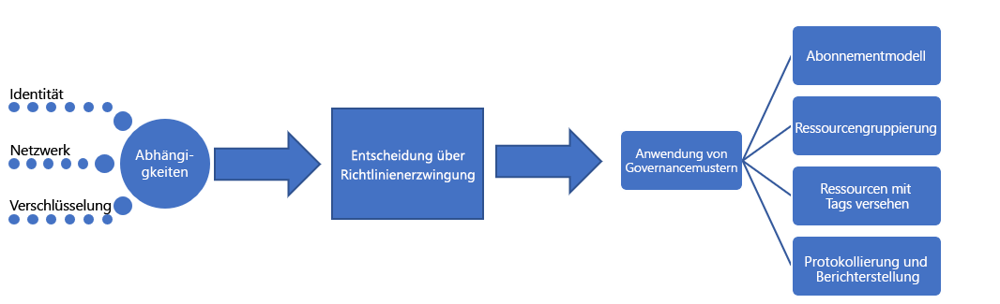

# Große Unternehmen: Beschreibung der bewährten MethodeLarge enterprise: Best practice explained

Der Governanceprozess beginnt mit einer Sammlung von anfänglichen [Unternehmensrichtlinien](./initial-corporate-policy.md).The governance journey starts with a set of initial [corporate policies](./initial-corporate-policy.md). Diese Richtlinien werden verwendet, um ein Miminum Viable-Product (MVP, minimal brauchbares Produkt) für die Governance einzurichten, das [bewährte Methoden](./overview.md) berücksichtigt.These policies are used to establish a minimum viable product (MVP) for governance that reflects [best practices](./overview.md).

In diesem Artikel werden die allgemeinen Strategien behandelt, die zum Erstellen eines Governance-MVP erforderlich sind.In this article, we discuss the high-level strategies that are required to create a governance MVP. Der Kern des Governance-MVP ist das Verfahren zur [Beschleunigung der Bereitstellung](../../deployment-acceleration/overview.md).The core of the governance MVP is the [Deployment Acceleration](../../deployment-acceleration/overview.md) discipline. Die in dieser Phase angewandten Tools und Muster ermöglichen die inkrementellen Entwicklungen, die für die zukünftige Erweiterung von Governance erforderlich sind.The tools and patterns applied at this stage will enable the incremental evolutions needed to expand governance in the future.

## Governance-MVP (Cloud Adoption Foundation)Governance MVP (Cloud Adoption Foundation)

Die schnelle Einführung von Governance und Unternehmensrichtlinien ist dank einiger einfacher Prinzipien und cloudbasierter Governancetools möglich.Rapid adoption of governance and corporate policy is achievable, thanks to a few simple principles and cloud-based governance tooling. Dies sind die ersten der drei Governance-Verfahren, die in jedem Governanceprozess zur Anwendung kommen.These are the first of the three governance disciplines to approach in any governance process. Jedes dieser Verfahren wird in diesem Artikel behandelt.Each will be expanded upon in this article.

Als Ausgangspunkt werden in diesem Artikel die High-Level-Strategien hinter Identitätsbaseline, Sicherheitsbaseline und Beschleunigung der Bereitstellung behandelt, die für die Erstellung eines Governance-MVP erforderlich sind, das als Grundlage für jede Umsetzung dient.To establish the starting point, this article will discuss the high-level strategies behind Identity Baseline, Security Baseline, and Deployment Acceleration that are required to create a governance MVP, which will serve as the foundation for all adoption.

## ImplementierungsprozessImplementation process

Die Implementierung des Governance-MVP weist Abhängigkeiten von Identität, Sicherheit und Netzwerk auf.The implementation of the governance MVP has dependencies on Identity, Security, and Networking. Sobald die Abhängigkeiten aufgelöst wurden, entscheidet das Cloud Governance-Team über einige Aspekte von Governance.Once the dependencies are resolved, the Cloud Governance team will decide a few aspects of governance. Die Entscheidungen des Cloud Governance-Teams und der unterstützenden Teams werden durch ein einziges Paket von Durchsetzungsmaßnahmen umgesetzt.The decisions from the Cloud Governance team and from supporting teams will be implemented through a single package of enforcement assets.

Diese Implementierung kann auch mithilfe einer einfachen Prüfliste beschrieben werden:This implementation can also be described using a simple checklist:

1. Einholen von Entscheidungen über Kernabhängigkeiten: Identität, Netzwerk und Verschlüsselung.Solicit decisions regarding core dependencies: Identity, Network, and Encryption.
2. Bestimmen des Musters, das bei der Durchsetzung von Unternehmensrichtlinien verwendet werden soll.Determine the pattern to be used during corporate policy enforcement.
3. Bestimmen der geeigneten Governancemuster für die Disziplinen Ressourcenkonsistenz, Ressourcentagging, Protokollierung und Berichterstellung.Determine the appropriate governance patterns for the Resource Consistency, Resource Tagging, and Loging and Reporting disciplines.
4. Implementieren der Governancetools, die auf das gewählte Muster der Richtliniendurchsetzung abgestimmt sind, um die abhängigen Entscheidungen und Governanceentscheidungen anzuwenden.Implement the governance tools aligned to the chosen policy enforcement pattern to apply the dependent decisions and governance decisions.

[!INCLUDE [implementation-process](../../../../../includes/cloud-adoption/governance/implementation-process.md)]

## Anwenden von durch Governance definierten MusternApplication of governance-defined patterns

Das Cloud Governance-Team ist für die folgenden Entscheidungen und Implementierungen verantwortlich.The Cloud Governance team will be responsible for the following decisions and implementations. Viele Entscheidungen erfordern Informationen von anderen Teams, aber das Cloud Governance Team wird wahrscheinlich sowohl für die endgültige Entscheidung als auch für die Implementierung verantwortlich sein.Many will require inputs from other teams, but the Cloud Governance team is likely to own both the decision and implementation. In den folgenden Abschnitten werden die für diesen Anwendungsfall getroffenen Entscheidungen und Details zu jeder Entscheidung beschrieben.The following sections outline the decisions made for this use case and details of each decision.

### AbonnementmodellSubscription Model

Das **gemischte** Muster wurde für Azure-Abonnements ausgewählt.The **Mixed** pattern has been chosen for Azure subscriptions.

- Wenn neue Anforderungen für Azure-Ressourcen auftreten, sollte für jede größere Geschäftseinheit in jeder geografischen Betriebsregion eine „Abteilung“ eingerichtet werden.As new requests for Azure resources arise, a "Department" should be established for each major business unit in each operating geography. Innerhalb jeder der Abteilungen sollten „Abonnements“ für jeden Anwendungsarchetyp erstellt werden.Within each of the Departments, "Subscriptions" should be created for each application archetype.
- Ein Anwendungsarchetyp ist eine Möglichkeit, Anwendungen mit ähnlichen Anwendungen zu gruppieren.An application archetype is a means of grouping applications with similar needs. Häufige Beispiele sind: Anwendungen mit geschützten Daten, verwaltete Anwendungen (wie HIPAA oder FedRAMP), risikoarme Anwendungen, Anwendungen mit lokalen Abhängigkeiten, SAP oder andere Mainframes in Azure oder Anwendungen, die lokales SAP oder lokale Mainframes erweitern.Common examples include: Applications with protected data, governed applications (such as HIPAA or FedRAMP), low-risk applications, applications with on-premises dependencies, SAP or other mainframes in Azure, or applications that extend on-premises SAP or mainframes. Jedes Unternehmen hat individuelle Anforderungen, die auf Datenklassifikationen und den Arten von Anwendungen basieren, die das Geschäft unterstützen.Each organization has unique needs based on data classifications and the types of applications that support the business. Die Abhängigkeitszuordnung der digitalen Infrastruktur kann bei der Definition der Anwendungsarchitekturen in einem Unternehmen helfen.Dependency mapping of the digital estate can help define the application archetypes in an organization.
- Im Rahmen des Abonnementdesigns sollte auf der Grundlage der beiden vorangegangenen Aufzählungspunkte eine gemeinsame Namenskonvention vereinbart werden.A common naming convention should be agreed upon as part of the subscription design, based on the above two bullets.

### RessourcenkonsistenzResource Consistency

**Hierarchische Konsistenz** wurde als Muster der Ressourcenkonsistenz gewählt.**Hierarchical Consistency** has been chosen as a Resource Consistency pattern.

- Für jede Anwendung sollten Ressourcengruppen erstellt werden.Resource groups should be created for each application. Für jeden Anwendungsarchetyp sollten Verwaltungsgruppen erstellt werden.Management groups should be created for each application archetype. Azure Policy sollte auf alle Abonnements in der zugehörigen Verwaltungsgruppe angewendet werden.Azure Policy should be applied to all subscriptions in the associated management group.
- Im Rahmen des Bereitstellungsprozesses sollten Ressourcenkonsistenzvorlagen für alle Ressourcen in der Quellcodeverwaltung gespeichert werden.As part of the deployment process, Resource Consistency templates for all assets should be stored in source control.
- Jede Ressourcengruppe sollte an einer bestimmten Workload oder Anwendung ausgerichtet werden.Each resource group should align to a specific workload or application.
- Die definierte Hierarchie der Azure-Verwaltungsgruppen sollte die Abrechnungszuständigkeit und den Anwendungsbesitz mithilfe von verschachtelten Gruppen darstellen.The Azure management group hierarchy defined should represent billing responsibility and application ownership using nested groups.
- Eine umfassende Implementierung von Azure Policy könnte die zeitlichen Verpflichtungen des Teams überschreiten und bietet an diesem Punkt möglicherweise keinen großen Mehrwert.Extensive implementation of Azure Policy could exceed the team’s time commitments and may not provide much value at this point. Allerdings sollte eine einfache Standardrichtlinie erstellt und auf jede Ressourcengruppe angewendet werden, um die wenigen ersten Richtlinienerklärungen zur Cloud-Governance durchzusetzen.However, a simple default policy should be created and applied to each resource group to enforce the first few cloud governance policy statements. Diese dient dazu, die Implementierung spezifischer Governanceanforderungen zu definieren.This serves to define the implementation of specific governance requirements. Diese Implementierungen können dann auf alle bereitgestellten Ressourcen angewendet werden.Those implementations can then be applied across all deployed assets.

### Ressourcenkennzeichnung (Tagging)Resource Tagging

Für die Ressourcenkennzeichnung wurde das Muster **Buchhaltung** gewählt.The **Accounting** pattern has been chosen for resource tagging.

- Bereitgestellte Ressourcen sollten mit Werten für Folgendes gekennzeichnet werden: Abrechnung/Kostenstelle, Geografie, Datenklassifizierung, Kritikalität, SLA, Umgebung, Anwendungsarchetyp, Anwendung und Anwendungsbesitzer.Deployed assets should be tagged with values for the following: Department/Billing Unit, Geography, Data Classification, Criticality, SLA, Environment, Application Archetype, Application, and Application Owner.
- Diese Werte beeinflussen in Kombination mit der Azure-Verwaltungsgruppe und dem einer bereitgestellten Ressource zugeordneten Abonnement die Entscheidungen in den Bereichen Governance, Betrieb und Sicherheit.These values along with the Azure management group and subscription associated with a deployed asset will drive governance, operations, and security decisions.

### Protokollierung und BerichterstellungLogging and reporting

An dieser Stelle wird für Protokollierung und Berichterstellung ein **Hybrid**-Muster vorgeschlagen, es ist aber für keins der Entwicklungsteams erforderlich.At this point, a **Hybrid** pattern for log and reporting is suggested but not required of any development team.

- Es sind aktuell keine Governanceanforderungen in Bezug auf die für die Protokollierung oder Berichterstellung zu erfassenden spezifischen Datenpunkte festgelegt.No governance requirements are currently set regarding the specific data points to be collected for logging or reporting purposes. Dies ist für diese fiktive Erzählung spezifisch und sollte als Antimuster betrachtet werden.This is specific to this fictional narrative and should be considered an antipattern. Protokollierungsstandards sollten so früh wie möglich festgelegt und durchgesetzt werden.Logging standards should be determined and enforced as soon as possible.
- Vor der Freigabe geschützter Daten oder unternehmenskritischer Workloads sind zusätzliche Analysen erforderlich.Additional analysis is required before the release of any protected data or mission-critical workloads.
- Vor der Unterstützung geschützter Daten oder unternehmenskritischer Workloads muss der bestehenden lokalen Betriebsüberwachungslösung Zugang zu dem für die Protokollierung verwendeten Workspace gewährt werden.Prior to supporting protected data or mission-critical workloads, the existing on-premises operational monitoring solution must be granted access to the workspace used for logging. Anwendungen müssen die mit der Nutzung des betreffenden Mandanten einhergehenden Sicherheits- und Protokollierungsanforderungen erfüllen, wenn die Anwendung mit einem definierten SLA unterstützt werden soll.Applications are required to meet security and logging requirements associated with the use of that tenant, if the application is to be supported with a defined SLA.

## Weiterentwicklung von GovernanceprozessenEvolution of governance processes

Einige der Richtlinienanweisungen können oder sollten nicht durch automatisierte Tools gesteuert werden.Some of the policy statements cannot or should not be controlled by automated tooling. Andere Richtlinien erfordern regelmäßigen Aufwand seitens der IT-Sicherheits- und Identitätsbaselineteams.Other policies will require periodic effort from IT Security and on-premises Identity Baseline teams. Das Cloud Governance-Team muss die folgenden Prozesse beaufsichtigen, um die letzten acht Richtlinienanweisungen zu implementieren:The Cloud Governance team will need to oversee the following processes to implement the last eight policy statements:

**Änderungen der Unternehmensrichtlinie**: Das Cloud Governance-Team nimmt Änderungen am Entwurf des Governance-MVP vor, um die neuen Richtlinien zu übernehmen.**Corporate Policy Changes**: The Cloud Governance team will make changes to the governance MVP design to adopt the new policies. Der Wert des Governance-MVP besteht darin, dass es die automatische Durchsetzung der neuen Richtlinien ermöglicht.The value of the governance MVP is that it will allow for the automatic enforcement of the new policies.

**Schnellere Einführung**: Das Cloud Governance-Team hat Bereitstellungsskripts in mehreren Teams überprüft.**Adoption Acceleration**: The Cloud Governance team has been reviewing deployment scripts across multiple teams. Es verwaltet eine Reihe von Skripts, die als Bereitstellungsvorlagen dienen.They've maintained a set of scripts that serve as deployment templates. Diese Vorlagen können von den Cloudeinführungs- und DevOps-Teams verwendet werden, um Bereitstellungen schneller zu definieren.Those templates can be used by the cloud adoption teams and DevOps teams to more quickly define deployments. Jedes Skript enthält die Anforderungen für die Durchsetzung von Governance-Richtlinien, und zusätzliche Anstrengungen von Technikern für die Cloudeinführung sind nicht erforderlich.Each script contains the requirements for enforcing governance policies, and additional effort from cloud adoption engineers is not needed. Als Kurator dieser Skripts kann das Cloud Governance-Team Richtlinienänderungen schneller umsetzen.As the curators of these scripts, they can implement policy changes more quickly. Darüber hinaus werden sie als Beschleuniger der Einführung angesehen.Additionally, they are viewed as accelerators of adoption. Dadurch sind konsistente Bereitstellungen sichergestellt, ohne dass die Einhaltung streng durchgesetzt werden müsste.This ensures consistent deployments without strictly enforcing adherence.

**Schulung der Techniker**: Das Cloud Governance-Team bietet alle zwei Monate Schulungen an und hat zwei Videos für Techniker erstellt.**Engineer Training**: The Cloud Governance team offers bi-monthly training sessions and has created two videos for engineers. Beide Ressourcen helfen Technikern, schnell mit der Governance-Kultur und der Durchführung von Bereitstellungen vertraut zu werden.Both resources help engineers get up to speed quickly on the governance culture and how deployments are performed. Das Team fügt Schulungsressourcen hinzu, die den Unterschied zwischen Produktions- und Nicht-Produktionsbereitstellungen zeigen, was Technikern das Verständnis erleichtert, wie sich die neuen Richtlinien auf die Einführung auswirken.The team is adding training assets to demonstrate the difference between production and non-production deployments, which helps engineers understand how the new policies affect adoption. Dadurch sind konsistente Bereitstellungen sichergestellt, ohne dass die Einhaltung streng durchgesetzt werden müsste.This ensures consistent deployments without strictly enforcing adherence.

**Bereitstellungsplanung**: Vor der Bereitstellung von Ressourcen, die geschützte Daten enthalten, muss das Cloud Governance-Team anhand der Bereitstellungsskripts die Governanceausrichtung überprüfen.**Deployment Planning**: Before deploying any asset containing protected data, the Cloud Governance team will be responsible for reviewing deployment scripts to validate governance alignment. Vorhandene Teams mit bereits genehmigten Bereitstellungen werden mithilfe von programmgesteuerten Tools überprüft.Existing teams with previously approved deployments will be audited using programmatic tooling.

**Monatliche Überprüfung und Berichterstellung**: Jeden Monat führt das Cloud Governance-Team eine Überprüfung aller Cloudbereitstellungen durch, um die kontinuierliche Einhaltung der Richtlinien zu überprüfen.**Monthly Audit and Reporting**: Each month, the Cloud Governance team runs an audit of all cloud deployments to validate continued alignment to policy. Wenn Abweichungen festgestellt werden, werden sie dokumentiert und an die Cloudeinführungsteams weitergegeben.When deviations are discovered, they are documented and shared with the cloud adoption teams. Wenn die Durchsetzung keine Betriebsunterbrechung oder Datenlecks zur Folge hat, werden die Richtlinien automatisch durchgesetzt.When enforcement doesn't risk a business interruption or data leak, the policies are automatically enforced. Am Ende der Überprüfung erstellt das Cloud Governance-Team einen Bericht für das Cloud Strategy-Team und jedes Cloudeinführungsteam, um die allgemeine Einhaltung der Richtlinien zu kommunizieren.At the end of the audit, the Cloud Governance team compiles a report for the Cloud Strategy team and each cloud adoption team to communicate overall adherence to policy. Der Bericht wird auch für prüfungsbezogene und rechtliche Zwecke gespeichert.The report is also stored for auditing and legal purposes.

**Vierteljährliche Richtlinienüberprüfung**: Jedes Quartal überprüfen das Cloud Governance-Team und das Cloud Strategy-Team die Überwachungsergebnisse und schlagen Änderungen der Unternehmensrichtlinien vor.**Quarterly Policy Review**: Each quarter, the Cloud Governance team and Cloud Strategy team to review audit results and suggest changes to corporate policy. Viele dieser Vorschläge sind das Ergebnis kontinuierlicher Verbesserungen und der Beobachtung von Nutzungsmustern.Many of those suggestions are the result of continuous improvements and the observation of usage patterns. Genehmigte Richtlinienänderungen werden während der nachfolgenden Überwachungszyklen in die Governancetools integriert.Approved policy changes are integrated into governance tooling during subsequent audit cycles.

## Alternative MusterAlternative patterns

Wenn eines der in dieser Governancelösung ausgewählten Muster nicht mit den Anforderungen Ihres Unternehmens übereinstimmt, gibt es Alternativen zu jedem Muster:If any of the patterns chosen in this governance journey don't align with the reader's requirements, alternatives to each pattern are available:

- [VerschlüsselungsmusterEncryption patterns](../../../decision-guides/encryption/overview.md)
- [IdentitätsmusterIdentity patterns](../../../decision-guides/identity/overview.md)
- [Protokollierungs- und BerichterstellungsmusterLogging and Reporting patterns](../../../decision-guides/log-and-report/overview.md)
- [RichtliniendurchsetzungsmusterPolicy Enforcement patterns](../../../decision-guides/policy-enforcement/overview.md)
- [RessourcenkonsistenzmusterResource Consistency patterns](../../../decision-guides/resource-consistency/overview.md)
- [RessourcenkennzeichnungsmusterResource Tagging patterns](../../../decision-guides/resource-tagging/overview.md)
- [Softwaredefinierte NetzwerkmusterSoftware Defined Network patterns](../../../decision-guides/software-defined-network/overview.md)
- [AbonnemententwurfsmusterSubscription Design patterns](../../../decision-guides/subscriptions/overview.md)

## Nächste SchritteNext steps

Sobald dieser Leitfaden implementiert wurde, kann jedes Cloudeinführungsteam seine Arbeit mit einer soliden Governancebasis fortsetzen.Once this guidance is implemented, each cloud adoption team can proceed with a solid governance foundation. Das Cloud Governance-Team arbeitet parallel daran, die Unternehmensrichtlinien und Governanceverfahren kontinuierlich zu aktualisieren.The Cloud Governance team will work in parallel to continually update the corporate policies and governance disciplines.

Beide Teams verwenden die Toleranzindikatoren, um die nächste Entwicklung zu identifizieren, die erforderlich ist, um die Einführung der Cloud weiterhin zu unterstützen.Both teams will use the tolerance indicators to identify the next evolution needed to continue supporting cloud adoption. Der nächste Schritt für das Unternehmen auf diesem Weg ist die Weiterentwicklung seiner Governance-Basislinie zur Unterstützung von Anwendungen mit Legacy- oder Drittanbieter-Multifaktor-Authentifizierung (MFA).The next step for the company in this journey is to evolve their governance baseline to support applications with legacy or third-party multifactor authentication (MFA) requirements.

> [!div class="nextstepaction"]
> [Entwicklung der IdentitätsbaselineIdentity Baseline evolution](./identity-baseline-evolution.md)
