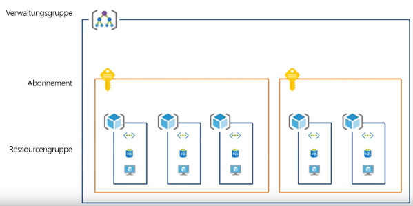
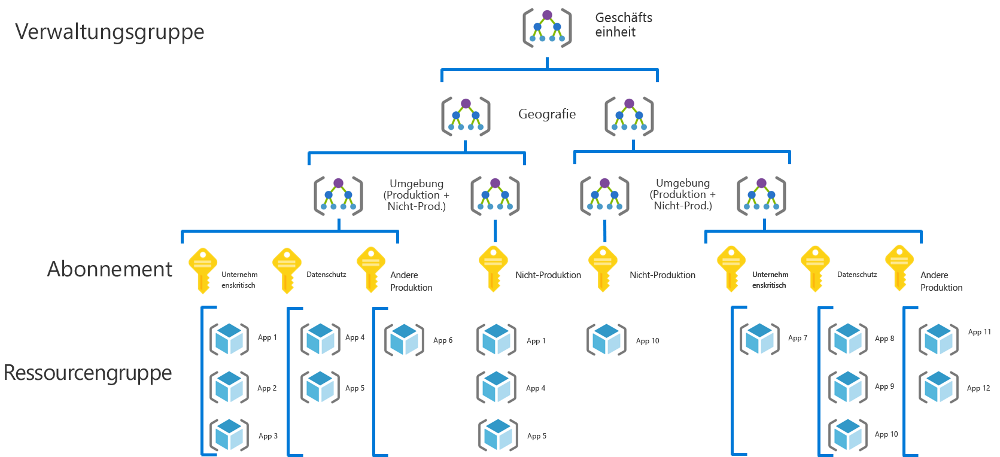
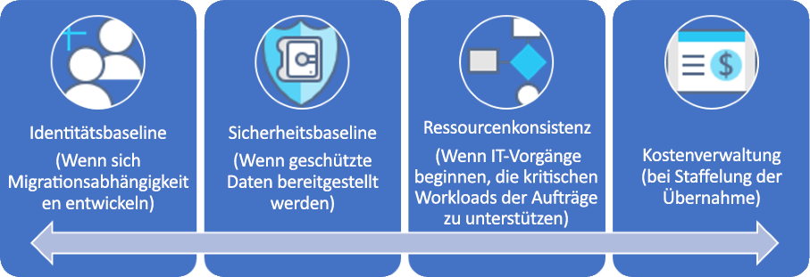

# CAF: Governance Journey für große UnternehmenCAF: Large enterprise governance journey

## Übersicht über bewährte MethodenBest practice overview

Diese Governance Journey folgt den Erfahrungen eines fiktiven Unternehmens in verschiedenen Phasen der Governancereife.This governance journey follows the experiences of a fictional company through various stages of governance maturity. Sie basiert auf echten Kundenlösungen.It is based on real customer journeys. Die empfohlenen bewährten Methoden basieren auf den Einschränkungen und Anforderungen des fiktiven Unternehmens.The suggested best practices are based on the constraints and needs of the fictional company.

Als Schnellstartpunkt definiert diese Übersicht ein auf bewährten Methoden basierendes Minimum Viable Product (MVP) für die Governance.As a quick starting point, this overview defines a minimum viable product (MVP) for governance based on best practices. Sie enthält außerdem Links zu einigen Governanceentwicklungen, die weitere bewährte Methoden hinzufügen, wenn neue Geschäfts- oder technische Risiken entstehen.It also provides links to some governance evolutions that add further best practices as new business or technical risks emerge.

> [!WARNING]
> Dieses MVP ist ein Baselineausgangspunkt, der auf einer Reihe von Annahmen basiert.This MVP is a baseline starting point, based on a set of assumptions. Auch dieser minimale Satz bewährter Methoden basiert auf Unternehmensrichtlinien, die von beispiellosen geschäftlichen Risiken und Risikotoleranzen bestimmt werden.Even this minimal set of best practices is based on corporate policies driven by unique business risks and risk tolerances. Um festzustellen, ob diese Annahmen auf Sie zutreffen, lesen Sie die [längere Schilderung](./narrative.md), die diesem Artikel folgt.To see if these assumptions apply to you, read the [longer narrative](./narrative.md) that follows this article.

### Bewährte GovernancemethodeGovernance best practice

Diese bewährte Methode dient als Grundlage, auf der eine Organisation schnell und konsistent Governancesicherungen für mehrere Azure-Abonnements hinzufügen kann.This best practice serves as a foundation that an organization can use to quickly and consistently add governance guardrails across multiple Azure subscriptions.

### RessourcenorganisationResource organization

Die folgende Abbildung zeigt die Governance-MVP-Hierarchie zum Organisieren von Ressourcen.The following diagram shows the governance MVP hierarchy for organizing resources.

Jede Anwendung sollte im richtigen Bereich der Verwaltungsgruppen-, Abonnement- und Ressourcengruppenhierarchie bereitgestellt werden.Every application should be deployed in the proper area of the management group, subscription, and resource group hierarchy. Während der Bereitstellungsplanung erstellt das Cloudgovernanceteam die erforderlichen Knoten in der Hierarchie, um die für die Cloudeinführung zuständigen Teams die Arbeit zu ermöglichen.During deployment planning, the Cloud Governance team will create the necessary nodes in the hierarchy to empower the cloud adoption teams.

1. Eine Verwaltungsgruppe für die einzelnen Geschäftseinheiten mit einer detaillierten Hierarchie, die die Geografie und dann den Umgebungstyp (Produktion, nicht Produktion) wiedergibt.A management group for each business unit with a detailed hierarchy that reflects geography then environment type (Production, Non-Production).
2. Ein Abonnement für jede eindeutige Kombination von Geschäftseinheit, Geografie, Umgebung und „Kategorisierung der Anwendung“.A subscription for each unique combination of business unit, geography, environment, and "Application Categorization."
3. Eine separate Ressourcengruppe für jede Anwendung.A separate resource group for each application.
4. Konsistente Benennung sollte auf jeder Ebene dieser Gruppierungshierarchie angewendet werden.Consistent nomenclature should be applied at each level of this grouping hierarchy.

Diese Muster bieten Raum für Wachstum, ohne die Hierarchie unnötig zu verkomplizieren.These patterns provide room for growth without complicating the hierarchy unnecessarily.

[!INCLUDE [governance-of-resources](../../../../../includes/cloud-adoption/governance/governance-of-resources.md)]

## GovernanceentwicklungenGovernance evolutions

Sobald dieses MVP bereitgestellt ist, können zusätzliche Ebenen der Governance schnell in die Umgebung integriert werden.Once this MVP has been deployed, additional layers of governance can be quickly incorporated into the environment. Einige Möglichkeiten, das MVP zu entwickeln, sind:Here are some ways to evolve the MVP to meet specific business needs:

- [Sicherheitsbaseline für geschützte DatenSecurity Baseline for protected data](./security-baseline-evolution.md)
- [Ressourcenkonfigurationen für unternehmenskritische AnwendungenResource configurations for mission-critical applications](./resource-consistency-evolution.md)
- [Steuerelemente für das KostenmanagementControls for Cost Management](./cost-management-evolution.md)
- [Steuerelemente für die Multi-Cloud-EntwicklungControls for multi-cloud evolution](./multi-cloud-evolution.md)

<!-- markdownlint-disable MD026 -->

## Wozu dient diese bewährte Methode?What does this best practice do?

Im MVP sind Methoden und Tools für die Disziplin der [Beschleunigung der Bereitstellung](../../deployment-acceleration/overview.md) festgelegt, um schnell Unternehmensrichtlinien anzuwenden.In the MVP, practices and tools from the [Deployment Acceleration](../../deployment-acceleration/overview.md) discipline are established to quickly apply corporate policy. Insbesondere verwendet das MVP Azure Blueprints, Azure Policy und Azure-Verwaltungsgruppen, um einige grundlegende Unternehmensrichtlinien anzuwenden, wie in der Schilderung für das fiktive Unternehmen definiert.In particular, the MVP uses Azure Blueprints, Azure Policy, and Azure management groups to apply a few basic corporate policies, as defined in the narrative for this fictional company. Diese Unternehmensrichtlinien werden mithilfe von Azure Resource Manager-Vorlagen und Azure-Richtlinien angewandt, um eine sehr kleine Baseline für Identität und Sicherheit festzulegen.Those corporate policies are applied using Azure Resource Manager templates and Azure policies to establish a very small baseline for identity and security.

## Weiterentwicklung der bewährten MethodeEvolving the best practice

Im Lauf der Zeit wird dieses Governance-MVP verwendet, um die Governancemethoden weiterzuentwickeln.Over time, this governance MVP will be used to evolve the governance practices. Mit fortschreitender Einführung wächst das geschäftliche Risiko.As adoption advances, business risk grows. Verschiedene Disziplinen im CAF-Governancemodell werden zur Verringerung dieser Risiken weiterentwickelt.Various disciplines within the CAF governance model will evolve to mitigate those risks. Spätere Artikel dieser Reihe erläutern die Weiterentwicklung der Unternehmensrichtlinie, die sich auf das fiktive Unternehmen auswirkt.Later articles in this series discuss the evolution of corporate policy affecting the fictional company. Diese Weiterentwicklung erfolgt drei Disziplinen übergreifend:These evolutions happen across three disciplines:

- Identitätsbaseline, indem Migrationsabhängigkeiten in der Schilderung weiterentwickelt werden.Identity Baseline, as migration dependencies evolve in the narrative
- Kostenmanagement, wenn die Einführung skaliert wird.Cost Management, as adoption scales.
- Sicherheitsbaseline, indem geschützte Daten bereitgestellt werden.Security Baseline, as protected data is deployed.
- Ressourcenkonsistenz, indem die IT-Abteilung beginnt, unternehmenskritische Workloads zu unterstützen.Resource Consistency, as IT Operations begins supporting mission-critical workloads.

## Nächste SchritteNext steps

Da Sie jetzt mit dem Governance-MVP vertraut sind und eine Vorstellung von zukünftigen Weiterentwicklungen der Governance haben, lesen Sie die unterstützende Lösung, um zusätzliche Kontextinformationen zu erhalten.Now that you’re familiar with the governance MVP and have an idea of the governance evolutions to follow, read the supporting narrative for additional context.

> [!div class="nextstepaction"]
> [Lesen Sie die unterstützende LösungRead the supporting narrative](./narrative.md)
