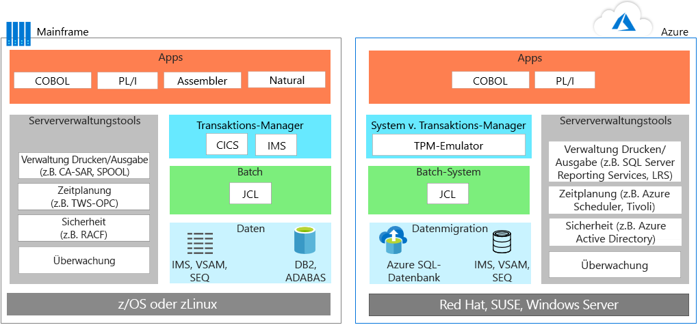
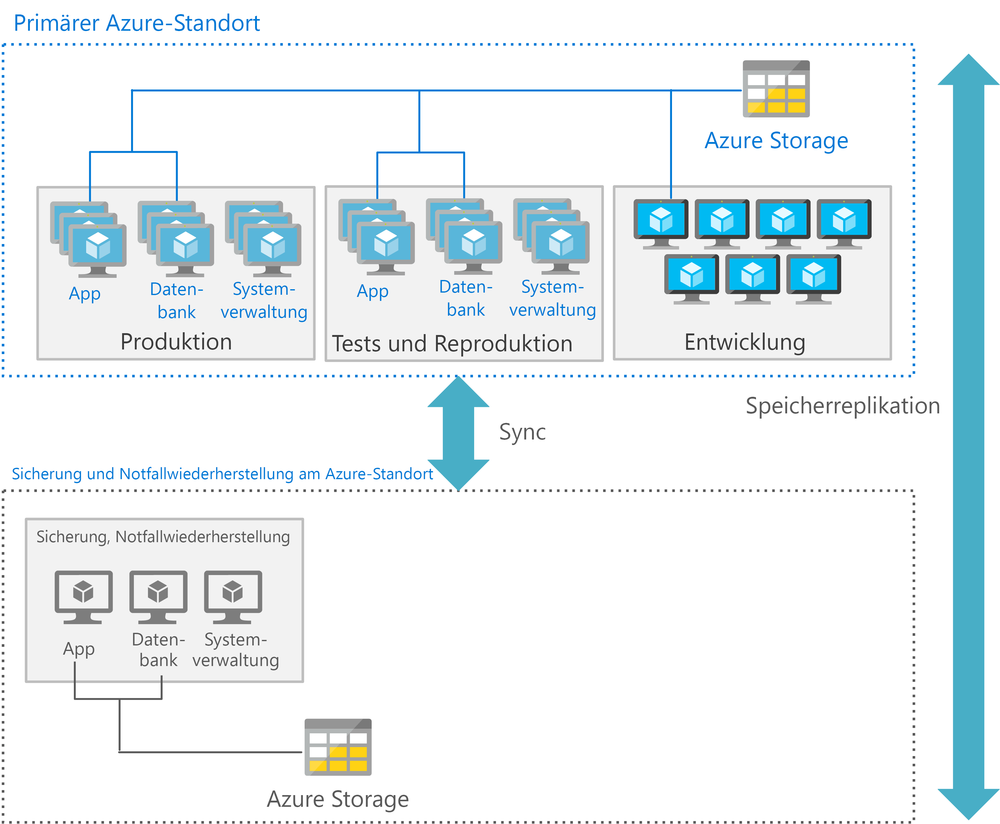

# Migration von MainframeanwendungenMainframe application migration

Bei der Migration von Anwendungen aus Mainframe-Umgebungen zu Azure verfolgen die meisten Teams einen pragmatischen Ansatz: Nach Möglichkeit werden die Anwendungen weiterverwendet. Anschließend wird eine Bereitstellung in Phasen gestartet, bei der Anwendungen neu geschrieben oder ersetzt werden.When migrating applications from mainframe environments to Azure, most teams follow a pragmatic approach: reuse wherever and whenever possible, and then start a phased deployment where applications are rewritten or replaced.

Die Anwendungsmigration umfasst üblicherweise eine oder mehrere der folgenden Strategien:Application migration typically involves one or more of the following strategies:

- Zuweisen eines neuen Hosts: Sie können vorhandenen Code, Programme und Anwendungen aus dem Mainframe verlagern. Anschließend wird der Code neu kompiliert, sodass er in einem Mainframe-Emulator ausgeführt werden kann, der in einer Cloudinstanz gehostet wird.Rehost: You can move existing code, programs, and applications from the mainframe, and then recompile the code to run in a mainframe emulator hosted in a cloud instance. Bei diesem Ansatz werden normalerweise als Erstes die Anwendungen in einen cloudbasierten Emulator verschoben, und dann wird die Datenbank zu einer cloudbasierten Datenbank migriert.This approach typically starts with moving applications to a cloud-based emulator, and then migrating the database to a cloud-based database. Neben den Daten- und Dateikonvertierungen ist etwas Engineering und Refactoring erforderlich.Some engineering and refactoring are required along with data and file conversions.

    Alternativ dazu können Sie die Zuweisung eines neuen Hosts über einen herkömmlichen Hostinganbieter durchführen.Alternatively, you can rehost using a traditional hosting provider. Einer der Hauptvorteile der Cloud besteht im Outsourcing der Infrastrukturverwaltung.One of the principal benefits of the cloud is outsourcing infrastructure management. Sie können einen Rechenzentrumsanbieter finden, der Ihre Mainframeworkloads für Sie hostet.You can find a datacenter provider that will host your mainframe workloads for you. Durch dieses Modell können Sie Zeit gewinnen, sind nicht so abhängig von einem Anbieter und sparen zwischenzeitlich Kosten ein.This model may buy time, reduce vendor lock in, and produce interim cost savings.

- Außerbetriebnahme: Alle Anwendungen, die nicht mehr benötigt werden, sollten vor der Migration außer Betrieb genommen werden.Retire: All applications that are no longer needed should be retired before migration.

- Neuerstellung: Einige Organisationen entscheiden sich dazu, Programme mithilfe moderner Techniken vollständig umzuschreiben.Rebuild: Some organizations choose to completely rewrite programs using modern techniques. Angesichts der zusätzlichen Kosten und Komplexität dieses Ansatzes ist dies nicht so üblich wie eine Migration per Lift & Shift.Given the added cost and complexity of this approach, it’s not as common as a lift-and-shift approach. Nach dieser Art der Migration ist es häufig sinnvoll, Module und Code mithilfe von Codetransformations-Engines zu ersetzen.Often after this type of migration, it makes sense to begin replacing modules and code using code transformation engines.

- Ersetzen: Bei diesem Ansatz wird die Mainframefunktionalität durch entsprechende Features in der Cloud ersetzt.Replace: This approach replaces mainframe functionality with equivalent features in the cloud. Software-as-a-Service (SaaS) ist eine Möglichkeit, bei der eine speziell für Unternehmensbelange erstellte Lösung verwendet wird, darunter Finanzen, Personalwesen, Fertigung oder Unternehmensressourcenplanung.Software as a service (SaaS) is one option, which is using a solution created specifically for an enterprise concern, such as finance, human resources, manufacturing, or enterprise resource planning. Darüber hinaus stehen jetzt viele branchenspezifische Apps zur Verfügung, um Probleme zu lösen, die zuvor durch benutzerdefinierte Mainframelösungen gelöst wurden.In addition, many industry-specific apps are now available to solve problems that custom mainframe solutions used to previously solve.

Sie sollten als Erstes die Workloads planen, die Sie zuerst migrieren möchten, und dann die Anforderungen für das Verschieben der zugehörigen Anwendungen, älteren Codebases und Datenbanken ermitteln.You should consider starting by planning those workloads that you want to initially migrate, and then determine those requirements for moving associated applications, legacy codebases, and databases.

## Mainframe-Emulation in AzureMainframe emulation in Azure

Azure-Clouddienste können herkömmliche Mainframe-Umgebungen emulieren, sodass Sie vorhandenen Mainframecode und zugehörige Anwendungen weiterverwenden können.Azure cloud services can emulate traditional mainframe environments, enabling you to reuse existing mainframe code and applications. Zu den allgemeinen Serverkomponenten, die Sie emulieren können, gehören OLTP- (Onlinetransaktionsverarbeitung), Batch- und Datenerfassungssysteme.Common server components that you can emulate include online transaction processing (OLTP), batch, and data ingestion systems.

### OLTP-SystemeOLTP systems

Auf vielen Mainframes werden OLTP-Systeme verwendet, die Tausende oder Millionen von Updates für eine riesige Anzahl von Benutzern verarbeiten.Many mainframes have OLTP systems that process thousands or millions of updates for huge numbers of users. Diese Anwendungen verwenden häufig die Transaktionsverarbeitung sowie Software zur Verarbeitung von Bildschirmformularen, beispielsweise CICS (Customer Information Control System), IMS (Information Management System) und TIP (Terminal Interface Processor).These applications often use transaction processing and screen-form handling software, such as customer information control system (CICS), information management systes (IMS), and terminal interface processor (TIP).

Beim Verlagern von OLTP-Anwendungen in Azure stehen Emulatoren für Monitore der Mainframetransaktionsverarbeitung (TP) zur Ausführung als Infrastructure-as-a-Service (IaaS) mit virtuellen Computern (VMs) in Azure zur Verfügung.When moving OLTP applications to Azure, emulators for mainframe transaction processing (TP) monitors are available to run as infrastructure as a service (IaaS) using virtual machines (VMs) on Azure. Die Bildschirmverarbeitungs- und Formularfunktionalität kann auch Webservern implementiert werden.The screen handling and form functionality can also be implemented by web servers. Für den Datenzugriff und für Transaktionen kann dieser Ansatz mit Datenbank-APIs wie ADO (ActiveX Data Objects), ODBC (Open Database Connectivity) und JDBC (Java Database Connectivity) kombiniert werden.This approach can be combined with database APIs, such as ActiveX data object (ADO), open database connectivity (ODBC), and Java database connectivity (JDBC) for data access and transactions.

### Zeitlich beschränkte BatchupdatesTime-constrained batch updates

Viele Mainframesysteme führen monatliche oder jährliche Updates von Millionen von Kontodatensätzen durch, wie sie z.B. in Banken, Versicherungen und Behörden verwendet werden.Many mainframe systems perform monthly or annual updates of millions of account records, such as those used in banking, insurance, and government. Mainframes verarbeiten diese Arten von Workloads durch die Bereitstellung von Datenverarbeitungssystemen mit hohem Durchsatz.Mainframes handle these types of workloads by offering high-throughput data handling systems. Mainframebatchaufträge sind in der Regel serieller Natur, und ihre Leistung hängt von den Eingabe-/Ausgabevorgängen pro Sekunde (IOPS) ab, die vom Mainframebackbone ermöglicht werden.Mainframes batch jobs are typically serial in nature and depend on the input/output operations per second (IOPS) provided by the mainframe backbone for performance.

Die Leistung cloudbasierter Umgebungen beruht auf parallelen Computeressourcen und Hochgeschwindigkeitsnetzwerken.Cloud-based batch environments use parallel compute and high-speed networks for performance. Wenn Sie die Batchleistung optimieren möchten, bietet Azure verschiedene Compute-, Speicher- und Netzwerkoptionen.If you need to optimize batch performance, Azure provides various compute, storage, and networking options.

### DatenerfassungssystemeData ingestion systems

Mainframes erfassen große Datenbatches aus Einzelhandel, Finanzdienstleistungen, Fertigung und anderen Verarbeitungslösungen.Mainframes ingest large batches of data from retail, financial services, manufacturing, and other solutions for processing. Mit Azure können Sie einfache Befehlszeilen-Hilfsprogramme wie z.B. [AzCopy](/azure/storage/common/storage-use-azcopy) zum Kopieren von Daten in und aus dem Speicherort verwenden.With Azure, you can use simple command-line utilities such as [AzCopy](/azure/storage/common/storage-use-azcopy) for copying data to and from storage location. Sie können auch den [Azure Data Factory](/azure/data-factory/introduction)-Dienst verwenden, um Daten aus unterschiedlichen Datenspeichern zu erfassen und datengesteuerte Workflows zu erstellen und zu planen.You can also use the [Azure Data Factory](/azure/data-factory/introduction) service, enabling you to ingest data from disparate data stores to create and schedule data-driven workflows.

Neben Emulationsumgebungen stellt Azure auch PaaS-Lösungen (Platform-as-a-Service) und Analysedienste bereit, mit denen vorhandene Mainframe-Umgebungen erweitert werden können.In addition to emulation environments, Azure provides platform as a service (PaaS) and analytics services that can enhance existing mainframe environments.

## Migrieren von Workloads zu AzureMigrate OLTP workloads to Azure

Die Migration per Lift & Shift ist die codelose Option zur schnellen Migration vorhandener Anwendungen zu Azure.The lift-and-shift approach is the no code option for quickly migrating existing applications to Azure. Jede Anwendung wird im vorliegenden Zustand migriert, wodurch Sie die Vorteile der Cloud, jedoch ohne die Risiken und Kosten von Codeänderungen erhalten.Each application is migrated as is, which provides the benefits of the cloud without the risks or costs of making code changes. Durch die Verwendung eines Emulators für Monitore der Mainframetransaktionsverarbeitung (TP) in Azure wird dieser Ansatz unterstützt.Using an emulator for mainframe transaction processing (TP) monitors on Azure supports this approach.

TP-Monitore sind von verschiedenen Herstellern erhältlich und werden auf virtuellen Computern ausgeführt – eine IaaS-Option (Infrastructure-as-a-Service) in Azure.TP monitors are available from various vendors and run on virtual machines, an infrastructure as a service (IaaS) option on Azure. Die folgenden Vorher-/Nachher-Diagramme zeigen die Migration einer von IBM DB2 unterstützten Onlineanwendung, einem Managementsystem für relationale Datenbanken (DBMS), auf einem IBM z/OS-Mainframe.The following before and after diagrams show a migration of an online application backed by IBM DB2, a relational database management system (DBMS), on an IBM z/OS mainframe. DB2 für z/OS verwendet VSAM-Dateien (Virtual Storage Access Method) zum Speichern der Daten sowie die indizierte sequenzielle Zugriffsmethode (ISAM) für Flatfiles.DB2 for z/OS uses virtual storage access method (VSAM) files to store the data and Indexed Sequential Access Method (ISAM) for flat files. Diese Architektur verwendet zudem CICS für die Transaktionsüberwachung.This architecture also uses CICS for transaction monitoring.

In Azure werden Emulationsumgebungen verwendet, um den TP-Manager und die Batchaufträge auszuführen, die JCL nutzen.On Azure, emulation environments are used to run the TP manager and the batch jobs that use JCL. In der Datenschicht wird DB2 durch [Azure SQL-Datenbank](/azure/sql-database/sql-database-technical-overview) ersetzt, obwohl auch Microsoft SQL Server, DB2 LUW oder Oracle Database verwendet werden können.In the data tier, DB2 is replaced by [Azure SQL Database](/azure/sql-database/sql-database-technical-overview), although Microsoft SQL Server, DB2 LUW, or Oracle Database can also be used. Ein Emulator unterstützt IMS, VSAM und SEQ.An emulator supports IMS, VSAM, and SEQ. Die Systemverwaltungstools des Mainframes werden durch Azure-Dienste und Software von anderen Herstellern ersetzt, die auf virtuellen Computern ausgeführt werden.The mainframe’s system management tools are replaced by Azure services, and software from other vendors, that run in VMs.

Die Funktionalität für Bildschirmverarbeitung und Formulareinträge wird häufig über Webserver implementiert, die mit Datenbank-APIs wie ADO, ODBC und JDBC für den Datenzugriff und Transaktionen kombiniert werden können.The screen handling and form entry functionality is commonly implemented using web servers, which can be combined with database APIs, such as ADO, ODBC, and JDBC for data access and transactions. Die genaue Zusammenstellung zu verwendender Azure-IaaS-Komponenten hängt vom bevorzugten Betriebssystem ab.The exact line-up of Azure IaaS components to use depends on the operating system you prefer. Beispiel: For example:

- Windows-basierte virtuelle Computer: Internet Information Server (IIS) zusammen mit ASP.NET für Bildschirmverarbeitung und Geschäftslogik.Windows–based VMs: Internet Information Server (IIS) along with ASP.NET for the screen handling and business logic. Verwenden Sie ADO.NET für Datenzugriff und Transaktionen.Use ADO.NET for data access and transactions.

- Linux-basierte virtuelle Computer: Die Java-basierten Anwendungsserver, die zur Verfügung stehen, z.B. Apache Tomcat für die Bildschirmverarbeitung und Java-basierte Geschäftsfunktionen.Linux–based VMs: The Java-based application servers that are available, such as Apache Tomcat for screen handling and Java-based business functionality. Verwenden Sie JDBC für Datenzugriff und Transaktionen.Use JDBC for data access and transactions.

## Migrieren von Batchworkloads zu AzureMigrate batch workloads to Azure

Batchvorgänge in Azure unterscheiden sich von der typischen Batchumgebung auf Mainframes.Batch operations in Azure differ from the typical batch environment on mainframes. Mainframebatchaufträge sind in der Regel serieller Natur, und ihre Leistung hängt von den IOPS ab, die vom Mainframebackbone ermöglicht werden.Mainframe batch jobs are typically serial in nature and depend on the IOPS provided by the mainframe backbone for performance. Die Leistung cloudbasierter Umgebungen beruht auf parallelen Computeressourcen und Hochgeschwindigkeitsnetzwerken.Cloud-based batch environments use parallel computing and high-speed networks for performance.

Um die Batchleistung mithilfe von Azure zu optimieren, ziehen Sie die [Compute](/azure/virtual-machines/windows/overview)-, [Speicher](/azure/storage/blobs/storage-blobs-introduction)-, [Netzwerk](https://azure.microsoft.com/blog/maximize-your-vm-s-performance-with-accelerated-networking-now-generally-available-for-both-windows-and-linux/)- und [Überwachungsoptionen](/azure/azure-monitor/overview) wie folgt in Betracht.To optimize batch performance using Azure, consider the [compute](/azure/virtual-machines/windows/overview), [storage](/azure/storage/blobs/storage-blobs-introduction), [networking](https://azure.microsoft.com/blog/maximize-your-vm-s-performance-with-accelerated-networking-now-generally-available-for-both-windows-and-linux/), and [monitoring](/azure/azure-monitor/overview) options as follows.

### ComputeCompute

Verwendung:Use:

- VMs mit der höchsten Taktfrequenz.VMs with the highest clock speed. Mainframeanwendungen sind häufig Singlethreadanwendungen, und Mainframe-CPUs verfügen über eine sehr hohe Taktfrequenz.Mainframe applications are often single-threaded and mainframe CPUs have a very high clock speed.

- Virtuelle Computer mit großer Arbeitsspeicherkapazität, um die Zwischenspeicherung von Daten und Anwendungsarbeitsbereichen zu ermöglichen.VMs with large memory capacity to allow caching of data and application work areas.

- VMs mit vCPUs höherer Dichte, um die Vorteile der Multithreadverarbeitung zu nutzen, wenn die Anwendung mehrere Threads unterstützt.VMs with higher density vCPUs to take advantage of multi-threaded processing if the application supports multiple threads.

- Parallele Verarbeitung, da Azure für die Parallelverarbeitung einfach horizontal hochskaliert werden und mehr Computeleistung für eine Batchausführung bereitstellen kann.Parallel processing, as Azure easily scales out for parallel processing, delivering more compute power for a batch run.

### StorageStorage

Verwendung:Use:

- [Azure SSD Premium](/azure/virtual-machines/windows/premium-storage) oder [Azure SSD Ultra](/azure/virtual-machines/windows/disks-ultra-ssd) für maximal verfügbare IOPS.[Azure Premium SSD](/azure/virtual-machines/windows/premium-storage) or [Azure Ultra SSD](/azure/virtual-machines/windows/disks-ultra-ssd) for maximum available IOPS.

- Striping mit mehreren Datenträgern für mehr IOPS pro Speichergröße.Striping with multiple disks for more IOPS per storage size.

- Partitionierung zur Verteilung der Speicher-E/A auf mehrere Azure-Speichergeräte.Partitioning for storage to spread IO over multiple Azure storage devices.

### NetzwerkNetworking

- Verwenden Sie den [beschleunigten Azure-Netzwerkbetrieb](/azure/virtual-network/create-vm-accelerated-networking-powershell), um Wartezeiten zu verringern.Use [Azure Accelerated Networking](/azure/virtual-network/create-vm-accelerated-networking-powershell) to minimize latency.

### ÜberwachungMonitoring

- Verwenden Sie Überwachungstools. [Azure Monitor](/azure/azure-monitor/overview), [Azure Application Insights](/azure/application-insights/app-insights-overview) und auch die Azure-Protokolle ermöglichen Administratoren die Überwachung einer übermäßigen Auslastung von Batchausführungen und helfen bei der Beseitigung von Engpässen.Use monitoring tools, [Azure Monitor](/azure/azure-monitor/overview), [Azure Application Insights](/azure/application-insights/app-insights-overview), and even the Azure logs enable administrators to monitor any over performance of batch runs and help eliminate bottlenecks.

## Migrieren von EntwicklungsumgebungenMigrate development environments

Die verteilten Architekturen der Cloud basieren auf einer anderen Reihe von Entwicklungstools, die den Vorteil moderner Methoden und Programmiersprachen bieten.The cloud’s distributed architectures rely on a different set of development tools that provide the advantage of modern practices and programming languages. Um diesen Übergang zu erleichtern, können Sie eine Entwicklungsumgebung mit anderen Tools verwenden, die zum Emulieren von IBM z/OS-Umgebungen entwickelt wurden.To ease this transition, you can use a development environment with other tools that are designed to emulate IBM z/OS environments. Die folgende Liste enthält Optionen von Microsoft und anderen Anbietern:The following list shows options from Microsoft and other vendors:

| KomponenteComponent        | Azure-OptionenAzure Options                                                                                                                                  |
|------------------|---------------------------------------------------------------------------------------------------------------------------------------------------|
| z/OSz/OS             | Windows, Linux oder UNIXWindows, Linux, or UNIX                                                                                                                      |
| CICSCICS             | Von Micro Focus, Oracle, GT Software (Fujitsu), TmaxSoft, Raincode und NTT Data angebotene oder über Kubernetes neu generierte Azure-DiensteAzure services offered by Micro Focus, Oracle, GT Software (Fujitsu), TmaxSoft, Raincode, and NTT Data, or rewrite using Kubernetes |
| IMSIMS              | Von Micro Focus und Oracle angebotene Azure-DiensteAzure services offered by Micro Focus and Oracle                                                                                  |
| AssemblerAssembler        | Azure-Dienste von Raincode und TmaxSoft bzw. COBOL, C oder Java oder Zuordnung zu BetriebssystemfunktionenAzure services from Raincode and TmaxSoft; or COBOL, C, or Java, or map to operating system functions               |
| JCLJCL              | JCL, PowerShell oder andere SkripterstellungstoolsJCL, PowerShell, or other scripting tools                                                                                                   |
| COBOLCOBOL            | COBOL, C oder JavaCOBOL, C, or Java                                                                                                                            |
| NaturalNatural          | Natural, COBOL, C oder JavaNatural, COBOL, C, or Java                                                                                                                  |
| FORTRAN und PL/IFORTRAN and PL/I | FORTRAN, PL/I, COBOL, C oder JavaFORTRAN, PL/I, COBOL, C, or Java                                                                                                           |
| REXX und PL/IREXX and PL/I    | REXX, PowerShell oder andere SkripterstellungstoolsREXX, PowerShell, or other scripting tools                                                                                                  |

## Migrieren von Datenbanken und DatenMigrate databases and data

Die Anwendungsmigration umfasst in der Regel das Zuweisen eines neuen Hosts für die Datenschicht.Application migration usually involves rehosting the data tier. Sie können Ihre SQL Server-, Open Source- und anderen relationalen Datenbanken mit [Azure Database Migration Service](/azure/dms/dms-overview) zu vollständig verwalteten Lösungen in Azure migrieren, z.B. zu [verwalteten Azure SQL-Datenbank-Instanzen](/azure/sql-database/sql-database-managed-instance), [Azure Database for PostgreSQL](/azure/postgresql/overview) und [Azure Database for MySQL](/azure/mysql/overview).You can migrate SQL Server, open-source, and other relational databases to fully-managed solutions on Azure, such as [Azure SQL Database Managed Instance](/azure/sql-database/sql-database-managed-instance), [Azure Database Service for PostgreSQL](/azure/postgresql/overview), and [Azure Database for MySQL](/azure/mysql/overview) with [Azure Database Migration Service](/azure/dms/dms-overview).

Beispielsweise können Sie die Migration durchführen, wenn in der Mainframedatenschicht Folgendes verwendet wird:For example, you can migrate if the mainframe data tier uses:

- IBM DB2 oder IMS-Datenbank: Verwenden Sie Azure SQL-Datenbank, SQL Server, DB2 LUW oder Oracle Database in Azure.IBM DB2 or an IMS database, use Azure SQL database, SQL Server, DB2 LUW, or Oracle Database on Azure.

- VSAM- und andere Flatfiles: Verwenden Sie ISAM-Flatfiles (indizierte sequenzielle Zugriffsmethode) für Azure SQL, SQL Server, DB2 LUW oder Oracle.VSAM and other flat files, use Indexed Sequential Access Method (ISAM) flat files for Azure SQL, SQL Server, DB2 LUW, or Oracle.

- GDGs (Generation Date Groups): Migrieren Sie zu Dateien in Azure, die eine Namenskonvention und Dateinamenerweiterungen sowie eine ähnliche Funktionalität wie GDGs bereitstellen.Generation Date Groups (GDGs), migrate to files on Azure that use a naming convention and filename extensions that provide similar functionality to GDGs.

Die IBM-Datenschicht umfasst mehrere wichtige Komponenten, die ebenfalls migriert werden müssen.The IBM data tier includes several key components that you must also migrate. Wenn Sie beispielsweise eine Datenbank migrieren, migrieren Sie auch eine Sammlung von Daten in Pools. Diese enthalten jeweils dbextents, bei denen es sich um z/OS-VSAM-Datasets handelt.For example, when you migrate a database, you also migrate a collection of data contained in pools, each containing dbextents, which are z/OS VSAM data sets. Ihre Migration muss das Verzeichnis einschließen, das die Datenspeicherorte in den Speicherpools identifiziert.Your migration must include the directory that identifies data locations in the storage pools. Darüber hinaus muss Ihr Migrationsplan auch das Datenbankprotokoll berücksichtigen, welches einen Datensatz mit den für die Datenbank ausgeführten Vorgängen enthält.Also, your migration plan must consider the database log, which contains a record of operations performed on the database. Eine Datenbank kann ein, zwei (dual oder alternativ) oder vier Protokolle (dual und alternativ) aufweisen.A database can have one, two (dual or alternate), or four (dual and alternate) logs.

Die Datenbankmigration umfasst außerdem folgende Komponenten:Database migration also includes these components:

- Datenbank-Manager: Bietet Zugriff auf Daten in der Datenbank.Database manager: Provides access to data in the database. Der Datenbank-Manager wird in einer eigenen Partition in einer z/OS-Umgebung ausgeführt.The database manager runs in its own partition in a z/OS environment.

- Anwendungsanforderer: Nimmt Anforderungen von Anwendungen an, bevor sie an einen Anwendungsserver weitergeleitet werden.Application requester: Accepts requests from applications before passing them to an application server.

- Onlineressourcenadapter: Enthält Komponenten des Anwendungsanforderers zur Verwendung in CICS-Transaktionen.Online resource adapter: Includes application requester components for use in CICS transactions.

- Batchressourcenadapter: Implementiert Komponenten des Anwendungsanforderers für z/OS-Batchanwendungen.Batch resource adapter: Implements application requester components for z/OS batch applications.

- Interactive SQL (ISQL): Wird als CICS-Anwendung und Schnittstelle ausgeführt und ermöglicht den Benutzern die Eingabe von SQL-Anweisungen oder Operatorbefehlen.Interactive SQL (ISQL): Runs as a CICS application and interface enabling users to enter SQL statements or operator commands.

- CICS-Anwendung: Wird unter CICS-Steuerung ausgeführt und verwendet verfügbare Ressourcen und Datenquellen in CICS.CICS application: Runs under the control of CICS, using available resources and data sources in CICS.

- Batchanwendung: Führt Prozesslogik ohne interaktive Kommunikation mit Benutzern aus, um beispielsweise Massenaktualisierungen von Daten durchzuführen oder Berichte aus einer Datenbank zu generieren.Batch application: Runs process logic without interactive communication with users to, for example, produce bulk data updates or generate reports from a database.

## Optimieren von Skalierung und Durchsatz für AzureOptimize scale and throughput for Azure

Allgemein formuliert werden Mainframes zentral hochskaliert, während die Cloud horizontal hochskaliert wird. Um die Skalierung und den Durchsatz von Mainframeanwendungen unter Azure zu optimieren, müssen Sie wissen, wie Mainframes Anwendungen trennen und isolieren können.Generally speaking, mainframes scale up, while the cloud scales out. To optimize scale and throughput of mainframe-style applications running on Azure, it is important that you understand at how mainframes can separate and isolate applications. Ein z/OS-Mainframe verwendet ein Feature namens LPARs (logische Partitionen), um die Ressourcen für eine bestimmte Anwendung auf einer einzelnen Instanz zu isolieren und zu verwalten.A z/OS mainframe uses a feature called Logical Partitions (LPARS) to isolate and manage the resources for a specific application on a single instance.

Ein Mainframe kann beispielsweise eine logische Partition (LPAR) für eine CICS-Region mit zugeordneten COBOL-Programmen und eine separate LPAR für DB2 verwenden.For example, a mainframe might use one logical partition (LPAR) for a CICS region with associated COBOL programs, and a separate LPAR for DB2. Zusätzliche LPARs werden häufig für die Entwicklungs-, Test- und Stagingumgebungen eingesetzt.Additional LPARs are often used for the development, testing, and staging environments.

In Azure ist es eher üblich, zu diesen Zwecken separate virtuelle Computer zu verwenden.On Azure, it’s more common to use separate VMs to serve this purpose. Azure-Architekturen stellen in der Regel VMs für die Logikschicht, einen separaten Satz von VMs für die Datenschicht, einen weiteren Satz für die Entwicklung usw. bereit.Azure architectures typically deploy VMs for the application tier, a separate set of VMs for the data tier, another set for development, and so on. Jede Verarbeitungsebene kann über den am besten geeigneten VM-Typ und über die Features für die jeweilige Umgebung optimiert werden.Each tier of processing can be optimized using the most suitable type of VMs and  features for that environment.

Darüber hinaus kann jede Ebene auch entsprechende Dienste für die Notfallwiederherstellung bereitstellen.In addition, each tier can also provide appropriate disaster recovery services. Zum Beispiel ist für Produktions- und Datenbank-VMs möglicherweise eine Wiederherstellung auf heißer oder warmer Ebene erforderlich, während Entwicklungs- und Test-VMs eine Wiederherstellung auf kalter Ebene unterstützen.For example, production and database VMs might require a hot or warm recovery, while the development and testing VMs support a cold recovery.

Die folgende Abbildung zeigt eine mögliche Azure-Bereitstellung über einen primären und einen sekundären Standort.The following figure shows a possible Azure deployment using a primary and a secondary site. Am primären Standort werden die Produktions-, Präproduktions- und Test-VMs mit hoher Verfügbarkeit bereitgestellt.In the primary site, the production, preproduction, and testing VMs are deployed with high availability. Der sekundäre Standort wird für die Sicherung und Notfallwiederherstellung verwendet.The secondary site is for backup and disaster recovery.

## Durchführen einer mehrstufigen Mainframemigration zu AzurePerform a staged mainframe to Azure

Das Verschieben von Lösungen aus einem Mainframe nach Azure kann eine *mehrstufige* Migration umfassen, bei der einige Anwendungen als Erste verschoben werden und andere vorübergehend oder dauerhaft auf dem Mainframe verbleiben.Moving solutions from a mainframe to Azure may involve a *staged* migration, whereby some applications are moved first, and others remain on the mainframe temporarily or permanently. Für diesen Ansatz sind in der Regel Systeme erforderlich, die eine Zusammenarbeit von Anwendungen und Datenbanken zwischen Mainframe und Azure ermöglichen.This approach typically requires systems that allow applications and databases to interoperate between the mainframe and Azure.

In einem häufigen Szenario wird eine Anwendung nach Azure verschoben, während die von der Anwendung verwendeten Daten auf dem Mainframe bleiben.A common scenario is to move an application to Azure while keeping the data used by the application on the mainframe. Eine spezielle Software wird verwendet, um den Anwendungen in Azure den Zugriff auf Daten auf dem Mainframe zu ermöglichen.Specific software is used to enable the applications on Azure to access data from the mainframe. Glücklicherweise stellen zahlreiche Lösungen die Integration zwischen Azure und vorhandenen Mainframe-Umgebungen, die Unterstützung für Hybridszenarien und die Migration über einen längeren Zeitraum bereit.Fortunately, a wide range of solutions provide integration between Azure and existing mainframe environments, support for hybrid scenarios, and migration over time. Microsoft-Partner, unabhängige Softwarehersteller und Systemintegratoren können Sie bei diesem Prozess unterstützen.Microsoft partners, independent software vendors, and system integrators can help you on your journey.

Eine Möglichkeit ist beispielsweise [Microsoft Host Integration Server](https://docs.microsoft.com/host-integration-server/) (HIS). Diese Lösung stellt die verteilte Architektur relationaler Datenbanken (DRDA) bereit, die erforderlich ist, damit Anwendungen in Azure auf Daten in DB2 auf dem Mainframe zugreifen können.One option is [Microsoft Host Integration Server](https://docs.microsoft.com/host-integration-server/) (HIS), a solution that provides the distributed relational database architecture (DRDA) required for applications in Azure to access data in DB2 that remains on the mainframe. Zu weiteren Optionen für die Integration von Mainframes in Azure zählen Lösungen von IBM, Attunity, Codit und anderen Anbietern sowie Open Source-Optionen.Other options for mainframe-to-Azure integration include solutions from IBM, Attunity, Codit, other vendors, and open source options.

## PartnerlösungenPartner solutions

Wenn Sie eine Mainframemigration in Betracht ziehen, steht Ihnen das Partnerökosystem zur Seite.If you are considering a mainframe migration, the partner ecosystem is available to assist you.

Azure bietet eine bewährte, hoch verfügbare und skalierbare Infrastruktur für Systeme, die derzeit auf Mainframes ausgeführt werden.Azure provides a proven, highly available, and scalable infrastructure for systems that currently run on mainframes. Einige Workloads können relativ einfach migriert werden.Some workloads can be migrated with relative ease. Andere Workloads, die auf älterer Systemsoftware wie z.B. CICS und IMS beruhen, können über Partnerlösungen neuen Hosts zugewiesen und im Laufe der Zeit zu Azure migriert werden.Other workloads that depend on legacy system software, such as CICS and IMS, can be rehosted using partner solutions and migrated to Azure over time. Unabhängig von Ihrer Wahl stehen Microsoft und unsere Partner Ihnen zur Verfügung, um Sie bei der Optimierung für Azure und bei der Beibehaltung der Funktionalität von Mainframesystemsoftware zu unterstützen.Regardless of the choice you make, Microsoft and our partners are available to assist you in optimizing for Azure while maintaining mainframe system software functionality.

Ausführliche Anleitungen zur Auswahl einer Partnerlösung finden Sie in der [Platform Modernization Alliance](https://www.platformmodernization.org/pages/mainframe.aspx).For detailed guidance about choosing a partner solution, refer to the [Platform Modernization Alliance](https://www.platformmodernization.org/pages/mainframe.aspx).

## Weitere InformationenLearn more

Weitere Informationen finden Sie in den folgenden Ressourcen:For more information, see the following resources:

- [Erste Schritte mit AzureGet started with Azure](/azure)

- [Platform Modernization Alliance: MainframemigrationPlatform Modernization Alliance: Mainframe migration](https://www.platformmodernization.org/pages/mainframe.aspx)

- [Bereitstellen von IBM DB2 pureScale in AzureDeploy IBM DB2 pureScale on Azure](https://azure.microsoft.com/resources/deploy-ibm-db2-purescale-on-azure)

- [Dokumentation zu Host Integration Server (HIS)Host Integration Server (HIS) documentation](https://docs.microsoft.com/host-integration-server/)
