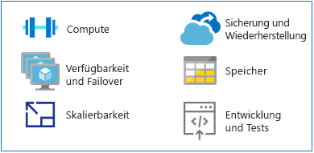

# Wechseln von Mainframes zu Azure

Azure ist eine alternative Plattform für die Ausführung herkömmlicher Mainframeanwendungen und bietet Hyperscalecomputing und -speicher in einer auf Hochverfügbarkeit ausgelegten Umgebung. Sie profitieren von den Optionen und der Agilität einer modernen, cloudbasierten Plattform, aber ohne die Kosten einer Mainframeumgebung.

Dieser Abschnitt bietet einen technischen Leitfaden für den Wechsel von einer Mainframeplattform zu Azure.

## MIPS im Vergleich zu vCPUs

Es gibt keine universelle Zuordnungsformel, um die Anzahl von virtuellen Prozessoren (vCPUs) zu ermitteln, die zum Ausführen von Mainframeworkloads erforderlich sind. Häufig wird jedoch die Metrik „MIPS“ (Million Instructions Per Second, Millionen Anweisungen pro Sekunde) zu vCPUs auf Azure zugeordnet. MIPS dienen zur Messung der gesamten Rechenleistung eines Mainframesystems, indem sie einen konstanten Wert für die Anzahl von Zyklen pro Sekunde für einen bestimmten Computer angeben.

Eine kleine Organisation benötigt vielleicht weniger als 500 MIPS, wohingegen eine große Organisation in der Regel über 5.000 MIPS verwendet. Bei Kosten von 1.000 USD pro MIPS gibt eine große Organisation für die Bereitstellung einer Infrastruktur mit 5.000 MIPS etwa 5 Mio. USD pro Jahr aus. Die geschätzten jährlichen Kosten für eine typische Azure-Bereitstellung dieser Größenordnung betragen etwa ein Zehntel der Kosten für eine MIPS-Infrastruktur. Weitere Details dazu finden Sie im Whitepaper [Demystifying Mainframe-to-Azure Migration](https://azure.microsoft.com/resources/demystifying-mainframe-to-azure-migration) (Beseitigen von Irrtümern in Bezug auf die Migration von Mainframesystemen zu Azure) in Tabelle 4.

Die exakte Berechnung des Verhältnisses von MIPS zu vCPUs bei Azure richtet sich nach dem CPU-Typ und der genauen Workload, die Sie ausführen möchten. Benchmarkstudien bieten jedoch eine gute Grundlage, um die Anzahl und Art der vCPUs zu schätzen, die Sie benötigen werden. Eine kürzlich [in Zusammenarbeit mit HPE durchgeführte Benchmarkstudie mit einer z/OS-Referenzarchitektur](https://h20195.www2.hpe.com/v2/getpdf.aspx/4aa4-2452enw.pdf) ergab folgende Schätzungen:

- 288 MIPS pro auf HP ProLiant-Servern ausgeführtem Intel-basiertem Kern für Onlineaufträge (CICS, Customer Information Control System).

- 170 MIPS pro Intel-Kern für COBOL-Batchaufträge.

In diesem Leitfaden werden 200 MIPS pro vCPU für die Onlineverarbeitung und 100 MIPS pro vCPU für die Batchverarbeitung geschätzt.

> [!NOTE]
> Diese Schätzungen werden ggf. angepasst, wenn neue VM-Serien in Azure verfügbar werden.

## Hochverfügbarkeit und Failover

Mainframesystem bieten häufig eine Verfügbarkeit von fünf Neunen (99,999 Prozent) bei Verwendung von Mainframekopplung und Parallel Sysplex. Systemoperatoren müssen dennoch weiterhin Ausfallzeiten für Wartung und IPLs (Initial Program Loads) einplanen. Die tatsächliche Verfügbarkeit liegt bei zwei oder drei Neunen – Werte, die auch mit Intel-basierten High-End-Servern erzielt werden.

Im Vergleich dazu bietet Azure SLAs (Service Level Agreements, Vereinbarungen zum Servicelevel), bei denen eine Verfügbarkeit mit mehreren Neunen Standard ist. Optimiert wird die Verfügbarkeit zudem durch eine lokale oder geografische Replikation von Diensten.

Azure sorgt für zusätzliche Verfügbarkeit durch Replizieren von Daten von mehreren Speichergeräten – entweder lokal oder in anderen geografischen Regionen. Sollte ein Ausfall in Azure auftreten, können Computeressourcen entweder auf lokaler oder auf regionaler Ebene auf die replizierten Daten zugreifen.

Wenn Sie Azure-PaaS-Ressourcen (Platform-as-a-Service) wie [Azure SQL-Datenbank](/azure/sql-database/sql-database-technical-overview) und [Azure Cosmos-Datenbank](/azure/cosmos-db/introduction) verwenden, kann Azure automatisch ein Failover ausführen. Bei Verwendung von Azure-IaaS (Infrastructure-as-a-Service) wird das Failover von bestimmten Systemfunktionen ausgeführt, z.B. von AlwaysOn-Features, Failoverclusterinstanzen und Verfügbarkeitsgruppen in SQL Server.

## Skalierbarkeit

Mainframes werden in der Regel zentral hochskaliert, Cloudumgebungen horizontal. Mainframes lassen sich mit einer Kopplungsfunktion horizontal hochskalieren, dies ist aber aufgrund der hohen Kosten von Hardware und Speicher sehr teuer.

Darüber hinaus erfordert eine solche Funktion nah gekoppelte Computeressourcen, die Azure-Features für die horizontale Skalierung dagegen sind lose gekoppelt. Die Cloud lässt sich entsprechend den Benutzerangaben exakt hoch- oder herunterskalieren: Computeleistung, Speicher und Dienste werden in einem nutzungsbasierten Abrechnungsmodell nach Bedarf hinzugefügt oder entfernt.

## Sicherung und Wiederherstellung

Kunden mit Mainframesystemen unterhalten in der Regel Standorte für eine Notfallwiederherstellung oder verlassen sich auf einen unabhängigen Mainframeanbieter, um Notfallsituationen schnell zu beseitigen. Die Synchronisierung mit einem Standort für die Notfallwiederherstellung erfolgt häufig über Offlinekopien der Daten. Bei beiden Optionen fallen hohe Kosten an.

Durch Mainframekopplung lässt sich auch eine automatische Georedundanz einrichten – diese ist allerdings ebenfalls teuer und in der Regel für unternehmenskritische Systeme reserviert. Im Gegensatz dazu bietet Azure kostengünstige Optionen, die sich leicht implementieren lassen, für [Sicherung](/azure/backup/backup-introduction-to-azure-backup), [Wiederherstellung](/azure/site-recovery/site-recovery-overview) und [Redundanz](/azure/storage/common/storage-redundancy) auf lokaler oder regionale Ebene oder über Georedundanz.

## Storage

Um die Funktionsweise von Mainframesystemen zu verstehen, müssen einige sich überschneidende Begriffe geklärt werden. Zentraler Speicher, echter Arbeitsspeicher, echter Speicher und Hauptspeicher – all diese Begriffe beziehen sich ganz allgemein auf direkt an den Mainframeprozessor angeschlossenen Speicher.

Die Mainframehardware umfasst Prozessoren und viele weitere Komponenten, wie z.B. DASDs (Direct Access Storage Devices, Speichergeräte mit Direktzugriff), magnetische Bandlaufwerke und verschiedene Arten von Benutzerkonsolen. Bandlaufwerke und DASDs werden für Systemfunktionen und von Benutzerprogrammen verwendet.

Der physische Speicher in Mainframes kann verschiedene Typen unterteilt werden:

- Zentraler Speicher: Befindet sich direkt auf dem Mainframeprozessor und wird auch als Prozessor- oder echter Speicher bezeichnet.

- Zusätzlicher Speicher: Diese Art Speicher ist getrennt vom Mainframe und wird auch als Auslagerungsspeicher bezeichnet. DASDs sind ein Beispiel hierfür.

Die Cloud bietet eine Reihe von flexiblen, skalierbaren Optionen, und Sie zahlen nur für die Optionen, die Sie tatsächlich benötigen. [Azure Storage](/azure/storage/common/storage-introduction) bietet einen massiv skalierbaren Objektspeicher für Datenobjekte, einen Dateisystemdienst für die Cloud, einen zuverlässigen Messagingspeicher und einen NoSQL-Speicher. Für VMs bieten verwaltete und nicht verwaltete Datenträger einen dauerhaften und sicheren Speicher.

## Entwicklung und Testing auf Mainframesystemen

Einer der treibenden Faktoren für Projekte zur Migration von Mainframesystemen ist die Tatsache, dass sich die Anwendungsentwicklung erheblich verändert hat. Organisationen benötigen eine agilere Entwicklungsumgebung, die eine schnellere Reaktion auf Geschäftsanforderungen ermöglicht.

Mainframesysteme weisen in der Regel separate logische Partitionen (LPARs) für Entwicklung und Testing auf, beispielswiese für die Qualitätssicherung und den Stagingprozess. Lösungen für die Entwicklung auf Mainframesystemen umfassen Compiler (COBOL, PL/I, Assembler) und Editoren. Die häufigste Lösung ist die Interactive System Productivity Facility (ISPF) für das z/OS-Betriebssystem, das auf IBM-Mainframes ausgeführt wird. Andere Lösungen sind beispielsweise die ROSCOE Programming Facility (RPF) und Tools von Computer Associates wie CA Librarian und CA-Panvalet.

Auf x86-Plattformen stehen Emulationsumgebungen und -compiler zur Verfügung, daher gehören Entwicklung und Testing häufig zu den ersten Workloads, die vom Mainframesystem zu Azure migriert werden. Die Verfügbarkeit und weit verbreitete Nutzung von [DevOps-Tools in Azure](https://azure.microsoft.com/solutions/devops/) beschleunigen die Migration von Entwicklungs- und Testumgebungen.

Wenn Lösungen auf Azure entwickelt und getestet werden und für die Bereitstellung im Mainframesystem bereit sind, müssen Sie den Code auf das Mainframesystem kopieren und dort kompilieren.

## Nächste Schritte

> [!div class="nextstepaction"]
> [Migration von Mainframeanwendungen](application-strategies.md)
