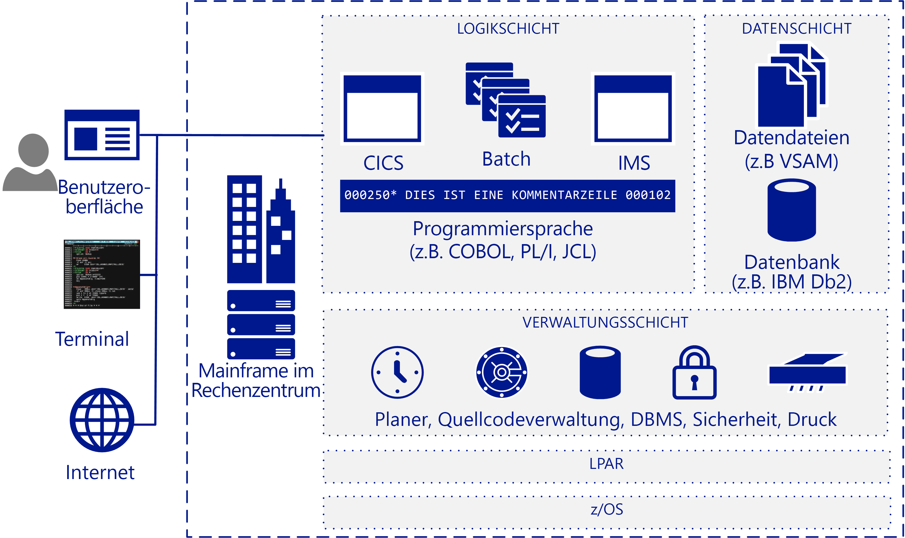

# Übersicht zur MainframemigrationMainframe migration overview

Viele Unternehmen und Organisationen profitieren davon, einige oder alle ihrer Mainframeworkloads, -anwendungen und -datenbanken in die Cloud zu verschieben.Many companies and organizations benefit from moving some or all their mainframe workloads, applications, and databases to the cloud. Azure bietet mainframeähnliche Funktionen im Cloudmaßstab ohne viele der mit Mainframes assoziierten Nachteile.Azure provides mainframe-like features at cloud scale without many of the drawbacks associated with mainframes.

Der Begriff „Mainframe“ bezieht sich im Allgemeinen auf ein Großrechnersystem, der Großteil der derzeit eingesetzten Mainframes sind jedoch IBM System Z-Server oder IBM-Plug-kompatible Systeme unter MVS, DOS, VSE, OS/390 oder z/OS.The term mainframe generally refers to a large computer system, but the vast majority currently of mainframes deployed are IBM System Z servers or IBM plug-compatible systems running MVS, DOS, VSE, OS/390, or z/OS. Mainframesysteme werden weiterhin in zahlreichen Branchen verwendet, um wichtige Informationssysteme auszuführen, und sie haben einen Platz in hochspezifischen Szenarien, z.B. in transaktionsintensiven großen IT-Umgebungen mit hohem Datenvolumen.Mainframe systems continue to be used in many industries to run vital information systems, and they have a place in highly-specific scenarios, such as large, high-volume, transaction intensive IT environments.

Mit der Migration in die Cloud können Unternehmen ihre Infrastruktur modernisieren.Migrating to the cloud enables companies to modernize their infrastructure. Mit Clouddiensten können Sie Mainframeanwendungen, und den Wert, den sie bieten, als Workload verfügbar machen, wenn Ihre Organisation sie benötigt.With cloud services you can make mainframe applications, and the value that they provide, available as a workload whenever your organization needs it. Viele Workloads können mit nur geringfügigen Änderungen am Code, z.B. Aktualisieren der Namen der Datenbanken, in Azure übertragen werden.Many workloads can be transferred to Azure with only minor code changes, such as updating the names of databases. Sie können komplexere Workloads in Phasen migrieren.You can migrate more complex workloads using a phased approach.

Die meisten Fortune 500-Unternehmen setzen Azure bereits für ihre kritischen Workloads ein.Most Fortune 500 companies are already running Azure for their critical workloads. Die erheblichen Grundkostenanreize von Azure motivieren viele Migrationsprojekte.Azure's significant bottom-line incentives motivate many migration projects. Unternehmen verschieben in der Regel die Entwicklungs- und Testworkloads zuerst in Azure, gefolgt von DevOps, E-Mail und Notfallwiederherstellung als Dienst.Companies typically move development and test workloads to Azure first, followed by DevOps, email, and disaster recovery as a service.

## ZielpublikumIntended audience

Wenn Sie eine Migration oder das Hinzufügen von Clouddiensten als Option für Ihre IT-Umgebung in Betracht ziehen, ist dieses Handbuch für Sie richtig.If you’re considering a migration or the addition of cloud services as an option for your IT environment, this guide is for you.

Diese Anleitung hilft IT-Organisationen, die Konversation über die Migration zu beginnen.This guidance helps IT organizations start the migration conversation. Da Sie mit Azure und cloudbasierten Infrastrukturen vielleicht besser vertraut sind als mit Mainframes, beginnt dieses Handbuch mit einem Überblick zur Funktionsweise von Mainframes und fährt mit verschiedenen Strategien fort, zu bestimmen, was und wie migriert werden sollte.You may be more familiar with Azure and cloud-based infrastructures than you are with mainframes, so this guide starts with an overview of how mainframes work, and continues with various strategies for determining what and how to migrate.

## MainframearchitekturMainframe architecture

In den späten 1950er-Jahren wurden Mainframes als zentral hochskalierte Server zur Ausführung umfangreicher Onlinetransaktionen und zur Batchverarbeitung konzipiert.In the late 1950s, mainframes were designed as scale-up servers to run high-volume online transactions and batch processing. Aus diesem Grund verfügen Mainframes über Software für Onlinetransaktionsformulare (manchmal als grüne Bildschirme bezeichnet) und Hochleistungs-E/A-Systeme für die Verarbeitung von Batchausführungen.Because of this, mainframes have software for online transaction forms (sometimes called green screens) and high-performance I/O systems for processing batch runs.

Mainframes haben den Ruf hoher Zuverlässigkeit und Verfügbarkeit und sind bekannt für ihre Fähigkeit zum Ausführen großer Onlinetransaktionen und Batchaufträge.Mainframes have a reputation for high reliability and availability, and are known for their ability to run huge online transactions and batch jobs. Eine Transaktion ergibt sich aus einem durch eine einzelne Anforderung initiierten Teil der Verarbeitung, in der Regel von einem Benutzer an einem Terminal.A transaction results from a piece of processing initiated by a single request, typically from a user at a terminal. Transaktionen können auch aus vielen anderen Quellen einschließlich Webseiten, Remotearbeitsstationen und Anwendungen von anderen Informationssystemen stammen.Transactions can also come from multiple other sources, including web pages, remote workstations, and applications from other information systems. Eine Transaktion kann auch automatisch zu einem vordefinierten Zeitpunkt ausgelöst werden, wie die folgende Abbildung zeigt.A transaction can also be triggered automatically at a predefined time as the following figure shows.

Eine typische IBM-Mainframearchitektur umfasst diese gemeinsamen Komponenten:A typical IBM mainframe architecture includes these common components:

- **Front-End-Systeme:** Benutzer können Transaktionen von Terminals, Webseiten oder Remotearbeitsstationen aus initiieren.**Front-end systems:** Users can initiate transactions from terminals, web pages, or remote workstations. Mainframeanwendungen verfügen häufig über benutzerdefinierte Benutzeroberflächen, die nach der Migration zu Azure beibehalten werden können.Mainframe applications often have custom user interfaces that can be preserved after migration to Azure. Terminalemulatoren werden immer noch zum Zugriff auf Mainframeanwendungen verwendet und auch als Terminals mit grünen Bildschirmen bezeichnet.Terminal emulators are still used to access mainframe applications, and are also called green-screen terminals.

- **Anwendungsschicht:** Mainframes enthalten in der Regel ein Kundeninformations-Steuersystem (Customer Information Control System, CICS), eine führende Transaktionsverwaltungssuite für IBM z/OS-Mainframes, die häufig mit dem IBM Information Management System (IMS), einem nachrichtenbasierten Transaktions-Manager, verwendet wird.**Application tier:** Mainframes typically include a customer information control system (CICS), a leading transaction management suite for the IBM z/OS mainframe that is often used with IBM Information Management System (IMS), a message-based transaction manager. Batchsysteme behandeln Datenupdates mit hohen Durchsätzen für große Mengen von Kontodatensätzen.Batch systems handle high-throughput data updates for large volumes of account records.

- **Code:** Zu den von Mainframes verwendeten Programmiersprachen zählen COBOL, Fortran, PL/I und Natural.**Code:** Programming languages used by mainframes include COBOL, Fortran, PL/I, and Natural. Job Control Language (JCL) wird zur Arbeit mit z/OS verwendet.Job control language (JCL) is used to work with z/OS.

- **Datenbankebene:** Ein allgemeines relationales Datenbank-Managementsystem (Database Management System, DBMS) für z/OS ist IBM DD2.**Database tier:** A common relational database management system (DBMS) for z/OS is IBM DD2. Es verwaltet als *dbspaces* bezeichnete Datenstrukturen, die eine oder mehrere Tabellen enthalten und Speicherpools von physischen Datasets namens *dbextents* zugewiesen sind.It manages data structures called *dbspaces* that contain one or more tables and are assigned to storage pools of physical data sets called *dbextents*. Zwei wichtige Datenbankkomponenten sind das Verzeichnis, das Datenspeicherorte in den Speicherpools identifiziert, und das Protokoll, das eine Aufzeichnung der an der Datenbank ausgeführten Vorgänge enthält.Two important database components are the directory that identifies data locations in the storage pools, and the log that contains a record of operations performed on the database. Verschiedene Flatfiledatenformate werden unterstützt.Various flat-file data formats are supported. DB2 für z/OS verwendet in der Regel VSAM-Datasets (Virtual Storage Access Method, Methode des virtuellen Speicherzugriffs) zum Speichern der Daten.DB2 for z/OS typically uses virtual storage access method (VSAM) datasets to store the data.

- **Verwaltungsschicht:** IBM-Mainframes enthalten Planungssoftware wie TWS-OPC, Tools für die Druck- und Ausgabeverwaltung wie CA-SAR und SPOOL sowie ein Quellcodeverwaltungssystem.**Management tier:** IBM mainframes include scheduling software such as TWS-OPC, tools for print and output management such as CA-SAR and SPOOL, and a source control system for code. Die sichere Zugriffssteuerung für z/OS wird von der Resource Access Control Facility (RACF) behandelt.Secure access control for z/OS is handled by resource access control facility (RACF). Ein Datenbank-Manager ermöglicht den Zugriff auf Daten in der Datenbank und wird in einer eigenen Partition in einer z/OS-Umgebung ausgeführt.A database manager provides access to data in the database and runs in its own partition in a z/OS environment.

- **LPAR:** Logische Partitionen oder LPARs werden verwendet, um Computeressourcen zu unterteilen.**LPAR:** Logical partitions, or LPARs, are used to divide compute resources. Ein Mainframe wird in mehrere LPARs partitioniert.A physical mainframe is partitioned into multiple LPARs.

- **z/OS:** Ein 64-Bit-Betriebssystem, das am häufigsten für IBM-Mainframes verwendet wird.**z/OS:** A 64-bit operating system that is most commonly used for IBM mainframes.

IBM-Systeme verwenden eine Transaktionsüberwachung wie CICS, um alle Aspekte einer Geschäftstransaktion nachzuverfolgen und zu verwalten.IBM systems use a transaction monitor such as CICS to track and manage all aspects of a business transaction. CICS verwaltet die gemeinsame Nutzung von Ressourcen, die Integrität von Daten und die Priorisierung der Ausführung.CICS manages the sharing of resources, the integrity of data, and prioritization of execution. CICS autorisiert Benutzer, weist Ressourcen zu und übergibt Datenbankanforderungen mittels der Anwendung an einen Datenbank-Manager, z.B. IBM DB2.CICS authorizes users, allocates resources, and passes database requests by the application to a database manager, such as IBM DB2.

Für eine genauere Optimierung wird CICS häufig mit IMS/TM (früher IMS/Data Communications oder IMS/DC) verwendet.For more precise tuning, CICS is commonly used with IMS/TM (formerly IMS/Data Communications or IMS/DC). IMS wurde entwickelt, um die Datenredundanz zu verringern, indem nur eine einzige Kopie der Daten beibehalten wird.IMS was designed to reduce data redundancy by maintaining a single copy of the data. Es ergänzt CICS als Transaktionsüberwachung, indem der Status während des Prozesses beibehalten wird und Geschäftsfunktionen in einem Datenspeicher aufgezeichnet werden.It complements CICS as a transaction monitor by maintaining state throughout the process and recording business functions in a data store.

## MainframevorgängeMainframe operations

Folgende Mainframevorgänge sind typisch:The following are typical mainframe operations:

- **Online:** Zu den Workloads zählen Transaktionsverarbeitung, Datenbankverwaltung und Verbindungen.**Online:** Workloads include transaction processing, database management, and connections. Sie werden häufig mithilfe von IBM DB2-, CICS- und z/OS-Connectors implementiert.They are often implemented using IBM DB2, CICS, and z/OS connectors.

- **Batch:** Aufträge werden ohne Eingreifen des Benutzers ausgeführt, in der Regel nach einem regelmäßigen Zeitplan, z.B. morgens an jedem Werktag.**Batch:** Jobs run without user interaction, typically on a regular schedule such as every weekday morning. Batchaufträge können mit einem JCL-Emulator wie Micro Focus Enterprise Server oder BMC Control-M-Software auf Systemen ausgeführt werden, die auf Windows oder Linux basieren.Batch jobs can be run on systems based on Windows or Linux by using a JCL emulator such as Micro Focus Enterprise Server or BMC Control-M software.

- **Job Control Language (JCL):** Geben Sie die erforderlichen Ressourcen zum Verarbeiten von Batchaufträgen an.**Job control language (JCL):** Specify resources needed to process batch jobs. JCL überträgt diese Informationen über eine Reihe von Auftragssteuerungsanweisungen auf z/OS.JCL conveys this information to z/OS through a set of job control statements. Grundlegendes JCL enthält sechs Typen von Anweisungen: JOB, ASSGN, DLBL, EXTENT, LIBDEF und EXEC.Basic JCL contains six types of statements: JOB, ASSGN, DLBL, EXTENT, LIBDEF, and EXEC. Ein Auftrag kann mehrere EXEC-Anweisungen (Schritte) enthalten, und jeder Schritt kann mehrere LIBDEF-, ASSGN-, DLBL- und EXTENT-Anweisungen aufweisen.A job can contain several EXEC statements (steps), and each step could have several LIBDEF, ASSGN, DLBL, and EXTENT statements.

- **Initial Program Load (IPL):**  Bezieht sich auf das Laden einer Kopie des Betriebssystems von einem Datenträger in den tatsächlichen Speicher eines Prozessors und ihre Ausführung.**Initial program load (IPL):**  Refers to loading a copy of the operating system from disk into a processor’s real storage and running it. IPLs dienen zur Wiederherstellung nach Downtime.IPLs are used to recover from downtime. Ein IPL entspricht dem Starten des Betriebssystems auf Windows- oder Linux-VMs.An IPL is like booting the operating system on Windows or Linux VMs.

## Nächste SchritteNext steps

> [!div class="nextstepaction"]
> [Mythen und FaktenMyths and facts](myths-and-facts.md)
