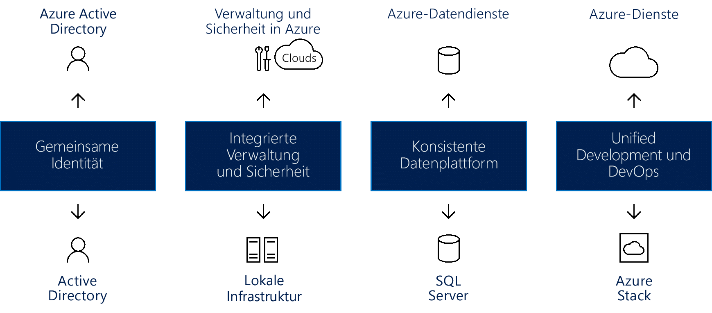

# Schaffen von Hybrid Cloud-KonsistenzCreate hybrid cloud consistency

Dieser Artikel führt Sie durch allgemeine Ansätze zum Schaffen von Hybrid Cloud-Konsistenz.This article guides you through the high level approaches for creating hybrid cloud consistency.

Hybridbereitstellungsmodelle können während der Migration das Risiko minimieren und zu einem problemlosen Übergang der Infrastruktur beitragen.Hybrid deployment models during migration can reduce risk and contribute to a smooth infrastructure transition. Cloudplattformen bieten das höchste verfügbare Maß an Flexibilität bei Geschäftsprozessen.Cloud platforms offer the greatest level of flexibility when it comes to business processes. Viele Organisationen zögern beim Umstieg auf die Cloud und bevorzugen stattdessen, die vollständige Kontrolle über die meisten vertraulichen Daten zu behalten.Many organizations are hesitant to make the move to the cloud, preferring instead to keep full control over the most sensitive data. Leider bieten lokale Server nicht die gleichen Innovationen wie die Cloud.Unfortunately, on-premises servers don’t allow for the same rate of innovation as the cloud. Mit einer Hybrid Cloud-Lösung sichern Sie sich das Beste aus beiden Welten: Die Geschwindigkeit von Cloudinnovationen UND den Komfort einer lokalen Verwaltung.A hybrid cloud solution allows you the best of both worlds: The speed of cloud innovation AND the comfort of on-premises management.

## Integrieren von Hybrid Cloud-KonsistenzIntegrate hybrid cloud consistency

Durch die Verwendung einer Hybrid Cloud-Lösung können Unternehmen Rechenressourcen skalieren.Using a hybrid cloud solution allows organizations to scale computing resources. Außerdem ist damit weniger Kapitalaufwand erforderlich, um kurzfristige Spitzen im Bedarf zu kompensieren.It also eliminates the need to make massive capital expenditures to handle short-term spikes in demand. Wenn veränderte Geschäftsbedingungen die Freigabe lokaler Ressourcen für vertraulichere Daten oder Anwendungen erfordern, ist es einfacher, schneller und günstiger, die Bereitstellung von Cloudressourcen aufzuheben.When changes to your business drive the need to free up local resources for more sensitive data or applications, it is easier, faster, and less expensive to deprovision cloud resources. Sie bezahlen nur für die Ressourcen, die Ihre Organisation vorübergehend nutzt, und müssen keine zusätzlichen Ressourcen erwerben und verwalten.You pay only for those resources your organization temporarily uses, instead of having to purchase and maintain additional resources. Dies reduziert die Menge der Geräte, die über einen längeren Zeitraum ungenutzt bleiben könnten.This reduces the amount of equipment that might remain idle over long periods of time. Hybrid Cloud-Computing ist eine Plattform, die das Beste der verschiedenen Typen in sich vereint: Sie verbindet die Vorzüge des Cloud Computings (Flexibilität, Skalierbarkeit und Kosteneffizienz) mit dem geringstmöglichen Offenlegungsrisiko für die Daten.Hybrid cloud computing is a "best of all possible worlds" platform, delivering all the benefits of cloud computing flexibility, scalability, and cost efficiencies; all with the lowest possible risk of data exposure.

*Abbildung 1. Schaffen von Hybrid Cloud-Konsistenz für Identitäten, Verwaltung, Sicherheit, Daten, Entwicklung und DevOps*
*Figure 1. Creating hybrid cloud consistency across identity, management, security, data, development, and DevOps*

Eine echte Hybrid Cloud-Lösung muss vier Komponenten bereitstellen, von denen jede entscheidende Vorteile bietet:A true hybrid cloud solution must provide four components, each of which brings significant benefits, including:

- Einheitliche Identitäten für lokale und cloudbasierte Anwendungen: Dies verbessert die Produktivität der Benutzer, da diese das einmalige Anmelden (SSO) für alle ihre Anwendungen nutzen können.Common identity for on-premises and cloud applications: This improves user productivity by giving users single sign-on (SSO) to all their applications. Zusätzlich wird Konsistenz gewährleistet, da Anwendungen und Benutzer die Grenzen von Netzwerk und Cloud überschreiten können.It also ensures consistency as applications and users cross network/cloud boundaries.
- Integrierte Verwaltung und Sicherheit in der Hybrid Cloud: Nutzen Sie einen zentralen Ort zum Überwachen, Verwalten und Schützen der Umgebung bei mehr Transparenz und Kontrolle.Integrated management and security across your hybrid cloud: This provides you with a cohesive way to monitor, manage, and secure the environment, enabling increased visibility and control.
- Eine einheitliche Datenplattform für das Rechenzentrum und die Cloud: Dies schafft Datenportabilität und sorgt für einen nahtlosen Zugriff auf lokale und cloudbasierte Datendienste und damit für umfassendere Einblicke in alle Datenquellen.A consistent data platform for the datacenter and the cloud: This creates data portability, combined with seamless access to on-premises and cloud data services for deep insight into all data sources.
- Konsistenz bei Entwicklung und DevOps in Cloud- und lokalen Rechenzentren: Dies ermöglicht es Ihnen, Anwendungen bei Bedarf zwischen den beiden Umgebungen zu verschieben, um so die Produktivität von Entwicklern zu verbessern, da für beide Orte jetzt die gleiche Entwicklungsumgebung verwendet wird.Unified development and DevOps across the cloud and on-premises datacenters: This allows you to move applications between the two environments as needed, improving developer productivity, as both places now have the same development environment.
  
Beispiele für diese Komponenten aus Sicht von Azure:Examples of these components from an Azure perspective include:

- Azure Active Directory (Azure AD) arbeitet mit dem lokalen Azure AD zusammen, um allen Benutzern eine einheitliche Identität bereitzustellen.Azure Active Directory (Azure AD), which works with on-premises Azure AD to provide common identity for all users. SSO für lokale und cloudbasierte Anwendungen macht es Benutzern einfach, sicher auf die Anwendungen und Ressourcen zuzugreifen, die sie benötigen.SSO across on-premises and via the cloud makes it simple for users to safely access the applications and assets they need. Administratoren können Sicherheit und Governance steuern, damit Benutzer Zugriff auf alle benötigten Elemente erhalten, und behalten gleichzeitig die Flexibilität, diese Berechtigungen ohne Auswirkungen auf die Benutzererfahrung anpassen zu können.Adminis can manage security and governance controls so that users can access what they need, with flexibility to adjust those permissions without affecting the user experience.
- Azure bietet integrierte Verwaltungs- und Sicherheitsdienste für die Cloud- und die lokale Infrastruktur. Dazu gehört auch ein integrierter Satz von Tools zum Überwachen, Konfigurieren und Schützen von Hybrid Clouds.Azure provides integrated management and security services for both cloud and on-premises infrastructure that include an integrated set of tools for monitoring, configuring, and protecting hybrid clouds. Dieser umfassende Ansatz bei der Verwaltung hilft insbesondere bei realen Problemen, denen Organisationen gegenüber stehen, die eine Hybrid Cloud-Lösung in Betracht ziehen.This end-to-end approach to management specifically addresses real-world challenges facing organizations considering a hybrid cloud solution.
- Azure Hybrid Cloud stellt Tools bereit, die einen sicheren, nahtlosen und effizienten Zugriff auf sämtliche Daten gewährleisten.Azure hybrid cloud provides common tools that ensure secure access to all data, seamlessly and efficiently. Azure-Datendienste sorgen in Kombination mit Microsoft SQL Server für eine konsistente Datenplattform.Azure data services combine with Microsoft SQL Server to create a consistent data platform. Über ein konsistentes Hybrid Cloud-Modell können Benutzer mit betrieblichen und Analysedaten arbeiten, wobei sowohl lokal als auch in der Cloud dieselben Dienste für Datawarehousing, Datenanalyse und Datenvisualisierung bereitstehen.A consistent hybrid cloud model allows users to work with both operational and analytical data, providing the same services on-premises and in the cloud for data warehousing, data analysis, and data visualization.
- Microsoft Azure-Clouddienste und ein lokaler Microsoft Azure Stack ermöglichen einheitliche Vorgehensweisen bei Entwicklung und DevOps.Microsoft Azure cloud services, combined with Microsoft Azure Stack on-premises, provide unified development and DevOps. Konsistenz in der Cloud und lokal vor Ort bedeutet, dass Ihr DevOps-Team Anwendungen erstellen kann, die in beiden Umgebungen ausgeführt und problemlos am richtigen Standort bereitgestellt werden können.Consistency across the cloud and on-premises means that your DevOps team can build applications that run in either environment, and can easily deploy to the right location. Sie können Vorlagen auch in der Hybridlösung wiederverwenden und so DevOps-Prozesse noch weiter vereinfachen.You can reuse templates across the hybrid solution as well, which can further simplify DevOps processes.

## Azure Stack in einer Hybrid Cloud-UmgebungAzure Stack in a hybrid cloud environment

Microsoft Azure Stack ist eine Hybrid Cloud-Lösung, mit der Organisationen mit Azure konsistente Dienste in ihren Rechenzentren ausführen können. Die Lösung bietet einfach zu nutzende Funktionen für Entwicklung, Verwaltung und Sicherheit, die mit Azure-Diensten in der Public Cloud konsistent sind.Microsoft Azure Stack is a hybrid cloud solution that allows organizations to run Azure-consistent services in their datacenter, providing a simplified development, management, and security experience that is consistent with Azure public cloud services. Azure Stack stellt eine Erweiterung von Azure dar, die Ihnen das Ausführen von Azure-Diensten aus Ihren lokalen Umgebungen ermöglicht. Sie können dann entscheiden, ob und wann Sie den Schritt in die Azure-Cloud wagen.Azure Stack is an extension of Azure, enabling you to run Azure services from your on-premises environments and then move to the Azure cloud if and when required.

Mit Azure Stack können Sie IaaS und PaaS bereitstellen und betreiben und dafür die gleichen Tools und Umgebungen nutzen wie in der öffentlichen Azure-Cloud.Azure Stack allows you to deploy and operate both IaaS and PaaS using the same tools and offering the same experience as the Azure public cloud. Für die Verwaltung von Azure Stack – über das Webportal oder mithilfe von PowerShell – steht IT-Administratoren und Endbenutzern mit Azure eine einheitliche Oberfläche zur Verfügung.Management of Azure Stack, whether through the web UI portal or through PowerShell, has a consistent look and feel for IT administrators and end users with Azure.

Azure und Azure Stack machen ganz neue hybride Anwendungsfälle für Anwendungen für Kunden und für interne Branchenanwendungen möglich, einschließlich:Azure and Azure Stack unlock new hybrid use cases for both customer-facing and internal line-of-business applications, including:

- **Edgelösungen und nicht vernetzte Lösungen:****Edge and disconnected solutions**. Kunden können den Anforderungen im Hinblick auf Wartezeit und Konnektivität gerecht werden, indem sie Daten lokal in Azure Stack verarbeiten und dann zur weiteren Analyse in Azure aggregieren. Dazu verwenden sie in beiden Systemen eine gemeinsame Anwendungslogik.Customers can address latency and connectivity requirements by processing data locally in Azure Stack and then aggregating in Azure for further analytics, with common application logic across both. Für dieses Edgeszenario interessieren sich viele Kunden aus unterschiedlichen Kontexten, einschließlich Fertigungshallen, Kreuzfahrtschiffen und Bergbauminen.Many customers are interested in this edge scenario across different contexts, including factory floors, cruise ships, and mine shafts.
- **Cloudanwendungen, die verschiedene Bestimmungen erfüllen:****Cloud applications that meet various regulations**. Kunden können ihre Anwendungen in Azure entwickeln und dort bereitstellen. Dank vollständiger Flexibilität können sie dieselben Anwendungen mithilfe von Azure Stack in ihrer lokalen Umgebung bereitstellen, um gesetzliche oder richtlinienbasierte Anforderungen zu erfüllen – und dabei müssen sie keine einzige Codezeile ändern.Customers can develop and deploy applications in Azure, with full flexibility to deploy on-premises on Azure Stack to meet regulatory or policy requirements, with no code changes needed. Anwendungsbeispiele hierfür sind globale Überwachung, Finanzberichte, Devisenhandel, Onlinespiele und Spesenabrechnungen.Illustrative application examples include global audit, financial reporting, foreign exchange trading, online gaming, and expense reporting. Manchmal möchten Kunden je nach geschäftlichen oder technischen Anforderungen verschiedene Instanzen derselben Anwendung in Azure oder Azure Stack bereitstellen.Customers are sometimes looking to deploy different instances of the same application to Azure or Azure Stack, based on business and technical requirements. Während Azure die meisten Anforderungen erfüllt, ergänzt Azure Stack das Bereitstellungskonzept, falls erforderlich.While Azure meets most requirements, Azure Stack complements the deployment approach where needed.
- **Lokales Cloudanwendungsmodell:****Cloud application model on-premises**. Kunden können Azure-Webdienste, Container und serverlose und Microservicearchitekturen nutzen, um vorhandene Anwendungen zu aktualisieren oder zu erweitern oder um neue Anwendungen zu erstellen.Customers can use Azure web services, containers, serverless, and microservice architectures to update and extend existing applications or build new ones. Nutzen Sie konsistente DevOps-Prozesse in Azure (in der Cloud) sowie in Azure Stack (lokal).You can use consistent DevOps processes across Azure in the cloud and Azure Stack on-premises. Die Modernisierung von Anwendungen wird immer interessanter – und dies schließt auch unternehmenskritische Anwendungen ein.There is a growing interest in application modernization, including for core mission-critical applications.

Azure Stack wird in zwei Bereitstellungsoptionen angeboten:Azure Stack is offered via two deployment options:

- **Integrierte Azure Stack-Systeme:****Azure Stack integrated systems**. Integrierte Azure Stack-Systeme werden im Rahmen einer Partnerschaft zwischen Microsoft und Hardwarepartnern angeboten. Dadurch entsteht eine ausgewogene Lösung mit cloudbasierten Innovationen und komfortabler Verwaltung.Azure Stack integrated systems are offered through a partnership of Microsoft and hardware partners, creating a solution that provides cloud-paced innovation balanced with simplicity in management. Bei Azure Stack handelt es sich um ein integriertes System aus Hardware und Software. Somit bietet die Plattform genau das richtige Maß an Flexibilität und Kontrolle bei gleichzeitiger Bereitstellung von cloudbasierten Innovationen.Because Azure Stack is offered as an integrated system of hardware and software, you get the right amount of flexibility and control, while still adopting innovation from the cloud. Integrierte Azure Stack-Systeme haben eine Größe von 4 bis 12 Knoten, und der Support wird vom Hardwarepartner und von Microsoft gemeinsam bereitgestellt.Azure Stack integrated systems range in size from 4–12 nodes and are jointly supported by the hardware partner and Microsoft. Mit integrierten Azure Stack-Systemen ermöglichen Sie neue Szenarien für Ihre Produktionsworkloads.Use Azure Stack integrated systems to enable new scenarios for your production workloads.
- **Azure Stack Development Kit:****Azure Stack Development Kit**. Microsoft Azure Stack Development Kit ist eine Einzelknotenbereitstellung von Azure Stack, mit der Sie Azure Stack auswerten und näher kennenlernen können.Microsoft Azure Stack Development Kit is a single-node deployment of Azure Stack, which you can use to evaluate and learn about Azure Stack. Sie können das Kit auch für Entwicklungsarbeiten mit APIs und Tools verwenden, die mit Azure konsistent sind.You can also use the kit as a developer environment, where you can develop using APIs and tooling that are consistent with Azure. Azure Stack Development Kit ist nicht für die Verwendung als Produktionsumgebung konzipiert.Azure Stack Development Kit is not intended to be used as a production environment.

## Azure Stack-Ökosystem mit einer CloudAzure Stack One Cloud Ecosystem

Sie können Azure Stack-Initiativen beschleunigen, indem Sie das vollständige Azure-Ökosystem nutzen:You can speed up Azure Stack initiatives by using the complete Azure ecosystem:

- Azure stellt sicher, dass die meisten Anwendungen und Dienste, die für Azure zertifiziert sind, auch in Azure Stack funktionieren.Azure ensures that most applications and services certified for Azure will work on Azure Stack. Mehrere unabhängige Softwarehersteller (ISVs) – einschließlich Bitnami, Docker, Kemp Technologies, Pivotal Cloud Foundry, Red Hat Enterprise Linux und SUSE Linux – erweitern ihre Lösungen auf Azure Stack.Several ISVs &mdash; including Bitnami, Docker, Kemp Technologies, Pivotal Cloud Foundry, Red Hat Enterprise Linux, and SUSE Linux &mdash; are extending their solutions to Azure Stack.
- Sie können Azure Stack wahlweise als einen vollständig verwalteten Dienst bereitstellen und betreiben.You can opt to have Azure Stack delivered and operated as a fully managed service. Mehrere Partner – z.B. Tieto, Yourhosting, Revera, Pulsant und NTT – werden in Kürze Angebote für verwaltete Dienste in Azure und Azure Stack anbieten.Several partners &mdash; including Tieto, Yourhosting, Revera, Pulsant, and NTT &mdash; will have managed service offerings across Azure and Azure Stack shortly. Diese Partner haben bereits über das Cloud Solution Provider-Programm (Cloudanbieter) verwaltete Dienste für Azure angeboten und erweitern ihre Angebote jetzt auf Hybridlösungen.These partners have been delivering managed services for Azure via the Cloud Solution Provider (Cloud Providers) program and are now extending their offerings to include hybrid solutions.
- Avanade stellt ein Beispiel für eine umfassende, vollständig verwaltete Hybrid Cloud-Lösung dar. Es handelt sich um ein All-in-One-Angebot, das Dienste für Cloudtransformation, Software, Infrastruktur, Einrichtung und Konfiguration ebenso enthält wie fortlaufend verwaltete Dienste, sodass Kunden Azure Stack heute schon genauso wie Azure nutzen können.As an example of a complete, fully managed hybrid cloud solution, Avanade is delivering an all-in-one offer that includes cloud transformation services, software, infrastructure, setup and configuration, and ongoing managed services so customers can consume Azure Stack just as they do with Azure today.
- Systemintegratoren (SI) können dazu beitragen, Modernisierungsinitiativen für Anwendungen zu beschleunigen, indem sie für die Kunden End-to-End-Lösungen mit Azure erstellen.Systems Integrators (SI) can help accelerate application modernization initiatives by building end-to-end Azure solutions for customers. Sie verfügen über umfassende Kenntnisse mit Azure – theoretisch wie praktisch – und kennen sich mit den Abläufen aus (z.B. DevOps).They bring in-depth Azure skill sets, domain and industry knowledge, and process expertise (e.g., DevOps). Jede Azure Stack-Cloud bietet einem SI die Möglichkeit, die Lösung zu entwerfen, die Systembereitstellung anzuleiten und zu beeinflussen, die enthaltenen Funktionen anzupassen und Betriebsaktivitäten umzusetzen.Every Azure Stack cloud is an opportunity for an SI to design the solution, lead and influence system deployment, customize the included capabilities, and deliver operational activities. Dies schließt SIs wie Avanade, DXC, Dell EMC Services, InFront Consulting Group, HPE Pointnext und Pricewaterhouse Coopers (PwC) ein.This includes SIs like Avanade, DXC, Dell EMC Services, InFront Consulting Group, HPE Pointnext, and Pricewaterhouse Coopers (PwC).
