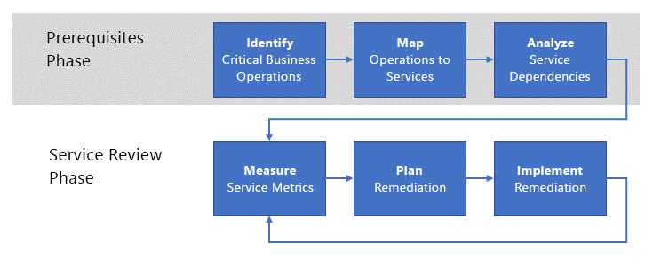

# Einrichten einer Überprüfung der Einsatztauglichkeit

Wenn Ihr Unternehmen beginnt, Workloads in Azure auszuführen, ist der nächste Schritt die Einrichtung einer **Überprüfung der Einsatztauglichkeit**, um die **nicht funktionalen** Anforderungen für diese Workloads aufzuzählen, zu implementieren und iterativ zu überprüfen. _Nicht funktionale_ Anforderungen beziehen sich auf das erwartete betriebliche Verhalten des Diensts. Es gibt fünf wesentliche Kategorien von nicht-funktionalen Anforderungen, die als [Säulen der Softwarequalität](../../guide/pillars.md) bezeichnet werden: Skalierbarkeit, Verfügbarkeit, Resilienz (einschließlich Business Continuity und Notfallwiederherstellung), Verwaltung und Sicherheit. Der Zweck einer Überprüfung der Einsatztauglichkeit ist es, sicherzustellen, dass Ihre unternehmenskritischen Workloads den Erwartungen Ihres Unternehmens in Bezug auf die Qualitätssäulen entsprechen.

Aus diesem Grund sollte Ihr Unternehmen diese Überprüfung durchführen, um die Probleme, die sich aus der Ausführung des Workloads in einer Produktionsumgebung ergeben, vollständig zu verstehen, festzustellen, wie die Probleme behoben werden können, und sie dann zu lösen. Dieser Artikel beschreibt eine allgemeine Überprüfung der Einsatztauglichkeit, die Ihr Unternehmen nutzen kann, um dieses Ziel zu erreichen.

## Einsatztauglichkeit bei Microsoft

Von Anfang an war die Entwicklung der Azure-Plattform ein kontinuierliches Entwicklungs- und Integrationsprojekt, das von vielen Teams bei Microsoft durchgeführt wurde. Es wäre sehr schwierig, Qualität und Konsistenz für ein Projekt von Azure's Größe und Komplexität zu gewährleisten, ohne einen robusten Prozess zur regelmäßigen Aufzählung und Implementierung der grundlegenden nicht-funktionalen Anforderungen.

Diese von Microsoft verfolgten Prozesse bilden die Grundlage für die in diesem Dokument beschriebenen Vorgänge.

## Grundlegendes zum Problem

Wie Sie in [Erste Schritte](../../cloud-adoption/getting-started/overview.md) gesehen haben, besteht der erste Schritt bei der digitalen Transformation eines Unternehmens darin, die zu lösenden Geschäftsprobleme durch die Einführung von Azure zu identifizieren. Der nächste Schritt besteht darin, eine allgemeine Lösung für das Problem zu finden, wie z.B. die Migration eines Workloads in die Cloud oder die Anpassung eines bestehenden lokalen Dienstes mit Cloudfunktionalität. Schließlich wird die Lösung entworfen und implementiert.

Während dieses Prozesses liegt der Schwerpunkt häufig auf den _Features_ des Diensts. Das heißt, es gibt eine Reihe von gewünschten _Funktionsanforderungen_, die der Dienst erfüllen muss. Ein Produktlieferdienst benötigt beispielsweise Funktionen zum Bestimmen des Quell- und Zielortes des Produkts, zur Verfolgung des Produkts während der Lieferung, zur Benachrichtigung von Kunden und dergleichen.

Im Gegensatz dazu beziehen sich die _nicht funktionalen_ Anforderungen auf Eigenschaften wie die [Verfügbarkeit](../../checklist/availability.md), [Resilienz](../../resiliency/index.md) und [Skalierbarkeit](../../checklist/scalability.md) des Dienstes. Diese Eigenschaften unterscheiden sich von den funktionalen Anforderungen, da sie die endgültige Funktion eines bestimmten Features im Dienst nicht direkt beeinflussen. Diese nicht-funktionalen Anforderungen beziehen sich jedoch auf die _Leistung_ und _Kontinuität_ des Dienstes.

Einige nicht-funktionale Anforderungen können in Form einer Vereinbarung zum Servicelevel (SLA) festgelegt werden. Im Hinblick auf die Dienstkontinuität kann beispielsweise eine Verfügbarkeitsanforderung für den Dienst als Prozentsatz ausgedrückt werden, z.B. **verfügbar 99,99 % der Zeit**. Andere nicht-funktionale Anforderungen können schwieriger zu definieren sein und sich mit zunehmendem Produktionsbedarf ändern. So könnte beispielsweise ein verbraucherorientierter Dienst nach einem Popularitätsschub mit unerwarteten Durchsatzanforderungen konfrontiert werden.

[HINWEIS] Die Definition der Anforderungen an die Resilienz, einschließlich Erläuterungen zu RPO, RTO, SLA und verwandten Konzepten, wird in [Entwerfen robuster Anwendungen für Azure](../../resiliency/index.md#define-your-availability-requirements) näher untersucht.

## Prozess der Überprüfung der Einsatztauglichkeit

Der Schlüssel zur Aufrechterhaltung der Leistung und Kontinuität der Dienste eines Unternehmens liegt in der Implementierung eines Prozesses für die _Überprüfung der Einsatztauglichkeit_.

Der Prozess besteht allgemein aus zwei Phasen. In der Phase der Voraussetzungen werden die Anforderungen ermittelt und unterstützenden Diensten zugeordnet. Dies geschieht seltener, vielleicht jährlich oder bei der Einführung neuer Abläufe. Die Ausgabe der Phase der Voraussetzungen wird in der Flussphase verwendet. Diese Phase tritt häufiger auf. Wir empfehlen, sie monatlich durchzuführen.

### Phase der Voraussetzungen

Die Schritte in dieser Phase sollen die notwendigen Voraussetzungen für eine regelmäßige Überprüfung der wichtigen Dienste schaffen.

- **Identifizieren unternehmenskritischer Geschäftsvorgänge**. Bestimmen Sie Ihre unternehmenskritischen Geschäftsvorgänge. Die Geschäftsvorgänge sind unabhängig von allen unterstützenden Dienstfunktionen. Mit anderen Worten, Geschäftsvorgänge stellen die tatsächlichen Aktivitäten dar, die das Unternehmen ausführen muss, und werden durch eine Reihe von IT-Diensten unterstützt. Der Begriff **unternehmenskritisch** (oder **geschäftskritisch**) gibt an, dass es zu schwerwiegenden Auswirkung für das Unternehmen kommen kann, wenn der Vorgang behindert wird. So kann beispielsweise ein Online-Händler einen Geschäftsvorgang wie „einem Kunden ermöglichen, einen Artikel in einen Warenkorb zu legen“ oder „eine Kreditkartenzahlung abwickeln“ haben. Wenn bei einem dieser beiden Vorgänge ein Fehler auftritt, wäre ein Kunde nicht in der Lage, die Transaktion abzuschließen und das Unternehmen könnte keinen Umsatz erzielen.

- **Zuordnen der Vorgänge zu Diensten**. Ordnen Sie diese Geschäftsvorgänge den Diensten zu, die sie unterstützen. Im obigen Beispiel des Einkaufswagens können mehrere Dienste beteiligt sein: ein Bestandsverwaltungsdienst, ein Einkaufswagendienst usw. Im obigen Beispiel für Kreditkartenzahlungen kann ein lokaler Zahlungsdienst mit einem externen Zahlungsabwicklungsdienst interagieren.

- **Analysieren der Dienstabhängigkeiten**. Die meisten Geschäftsvorgänge erfordern eine Orchestrierung zwischen mehreren unterstützenden Diensten. Es ist wichtig, die Abhängigkeiten zwischen den Diensten und dem Fluss unternehmenskritischer Transaktionen durch diese Dienste zu verstehen. Sie sollten auch die Abhängigkeiten zwischen lokalen Diensten und Azure-Diensten berücksichtigen. Im Beispiel des Einkaufswagens kann der Bestandsverwaltungsdienst vor Ort gehostet werden und Daten von Mitarbeitern aus einem physischen Lager erfassen, aber er kann Daten in einem Azure-Dienst wie [Azure Storage](/azure/storage/common/storage-introduction) oder einer Datenbank wie [Azur Cosmos DB](/azure/cosmos-db/introduction) speichern.

Eine Ausgabe aus diesen Aktivitäten ist ein Satz von **Scorecardmetriken** für Dienstvorgänge. Die Metriken werden nach nicht-funktionalen Kriterien wie Verfügbarkeit, Skalierbarkeit und Notfallwiederherstellung kategorisiert. Scorecardmetriken drücken die Kriterien aus, die der Dienst voraussichtlich operativ erfüllen wird. Diese Metriken können auf jeder Granularitätsstufe ausgedrückt werden, die für den Dienstvorgang geeignet ist.

Die Scorecard sollte in einfachen Worten ausgedrückt werden, um eine sinnvolle Diskussion zwischen den Business Owners und dem Engineering zu erleichtern. So könnte beispielsweise eine Scorecardmetrik für die Skalierbarkeit wie folgt ausgedrückt werden: _Grün_ für die Erfüllung der gewünschten Kriterien, _Gelb_ für die Nichterfüllung der gewünschten Kriterien, aber geplante Korrekturen werden aktiv implementiert, und _Rot_ für die Nichterfüllung der gewünschten Kriterien ohne Plan oder Maßnahme.

Es ist wichtig zu betonen, dass diese Metriken die Geschäftsanforderungen direkt widerspiegeln sollten.

### Phase der Dienstüberprüfung

Diese Phase ist der Kern des Prozesses der Überprüfung der Einsatztauglichkeit.

- **Messen der Dienstmetriken**. Die Dienste werden anhand der Scorecardmetriken überwacht, um sicherzustellen, dass sie den Geschäftserwartungen entsprechen. Dies bedeutet, dass die Dienstüberwachung eine wesentliche Rolle spielt. Wenn Sie eine Reihe von Diensten in Bezug auf die nicht-funktionalen Anforderungen nicht überwachen können, sollten die entsprechenden Scorecardmetriken als rot betrachtet werden. In diesem Fall ist der erste Schritt zur Korrektur die Implementierung einer entsprechenden Dienstüberwachung. Wenn das Unternehmen beispielsweise erwartet, dass ein Dienst mit einer Verfügbarkeit von 99,99 % arbeitet, aber keine Produktionstelemetrie zur Messung der Verfügbarkeit vorhanden ist, sollten Sie davon ausgehen, dass die Anforderung nicht erfüllen werden.

- **Planen der Korrekturmaßnahmen**. Bestimmen Sie für jeden Dienstvorgang mit Metriken, die unter einen akzeptablen Schwellenwert fallen, die Kosten für die Korrektur des Dienstes, um damit eine akzeptable Metrik zu erreichen. Wenn die Kosten für die Korrektur des Dienstes höher sind als die erwarteten Einnahmen aus dem Dienst, sollten Sie die immateriellen Kosten wie z.B. die Kundenzufriedenheit berücksichtigen. Wenn Kunden beispielsweise Schwierigkeiten haben, über den Dienst erfolgreich zu bestellen, könnten sie stattdessen einen Konkurrenten wählen.

- **Implementieren der Korrekturmaßnahmen**. Nachdem die Business Owners und das Engineering einen gemeinsamen Plan vereinbart haben, sollte dieser implementiert werden. Der Status der Implementierung sollte bei jeder Überprüfung der Scorecardmetriken gemeldet werden.

Dieser Prozess ist iterativ, und idealerweise sollte Ihr Unternehmen über ein Team verfügen, das sich eigenverantwortlich damit beschäftigt. Dieses Team sollte sich regelmäßig treffen, um bestehende Korrekturprojekte zu überprüfen, die grundlegende Überprüfung neuer Workloads einzuleiten und die gesamte Scorecard des Unternehmens nachzuverfolgen. Das Team sollte befugt sein, die Verantwortlichkeit für Korrekturteams sicherzustellen, die in Verzug sind oder Metriken nicht einhalten.

## Struktur des Teams für die Überprüfung der Einsatztauglichkeit

Das Team für die Überprüfung der Einsatztauglichkeit besteht aus den folgenden Rollen:

1. **Business Owner**. Diese Rolle liefert Informationen über das Unternehmen, um jeden „unternehmenskritischen“ Geschäftsvorgang zu identifizieren und zu priorisieren. Diese Rolle vergleicht auch die Minderungskosten mit den Auswirkungen auf das Unternehmen und trifft die endgültige Entscheidung zur Korrektur.

2. **Business Advocate**. Diese Rolle ist verantwortlich für die Aufteilung der Geschäftsvorgänge in einzelne Teile und die Zuordnung dieser Teile zu lokalen und Clouddiensten und Infrastrukturen. Die Rolle erfordert fundierte Kenntnisse zur Technologie, die mit jedem Geschäftsvorgang verbunden ist.

3. **Engineering Owner**. Diese Rolle ist für die Implementierung der mit dem Geschäftsbetrieb verbundenen Dienste verantwortlich. Diese Personen können zur Konzeption, Implementierung und Bereitstellung von Lösungen zum Beheben von Problemen bei nicht-funktionaler Anforderungen beitragen, die vom Team für die Überprüfung der Einsatztauglichkeit festgestellt wurden.

4. **Service Owner**. Diese Rolle ist für den Betrieb der Anwendungen und Dienste des Unternehmens zuständig. Diese Personen sammeln Protokollierungs- und Nutzungsdaten für diese Anwendungen und Dienste. Diese Daten werden sowohl zur Identifizierung von Problemen als auch zur Überprüfung von Korrekturen nach der Bereitstellung verwendet.

## Besprechungen bei der Überprüfung der Einsatztauglichkeit

Wir empfehlen, dass sich Ihr Team für die Überprüfung der Einsatztauglichkeit regelmäßig trifft. Beispielsweise könnte sich das Team monatlich treffen und den Status und die Metriken vierteljährlich an die Führungskräfte berichten.

Die Details des Prozesses und der Besprechung sollten an Ihre spezifischen Bedürfnisse angepasst werden. Wir empfehlen die folgenden Aufgaben als Ausgangspunkt:

1. Der Business Owner und der Business Advocate bestimmen mit Unterstützung der Engineering und Service Owners die nicht-funktionalen Anforderungen für jeden Geschäftsvorgang. Für zuvor identifizierte Geschäftsvorgänge wird die Priorität überprüft und verifiziert. Für neue Geschäftsvorgänge wird eine Priorität in der bestehenden Liste vergeben.

2. Die Engineering und Service Owner ordnen den **aktuellen Zustand** der Geschäftsvorgänge den entsprechenden lokalen und Clouddiensten zu. Die Zuordnung besteht aus einer Liste der Komponenten in jedem Dienst, die als Abhängigkeitsstruktur dargestellt sind. Sobald die Listen und die Abhängigkeitsstruktur erstellt sind, werden die **kritischen Pfade** anhand der Struktur bestimmt.

3. Die Engineering und Service Owners überprüfen den aktuellen Status der betrieblichen Protokollierung und Überwachung für die im vorherigen Schritt aufgeführten Dienste. Eine zuverlässige Protokollierung und Überwachung ist von entscheidender Bedeutung, um Dienstkomponenten zu identifizieren, die dazu beitragen, dass nicht-funktionale Anforderungen nicht erfüllt werden. Wenn es keine ausreichende Protokollierung und Überwachung gibt, muss ein Plan erstellt und implementiert werden, um sie umzusetzen.

4. Für neue Geschäftsvorgänge werden Scorecardmetriken erstellt. Die Scorecard besteht aus der Liste der Komponenten für jede in Schritt 2 identifizierte Dienste, die den nicht-funktionalen Anforderungen zugeordnet sind, und einer Metrik, die angibt, wie gut die Komponente die Anforderung erfüllt.

5. Für die Komponenten, die nicht den nicht-funktionalen Anforderungen entsprechen, wird eine allgemeine Lösung konzipiert und ein Engineering Owner zugewiesen. An dieser Stelle sollten der Business Owner und der Business Advocate ein Budget für die Korrekturmaßnahmen aufstellen, das auf den erwarteten Einnahmen des Geschäftsvorgangs basiert.

6. Schließlich erfolgt eine Überprüfung der laufenden Korrekturmaßnahmen. Jede der Scorecardmetriken für laufende Arbeiten wird mit den erwarteten Metriken verglichen. Für Komponenten, die Metriken erfüllen, legt der Service Owner Protokollierungs- und Überwachungsdaten vor, um zu bestätigen, dass die Metrik erfüllt ist. Für die Komponenten, die nicht den Metriken entsprechen, erläutert jeder Engineering Owner die Probleme, die das Erreichen von Metriken verhindern, und alle neuen Entwürfe für die Korrektur.

## Empfohlene Ressourcen

- [Säulen der Softwarequalität](../../guide/pillars.md).
    Dieser Abschnitt des Architekturleitfadens für Azure-Anwendungen beschreibt die fünf Säulen der Softwarequalität: Skalierbarkeit, Verfügbarkeit, Resilienz, Verwaltung und Sicherheit.
- [Zehn Entwurfsprinzipien für Azure-Anwendungen](../../guide/design-principles/index.md).
    Dieser Abschnitt des Architekturleitfadens für Azure-Anwendungen beschreibt eine Reihe von Entwurfsprinzipien, um Ihre Anwendung skalierbarer, belastbarer und verwaltbarer zu machen.
- [Entwerfen robuster Anwendungen für Azure](../../resiliency/index.md).
    In diesem Leitfaden werden der Begriff „Resilienz“ und die dazugehörigen Konzepte definiert. Anschließend wird der Prozess zur Erreichung von Resilienz beschrieben. Hierzu wird ein strukturierter Ansatz für die Lebensdauer einer Anwendung verwendet – vom Entwurf und der Implementierung über die Bereitstellung bis zum Betrieb.
- [Cloudentwurfsmuster](../../patterns/index.md).
    Diese Entwurfsmuster unterstützen Engineeringteams, wenn sie Anwendungen basierend auf den Säulen der Softwarequalität erstellen.
