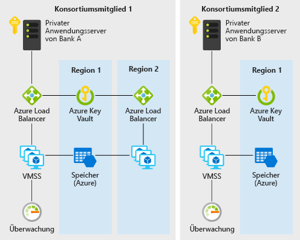

# Dezentralisierte Vertrauensstellung zwischen Banken in Azure

Dieses Beispielszenario ist hilfreich für Banken und andere Einrichtungen, die eine vertrauenswürdige Umgebung für die Informationsweitergabe einrichten möchten, ohne auf eine zentralisierte Datenbank zurückzugreifen. Das Szenario in diesem Beispiel wird zwar im Kontext der Verwaltung von Informationen zur Kreditwürdigkeit zwischen Banken beschrieben, die Architektur eignet sich jedoch für jedes Szenario, in dem eine Gruppe von Organisationen überprüfte Informationen untereinander austauschen möchte, ohne auf ein zentrales, von einem einzelnen Anbieter betriebenes System zurückgreifen zu müssen.

Die Banken innerhalb eines Finanzsystems beziehen Informationen zur Kreditwürdigkeit und Bonität einer Person traditionell aus zentralisierten Quellen (etwa von einer Wirtschaftsauskunftei). Ein zentralisierter Ansatz führt zu einer Konzentration des Betriebsrisikos sowie zu einer mitunter überflüssigen dritten Partei.

Mit DLTs (Distributed Ledger-Technologie) kann ein Bankenkonsortium ein dezentrales System aufbauen, das effizienter arbeitet, besser vor Angriffen geschützt ist und als neue Plattform fungiert, auf der innovative Strukturen implementiert werden können, um traditionelle Herausforderungen in den Bereichen Datenschutz, Geschwindigkeit und Kosten zu lösen.

In diesem Beispiel erfahren Sie, wie Azure-Dienste wie VM-Skalierungsgruppen, Virtual Network, Key Vault, Storage, Load Balancer und Monitor für die schnelle Bereitstellung einer effizienten privaten Ethereum-PoA-Blockchain bereitgestellt werden können, die es den teilnehmenden Banken ermöglicht, ihre eigenen Knoten zu erstellen.

## Relevante Anwendungsfälle

Zu den weiteren relevanten Anwendungsfällen zählen:

- Verschieben zugeteilter Budgets zwischen verschiedenen Unternehmenseinheiten eines multinationalen Konzerns
- Grenzüberschreitende Zahlungen
- Handelsfinanzierungsszenarien
- Treuesysteme mit verschiedenen Unternehmen
- Lieferkettensysteme

## Architecture

In diesem Szenario werden die Back-End-Komponenten behandelt, die erforderlich sind, um ein skalierbares, sicheres und überwachtes privates Blockchainnetzwerk für Unternehmen innerhalb eines Konsortiums mit mindestens zwei Mitgliedern zu erstellen. Über die Details der Bereitstellung dieser Komponenten (in verschiedenen Abonnements und Ressourcengruppen) sowie über die Konnektivitätsanforderungen (VPN oder ExpressRoute) können Sie auf der Grundlage der Richtlinienanforderungen Ihrer Organisation selbst entscheiden. Der Datenfluss gestaltet sich wie folgt:

1. Bank A erstellt/aktualisiert den Bonitätsdatensatz, indem sie per JSON-RPC eine Transaktion an das Blockchainnetzwerk sendet.
2. Daten fließen vom privaten Anwendungsserver von Bank A an den Azure Load Balancer und anschließend zur Überprüfung an einen virtuellen Knotencomputer der VM-Skalierungsgruppe.
3. Das Ethereum-PoA-Netzwerk erstellt zu einem vorgegebenen Zeitpunkt (in diesem Szenario: zwei Sekunden) einen Block.
4. Die Transaktion wird in dem erstellten Block gebündelt und über das Blockchainnetzwerk überprüft.
5. Bank B kann den von Bank A erstellten Bonitätsdatensatz lesen, indem sie auf ähnliche Weise über JSON-RPC mit ihrem eigenen Knoten kommuniziert.

### Komponenten

- VMs in VM-Skalierungsgruppen stellen bedarfsgerechte Computeressourcen zum Hosten der Validierungsprozesse für die Blockchain bereit.
- Key Vault wird als sicherer Speicher für die privaten Schlüssel der einzelnen Überprüfungen verwendet.
- Load Balancer verteilt die RPC-, Peering- und Governance-DApp-Anforderungen.
- Storage hostet persistente Netzwerkinformationen und koordiniert das Leasing.
- Operations Management Suite (eine Sammlung mehrerer Azure-Dienste) liefert Informationen zu verfügbaren Knoten, zu Transaktionen pro Minute und zu Konsortiumsmitgliedern.

### Alternativen

In diesem Beispiel wird der Ethereum-PoA-Ansatz verwendet, da er sich gut als Einstiegspunkt für ein Konsortium von Organisationen eignet, das eine vertrauenswürdige, dezentralisierte und transparente Umgebung erstellen möchte, in der die Mitglieder Informationen untereinander austauschen und gemeinsam nutzen können. Mit den verfügbaren Azure-Lösungsvorlagen kann ein Konsortiumsleiter schnell und bequem eine Ethereum-PoA-Blockchain starten. Darüber hinaus können die Mitgliedsorganisationen des Konsortiums ihre eigenen Azure-Ressourcen innerhalb ihrer eigenen Ressourcengruppe und ihres Abonnements starten, um einem vorhandenen Netzwerk beizutreten.

Bei erweiterten oder anderen Szenarien spielen möglicherweise Aspekte wie der Datenschutz bei Transaktionen eine Rolle. Ein Beispiel: In einem Szenario mit Wertpapierübertragung sollen die Transaktionen der jeweiligen Konsortiumsmitglieder möglicherweise nicht für die anderen Mitglieder sichtbar sein. Es gibt Alternativen zu Ethereum-PoA, die diese Probleme auf eigene Weise lösen:

- Corda
- Quorum
- Hyperledger

## Überlegungen

### Verfügbarkeit

[Azure Monitor][monitor] überwacht das Blockchainnetzwerk kontinuierlich auf Probleme, um die Verfügbarkeit zu gewährleisten. Nach erfolgreicher Bereitstellung der Blockchainlösungsvorlage aus diesem Szenario erhalten Sie einen Link zu einem benutzerdefinierten Azure Monitor-basierten Überwachungsdashboard. Das Dashboard zeigt Knoten, die in den letzten 30 Minuten Heartbeats gemeldet haben, sowie weitere hilfreiche Statistiken.

Weitere Verfügbarkeitsthemen finden Sie im Azure Architecture Center in der [Checkliste für die Verfügbarkeit][availability].

### Skalierbarkeit

Eine verbreitete Sorge bei Blockchains ist häufig die Anzahl von Transaktionen, die eine Blockchain in einem vordefinierten Zeitraum enthalten kann. In diesem Szenario wird Proof-of-Authority verwendet, um im Vergleich zu Proof-of-Work eine bessere Verwaltung der Skalierbarkeit zu ermöglichen. In Proof-of-Authority-basierten Netzwerken sind die Konsensteilnehmer bekannt und werden verwaltet. Dadurch eignen sie sich besser für private Blockchains eines Konsortiums von Organisationen, die sich untereinander kennen. Parameter wie durchschnittliche Blockzeit, Transaktionen pro Minute und Auslastung von Computeressourcen lassen sich komfortabel über das benutzerdefinierte Dashboard überwachen. Ressourcen können dann auf der Grundlage der Skalierungsanforderungen angepasst werden.

Allgemeine Informationen zur Entwicklung skalierbarer Lösungen finden Sie im Azure Architecture Center in der [Checkliste für die Skalierbarkeit][scalability].

### Sicherheit

[Azure Key Vault][vault] dient zum komfortablen Speichern und Verwalten der privaten Schlüssel von Überprüfungen. Die Standardbereitstellung in diesem Beispiel erstellt ein Blockchainnetzwerk, auf das über das Internet zugegriffen werden kann. In einem Produktionsszenario, in dem ein privates Netzwerk benötigt wird, können die Mitglieder über VNET-zu-VNET-VPN-Gatewayverbindungen miteinander verbunden werden. Die Schritte zum Konfigurieren eines VPN finden Sie weiter unten im Abschnitt mit den zugehörigen Ressourcen.

Allgemeine Informationen zur Entwicklung sicherer Lösungen finden Sie in der [Dokumentation zur Azure-Sicherheit][security].

### Resilienz

Die Ethereum-PoA-Blockchain bietet selbst ein gewisses Maß an Resilienz, da die Überprüfungsknoten in unterschiedlichen Regionen bereitgestellt werden können. In Azure stehen Optionen für Bereitstellungen in mehr als 54 Regionen auf der ganzen Welt bereit. Eine Blockchain wie in diesem Szenario bietet einzigartige und innovative Möglichkeiten der Zusammenarbeit, um die Resilienz zu erhöhen. Die Resilienz des Netzwerks wird nicht nur durch eine einzelne zentrale Partei gewährleistet, sondern durch alle Mitglieder des Konsortiums. Bei einer Proof-of-Authority-basierten Blockchain ist die Netzwerkresilienz noch besser planbar.

Allgemeine Informationen zur Entwicklung robuster Lösungen finden Sie unter [Entwerfen robuster Anwendungen für Azure][resiliency].

## Preise

Zur Ermittlung der Betriebskosten für dieses Szenario sind alle Dienste im Kostenrechner vorkonfiguriert. Wenn Sie wissen möchten, welche Kosten für Ihren spezifischen Anwendungsfall entstehen, passen Sie die entsprechenden Variablen an Ihre voraussichtlichen Leistungs- und Verfügbarkeitsanforderungen an.

Wir haben basierend auf der Anzahl von VM-Instanzen, über die Ihre Anwendungen ausgeführt werden, drei Beispielkostenprofile bereitgestellt. (Die Instanzen können sich in unterschiedlichen Regionen befinden.)

- [Klein:][small-pricing] Dieses Preisbeispiel umfasst zwei virtuelle Computer pro Monat ohne Überwachung.
- [Mittel:][medium-pricing] Dieses Preisbeispiel umfasst sieben virtuelle Computer pro Monat mit aktivierter Überwachung.
- [Groß:][large-pricing] Dieses Preisbeispiel umfasst 15 virtuelle Computer pro Monat mit aktivierter Überwachung.

Die oben aufgeführten Preise gelten für ein einzelnes Konsortiumsmitglied, das ein Blockchainnetzwerk startet oder einem solchen Netzwerk beitritt. In einem Konsortium mit mehreren Unternehmen oder Organisationen erhält für gewöhnlich jedes Mitglied ein eigenes Azure-Abonnement.

## Nächste Schritte

Wenn Sie sich ein Beispiel für dieses Szenario ansehen möchten, stellen Sie die [Demoanwendung für die Ethereum-PoA-Blockchain][deploy] in Azure bereit. Lesen Sie anschließend die [Infodatei des Quellcodes für das Szenario][source].

## Zugehörige Ressourcen

Weitere Informationen zur Verwendung der Ethereum-Proof-of-Authority-Lösungsvorlage für Azure finden Sie in [diesem Benutzerhandbuch][guide].

<!-- links -->
[small-pricing]: https://azure.com/e/4e429d721eb54adc9a1558fae3e67990
[medium-pricing]: https://azure.com/e/bb42cd77437744be8ed7064403bfe2ef
[large-pricing]: https://azure.com/e/e205b443de3e4adfadf4e09ffee30c56
[guide]: /azure/blockchain-workbench/ethereum-poa-deployment
[deploy]: https://portal.azure.com/?pub_source=email&pub_status=success#create/microsoft-azure-blockchain.azure-blockchain-ethereumethereum-poa-consortium
[source]: https://github.com/vitoc/creditscoreblockchain
[monitor]: /azure/monitoring-and-diagnostics/monitoring-overview-azure-monitor
[availability]: /azure/architecture/checklist/availability
[scalability]: /azure/architecture/checklist/scalability
[resiliency]: ../../resiliency/index.md
[security]: /azure/security/
[vault]: https://azure.microsoft.com/services/key-vault/
