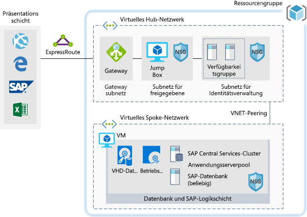

# SAP für Dev/Test-WorkloadsSAP for dev/test workloads

Dieses Beispiel enthält eine Anleitung für die Durchführung einer Dev/Test-Implementierung von SAP NetWeaver in einer Windows- oder Linux-Umgebung in Azure.This example provides guidance for how to run a dev/test implementation of SAP NetWeaver in a Windows or Linux environment on Azure. Als Datenbank wird AnyDB verwendet. Dies ist der SAP-Begriff für alle unterstützten Datenbank-Managementsysteme, bei denen es sich nicht um SAP HANA handelt.The database used is AnyDB, the SAP term for any supported DBMS (that isn't SAP HANA). Da diese Architektur nicht für Produktionsumgebungen ausgelegt ist, sondern nur für andere Umgebungen, wird sie mit nur einem virtuellen Computer (VM) bereitgestellt. Die Größe kann geändert werden, um die jeweiligen Anforderungen Ihrer Organisation zu erfüllen.Because this architecture is designed for non-production environments, it's deployed with just a single virtual machine (VM) and it's size can be changed to accommodate your organization's needs.

Sehen Sie sich für Anwendungsfälle für die Produktion die hier angegebenen SAP-Referenzarchitekturen an:For production use cases review the SAP reference architectures available below:

* [SAP NetWeaver für AnyDB][sap-netweaver][SAP netweaver for AnyDB][sap-netweaver]
* [SAP S/4Hana][sap-hana][SAP S/4Hana][sap-hana]
* [SAP in Azure (große Instanzen)][sap-large][SAP on Azure large instances][sap-large]

## Verwandte AnwendungsfälleRelated use cases

Erwägen Sie dieses Szenario für folgende Anwendungsfälle:Consider this scenario for the following use cases:

* Nicht kritische SAP-Workloads, die nicht für die Produktion bestimmt sind (Sandbox, Entwicklung, Test, Qualitätssicherung)Non-critical SAP non-productive workloads (sandbox, development, test, quality assurance)
* Nicht kritische SAP Business One-WorkloadsNon-critical SAP business one workloads

## ArchitekturArchitecture

Mit diesem Szenario wird die Bereitstellung einer einzelnen SAP-Systemdatenbank und eines SAP-Anwendungsservers auf einem einzelnen virtuellen Computer behandelt. Die Daten durchlaufen das Szenario wie folgt:This scenario covers the provision of a single SAP system database and SAP application Server on a single virtual machine, the data flows through the scenario as follows:

1. Kunden auf der Präsentationsebene verwenden ihre SAP-GUI oder andere Benutzeroberflächen (Internet Explorer, Excel oder eine andere Webanwendung) lokal, um auf das Azure-basierte SAP-System zuzugreifen.Customers from the Presentation Tier use their SAP gui, or other user interfaces (Internet Explorer, Excel or other web application) on premise to access the Azure based SAP system.
2. Die Konnektivität wird über die eingerichtete ExpressRoute-Verbindung bereitgestellt.Connectivity is provided through the use of the established Express Route. Die Express Route-Verbindung endet in Azure auf dem ExpressRoute-Gateway.The Express Route is terminated in Azure at the Express Route Gateway. Netzwerkdatenverkehr wird über das ExpressRoute-Gateway an das Gatewaysubnetz und von dort an das Spoke-Subnetz auf der Anwendungsebene geleitet (siehe [Hub-Spoke][hub-spoke]-Muster). Anschließend fließt der Datenverkehr über ein Netzwerksicherheitsgateway an den virtuellen Computer der SAP-Anwendung.Network traffic routes through the Express Route gateway to the Gateway Subnet and from the gateway subnet to the Application Tier Spoke subnet (see the [hub-spoke][hub-spoke] pattern) and via a Network Security Gateway to the SAP application virtual machine.
3. Die Server für die Identitätsverwaltung stellen Authentifizierungsdienste bereit.The identity management servers provide authentication services.
4. Über die Jumpbox sind lokale Verwaltungsfunktionen verfügbar.The Jump Box provides local management capabilities.

### KomponentenComponents

* [Ressourcengruppen](/azure/azure-resource-manager/resource-group-overview#resource-groups) sind logische Container für Azure-Ressourcen.[Resource Groups](/azure/azure-resource-manager/resource-group-overview#resource-groups) is a logical container for Azure resources.
* [Virtuelle Netzwerke](/azure/virtual-network/virtual-networks-overview) sind die Grundlage für die Netzwerkkommunikation innerhalb von Azure.[Virtual Networks](/azure/virtual-network/virtual-networks-overview) is the basis of network communications within Azure
* Mit [Azure Virtual Machines](/azure/virtual-machines/windows/overview) wird eine auf Windows- oder Linux-Servern basierende sichere, virtualisierte On-Demand-Infrastruktur mit umfangreicher Skalierung bereitgestellt.[Virtual Machine](/azure/virtual-machines/windows/overview) Azure Virtual Machines provides on-demand, high-scale, secure, virtualized infrastructure using Windows or Linux Server
* Mit [ExpressRoute](/azure/expressroute/expressroute-introduction) können Sie Ihre lokalen Netzwerke über eine private Verbindung, die von einem Konnektivitätsanbieter bereitgestellt wird, auf die Microsoft Cloud ausdehnen.[Express Route](/azure/expressroute/expressroute-introduction) lets you extend your on-premises networks into the Microsoft cloud over a private connection facilitated by a connectivity provider.
* Mit [Netzwerksicherheitsgruppen](/azure/virtual-network/security-overview) können Sie den Netzwerkdatenverkehr auf Ressourcen in einem virtuellen Netzwerk beschränken.[Network Security Group](/azure/virtual-network/security-overview) lets you limit network traffic to resources in a virtual network. Eine Netzwerksicherheitsgruppe enthält eine Liste mit Sicherheitsregeln, die ein- oder ausgehenden Netzwerkdatenverkehr basierend auf IP-Adresse, Port und Protokoll (für die Quelle bzw. das Ziel) zulassen oder ablehnen.A network security group contains a list of security rules that allow or deny inbound or outbound network traffic based on source or destination IP address, port, and protocol. 

## ÜberlegungenConsiderations

### VerfügbarkeitAvailability

 Microsoft bietet eine Vereinbarung zum Servicelevel (Service Level Agreement, SLA) für einzelne VM-Instanzen an.Microsoft offers a service level agreement (SLA) for single VM instances. Weitere Informationen zur Vereinbarung zum Servicelevel von Microsoft Azure für Virtual Machines finden Sie unter [SLA für Virtual Machines](https://azure.microsoft.com/support/legal/sla/virtual-machines).For more information on Microsoft Azure Service Level Agreement for Virtual Machines [SLA For Virtual Machines](https://azure.microsoft.com/support/legal/sla/virtual-machines)

### SkalierbarkeitScalability

Allgemeine Informationen zur Entwicklung skalierbarer Lösungen finden Sie im Azure Architecture Center in der [Checkliste für die Skalierbarkeit][scalability].For general guidance on designing scalable solutions, see the [scalability checklist][scalability] in the Azure Architecture Center.

### SicherheitSecurity

Allgemeine Informationen zur Entwicklung sicherer Lösungen finden Sie in der [Dokumentation zur Azure-Sicherheit][security].For general guidance on designing secure solutions, see the [Azure Security Documentation][security].

### ResilienzResiliency

Allgemeine Informationen zur Entwicklung robuster Lösungen finden Sie unter [Entwerfen robuster Anwendungen für Azure][resiliency].For general guidance on designing resilient solutions, see [Designing resilient applications for Azure][resiliency].

## PreisePricing

Hier können Sie die Betriebskosten für dieses Szenario ermitteln. Alle Dienste sind im Kostenrechner vorkonfiguriert.Explore the cost of running this scenario, all of the services are pre-configured in the cost calculator.  Wenn Sie wissen möchten, welche Kosten für Ihren spezifischen Anwendungsfall entstehen, passen Sie die entsprechenden Variablen an Ihren voraussichtlichen Datenverkehr an.To see how the pricing would change for your particular use case change the appropriate variables to match your expected traffic.

Auf der Grundlage des zu erwartenden Datenverkehrsaufkommens haben wir vier exemplarische Kostenprofile erstellt:We have provided four sample cost profiles based on amount of traffic you expect to get:

|GrößeSize|SAPsSAPs|VM-TypVM Type|SpeicherStorage|Azure-PreisrechnerAzure Pricing Calculator|
|----|----|-------|-------|---------------|
|KleinSmall|8.0008000|D8s_v3D8s_v3|2 x P20, 1 x P102xP20, 1xP10|[KleinSmall](https://azure.com/e/9d26b9612da9466bb7a800eab56e71d1)|
|MittelMedium|1600016000|D16s_v3D16s_v3|3 x P20, 1 x P103xP20, 1xP10|[MittelMedium](https://azure.com/e/465bd07047d148baab032b2f461550cd)|
GroßLarge|3200032000|E32s_v3E32s_v3|3 x P20, 1 x P103xP20, 1xP10|[GroßLarge](https://azure.com/e/ada2e849d68b41c3839cc976000c6931)|
Sehr großExtra Large|6400064000|M64sM64s|4 x P20, 1 x P104xP20, 1xP10|[Sehr großExtra Large](https://azure.com/e/975fb58a965c4fbbb54c5c9179c61cef)|

Hinweis: Die Preise sollen als Anhaltspunkte gelten und geben nur die Kosten für VMs und Speicher an (ohne Gebühren für Netzwerk, Sicherungsspeicher und Datenein- und -ausgang).Note: pricing is a guide and only indicates the VMs and storage costs (excludes, networking, backup storage and data ingress/egress charges).

* [Klein](https://azure.com/e/9d26b9612da9466bb7a800eab56e71d1): Ein kleines System umfasst den VM-Typ D8s_v3 mit 8 vCPUs, 32 GB RAM und 200 GB temporärem Speicher sowie zusätzlich zwei Premium-Speicherdatenträgern mit 512 GB und einem mit 128 GB.[Small](https://azure.com/e/9d26b9612da9466bb7a800eab56e71d1): A small system consists of VM type D8s_v3 with 8x vCPUs, 32GB RAM and 200GB temp storage, additionally two 512GB and one 128GB premium storage disks.
* [Mittel](https://azure.com/e/465bd07047d148baab032b2f461550cd): Ein mittelgroßes System umfasst den VM-Typ D16s_v3 mit 16 vCPUs, 64 GB RAM und 400 GB temporärem Speicher sowie zusätzlich drei Premium-Speicherdatenträgern mit 512 GB und einem mit 128 GB.[Medium](https://azure.com/e/465bd07047d148baab032b2f461550cd): A medium system consists of VM type D16s_v3 with 16x vCPUs, 64GB RAM and 400GB temp storage, additionally three 512GB and one 128GB premium storage disks.
* [Groß](https://azure.com/e/ada2e849d68b41c3839cc976000c6931): Ein großes System umfasst den VM-Typ E32s_v3 mit 32 vCPUs, 256 GB RAM und 512 GB temporärem Speicher sowie zusätzlich drei Premium-Speicherdatenträgern mit 512 GB und einem mit 128 GB.[Large](https://azure.com/e/ada2e849d68b41c3839cc976000c6931): A large system consists of VM type E32s_v3 with 32x vCPUs, 256GB RAM and 512GB temp storage, additionally three 512GB and one 128GB premium storage disks.
* [Sehr groß](https://azure.com/e/975fb58a965c4fbbb54c5c9179c61cef): Ein sehr großes System umfasst den VM-Typ M64s mit 64 vCPUs, 1.024 GB RAM und 2.000 GB temporärem Speicher sowie zusätzlich vier Premium-Speicherdatenträgern mit 512 GB und einem mit 128 GB.[Extra Large](https://azure.com/e/975fb58a965c4fbbb54c5c9179c61cef): An extra large system consists of a VM type M64s with 64x vCPUs, 1024GB RAM and 2000GB temp storage, additionally four 512GB and one 128GB premium storage disks.

## BereitstellungDeployment

Verwenden Sie die Schaltfläche „Bereitstellen“, um die zugrunde liegende Infrastruktur ähnlich wie im obigen Szenario bereitzustellen.To deploy the underlying infrastructure similar to the scenario above, please use the deploy button

\* SAP wird nicht installiert. Sie müssen dies durchführen, nachdem die Infrastruktur manuell erstellt wurde.\* SAP will not be installed, you'll need to do this after the infrastructure is built manually.

<!-- links -->
[reference architecture]:  /azure/architecture/reference-architectures/sap
[resiliency]: /azure/architecture/resiliency/
[security]: /azure/security/
[scalability]: /azure/architecture/checklist/scalability
[sap-netweaver]: /azure/architecture/reference-architectures/sap/sap-netweaver
[sap-hana]: /azure/architecture/reference-architectures/sap/sap-s4hana
[sap-large]: /azure/architecture/reference-architectures/sap/hana-large-instances
[hub-spoke]: /azure/architecture/reference-architectures/hybrid-networking/hub-spoke