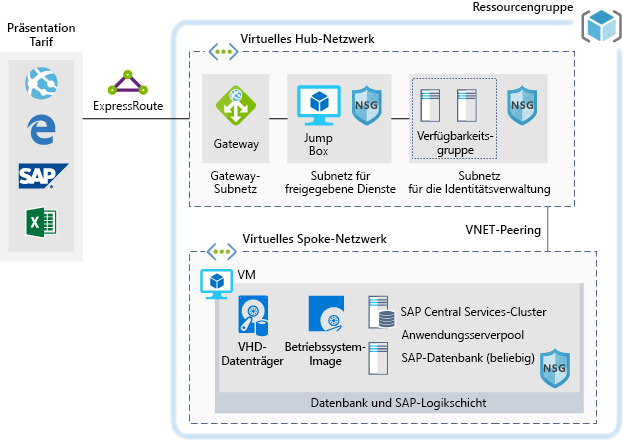

# Entwicklungs-/Testumgebungen für SAP-Workloads in Azure

Dieses Beispiel zeigt, wie Sie eine Entwicklungs-/Testumgebung für SAP NetWeaver in einer Windows- oder Linux-Umgebung in Azure einrichten. Als Datenbank wird AnyDB verwendet. Dies ist der SAP-Begriff für alle unterstützten Datenbank-Managementsysteme, bei denen es sich nicht um SAP HANA handelt. Da diese Architektur nicht für Produktionsumgebungen ausgelegt ist, sondern nur für andere Umgebungen, wird sie mit nur einem virtuellen Computer (VM) bereitgestellt. Die Größe kann geändert werden, um die jeweiligen Anforderungen Ihrer Organisation zu erfüllen.

Sehen Sie sich für Anwendungsfälle für die Produktion die hier angegebenen SAP-Referenzarchitekturen an:

* [SAP NetWeaver für AnyDB][sap-netweaver]
* [SAP S/4HANA][sap-hana]
* [SAP in Azure (große Instanzen)][sap-large]

## Relevante Anwendungsfälle

Zu den weiteren relevanten Anwendungsfällen zählen:

* Nicht kritische SAP-Workloads, die nicht für die Produktion bestimmt sind (Sandbox, Entwicklung, Test, Qualitätssicherung)
* Nicht kritische geschäftliche SAP-Workloads

## Architecture

Dieses Szenario veranschaulicht die Bereitstellung einer einzelnen SAP-Systemdatenbank und eines SAP-Anwendungsservers auf einer einzelnen VM. Die Daten durchlaufen das Szenario wie folgt:

1. Kunden verwenden die SAP-Benutzeroberfläche oder andere Clienttools (Excel, einen Webbrowser oder andere Webanwendungen), um auf das Azure-basierte SAP-System zuzugreifen.
2. Die Konnektivität wird über eine eingerichtete ExpressRoute-Verbindung bereitgestellt. Die ExpressRoute-Verbindung endet in Azure auf dem ExpressRoute-Gateway. Netzwerkdatenverkehr wird über das ExpressRoute-Gateway an das Gatewaysubnetz und von dort an das Spokesubnetz auf der Anwendungsebene geleitet (siehe [Hub-Spoke][hub-spoke]-Muster). Anschließend fließt der Datenverkehr über ein Netzwerksicherheitsgateway zur VM mit der SAP-Anwendung.
3. Die Server für die Identitätsverwaltung stellen Authentifizierungsdienste bereit.
4. Über die Jumpbox sind lokale Verwaltungsfunktionen verfügbar.

### Komponenten

* [Virtuelle Netzwerke](/azure/virtual-network/virtual-networks-overview) sind die Grundlage für die Netzwerkkommunikation innerhalb von Azure.
* [Azure Virtual Machines](/azure/virtual-machines/windows/overview) stellt eine auf Windows- oder Linux-Servern basierende hochgradig skalierbare, sichere, virtualisierte On-Demand-Infrastruktur bereit.
* Mit [ExpressRoute](/azure/expressroute/expressroute-introduction) können Sie Ihre lokalen Netzwerke über eine private Verbindung, die von einem Konnektivitätsanbieter bereitgestellt wird, auf die Cloud von Microsoft ausdehnen.
* Mit [Netzwerksicherheitsgruppen](/azure/virtual-network/security-overview) können Sie den Netzwerkdatenverkehr auf Ressourcen in einem virtuellen Netzwerk beschränken. Eine Netzwerksicherheitsgruppe enthält eine Liste mit Sicherheitsregeln, die ein- oder ausgehenden Netzwerkdatenverkehr basierend auf IP-Adresse, Port und Protokoll (für die Quelle bzw. das Ziel) zulassen oder ablehnen. 
* [Ressourcengruppen](/azure/azure-resource-manager/resource-group-overview#resource-groups) fungieren als logische Container für Azure-Ressourcen.

## Überlegungen

### Verfügbarkeit

 Microsoft bietet eine Vereinbarung zum Servicelevel (Service Level Agreement, SLA) für einzelne VM-Instanzen an. Weitere Informationen zur Vereinbarung zum Servicelevel von Microsoft Azure für Virtual Machines finden Sie unter [SLA für Virtual Machines](https://azure.microsoft.com/support/legal/sla/virtual-machines).

### Skalierbarkeit

Allgemeine Informationen zur Entwicklung skalierbarer Lösungen finden Sie im Azure Architecture Center in der [Checkliste für die Skalierbarkeit][scalability].

### Sicherheit

Allgemeine Informationen zur Entwicklung sicherer Lösungen finden Sie in der [Dokumentation zur Azure-Sicherheit][security].

### Resilienz

Allgemeine Informationen zur Entwicklung robuster Lösungen finden Sie unter [Entwerfen robuster Anwendungen für Azure][resiliency].

## Preise

Um Ihnen die Ermittlung der Betriebskosten für dieses Szenario zu erleichtern, sind alle Dienste in den unten stehenden Kostenrechnerbeispielen vorkonfiguriert. Wenn Sie wissen möchten, welche Kosten für Ihren spezifischen Anwendungsfall entstehen, passen Sie die entsprechenden Variablen an Ihren voraussichtlichen Datenverkehr an.

Auf der Grundlage des zu erwartenden Datenverkehrsaufkommens haben wir vier exemplarische Kostenprofile erstellt:

|Größe|SAPs|VM-Typ|Storage|Azure-Preisrechner|
|----|----|-------|-------|---------------|
|Klein|8.000|D8s_v3|2 x P20, 1 x P10|[Klein](https://azure.com/e/9d26b9612da9466bb7a800eab56e71d1)|
|Mittel|16000|D16s_v3|3 x P20, 1 x P10|[Mittel](https://azure.com/e/465bd07047d148baab032b2f461550cd)|
Groß|32000|E32s_v3|3 x P20, 1 x P10|[Groß](https://azure.com/e/ada2e849d68b41c3839cc976000c6931)|
Sehr groß|64000|M64s|4 x P20, 1 x P10|[Sehr groß](https://azure.com/e/975fb58a965c4fbbb54c5c9179c61cef)|

> [!NOTE]
> Die Preise sind als Orientierungshilfe gedacht und geben nur die Kosten für VMs und Speicher an. Gebühren für Netzwerk, Sicherungsspeicher und ein-/ausgehende Daten sind nicht enthalten.

* [Klein:](https://azure.com/e/9d26b9612da9466bb7a800eab56e71d1) Ein kleines System umfasst den VM-Typ „D8s_v3“ mit acht vCPUs, 32 GB RAM und 200 GB temporärem Speicher sowie zusätzlich drei Storage Premium-Datenträger (zwei mit 512 GB, einer mit 128 GB).
* [Mittel:](https://azure.com/e/465bd07047d148baab032b2f461550cd) Ein mittleres System umfasst den VM-Typ „D16s_v3“ mit 16 vCPUs, 64 GB RAM und 400 GB temporärem Speicher sowie zusätzlich vier Storage Premium-Datenträger (drei mit 512 GB, einer mit 128 GB).
* [Groß:](https://azure.com/e/ada2e849d68b41c3839cc976000c6931) Ein großes System umfasst den VM-Typ „E32s_v3“ mit 32 vCPUs, 256 GB RAM und 512 GB temporärem Speicher sowie zusätzlich vier Storage Premium-Datenträger (drei mit 512 GB, einer mit 128 GB).
* [Sehr groß:](https://azure.com/e/975fb58a965c4fbbb54c5c9179c61cef) Ein sehr großes System umfasst den VM-Typ „M64s“ mit 64 vCPUs, 1024 GB RAM und 2.000 GB temporärem Speicher sowie zusätzlich fünf Storage Premium-Datenträger (vier mit 512 GB, einer mit 128 GB).

## Bereitstellung

Klicken Sie hier, um die zugrunde liegende Infrastruktur für dieses Szenario bereitzustellen.

> [!NOTE]
> SAP und Oracle werden während dieser Bereitstellung nicht installiert. Sie müssen diese Komponenten separat bereitstellen.

<!-- links -->
[resiliency]: /azure/architecture/resiliency/
[security]: /azure/security/
[scalability]: /azure/architecture/checklist/scalability
[sap-netweaver]: /azure/architecture/reference-architectures/sap/sap-netweaver
[sap-hana]: /azure/architecture/reference-architectures/sap/sap-s4hana
[sap-large]: /azure/architecture/reference-architectures/sap/hana-large-instances
[hub-spoke]: /azure/architecture/reference-architectures/hybrid-networking/hub-spoke
