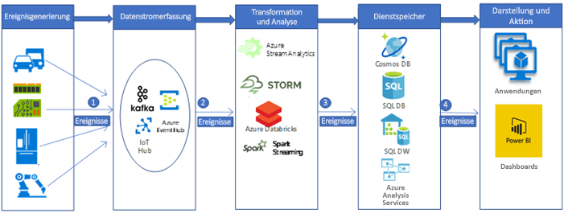

# Erfassung und Verarbeitung von IoT-Daten für die Automobilindustrie in Echtzeit

In diesem Beispielszenario wird eine Pipeline für die Echtzeiterfassung und Verarbeitung von Daten erstellt, um Nachrichten von IoT-Geräten (Sensoren) auf einer Big Data-Analyseplattform in Azure zu erfassen und zu verarbeiten. Erfassungs- und Verarbeitungsplattformen für Fahrzeugtelematik werden für die Erstellung vernetzter Fahrzeuglösungen benötigt. Dieses spezielle Szenario basiert auf den Erfassungs- und Verarbeitungssystemen für Fahrzeugtelematik. Die Entwurfsmuster sind jedoch für zahlreiche Branchen relevant, in denen Sensoren zum Einsatz kommen, um komplexe Systeme zu verwalten und zu überwachen. Beispiele hierfür wären etwa intelligente Gebäude, Kommunikation, Fertigung, Einzelhandel und Gesundheitswesen.

Dieses Beispiel zeigt eine Pipeline zur Erfassung und Verarbeitung von Echtzeitdaten für Nachrichten, die von in Fahrzeugen installierten IoT-Geräten gesendet werden. Von den IoT-Geräten und Sensoren werden unzählige Nachrichten (oder Ereignisse) generiert. Durch die Erfassung und Analyse dieser Nachrichten können wir wertvolle Einblicke gewinnen und geeignete Maßnahmen ergreifen. Wenn wir also beispielsweise bei Autos, die mit Telematikgeräten ausgestattet sind, IoT-Gerätenachrichten in Echtzeit erfassen, können wir den aktuellen Standort von Fahrzeugen überwachen, optimierte Routen planen, Fahrern Hilfestellung geben und telematikbezogene Branchen (beispielsweise Autoversicherungen) unterstützen.

In dieser Demo verwenden wir als Beispiel einen Automobilhersteller, der ein Echtzeitsystem zur Erfassung und Verarbeitung der Nachrichten von Telematikgeräten aufbauen möchte. Das Unternehmen hat folgende Ziele:

- Erfassen und Speichern der Daten von Fahrzeugsensoren und -geräten in Echtzeit.
- Analysieren der Nachrichten, um den Standort des Fahrzeugs zu ermitteln und andere Informationen zu verstehen, die von verschiedenen Arten von Sensoren (beispielsweise Motor- oder Umgebungssensoren) ausgegeben werden.
- Speichern der Daten nach der Analyse zur weiteren Downstreamverarbeitung, um verwertbare Erkenntnisse zu gewinnen. (So kann sich beispielsweise eine Versicherung bei einem Unfall über den Unfallhergang informieren.)

## Relevante Anwendungsfälle

Zu den weiteren relevanten Anwendungsfällen zählen:

- Erinnerungen und Warnungen im Zusammenhang mit der Fahrzeugwartung
- Standortbasierte Dienste für Fahrzeuginsassen (Notruf)
- Autonome (selbstfahrende) Fahrzeuge

## Architecture

In einer typischen Implementierung einer Big Data-Verarbeitungspipeline fließen die Daten von links nach rechts. In dieser Big Data-Echtzeitverarbeitungspipeline durchlaufen die Daten die Lösung wie folgt:

1. Von den IoT-Datenquellen generierte Ereignisse werden über Azure HDInsight Kafka als Nachrichtendatenstrom an die Datenstromerfassungsebene gesendet. HDInsight Kafka speichert Datenströme für einen konfigurierbaren Zeitraum in Themen.
2. Azure Databricks (Kafka-Consumer) ruft die Nachricht in Echtzeit aus dem Kafka-Thema ab, um die Daten gemäß der Geschäftslogik zu verarbeiten, und kann sie anschließend zur Speicherung an die Bereitstellungsebene senden.
3. Downstreamspeicherdienste wie Azure Cosmos DB, Azure SQL Data Warehouse und Azure SQL-Datenbank fungieren dann als Datenquelle für die Präsentations- und Aktionsebene.
4. Business Analysts können Microsoft Power BI verwenden, um in einem Data Warehouse gespeicherte Daten zu analysieren. Auf der Grundlage der Bereitstellungsebene können außerdem weitere Anwendungen erstellt werden. So können wir beispielsweise auf der Grundlage der Dienstebenendaten APIs für die Verwendung durch Dritte verfügbar machen.

### Komponenten

Von IoT-Geräten generierte Ereignisse (Daten oder Nachrichten) werden erfasst, verarbeitet und anschließend für weitere Analysen, Präsentationen und Aktionen mithilfe folgender Azure-Komponenten gespeichert:

- [Apache Kafka in HDInsight](/azure/hdinsight/kafka/apache-kafka-introduction) ist die Erfassungsebene. Die Daten werden unter Verwendung einer Kafka-Producer-API in das Kafka-Thema geschrieben.
- [Azure Databricks](/services/databricks) befindet sich auf der Transformations- und Analyseebene. Databricks-Notebooks implementieren eine Kafka-Consumer-API, um die Daten aus dem Kafka-Thema zu lesen.
- [Azure Cosmos DB](/services/cosmos-db), [Azure SQL-Datenbank](/azure/sql-database/sql-database-technical-overview), und Azure SQL Data Warehouse befinden sich auf der Bereitstellungsspeicherebene. Hier kann Azure Databricks die Daten über Datenconnectors schreiben.
- [Azure SQL Data Warehouse](/azure/sql-data-warehouse/sql-data-warehouse-overview-what-is) ist ein verteiltes System zum Speichern und Analysieren umfangreicher Datasets. Dank MPP (Massive Parallel Processing) eignet sich diese Komponente für Hochleistungsanalysen.
- [Power BI](/power-bi) ist eine Suite aus Business Analytics-Tools zum Analysieren von Daten und Teilen von Einblicken. Power BI kann ein in Analysis Services gespeichertes Semantikmodell oder direkt SQL Data Warehouse abfragen.
- [Azure Active Directory (Azure AD)](/azure/active-directory) authentifiziert Benutzer bei der Verbindungsherstellung mit [Azure Databricks](https://azure.microsoft.com/services/databricks). Wenn wir in [Analysis Services](/azure/analysis-services) auf der Grundlage des Modells, das wiederum auf Azure SQL Data Warehouse-Daten basiert, einen Cube erstellen möchten, können wir AAD verwenden, um über Power BI eine Verbindung mit dem Analysis Services-Server herzustellen. Auch Data Factory kann Azure AD für die Authentifizierung bei SQL Data Warehouse nutzen – entweder über einen Dienstprinzipal oder über eine verwaltete Dienstidentität (Managed Service Identity, MSI).
- [Azure App Services](/azure/app-service/app-service-web-overview) (insbesondere die [API-App](/services/app-service/api)) kann verwendet werden, um Daten auf der Grundlage der auf der Bereitstellungsebene gespeicherten Daten für Dritte verfügbar zu machen.

## Alternativen

Eine allgemeinere Big Data-Pipeline kann mit anderen Azure-Komponenten implementiert werden.

- Auf der Datenstromerfassungsebene kann zur Datenerfassung [IoT Hub](https://azure.microsoft.com/services/iot-hub) oder [Event Hub](https://azure.microsoft.com/services/event-hubs) anstelle von [HDInsight Kafka](/azure/hdinsight/kafka/apache-kafka-introduction) verwendet werden.
- Auf der Transformations- und Analyseebene können wir [HDInsight Storm](/azure/hdinsight/storm/apache-storm-overview), [HDInsight Spark](/azure/hdinsight/spark/apache-spark-overview) oder [Azure Stream Analytics](https://azure.microsoft.com/services/stream-analytics) verwenden.
- [Analysis Services](/azure/analysis-services) bietet ein Semantikmodell für Ihre Daten. Darüber hinaus kann die Komponente die Systemleistung beim Analysieren Ihrer Daten erhöhen. Sie können das Modell auf der Grundlage von Azure Data Warehouse-Daten erstellen.

## Überlegungen

Die Technologien dieser Architektur wurden basierend auf dem erforderlichen Umfang für die Ereignisverarbeitung, der SLA der Dienste, der Kostenverwaltung und der Benutzerfreundlichkeit bei der Verwaltung der Komponenten ausgewählt.

- Die verwaltete Lösung [HDInsight Kafka](/azure/hdinsight/kafka/apache-kafka-introduction) verfügt über eine SLA mit 99,9 Prozent und ist in Azure Managed Disks integriert.
- [Azure Databricks](/azure/azure-databricks/what-is-azure-databricks) ist von Grund auf für hohe Leistung und Kosteneffizienz in der Cloud optimiert. Databricks Runtime fügt mehrere wichtige Funktionen für Apache Spark-Workloads hinzu, die bei der Ausführung in Azure die Leistung um das Zehn- bis Hundertfache erhöhen und die Kosten entsprechend senken können:
- Azure Databricks ist tief in Azure-Datenbanken und -Speicher integriert: [Azure SQL Data Warehouse](/azure/sql-data-warehouse), [Azure Cosmos DB](https://azure.microsoft.com/services/cosmos-db), [Azure Data Lake Storage](https://azure.microsoft.com/services/storage/data-lake-storage) und [Azure Blob Storage](https://azure.microsoft.com/services/storage/blobs).
  - Automatische Skalierung und Beendigung für Spark-Cluster, um automatisch die Kosten zu minimieren.
  - Leistungsoptimierungen (einschließlich Zwischenspeicherung, Indizierung und erweiterter Abfrageoptimierung), die die Leistung im Vergleich zu herkömmlichen Apache Spark-Bereitstellungen in cloudbasierten und lokalen Umgebungen um das Zehn- bis Hundertfache erhöhen können.
  - Dank Azure Active Directory-Integration können Sie vollständige Azure-basierte Lösungen mit Azure Databricks ausführen.
  - Die rollenbasierte Zugriffssteuerung von Azure Databricks ermöglicht die Verwendung präziser Benutzerberechtigungen für Notebooks, Cluster, Aufträge und Daten.
  - Bietet SLAs auf Unternehmensniveau.
- Azure Cosmos DB ist eine global verteilte Datenbank von Microsoft mit mehreren Modellen. Azure Cosmos DB wurde von Grund auf für globale Verteilung und horizontale Skalierbarkeit konzipiert. Der Dienst bietet eine sofort einsatzbereite globale Verteilung über beliebig viele Azure-Regionen hinweg, indem er Ihre Daten transparent skaliert und dort repliziert, wo Ihre Benutzer sie benötigen. Sie können Durchsatz und Speicherplatz elastisch weltweit skalieren und bezahlen nur für den Durchsatz und Speicherplatz, den Sie benötigen.
- Die MPP-Architektur (Massively Parallel Processing) von SQL Data Warehouse zeichnet sich durch Skalierbarkeit und hohe Leistung aus.
- Azure SQL Data Warehouse verfügt über SLA-Garantien und empfohlene Vorgehensweisen zur Erreichung von Hochverfügbarkeit.
- Bei geringer Analyseaktivität kann das Unternehmen Azure SQL Data Warehouse nach Bedarf skalieren und die Computeressourcen verringern oder sogar anhalten, um Kosten zu sparen.
- Das Sicherheitsmodell von Azure SQL Data Warehouse bietet Verbindungssicherheit, Authentifizierung und Autorisierung mittels Azure AD- oder SQL Server-Authentifizierung sowie Verschlüsselung.

## Preise

Informationen zu Preisen erhalten Sie unter [Azure Databricks – Preise](https://azure.microsoft.com/pricing/details/databricks), [Azure HDInsight: Preise](https://azure.microsoft.com/pricing/details/hdinsight) und im [Preisbeispiel für ein Data Warehouse-Szenario](https://azure.com/e/b798fb70c53e4dd19fdeacea4db78276) über den Azure-Preisrechner. Passen Sie die Werte an, um zu ermitteln, wie sich Ihre Anforderungen auf die Kosten auswirken.

- [Azure HDInsight](/azure/hdinsight) ist ein vollständig verwalteter Clouddienst, mit dem Sie einfach, schnell und kosteneffizient große Datenmengen verarbeiten können.
- [Azure Databricks](https://azure.microsoft.com/services/databricks) bietet zwei verschiedene Workloads auf mehreren [VM-Instanzen](https://azure.microsoft.com/pricing/details/databricks/#instances), die genau auf Ihren Datenanalyseworkflow zugeschnitten sind: Mit der Workload „Datentechnik“ können Data Engineers ganz einfach Aufträge erstellen und ausführen, und mit der Workload „Datenanalyse“ können Data Scientists problemlos Daten und Erkenntnisse interaktiv erkunden, visualisieren, ändern und gemeinsam nutzen.
- [Azure Cosmos DB](https://azure.microsoft.com/services/cosmos-db) garantiert Wartezeiten im einstelligen Millisekundenbereich im 99. Perzentil an jedem Ort der Welt, bietet [mehrere gut definierte Konsistenzmodelle](/azure/cosmos-db/consistency-levels) zur Optimierung der Leistung und garantiert Hochverfügbarkeit mit Multihostingfunktionen – jeweils untermauert durch branchenführende, umfassende [Vereinbarungen zum Servicelevel](https://azure.microsoft.com/support/legal/sla/cosmos-db) (Service Level Agreements, SLAs).
- Mit [Azure SQL Data Warehouse](https://azure.microsoft.com/pricing/details/sql-data-warehouse/gen2) können Sie Ihre Compute- und Ihre Speicherebene unabhängig voneinander skalieren. Computeressourcen werden auf Stundenbasis abgerechnet und können nach Bedarf skaliert oder angehalten werden. Speicherressourcen werden nach Terabyte abgerechnet. Ihre Kosten steigen also, wenn Sie mehr Daten erfassen.
- [Analysis Services](https://azure.microsoft.com/pricing/details/analysis-services) ist in den Tarifen „Developer“, „Basic“ und „Standard“ erhältlich. Die Preise der Instanzen basieren auf QPUs (Query Processing Units) und auf dem verfügbaren Arbeitsspeicher. Minimieren Sie die Anzahl ausgeführter Abfragen, den Umfang der durch die Abfragen verarbeiteten Daten sowie die Ausführungshäufigkeit dieser Abfragen, um die Kosten gering zu halten.
- [Power BI](https://powerbi.microsoft.com/pricing) bietet verschiedene Produktoptionen für unterschiedliche Anforderungen. [Power BI Embedded](https://azure.microsoft.com/pricing/details/power-bi-embedded) bietet eine Azure-basierte Option zum Einbetten von Power BI-Funktionen in Ihre Anwendungen. Eine Power BI Embedded-Instanz ist im obigen Preisbeispiel enthalten.

## Nächste Schritte

- Sehen Sie sich die Referenzarchitektur unter [Echtzeitanalysen](https://azure.microsoft.com/solutions/architecture/real-time-analytics) an. Sie enthält einen Big Data-Pipelinefluss.
- Sehen Sie sich die Referenzarchitektur unter [Erweiterte Big Data-Analysen](https://azure.microsoft.com/solutions/architecture/advanced-analytics-on-big-data) an, um einen Eindruck davon zu bekommen, wie verschiedene Azure-Komponenten bei der Erstellung einer Big Data-Pipeline hilfreich sein können.
- Lesen Sie die Azure-Dokumentation [Verarbeitung in Echtzeit](/azure/architecture/data-guide/big-data/real-time-processing), um sich schnell einen Überblick darüber zu verschaffen, wie verschiedene Azure-Komponenten zur Verarbeitung von Datenströmen in Echtzeit beitragen können.
- Der [Azure-Datenarchitekturleitfaden](/azure/architecture/data-guide) enthält umfassende Architekturinformationen zu Datenpipelines, Data Warehouses, analytischer Onlineverarbeitung (Online Analytical Processing, OLAP) und Big Data.
