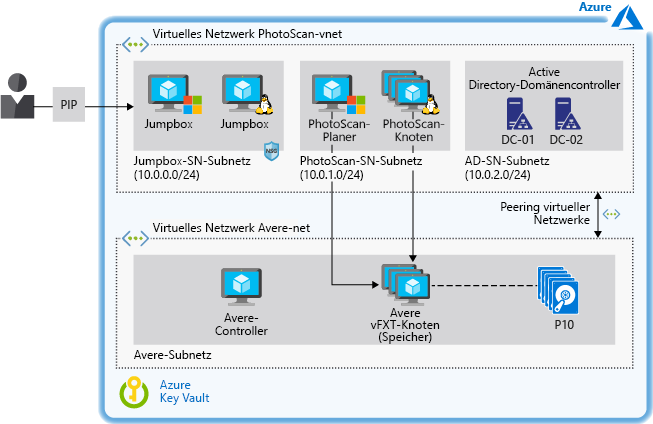

# Beschleunigen der digitalen bildbasierten Modellierung in AzureAccelerate digital image-based modeling on Azure

Dieses Beispielszenario kann als Architektur- und Entwurfsleitfaden für jede Organisation dienen, die die bildbasierte Modellierung in Azure IaaS (Infrastructure-as-a-Service) durchführen möchte.This example scenario provides architecture and design guidance for any organization that wants to perform image-based modeling on Azure infrastructure-as-a-service (IaaS). Das Szenario ist für die Ausführung von Photogrammetriesoftware in Azure Virtual Machines (VMs) mit Hochleistungsspeicher zum Beschleunigen der Verarbeitung konzipiert.The scenario is designed for running photogrammetry software on Azure Virtual Machines (VMs) using high-performance storage that accelerates processing time. Die Umgebung kann ohne Kompromisse bei der Leistung nach Bedarf zentral hoch- und herunterskaliert werden und unterstützt Terabytes von Speicher.The environment can be scaled up and down as needed and supports terabytes of storage without sacrificing performance.

## Relevante AnwendungsfälleRelevant use cases

Zu den relevanten Anwendungsfällen zählen:Relevant use cases include:

- Modellierung und Messung von Gebäuden und Bauwerken sowie Unfallorten zur forensischen UntersuchungModeling and measuring buildings, engineering structures, and forensic accident scenes.
- Erstellung von visuellen Effekten für Computerspiele und FilmeCreating visual effects for computer games and movies.
- Verwendung digitaler Bilder zum indirekten Generieren von Messungen von Objekten verschiedener Größen (z. B. bei der Stadtplanung und anderen Anwendungen)Using digital images to indirectly generate measurements of objects of various scales as in urban planning and other applications.

## ArchitectureArchitecture

In diesem Beispiel wird die Verwendung der Photogrammetriesoftware Agisoft PhotoScan mit Avere vFXT-Speicher beschrieben.This example describes the use of Agisoft PhotoScan photogrammetry software backed by Avere vFXT storage. Die Software PhotoScan wurde aufgrund ihrer Beliebtheit im Bereich der GIS-Anwendungen (geografische Informationssysteme), der Dokumentation von Kulturgütern, Entwicklung von Spielen und Erzeugung visueller Effekte ausgewählt.PhotoScan was chosen for its popularity in geographic information system (GIS) applications, cultural heritage documentation, game development, and visual effects production. Sie eignet sich sowohl für die Nahbereichsphotogrammetrie als auch die Luftphotogrammetrie.It is suitable for both close-range photogrammetry and aerial photogrammetry.

Die in diesem Artikel vorgestellten Konzepte gelten für alle HPC-Workloads (High Performance Computing) auf der Grundlage von Planer- und Workerknoten, die als Infrastruktur verwaltet werden.The concepts in this article apply to any high-performance computing (HPC) workload based on a scheduler and worker nodes managed as infrastructure.  Die Speicherlösung Avere vFXT wurde aufgrund ihrer herausragenden Leistung in Benchmarktests für diese Workload ausgewählt.For this workload, Avere vFXT was selected for its superior performance during benchmark tests.  Da das Szenario den Speicher von der Verarbeitung entkoppelt, können jedoch auch andere Speicherlösungen verwendet werden (siehe [Alternativen](#alternatives) weiter unten in diesem Dokument).However, the scenario decouples the storage from the processing so that other storage solutions can be used (see [alternatives](#alternatives) later in this document).

Zum Steuern des Zugriffs auf Azure-Ressourcen und Bereitstellen der internen Namensauflösung durch das Domain Name System (DNS) enthält diese Architektur auch Active Directory-Domänencontroller.This architecture also includes Active Directory domain controllers to control access to Azure resources and provide internal name resolution through the Domain Name System (DNS). Jumpboxes bieten Administratoren Zugriff auf die Windows- und Linux-VMs, auf denen die Lösung ausgeführt wird.Jump boxes provide administrator access to the Windows and Linux VMs that run the solution.

1. Der Benutzer übermittelt eine Reihe von Bildern an PhotoScan.User submits a number of images to PhotoScan.
2. Der PhotoScan-Planer wird auf einer Windows-VM ausgeführt, die als Hauptknoten fungiert und die Verarbeitung der Bilder des Benutzers steuert.The PhotoScan Scheduler runs on a Windows VM that serves as the head node and directs processing of the user's images.
3. PhotoScan sucht nach allgemeinen Punkten in den Fotos und erstellt die Geometrie (Gittermodell) mithilfe der PhotoScan-Verarbeitungsknoten, die auf VMs mit Grafikprozessoren (Graphics Processing Unit, GPU) ausgeführt werden.PhotoScan searches for common points on the photographs and constructs the geometry (mesh) using the PhotoScan processing nodes running on VMs with graphics processing units (GPUs).
4. Avere vFXT stellt eine Hochleistungsspeicherlösung in Azure bereit, die auf Network File System Version 3 (NFS V3) basiert und aus mindestens vier VMs besteht.Avere vFXT provides a high-performance storage solution on Azure based on Network File System version 3 (NFSv3) and comprised of at least four VMs.
5. PhotoScan rendert das Modell.PhotoScan renders the model.

### KomponentenComponents

- [Agisoft PhotoScan](http://www.agisoft.com/): Der PhotoScan-Planer wird auf einer Windows Server 2016-VM ausgeführt, und die Verarbeitungsknoten nutzen fünf VMs mit GPUs unter CentOS Linux 7.5.[Agisoft PhotoScan](http://www.agisoft.com/): The PhotoScan Scheduler runs on a Windows 2016 Server VM, and the processing nodes use five VMs with GPUs that run CentOS Linux 7.5.
- [Avere vFXT](/azure/avere-vfxt/avere-vfxt-overview) ist eine Lösung zur Dateizwischenspeicherung, die Objektspeicher und herkömmlichen Network Attached Storage (NAS) verwendet, um die Speicherung großer Datasets zu optimieren.[Avere vFXT](/azure/avere-vfxt/avere-vfxt-overview) is a file caching solution that uses object storage and traditional network-attached storage (NAS) to optimize storage of large datasets. Sie hat folgenden Inhalt:It includes:
  - Avere-Controller.Avere Controller. Diese VM führt das Skript aus, durch das der Avere vFXT-Cluster installiert wird, und führt Ubuntu 18.04 LTS aus.This VM executes the script that installs the Avere vFXT cluster and runs Ubuntu 18.04 LTS. Die VM kann später zum Hinzufügen oder Entfernen von Clusterknoten und auch zum Zerstören des Clusters verwendet werden.The VM can be used later to add or remove cluster nodes and to destroy the cluster as well.
  - vFXT-Cluster.vFXT cluster. Es werden mindestens drei VMs verwendet, eine für jeden der auf Avere OS 5.0.2.1 basierenden Avere vFXT-Knoten.At least three VMs are used, one for each of the Avere vFXT nodes based on Avere OS 5.0.2.1. Diese VMs bilden den vFXT-Cluster, der an Azure Blob Storage angefügt wird.These VMs form the vFXT cluster, which is attached to Azure Blob storage.
- [Microsoft Active Directory-Domänencontroller](/windows/desktop/ad/active-directory-domain-services) ermöglichen den Hostzugriff auf Domänenressourcen und stellen die DNS-Namensauflösung bereit.[Microsoft Active Directory domain controllers](/windows/desktop/ad/active-directory-domain-services) allow the host access to domain resources and provide DNS name resolution. Avere vFXT fügt eine Reihe von A-Einträgen hinzu. Beispielsweise verweist jeder A-Eintrag in einem vFXT-Cluster auf die IP-Adresse der einzelnen Avere vFXT-Knoten.Avere vFXT adds a number of A records &mdash; for example, each A record in a vFXT cluster points to the IP address of each Avere vFXT node. In dieser Konfiguration greifen alle VMs mit dem Roundrobin-Muster auf vFXT-Exporte zu.In this setup, all VMs use the round-robin pattern to access vFXT exports.
- [Andere VMs](/azure/virtual-machines/) dienen als Jumpboxes, über die der Administrator auf die Planer- und Verarbeitungsknoten zugreift.[Other VMs](/azure/virtual-machines/) serve as jump boxes used by the administrator to access the scheduler and processing nodes. Die Windows-Jumpbox ist erforderlich, damit der Administrator über das Remotedesktopprotokoll auf den Hauptknoten zugreifen kann.The Windows jumpbox is mandatory to allow the administrator to access the head node via remote desktop protocol. Die zweite Jumpbox ist optional und führt zur Verwaltung der Workerknoten Linux aus.The second jumpbox is optional and runs Linux for administration of the worker nodes.
- [Netzwerksicherheitsgruppen](/azure/virtual-network/manage-network-security-group) (NSGs) beschränken den Zugriff auf die öffentliche IP-Adresse (PIP) und lassen die Ports 3389 und 22 für den Zugriff auf die VMs zu, die an das Subnetz der Jumpbox angefügt sind.[Network security groups](/azure/virtual-network/manage-network-security-group) (NSGs) limit access to the public IP address (PIP) and allow ports 3389 and 22 for access to the VMs attached to the Jumpbox subnet.
- Per [Peering in virtuellen Netzwerken](/azure/virtual-network/virtual-network-peering-overview) wird ein virtuelles PhotoScan-Netzwerk mit einem virtuellen Avere-Netzwerk verbunden.[Virtual network peering](/azure/virtual-network/virtual-network-peering-overview) connects a PhotoScan virtual network to an Avere virtual network.
- [Azure Blob Storage](/azure/storage/blobs/storage-blobs-introduction) arbeitet mit Avere vFXT als Kernspeichereinheit, um die committeten Daten zu speichern, die verarbeitet werden.[Azure Blob storage](/azure/storage/blobs/storage-blobs-introduction) works with Avere vFXT as the core filer to store the committed data being processed. Avere vFXT identifiziert die in Azure Blob Storage gespeicherten aktiven Daten und verschiebt sie per Tiering auf SSD-Datenträger (Solid State Drive), die während der Ausführung eines PhotoScan-Auftrags zum Zwischenspeichern in den Computeknoten verwendet werden.Avere vFXT identifies the active data stored in Azure Blob and tiers it into solid-state drives (SSD) used for caching in its compute nodes while a PhotoScan job is running. Wenn Änderungen vorgenommen werden, werden die Daten asynchron zurück an die Kernspeichereinheit committet.If changes are made, the data is asynchronously committed back to the core filer.
- [Azure Key Vault](/azure/key-vault/key-vault-overview) wird zum Speichern der Administratorkennwörter und des PhotoScan-Aktivierungscodes verwendet.[Azure Key Vault](/azure/key-vault/key-vault-overview) is used to store the administrator passwords and PhotoScan activation code.

### AlternativenAlternatives

- Wenn Sie Azure-Dienste für die Verwaltung eines HPC-Clusters nutzen möchten, können Sie Tools wie Azure CycleCloud oder Azure Batch verwenden, anstatt die Ressourcen über Vorlagen oder Skripts zu verwalten.To take advantage of Azure services for managing an HPC cluster, use tools such as Azure CycleCloud or Azure Batch instead of managing the resources through templates or scripts.
- Stellen Sie anstelle Avere vFXT das parallele virtuelle BeeGFS-Dateisystem als Back-End-Speicher in Azure bereit.Deploy the BeeGFS parallel virtual file system as the back-end storage on Azure instead of Avere vFXT. Verwenden Sie die [BeeGFS-Vorlage](https://github.com/paulomarquesc/beegfs-template), um diese End-to-End-Lösung in Azure bereitzustellen.Use the [BeeGFS template](https://github.com/paulomarquesc/beegfs-template) to deploy this end-to-end solution on Azure.
- Stellen Sie die Speicherlösung Ihrer Wahl bereit, z. B. GlusterFS, Lustre oder direkte Windows-Speicherplätze.Deploy the storage solution of your choice, such as GlusterFS, Lustre, or Windows Storage Spaces Direct. Bearbeiten Sie dazu die [PhotoScan-Vorlage](https://github.com/paulomarquesc/photoscan-template) zur Verwendung der gewünschten Speicherlösung.To do this, edit the [PhotoScan template](https://github.com/paulomarquesc/photoscan-template) to work with the storage solution you want.
- Stellen Sie die Workerknoten nicht mit Linux (Standardoption), sondern mit dem Windows-Betriebssystem bereit.Deploy the worker nodes with the Windows operating system instead of Linux, the default option. Wenn Sie sich für Windows-Knoten entscheiden, werden die Optionen für die Speicherintegration nicht von den Bereitstellungsvorlagen ausgeführt.When choosing Windows nodes, storage integration options are not executed by the deployment templates. Sie müssen die Umgebung manuell in eine vorhandene Speicherlösung integrieren oder die PhotoScan-Vorlage anpassen, um eine solche Automatisierung zu implementieren (Informationen dazu finden Sie im [Repository](https://github.com/paulomarquesc/photoscan-template/blob/master/docs/AverePostDeploymentSteps.md)).You must manually integrate the environment with an existing storage solution, or customize the PhotoScan template to provide such automation, as described in the [repository](https://github.com/paulomarquesc/photoscan-template/blob/master/docs/AverePostDeploymentSteps.md).

## ÜberlegungenConsiderations

Dieses Szenario ist speziell für die Bereitstellung von Hochleistungsspeicher für eine HPC-Workload unter Windows oder Linux konzipiert.This scenario is designed specifically to provide high-performance storage for an HPC workload, whether it is deployed on Windows or Linux. Im Allgemeinen sollte die Speicherkonfiguration der HPC-Workload den jeweiligen bewährten Methoden entsprechen, die für lokale Bereitstellungen verwendet werden.In general, the storage configuration of the HPC workload should match the appropriate best practices used for on-premises deployments.

Die Überlegungen zur Bereitstellung hängen von den verwendeten Anwendungen und Diensten ab. Folgendes ist jedoch zu beachten:Deployment considerations depend on the applications and services used, but a few notes apply:

- Verwenden Sie beim Erstellen von Hochleistungsanwendungen Azure Storage Premium, und [optimieren Sie die Anwendungsschicht](/azure/virtual-machines/windows/premium-storage-performance).When building high-performance applications, use Azure Premium Storage and [optimize the application layer](/azure/virtual-machines/windows/premium-storage-performance). Optimieren Sie den Speicher für den häufigen Zugriff mit der [heißen Zugriffsebene](/azure/storage/blobs/storage-blob-storage-tiers) von Azure Blob Storage.Optimize storage for frequent access using Azure Blob [hot tier access](/azure/storage/blobs/storage-blob-storage-tiers).
- Verwenden Sie eine [Replikationsoption](/azure/storage/common/storage-redundancy) für den Speicher, die Ihre Anforderungen in Bezug auf die Verfügbarkeit und Leistung erfüllt.Use a storage [replication option](/azure/storage/common/storage-redundancy) that meets your availability and performance requirements. In diesem Beispiel wird Avere vFXT standardmäßig mit lokal redundantem Speicher (Locally Redundant Storage, LRS) für Hochverfügbarkeit konfiguriert.In this example, Avere vFXT is configured for high availability by default, with locally redundant storage (LRS). Zum Bereitstellen eines Lastenausgleichs greifen in dieser Konfiguration alle VMs mit dem Roundrobin-Muster auf vFXT-Exporte zu.For load balancing, all VMs in this setup use the round-robin pattern to access vFXT exports.
- Verwenden Sie Samba-Server zum Unterstützen der Windows-Knoten, wenn der Back-End-Speicher sowohl von Windows- als auch Linux-Clients genutzt wird.If the backend storage will be consumed by both Windows clients and Linux clients, use Samba servers to support the Windows nodes. Eine auf BeeGFS beruhende [Version](https://github.com/paulomarquesc/beegfs-template) dieses Beispielszenarios verwendet Samba, um den Planerknoten der unter Windows ausgeführten HPC-Workload (PhotoScan) zu unterstützen.A [version](https://github.com/paulomarquesc/beegfs-template) of this example scenario based on BeeGFS uses Samba to support the scheduler node of the HPC workload (PhotoScan) running on Windows. Ein Lastenausgleich wird als intelligenter Ersatz für den DNS-Roundrobin bereitgestellt.A load balancer is deployed to act like a smart replacement for DNS round robin.
- Führen Sie HPC-Anwendungen mit dem VM-Typ aus, der sich am besten für Ihre [Windows](/azure/virtual-machines/windows/sizes-hpc)- oder [Linux](/azure/virtual-machines/linux/sizes?toc=%2fazure%2fvirtual-machines%2flinux%2ftoc.json)-Workload eignet.Run HPC applications using the VM type best suited for your [Windows](/azure/virtual-machines/windows/sizes-hpc) or [Linux](/azure/virtual-machines/linux/sizes?toc=%2fazure%2fvirtual-machines%2flinux%2ftoc.json) workload.
- Isolieren Sie die HPC-Workload von den Speicherressourcen, indem Sie sie jeweils in einem eigenen virtuellen Netzwerk bereitstellen, und verbinden Sie die beiden Komponenten dann per [Peering](/azure/virtual-network/virtual-network-peering-overview) in virtuellen Netzwerken.To isolate the HPC workload from the storage resources, deploy each in its own virtual network, then use virtual network [peering](/azure/virtual-network/virtual-network-peering-overview) to connect the two. Durch das Peering wird eine Verbindung mit geringer Wartezeit und hoher Bandbreite zwischen Ressourcen in unterschiedlichen virtuellen Netzwerken erstellt und Datenverkehr durch die Microsoft-Backbone-Infrastruktur nur über private IP-Adressen weitergeleitet.Peering creates a low-latency, high-bandwidth connection between resources in different virtual networks and routes traffic through the Microsoft backbone infrastructure through private IP addresses only.

### SicherheitSecurity

In diesem Beispiel geht es in erster Linie um die Bereitstellung einer Hochleistungsspeicherlösung für eine HPC-Workload. Die vorgestellte Lösung ist daher keine Sicherheitslösung.This example focuses on deploying a high-performance storage solution for an HPC workload and is not a security solution. Ziehen Sie bei allen Änderungen Ihr Sicherheitsteam hinzu.Make sure to involve your security team for any changes.

Die Beispielinfrastruktur ermöglicht es, alle Windows-VMs in eine Domäne einzubinden, und verwendet Active Directory für die zentrale Authentifizierung, um die Sicherheit zu verbessern.For added security, this example infrastructure enables all the Windows VMs to be domain-joined and uses Active Directory for central authentication. Zudem bietet sie benutzerdefinierte DNS-Dienste für alle VMs.It also provides custom DNS services for all VMs. Um die Umgebung zu schützen, beruht diese Vorlage auf [Netzwerksicherheitsgruppen (NSGs)](/azure/virtual-network/security-overview).To help protect the environment, this template relies on [network security groups (NSGs)](/azure/virtual-network/security-overview). NSGs bieten grundlegende Datenverkehrsfilter und Sicherheitsregeln.NSGs offer basic traffic filters and security rules.

Die Sicherheit kann in diesem Szenario mit den folgenden Optionen zusätzlich erhöht werden:Consider the following options to further improve security in this scenario:

- Verwenden von virtuellen Netzwerkgeräten wie Fortinet, Checkpoint und JuniperUse network virtual appliances such as Fortinet, Checkpoint, and Juniper.
- Anwenden der [rollenbasierten Zugriffssteuerung](/azure/role-based-access-control/overview) auf die RessourcengruppenApply [role-based access control](/azure/role-based-access-control/overview) to the resource groups.
- Aktivieren des VM-[JIT](/azure/security-center/security-center-just-in-time)-Zugriffs, wenn über das Internet auf Jumpboxes zugegriffen wirdEnable VM [JIT](/azure/security-center/security-center-just-in-time) access if jump boxes are accessed via the Internet.
- Verwenden von [Azure Key Vault](/azure/key-vault/quick-create-portal) zum Speichern der Kennwörter von AdministratorkontenUse [Azure Key Vault](/azure/key-vault/quick-create-portal) to store the passwords used by administrator accounts.

## PreisePricing

Die Kosten für die Umsetzung dieses Szenarios hängen von mehreren Faktoren ab und können erheblich variieren.The cost of running this scenario can vary greatly depending on multiple factors.  Die Anzahl und Größe der VMs, der erforderliche Speicherplatz und die zum Ausführen eines Auftrags benötigte Zeit bestimmen die Kosten.The number and size of VMs, how much storage is required, and the amount of time to complete a job will determine your cost.

Das folgende Beispielkostenprofil im [Azure-Preisrechner](https://azure.com/e/42362ddfd2e245a28a8e78bc609c80f3) basiert auf einer typischen Konfiguration für Avere vFXT und PhotoScan:The following sample cost profile in the [Azure pricing calculator](https://azure.com/e/42362ddfd2e245a28a8e78bc609c80f3) is based on a typical configuration for Avere vFXT and PhotoScan:

- Eine A1\_v2-Ubuntu-VM zum Ausführen des Avere-Controllers1 A1\_v2 Ubuntu VM to run the Avere controller.
- Drei D16s\_v3-Avere OS-VMs (eine für jeden der Avere vFXT-Knoten, aus denen der vFXT-Cluster besteht)3 D16s\_v3 Avere OS VMs, one for each of the Avere vFXT nodes that form the vFXT cluster.
- Fünf NC24\_v2-Linux-VMs zum Bereitstellen der erforderlichen GPUs für die PhotoScan-Verarbeitungsknoten5 NC24\_v2 Linux VMs to provide the GPUs needed by the PhotoScan processing nodes.
- Eine D8s\_v3-CentOS-VM für den PhotoScan-Planerknoten1 D8s\_v3 CentOS VM for the PhotoScan scheduler node.
- Eine DS2\_v2-CentOS-VM zur Verwendung als Administrator-Jumpbox1 DS2\_v2 CentOS used as administrator jumpbox.
- Zwei DS2\_v2-VMs für die Active Directory-Domänencontroller2 DS2\_v2 VMs for the Active Directory domain controllers.
- Verwaltete Premium-DatenträgerPremium managed disks.
- Universeller v2 (GPv2)-Blobspeicher mit lokal redundantem Speicher und heißer Zugriffsebene (das Zugriffsebenenattribut ist nur bei GPv2-Speicherkonten verfügbar)General purpose v2 (GPv2) Blob storage with LRS and hot tier access (only GPv2 storage accounts expose the Access Tier attribute).
- Virtuelles Netzwerk mit Unterstützung für die 10 TB-DatenübertragungVirtual network with support for 10 TB data transfer.

Ausführliche Informationen zu dieser Architektur finden Sie im [E-Book](https://azure.microsoft.com/en-us/resources/deploy-agisoft-photoscan-on-azure-with-azere-vfxt-for-azure-or-beegfs/).For details about this architecture, see the [ebook](https://azure.microsoft.com/en-us/resources/deploy-agisoft-photoscan-on-azure-with-azere-vfxt-for-azure-or-beegfs/). Wenn Sie wissen möchten, welche Kosten für Ihren spezifischen Anwendungsfall entstehen, wählen Sie im Preisrechner die unterschiedlichen VM-Größen für Ihre erwartete Bereitstellung aus.To see how the pricing would change for your particular use case, choose different VM sizes in the pricing calculator to match your expected deployment.

## BereitstellungDeployment

Ausführliche Anweisungen zum Bereitstellen dieser Architektur (einschließlich aller Voraussetzungen für die Verwendung von Avere FXT oder BeeGFS) finden Sie in dem zum Download verfügbaren E-Book: [Deploy Agisoft PhotoScan on Azure With Avere vFXT for Azure or BeeGFS](https://azure.microsoft.com/en-us/resources/deploy-agisoft-photoscan-on-azure-with-azere-vfxt-for-azure-or-beegfs/) (Bereitstellen von Agisoft PhotoScan in Azure mit Avere vFXT for Azure oder BeeGFS)For step-by-step instructions for deploying this architecture, including all the prerequisites for using either Avere FxT or BeeGFS, download the ebook: [Deploy Agisoft PhotoScan on Azure With Avere vFXT for Azure or BeeGFS](https://azure.microsoft.com/en-us/resources/deploy-agisoft-photoscan-on-azure-with-azere-vfxt-for-azure-or-beegfs/).

## Zugehörige RessourcenRelated resources

In den folgenden Ressourcen finden Sie weitere Informationen zu den in diesem Szenario verwendeten Komponenten und alternative Ansätze für das Batchcomputing in Azure.The following resources will provide more information on the components utilized in this scenario, along with alternative approaches for batch computing on Azure.

- Übersicht über [Avere vFXT for Azure](/azure/avere-vfxt/avere-vfxt-overview)Overview of [Avere vFXT for Azure](/azure/avere-vfxt/avere-vfxt-overview)
- Homepage von [Agisoft PhotoScan](https://www.agisoft.com/)[Agisoft PhotoScan](https://www.agisoft.com/) home Page
- [Checkliste zu Leistung und Skalierbarkeit von Microsoft Azure StorageAzure Storage Performance and Scalability Checklist](/azure/storage/common/storage-performance-checklist)
- [Parallel Virtual File Systems on Microsoft Azure: Performance tests of Lustre, GlusterFS, and BeeGFS](https://azure.microsoft.com/mediahandler/files/resourcefiles/parallel-virtual-file-systems-on-microsoft-azure/Parallel_Virtual_File_Systems_on_Microsoft_Azure.pdf) (Parallele virtuelle Dateisysteme in Microsoft Azure: Leistungstests von Lustre, GlusterFS und BeeGFS (PDF))[Parallel Virtual File Systems on Microsoft Azure: Performance tests of Lustre, GlusterFS, and BeeGFS](https://azure.microsoft.com/mediahandler/files/resourcefiles/parallel-virtual-file-systems-on-microsoft-azure/Parallel_Virtual_File_Systems_on_Microsoft_Azure.pdf) (PDF)
- Beispielszenario für einen [CAE-Dienst in Azure](/azure/architecture/example-scenario/apps/hpc-saas)An example scenario for [computer-aided engineering (CAE) on Azure](/azure/architecture/example-scenario/apps/hpc-saas)
- Homepage von [HPC in Azure](https://azure.microsoft.com/en-us/solutions/high-performance-computing/)[HPC on Azure](https://azure.microsoft.com/en-us/solutions/high-performance-computing/) home page
- Übersicht über [Big Compute: HPC &amp; Microsoft Batch](https://azure.microsoft.com/en-us/solutions/big-compute/)Overview of [Big Compute: HPC &amp; Microsoft Batch](https://azure.microsoft.com/en-us/solutions/big-compute/)