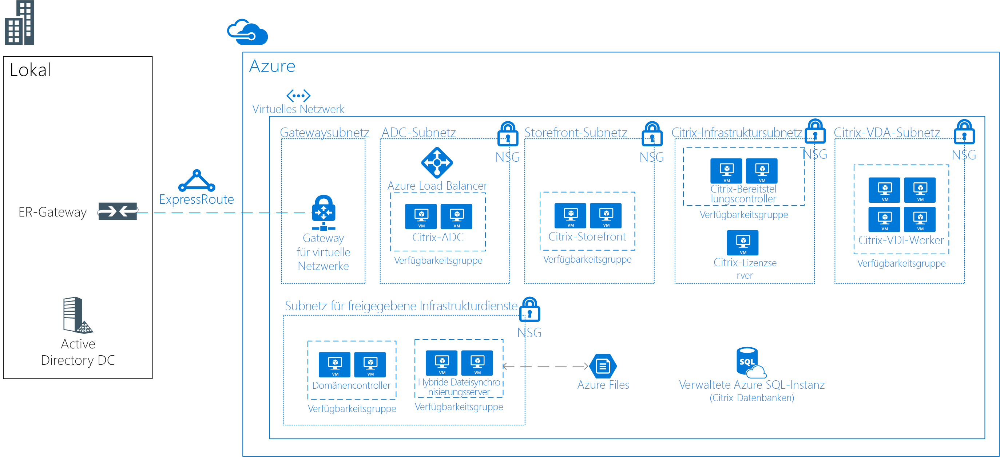

# Virtuelle Linux-Desktops mit CitrixLinux Virtual Desktops with Citrix

Dieses Beispielszenario gilt für jede Branche, in der eine VDI-Umgebung (Virtual Desktop Infrastructure) für Linux-Desktops benötigt wird.This example scenario is applicable to any industry that needs a Virtual Desktop Infrastructure (VDI) for Linux Desktops. VDI bezieht sich auf die Ausführung eines Benutzerdesktops innerhalb eines virtuellen Computers, der sich auf einem Server im Datencenter befindet.VDI refers to the process of running a user desktop inside a virtual machine that lives on a server in the datacenter. Der Kunde in diesem Szenario möchte eine Citrix-basierte Lösung für seine VDI-Anforderungen verwenden.The customer in this scenario chose to use a Citrix-based solution for their VDI needs.

Organisationen verfügen häufig über heterogene Umgebungen, in denen Mitarbeiter mehrere Geräte und Betriebssysteme verwenden.Organizations often have heterogeneous environments with multiple devices and operating systems being used by employees. In einer solchen Umgebung ist es unter Umständen nicht immer einfach, konsistenten Zugriff auf Anwendungen zu bieten und gleichzeitig die Sicherheit der Umgebung zu gewährleisten.It can be challenging to provide consistent access to applications while maintaining a secure environment. Mit einer VDI-Lösung für Linux-Desktops kann Ihre Organisation den Zugriff unabhängig davon ermöglichen, welches Gerät oder Betriebssystem der Endbenutzer verwendet.A VDI solution for Linux desktops will allow your organization to provide access irrespective of the device or OS used by the end user.

Hier sind einige Vorteile dieses Szenarios aufgeführt:Some benefits of this scenario include the following:

- Die gemeinsame Nutzung virtueller Linux-Desktops sorgt für eine höhere Rendite, da mehr Benutzer Zugriff auf die gleiche Infrastruktur haben.Return on investment will be higher with shared Linux virtual desktops by giving more users access to the same infrastructure. Durch die Konsolidierung von Ressourcen in einer zentralisierten VDI-Umgebung müssen die Geräte der Benutzer weniger leistungsfähig sein.By consolidating resources on a centralized VDI environment, the end user devices don't need to be as powerful.
- Die Leistung ist unabhängig vom Gerät des Endbenutzers konsistent.Performance will be consistent regardless of the end user device.
- Benutzer können von jedem Gerät aus auf Linux-Anwendungen zugreifen (auch von Linux-fremden Geräten).Users can access Linux applications from any device (including non-Linux devices).
- Vertrauliche Daten können im Azure-Rechenzentrum für alle verteilten Mitarbeiter geschützt werden.Sensitive data can be secured in the Azure data center for all distributed employees.

## Relevante AnwendungsfälleRelevant use cases

Dieses Szenario eignet sich für den folgenden Anwendungsfall:Consider this scenario for the following use case:

- Bereitstellen von sicherem Zugriff auf geschäftskritische spezialisierte Linux-VDI-Desktops über Linux-basierte und Linux-fremde GeräteProviding secure access to mission-critical, specialized Linux VDI desktops from Linux or non-Linux devices

## ArchitectureArchitecture

Dieses Beispielszenario veranschaulicht, wie Sie dem Unternehmensnetzwerk Zugriff auf die virtuellen Linux-Desktops gewähren:This example scenario demonstrates allowing the corporate network to access the Linux Virtual Desktops:

- Zwischen der lokalen Umgebung und Azure wird eine ExpressRoute-Verbindung hergestellt, um eine schnelle und zuverlässige Cloudverbindung zu erhalten.An ExpressRoute is established between the on-premises environment and Azure, for fast and reliable connectivity to the cloud.
- Für VDI wird die Citrix XenDesktop-Lösung bereitgestellt.Citrix XenDeskop solution deployed for VDI.
- CitrixVDA wird unter Ubuntu (oder einer anderen unterstützten Distribution) ausgeführt.The CitrixVDA run on Ubuntu (or another supported distro).
- Azure-Netzwerksicherheitsgruppen wenden die korrekten Netzwerk-ACLs an.Azure Network Security Groups will apply the correct network ACLs.
- Citrix ADC (NetScaler) übernimmt die Veröffentlichung und den Lastenausgleich für alle Citrix-Dienste.Citrix ADC (NetScaler) will publish and load balance all the Citrix services.
- Active Directory Domain Services wird verwendet, um die Citrix-Server in die Domäne einzubinden.Active Directory Domain Services will be used to domain join the Citrix servers. VDA-Server werden nicht in die Domäne eingebunden.VDA servers will not be domain joined.
- Die hybride Azure-Dateisynchronisierung ermöglicht die Verwendung von gemeinsam genutztem Speicher innerhalb der gesamten Lösung.Azure Hybrid File Sync will enable shared storage across the solution. So ist beispielsweise die Verwendung in Remote-/Privatlösungen möglich.For example, it can be used in remote/home solutions.

Für dieses Szenario werden folgende SKUs verwendet:For this scenario, the following SKUs are used:

- Citrix ADC (NetScaler): 2x D4s v3 mit [NetScaler 12.0 VPX Standard Edition (200 MBit/s, nutzungsbasiertes Image)](https://azuremarketplace.microsoft.com/pt-br/marketplace/apps/citrix.netscalervpx-120?tab=PlansAndPrice)Citrix ADC (NetScaler): 2 x D4sv3 with [NetScaler 12.0 VPX Standard Edition 200 MBPS PAYG image](https://azuremarketplace.microsoft.com/pt-br/marketplace/apps/citrix.netscalervpx-120?tab=PlansAndPrice)
- Citrix License Server: 1x D2s v3Citrix License Server: 1 x D2s v3
- Citrix VDA: 4x D8s v3Citrix VDA: 4 x D8s v3
- Citrix Storefront: 2x D2s v3Citrix Storefront: 2 x D2s v3
- Citrix Delivery Controller: 2x D2s v3Citrix Delivery Controller: 2 x D2s v3
- Domänencontroller: 2x D2sv3Domain Controllers: 2 x D2sv3
- Azure-Dateiserver: 2x D2sv3Azure File Servers: 2 x D2sv3

> [!NOTE]
> Alle Lizenzen (mit Ausnahme von NetScaler) sind BYOL-Lizenzen (Bring-Your-Own-License).All the licenses (other than NetScaler) are bring-your-own-license (BYOL)

### KomponentenComponents

- Mit [Azure Virtual Network](/azure/virtual-network/virtual-networks-overview) können Ressourcen (beispielsweise virtuelle Computer) sicher untereinander sowie mit dem Internet und mit lokalen Netzwerken kommunizieren.[Azure Virtual Network](/azure/virtual-network/virtual-networks-overview) allows resources such as VMs to securely communicate with each other, the internet, and on-premises networks. Virtuelle Netzwerke ermöglichen Isolation und Segmentierung, die Filterung und Weiterleitung von Datenverkehr und die Verbindungsherstellung zwischen Standorten.Virtual networks provide isolation and segmentation, filter and route traffic, and allow connection between locations. In diesem Szenario wird für alle Ressourcen ein einzelnes virtuelles Netzwerk verwendet.One virtual network will be used for all resources in this scenario.
- [Azure-Netzwerksicherheitsgruppen](/azure/virtual-network/security-overview) enthalten eine Liste mit Sicherheitsregeln, die ein- oder ausgehenden Netzwerkdatenverkehr basierend auf IP-Adresse, Port und Protokoll (für die Quelle bzw. das Ziel) zulassen oder ablehnen.[Azure network security groups](/azure/virtual-network/security-overview) contain a list of security rules that allow or deny inbound or outbound network traffic based on source or destination IP address, port, and protocol. Die virtuellen Netzwerke in diesem Szenario sind durch Netzwerksicherheitsgruppen-Regeln geschützt, mit denen der Datenverkehrsfluss zwischen den Anwendungskomponenten eingeschränkt wird.The virtual networks in this scenario are secured with network security group rules that restrict the flow of traffic between the application components.
- [Azure Load Balancer](/azure/application-gateway/overview) verteilt eingehenden Datenverkehr auf der Grundlage von Regeln und Integritätstests.[Azure load balancer](/azure/application-gateway/overview) distributes inbound traffic according to rules and health probes. Ein Lastenausgleichsmodul sorgt für niedrige Latenzen und einen hohen Durchsatz und kann eine Skalierung auf Millionen von Datenflüssen für alle TCP- und UDP-Anwendungen durchführen.A load balancer provides low latency and high throughput, and scales up to millions of flows for all TCP and UDP applications. In diesem Szenario wird ein interner Lastenausgleich verwendet, um Datenverkehr für Citrix NetScaler zu verteilen.An internal load balancer is used in this scenario to distribute traffic on the Citrix NetScaler.
- Die [hybride Azure-Dateisynchronisierung](https://github.com/MicrosoftDocs/azure-docs/edit/master/articles/storage/files/storage-sync-files-planning.md) wird für den gesamten gemeinsam genutzten Speicher verwendet.[Azure Hybrid File Sync](https://github.com/MicrosoftDocs/azure-docs/edit/master/articles/storage/files/storage-sync-files-planning.md) will be used for all shared storage. Der Speicher wird mithilfe der hybriden Dateisynchronisierung auf zwei Dateiservern repliziert.The storage will replicate to two file servers using Hybrid File Sync.
- [Azure SQL-Datenbank](/azure/sql-database/sql-database-technical-overview) ist eine relationale DBaaS-Lösung (Database-as-a-Service) und basiert auf der neuesten stabilen Version der Microsoft SQL Server-Datenbank-Engine.[Azure SQL Database](/azure/sql-database/sql-database-technical-overview) is a relational database-as-a-service (DBaaS) based on the latest stable version of Microsoft SQL Server Database Engine. Sie wird zum Hosten von Citrix-Datenbanken verwendet.It will be used for hosting Citrix databases.
- Mit [ExpressRoute](/azure/expressroute/expressroute-introduction) können Sie Ihre lokalen Netzwerke über eine private Verbindung, die von einem Konnektivitätsanbieter bereitgestellt wird, auf die Cloud von Microsoft ausdehnen.[ExpressRoute](/azure/expressroute/expressroute-introduction) lets you extend your on-premises networks into the Microsoft cloud over a private connection facilitated by a connectivity provider.
- Active Directory Domain Services wird für Verzeichnisdienste und für die Benutzerauthentifizierung verwendet.[Active Directory Domain Services is used for Directory Services and user authentication
- [Azure-Verfügbarkeitsgruppen](/azure/virtual-machines/windows/tutorial-availability-sets) sorgen dafür, dass die von Ihnen in Azure bereitgestellten virtuellen Computer auf mehrere isolierte Hardwareknoten in einem Cluster verteilt werden.[Azure Availabilty Sets](/azure/virtual-machines/windows/tutorial-availability-sets) will ensure that the VMs you deploy on Azure are distributed across multiple isolated hardware nodes in a cluster. Dadurch wird sichergestellt, dass sich Hardware- oder Softwarefehler in Azure nur auf einen Teil Ihrer VMs auswirken und die Lösung insgesamt verfügbar und betriebsbereit bleibt.Doing this ensures that if a hardware or software failure within Azure happens, only a subset of your VMs are affected and that your overall solution remains available and operational.
- [Citrix ADC (NetScaler)](https://www.citrix.com/products/citrix-adc) ist ein Controller zur Anwendungsbereitstellung (Application Delivery Controller), der anwendungsspezifische Datenverkehrsanalysen durchführt, um Netzwerkdatenverkehr (Layer 4 bis Layer 7) für Webanwendungen intelligent zu verteilen, zu optimieren und zu schützen.[Citrix ADC (NetScaler)](https://www.citrix.com/products/citrix-adc) is an application delivery controller that performs application-specific traffic analysis to intelligently distribute, optimize, and secure Layer 4-Layer 7 (L4–L7) network traffic for web applications.
- [Citrix StoreFront](https://www.citrix.com/products/citrix-virtual-apps-and-desktops/citrix-storefront.html) ist ein Store für Unternehmens-Apps, der die Sicherheit verbessert und Bereitstellungen vereinfacht. Er verfügt über eine moderne, einzigartige und nahezu native Benutzeroberfläche für Citrix Receiver auf jeder Plattform.[Citrix Storefront](https://www.citrix.com/products/citrix-virtual-apps-and-desktops/citrix-storefront.html) is an enterprise app store that improves security and simplifies deployments, delivering a modern, unmatched near-native user experience across Citrix Receiver on any platform. StoreFront erleichtert die Verwaltung von Umgebungen mit Citrix Virtual Apps und Desktops für mehrere Standorte und Versionen.StoreFront makes it easy to manage multi-site and multi-version Citrix Virtual Apps and Desktops environments.
- [Citrix License Server](https://www.citrix.com/buy/licensing/overview.html) verwaltet die Lizenzen für Citrix-Produkte.[Citrix License Server](https://www.citrix.com/buy/licensing/overview.html) will manage the licenses for Citrix products.
- [Citrix XenDesktops VDA](https://docs.citrix.com/en-us/citrix-virtual-apps-desktops-service) ermöglicht Verbindungen mit Anwendungen und Desktops.[Citrix XenDesktops VDA](https://docs.citrix.com/en-us/citrix-virtual-apps-desktops-service) enables connections to applications and desktops. Der VDA wird auf dem Computer installiert, der die Anwendungen oder virtuellen Desktops für den Benutzer ausführt.The VDA is installed on the machine that runs the applications or virtual desktops for the user. Er ermöglicht es dem Computer, sich bei Bereitstellungscontrollern zu registrieren und die HDX-Verbindung (High Definition eXperience) mit einem Benutzergerät zu verwalten.It enables the machines to register with Delivery Controllers and manage the High Definition eXperience (HDX) connection to a user device.
- [Citrix Delivery Controller](https://docs.citrix.com/en-us/xenapp-and-xendesktop/7-15-ltsr/manage-deployment/delivery-controllers) ist die serverseitige Komponente für die Verwaltung des Benutzerzugriffs sowie für die Aushandlung und Optimierung von Verbindungen.[Citrix Delivery Controller](https://docs.citrix.com/en-us/xenapp-and-xendesktop/7-15-ltsr/manage-deployment/delivery-controllers) is the server-side component responsible for managing user access, plus brokering and optimizing connections. Controller stellen auch die Computererstellungsdienste für die Erstellung von Desktop- und Serverimages bereit.Controllers also provide the Machine Creation Services that create desktop and server images.

### AlternativenAlternatives

- Es gibt mehrere Partner mit VDI-Lösungen, die in Azure unterstützt werden. Hierzu zählen beispielsweise VMware und Workspot.There are multiple partners with VDI solutions that supported in Azure such as VMware, Workspot, and others. Diese spezielle Beispielarchitektur basiert auf einem bereitgestellten Projekt, das Citrix verwendet.This specific sample architecture is based on a deployed project that used Citrix.
- Citrix bietet einen Clouddienst, der einen Teil dieser Architektur abstrahiert.Citrix provides a cloud service that abstracts part of this architecture. Somit ist es eine mögliche Alternative für diese Lösung.It could be an alternative for this solution. Weitere Informationen finden Sie unter [Citrix Cloud](https://www.citrix.com/products/citrix-cloud).For more information, see [Citrix Cloud](https://www.citrix.com/products/citrix-cloud).

## ÜberlegungenConsiderations

- Machen Sie sich mit den [Linux-Anforderungen von Citrix](https://docs.citrix.com/en-us/linux-virtual-delivery-agent/current-release/system-requirements) vertraut.Check the [Citrix Linux Requirements](https://docs.citrix.com/en-us/linux-virtual-delivery-agent/current-release/system-requirements).
- Die Wartezeit kann sich auf die gesamte Lösung auswirken.Latency can have impact on the overall solution. Führen Sie für eine Produktionsumgebung entsprechende Tests durch.For a production environment, test accordingly.
- Je nach Szenario sind für die Lösung unter Umständen virtuelle Computer mit GPUs für den VDA erforderlich.Depending on the scenario, the solution may need VMs with GPUs for VDA. Bei der vorliegenden Lösung wird davon ausgegangen, dass keine GPU benötigt wird.For this solution, it is assumed that GPU is not a requirement.

### Verfügbarkeit, Skalierbarkeit und SicherheitAvailability, Scalability, and Security

- Dieses Beispiel ist für Hochverfügbarkeit für alle Rollen (mit Ausnahme des Lizenzservers) konzipiert.This example is designed for high availability for all roles other than the licensing server. Da die Umgebung noch 30 Tage funktioniert, auch wenn der Lizenzserver offline ist, ist auf diesem Server keine zusätzliche Redundanz erforderlich.Because the environment continues to function during a 30-day grace period if the license server is offline, no additional redundancy is required on that server.
- Alle Server, die ähnliche Rollen bereitstellen, müssen in [Verfügbarkeitsgruppen](/azure/virtual-machines/windows/manage-availability#configure-multiple-virtual-machines-in-an-availability-set-for-redundancy) bereitgestellt werden.All servers providing similar roles should be deployed in [Availability Sets](/azure/virtual-machines/windows/manage-availability#configure-multiple-virtual-machines-in-an-availability-set-for-redundancy).
- Dieses Beispielszenario enthält keine Funktionen für die Notfallwiederherstellung.This example scenario does not include Disaster Recovery capabilities. [Azure Site Recovery](/azure/site-recovery/site-recovery-overview) wäre ggf. eine gute Ergänzung für diesen Entwurf.[Azure Site Recovery](/azure/site-recovery/site-recovery-overview) could be a good add-on to this design.
- Erwägen Sie, die VM-Instanzen in diesem Szenario übergreifend für [Verfügbarkeitszonen](/azure/availability-zones/az-overview) bereitzustellen.Consider deploying the VM instances in this scenario across [Availability Zones](/azure/availability-zones/az-overview). Jede Verfügbarkeitszone besteht aus mindestens einem Rechenzentrum, dessen Stromversorgung, Kühlung und Netzwerkbetrieb unabhängig funktionieren.Each availability zone is made up of one or more datacenters equipped with independent power, cooling, and networking. Jede aktivierte Region verfügt mindestens über drei Verfügbarkeitszonen.Each enabled region has a minimum of three availability zones. Diese zonenübergreifende Verteilung von VM-Instanzen sorgt für Hochverfügbarkeit auf den Anwendungsebenen.This distribution of VM instances across zones provides high availability to the application tiers. Weitere Informationen finden Sie unter [Was sind Verfügbarkeitszonen in Azure?](/azure/availability-zones/az-overview).For more information, see [what are Availability Zones in Azure?](/azure/availability-zones/az-overview). Sie können auch [VPN- und ExpressRoute-Gateways in Azure-Verfügbarkeitszonen bereitstellen](/azure/vpn-gateway/about-zone-redundant-vnet-gateways).You can also [deploy VPN and ExpressRoute gateways in Azure Availability Zones](/azure/vpn-gateway/about-zone-redundant-vnet-gateways).
- Für eine Bereitstellungsverwaltungslösung in einer Produktionsumgebung sollten Funktionen wie [Sicherung](/azure/backup/backup-introduction-to-azure-backup), [Überwachung](/azure/monitoring-and-diagnostics/monitoring-overview) und [Updateverwaltung](/azure/automation/automation-update-management) implementiert werden.For a production deployment management solution should be implemented such as [backup](/azure/backup/backup-introduction-to-azure-backup), [monitoring](/azure/monitoring-and-diagnostics/monitoring-overview) and [update management](/azure/automation/automation-update-management).
- Dieses Beispiel eignet sich für etwa 250 gleichzeitige Benutzer (ca. 50 bis 60 pro VDA-Server) mit gemischter Verwendung.This example should work for about 250 concurrent (about 50-60 per VDA server) users with a mixed usage. Dies hängt jedoch stark von der Art der verwendeten Anwendungen ab.But that will greatly depended on the type of applications being used. Für Produktionsumgebungen werden ausgiebige Auslastungstests empfohlen.For production use, rigorous load testing should be performed.

## BereitstellungDeployment

Informationen zur Bereitstellung finden Sie in der offiziellen [Citrix-Dokumentation](https://docs.citrix.com/en-us/citrix-virtual-apps-desktops/install-configure.html).For deployment information, see the official [Citrix documentation](https://docs.citrix.com/en-us/citrix-virtual-apps-desktops/install-configure.html).

## PreisePricing

- Die Citrix XenDesktop-Lizenzen sind in den Gebühren für Azure-Dienste nicht enthalten.The Citrix XenDesktop licenses are not included in Azure service charges.
- Die Citrix NetScaler-Lizenz ist in einem Modell mit nutzungsbasierter Bezahlung enthalten.The Citrix NetScaler license is included in a pay-as-you-go model.
- Durch die Nutzung reservierter Instanzen verringern sich die Computekosten für die Lösung erheblich.Using reserved instances will greatly reduce the compute cost for the solution.
- ExpressRoute-Kosten sind nicht enthalten.The ExpressRoute cost is not included.

## Nächste SchritteNext Steps

- Informationen zur Planung und Bereitstellung finden Sie [hier](https://docs.citrix.com/en-us/citrix-virtual-apps-desktops/install-configure) in der Citrix-Dokumentation.Check Citrix documentation for planning and deployment [here](https://docs.citrix.com/en-us/citrix-virtual-apps-desktops/install-configure).
- Die von Citrix bereitgestellten Resource Manager-Vorlagen zur Bereitstellung von Citrix ADC (NetScaler) in Azure finden Sie [hier](https://github.com/citrix/netscaler-azure-templates).To deploy Citrix ADC (NetScaler) in Azure, review the Resource Manager templates provided by Citrix [here](https://github.com/citrix/netscaler-azure-templates).
