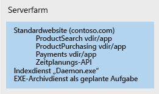
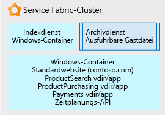

# Verwenden von Service Fabric zum Zerlegen monolithischer Anwendungen

In diesem Beispielszenario wird Schritt für Schritt ein Ansatz beschrieben, bei dem [Service Fabric](/azure/service-fabric/service-fabric-overview) als Plattform zum Zerlegen einer unübersichtlichen monolithischen Anwendung verwendet wird. Wir sehen uns hier einen iterativen Ansatz zum Zerlegen einer IIS/ASP.NET-Website in eine Anwendung an, die sich aus mehreren verwaltbaren Microservices zusammensetzt.

Durch die Umstellung von einer monolithischen Architektur auf eine Microservicearchitektur ergeben sich die folgenden Vorteile:

- Sie können eine kleine, verständliche Codeeinheit ändern und nur diese Einheit bereitstellen.
- Für die Bereitstellung jeder Codeeinheit sind maximal einige Minuten erforderlich.
- Wenn in dieser kleinen Einheit ein Fehler enthalten ist, funktioniert nur diese Einheit nicht mehr, und es fällt nicht die gesamte Anwendung aus.
- Kleine Codeeinheiten können einfach und diskret auf mehrere Entwicklungsteams verteilt werden.
- Neue Entwickler können sich schnell und leicht mit der diskreten Funktionalität der einzelnen Einheiten vertraut machen.

In diesem Beispiel wird eine große IIS-Anwendung in einer Serverfarm verwendet, aber die Konzepte des iterativen Zerlegens und des Hostens können für alle Arten von großen Anwendungen verwendet werden. Für diese Lösung wird Windows genutzt, aber Service Fabric kann auch unter Linux ausgeführt werden. Die Lösung kann lokal, in Azure oder auf VM-Knoten unter dem Cloudanbieter Ihrer Wahl ausgeführt werden.

## Relevante Anwendungsfälle

Dieses Szenario ist für Organisationen mit großen monolithischen Webanwendungen relevant, für die Folgendes gilt:

- Auftreten von Fehlern bei kleineren Codeänderungen, die die gesamte Website zum Erliegen bringen.
- Releases dauern mehrere Tage, da das Release als Update für die gesamte Website durchgeführt werden muss.
- Lange Vorlaufzeiten beim Onboarding von neuen Entwicklern oder Teams aufgrund einer komplexen Codebasis, bei der einzelne Personen über ein unverhältnismäßig hohes Wissen verfügen müssen.

## Architecture

Indem Service Fabric als Hostingplattform verwendet wird, können wir eine große IIS-Website in eine Sammlung mit Microservices konvertieren. Dies ist hier dargestellt:

In der Abbildung wurden Teile einer großen IIS-Anwendung in die folgenden Bestandteile zerlegt:

- Einen Routing- oder Gatewaydienst, der eingehende Browseranforderungen akzeptiert und analysiert, um zu ermitteln, mit welchem Dienst sie verarbeitet werden sollen, und die Anforderung dann an den entsprechenden Dienst weiterleitet.
- Vier ASP.NET Core-Anwendungen, bei denen es sich formell um virtuelle Verzeichnisse unter der zentralen IIS-Website gehandelt hat, die als ASP.NET-Anwendungen ausgeführt wurden. Die Anwendungen wurden in eigene unabhängige Microservices unterteilt. Das Ergebnis ist, dass sie separat geändert, mit einer Versionsangabe versehen und aktualisiert werden können. In diesem Beispiel haben wir jede Anwendung mit .NET Core und ASP.NET Core umgeschrieben. Sie wurden als [Reliable Services](/azure/service-fabric/service-fabric-reliable-services-introduction) geschrieben, damit dafür der native Zugriff auf alle Funktionen und Vorteile der Service Fabric-Plattform möglich ist (Kommunikationsdienste, Integritätsberichte, Benachrichtigungen usw.).
- Einen Windows-Dienst mit dem Namen *Indexdienst*, der in einem Windows-Container angeordnet ist. So werden keine direkten Änderungen an der Registrierung des zugrunde liegenden Servers mehr vorgenommen, sondern es wird eine eigenständige Ausführung verwendet und die Bereitstellung mit allen Abhängigkeiten als einzelne Einheit ermöglicht.
- Einen Archivierungsdienst, bei dem es sich lediglich um eine ausführbare Datei handelt, die gemäß einem Zeitplan ausgeführt wird und einige Aufgaben für die Websites durchführt. Sie wird direkt als eigenständige ausführbare Datei gehostet, weil wir Folgendes ermittelt haben: Da sie ihre Aufgabe ohne Änderungen erfüllt, lohnt sich die Investition in die Änderung dieses Zustands nicht.

## Überlegungen

Die erste Herausforderung besteht darin, kleinere Codeelemente zu identifizieren, die aus der monolithischen Anwendung in Microservices konvertiert werden können. Diese Microservices können dann von der übergeordneten Anwendung aufgerufen werden. Im Laufe der Zeit wird die monolithische Anwendung auf iterative Weise in eine Sammlung mit diesen Microservices aufgebrochen, die von Entwicklern leicht verstanden, geändert und mit geringem Risiko schnell bereitgestellt werden können.

Service Fabric wurde gewählt, da hiermit die Ausführung aller Microservices in ihren unterschiedlichen Formen möglich ist. Es kann beispielsweise sein, dass Sie über eine Mischung aus eigenständigen ausführbaren Dateien, neuen kleineren Websites, neuen kleineren APIs, Diensten in Containern und ähnlichen Komponenten verfügen. Service Fabric kann alle diese Diensttypen in einem einzelnen Cluster kombinieren.

Um letztendlich zu dieser zerlegten Anwendung zu gelangen, haben wir einen iterativen Ansatz verwendet. Wir haben mit einer großen IIS/ASP.NET-Website auf einer Serverfarm begonnen. Ein einzelner Knoten der Serverfarm ist unten dargestellt. Er enthält die ursprüngliche Website mit mehreren virtuellen Verzeichnissen, einen zusätzlichen Windows-Dienst, der von der Website aufgerufen wird, und eine ausführbare Datei, mit der eine regelmäßige Wartung des Websitearchivs durchgeführt wird.

Bei der ersten Iteration des Entwicklungsprozesses werden die IIS-Website und die zugehörigen virtuellen Verzeichnisse in einem [Windows-Container](/azure/service-fabric/service-fabric-containers-overview) angeordnet. Aufgrund dieser Vorgehensweise kann die Website betriebsbereit bleiben, aber sie muss nicht eng an das Betriebssystem des zugrunde liegenden Serverknotens gebunden sein. Der Container wird vom zugrunde liegenden Service Fabric-Knoten ausgeführt und orchestriert, aber der Knoten muss keinen Zustand aufweisen, von dem die Website abhängig ist (Registrierungseinträge, Dateien usw.). Alle diese Elemente befinden sich im Container. Aus den gleichen Gründen haben wir auch den Indexdienst in einem Windows-Container angeordnet. Die Container können unabhängig bereitgestellt, mit Versionsangabe versehen und skaliert werden. Schließlich haben wir noch den Archivierungsdienst gehostet. Hierbei handelt es sich um eine einfache [eigenständige EXE-Datei](/azure/service-fabric/service-fabric-guest-executables-introduction) ohne besondere Anforderungen.

In der Abbildung unten ist dargestellt, wie unsere große Website jetzt teilweise in voneinander unabhängige Einheiten zerlegt wurde und bereit für die weitere Zerlegung ist, sofern dies zeitlich möglich ist.

Bei der weiteren Entwicklung liegt der Schwerpunkt auf dem Abtrennen des oben dargestellten großen Standardcontainers der Website. Jede ASP.NET-App (virtuelles Verzeichnis) wird einzeln aus dem Container entfernt und zu ASP.NET Core [Reliable Services](/azure/service-fabric/service-fabric-reliable-services-introduction) portiert.

Nachdem die einzelnen virtuellen Verzeichnisse abgetrennt wurden, wird die Standardwebsite als ASP.NET Core Reliable Service geschrieben, der eingehende Browseranforderungen akzeptiert und sie an die richtige ASP.NET-Anwendung leitet.

### Verfügbarkeit, Skalierbarkeit und Sicherheit

Service Fabric [kann unterschiedliche Formen von Microservices unterstützen](/azure/service-fabric/service-fabric-choose-framework), während Aufrufe, die dazwischen in demselben Cluster durchgeführt werden, schnell und einfach gehalten werden. Service Fabric ist ein [fehlertoleranter](/azure/service-fabric/service-fabric-availability-services) Cluster mit Selbstreparatur, der Container und ausführbare Dateien ausführen kann und sogar über eine native API für das direkte Schreiben von Microservices in den Cluster verfügt (oben beschriebene „Reliable Services“). Die Plattform ermöglicht parallele Upgrades und das Versehen mit Versionsangaben für die einzelnen Microservices. Sie können die Plattform anweisen, eine höhere oder niedrigere Anzahl von Microservices auszuführen, die im Service Fabric-Cluster verteilt sind, um nur für die benötigten Microservices das horizontale [Hoch- oder Herunterskalieren](/azure/service-fabric/service-fabric-concepts-scalability) durchzuführen.

Service Fabric ist ein Cluster, der auf einer Infrastruktur mit virtuellen (oder physischen) Knoten mit Netzwerk, Speicher und einem Betriebssystem basiert. Er verfügt also über eine Gruppe von Aufgaben für die Verwaltung, Wartung und Überwachung.

Außerdem sollten Sie die Governance und Steuerung des Clusters berücksichtigen. Genauso wie Sie nicht möchten, dass Benutzer willkürlich Datenbanken auf Ihrem Datenbankserver für die Produktion bereitstellen, sollen Benutzer auch im Service Fabric-Cluster nicht unbeaufsichtigt Anwendungen bereitstellen.

Mit Service Fabric können viele unterschiedliche [Anwendungsszenarien](/azure/service-fabric/service-fabric-application-scenarios) gehostet werden. Nehmen Sie sich etwas Zeit, um zu ermitteln, welche für Ihr Szenario geeignet sind.

## Preise

Für einen in Azure gehosteten Service Fabric-Cluster setzt sich der größte Teil der Kosten aus der Anzahl und Größe der Knoten in Ihrem Cluster zusammen. Azure ermöglicht die schnelle und einfache Erstellung eines Clusters, der auf der von Ihnen angegebenen Knotengröße basiert, aber die Computegebühren richten sich nach der Knotengröße multipliziert mit der Anzahl von Knoten.

Andere weniger hohe Kostenanteile sind die Speichergebühren für die virtuellen Datenträger jedes Knotens und die Gebühren für den ausgehenden Azure-Netzwerkdatenverkehr (z.B. aus Azure zum Browser eines Benutzers).

Damit Sie sich ein Bild von den Kosten machen können, haben wir ein Beispiel erstellt, in dem einige Standardwerte für die Clustergröße, das Netzwerk und den Speicher verwendet werden: Sehen Sie sich den [Preisrechner](https://azure.com/e/52dea096e5844d5495a7b22a9b2ccdde) an. Sie können die Werte in diesem Standardrechner in die für Sie relevanten Werte ändern.

## Nächste Schritte

Nehmen Sie sich etwas Zeit, um sich mit der Plattform vertraut zu machen, indem Sie die [Dokumentation](/azure/service-fabric/service-fabric-overview) durchlesen und sich die vielen unterschiedlichen [Anwendungsszenarien](/azure/service-fabric/service-fabric-application-scenarios) für Service Fabric ansehen. Die Dokumentation enthält Informationen dazu, woraus ein Cluster besteht, worauf er ausgeführt werden kann, welche Softwarearchitektur verwendet wird und welche Wartungsschritte ausgeführt werden.

Nutzen Sie die [Schnellstartanleitung](/azure/service-fabric/service-fabric-quickstart-dotnet), um eine Demonstration von Service Fabric für eine vorhandene .NET-Anwendung zu sehen.

Beginnen Sie damit, sich aus Sicht Ihrer aktuellen Anwendung Gedanken über ihre unterschiedlichen Funktionen zu machen. Wählen Sie eine Funktion aus, und überlegen Sie sich, wie Sie nur diese Funktion aus der Gesamtanwendung abtrennen können. Verwenden Sie bei diesem Ansatz jeweils nur ein einzelnes verständliches Element.

## Zugehörige Ressourcen

- [Erstellen von Microservices in Azure](/azure/architecture/microservices)
- [Service Fabric: Übersicht](/azure/service-fabric/service-fabric-overview)
- [Service Fabric-Programmiermodell](/azure/service-fabric/service-fabric-choose-framework)
- [Service Fabric-Verfügbarkeit](/azure/service-fabric/service-fabric-availability-services)
- [Skalierung in Service Fabric](/azure/service-fabric/service-fabric-concepts-scalability)
- [Service Fabric und Container](/azure/service-fabric/service-fabric-containers-overview)
- [Bereitstellen einer vorhandenen ausführbaren Datei für Service Fabric](/azure/service-fabric/service-fabric-guest-executables-introduction)
- [Übersicht über Reliable Services](/azure/service-fabric/service-fabric-reliable-services-introduction)
- [Service Fabric-Anwendungsszenarien](/azure/service-fabric/service-fabric-application-scenarios)