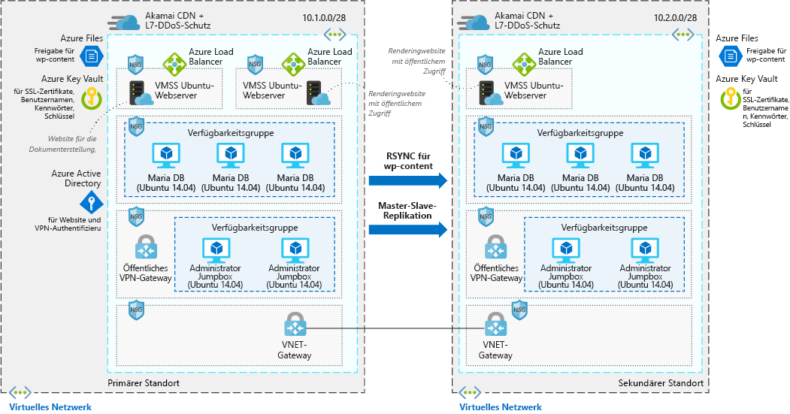

# Hochgradig skalierbare und sichere WordPress-Websites

Dieses Beispielszenario richtet sich an Unternehmen, die eine hochgradig skalierbare und sichere Installation von WordPress benötigen. Dieses Szenario basiert auf einer Bereitstellung, die für eine große Konvention verwendet wurde und erfolgreich skaliert werden konnte, um den Spitzenlasten gerecht zu werden, die auf der Website durch Sitzungen entstanden.

## Relevante Anwendungsfälle

Erwägen Sie dieses Szenario für folgende Anwendungsfälle:

* Medienereignisse, die einen raschen Datenverkehrsanstieg verursachen
* Blogs, die WordPress als Content Management-System nutzen
* Unternehmen oder E-Commerce-Websites, die WordPress verwenden
* Websites, die mit anderen Content Management-Systemen erstellt wurden

## Architecture

Dieses Szenario umfasst eine skalierbare und sichere WordPress-Installation, die Ubuntu-Webserver und MariaDB verwendet. In diesem Szenario erfolgen zwei unterschiedliche Datenflüsse. Der erste davon ist der Zugriff auf die Website durch Benutzer:

1. Benutzer greifen über ein CDN auf die Front-End-Website zu.
2. Das CDN verwendet einen Azure-Lastenausgleich als Ursprung und ruft alle nicht zwischengespeicherten Daten von dort ab.
3. Der Azure-Lastenausgleich verteilt Anforderungen an die VM-Skalierungsgruppen von Webservern.
4. Die WordPress-Anwendung ruft dynamische Informationen per Pull aus den MariaDB-Clustern ab, der gesamte statische Inhalt ist in Azure Files gehostet.
5. SSL-Schlüssel werden in Azure Key Vault gespeichert.

Mit dem zweiten Workflow tragen Autoren neuen Inhalt bei:

1. Autoren stellen eine sichere Verbindung mit dem öffentlichen VPN-Gateway her.
2. Informationen für die VPN-Authentifizierung werden in Azure Active Directory gespeichert.
3. Anschließend wird eine Verbindung mit den Administrator-Jumpboxes hergestellt.
4. Über die Administrator-Jumpbox kann der Autor dann eine Verbindung mit dem Azure-Lastenausgleich für den Dokumenterstellungscluster herstellen.
5. Der Azure-Lastenausgleich verteilt Datenverkehr an die VM-Skalierungsgruppe von Webservern, die Schreibzugriff auf den MariaDB-Cluster haben.
6. Neuer statischer Inhalt wird in Azure Files hochgeladen, und dynamischer Inhalt wird in den MariaDB-Cluster geschrieben.
7. Diese Änderungen werden dann über rsync oder die Replikation zwischen Primär- und Sekundärgerät in der alternativen Region repliziert.

### Komponenten

* [Azure Content Delivery Network (CDN)](/azure/cdn/cdn-overview) ist ein verteiltes Netzwerk mit Servern, über die Webinhalte auf effiziente Weise für Benutzer bereitgestellt werden. CDNs minimieren die Wartezeit, indem zwischengespeicherter Inhalt auf Edgeservern an POP-Standorten (Point-of-Presence) in der Nähe von Endbenutzern gespeichert wird.
* Mit [virtuellen Netzwerken](/azure/virtual-network/virtual-networks-overview) können Ressourcen, z.B. virtuelle Computer, auf sichere Weise miteinander, im Internet und mit lokalen Netzwerken kommunizieren. Virtuelle Netzwerke ermöglichen Isolation und Segmentierung, die Filterung und Weiterleitung von Datenverkehr und die Verbindungsherstellung zwischen Standorten. Die beiden Netzwerke sind über VNET-Peering verbunden.
* [Netzwerksicherheitsgruppen](/azure/virtual-network/security-overview) enthalten eine Liste mit Sicherheitsregeln, die ein- oder ausgehenden Netzwerkdatenverkehr basierend auf IP-Adresse, Port und Protokoll (für die Quelle bzw. das Ziel) zulassen oder ablehnen. Die virtuellen Netzwerke in diesem Szenario sind durch Netzwerksicherheitsgruppen-Regeln geschützt, mit denen der Datenverkehrsfluss zwischen den Anwendungskomponenten eingeschränkt wird.
* [Lastenausgleiche](/azure/load-balancer/load-balancer-overview) verteilen eingehenden Datenverkehr gemäß den Regeln und Integritätstests. Ein Lastenausgleichsmodul sorgt für niedrige Latenzen und einen hohen Durchsatz und kann eine Skalierung auf Millionen von Datenflüssen für alle TCP- und UDP-Anwendungen durchführen. In diesem Szenario wird ein Lastenausgleich verwendet, um Datenverkehr aus dem Content Delivery Network an die Front-End-Webserver zu verteilen.
* Mit [VM-Skalierungsgruppen][docs-vmss] können Sie eine Gruppe identischer virtueller Computer mit Lastenausgleich erstellen und verwalten. Die Anzahl von VM-Instanzen kann automatisch erhöht oder verringert werden, wenn sich der Bedarf ändert, oder es kann ein Zeitplan festgelegt werden. In diesem Szenario werden zwei separate VM-Skalierungsgruppen verwendet – eine für die Front-End-Webserver, die Inhalt bereitstellen, und eine für die Front-End-Webserver, die zum Erstellen neuer Inhalte dienen.
* [Azure Files](/azure/storage/files/storage-files-introduction) stellt eine vollständig verwaltete Dateifreigabe in der Cloud bereit, die den gesamten WordPress-Inhalt in diesem Szenario hostet, sodass alle virtuellen Computer Zugriff auf die Daten haben.
* [Azure Key Vault](/azure/key-vault/key-vault-overview) wird zum Speichern von Kennwörtern, Zertifikaten und Schlüsseln sowie zur strengen Kontrolle des Zugriffs auf diese verwendet.
* [Azure Active Directory (Azure AD)](/azure/active-directory/fundamentals/active-directory-whatis) ist ein mehrinstanzenfähiger cloudbasierter Verzeichnis- und Identitätsverwaltungsdienst. In diesem Szenario stellt Azure AD Authentifizierungsdienste für die Website und die VPN-Tunnel bereit.

### Alternativen

* [SQL Server für Linux](/azure/virtual-machines/linux/sql/sql-server-linux-virtual-machines-overview) kann den MariaDB-Datenspeicher ersetzen.
* [Azure Database for MySQL](/azure/mysql/overview) kann den MariaDB-Datenspeicher ersetzen, wenn Sie eine vollständig verwaltete Lösung bevorzugen.

## Überlegungen

### Verfügbarkeit

Die VM-Instanzen in diesem Szenario werden in mehreren Regionen bereitgestellt. Dabei werden die Daten zwischen den beiden über RSYNC für die WordPress-Inhalte und über die Replikation zwischen Primär- und Sekundärgerät für die MariaDB-Cluster repliziert.

Weitere Verfügbarkeitsthemen finden Sie im Azure Architecture Center in der [Checkliste für die Verfügbarkeit][availability].

### Skalierbarkeit

Dieses Szenario verwendet VM-Skalierungsgruppen für die beiden Front-End-Webservercluster in jeder Region. Mit Skalierungsgruppen kann die Anzahl von VM-Instanzen, die auf der Front-End-Anwendungsebene ausgeführt werden, als Reaktion auf eine veränderte Kundennachfrage oder basierend auf einem definierten Zeitplan automatisch skaliert werden. Weitere Informationen finden Sie unter [Übersicht über die automatische Skalierung mit VM-Skalierungsgruppen][docs-vmss-autoscale].

Das Back-End ist ein MariaDB-Cluster in einer Verfügbarkeitsgruppe. Weitere Informationen finden Sie im [Tutorial zum MariaDB-Cluster][mariadb-tutorial].

Weitere Skalierbarkeitsthemen finden Sie im Azure Architecture Center in der [Checkliste für die Skalierbarkeit][scalability].

### Sicherheit

Der gesamte Datenverkehr von virtuellen Netzwerken fließt über die Front-End-Anwendungsebene und wird mit Netzwerksicherheitsgruppen geschützt. Anhand von Regeln wird der Datenverkehrsfluss eingeschränkt, sodass nur die VM-Instanzen der Front-End-Anwendungsebene auf die Back-End-Datenbankebene zugreifen können. Es ist kein ausgehender Internetdatenverkehr von der Datenbankebene zulässig. Es werden keine Ports für die direkte Remoteverwaltung geöffnet, um die Angriffsfläche zu reduzieren. Weitere Informationen finden Sie unter [Azure-Netzwerksicherheitsgruppen][docs-nsg].

Allgemeine Informationen zur Entwicklung sicherer Szenarien finden Sie in der [Dokumentation zur Azure-Sicherheit][security].

### Resilienz

Dieses Szenario verwendet Azure-Lastenausgleiche in Kombination mit mehreren Regionen, Datenreplikation und VM-Skalierungsgruppen. Über diese Netzwerkkomponenten wird Datenverkehr auf die verbundenen VM-Instanzen verteilt, und es werden Integritätstests eingebunden, mit denen sichergestellt wird, dass Datenverkehr nur auf fehlerfreie virtuelle Computer verteilt wird. Alle diese Netzwerkkomponenten werden über ein CDN nach außen verfügbar gemacht. Mit dieser Konfiguration sind die Netzwerkressourcen und die Anwendung resilient gegenüber Problemen, die andernfalls zu einer Störung des Datenverkehrs und zu Auswirkungen auf den Zugriff durch Endbenutzer führen würden.

Allgemeine Informationen zur Entwicklung robuster Szenarien finden Sie unter [Entwerfen robuster Anwendungen für Azure][resiliency].

## Preise

Zur Ermittlung der Betriebskosten für dieses Szenario sind alle Dienste im Kostenrechner vorkonfiguriert. Wenn Sie wissen möchten, welche Kosten für Ihren spezifischen Anwendungsfall entstehen, passen Sie die entsprechenden Variablen an Ihren voraussichtlichen Datenverkehr an.

Wir haben ein vorkonfiguriertes [Kostenprofil][pricing] basierend auf dem obigen Architekturdiagramm bereitgestellt. Bei der Konfiguration des Preisrechners für Ihren Anwendungsfall sind einige wichtige Aspekte zu beachten:

* Wie viel GB an Datenverkehr erwarten Sie pro Monat? Die Menge des Datenverkehrs hat den größten Einfluss auf Ihre Kosten, da sie die Anzahl der virtuellen Computer bestimmt, die erforderlich sind, um die Daten in der VM-Skalierungsgruppe zugänglich zu machen. Darüber korreliert sie direkt mit der Menge an Daten, der über das CDN zugänglich gemacht werden.
* Wie viele neue Daten werden Sie auf Ihre Website schreiben? Neue Daten, die auf Ihre Website geschrieben werden, korrelieren mit der Menge an Daten, die in allen Regionen gespiegelt werden.
* Wie viel von Ihren Inhalt ist dynamisch? Wie viel ist statisch? Die Varianz rund um dynamische und statische Inhalte wirkt sich darauf aus, wie viele Daten von der Datenbankebene abgerufen und wie viele Daten im CDN zwischengespeichert werden.

<!-- links -->
[architecture]: ./media/architecture-secure-scalable-wordpress.png
[mariadb-tutorial]: /azure/virtual-machines/linux/classic/mariadb-mysql-cluster
[docs-vmss]: /azure/virtual-machine-scale-sets/overview
[docs-vmss-autoscale]: /azure/virtual-machine-scale-sets/virtual-machine-scale-sets-autoscale-overview
[docs-nsg]: /azure/virtual-network/security-overview
[security]: /azure/security/
[availability]: ../../checklist/availability.md
[resiliency]: /azure/architecture/resiliency/
[scalability]: /azure/architecture/checklist/scalability
[pricing]: https://azure.com/e/a8c4809dab444c1ca4870c489fbb196b
