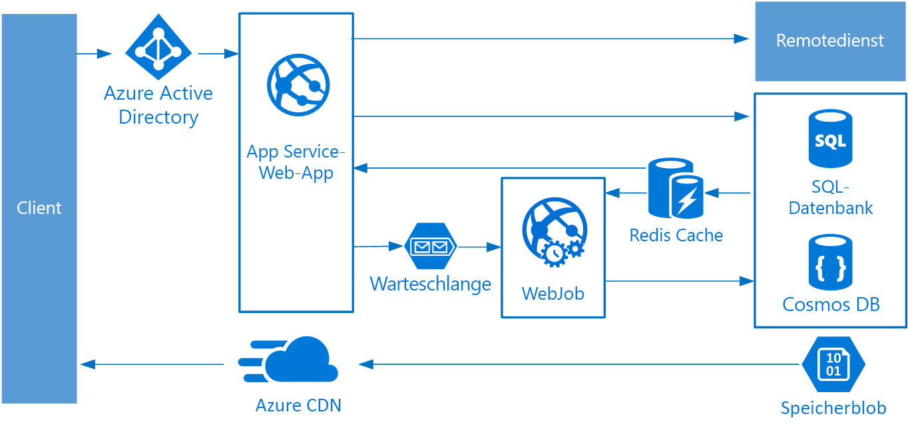

# Architekturstil „Web-Warteschlange-Worker“Web-Queue-Worker architecture style

Die Hauptkomponenten dieser Architektur sind ein **Web-Front-End**, mit dem Clientanforderungen bereitgestellt werden, und ein **Worker**, der ressourcenintensive Aufgaben, Workflows mit langer Ausführungsdauer oder Batchaufträge durchführt.The core components of this architecture are a **web front end** that serves client requests, and a **worker** that performs resource-intensive tasks, long-running workflows, or batch jobs.  Das Web-Front-End kommuniziert mit dem Worker über eine **Nachrichtenwarteschlange**.The web front end communicates with the worker through a **message queue**.

Andere Komponenten, die häufig in diese Architektur eingebunden werden, sind:Other components that are commonly incorporated into this architecture include:

- Eine oder mehrere DatenbankenOne or more databases.
- Ein Cache zum Speichern von Werten aus der Datenbank, um schnelle Lesevorgänge zu ermöglichenA cache to store values from the database for quick reads.
- CDN zur Bereitstellung von statischem InhaltCDN to serve static content
- Remotedienste, z.B. E-Mail- oder SMS-DienstRemote services, such as email or SMS service. (häufig von Drittanbietern bereitgestellt)Often these are provided by third parties.
- Identitätsanbieter für die AuthentifizierungIdentity provider for authentication.

Web und Worker sind jeweils zustandslos.The web and worker are both stateless. Der Sitzungsstatus kann in einem verteilten Cache zwischengespeichert werden.Session state can be stored in a distributed cache. Alle Vorgänge mit langer Ausführungsdauer werden asynchron vom Worker durchgeführt.Any long-running work is done asynchronously by the worker. Der Worker kann über Nachrichten in der Warteschlange ausgelöst oder nach einem Zeitplan für die Batchverarbeitung ausgeführt werden.The worker can be triggered by messages on the queue, or run on a schedule for batch processing. Der Worker ist eine optionale Komponente.The worker is an optional component. Wenn keine Vorgänge mit langer Ausführungsdauer vorhanden sind, kann der Worker weggelassen werden.If there are no long-running operations, the worker can be omitted.

Das Front-End kann aus einer Web-API bestehen.The front end might consist of a web API. Auf Clientseite kann die Web-API von einer Single-Page-Anwendung, die AJAX-Aufrufe durchführt, oder von einer nativen Clientanwendung genutzt werden.On the client side, the web API can be consumed by a single-page application that makes AJAX calls, or by a native client application.

## Einsatzmöglichkeiten für diese ArchitekturWhen to use this architecture

Die Architektur „Web-Warteschlange-Worker“ wird häufig mit verwalteten Computediensten implementiert (entweder Azure App Service oder Azure Cloud Services).The Web-Queue-Worker architecture is typically implemented using managed compute services, either Azure App Service or Azure Cloud Services.

Ziehen Sie diese Art von Architektur in folgenden Fällen in Betracht:Consider this architecture style for:

- Anwendungen mit einer relativ einfachen DomäneApplications with a relatively simple domain.
- Anwendungen mit Workflows mit langer Ausführungsdauer oder BatchvorgängenApplications with some long-running workflows or batch operations.
- Bei Verwendung von verwalteten Diensten anstelle von IaaS (Infrastructure-as-a-Service).When you want to use managed services, rather than infrastructure as a service (IaaS).

## VorteileBenefits

- Relativ einfache Architektur, die leicht zu verstehen istRelatively simple architecture that is easy to understand.
- Einfache Bereitstellung und VerwaltungEasy to deploy and manage.
- Klare Trennung von ZuständigkeitenClear separation of concerns.
- Das Front-End ist vom Worker per asynchronem Messaging entkoppeltThe front end is decoupled from the worker using asynchronous messaging.
- Front-End und Worker können unabhängig voneinander skaliert werdenThe front end and the worker can be scaled independently.

## HerausforderungenChallenges

- Ohne eine sorgfältige Vorgehensweise beim Entwerfen können das Front-End und der Worker zu großen, monolithischen Komponenten werden, die schwierig zu verwalten und zu aktualisieren sind.Without careful design, the front end and the worker can become large, monolithic components that are difficult to maintain and update.
- Es können versteckte Abhängigkeiten vorhanden sein, wenn das Front-End und der Worker Datenschemas oder Codemodule gemeinsam nutzen.There may be hidden dependencies, if the front end and worker share data schemas or code modules.

## Bewährte MethodenBest practices

- Machen Sie für den Client eine sorgfältig entworfene API verfügbar.Expose a well-designed API to the client. Siehe [API-Design][api-design].See [API design best practices][api-design].
- Führen Sie die automatische Skalierung durch, um Änderungen der Last zu bewältigen.Autoscale to handle changes in load. Siehe [Autoscaling][autoscaling] (Automatische Skalierung).See [Autoscaling best practices][autoscaling].
- Speichern Sie halbstatische Daten zwischen.Cache semi-static data. Siehe [Caching][caching].See [Caching best practices][caching].
- Verwenden Sie ein CDN zum Hosten von statischem Inhalt.Use a CDN to host static content. Siehe [Content Delivery Network][cdn].See [CDN best practices][cdn].
- Verwenden Sie „Polyglot Persistence“, falls zutreffend.Use polyglot persistence when appropriate. Siehe [Use the best data store for the job][polyglot] (Verwenden des besten Datenspeichers für den Auftrag).See [Use the best data store for the job][polyglot].
- Partitionieren Sie Daten, um die Skalierbarkeit zu verbessern, Konflikte zu reduzieren und die Leistung zu optimieren.Partition data to improve scalability, reduce contention, and optimize performance. Siehe [Data partitioning][data-partition] (Datenpartitionierung).See [Data partitioning best practices][data-partition].

## Web-Warteschlange-Worker in Azure App ServiceWeb-Queue-Worker on Azure App Service

In diesem Abschnitt wird eine empfohlene Architektur vom Typ „Web-Warteschlange-Worker“ beschrieben, für die Azure App Service verwendet wird.This section describes a recommended Web-Queue-Worker architecture that uses Azure App Service.

- Das Front-End wird als Azure App Service-Web-App, der Worker wird als Azure Functions-App implementiert.The front end is implemented as an Azure App Service web app, and the worker is implemented as an Azure Functions app. Die Web-App und Funktions-App werden beide einem App Service-Plan zugeordnet, über den die VM-Instanzen bereitgestellt werden.The web app and the function app are both associated with an App Service plan that provides the VM instances.

- Sie können entweder Azure Service Bus- oder Azure Storage-Warteschlangen als Nachrichtenwarteschlange verwenden.You can use either Azure Service Bus or Azure Storage queues for the message queue. (Im Diagramm ist eine Azure Storage-Warteschlange dargestellt.)(The diagram shows an Azure Storage queue.)

- Bei Azure Redis Cache werden der Sitzungszustand und andere Daten gespeichert, für die der Zugriff mit geringer Wartezeit erforderlich ist.Azure Redis Cache stores session state and other data that needs low latency access.

- Azure CDN wird verwendet, um statischen Inhalt zwischenzuspeichern, z.B. Images, CSS oder HTML.Azure CDN is used to cache static content such as images, CSS, or HTML.

- Wählen Sie für die Speicherung die Speichertechnologie aus, mit der die Anforderungen der Anwendung am besten erfüllt werden.For storage, choose the storage technologies that best fit the needs of the application. Sie können auch mehrere Speichertechnologien („Polyglot Persistence“) verwenden.You might use multiple storage technologies (polyglot persistence). Zur Verdeutlichung sind im Diagramm die Komponenten Azure SQL-Datenbank und Azure Cosmos DB dargestellt.To illustrate this idea, the diagram shows Azure SQL Database and Azure Cosmos DB.

Weitere Informationen finden Sie unter [Improve scalability in a web application][scalable-web-app] (Verbessern der Skalierbarkeit in einer Webanwendung).For more details, see [App Service web application reference architecture][scalable-web-app].

### Zusätzliche ÜberlegungenAdditional considerations

- Nicht jede Transaktion muss über die Warteschlange und den Worker in den Speicher verlaufen.Not every transaction has to go through the queue and worker to storage. Das Web-Front-End kann einfache Lese- und Schreibvorgänge direkt durchführen.The web front end can perform simple read/write operations directly. Worker sind für ressourcenintensive Aufgaben oder Workflows mit langer Ausführungsdauer ausgelegt.Workers are designed for resource-intensive tasks or long-running workflows. In einigen Fällen benötigen Sie unter Umständen gar keinen Worker.In some cases, you might not need a worker at all.

- Verwenden Sie die integrierte App Service-Funktion für die automatische Skalierung, um für die Anzahl von VM-Instanzen das horizontale Hochskalieren durchzuführen.Use the built-in autoscale feature of App Service to scale out the number of VM instances. Verwenden Sie die automatische Skalierung nach Zeitplan, wenn die Last der Anwendung vorhersagbaren Mustern folgt.If the load on the application follows predictable patterns, use schedule-based autoscale. Falls die Last nicht vorhersagbar ist, sollten Sie auf Metriken basierende Regeln für die automatische Skalierung nutzen.If the load is unpredictable, use metrics-based autoscaling rules.

- Erwägen Sie, die Web-App und Funktions-App in getrennten App Service-Plänen anzuordnen.Consider putting the web app and the function app into separate App Service plans. Auf diese Weise können sie unabhängig voneinander skaliert werden.That way, they can be scaled independently.

- Verwenden Sie separate App Service-Pläne für die Produktion und für das Testen.Use separate App Service plans for production and testing. Wenn Sie denselben Plan verwenden, bedeutet dies sonst, dass Ihre Tests auf den VMs für die Produktion durchgeführt werden.Otherwise, if you use the same plan for production and testing, it means your tests are running on your production VMs.

- Verwenden Sie Bereitstellungsslots, um die Bereitstellungen zu verwalten.Use deployment slots to manage deployments. So können Sie eine aktualisierte Version in einem Stagingslot bereitstellen und dann zur neuen Version wechseln.This lets you to deploy an updated version to a staging slot, then swap over to the new version. Außerdem können Sie zurück zur vorherigen Version wechseln, falls ein Problem mit dem Update auftritt.It also lets you swap back to the previous version, if there was a problem with the update.

<!-- links -->

[api-design]: ../../best-practices/api-design.md
[autoscaling]: ../../best-practices/auto-scaling.md
[caching]: ../../best-practices/caching.md
[cdn]: ../../best-practices/cdn.md
[data-partition]: ../../best-practices/data-partitioning.md
[polyglot]: ../design-principles/use-the-best-data-store.md
[scalable-web-app]: ../../reference-architectures/app-service-web-app/scalable-web-app.md