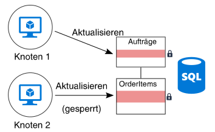
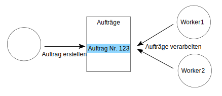

# Minimieren der KoordinationMinimize coordination

## Minimieren Sie die Koordination zwischen Anwendungsdiensten, um Skalierbarkeit zu erzielen.Minimize coordination between application services to achieve scalability

Die meisten Cloudanwendungen bestehen aus mehreren Anwendungsdiensten – Web-Front-Ends, Datenbanken, Geschäftsprozessen, Bericht- und Analysefunktionen und vielem mehr.Most cloud applications consist of multiple application services &mdash; web front ends, databases, business processes, reporting and analysis, and so on. Um Skalierbarkeit und Zuverlässigkeit zu erzielen, sollte jeder dieser Dienste auf mehreren Instanzen ausgeführt werden.To achieve scalability and reliability, each of those services should run on multiple instances.

Was passiert, wenn zwei Instanzen versuchen, gleichzeitige Vorgänge auszuführen, die einen gemeinsamen Status betreffen?What happens when two instances try to perform concurrent operations that affect some shared state? In einigen Fällen muss eine Koordination zwischen den Knoten stattfinden, um beispielsweise die Einhaltung von ACID-Garantien (Atomarität, Konsistenz, Isolation, Dauerhaftigkeit) sicherzustellen.In some cases, there must be coordination across nodes, for example to preserve ACID guarantees. In diesem Diagramm wartet `Node2` auf `Node1`, um eine Datenbanksperre aufzuheben:In this diagram, `Node2` is waiting for `Node1` to release a database lock:

Die Koordination schränkt die Vorteile der horizontalen Skalierung ein und verursacht Engpässe.Coordination limits the benefits of horizontal scale and creates bottlenecks. In diesem Beispiel werden Sie vermehrt Sperrkonflikte bemerken, wenn Sie die Anwendung horizontal hochskalieren und weitere Instanzen hinzufügen.In this example, as you scale out the application and add more instances, you'll see increased lock contention. Im schlimmsten Fall warten die Front-End-Instanzen den größten Teil ihrer Zeit auf Sperren.In the worst case, the front-end instances will spend most of their time waiting on locks.

Eine „Exactly-Once“-Semantik ist eine weitere häufige Quelle der Koordination."Exactly once" semantics are another frequent source of coordination. Ein Beispiel: Ein Auftrag muss genau einmal verarbeitet werden.For example, an order must be processed exactly once. Zwei Worker lauschen auf neue Aufträge.Two workers are listening for new orders. `Worker1` nimmt einen Auftrag zur Verarbeitung an.`Worker1` picks up an order for processing. Die Anwendung muss sicherstellen, dass einerseits `Worker2` keine doppelte Arbeit verrichtet und dass andererseits der Auftrag nicht verworfen wird, wenn `Worker1` abstürzt.The application must ensure that `Worker2` doesn't duplicate the work, but also if `Worker1` crashes, the order isn't dropped.

Sie können ein Muster wie [Scheduler-Agent-Supervisor][sas-pattern] verwenden, um die Koordination zwischen den Workern sicherzustellen. In diesem Fall wäre allerdings eine Partitionierung der Aufgaben vermutlich der bessere Ansatz.You can use a pattern such as [Scheduler Agent Supervisor][sas-pattern] to coordinate between the workers, but in this case a better approach might be to partition the work. Jedem Worker wird ein bestimmter Auftragsbereich zugewiesen (beispielsweise getrennt nach Abrechnungsregion).Each worker is assigned a certain range of orders (say, by billing region). Wenn ein Worker abstürzt, nimmt eine neue Instanz die Verarbeitung an der Stelle auf, an der die vorherige Instanz aufgehört hat, aber es entstehen keine Konflikte durch mehrere Instanzen.If a worker crashes, a new instance picks up where the previous instance left off, but multiple instances aren't contending.

## EmpfehlungenRecommendations

**Implementieren Sie die letztliche Konsistenz**.**Embrace eventual consistency**. Wenn Daten verteilt sind, ist Koordination erforderlich, um Garantien für hohe Konsistenz zu erzwingen.When data is distributed, it takes coordination to enforce strong consistency guarantees. Ein Beispiel: Ein Vorgang aktualisiert zwei Datenbanken.For example, suppose an operation updates two databases. Anstatt den Vorgang in einem einzelnen Transaktionsbereich zu platzieren, ist es besser, wenn das System für letztliche Konsistenz sorgen kann – eventuell durch Verwendung des Musters [Ausgleichende Transaktion][compensating-transaction] –, um nach einem Fehler logisch ein Rollback ausführen zu können.Instead of putting it into a single transaction scope, it's better if the system can accommodate eventual consistency, perhaps by using the [Compensating Transaction][compensating-transaction] pattern to logically roll back after a failure.

**Verwenden Sie Domänenereignisse, um den Zustand zu synchronisieren**.**Use domain events to synchronize state**. Ein [Domänenereignis][domain-event] ist ein Ereignis, das für die Domäne relevante Vorkommnisse aufzeichnet.A [domain event][domain-event] is an event that records when something happens that has significance within the domain. Interessierte Dienste können auf das Ereignis lauschen, anstatt eine globale Transaktion zu verwenden, um für die Koordination zwischen mehreren Diensten zu sorgen.Interested services can listen for the event, rather than using a global transaction to coordinate across multiple services. Bei diesem Ansatz muss das System die letztliche Konsistenz tolerieren (siehe vorherigen Punkt).If this approach is used, the system must tolerate eventual consistency (see previous item).

**Berücksichtigen Sie Muster wie CQRS (Command Query Responsibility Segregation) und Event Sourcing**.**Consider patterns such as CQRS and event sourcing**. Diese beiden Muster können dazu beitragen, Konflikte zwischen Lese- und Schreibworkloads zu reduzieren.These two patterns can help to reduce contention between read workloads and write workloads.

- Das [CQRS-Muster][cqrs-pattern] trennt Lesevorgänge von Schreibvorgängen.The [CQRS pattern][cqrs-pattern] separates read operations from write operations. In einigen Implementierungen sind die Lesedaten physisch von den Schreibdaten getrennt.In some implementations, the read data is physically separated from the write data.

- Beim [Event Sourcing-Muster][event-sourcing] werden Zustandsänderungen als eine Reihe von Ereignissen in einem nur zum Anfügen vorgesehenen Datenspeicher aufgezeichnet.In the [Event Sourcing pattern][event-sourcing], state changes are recorded as a series of events to an append-only data store. Das Anfügen eines Ereignisses an den Datenstrom ist ein atomischer Vorgang, der nur eine minimale Sperre erfordert.Appending an event to the stream is an atomic operation, requiring minimal locking.

Diese beiden Muster ergänzen sich.These two patterns complement each other. Wenn der lesegeschützte Speicher im CQRS-Muster das Event Sourcing verwendet, kann der schreibgeschützte Speicher auf die gleichen Ereignisse lauschen, um eine lesbare, für Abfragen optimierte Momentaufnahme des aktuellen Zustands zu erstellen.If the write-only store in CQRS uses event sourcing, the read-only store can listen for the same events to create a readable snapshot of the current state, optimized for queries. Bevor Sie CQRS oder Event Sourcing implementieren, sollten Sie sich jedoch über die Herausforderungen dieses Ansatzes im Klaren sein.Before adopting CQRS or event sourcing, however, be aware of the challenges of this approach. Weitere Informationen finden Sie unter [Architekturstil für CQRS][cqrs-style].For more information, see [CQRS architecture style][cqrs-style].

**Partitionieren Sie Daten**.**Partition data**.  Vermeiden Sie es, all Ihre Daten in ein Datenschema zu platzieren, das von vielen Anwendungsdiensten gemeinsam genutzt wird.Avoid putting all of your data into one data schema that is shared across many application services. Eine Microservicearchitektur unterstreicht dieses Prinzip, indem jeder Dienst für den eigenen Datenspeicher zuständig ist.A microservices architecture enforces this principle by making each service responsible for its own data store. Innerhalb einer Datenbank kann das Partitionieren von Daten in Shards die Parallelität verbessern, da ein Dienst, der Daten in einen Shard schreibt, sich nicht auf einen Dienst auswirkt, der Daten in einen anderen Shard schreibt.Within a single database, partitioning the data into shards can improve concurrency, because a service writing to one shard does not affect a service writing to a different shard.

**Entwerfen Sie idempotente Vorgänge**.**Design idempotent operations**. Entwerfen Sie Vorgänge nach Möglichkeit idempotent.When possible, design operations to be idempotent. Auf diese Weise können sie mit einer „Least-Once“-Semantik verarbeitet werden.That way, they can be handled using at-least-once semantics. Sie können z.B. Arbeitselemente in eine Warteschlange einreihen.For example, you can put work items on a queue. Wenn ein Worker während eines Vorgangs abstürzt, kann ein anderer Worker das Arbeitselement ganz einfach übernehmen.If a worker crashes in the middle of an operation, another worker simply picks up the work item.

**Verwenden Sie asynchrone parallele Verarbeitung**.**Use asynchronous parallel processing**. Wenn ein Vorgang mehrere Schritte erfordert, die asynchron ausgeführt werden (z.B. Remotedienstaufrufe), können Sie diese möglicherweise parallel aufrufen und die Ergebnisse aggregieren.If an operation requires multiple steps that are performed asynchronously (such as remote service calls), you might be able to call them in parallel, and then aggregate the results. Bei diesem Ansatz wird davon ausgegangen, dass kein Schritt von den Ergebnissen des vorherigen Schritts abhängig ist.This approach assumes that each step does not depend on the results of the previous step.

**Verwenden Sie nach Möglichkeit die optimistische Parallelität**.**Use optimistic concurrency when possible**. Bei der pessimistischen Parallelität werden Datenbanksperren verwendet, um Konflikte zu verhindern.Pessimistic concurrency control uses database locks to prevent conflicts. Dies kann zu eine unzureichenden Leistung führen und die Verfügbarkeit verringern.This can cause poor performance and reduce availability. Bei der optimistischen Parallelität ändert jede Transaktion eine Kopie oder Momentaufnahme der Daten.With optimistic concurrency control, each transaction modifies a copy or snapshot of the data. Wenn ein Commit für die Transaktion ausgeführt wird, überprüft die Datenbank-Engine die Transaktion und lehnt sie ab, wenn sie die Datenbankkonsistenz beeinträchtigen würde.When the transaction is committed, the database engine validates the transaction and rejects any transactions that would affect database consistency.

Azure SQL-Datenbank und SQL Server unterstützen die optimistische Parallelität durch [Momentaufnahmenisolation][sql-snapshot-isolation].Azure SQL Database and SQL Server support optimistic concurrency through [snapshot isolation][sql-snapshot-isolation]. Einige Azure-Speicherdienste unterstützen die optimistische Parallelität durch die Verwendung von ETags, z.B. [Azure Cosmos DB][cosmosdb-faq] und [Azure Storage][storage-concurrency].Some Azure storage services support optimistic concurrency through the use of Etags, including [Azure Cosmos DB][cosmosdb-faq] and [Azure Storage][storage-concurrency].

**Ziehen Sie MapReduce oder andere parallele, verteilte Algorithmen in Betracht**.**Consider MapReduce or other parallel, distributed algorithms**. Je nach Daten und der Art der auszuführenden Aufgaben können Sie die Aufgaben möglicherweise in unabhängige Tasks aufteilen, die von mehreren Knoten parallel ausgeführt werden können.Depending on the data and type of work to be performed, you may be able to split the work into independent tasks that can be performed by multiple nodes working in parallel. Weitere Informationen dazu finden Sie unter [Big Compute-Architekturstil][big-compute].See [Big compute architecture style][big-compute].

**Verwenden Sie die Auswahl einer übergeordneten Instanz für die Koordination**.**Use leader election for coordination**. In Fällen, in denen Sie Vorgänge koordinieren müssen, stellen Sie sicher, dass die koordinierende Instanz nicht zu einem Single Point of Failure in der Anwendung wird.In cases where you need to coordinate operations, make sure the coordinator does not become a single point of failure in the application. Bei Verwendung des [Musters für die Auswahl einer übergeordneten Instanz][leader-election] ist eine Instanz zu jedem Zeitpunkt übergeordnet und agiert als Koordinator.Using the [Leader Election pattern][leader-election], one instance is the leader at any time, and acts as the coordinator. Wenn die übergeordnete Instanz ausfällt, wird eine neue Instanz als übergeordnete Instanz ausgewählt.If the leader fails, a new instance is elected to be the leader.

<!-- links -->

[big-compute]: ../architecture-styles/big-compute.md
[compensating-transaction]: ../../patterns/compensating-transaction.md
[cqrs-style]: ../architecture-styles/cqrs.md
[cqrs-pattern]: ../../patterns/cqrs.md
[cosmosdb-faq]: /azure/cosmos-db/faq
[domain-event]: https://martinfowler.com/eaaDev/DomainEvent.html
[event-sourcing]: ../../patterns/event-sourcing.md
[leader-election]: ../../patterns/leader-election.md
[sas-pattern]: ../../patterns/scheduler-agent-supervisor.md
[sql-snapshot-isolation]: /sql/t-sql/statements/set-transaction-isolation-level-transact-sql
[storage-concurrency]: https://azure.microsoft.com/blog/managing-concurrency-in-microsoft-azure-storage-2/