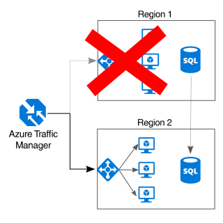

# Herstellen von Redundanz für alle AnwendungskomponentenMake all things redundant

## Schaffen von Redundanz in Ihrer Anwendung, um Ausfälle einzelner Komponenten zu verhindernBuild redundancy into your application, to avoid having single points of failure

In einer robusten Anwendung werden Ausfälle umgangen.A resilient application routes around failure. Identifizieren Sie die kritischen Pfade in Ihrer Anwendung.Identify the critical paths in your application. Ist die Redundanz an jedem Punkt des Pfads gewährleistet?Is there redundancy at each point in the path? Wird für die Anwendung ein Failover durchgeführt, wenn ein Subsystem ausfällt?If a subsystem fails, will the application fail over to something else?

## EmpfehlungenRecommendations 

**Berücksichtigen Sie die geschäftlichen Anforderungen.****Consider business requirements**. Der Umfang der Redundanz, die in ein System integriert ist, kann sich sowohl auf die Kosten als auch auf die Komplexität auswirken.The amount of redundancy built into a system can affect both cost and complexity. Ihre Architektur sollte an Ihren geschäftlichen Anforderungen ausgerichtet sein, z.B. der Recovery Time Objective (RTO).Your architecture should be informed by your business requirements, such as recovery time objective (RTO). Eine Bereitstellung in mehreren Regionen ist beispielsweise teurer als in nur einer Region und außerdem komplizierter zu verwalten.For example, a multi-region deployment is more expensive than a single-region deployment, and is more complicated to manage. Sie benötigen Verfahren zur Durchführung der Failover- und Failbackprozesse.You will need operational procedures to handle failover and failback. Die zusätzlichen Kosten und die höhere Komplexität sind für einige Geschäftsszenarien ggf. gerechtfertigt, während dies für andere nicht der Fall ist.The additional cost and complexity might be justified for some business scenarios and not others.

**Ordnen Sie VMs hinter einem Lastenausgleichsmodul an.****Place VMs behind a load balancer**. Verwenden Sie für unternehmenskritische Workloads keine einzelnen VMs.Don't use a single VM for mission-critical workloads. Ordnen Sie stattdessen mehrere VMs hinter einem Lastenausgleichsmodul an.Instead, place multiple VMs behind a load balancer. Wenn eine VM nicht mehr verfügbar ist, verteilt der Lastenausgleich den Datenverkehr auf die restlichen intakten VMs.If any VM becomes unavailable, the load balancer distributes traffic to the remaining healthy VMs. Informationen zur Bereitstellung dieser Konfiguration finden Sie unter [Run load-balanced VMs for scalability and availability][multi-vm-blueprint] (Ausführen von VMs mit Lastenausgleich zur Sicherstellung der Skalierbarkeit und Verfügbarkeit).To learn how to deploy this configuration, see [Multiple VMs for scalability and availability][multi-vm-blueprint].

**Replizieren Sie Datenbanken.****Replicate databases**. Bei Azure SQL-Datenbank und Cosmos DB werden die Daten automatisch in einer Region repliziert, und Sie können die Georeplikation regionsübergreifend aktivieren.Azure SQL Database and Cosmos DB automatically replicate the data within a region, and you can enable geo-replication across regions. Wählen Sie bei Verwendung einer IaaS-Datenbanklösung die Lösung, für die Replikation und Failover unterstützt werden, z.B. [Always On-Verfügbarkeitsgruppen (SQL Server)][sql-always-on].If you are using an IaaS database solution, choose one that supports replication and failover, such as [SQL Server Always On Availability Groups][sql-always-on]. 

**Aktivieren Sie die Georeplikation.****Enable geo-replication**. Bei der Georeplikation für [Azure SQL-Datenbank][sql-geo-replication] und [Cosmos DB][cosmosdb-geo-replication] werden sekundäre lesbare Replikate Ihrer Daten in einer oder mehreren Regionen erstellt.Geo-replication for [Azure SQL Database][sql-geo-replication] and [Cosmos DB][cosmosdb-geo-replication] creates secondary readable replicas of your data in one or more secondary regions. Bei einem Ausfall kann die Datenbank für Schreibvorgänge ein Failover in die sekundäre Region durchführen.In the event of an outage, the database can fail over to the secondary region for writes.

**Nutzen Sie die Partitionierung, um die Verfügbarkeit sicherzustellen.****Partition for availability**. Die Datenbankpartitionierung wird häufig verwendet, um die Skalierbarkeit zu verbessern, aber auch die Verfügbarkeit kann damit verbessert werden.Database partitioning is often used to improve scalability, but it can also improve availability. Wenn ein Shard ausfällt, sind die anderen Shards weiterhin erreichbar.If one shard goes down, the other shards can still be reached. Ein Ausfall in einem Shard führt nur zu einer Störung einer Teilmenge der gesamten Transaktionen.A failure in one shard will only disrupt a subset of the total transactions. 

**Führen Sie die Bereitstellung in mehr als einer Region durch.****Deploy to more than one region**. Die höchste Verfügbarkeit erzielen Sie, indem Sie die Anwendung in mehr als einer Region bereitstellen.For the highest availability, deploy the application to more than one region. Für den seltenen Fall, dass ein Problem eine gesamte Region betrifft, kann für die Anwendung dann ein Failover in eine andere Region erfolgen.That way, in the rare case when a problem affects an entire region, the application can fail over to another region. Im folgenden Diagramm ist eine in mehreren Regionen angeordnete Anwendung dargestellt, für die Azure Traffic Manager zur Durchführung von Failovern verwendet wird.The following diagram shows a multi-region application that uses Azure Traffic Manager to handle failover.

**Synchronisieren Sie Front-End- und Back-End-Failover.****Synchronize front and backend failover**. Nutzen Sie Azure Traffic Manager für das Failover des Front-Ends.Use Azure Traffic Manager to fail over the front end. Wenn das Front-End in einer Region nicht mehr erreichbar ist, leitet Traffic Manager neue Anforderungen an die sekundäre Region weiter.If the front end becomes unreachable in one region, Traffic Manager will route new requests to the secondary region. Je nach Datenbanklösung müssen Sie das Failover für die Datenbank ggf. koordinieren.Depending on your database solution, you may need to coordinate failing over the database. 

**Verwenden Sie automatische Failover und manuelle Failbacks.****Use automatic failover but manual failback**. Nutzen Sie Traffic Manager für automatische Failover, aber nicht für automatische Failbacks.Use Traffic Manager for automatic failover, but not for automatic failback. Beim automatischen Failback besteht das Risiko, dass Sie zur primären Region wechseln, bevor die Region vollständig fehlerfrei ist.Automatic failback carries a risk that you might switch to the primary region before the region is completely healthy. Überprüfen Sie vor einem manuellen Failback stattdessen, ob alle Subsysteme der Anwendung fehlerfrei sind.Instead, verify that all application subsystems are healthy before manually failing back. Je nach Datenbank müssen Sie vor einem Failback unter Umständen auch die Datenkonsistenz prüfen.Also, depending on the database, you might need to check data consistency before failing back.

**Stellen Sie für Traffic Manager die Redundanz sicher.****Include redundancy for Traffic Manager**. Traffic Manager ist ein möglicher Fehlerpunkt.Traffic Manager is a possible failure point. In der Vereinbarung zum Servicelevel (SLA) für Traffic Manager erfahren Sie, ob Ihre geschäftlichen Anforderungen für Hochverfügbarkeit mit Traffic Manager allein erfüllt werden.Review the Traffic Manager SLA, and determine whether using Traffic Manager alone meets your business requirements for high availability. Wenn dies nicht der Fall ist, sollten Sie als Failback eine andere Verwaltungslösung für den Datenverkehr erwägen.If not, consider adding another traffic management solution as a failback. Wenn der Azure Traffic Manager-Dienst fehlerhaft ist, ändern Sie die CNAME-Einträge im DNS so, dass diese auf die andere Verwaltungslösung für den Datenverkehr verweisen.If the Azure Traffic Manager service fails, change your CNAME records in DNS to point to the other traffic management service.

<!-- links -->

[multi-vm-blueprint]: ../../reference-architectures/virtual-machines-windows/multi-vm.md

[cassandra]: https://cassandra.apache.org/
[cosmosdb-geo-replication]: /azure/cosmos-db/distribute-data-globally
[sql-always-on]: https://msdn.microsoft.com/library/hh510230.aspx
[sql-geo-replication]: /azure/sql-database/sql-database-geo-replication-overview
