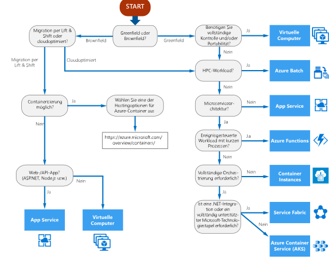

# Entscheidungsstruktur für Azure-ComputediensteDecision tree for Azure compute services

Azure bietet eine Vielzahl von Möglichkeiten zum Hosten Ihres Anwendungscodes.Azure offers a number of ways to host your application code. Der Begriff *Compute* bezieht sich auf das Hostingmodell für die Computeressourcen, auf denen Ihre Anwendung ausgeführt wird.The term *compute* refers to the hosting model for the computing resources that your application runs on. Das folgende Flussdiagramm unterstützt Sie bei der Auswahl eines Computediensts für Ihre Anwendung.The following flowchart will help you to choose a compute service for your application. Das Flussdiagramm führt Sie durch eine Reihe wichtiger Entscheidungskriterien, um eine Empfehlung zu erzielen.The flowchart guides you through a set of key decision criteria to reach a recommendation. 

**Betrachten Sie dieses Flussdiagramm als Ausgangspunkt.****Treat this flowchart as a starting point.** Da jede Anwendung besondere Anforderungen aufweist, betrachten Sie die Empfehlung als Ausgangspunkt.Every application has unique requirements, so use the recommendation as a starting point. Führen Sie dann eine ausführlichere Auswertung durch, bei der Sie z.B. folgende Aspekte betrachten:Then perform a more detailed evaluation, looking at aspects such as:
 
- FunktionsumfangFeature set
- [DiensteinschränkungenService limits](/azure/azure-subscription-service-limits)
- [KostenCost](https://azure.microsoft.com/pricing/)
- [SLASLA](https://azure.microsoft.com/support/legal/sla/)
- [Regionale VerfügbarkeitRegional availability](https://azure.microsoft.com/global-infrastructure/services/)
- Entwicklerökosystem und TeamkenntnisseDeveloper ecosystem and team skills
- [Kriterien für die Auswahl einer Azure-Compute-OptionCompute comparison tables](./compute-comparison.md)

Wenn Ihre Anwendung aus mehreren Workloads besteht, bewerten Sie jede Workload getrennt.If your application consists of multiple workloads, evaluate each workload separately. Eine vollständige Lösung kann zwei oder mehr Computedienste umfassen.A complete solution may incorporate two or more compute services.

## FlussdiagrammFlowchart

## DefinitionenDefinitions

- **Greenfield** beschreibt ein völlig neues Softwareprojekt, das von Grund auf neu erstellt wird.**Greenfield** describes a software project that is completely new and built from scratch. Es enthält keinen Legacycode.It does not include legacy code. 

- **Brownfield** beschreibt ein Softwareprojekt, das auf einer vorhandenen Anwendung basiert.**Brownfield** describes a software project that builds on an existing application. Es enthält unter Umständen Legacycode oder -frameworks.It may inherit legacy code or frameworks.

- **Lift und Shift** ist eine Strategie zum Migrieren einer Workload zur Cloud ohne Überarbeitung der Anwendung oder Änderung des Codes.**Lift and shift** is a strategy for migrating a workload to the cloud without redesigning the application or making code changes. Dies wird auch als *erneutes Hosten* bezeichnet.Also called *rehosting*. Weitere Informationen finden Sie im [Azure-Migrationscenter](https://azure.microsoft.com/migration/).For more information, see [Azure migration center](https://azure.microsoft.com/migration/).

- **Cloudoptimierung** ist eine Strategie für die Migration zur Cloud durch Umgestaltung einer Anwendung, um cloudeigene Features und Funktionen zu nutzen.**Cloud optimized** is a strategy for migrating to the cloud by refactoring an application to take advantage of cloud-native features and capabilities.

## Nächste SchritteNext steps

Weitere Aspekte, die berücksichtigt werden sollten, finden Sie unter [Kriterien für die Auswahl einer Azure-Compute-Option](./compute-comparison.md).For additional criteria to consider, see [Criteria for choosing an Azure compute service](./compute-comparison.md).
