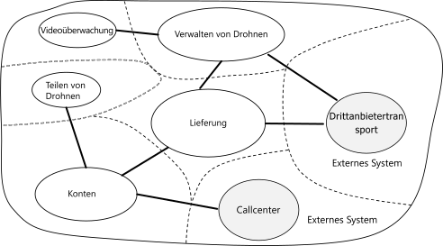

# Verwenden der Domänenanalyse zur Modellierung von MicroservicesUsing domain analysis to model microservices

Eine der größten Herausforderungen in Bezug auf Microservices besteht darin, die Grenzen der einzelnen Dienste zu definieren.One of the biggest challenges of microservices is to define the boundaries of individual services. Eine allgemeine Regel besagt, dass ein Dienst nur einem Zweck dienen soll. Die Umsetzung dieser Regel in die Praxis bedarf jedoch sorgfältiger Überlegung.The general rule is that a service should do "one thing" &mdash; but putting that rule into practice requires careful thought. Es gibt keinen mechanischen Prozess, mit dem das „richtige“ Design erzielt werden kann.There is no mechanical process that will produce the "right" design. Es ist erforderlich, dass Sie sich eingehend mit Ihrer Geschäftsdomäne und den dazugehörigen Anforderungen und Zielen beschäftigen.You have to think deeply about your business domain, requirements, and goals. Andernfalls erhalten Sie unter Umständen ein planloses Design mit einigen unerwünschten Merkmalen, z.B. versteckten Abhängigkeiten zwischen Diensten, zu enger Kopplung oder schlecht entworfenen Schnittstellen.Otherwise, you can end up with a haphazard design that exhibits some undesirable characteristics, such as hidden dependencies between services, tight coupling, or poorly designed interfaces. In diesem Artikel wird ein domänenbasierter Ansatz für den Entwurf von Microservices vorgestellt.This article shows a domain-driven approach to designing microservices.

Als Beispiel dient in diesem Artikel ein Drohnenlieferdienst.This article uses a drone delivery service as a running example. Weitere Informationen zum Szenario sowie die entsprechende Referenzimplementierung finden Sie [hier](../design/index.md).You can read more about the scenario and the corresponding reference implementation [here](../design/index.md).

## EinführungIntroduction

Microservices sollten basierend auf den geschäftlichen Funktionen entworfen werden, nicht auf horizontalen Ebenen wie dem Datenzugriff oder Messaging.Microservices should be designed around business capabilities, not horizontal layers such as data access or messaging. Außerdem sollten sie eine lose Kopplung und eine hohe funktionsbezogene Kohäsion aufweisen.In addition, they should have loose coupling and high functional cohesion. Microservices sind *lose gekoppelt*, wenn Sie einen Dienst ändern können, ohne dass gleichzeitig andere Dienste aktualisiert werden müssen.Microservices are *loosely coupled* if you can change one service without requiring other services to be updated at the same time. Ein Microservice ist *kohäsiv*, wenn er einem einzelnen, klar definierten Zweck dient, z.B. der Verwaltung von Benutzerkonten oder der Nachverfolgung des Lieferverlaufs.A microservice is *cohesive* if it has a single, well-defined purpose, such as managing user accounts or tracking delivery history. Ein Dienst sollte das Wissen des Geschäftsbereichs umfassen und dieses Wissen von den Clients abstrahieren.A service should encapsulate domain knowledge and abstract that knowledge from clients. Ein Client sollte beispielsweise dazu in der Lage sein, eine Drohne zu planen, ohne die Details des Planungsalgorithmus oder der Drohnenflottenverwaltung zu kennen.For example, a client should be able to schedule a drone without knowing the details of the scheduling algorithm or how the drone fleet is managed.

Bei dem am Geschäftsbereich ausgerichteten Entwurf (Domain-Driven Design, DDD) wird ein Framework bereitgestellt, mit dem Sie die meisten Voraussetzungen auf dem Weg zu einem guten Entwurf der Microservices bereits erfüllen können.Domain-driven design (DDD) provides a framework that can get you most of the way to a set of well-designed microservices. DDD verfügt über zwei separate Phasen: eine strategische und eine taktische Phase.DDD has two distinct phases, strategic and tactical. In der strategischen DDD-Phase definieren Sie die übergeordnete Struktur des Systems.In strategic DDD, you are defining the large-scale structure of the system. In dieser Phase können Sie sicherstellen, dass Ihre Architektur klar auf die geschäftlichen Funktionen ausgerichtet ist.Strategic DDD helps to ensure that your architecture remains focused on business capabilities. In der taktischen DDD-Phase wird eine Gruppe von Entwurfsmustern bereitgestellt, die Sie zum Erstellen des Domänenmodells verwenden können.Tactical DDD provides a set of design patterns that you can use to create the domain model. Zu diesen Mustern gehören Entitäten, Aggregate und Domänendienste.These patterns include entities, aggregates, and domain services. Diese taktischen Muster sind hilfreich beim Entwerfen von Microservices, die sowohl lose gekoppelt als auch kohäsiv sind.These tactical patterns will help you to design microservices that are both loosely coupled and cohesive.

In diesem und im nächsten Artikel werden die folgenden Schritte beschrieben und auf die Anwendung für die Drohnenlieferung (Drone Delivery) angewendet:In this article and the next, we'll walk through the following steps, applying them to the Drone Delivery application:

1. Zunächst analysieren wir die Geschäftsdomäne, um die funktionsbezogenen Anforderungen der Anwendung zu verstehen.Start by analyzing the business domain to understand the application's functional requirements. Das Ergebnis dieses Schritts ist eine informelle Beschreibung des Geschäftsbereichs, die zu einer formelleren Gruppe von Domänenmodellen verfeinert werden kann.The output of this step is an informal description of the domain, which can be refined into a more formal set of domain models.

2. Als Nächstes definieren wir die *Kontextgrenzen* der Domäne.Next, define the *bounded contexts* of the domain. Jeder Kontextgrenzenbereich enthält ein Domänenmodell, das eine bestimmte Unterdomäne der übergeordneten Anwendung darstellt.Each bounded context contains a domain model that represents a particular subdomain of the larger application.

3. Wenden Sie innerhalb einer Kontextgrenze taktische DDD-Muster an, um Entitäten, Aggregate und Domänendienste zu definieren.Within a bounded context, apply tactical DDD patterns to define entities, aggregates, and domain services.

4. Verwenden Sie die Ergebnisse des vorherigen Schritts, um die Microservices Ihrer Anwendung zu identifizieren.Use the results from the previous step to identify the microservices in your application.

In diesem Artikel werden die ersten drei Schritte behandelt, in denen es hauptsächlich um DDD geht.In this article, we cover the first three steps, which are primarily concerned with DDD. Im nächsten Artikel beschäftigen wir uns dann mit den Microservices.In the next article, we'll identify the microservices. Hierbei sollte aber unbedingt beachtet werden, dass DDD ein iterativer, fortlaufender Prozess ist.However, it's important to remember that DDD is an iterative, ongoing process. Dienstgrenzen sind nicht in Stein gemeißelt.Service boundaries aren't fixed in stone. Wenn sich eine Anwendung weiterentwickelt, treffen Sie unter Umständen die Entscheidung, dass ein Dienst in mehrere kleinere Dienste unterteilt werden soll.As an application evolves, you may decide to break apart a service into several smaller services.

> [!NOTE]
> In diesem Artikel wird keine vollständige und umfassende Domänenanalyse gezeigt.This article doesn't show a complete and comprehensive domain analysis. Wir haben das Beispiel absichtlich kurz gehalten, um die wichtigsten Punkte besser verdeutlichen zu können.We deliberately kept the example brief, to illustrate the main points. Weitere Hintergrundinformationen zu DDD finden Sie im Buch *Domain-Driven Design* von Eric Evans, in dem dieser Begriff zuerst verwendet wurde.For more background on DDD, we recommend Eric Evans' *Domain-Driven Design*, the book that first introduced the term. Eine andere gute Quelle ist *Implementing Domain-Driven Design* von Vaughn Vernon.Another good reference is *Implementing Domain-Driven Design* by Vaughn Vernon.

## Szenario: DrohnenlieferungScenario: Drone delivery

Fabrikam, Inc. führt einen Drohnenlieferdienst ein.Fabrikam, Inc. is starting a drone delivery service. Das Unternehmen verfügt über eine Drohnenflotte.The company manages a fleet of drone aircraft. Unternehmen registrieren sich bei dem Dienst, und Benutzer können eine Drohne anfordern, die auszuliefernde Waren abholt.Businesses register with the service, and users can request a drone to pick up goods for delivery. Wenn ein Kunde einen Abholtermin festlegt, weist ein Back-End-System eine Drohne zu und teilt dem Benutzer die voraussichtliche Lieferzeit mit.When a customer schedules a pickup, a backend system assigns a drone and notifies the user with an estimated delivery time. Während der Durchführung der Lieferung kann der Kunde die Position der Drohne nachverfolgen, und die voraussichtliche Ankunftszeit wird kontinuierlich aktualisiert.While the delivery is in progress, the customer can track the location of the drone, with a continuously updated ETA.

Dieses Szenario beinhaltet eine recht komplizierte Domäne.This scenario involves a fairly complicated domain. Zu den Anliegen des Unternehmens zählen unter anderem die Zeitplanung für die Drohnen, die Nachverfolgung von Paketen, die Verwaltung von Benutzerkonten sowie die Speicherung und Analyse von Verlaufsdaten.Some of the business concerns include scheduling drones, tracking packages, managing user accounts, and storing and analyzing historical data. Darüber hinaus ist Fabrikam an einer schnellen Marktreife interessiert und möchte dann zeitnah neue Features und Funktionen hinzufügen.Moreover, Fabrikam wants to get to market quickly and then iterate quickly, adding new functionality and capabilities. Die Anwendung muss cloudfähig sein und über ein hohes Servicelevelziel (Service Level Objective, SLO) verfügen.The application needs to operate at cloud scale, with a high service level objective (SLO). Fabrikam erwartet außerdem erhebliche Unterschiede bei den Datenspeicher- und Abfrageanforderungen der verschiedenen Systemkomponenten.Fabrikam also expects that different parts of the system will have very different requirements for data storage and querying. Aufgrund dieser Überlegungen hat sich Fabrikam bei seiner Drohnenlieferungsanwendung für eine Microservices-Architektur entschieden.All of these considerations lead Fabrikam to choose a microservices architecture for the Drone Delivery application.

## Analysieren der DomäneAnalyze the domain

Bei der Nutzung eines DDD-Ansatzes können Sie Microservices so entwerfen, dass jeder Dienst auf natürliche Weise zu einer funktionsbezogenen Geschäftsanforderung passt.Using a DDD approach will help you to design microservices so that every service forms a natural fit to a functional business requirement. Auf diese Weise können Sie es vermeiden, dass Ihr Entwurf durch organisatorische Grenzen oder die ausgewählte Technologie bestimmt wird.It can help you to avoid the trap of letting organizational boundaries or technology choices dictate your design.

Bevor Sie Code schreiben, müssen Sie sich einen allgemeinen Überblick über das zu erstellende System verschaffen.Before writing any code, you need a bird's eye view of the system that you are creating. Beim DDD-Ansatz wird zuerst die Geschäftsdomäne modelliert und ein *Domänenmodell* erstellt.DDD starts by modeling the business domain and creating a *domain model*. Das Domänenmodell ist ein abstraktes Modell der Geschäftsdomäne.The domain model is an abstract model of the business domain. Hiermit wird das Domänenwissen zusammengefasst und organisiert und eine gemeinsame Sprache für Entwickler und Domänenexperten gefunden.It distills and organizes domain knowledge, and provides a common language for developers and domain experts.

Beginnen Sie, indem Sie alle Geschäftsfunktionen und ihre Verbindungen zuordnen.Start by mapping all of the business functions and their connections. Dies ist normalerweise ein Vorgang, der von Domänenexperten, Softwarearchitekten und anderen Projektbeteiligten gemeinsam durchgeführt wird.This will likely be a collaborative effort that involves domain experts, software architects, and other stakeholders. Es muss kein bestimmter Formalismus eingehalten werden.You don't need to use any particular formalism.  Skizzieren Sie ein Diagramm, oder verwenden Sie ein Whiteboard.Sketch a diagram or draw on whiteboard.

Beim Erstellen des Diagramms können Sie damit beginnen, einzelne Unterdomänen zu identifizieren.As you fill in the diagram, you may start to identify discrete subdomains. Welche Funktionen sind eng verwandt?Which functions are closely related? Welche Funktionen sind für das Geschäft besonders wichtig, und welche Funktionen erfüllen Hilfszwecke?Which functions are core to the business, and which provide ancillary services? Was ist das Abhängigkeitsdiagramm?What is the dependency graph? Während dieser ersten Phase geht es nicht um Technologien oder Implementierungsdetails.During this initial phase, you aren't concerned with technologies or implementation details. Sie sollten sich aber darüber bewusst sein, an welchen Stellen die Anwendung in externe Systeme integriert werden muss, z.B. Systeme für CRM, Zahlungsverarbeitung oder Abrechnung.That said, you should note the place where the application will need to integrate with external systems, such as CRM, payment processing, or billing systems.

## Beispiel: DrohnenlieferungsanwendungExample: Drone delivery application

Nach der ersten Domänenanalyse hat das Fabrikam-Team eine grobe Skizze erstellt, in der die Domäne der Drohnenlieferung dargestellt ist.After some initial domain analysis, the Fabrikam team came up with a rough sketch that depicts the Drone Delivery domain.

- **Lieferung** ist in der Mitte des Diagramms angeordnet, weil dies der Kern des Geschäfts ist.**Shipping** is placed in the center of the diagram, because it's core to the business. Alle anderen Elemente des Diagramms dienen der Ermöglichung dieser Funktionalität.Everything else in the diagram exists to enable this functionality.
- Die **Drohnenverwaltung** ist auch ein wichtiger Teil des Geschäfts.**Drone management** is also core to the business. Funktionen, die eng mit der Drohnenverwaltung verbunden sind, sind die **Drohnenreparatur** und der Einsatz von **Predictive Analysis**, um vorherzusagen, wann für Drohnen Wartungsarbeiten durchgeführt werden müssen.Functionality that is closely related to drone management includes **drone repair** and using **predictive analysis** to predict when drones need servicing and maintenance.
- Mit der **ETA-Analyse** werden Schätzungen für den Zeitpunkt der Abholung und Lieferung bereitgestellt.**ETA analysis** provides time estimates for pickup and delivery.
- Mit dem **Drittanbietertransport** wird die Anwendung in die Lage versetzt, alternative Transportmethoden zu planen, falls ein Paket nicht vollständig per Drohne ausgeliefert werden kann.**Third-party transportation** will enable the application to schedule alternative transportation methods if a package cannot be shipped entirely by drone.
- Die **Drohnenvermietung** ist eine mögliche Erweiterung des Kerngeschäfts.**Drone sharing** is a possible extension of the core business. Unter Umständen verfügt das Unternehmen zu bestimmten Zeiten über überschüssige Drohnenkapazität, sodass Drohnen vermietet werden können, die andernfalls ungenutzt bleiben würden.The company may have excess drone capacity during certain hours, and could rent out drones that would otherwise be idle. Dieses Feature ist nicht Teil der ersten Releaseversion.This feature will not be in the initial release.
- Die **Videoüberwachung** ist ein weiterer Bereich, in den das Unternehmen später expandieren kann.**Video surveillance** is another area that the company might expand into later.
- **Benutzerkonten**, **Rechnungsstellung** und **Callcenter** sind Unterdomänen zur Unterstützung des Kerngeschäfts.**User accounts**, **Invoicing**, and **Call center** are subdomains that support the core business.

Beachten Sie, dass wir an diesem Punkt des Prozesses noch keinerlei Entscheidungen zur Implementierung oder zur Technologie getroffen haben.Notice that at this point in the process, we haven't made any decisions about implementation or technologies. Einige Untersysteme können externe Softwaresysteme oder Drittanbieterdienste betreffen.Some of the subsystems may involve external software systems or third-party services. Trotzdem muss die Anwendung mit diesen Systemen und Diensten interagieren, und es ist wichtig, sie in das Domänenmodell einzubinden.Even so, the application needs to interact with these systems and services, so it's important to include them in the domain model.

> [!NOTE]
> Wenn eine Anwendung von einem externen System abhängig ist, besteht das Risiko, dass das Datenschema oder die API des externen Systems in Ihre Anwendung hineinreicht und letztendlich den Entwurf der Architektur kompromittiert.When an application depends on an external system, there is a risk that the external system's data schema or API will leak into your application, ultimately compromising the architectural design. Dies gilt besonders für ältere Systeme, bei denen ggf. keine modernen bewährten Methoden befolgt und verworrene Datenschemas oder veraltete APIs verwendet werden.This is particularly true with legacy systems that may not follow modern best practices, and may use convoluted data schemas or obsolete APIs. In diesem Fall ist es wichtig, eine klar definierte Grenze zwischen diesen externen Systemen und der Anwendung einzurichten.In that case, it's important to have a well-defined boundary between these external systems and the application. Erwägen Sie zu diesem Zweck die Verwendung des [Einschnürungsmusters](../../patterns/strangler.md) oder des [Musters „Antibeschädigungsebene“](../../patterns/anti-corruption-layer.md).Consider using the [Strangler pattern](../../patterns/strangler.md) or the [Anti-Corruption Layer pattern](../../patterns/anti-corruption-layer.md) for this purpose.

## Definieren von KontextgrenzenDefine bounded contexts

Das Domänenmodell enthält Darstellungen von realen Dingen: Benutzer, Drohnen, Pakete usw.The domain model will include representations of real things in the world &mdash; users, drones, packages, and so forth. Dies bedeutet aber nicht, dass jeder Teil des Systems für dieselben Dinge die gleichen Darstellungen verwenden muss.But that doesn't mean that every part of the system needs to use the same representations for the same things.

Beispielsweise müssen Subsysteme, die für die Drohnenreparatur und Predictive Analytics zuständig sind, viele physische Merkmale von Drohnen darstellen, z.B. den Wartungsverlauf, Kilometerleistung, Alter, Modellnummer, Leistungsmerkmale usw.For example, subsystems that handle drone repair and predictive analysis will need to represent many physical characteristics drones, such as their maintenance history, mileage, age, model number, performance characteristics, and so on. Wenn es aber um die Planung einer Lieferung geht, kümmern wir uns nicht um diese Dinge.But when it's time to schedule a delivery, we don't care about those things. Das Subsystem für die Planung muss nur wissen, ob eine Drohne verfügbar ist und welcher geschätzte Zeitpunkt für die Abholung und die Lieferung gilt.The scheduling subsystem only needs to know whether a drone is available, and the ETA for pickup and delivery.

Wenn wir versuchen würden, ein gemeinsames Modell für beide Subsysteme zu erstellen, wäre dies ein unnötig komplexer Vorgang.If we tried to create a single model for both of these subsystems, it would be unnecessarily complex. Außerdem wäre es schwieriger, das Modell im Laufe der Zeit weiterzuentwickeln, da alle Änderungen die Zustimmung mehrerer Teams erhalten müssen, die an separaten Subsystemen arbeiten.It would also become harder for the model to evolve over time, because any changes will need to satisfy multiple teams working on separate subsystems. Daher ist es häufig besser, separate Modelle zu entwerfen, bei denen die gleiche reale Entität (in diesem Fall eine Drohne) in zwei unterschiedlichen Kontexten dargestellt wird.Therefore, it's often better to design separate models that represent the same real-world entity (in this case, a drone) in two different contexts. Jedes Modell enthält nur die Features und Attribute, die im jeweiligen Kontext relevant sind.Each model contains only the features and attributes that are relevant within its particular context.

An dieser Stelle wird auf das DDD-Konzept der *Kontextgrenzen* zurückgegriffen.This is where the DDD concept of *bounded contexts* comes into play. Eine Kontextgrenze bezeichnet einfach den abgegrenzten Bereich innerhalb einer Domäne, in dem ein bestimmtes Domänenmodell gilt.A bounded context is simply the boundary within a domain where a particular domain model applies. Wenn wir uns das obige Diagramm ansehen, können wir die Funktionalität danach gruppieren, ob von den einzelnen Funktionen ein Domänenmodell gemeinsam genutzt wird.Looking at the previous diagram, we can group functionality according to whether various functions will share a single domain model.

Kontextgrenzen bedeuten nicht unbedingt, dass Kontexte voneinander isoliert sind.Bounded contexts are not necessarily isolated from one another. In diesem Diagramm zeigen die durchgehenden Verbindungslinien zwischen den Kontextgrenzen die Stellen an, an denen die Kontexte zweier Kontextgrenzen interagieren.In this diagram, the solid lines connecting the bounded contexts represent places where two bounded contexts interact. Beispielsweise ist „Lieferung“ von „Benutzerkonten“ abhängig, um Informationen zu Kunden zu erhalten, und von „Drohnenverwaltung“, um die Drohnen der Flotte einplanen zu können.For example, Shipping depends on User Accounts to get information about customers, and on Drone Management to schedule drones from the fleet.

In seinem Buch *Domain Driven Design* beschreibt Eric Evans mehrere Muster zur Wahrung der Integrität eines Domänenmodells, wenn es mit dem Kontext einer anderen Kontextgrenze interagiert.In the book *Domain Driven Design*, Eric Evans describes several patterns for maintaining the integrity of a domain model when it interacts with another bounded context. Eines der wichtigsten Prinzipien von Microservices ist die Kommunikation der Dienste über klar definierte APIs.One of the main principles of microservices is that services communicate through well-defined APIs. Dieser Ansatz entspricht zwei Mustern, die von Eric Evans als „Open Host Service“ (Offener Hostdienst) und „Published Language“ (Veröffentlichte Sprache) bezeichnet werden.This approach corresponds to two patterns that Evans calls Open Host Service and Published Language. Bei „Open Host Service“ definiert ein Subsystem ein formelles Protokoll (API) für die Kommunikation mit anderen Subsystemen.The idea of Open Host Service is that a subsystem defines a formal protocol (API) for other subsystems to communicate with it. Mit „Published Language“ wird dieser Ansatz erweitert, indem die API in einer Form veröffentlicht wird, die von anderen Teams zum Schreiben von Clients genutzt werden kann.Published Language extends this idea by publishing the API in a form that other teams can use to write clients. Im Artikel [Designing APIs for microservices](../design/api-design.md) (Entwerfen von APIs für Microservices) wird die Verwendung der [OpenAPI-Spezifikation](https://www.openapis.org/specification/repo) (ehemals Swagger) beschrieben. Sie dient zum Definieren von sprachunabhängigen Schnittstellenbeschreibungen für REST-APIs, die im JSON- oder YAML-Format ausgedrückt werden.In the article [Designing APIs for microservices](../design/api-design.md), we discuss using [OpenAPI Specification](https://www.openapis.org/specification/repo) (formerly known as Swagger) to define language-agnostic interface descriptions for REST APIs, expressed in JSON or YAML format.

Im restlichen Teil dieser Vorgehensweise konzentrieren wir uns auf die Kontextgrenze „Lieferung“.For the rest of this journey, we will focus on the Shipping bounded context.

## Nächste SchritteNext steps

Nach Abschluss einer Domänenanalyse folgt die taktische DDD-Phase, in der Sie Ihre Domänenmodelle genauer definieren.After completing a domain analysis, the next step is to apply tactical DDD, to define your domain models with more precision.

> [!div class="nextstepaction"]
> [Taktische DDD-PhaseTactical DDD](./tactical-ddd.md)
