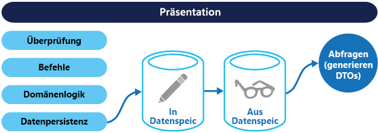

# <a name="command-and-query-responsibility-segregation-cqrs-pattern"></a><span data-ttu-id="47344-104">Muster „CQRS“ (Command and Query Responsibility Segregation)</span><span class="sxs-lookup"><span data-stu-id="47344-104">Command and Query Responsibility Segregation (CQRS) pattern</span></span>

[!INCLUDE [header](../_includes/header.md)]

<span data-ttu-id="47344-105">Trennen Sie mithilfe separater Schnittstellen Datenlesevorgänge von Vorgängen zur Aktualisierung von Daten.</span><span class="sxs-lookup"><span data-stu-id="47344-105">Segregate operations that read data from operations that update data by using separate interfaces.</span></span> <span data-ttu-id="47344-106">Dies kann die Leistung, Skalierbarkeit und Sicherheit maximieren.</span><span class="sxs-lookup"><span data-stu-id="47344-106">This can maximize performance, scalability, and security.</span></span> <span data-ttu-id="47344-107">Zudem unterstützt es die Entwicklung des Systems im Laufe der Zeit durch Erhöhung der Flexibilität und verhindert, dass Aktualisierungsbefehle zu Zusammenführungskonflikten auf Domänenebene führen.</span><span class="sxs-lookup"><span data-stu-id="47344-107">Supports the evolution of the system over time through higher flexibility, and prevents update commands from causing merge conflicts at the domain level.</span></span>

## <a name="context-and-problem"></a><span data-ttu-id="47344-108">Kontext und Problem</span><span class="sxs-lookup"><span data-stu-id="47344-108">Context and problem</span></span>

<span data-ttu-id="47344-109">In konventionellen Datenverwaltungssystemen werden Befehle (Datenaktualisierung) und Abfragen (Datenanforderungen) für die gleiche Gruppe von Entitäten in einem einzelnen Datenrepository ausgeführt.</span><span class="sxs-lookup"><span data-stu-id="47344-109">In traditional data management systems, both commands (updates to the data) and queries (requests for data) are executed against the same set of entities in a single data repository.</span></span> <span data-ttu-id="47344-110">Bei diesen Entitäten kann es sich um eine Teilmenge der Zeilen in einer oder mehreren Tabellen in einer relationalen Datenbank wie SQL Server handeln.</span><span class="sxs-lookup"><span data-stu-id="47344-110">These entities can be a subset of the rows in one or more tables in a relational database such as SQL Server.</span></span>

<span data-ttu-id="47344-111">In diesen Systemen werden alle CRUD-Vorgänge (Create, Read, Update and Delete) in der Regel auf dieselbe Entitätsdarstellung angewendet.</span><span class="sxs-lookup"><span data-stu-id="47344-111">Typically in these systems, all create, read, update, and delete (CRUD) operations are applied to the same representation of the entity.</span></span> <span data-ttu-id="47344-112">Beispielsweise wird ein Datenübertragungsobjekt (Data Transfer Object, DTO), das einen Kunden darstellt, mit der Datenzugriffsschicht (Data Access Layer, DAL) aus dem Datenspeicher abgerufen und auf dem Bildschirm angezeigt hat.</span><span class="sxs-lookup"><span data-stu-id="47344-112">For example, a data transfer object (DTO) representing a customer is retrieved from the data store by the data access layer (DAL) and displayed on the screen.</span></span> <span data-ttu-id="47344-113">Ein Benutzer aktualisiert einige Felder des DTO (möglicherweise durch Datenbindung), und das DTO wird dann wieder von der DAL im Datenspeicher gespeichert.</span><span class="sxs-lookup"><span data-stu-id="47344-113">A user updates some fields of the DTO (perhaps through data binding) and the DTO is then saved back in the data store by the DAL.</span></span> <span data-ttu-id="47344-114">Das gleiche DTO wird sowohl für Lese- als auch Schreibvorgänge verwendet.</span><span class="sxs-lookup"><span data-stu-id="47344-114">The same DTO is used for both the read and write operations.</span></span> <span data-ttu-id="47344-115">Die Abbildung zeigt eine konventionelle CRUD-Architektur.</span><span class="sxs-lookup"><span data-stu-id="47344-115">The figure illustrates a traditional CRUD architecture.</span></span>


<span data-ttu-id="47344-117">Konventionelle CRUD-Entwürfe sind gut geeignet, wenn nur eine begrenzte Geschäftslogik auf die Datenvorgänge angewendet wird.</span><span class="sxs-lookup"><span data-stu-id="47344-117">Traditional CRUD designs work well when only limited business logic is applied to the data operations.</span></span> <span data-ttu-id="47344-118">Die von Entwicklungstools bereitgestellten Gerüstmechanismen können sehr schnell Datenzugriffscodes erstellen, die dann bei Bedarf angepasst werden können.</span><span class="sxs-lookup"><span data-stu-id="47344-118">Scaffold mechanisms provided by development tools can create data access code very quickly, which can then be customized as required.</span></span>

<span data-ttu-id="47344-119">Die konventionelle CRUD-Vorgehensweise birgt jedoch auch einige Nachteile:</span><span class="sxs-lookup"><span data-stu-id="47344-119">However, the traditional CRUD approach has some disadvantages:</span></span>

- <span data-ttu-id="47344-120">Diese Vorgehensweise führt häufig zu einem Konflikt zwischen den Lese- und Schreibdarstellungen der Daten, beispielsweise aufgrund zusätzlicher Spalten oder Eigenschaften, die ordnungsgemäß aktualisiert werden müssen, auch wenn sie im Rahmen eines Vorgangs nicht erforderlich sind.</span><span class="sxs-lookup"><span data-stu-id="47344-120">It often means that there's a mismatch between the read and write representations of the data, such as additional columns or properties that must be updated correctly even though they aren't required as part of an operation.</span></span>

- <span data-ttu-id="47344-121">Bei dieser Vorgehensweise besteht das Risiko eines Datenkonflikts, wenn Datensätze im Datenspeicher in einer gemeinsamen Domäne gesperrt werden, in der mehrere Darsteller parallel in derselben Gruppe von Daten ausgeführt werden.</span><span class="sxs-lookup"><span data-stu-id="47344-121">It risks data contention when records are locked in the data store in a collaborative domain, where multiple actors operate in parallel on the same set of data.</span></span> <span data-ttu-id="47344-122">Anderenfalls werden Updatekonflikte durch gleichzeitige Updates verursacht, wenn eine optimistische Sperre verwendet wird.</span><span class="sxs-lookup"><span data-stu-id="47344-122">Or update conflicts caused by concurrent updates when optimistic locking is used.</span></span> <span data-ttu-id="47344-123">Diese Risiken steigen mit zunehmender Komplexität und steigendem Durchsatz des Systems.</span><span class="sxs-lookup"><span data-stu-id="47344-123">These risks increase as the complexity and throughput of the system grows.</span></span> <span data-ttu-id="47344-124">Darüber hinaus kann sich die konventionelle Vorgehensweise negativ auf die Leistung auswirken, was auf die Auslastung im Datenspeicher und der Datenzugriffsschicht sowie die Komplexität der zum Abrufen von Informationen erforderlichen Abfragen zurückzuführen ist.</span><span class="sxs-lookup"><span data-stu-id="47344-124">In addition, the traditional approach can have a negative effect on performance due to load on the data store and data access layer, and the complexity of queries required to retrieve information.</span></span>

- <span data-ttu-id="47344-125">Sie kann die Verwaltung von Sicherheitsfeatures und Berechtigungen verkomplizieren, da jede Entität sowohl Lese- als auch Schreibvorgängen unterworfen ist. Hierdurch werden Daten möglicherweise im falschen Kontext verfügbar gemacht.</span><span class="sxs-lookup"><span data-stu-id="47344-125">It can make managing security and permissions more complex because each entity is subject to both read and write operations, which might expose data in the wrong context.</span></span>

## <a name="solution"></a><span data-ttu-id="47344-126">Lösung</span><span class="sxs-lookup"><span data-stu-id="47344-126">Solution</span></span>

<span data-ttu-id="47344-127">CQRS (Command and Query Responsibility Segregation) ist ein Muster, das mittels separater Schnittstellen Datenlesevorgänge (Abfragen) von Datenaktualisierungsvorgängen (Befehle) trennt.</span><span class="sxs-lookup"><span data-stu-id="47344-127">Command and Query Responsibility Segregation (CQRS) is a pattern that segregates the operations that read data (queries) from the operations that update data (commands) by using separate interfaces.</span></span> <span data-ttu-id="47344-128">Folglich unterscheidet sich das für Abfragen verwendete Datenmodell von dem Datenmodell für Aktualisierungen.</span><span class="sxs-lookup"><span data-stu-id="47344-128">This means that the data models used for querying and updates are different.</span></span> <span data-ttu-id="47344-129">Die Modelle können dann wie in der folgenden Abbildung gezeigt isoliert werden, obwohl dies keine zwingende Voraussetzung ist.</span><span class="sxs-lookup"><span data-stu-id="47344-129">The models can then be isolated, as shown in the following figure, although that's not an absolute requirement.</span></span>


<span data-ttu-id="47344-131">Im Vergleich zu einem einzelnen Datenmodell, das in CRUD-basierten Systemen eingesetzt wird, führt die Verwendung von separaten Abfrage- und Updatemodellen für die Daten in CQRS-basierten Systemen zur Vereinfachung des Entwurfs und der Implementierung.</span><span class="sxs-lookup"><span data-stu-id="47344-131">Compared to the single data model used in CRUD-based systems, the use of separate query and update models for the data in CQRS-based systems simplifies design and implementation.</span></span> <span data-ttu-id="47344-132">Ein Nachteil besteht jedoch darin, dass CQRS-Codes im Gegensatz zu CRUD-Entwürfen nicht automatisch mithilfe von Gerüstmechanismen generiert werden können.</span><span class="sxs-lookup"><span data-stu-id="47344-132">However, one disadvantage is that unlike CRUD designs, CQRS code can't automatically be generated using scaffold mechanisms.</span></span>

<span data-ttu-id="47344-133">Das Abfragemodell zum Lesen von Daten und das Updatemodell zum Schreiben von Daten können auf denselben physischen Speicher zugreifen, z.B. durch die Verwendung von SQL-Ansichten oder Generierung von Projektionen im laufenden Betrieb.</span><span class="sxs-lookup"><span data-stu-id="47344-133">The query model for reading data and the update model for writing data can access the same physical store, perhaps by using SQL views or by generating projections on the fly.</span></span> <span data-ttu-id="47344-134">Es ist jedoch üblich, die Daten wie in der folgenden Abbildung gezeigt in verschiedenen physischen Speicher zu trennen, um die Leistung, Skalierbarkeit und Sicherheit zu maximieren.</span><span class="sxs-lookup"><span data-stu-id="47344-134">However, it's common to separate the data into different physical stores to maximize performance, scalability, and security, as shown in the next figure.</span></span>



<span data-ttu-id="47344-136">Beim Speicher für Lesevorgänge kann es sich um ein schreibgeschütztes Replikat des Speichers für Schreibvorgänge handeln. Anderenfalls können Speicher für Lese- und Schreibvorgänge grundlegend verschiedene Strukturen aufweisen.</span><span class="sxs-lookup"><span data-stu-id="47344-136">The read store can be a read-only replica of the write store, or the read and write stores can have a different structure altogether.</span></span> <span data-ttu-id="47344-137">Die Verwendung von mehreren schreibgeschützten Replikaten des Speichers für Lesevorgänge kann die Abfrageleistung und die Reaktionsfähigkeit der Anwendungsbenutzeroberfläche erheblich verbessern, insbesondere in verteilten Szenarien, in denen sich schreibgeschützte Replikate in der Nähe der Anwendungsinstanzen befinden.</span><span class="sxs-lookup"><span data-stu-id="47344-137">Using multiple read-only replicas of the read store can greatly increase query performance and application UI responsiveness, especially in distributed scenarios where read-only replicas are located close to the application instances.</span></span> <span data-ttu-id="47344-138">Einige Datenbanksysteme (SQL Server) bieten zur Maximierung der Verfügbarkeit zusätzliche Funktionen wie Failoverreplikate.</span><span class="sxs-lookup"><span data-stu-id="47344-138">Some database systems (SQL Server) provide additional features such as failover replicas to maximize availability.</span></span>

<span data-ttu-id="47344-139">Durch die Trennung von Speichern für Lese- und Schreibvorgänge kann können beide Speicher entsprechend der Auslastung skaliert werden.</span><span class="sxs-lookup"><span data-stu-id="47344-139">Separation of the read and write stores also allows each to be scaled appropriately to match the load.</span></span> <span data-ttu-id="47344-140">Beispielsweise ist in Speichern für Lesevorgänge in der Regel eine weitaus höhere Auslastung anzutreffen als bei Speichern für Schreibvorgänge.</span><span class="sxs-lookup"><span data-stu-id="47344-140">For example, read stores typically encounter a much higher load than write stores.</span></span>

<span data-ttu-id="47344-141">Wenn das Abfrage-/Lesemodell denormalisierte Daten enthält (siehe [Muster „Materialisierte Sichten“](./materialized-view.md)), wird die Leistung beim Lesen von Daten für jede der Sichten in einer Anwendung oder beim Abfragen der Daten im System maximiert.</span><span class="sxs-lookup"><span data-stu-id="47344-141">When the query/read model contains denormalized data (see [Materialized View pattern](./materialized-view.md)), performance is maximized when reading data for each of the views in an application or when querying the data in the system.</span></span>

## <a name="issues-and-considerations"></a><span data-ttu-id="47344-142">Probleme und Überlegungen</span><span class="sxs-lookup"><span data-stu-id="47344-142">Issues and considerations</span></span>

<span data-ttu-id="47344-143">Beachten Sie die folgenden Punkte bei der Entscheidung, wie dieses Muster implementiert werden soll:</span><span class="sxs-lookup"><span data-stu-id="47344-143">Consider the following points when deciding how to implement this pattern:</span></span>

- <span data-ttu-id="47344-144">Die Aufteilung des Datenspeichers in separate physische Speicher für Lese- und Schreibvorgänge kann die Leistung und Sicherheit eines Systems erhöhen – damit jedoch auch die Komplexität in Bezug auf Resilienz und letztliche Konsistenz.</span><span class="sxs-lookup"><span data-stu-id="47344-144">Dividing the data store into separate physical stores for read and write operations can increase the performance and security of a system, but it can add complexity in terms of resiliency and eventual consistency.</span></span> <span data-ttu-id="47344-145">Der Speicher mit dem Lesemodell muss aktualisiert werden, damit Änderungen am Speicher mit dem Schreibmodell übernommen werden. Zudem kann es schwierig sein, basierend auf veralteten Lesedaten festzustellen, wann ein Benutzer eine Anforderung gestellt hat. Dies bedeutet, dass der Vorgang nicht abgeschlossen werden kann.</span><span class="sxs-lookup"><span data-stu-id="47344-145">The read model store must be updated to reflect changes to the write model store, and it can be difficult to detect when a user has issued a request based on stale read data, which means that the operation can't be completed.</span></span>

    > <span data-ttu-id="47344-146">Eine Beschreibung der letztlichen Konsistenz finden Sie unter [Data Consistency Primer](https://msdn.microsoft.com/library/dn589800.aspx) (Grundlagen der Datenkonsistenz).</span><span class="sxs-lookup"><span data-stu-id="47344-146">For a description of eventual consistency see the [Data Consistency Primer](https://msdn.microsoft.com/library/dn589800.aspx).</span></span>

- <span data-ttu-id="47344-147">Es wird empfohlen, CQRS auf bestimmte Bereiche Ihres Systems anzuwenden, wo es den größten Nutzen bietet.</span><span class="sxs-lookup"><span data-stu-id="47344-147">Consider applying CQRS to limited sections of your system where it will be most valuable.</span></span>

- <span data-ttu-id="47344-148">Eine typische Vorgehensweise zur Bereitstellung von letztlicher Konsistenz besteht darin, die Ereignisherkunftsermittlung mit CQRS zu kombinieren, sodass das Schreibmodell ein ausschließlich anfügbarer Ereignisstrom ist, der durch die Ausführung von Befehlen gesteuert wird.</span><span class="sxs-lookup"><span data-stu-id="47344-148">A typical approach to deploying eventual consistency is to use event sourcing in conjunction with CQRS so that the write model is an append-only stream of events driven by execution of commands.</span></span> <span data-ttu-id="47344-149">Diese Ereignisse werden zur Aktualisierung von materialisierten Sichten verwendet, die als Lesemodell fungieren.</span><span class="sxs-lookup"><span data-stu-id="47344-149">These events are used to update materialized views that act as the read model.</span></span> <span data-ttu-id="47344-150">Weitere Informationen finden Sie unter [Ereignisherkunftsermittlung und CQRS](/azure/architecture/patterns/cqrs#event-sourcing-and-cqrs).</span><span class="sxs-lookup"><span data-stu-id="47344-150">For more information see [Event Sourcing and CQRS](/azure/architecture/patterns/cqrs#event-sourcing-and-cqrs).</span></span>

## <a name="when-to-use-this-pattern"></a><span data-ttu-id="47344-151">Verwendung dieses Musters</span><span class="sxs-lookup"><span data-stu-id="47344-151">When to use this pattern</span></span>

<span data-ttu-id="47344-152">Verwenden Sie dieses Muster in folgenden Situationen:</span><span class="sxs-lookup"><span data-stu-id="47344-152">Use this pattern in the following situations:</span></span>

- <span data-ttu-id="47344-153">Bei gemeinsamen Domänen, in denen mehrere Vorgänge parallel für dieselben Daten ausgeführt werden.</span><span class="sxs-lookup"><span data-stu-id="47344-153">Collaborative domains where multiple operations are performed in parallel on the same data.</span></span> <span data-ttu-id="47344-154">Mithilfe von CQRS können Sie Befehle mit ausreichender Granularität definieren, um Zusammenführungskonflikte auf Domänenebene (auftretende Konflikte können per Befehl zusammengeführt werden) zu minimieren, selbst wenn Sie scheinbar dieselben Datentypen aktualisieren.</span><span class="sxs-lookup"><span data-stu-id="47344-154">CQRS allows you to define commands with enough granularity to minimize merge conflicts at the domain level (any conflicts that do arise can be merged by the command), even when updating what appears to be the same type of data.</span></span>

- <span data-ttu-id="47344-155">Bei taskbasierten Benutzeroberflächen, bei denen Benutzer in mehreren Schritten oder mit komplexen Domänenmodellen durch einen komplizierten Prozess geführt werden.</span><span class="sxs-lookup"><span data-stu-id="47344-155">Task-based user interfaces where users are guided through a complex process as a series of steps or with complex domain models.</span></span> <span data-ttu-id="47344-156">Dies ist auch für Teams nützlich, die bereits mit DDD-Methoden (Domain-Driven Design) vertraut sind.</span><span class="sxs-lookup"><span data-stu-id="47344-156">Also, useful for teams already familiar with domain-driven design (DDD) techniques.</span></span> <span data-ttu-id="47344-157">Das Schreibmodell verfügt über einen vollständigen Befehlsverarbeitungsstapel mit Geschäftslogik, Eingabevalidierung und Geschäftsvalidierung, um sicherzustellen, dass sämtliche Elemente für jedes der Aggregate (jeden Cluster von verknüpften Objekten, die als Einheit für Datenänderungen behandelt werden) im Schreibmodell stets konsistent sind.</span><span class="sxs-lookup"><span data-stu-id="47344-157">The write model has a full command-processing stack with business logic, input validation, and business validation to ensure that everything is always consistent for each of the aggregates (each cluster of associated objects treated as a unit for data changes) in the write model.</span></span> <span data-ttu-id="47344-158">Das Lesemodell weist weder eine Geschäftslogik noch einen Validierungsstapel auf und gibt nur ein DTO zur Verwendung in einem Anzeigemodell zurück.</span><span class="sxs-lookup"><span data-stu-id="47344-158">The read model has no business logic or validation stack and just returns a DTO for use in a view model.</span></span> <span data-ttu-id="47344-159">Das Lesemodell ist letztlich konsistent mit dem Schreibmodell.</span><span class="sxs-lookup"><span data-stu-id="47344-159">The read model is eventually consistent with the write model.</span></span>

- <span data-ttu-id="47344-160">In Szenarien, in denen die Leistung von Datenlesevorgängen getrennt von der Leistung von Datenschreibvorgängen angepasst werden muss, insbesondere wenn das Verhältnis zwischen Lese-/Schreibvorgängen sehr hoch ist, und in denen eine horizontale Skalierung erforderlich ist.</span><span class="sxs-lookup"><span data-stu-id="47344-160">Scenarios where performance of data reads must be fine tuned separately from performance of data writes, especially when the read/write ratio is very high, and when horizontal scaling is required.</span></span> <span data-ttu-id="47344-161">Beispielsweise ist in vielen Systemen die Anzahl der Lesevorgänge um ein Vielfaches größer als die Anzahl der Schreibvorgänge.</span><span class="sxs-lookup"><span data-stu-id="47344-161">For example, in many systems the number of read operations is many times greater than the number of write operations.</span></span> <span data-ttu-id="47344-162">Um dies zu berücksichtigen, sollten Sie eine horizontale Skalierung des Lesemodells in Erwägung ziehen, das Schreibmodell jedoch nur auf mindestens einer Instanz ausführen.</span><span class="sxs-lookup"><span data-stu-id="47344-162">To accommodate this, consider scaling out the read model, but running the write model on only one or a few instances.</span></span> <span data-ttu-id="47344-163">Die Verwendung einer kleinen Anzahl von Schreibmodellinstanzen kann auch das Auftreten von Zusammenführungskonflikten minimieren.</span><span class="sxs-lookup"><span data-stu-id="47344-163">A small number of write model instances also helps to minimize the occurrence of merge conflicts.</span></span>

- <span data-ttu-id="47344-164">In Szenarien, in denen sich ein Entwicklerteam auf das komplexe Domänenmodell als Teil des Schreibmodells konzentrieren kann, während sich ein anderes Team auf das Lesemodell und die Benutzeroberflächen konzentrieren kann.</span><span class="sxs-lookup"><span data-stu-id="47344-164">Scenarios where one team of developers can focus on the complex domain model that is part of the write model, and another team can focus on the read model and the user interfaces.</span></span>

- <span data-ttu-id="47344-165">In Szenarien, in denen das System voraussichtlich im Laufe der Zeit weiterentwickelt wird und mehrere Versionen des Modells enthalten kann oder in denen sich Geschäftsregeln regelmäßig ändern.</span><span class="sxs-lookup"><span data-stu-id="47344-165">Scenarios where the system is expected to evolve over time and might contain multiple versions of the model, or where business rules change regularly.</span></span>

- <span data-ttu-id="47344-166">Bei der Integration in andere Systeme, insbesondere in Kombination mit Ereignisquellen, bei denen der vorübergehende Ausfall eines Subsystems nicht die Verfügbarkeit der anderen Systeme beeinträchtigen soll.</span><span class="sxs-lookup"><span data-stu-id="47344-166">Integration with other systems, especially in combination with event sourcing, where the temporal failure of one subsystem shouldn't affect the availability of the others.</span></span>

<span data-ttu-id="47344-167">Dieses Muster wird in folgenden Situationen empfohlen:</span><span class="sxs-lookup"><span data-stu-id="47344-167">This pattern isn't recommended in the following situations:</span></span>

- <span data-ttu-id="47344-168">Situationen, in denen die Domäne oder die Geschäftsregeln einfach sind</span><span class="sxs-lookup"><span data-stu-id="47344-168">Where the domain or the business rules are simple.</span></span>

- <span data-ttu-id="47344-169">Situationen, in denen eine einfache Benutzeroberfläche im CRUD-Stil und die damit verbundenen Datenzugriffsvorgänge ausreichen</span><span class="sxs-lookup"><span data-stu-id="47344-169">Where a simple CRUD-style user interface and the related data access operations are sufficient.</span></span>

- <span data-ttu-id="47344-170">Bei der systemweiten Implementierung.</span><span class="sxs-lookup"><span data-stu-id="47344-170">For implementation across the whole system.</span></span> <span data-ttu-id="47344-171">Es gibt bestimmte Komponenten eines umfassenden Datenverwaltungsszenarios, bei denen sich CQRS als nützlich erweisen kann. Wenn diese Vorgehensweise jedoch nicht benötigt wird, kann es jedoch die Komplexität unnötigerweise um ein Vielfaches vergrößern.</span><span class="sxs-lookup"><span data-stu-id="47344-171">There are specific components of an overall data management scenario where CQRS can be useful, but it can add considerable and unnecessary complexity when it isn't required.</span></span>

## <a name="event-sourcing-and-cqrs"></a><span data-ttu-id="47344-172">Ereignisherkunftsermittlung und CQRS</span><span class="sxs-lookup"><span data-stu-id="47344-172">Event Sourcing and CQRS</span></span>

<span data-ttu-id="47344-173">Das Muster „CQRS“ wird häufig zusammen mit dem Muster „Ereignisherkunftsermittlung“ verwendet.</span><span class="sxs-lookup"><span data-stu-id="47344-173">The CQRS pattern is often used along with the Event Sourcing pattern.</span></span> <span data-ttu-id="47344-174">CQRS-basierte Systeme verwenden getrennte Lese- und Schreibdatenmodelle, die auf ihre jeweiligen Tasks zugeschnitten sind und sich häufig in räumlich getrennten Speichern befinden.</span><span class="sxs-lookup"><span data-stu-id="47344-174">CQRS-based systems use separate read and write data models, each tailored to relevant tasks and often located in physically separate stores.</span></span> <span data-ttu-id="47344-175">Bei Verwendung mit dem Muster [Ereignisherkunftsermittlung](./event-sourcing.md) ist der Ereignisspeicher das Schreibmodell und stellt die offizielle Informationsquelle dar.</span><span class="sxs-lookup"><span data-stu-id="47344-175">When used with the [Event Sourcing pattern](./event-sourcing.md), the store of events is the write model, and is the official source of information.</span></span> <span data-ttu-id="47344-176">Das Lesemodell eines CQRS-basierten Systems bietet materialisierte Sichten der Daten, üblicherweise in Form von hochgradig denormalisierten Sichten.</span><span class="sxs-lookup"><span data-stu-id="47344-176">The read model of a CQRS-based system provides materialized views of the data, typically as highly denormalized views.</span></span> <span data-ttu-id="47344-177">Diese Sichten sind auf die Schnittstellen und die Anzeigeanforderungen der Anwendung zugeschnitten, wodurch sowohl die Anzeige- als auch die Abfrageleistung maximiert werden können.</span><span class="sxs-lookup"><span data-stu-id="47344-177">These views are tailored to the interfaces and display requirements of the application, which helps to maximize both display and query performance.</span></span>

<span data-ttu-id="47344-178">Durch die Verwendung des Ereignisdatenstroms als Speicher für Schreibvorgänge anstelle der eigentlichen Daten zu einem bestimmten Zeitpunkt werden Aktualisierungskonflikte in einem einzigen Aggregat vermieden und die Leistung sowie Skalierbarkeit maximiert.</span><span class="sxs-lookup"><span data-stu-id="47344-178">Using the stream of events as the write store, rather than the actual data at a point in time, avoids update conflicts on a single aggregate and maximizes performance and scalability.</span></span> <span data-ttu-id="47344-179">Mit den Ereignissen können materialisierte Sichten der Daten asynchron generiert werden, mit denen Speicher für Lesevorgänge aufgefüllt werden.</span><span class="sxs-lookup"><span data-stu-id="47344-179">The events can be used to asynchronously generate materialized views of the data that are used to populate the read store.</span></span>

<span data-ttu-id="47344-180">Da der Ereignisspeicher die offizielle Informationsquelle darstellt, ist es möglich, die materialisierten Sichten zu löschen und alle vergangenen Ereignisse erneut wiederzugeben, um eine neue Darstellung des aktuellen Zustands zu erstellen, wenn das System weiterentwickelt wird oder das Lesemodell geändert werden muss.</span><span class="sxs-lookup"><span data-stu-id="47344-180">Because the event store is the official source of information, it is possible to delete the materialized views and replay all past events to create a new representation of the current state when the system evolves, or when the read model must change.</span></span> <span data-ttu-id="47344-181">Bei den materialisierten Sichten handelt es sich praktisch um einen zuverlässigen schreibgeschützten Datencache.</span><span class="sxs-lookup"><span data-stu-id="47344-181">The materialized views are in effect a durable read-only cache of the data.</span></span>

<span data-ttu-id="47344-182">Bei der Verwendung von CQRS in Kombination mit dem Muster „Ereignisherkunftsermittlung“ sollten Sie Folgendes beachten:</span><span class="sxs-lookup"><span data-stu-id="47344-182">When using CQRS combined with the Event Sourcing pattern, consider the following:</span></span>

- <span data-ttu-id="47344-183">Wie bei jedem System, bei dem die Speicher für Lese- und Schreibvorgänge getrennt sind, sind die Systeme, die auf diesem Muster basieren, nur letztlich konsistent.</span><span class="sxs-lookup"><span data-stu-id="47344-183">As with any system where the write and read stores are separate, systems based on this pattern are only eventually consistent.</span></span> <span data-ttu-id="47344-184">Zwischen der Generierung des Ereignisses und der Aktualisierung des Datenspeichers wird eine gewisse Verzögerung auftreten.</span><span class="sxs-lookup"><span data-stu-id="47344-184">There will be some delay between the event being generated and the data store being updated.</span></span>

- <span data-ttu-id="47344-185">Das Muster erhöht die Komplexität, da Codes erstellt werden müssen, um Ereignisse zu initiieren und zu verarbeiten und die entsprechenden Ansichten oder Objekte, die für das Abfrage- oder Lesemodell erforderlich sind, zusammenzustellen oder zu aktualisieren.</span><span class="sxs-lookup"><span data-stu-id="47344-185">The pattern adds complexity because code must be created to initiate and handle events, and assemble or update the appropriate views or objects required by queries or a read model.</span></span> <span data-ttu-id="47344-186">Die Komplexität des Musters „CQRS“ in Verbindung mit dem Muster für die Ereignisherkunftsermittlung kann eine erfolgreiche Implementierung erschweren und erfordert eine andere Herangehensweise beim Entwurf von Systemen.</span><span class="sxs-lookup"><span data-stu-id="47344-186">The complexity of the CQRS pattern when used with the Event Sourcing pattern can make a successful implementation more difficult, and requires a different approach to designing systems.</span></span> <span data-ttu-id="47344-187">Die Ereignisherkunftsermittlung kann jedoch die Modellierung der Domäne vereinfachen. Zudem vereinfacht es das erneute Generieren von Ansichten oder Erstellen neuer Ansichten, da die Änderungsabsicht in den Daten erhalten bleibt.</span><span class="sxs-lookup"><span data-stu-id="47344-187">However, event sourcing can make it easier to model the domain, and makes it easier to rebuild views or create new ones because the intent of the changes in the data is preserved.</span></span>

- <span data-ttu-id="47344-188">Die Generierung materialisierter Sichten für die Verwendung im Lesemodell oder in Projektionen der Daten durch Wiedergabe und Verarbeitung der Ereignisse für bestimmte Entitäten oder Sammlungen von Entitäten kann eine enorme Verarbeitungszeit und einen immensen Ressourcenverbrauch zur Folge haben.</span><span class="sxs-lookup"><span data-stu-id="47344-188">Generating materialized views for use in the read model or projections of the data by replaying and handling the events for specific entities or collections of entities can require significant processing time and resource usage.</span></span> <span data-ttu-id="47344-189">Dies gilt insbesondere dann, wenn Werte über lange Zeiträume zu summieren oder zu analysieren sind, da eventuell alle zugehörigen Ereignisse untersucht werden müssen.</span><span class="sxs-lookup"><span data-stu-id="47344-189">This is especially true if it requires summation or analysis of values over long periods, because all the associated events might need to be examined.</span></span> <span data-ttu-id="47344-190">Dies lässt sich durch die Implementierung von Momentaufnahmen der Daten in geplanten Intervallen lösen, wie etwa der Gesamtzahl aufgetretener Aktionen oder des aktuellen Zustands einer Entität.</span><span class="sxs-lookup"><span data-stu-id="47344-190">Resolve this by implementing snapshots of the data at scheduled intervals, such as a total count of the number of a specific action that have occurred, or the current state of an entity.</span></span>

## <a name="example"></a><span data-ttu-id="47344-191">Beispiel</span><span class="sxs-lookup"><span data-stu-id="47344-191">Example</span></span>

<span data-ttu-id="47344-192">Der folgende Code zeigt einige Auszüge aus einem Beispiel einer CQRS-Implementierung, in der unterschiedliche Definitionen für das Lese- und das Schreibmodell verwendet werden.</span><span class="sxs-lookup"><span data-stu-id="47344-192">The following code shows some extracts from an example of a CQRS implementation that uses different definitions for the read and the write models.</span></span> <span data-ttu-id="47344-193">Die Modellschnittstellen legen keine Features der zugrundeliegenden Datenspeicher fest und können unabhängig voneinander weiterentwickelt und angepasst werden, da diese Schnittstellen getrennt sind.</span><span class="sxs-lookup"><span data-stu-id="47344-193">The model interfaces don't dictate any features of the underlying data stores, and they can evolve and be fine-tuned independently because these interfaces are separated.</span></span>

<span data-ttu-id="47344-194">Der folgende Code zeigt die Definition des Lesemodells.</span><span class="sxs-lookup"><span data-stu-id="47344-194">The following code shows the read model definition.</span></span>

```csharp
// Query interface
namespace ReadModel
{
  public interface ProductsDao
  {
    ProductDisplay FindById(int productId);
    ICollection<ProductDisplay> FindByName(string name);
    ICollection<ProductInventory> FindOutOfStockProducts();
    ICollection<ProductDisplay> FindRelatedProducts(int productId);
  }

  public class ProductDisplay
  {
    public int Id { get; set; }
    public string Name { get; set; }
    public string Description { get; set; }
    public decimal UnitPrice { get; set; }
    public bool IsOutOfStock { get; set; }
    public double UserRating { get; set; }
  }

  public class ProductInventory
  {
    public int Id { get; set; }
    public string Name { get; set; }
    public int CurrentStock { get; set; }
  }
}
```

<span data-ttu-id="47344-195">Das System ermöglicht den Benutzern, Produkte zu bewerten.</span><span class="sxs-lookup"><span data-stu-id="47344-195">The system allows users to rate products.</span></span> <span data-ttu-id="47344-196">Hierfür wird im Anwendungscode der Befehl `RateProduct` verwendet, wie im folgenden Code zu sehen ist.</span><span class="sxs-lookup"><span data-stu-id="47344-196">The application code does this using the `RateProduct` command shown in the following code.</span></span>

```csharp
public interface ICommand
{
  Guid Id { get; }
}

public class RateProduct : ICommand
{
  public RateProduct()
  {
    this.Id = Guid.NewGuid();
  }
  public Guid Id { get; set; }
  public int ProductId { get; set; }
  public int Rating { get; set; }
  public int UserId {get; set; }
}
```

<span data-ttu-id="47344-197">Das System verwendet die Klasse `ProductsCommandHandler`, um die von der Anwendung gesendeten Befehle zu verarbeiten.</span><span class="sxs-lookup"><span data-stu-id="47344-197">The system uses the `ProductsCommandHandler` class to handle commands sent by the application.</span></span> <span data-ttu-id="47344-198">Clients senden Befehle üblicherweise über ein Messagingsystem wie eine Warteschlange an die Domäne.</span><span class="sxs-lookup"><span data-stu-id="47344-198">Clients typically send commands to the domain through a messaging system such as a queue.</span></span> <span data-ttu-id="47344-199">Der Befehlshandler akzeptiert diese Befehle und ruft Methoden der Domänenschnittstelle auf.</span><span class="sxs-lookup"><span data-stu-id="47344-199">The command handler accepts these commands and invokes methods of the domain interface.</span></span> <span data-ttu-id="47344-200">Die Granularität der einzelnen Befehle ist darauf ausgelegt, die Wahrscheinlichkeit von in Konflikt stehenden Anforderungen zu verringern.</span><span class="sxs-lookup"><span data-stu-id="47344-200">The granularity of each command is designed to reduce the chance of conflicting requests.</span></span> <span data-ttu-id="47344-201">Der folgende Code zeigt eine Gliederung der Klasse `ProductsCommandHandler`.</span><span class="sxs-lookup"><span data-stu-id="47344-201">The following code shows an outline of the `ProductsCommandHandler` class.</span></span>

```csharp
public class ProductsCommandHandler :
    ICommandHandler<AddNewProduct>,
    ICommandHandler<RateProduct>,
    ICommandHandler<AddToInventory>,
    ICommandHandler<ConfirmItemShipped>,
    ICommandHandler<UpdateStockFromInventoryRecount>
{
  private readonly IRepository<Product> repository;

  public ProductsCommandHandler (IRepository<Product> repository)
  {
    this.repository = repository;
  }

  void Handle (AddNewProduct command)
  {
    ...
  }

  void Handle (RateProduct command)
  {
    var product = repository.Find(command.ProductId);
    if (product != null)
    {
      product.RateProduct(command.UserId, command.Rating);
      repository.Save(product);
    }
  }

  void Handle (AddToInventory command)
  {
    ...
  }

  void Handle (ConfirmItemsShipped command)
  {
    ...
  }

  void Handle (UpdateStockFromInventoryRecount command)
  {
    ...
  }
}
```

<span data-ttu-id="47344-202">Der folgende Code zeigt die `IProductsDomain`-Schnittstelle des Schreibmodells.</span><span class="sxs-lookup"><span data-stu-id="47344-202">The following code shows the `IProductsDomain` interface from the write model.</span></span>

```csharp
public interface IProductsDomain
{
  void AddNewProduct(int id, string name, string description, decimal price);
  void RateProduct(int userId, int rating);
  void AddToInventory(int productId, int quantity);
  void ConfirmItemsShipped(int productId, int quantity);
  void UpdateStockFromInventoryRecount(int productId, int updatedQuantity);
}
```

<span data-ttu-id="47344-203">Beachten Sie auch, dass die `IProductsDomain`-Schnittstelle Methoden enthält, die in der Domäne eine Bedeutung haben.</span><span class="sxs-lookup"><span data-stu-id="47344-203">Also notice how the `IProductsDomain` interface contains methods that have a meaning in the domain.</span></span> <span data-ttu-id="47344-204">Diese Methoden sind in einer CRUD-Umgebung typischerweise mit generische Namen wie `Save` oder `Update` versehen und enthalten als einziges Argument ein DTO.</span><span class="sxs-lookup"><span data-stu-id="47344-204">Typically, in a CRUD environment these methods would have generic names such as `Save` or `Update`, and have a DTO as the only argument.</span></span> <span data-ttu-id="47344-205">Die CQRS-Vorgehensweise kann auf die Anforderungen der Geschäfts- und Bestandsverwaltungssysteme dieser Organisation abgestimmt werden.</span><span class="sxs-lookup"><span data-stu-id="47344-205">The CQRS approach can be designed to meet the needs of this organization's business and inventory management systems.</span></span>

## <a name="related-patterns-and-guidance"></a><span data-ttu-id="47344-206">Zugehörige Muster und Anleitungen</span><span class="sxs-lookup"><span data-stu-id="47344-206">Related patterns and guidance</span></span>

<span data-ttu-id="47344-207">Die folgenden Muster und Anweisungen könnten für die Implementierung dieses Musters relevant sein:</span><span class="sxs-lookup"><span data-stu-id="47344-207">The following patterns and guidance are useful when implementing this pattern:</span></span>

- <span data-ttu-id="47344-208">Einen Vergleich zwischen CQRS und anderen Architekturstilen finden Sie unter [Architekturstile](/azure/architecture/guide/architecture-styles/) und [Architekturstil „CQRS“](/azure/architecture/guide/architecture-styles/cqrs).</span><span class="sxs-lookup"><span data-stu-id="47344-208">For a comparison of CQRS with other architectural styles, see [Architecture styles](/azure/architecture/guide/architecture-styles/) and [CQRS architecture style](/azure/architecture/guide/architecture-styles/cqrs).</span></span>

- <span data-ttu-id="47344-209">[Data Consistency Primer](https://msdn.microsoft.com/library/dn589800.aspx) (Grundlagen der Datenkonsistenz).</span><span class="sxs-lookup"><span data-stu-id="47344-209">[Data Consistency Primer](https://msdn.microsoft.com/library/dn589800.aspx).</span></span> <span data-ttu-id="47344-210">In diesem Artikel werden die Probleme, die typischerweise aufgrund von letztlicher Konsistenz zwischen den Speichern für Lese- und Schreibvorgänge bei der Verwendung des Musters „CQRS“ auftreten, sowie Möglichkeiten zur Behandlung dieser Probleme erklärt.</span><span class="sxs-lookup"><span data-stu-id="47344-210">Explains the issues that are typically encountered due to eventual consistency between the read and write data stores when using the CQRS pattern, and how these issues can be resolved.</span></span>

- <span data-ttu-id="47344-211">[Anweisungen zur Datenpartitionierung](https://msdn.microsoft.com/library/dn589795.aspx):</span><span class="sxs-lookup"><span data-stu-id="47344-211">[Data Partitioning Guidance](https://msdn.microsoft.com/library/dn589795.aspx).</span></span> <span data-ttu-id="47344-212">In diesem Artikel wird beschrieben, wie die im Muster „CQRS“ verwendeten Speicher für Lese- und Schreibvorgänge in Partitionen aufgeteilt werden, die separat verwaltet und abgerufen werden können, um die Skalierbarkeit zu verbessern, Konflikte zu verringern und die Leistung zu optimieren.</span><span class="sxs-lookup"><span data-stu-id="47344-212">Describes how the read and write data stores used in the CQRS pattern can be divided into partitions that can be managed and accessed separately to improve scalability, reduce contention, and optimize performance.</span></span>

- <span data-ttu-id="47344-213">[Muster für Ereignisherkunftsermittlung](./event-sourcing.md).</span><span class="sxs-lookup"><span data-stu-id="47344-213">[Event Sourcing pattern](./event-sourcing.md).</span></span> <span data-ttu-id="47344-214">In diesem Artikel wird ausführlich beschrieben, wie das Muster „CQRS“ mithilfe der Ereignisherkunftsermittlung eingesetzt werden kann, um Tasks in komplexen Domänen zu vereinfachen und gleichzeitig die Leistung, Skalierbarkeit und Reaktionsfähigkeit zu verbessern.</span><span class="sxs-lookup"><span data-stu-id="47344-214">Describes in more detail how Event Sourcing can be used with the CQRS pattern to simplify tasks in complex domains while improving performance, scalability, and responsiveness.</span></span> <span data-ttu-id="47344-215">Außerdem erfahren Sie, wie Sie die Konsistenz von Transaktionsdaten sicherstellen und gleichzeitig vollständige Audit-Trails und Überwachungsverläufe erstellen können, die kompensierende Maßnahmen ermöglichen.</span><span class="sxs-lookup"><span data-stu-id="47344-215">As well as how to provide consistency for transactional data while maintaining full audit trails and history that can enable compensating actions.</span></span>

- <span data-ttu-id="47344-216">[Muster „Materialisierte Sichten“](./materialized-view.md):</span><span class="sxs-lookup"><span data-stu-id="47344-216">[Materialized View pattern](./materialized-view.md).</span></span> <span data-ttu-id="47344-217">Das Lesemodell einer CQRS-Implementierung kann materialisierte Sichten der Daten des Schreibmodells enthalten. Das Modell kann alternativ auch zur Generierung materialisierter Sichten verwendet werden.</span><span class="sxs-lookup"><span data-stu-id="47344-217">The read model of a CQRS implementation can contain materialized views of the write model data, or the read model can be used to generate materialized views.</span></span>

- <span data-ttu-id="47344-218">Muster und Vorgehensweisen zu [CQRS](https://aka.ms/cqrs):</span><span class="sxs-lookup"><span data-stu-id="47344-218">The patterns & practices guide [CQRS Journey](https://aka.ms/cqrs).</span></span> <span data-ttu-id="47344-219">Unter [Reference 2: Introducing the Command Query Responsibility Segregation Pattern](https://msdn.microsoft.com/library/jj591573.aspx) (Referenz 2: Einführung in das Muster „Command and Query Responsibility Segregation“) wird insbesondere das Muster beschrieben und außerdem erläutert, wann die Nutzung sinnvoll ist. Unter [Epilogue: Lessons Learned](https://msdn.microsoft.com/library/jj591568.aspx) (Epilog: Erkenntnisse) werden einige Probleme beschrieben, die bei Verwendung dieses Musters auftreten können.</span><span class="sxs-lookup"><span data-stu-id="47344-219">In particular, [Introducing the Command Query Responsibility Segregation pattern](https://msdn.microsoft.com/library/jj591573.aspx) explores the pattern and when it's useful, and [Epilogue: Lessons Learned](https://msdn.microsoft.com/library/jj591568.aspx) helps you understand some of the issues that come up when using this pattern.</span></span>

- <span data-ttu-id="47344-220">In dem Beitrag [CQRS](https://martinfowler.com/bliki/CQRS.html) von Martin Fowler werden die Grundlagen des Musters erklärt und Links zu anderen nützlichen Ressourcen angegeben.</span><span class="sxs-lookup"><span data-stu-id="47344-220">The post [CQRS by Martin Fowler](https://martinfowler.com/bliki/CQRS.html), which explains the basics of the pattern and links to other useful resources.</span></span>
