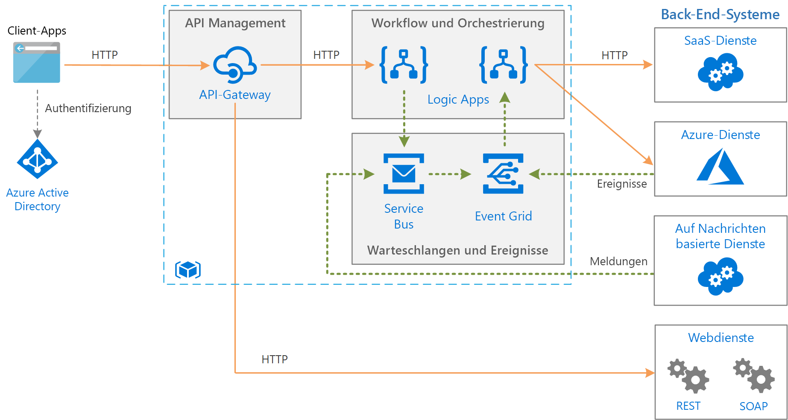

# Herausgeber-Abonnent-Muster

Ermöglichen Sie einer Anwendung die asynchrone Ankündigung von Ereignissen für mehrere interessierte Consumer, ohne die Absender mit den Empfängern zu koppeln.

**Auch bezeichnet als**: Veröffentlichen/Abonnieren-Messaging

## Kontext und Problem

In cloudbasierten und verteilten Anwendungen müssen Komponenten des Systems häufig Informationen für andere Komponenten bereitstellen, wenn Ereignisse auftreten.

Asynchrones Messaging ist eine effektive Methode, um Absender von Consumern zu entkoppeln und zu verhindern, dass der Absender beim Warten auf eine Antwort blockiert wird. Die Verwendung einer dedizierten Warteschlange für jeden Consumer lässt sich jedoch nicht effektiv auf eine große Anzahl von Consumern skalieren. Darüber hinaus ist für einige der Consumer möglicherweise nur eine Teilmenge der Informationen relevant. Wie kann der Absender Ereignisse für alle interessierten Consumer ankündigen, ohne ihre Identitäten zu kennen?

## Lösung

Führen Sie ein asynchrones Messagingsubsystem ein, das Folgendes umfasst:

- Einen Eingabemessagingkanal, der vom Absender verwendet wird. Der Absender verpackt Ereignisse anhand eines bekannten Nachrichtenformats in Nachrichten und sendet diese über den Eingabekanal. Der Absender in diesem Muster wird auch als *Herausgeber* bezeichnet.

  > [!NOTE]
  > Eine *Nachricht* ist ein Datenpaket. Ein *Ereignis* ist eine Nachricht, die andere Komponenten über eine erfolgte Änderung oder Aktion benachrichtigt.

- Einen Ausgabemessagingkanal pro Consumer. Die Consumer werden als *Abonnenten* bezeichnet.

- Einen Mechanismus zum Kopieren jeder Nachricht aus dem Eingabekanal in die Ausgabekanäle für alle Abonnenten, die an dieser Nachricht interessiert sind. Dieser Vorgang wird in der Regel von einem Vermittler behandelt, z. B. einem Nachrichtenbroker oder Ereignisbus.

Das folgende Diagramm zeigt die logischen Komponenten dieses Musters:

 
Veröffentlichen-Abonnieren-Messaging bietet die folgenden Vorteile:

- Es entkoppelt Subsysteme, die weiterhin kommunizieren müssen. Subsysteme können unabhängig verwaltet werden, und Nachrichten können selbst dann ordnungsgemäß verwaltet werden, wenn ein oder mehrere Empfänger offline sind.

- Es erhöht die Skalierbarkeit und verbessert die Reaktionsfähigkeit des Absenders. Der Absender kann schnell eine einzelne Nachricht an den Eingabekanal senden und dann seine eigentlichen Verarbeitungsaufgaben wieder aufnehmen. Die Messaginginfrastruktur ist dafür verantwortlich, die Zustellung von Nachrichten an interessierte Abonnenten sicherzustellen.

- Dadurch wird die Zuverlässigkeit verbessert. Durch asynchrones Messaging können Anwendungen unter höherer Auslastung weiterhin reibungslos ausgeführt werden und vorübergehende Fehler effektiver behandeln.

- Es ermöglicht die verzögerte oder geplante Verarbeitung. Abonnenten können warten und Nachrichten erst außerhalb der Spitzenzeiten abrufen. Es ist auch möglich, Nachrichten nach einem bestimmten Zeitplan weiterzuleiten oder zu verarbeiten.

- Es ermöglicht eine einfachere Integration zwischen Systemen, die verschiedene Plattformen, Programmiersprachen oder Kommunikationsprotokolle verwenden, sowie zwischen lokalen Systemen und Anwendungen, die in der Cloud ausgeführt werden.

- Es ermöglicht asynchrone Workflows in einem Unternehmen.

- Es verbessert die Prüfbarkeit. Im Rahmen einer allgemeinen Integrationsteststrategie können Kanäle überwacht und Nachrichten überprüft oder protokolliert werden.

- Es ermöglicht die Trennung der Zuständigkeiten für Ihre Anwendungen. Jede Anwendung kann sich auf ihre Kernfunktionen konzentrieren, während die Messaginginfrastruktur für alle Vorgänge zuständig ist, die zur zuverlässigen Weiterleitung von Nachrichten an mehrere Consumer erforderlich sind. 

## Probleme und Überlegungen

Beachten Sie die folgenden Punkte bei der Entscheidung, wie dieses Muster implementiert werden soll:

- **Vorhandene Technologien.** Es wird dringend empfohlen, vorhandene Messagingprodukte und -dienste zu verwenden, die ein Veröffentlichen-Abonnieren-Modell unterstützen, anstatt eigene Produkte oder Dienste zu erstellen. In Azure sollten Sie die Verwendung von [Service Bus](/azure/service-bus-messaging/) oder [Event Grid](/azure/event-grid/) erwägen. Zu den weiteren Technologien, die für Veröffentlichen/Abonnieren-Messaging verwendet werden können, zählen Redis, RabbitMQ und Apache Kafka.

- **Behandlung von Abonnements.** Die Messaginginfrastruktur muss Mechanismen bereitstellen, die Consumer zum Abonnieren oder Abbestellen verfügbarer Kanäle verwenden können.

- **Sicherheit.** Das Herstellen einer Verbindung mit einem Nachrichtenkanal muss durch Sicherheitsrichtlinien eingeschränkt werden, um Abhörangriffe durch nicht autorisierte Benutzer oder Anwendungen zu verhindern.

- **Teilmengen von Nachrichten.** Abonnenten sind meist nur an einer Teilmenge der Nachrichten von einem Herausgeber interessiert. Bei vielen Messagingdiensten können Abonnenten folgende Einschränkungen für den Empfang von Nachrichten festlegen:

  - **Themen.** Jedes Thema verfügt über einen dedizierten Ausgabekanal, und jeder Consumer kann alle relevanten Themen abonnieren.
  - **Inhaltsfilterung.** Nachrichten werden überprüft und basierend auf dem Inhalt der einzelnen Nachrichten verteilt. Jeder Abonnent kann den Inhalt angeben, an dem er interessiert ist.

- **Platzhalterabonnenten.** Erwägen Sie, Abonnenten das Abonnieren mehrerer Themen über Platzhalter zu ermöglichen.

- **Bidirektionale Kommunikation.** Die Kanäle in einem Veröffentlichen-Abonnieren-System werden als unidirektionale Kanäle behandelt. Wenn ein bestimmter Abonnent dem Herausgeber eine Bestätigung senden oder ihm seinen Status mitteilen muss, kann ggf. das [Anforderungs-/Antwortmuster](http://www.enterpriseintegrationpatterns.com/patterns/messaging/RequestReply.html) verwendet werden. Dieses Muster verwendet einen Kanal, um eine Nachricht an den Abonnenten zu senden, und einen separaten Antwortkanal für die Rückantwort an den Verleger.

- **Nachrichtensortierung.** Die Reihenfolge, in der Consumerinstanzen Nachrichten empfangen, ist nicht garantiert und entspricht nicht unbedingt der Reihenfolge, in der die Nachrichten erstellt wurden. Entwerfen Sie das System so, dass die Verarbeitung von Nachrichten mit Sicherheit idempotent ist, um eine Abhängigkeit von der Reihenfolge der Nachrichtenverarbeitung zu vermeiden.

- **Nachrichtenpriorität.** Manche Lösungen erfordern, dass Nachrichten in einer bestimmten Reihenfolge verarbeitet werden. Das [Muster „Prioritätswarteschlange“](priority-queue.md) bietet einen Mechanismus, mit dem sichergestellt werden kann, dass bestimmte Nachrichten vor anderen Nachrichten übermittelt werden.

- **Nicht verarbeitbare Nachrichten.** Eine falsch formatierte Nachricht oder eine Aufgabe, die Zugriff auf nicht verfügbare Ressourcen benötigt, kann zu Fehlern in einer Dienstinstanz führen. Das System sollte verhindern, dass solche Nachrichten an die Warteschlange zurückgegeben werden. Erfassen und speichern Sie die Details dieser Nachrichten stattdessen an anderer Stelle, damit sie bei Bedarf analysiert werden können.

- **Wiederholte Nachrichten.** Die gleiche Nachricht kann möglicherweise mehrmals gesendet werden. Es kann beispielsweise vorkommen, dass nach dem Veröffentlichen einer Nachricht ein Fehler beim Absender auftritt. Danach kann eine neue Instanz des Absenders gestartet werden und die Nachricht wiederholen. Die Messaginginfrastruktur sollte eine Erkennung und Entfernung doppelt vorhandener Nachrichten (auch bezeichnet als Bereinigung unnötiger Informationen) auf Grundlage der Nachrichten-IDs implementieren, um eine „At-Most-Once“-Zustellung von Nachrichten zu gewährleisten.

- **Nachrichtenablauf.** Eine Nachricht kann eine begrenzte Lebensdauer haben. Wird sie nicht innerhalb dieses Zeitraums verarbeitet, ist sie möglicherweise nicht mehr relevant und sollte verworfen werden. Ein Absender kann in den Daten einer Nachricht eine Ablaufzeit angeben. Ein Empfänger kann diese Informationen überprüfen, bevor er sich entscheidet, die mit der Nachricht verknüpfte Geschäftslogik auszuführen.

- **Nachrichtenplanung.** Es kann vorkommen, dass eine Nachricht vorübergehend blockiert wird und erst nach einem bestimmten Datum und einer bestimmten Uhrzeit verarbeitet werden soll. Vor Ablauf dieser Zeit sollte die Nachricht nicht für einen Empfänger verfügbar sein.

## Verwendung dieses Musters

Verwenden Sie dieses Muster in folgenden Fällen:

- Eine Anwendung muss Informationen an eine erhebliche Anzahl von Consumern übertragen.

- Eine Anwendung muss mit einer oder mehreren unabhängig voneinander entwickelten Anwendungen oder Diensten kommunizieren, die möglicherweise verschiedene Plattformen, Programmiersprachen und Kommunikationsprotokolle verwenden.

- Eine Anwendung kann Informationen an Consumer senden, ohne eine Echtzeitantwort von den Consumern zu benötigen.

- Die integrierten Systeme sind so konzipiert, dass sie ein später eingeführtes Konsistenzmodell für die Daten unterstützen.

- Eine Anwendung muss Informationen an mehrere Consumer senden, die u. U. andere Anforderungen bezüglich der Verfügbarkeit oder andere Betriebszeitzeitpläne haben als der Absender.

Dieses Muster ist in folgenden Fällen möglicherweise nicht geeignet:

- Eine Anwendung hat nur wenige Consumer, die Informationen erfordern, die sich deutlich von der Produceranwendung unterscheiden.

- Eine Anwendung erfordert eine nahezu in Echtzeit erfolgende Interaktion mit Consumern.

## Beispiel

Das folgende Diagramm zeigt die Architektur einer Unternehmensintegration, die mithilfe von Service Bus Workflows koordiniert und mithilfe von Event Grid Subsysteme über Ereignisse benachrichtigt. Weitere Informationen finden Sie unter [Unternehmensintegration in Azure mithilfe von Nachrichtenwarteschlangen und Ereignissen](../reference-architectures/enterprise-integration/queues-events.md).

## Zugehörige Muster und Anleitungen

Die folgenden Muster und Anweisungen könnten für die Implementierung dieses Musters relevant sein:

- [Wählen Sie zwischen Azure-Diensten, die Nachrichten übermitteln](/azure/event-grid/compare-messaging-services).

- Der [ereignisgesteuerte Architekturstil](../guide/architecture-styles/event-driven.md) ist ein Architekturstil, der das Veröffentlichen/Abonnieren-Messaging nutzt.

- [Einführung in asynchrone Nachrichten](https://msdn.microsoft.com/library/dn589781.aspx). Warteschlangen sind ein Mechanismus für asynchrone Kommunikation. Wenn ein Consumerdienst eine Antwort an eine Anwendung senden muss, kann es erforderlich sein, ein Antwortmessaging zu implementieren. Die Einführung in asynchrone Nachrichten enthält Informationen zum Implementieren des Anforderung-Antwort-Messaging mithilfe von Nachrichtenwarteschlangen.

- [Beobachtermuster](https://en.wikipedia.org/wiki/Observer_pattern). Das Veröffentlichen-Abonnieren-Muster basiert auf dem Beobachtermuster, da Themen mittels asynchronem Messaging von Beobachtern entkoppelt werden.

- [Nachrichtenbrokermuster](https://en.wikipedia.org/wiki/Message_broker). Viele Messagingsubsysteme, die ein Veröffentlichen-Abonnieren-Modell unterstützen, werden über einen Nachrichtenbroker implementiert.
