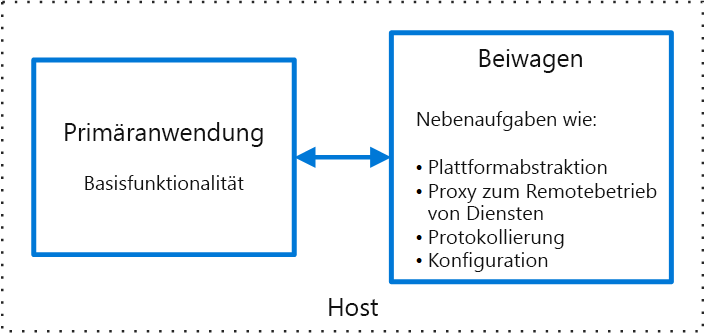

# Sidecar-MusterSidecar pattern

Komponenten einer Anwendung zwecks Isolation und Kapselung in einem separaten Prozess oder Container bereitstellenDeploy components of an application into a separate process or container to provide isolation and encapsulation. Dieses Muster kann Anwendungen auch eine Zusammenstellung aus heterogenen Komponenten und Technologien ermöglichen.This pattern can also enable applications to be composed of heterogeneous components and technologies.

Dieses Muster trägt den Namen *Sidecar*, da es an einen Beiwagen erinnert, der an ein Motorrad angebracht wird.This pattern is named *Sidecar* because it resembles a sidecar attached to a motorcycle. Im Muster wird der Sidecar an eine übergeordnete Anwendung angefügt und stellt unterstützende Funktionen für die Anwendung bereit.In the pattern, the sidecar is attached to a parent application and provides supporting features for the application. Der Sidecar weist auch denselben Lebenszyklus wie die übergeordnete Anwendung auf und wird zusammen mit dieser erstellt und außer Kraft gesetzt.The sidecar also shares the same lifecycle as the parent application, being created and retired alongside the parent. Das Sidecar-Muster wird manchmal auch als Sidekick-Muster bezeichnet und ist ein Aufgliederungsmuster.The sidecar pattern is sometimes referred to as the sidekick pattern and is a decomposition pattern.

## Kontext und ProblemContext and Problem

Anwendungen und Dienste benötigen häufig zusammengehörige Funktionen, wie z. B. Überwachung, Protokollierung, Konfiguration und Netzwerkdienste.Applications and services often require related functionality, such as monitoring, logging, configuration, and networking services. Diese Peripherieaufgaben können als separate Komponenten oder Dienste implementiert werden.These peripheral tasks can be implemented as separate components or services.

Wenn sie eng in die Anwendung integriert sind, können sie in demselben Prozess wie die Anwendung ausgeführt werden und dadurch gemeinsam verwendete Ressourcen effizient nutzen.If they are tightly integrated into the application, they can run in the same process as the application, making efficient use of shared resources. Dies bedeutet aber auch, dass sie nicht gut isoliert sind, und ein Ausfall in einer dieser Komponenten kann Auswirkungen auf andere Komponenten oder die gesamte Anwendung haben.However, this also means they are not well isolated, and an outage in one of these components can affect other components or the entire application. Außerdem müssen sie üblicherweise mit derselben Sprache wie die übergeordnete Anwendung implementiert werden.Also, they usually need to be implemented using the same language as the parent application. Daher weisen die Komponente und die Anwendung eine starke wechselseitige Abhängigkeit auf.As a result, the component and the application have close interdependence on each other.

Wenn die Anwendung in Dienste aufgegliedert wird, kann jeder Dienst mit einer anderen Sprache und anderer Technologie erstellt werden.If the application is decomposed into services, then each service can be built using different languages and technologies. Zwar bietet dies mehr Flexibilität, doch bedeutet es auch, dass jede Komponente eigene Abhängigkeiten aufweist und sprachspezifische Bibliotheken für den Zugriff auf die zugrunde liegende Plattform und alle mit der übergeordneten Anwendung gemeinsam verwendeten Ressourcen benötigt.While this gives more flexibility, it means that each component has its own dependencies and requires language-specific libraries to access the underlying platform and any resources shared with the parent application. Darüber hinaus kann eine Bereitstellung dieser Funktionen als separate Dienste zu höherer Latenz der Anwendung führen.In addition, deploying these features as separate services can add latency to the application. Das Verwalten des Codes und der Abhängigkeiten für diese sprachspezifischen Schnittstellen kann auch zu wesentlich höherer Komplexität führen, insbesondere bei Hosting, Bereitstellung und Verwaltung.Managing the code and dependencies for these language-specific interfaces can also add considerable complexity, especially for hosting, deployment, and management.

## LösungSolution

Verbinden Sie eine zusammenhängende Gruppe von Aufgaben mit der primären Anwendung, aber platzieren Sie diese in einem eigenen Prozess oder Container, um eine homogene Schnittstelle für Plattformdienste sprachübergreifend bereitzustellen.Co-locate a cohesive set of tasks with the primary application, but place them inside their own process or container, providing a homogeneous interface for platform services across languages.

Ein Sidecar-Dienst ist nicht notwendigerweise Teil der Anwendung, ist aber mit ihr verbunden.A sidecar service is not necessarily part of the application, but is connected to it. Er befindet sich dort, wo sich auch die übergeordnete Anwendung befindet.It goes wherever the parent application goes. Sidecars sind unterstützte Prozesse oder Dienste, die mit der primären Anwendung bereitgestellt werden.Sidecars are supporting processes or services that are deployed with the primary application. Bei einem Motorrad wird ein Sidecar (Beiwagen) an ein einzelnes Fahrzeug angebracht, und jedes Motorrad kann einen eigenen Beiwagen haben.On a motorcycle, the sidecar is attached to one motorcycle, and each motorcycle can have its own sidecar. Auf die gleiche Weise teilt auch ein Sidecar-Dienst das Schicksal der übergeordneten Anwendung.In the same way, a sidecar service shares the fate of its parent application. Für jede Instanz der Anwendung wird eine Instanz des Sidecar bereitgestellt und parallel gehostet.For each instance of the application, an instance of the sidecar is deployed and hosted alongside it.

Die Verwendung eines Sidecar-Musters bietet unter anderem folgende Vorteile:Advantages of using a sidecar pattern include:

- Ein Sidecar ist in Hinsicht auf die Laufzeitumgebung und die Programmiersprache von der primären Anwendung unabhängig, sodass Sie nicht einen Sidecar pro Sprache entwickeln müssen.A sidecar is independent from its primary application in terms of runtime environment and programming language, so you don't need to develop one sidecar per language.

- Der Sidecar kann auf dieselben Ressourcen wie die primäre Anwendung zugreifen.The sidecar can access the same resources as the primary application. Beispielsweise kann ein Sidecar Systemressourcen überwachen, die sowohl vom Sidecar als auch der primären Anwendung verwendet werden.For example, a sidecar can monitor system resources used by both the sidecar and the primary application.

- Aufgrund der Nähe zur primären Anwendung besteht keine wesentliche Latenz bei der Kommunikation zwischen beiden.Because of its proximity to the primary application, there’s no significant latency when communicating between them.

- Selbst bei Anwendungen, die keinen Erweiterbarkeitsmechanismus bieten, können Sie einen Sidecar zum Erweitern der Funktionalität verwenden, indem Sie ihn als eigenen Prozess in demselben Host- oder Untercontainer wie die primäre Anwendung anfügen.Even for applications that don’t provide an extensibility mechanism, you can use a sidecar to extend functionality by attaching it as own process in the same host or sub-container as the primary application.

Das Sidecar-Muster wird häufig mit Containern verwendet und als Sidecar-Container oder Sidekick-Container bezeichnet.The sidecar pattern is often used with containers and referred to as a sidecar container or sidekick container.

## Probleme und ÜberlegungenIssues and Considerations

- Beachten Sie das Bereitstellungs- und Paketerstellungsformat, das Sie zum Bereitstellen von Diensten, Prozessen oder Containern verwenden.Consider the deployment and packaging format you will use to deploy services, processes, or containers. Container eignen sich besonders gut für das Sidecar-Muster.Containers are particularly well suited to the sidecar pattern.
- Wählen Sie beim Entwerfen eines Sidecar-Diensts den Mechanismus für die prozessübergreifende Kommunikation sorgfältig aus.When designing a sidecar service, carefully decide on the interprocess communication mechanism. Versuchen Sie Technologien zu verwenden, die von der Sprache oder dem Framework unabhängig sind, sofern Leistungsanforderungen dies nicht unmöglich ist.Try to use language- or framework-agnostic technologies unless performance requirements make that impractical.
- Bedenken Sie vor der Aufnahme von Funktionen in einen Sidecar, ob dafür ein separater Dienst oder ein herkömmlicher Daemon besser geeignet ist.Before putting functionality into a sidecar, consider whether it would work better as a separate service or a more traditional daemon.
- Überlegen Sie auch, ob die Funktionen als Bibliothek oder mithilfe eines herkömmlichen Erweiterungsmechanismus implementiert werden können.Also consider whether the functionality could be implemented as a library or using a traditional extension mechanism. Sprachspezifische Bibliotheken bieten möglicherweise eine tiefer greifende Integration und weniger Netzwerkaufwand.Language-specific libraries may have a deeper level of integration and less network overhead.

## Verwendung dieses MustersWhen to Use this Pattern

Verwenden Sie dieses Muster in folgenden Fällen:Use this pattern when:

- Die primäre Anwendung verwendet eine heterogene Gruppe von Sprachen und Frameworks.Your primary application uses a heterogeneous set of languages and frameworks. Eine Komponente, die sich in einem Sidecar-Dienst befindet, kann von Anwendungen verwendet werden, die mithilfe verschiedener Frameworks in unterschiedlichen Sprachen geschrieben wurden.A component located in a sidecar service can be consumed by applications written in different languages using different frameworks.
- Eine Komponente befindet sich im Besitz eines Remoteteams oder einer anderen Organisation.A component is owned by a remote team or a different organization.
- Eine Komponente oder Funktion muss sich auf demselben Host wie die Anwendung befinden.A component or feature must be co-located on the same host as the application
- Sie benötigen einen Dienst, der den gesamten Lebenszyklus Ihrer Hauptanwendung teilt, aber unabhängig aktualisiert werden kann.You need a service that shares the overall lifecycle of your main application, but can be independently updated.
- Sie benötigen eine präzisere Kontrolle über Einschränkungen für eine bestimmte Ressource oder Komponente.You need fine-grained control over resource limits for a particular resource or component. Sie möchten beispielsweise die Speichermenge beschränken, die eine bestimmte Komponente verwendet.For example, you may want to restrict the amount of memory a specific component uses. Sie können die Komponente als einen Sidecar bereitstellen und die Speichernutzung unabhängig von der Hauptanwendung verwalten.You can deploy the component as a sidecar and manage memory usage independently of the main application.

Dieses Muster ist in folgenden Fällen unter Umständen nicht geeignet:This pattern may not be suitable:

- Wenn die prozessübergreifende Kommunikation optimiert werden muss.When interprocess communication needs to be optimized. Die Kommunikation zwischen einer übergeordneten Anwendung und Sidecar-Diensten bedeutet einen gewissen Mehraufwand, insbesondere Latenz bei den Aufrufen.Communication between a parent application and sidecar services includes some overhead, notably latency in the calls. Dies ist bei Schnittstellen mit einer hohen Anzahl von Einzelaufrufen möglicherweise nicht annehmbar.This may not be an acceptable trade-off for chatty interfaces.
- Bei kleinen Anwendungen, bei denen der Vorteil der Isolation die Ressourcenkosten für die Bereitstellung eines Sidecar-Diensts für jede Instanz nicht aufheben.For small applications where the resource cost of deploying a sidecar service for each instance is not worth the advantage of isolation.
- Wenn der Dienst anders als oder unabhängig von den Hauptanwendungen skaliert werden muss.When the service needs to scale differently than or independently from the main applications. Wenn das der Fall ist, wird die Funktion möglicherweise besser als separater Dienst bereitgestellt.If so, it may be better to deploy the feature as a separate service.

## BeispielExample

Das Sidecar-Muster kann für viele Szenarien angewendet werden.The sidecar pattern is applicable to many scenarios. Hier einige typische Beispiele:Some common examples:

- Infrastruktur API.Infrastructure API. Das Infrastruktur-Entwicklungsteam erstellt einen Dienst, der zusammen mit den einzelnen Anwendungen bereitgestellt wird, anstelle einer sprachspezifischen Clientbibliothek für den Zugriff auf die Infrastruktur.The infrastructure development team creates a service that's deployed alongside each application, instead of a language-specific client library to access the infrastructure. Der Dienst wird als Sidecar geladen und stellt eine allgemeine Ebene für Infrastrukturdienste bereit, einschließlich Protokollierung, Umgebungsdaten, Konfigurationsspeicher, Ermittlung, Integritätsüberprüfungen und Watchdog-Dienste.The service is loaded as a sidecar and provides a common layer for infrastructure services, including logging, environment data, configuration store, discovery, health checks, and watchdog services. Der Sidecar überwacht auch die Hostumgebung und den Prozess (oder Container) der übergeordneten Anwendung und protokolliert die Informationen in einem zentralen Dienst.The sidecar also monitors the parent application's host environment and process (or container) and logs the information to a centralized service.
- Verwalten von NGINX/HAProxy.Manage NGINX/HAProxy. Stellen Sie NGINX mit einem Sidecar-Dienst bereit, der den Zustand der Umgebung überwacht, dann die NGINX-Konfigurationsdatei aktualisiert und den Prozess wiederverwendet, wenn eine Zustandsänderung benötigt wird.Deploy NGINX with a sidecar service that monitors environment state, then updates the NGINX configuration file and recycles the process when a change in state is needed.
- Ambassador-Sidecar.Ambassador sidecar. Stellen Sie einen [Ambassador](./ambassador.md)-Dienst als Sidecar bereit.Deploy an [ambassador](./ambassador.md) service as a sidecar. Die Aufrufe der Anwendung erfolgen über Ambassador, der Anforderungsprotokollierung, Routing, Verbindungsunterbrechung und andere Funktionen im Zusammenhang mit der Konnektivität handhabt.The application calls through the ambassador, which handles request logging, routing, circuit breaking, and other connectivity related features.
- Auslagern des Proxy.Offload proxy. Platzieren Sie einen NGINX-Proxy vor einer node.js-Dienstinstanz, um die Bereitstellung statischer Dateiinhalte für den Dienst zu handhaben.Place an NGINX proxy in front of a node.js service instance, to handle serving static file content for the service.

## Verwandte LeitfädenRelated guidance

- [BotschaftermusterAmbassador pattern](./ambassador.md)
