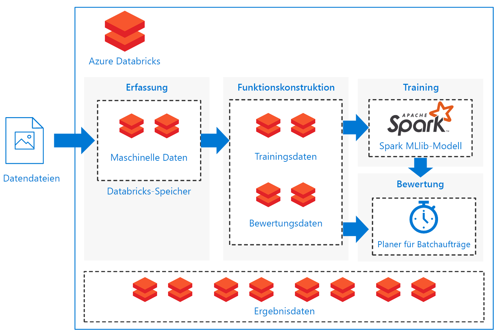

# Batchbewertung von Spark-Modellen in Azure DatabricksBatch scoring of Spark models on Azure Databricks

Diese Referenzarchitektur veranschaulicht, wie mit Azure Databricks, einer für Azure optimierten Apache Spark-basierten Analyseplattform, eine skalierbare Lösung für die Batchbewertung eines Apache Spark-Klassifizierungsmodells nach einem Zeitplan erstellt wird.This reference architecture shows how to build a scalable solution for batch scoring an Apache Spark classification model on a schedule using Azure Databricks, an Apache Spark-based analytics platform optimized for Azure. Die Lösung kann als Vorlage verwendet werden, die für andere Szenarien generalisiert werden kann.The solution can be used as a template that can be generalized to other scenarios.

Eine Referenzimplementierung für diese Architektur ist auf [GitHub][github] verfügbar.A reference implementation for this architecture is available on [GitHub][github].

**Szenario:** Ein Unternehmen in einer ressourcenlastigen Branche möchte die mit unerwarteten mechanischen Fehlern verbundenen Kosten und Ausfallzeiten minimieren.**Scenario**: A business in an asset-heavy industry wants to minimize the costs and downtime associated with unexpected mechanical failures. Mithilfe der von den Maschinen gesammelten IoT-Daten kann das Unternehmen ein Predictive Maintenance-Modell (Modell für die vorbeugende Wartung) erstellen.Using IoT data collected from their machines, they can create a predictive maintenance model. Dieses Modell ermöglicht es dem Unternehmen, Komponenten proaktiv zu warten und zu reparieren, bevor sie ausfallen.This model enables the business to maintain components proactively and repair them before they fail. Durch Maximieren der Verwendung der mechanischen Komponenten können Kosten kontrolliert und Ausfallzeiten reduziert werden.By maximizing mechanical component use, they can control costs and reduce downtime.

Ein Predictive Maintenance-Modell sammelt Daten von den Maschinen und speichert historische Beispiele von Komponentenausfällen.A predictive maintenance model collects data from the machines and retains historical examples of component failures. Das Modell kann dann verwendet werden, um den aktuellen Zustand der Komponenten zu überwachen und vorherzusagen, ob eine bestimmte Komponente in naher Zukunft ausfallen wird.The model can then be used to monitor the current state of the components and predict if a given component will fail in the near future. Allgemeine Anwendungsfälle und Modellierungsansätze finden Sie im [Azure AI-Leitfaden für Predictive Maintenance-Lösungen][ai-guide].For common use cases and modeling approaches, see [Azure AI guide for predictive maintenance solutions][ai-guide].

Diese Referenzarchitektur ist für Workloads konzipiert, die durch das Vorhandensein neuer Daten der Komponentenmaschinen ausgelöst werden.This reference architecture is designed for workloads that are triggered by the presence of new data from the component machines. Die Verarbeitung umfasst die folgenden Schritte:Processing involves the following steps:

1. Erfassen Sie die Daten aus dem externen Datenspeicher in einem Azure Databricks-Datenspeicher.Ingest the data from the external data store onto an Azure Databricks data store.

2. Trainieren Sie ein Machine Learning-Modell, indem Sie die Daten in ein Trainingsdataset transformieren, und erstellen Sie dann ein Spark MLlib-Modell.Train a machine learning model by transforming the data into a training data set, then building a Spark MLlib model. MLlib besteht aus den am häufigsten verwendeten Machine Learning-Algorithmen und -Dienstprogrammen, die für die Nutzung von Spark-Datenskalierbarkeitsfunktionen optimiert sind.MLlib consists of most common machine learning algorithms and utilities optimized to take advantage of Spark data scalability capabilities.

3. Wenden Sie das trainierte Modell an, um Komponentenausfälle vorherzusagen (zu klassifizieren), indem Sie die Daten in ein Bewertungsdataset transformieren.Apply the trained model to predict (classify) component failures by transforming the data into a scoring data set. Bewerten Sie die Daten mit dem Spark MLLib-Modell.Score the data with the Spark MLLib model.

4. Speichern Sie die Ergebnisse im Databricks-Datenspeicher zur Nachbearbeitung.Store results on the Databricks data store for post-processing consumption.

Auf  [GitHub][github] werden Notebooks für die Ausführung dieser Aufgaben bereitgestellt.Notebooks are provided on [GitHub][github] to perform each of these tasks.

## ArchitectureArchitecture

Die Architektur definiert einen vollständig in [Azure Databricks][databricks] enthaltenen Datenfluss basierend auf einem Satz sequenziell ausgeführter [Notebooks][notebooks].The architecture defines a data flow that is entirely contained within [Azure Databricks][databricks] based on a set of sequentially executed [notebooks][notebooks]. Die Architektur umfasst die folgenden Komponenten:It consists of the following components:

**[Datendateien][github]**:**[Data files][github]**. Bei der Referenzimplementierung wird ein simuliertes Dataset verwendet, das in fünf statischen Datendateien enthalten ist.The reference implementation uses a simulated data set contained in five static data files.

**[Erfassung][notebooks]**:**[Ingestion][notebooks]**. Das Datenerfassungsnotebook lädt die Eingabedatendateien in eine Sammlung von Databricks-Datasets herunter.The data ingestion notebook downloads the input data files into a collection of Databricks data sets. In einem realen Szenario würden Daten von IoT-Geräten in einen für Databricks zugänglichen Speicher wie Azure SQL Server oder Azure Blob Storage streamen.In a real-world scenario, data from IoT devices would stream onto Databricks-accessible storage such as Azure SQL Server or Azure Blob storage. Databricks unterstützt mehrere [Datenquellen][data-sources].Databricks supports multiple [data sources][data-sources].

**Trainingspipeline**:**Training pipeline**. Dieses Notebook führt das Featureentwicklungsnotebook aus, um ein Analysedataset aus den erfassten Daten zu erstellen.This notebook executes the feature engineering notebook to create an analysis data set from the ingested data. Dann führt es ein Modellerstellungsnotebook aus, das das Machine Learning-Modell mithilfe der skalierbaren Machine Learning-Bibliothek [Apache Spark MLlib][mllib] trainiert.It then executes a model building notebook that trains the machine learning model using the [Apache Spark MLlib][mllib] scalable machine learning library.

**Bewertungspipeline**:**Scoring pipeline**. Dieses Notebook führt das Featureentwicklungsnotebook aus, um ein Bewertungsdataset aus den erfassten Daten zu erstellen, und dann führt es das Bewertungsnotebook aus.This notebook executes the feature engineering notebook to create scoring data set from the ingested data and executes the scoring notebook. Das Bewertungsnotebook verwendet das trainierte [Spark MLlib][mllib-spark]-Modell, um Vorhersagen für die Beobachtungen im Bewertungsdataset zu generieren.The scoring notebook uses the trained [Spark MLlib][mllib-spark] model to generate predictions for the observations in the scoring data set. Die Vorhersagen werden im Ergebnisspeicher gespeichert. Dabei handelt es sich um ein neues Dataset für den Databricks-Datenspeicher.The predictions are stored in the results store, a new data set on the Databricks data store.

**Scheduler**:**Scheduler**. Ein geplanter Databricks-[Auftrag][job] verarbeitet die Batchbewertung mit dem Spark-Modell.A scheduled Databricks [job][job] handles batch scoring with the Spark model. Der Auftrag führt das Bewertungspipelinenotebook aus, wobei variable Argumente durch Notebookparameter übergeben werden, um die Details für das Erstellen des Bewertungsdatasets und den Speicherort für das Ergebnisdataset anzugeben.The job executes the scoring pipeline notebook, passing variable arguments through notebook parameters to specify the details for constructing the scoring data set and where to store the results data set.

Das Szenario ist als Pipelineflow konzipiert.The scenario is constructed as a pipeline flow. Jedes Notebook ist für die Ausführung in einer Batcheinstellung für jeden der folgenden Vorgänge optimiert: Erfassung, Featureentwicklung, Modellerstellung und Modellbewertung.Each notebook is optimized to perform in a batch setting for each of the operations: ingestion, feature engineering, model building, and model scorings. Zu diesem Zweck ist das Featureentwicklungsnotebook so konzipiert, dass es ein allgemeines Dataset für alle Trainings-, Kalibrierungs-, Test- oder Bewertungsvorgänge generiert.To accomplish this, the feature engineering notebook is designed to generate a general data set for any of the training, calibration, testing, or scoring operations. In diesem Szenario verwenden wir für diese Vorgänge eine temporale Aufteilungsstrategie, sodass die Notebookparameter zum Festlegen der Datumsbereichsfilterung verwendet werden.In this scenario, we use a temporal split strategy for these operations, so the notebook parameters are used to set date-range filtering.

Weil in dem Szenario eine Batchpipeline erstellt wird, stellen wir eine Reihe optionaler Überprüfungsnotebooks bereit, um die Ausgabe der Pipelinenotebooks zu untersuchen.Because the scenario creates a batch pipeline, we provide a set of optional examination notebooks to explore the output of the pipeline notebooks. Sie finden diese im GitHub-Repository:You can find these in the GitHub repository:

- `1a_raw-data_exploring`
- `2a_feature_exploration`
- `2b_model_testing`
- `3b_model_scoring_evaluation`

## EmpfehlungenRecommendations

Databricks ist so eingerichtet, dass Sie Ihre trainierten Modelle laden und bereitstellen können, um Vorhersagen mit neuen Daten zu treffen.Databricks is set up so you can load and deploy your trained models to make predictions with new data. Wir haben Databricks für dieses Szenario verwendet, weil diese Plattform die folgenden zusätzlichen Vorteile bietet:We used Databricks for this scenario because it provides these additional advantages:

- Unterstützung des einmaligen Anmeldens mit Azure Active Directory-AnmeldeinformationenSingle sign-on support using Azure Active Directory credentials.
- Auftragsplaner zum Ausführen von Aufträgen für ProduktionspipelinesJob scheduler to execute jobs for production pipelines.
- Vollständig interaktives Notebook mit Zusammenarbeitsfunktionen, Dashboards und REST-APIsFully interactive notebook with collaboration, dashboards, REST APIs.
- Unbegrenzte Cluster, die auf eine beliebige Größe skaliert werden könnenUnlimited clusters that can scale to any size.
- Erweiterte Sicherheit, rollenbasierte Zugriffssteuerungen und ÜberwachungsprotokolleAdvanced security, role-based access controls, and audit logs.

Verwenden Sie für die Interaktion mit dem Azure Databricks-Dienst die Benutzeroberfläche des Databricks-[Arbeitsbereichs][workspace] in einem Webbrowser oder die Databricks-[Befehlszeilenschnittstelle][cli] (Command-Line Interface, CLI).To interact with the Azure Databricks service, use the Databricks [Workspace][workspace] interface in a web browser or the [command-line interface][cli] (CLI). Auf die Databricks-CLI können Sie über jede Plattform zugreifen, die Python 2.7.9 bis 3.6 unterstützt.Access the Databricks CLI from any platform that supports Python 2.7.9 to 3.6.

Bei der Referenzimplementierung werden [Notebooks][notebooks] verwendet, um Aufgaben nacheinander auszuführen.The reference implementation uses [notebooks][notebooks] to execute tasks in sequence. Jedes Notebook speichert Zwischendatenartefakte (Trainings-, Test-, Bewertungs- oder Ergebnisdatasets) im gleichen Datenspeicher wie die Eingabedaten.Each notebook stores intermediate data artifacts (training, test, scoring, or results data sets) to the same data store as the input data. Ziel ist es, Ihnen die Verwendung nach Bedarf in Ihrem bestimmten Anwendungsfall zu erleichtern.The goal is to make it easy for you to use it as needed in your particular use case. In der Praxis würden Sie Ihre Datenquelle mit Ihrer Azure Databricks-Instanz verbinden, damit die Notebooks direkt in Ihren Speicher lesen und schreiben können.In practice, you would connect your data source to your Azure Databricks instance for the notebooks to read and write directly back into your storage.

Sie können die Auftragsausführung je nach Bedarf über die Databricks-Benutzeroberfläche, den Datenspeicher oder die Databricks-[CLI][cli] überwachen.You can monitor job execution through the Databricks user interface, the data store, or the Databricks [CLI][cli] as necessary. Überwachen Sie den Cluster mithilfe des [Ereignisprotokolls][log] und anderer [Metriken][metrics], die Databricks bereitstellt.Monitor the cluster using the [event log][log] and other [metrics][metrics] that Databricks provides.

## Überlegungen zur LeistungPerformance considerations

Für einen Azure Databricks-Cluster ist die automatische Skalierung standardmäßig aktiviert, sodass Databricks während der Laufzeit Worker dynamisch neu zuordnen kann, um die Eigenschaften Ihres Auftrags zu berücksichtigen.An Azure Databricks cluster enables autoscaling by default so that during runtime, Databricks dynamically reallocates workers to account for the characteristics of your job. Bestimmte Teile der Pipeline sind möglicherweise anspruchsvoller und rechenintensiver als andere.Certain parts of your pipeline may be more computationally demanding than others. Databricks fügt während dieser Phasen Ihres Auftrags zusätzliche Worker hinzu (und entfernt diese, wenn sie nicht mehr benötigt werden).Databricks adds additional workers during these phases of your job (and removes them when they’re no longer needed). Durch die automatische Skalierung kann eine hohe [Clusterauslastung][cluster] einfacher erreicht werden, weil Sie den Cluster nicht entsprechend einer Workload bereitstellen müssen.Autoscaling makes it easier to achieve high [cluster utilization][cluster], because you don’t need to provision the cluster to match a workload.

Darüber hinaus können mithilfe von [Azure Data Factory][adf] mit Azure Databricks komplexere geplante Pipelines entwickelt werden.Additionally, more complex scheduled pipelines can be developed by using [Azure Data Factory][adf] with Azure Databricks.

## SpeicheraspektStorage considerations

Bei dieser Referenzimplementierung werden die Daten der Einfachheit halber direkt im Databricks-Speicher gespeichert.In this reference implementation, the data is stored directly within Databricks storage for simplicity. In einer Produktionsumgebung können die Daten jedoch in einem Clouddatenspeicher wie [Azure Blob Storage][blob] gespeichert werden.In a production setting, however, the data can be stored on cloud data storage such as [Azure Blob Storage][blob]. [Databricks][databricks-connect] unterstützt auch Azure Data Lake Store, Azure SQL Data Warehouse, Azure Cosmos DB, Apache Kafka und Hadoop.[Databricks][databricks-connect] also supports Azure Data Lake Store, Azure SQL Data Warehouse, Azure Cosmos DB, Apache Kafka, and Hadoop.

## KostenbetrachtungCost considerations

Azure Databricks ist ein Spark-Premiumangebot, das mit Kosten verbunden ist.Azure Databricks is a premium Spark offering with an associated cost. Darüber hinaus gibt es [Tarife][pricing] für Databricks Standard und Databricks Premium.In addition, there are standard and premium Databricks [pricing tiers][pricing].

In diesem Szenario ist der Tarif „Standard“ ausreichend.For this scenario, the standard pricing tier is sufficient. Wenn Ihre spezielle Anwendung jedoch eine automatische Skalierung von Clustern zur Bewältigung größerer Workloads oder für interaktive Databricks-Dashboards erfordert, könnten sich die Kosten durch den Tarif „Premium“ weiter erhöhen.However, if your specific application requires automatically scaling clusters to handle larger workloads or interactive Databricks dashboards, the premium level could increase costs further.

Die Lösungsnotebooks können auf jeder Spark-basierten Plattform mit minimalen Änderungen zum Entfernen der Databricks-spezifischen Pakete ausgeführt werden.The solution notebooks can run on any Spark-based platform with minimal edits to remove the Databricks-specific packages. Unter den folgenden Links finden Sie ähnliche Lösungen für verschiedene Azure-Plattformen:See the following similar solutions for various Azure platforms:

- [Python für Azure Machine Learning Studio][python-aml][Python on Azure Machine Learning Studio][python-aml]
- [SQL Server R Services][sql-r][SQL Server R services][sql-r]
- [PySpark für Azure Data Science Virtual Machine][py-dvsm][PySpark on an Azure Data Science Virtual Machine][py-dvsm]

## Bereitstellen der LösungDeploy the solution

Führen Sie zum Bereitstellen dieser Referenzarchitektur die im [GitHub][github]-Repository beschriebenen Schritte aus, um eine skalierbare Lösung für die Batchbewertung von Spark-Modellen in Azure Databricks zu erstellen.To deploy this reference architecture, follow the steps described in the [GitHub][github] repository to build a scalable solution for scoring Spark models in batch on Azure Databricks.

## Verwandte ArchitekturenRelated architectures

Wir haben auch eine Referenzarchitektur erstellt, die Spark zum Erstellen von [Echtzeitempfehlungssystemen][recommendation] mit vorab berechneten Offlinebewertungen verwendet.We have also built a reference architecture that uses Spark for building [real-time recommendation systems][recommendation] with offline, pre-computed scores. Diese Empfehlungssysteme werden häufig in Szenarien verwendet, in denen eine Batchverarbeitung von Bewertungen erfolgt.These recommendation systems are common scenarios where scores are batch-processed.

[adf]: https://azure.microsoft.com/blog/operationalize-azure-databricks-notebooks-using-data-factory/
[ai-guide]: /azure/machine-learning/team-data-science-process/cortana-analytics-playbook-predictive-maintenance
[blob]: https://docs.databricks.com/spark/latest/data-sources/azure/azure-storage.html
[cli]: https://docs.databricks.com/user-guide/dev-tools/databricks-cli.html
[cluster]: https://docs.azuredatabricks.net/user-guide/clusters/sizing.html
[databricks]: /azure/azure-databricks/
[databricks-connect]: /azure/azure-databricks/databricks-connect-to-data-sources
[data-sources]: https://docs.databricks.com/spark/latest/data-sources/index.html
[github]: https://github.com/Azure/BatchSparkScoringPredictiveMaintenance
[job]: https://docs.databricks.com/user-guide/jobs.html
[log]: https://docs.databricks.com/user-guide/clusters/event-log.html
[metrics]: https://docs.databricks.com/user-guide/clusters/metrics.html
[mllib]: https://docs.databricks.com/spark/latest/mllib/index.html
[mllib-spark]: https://docs.databricks.com/spark/latest/mllib/index.html#apache-spark-mllib
[notebooks]: https://docs.databricks.com/user-guide/notebooks/index.html
[pricing]: https://azure.microsoft.com/en-us/pricing/details/databricks/
[python-aml]: https://gallery.azure.ai/Notebook/Predictive-Maintenance-Modelling-Guide-Python-Notebook-1
[py-dvsm]: https://gallery.azure.ai/Tutorial/Predictive-Maintenance-using-PySpark
[recommendation]: /azure/architecture/reference-architectures/ai/real-time-recommendation
[sql-r]: https://gallery.azure.ai/Tutorial/Predictive-Maintenance-Modeling-Guide-using-SQL-R-Services-1
[workspace]: https://docs.databricks.com/user-guide/workspace.html
