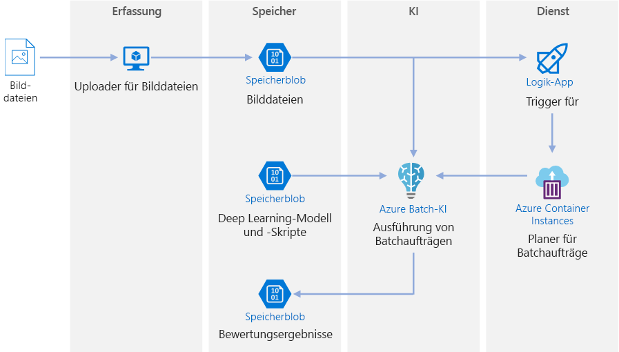
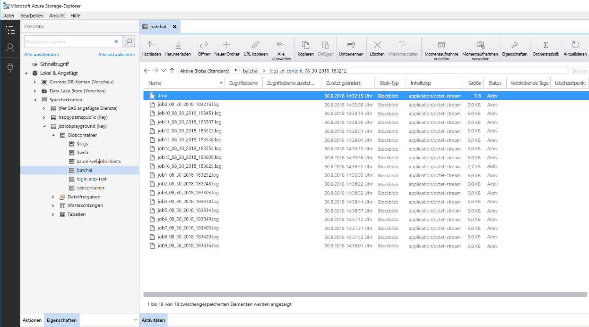

# Batchbewertung in Azure für Deep Learning-Modelle

Diese Referenzarchitektur zeigt, wie Sie mit Azure Batch AI neuronale Stilübertragung in einem Video ausführen. *Stilübertragung* ist eine Deep Learning-Technik, bei der ein vorhandenes Bild im Stil eines anderen Bildes erstellt wird. Diese Architektur kann generell für jedes Szenario für Batchbewertung mit Deep Learning verwendet werden. [**Stellen Sie diese Lösung bereit**](#deploy-the-solution).

**Szenario:** Ein Medienunternehmen möchte den Stil eines Videos so ändern, dass er dem eines bestimmten Gemäldes entspricht. Das Unternehmen möchte diesen Stil schnell und automatisiert auf alle Videoframes anwenden. Weitere Informationen zu Algorithmen für die neuronale Stilübertragung finden Sie unter [Image Style Transfer Using Convolutional Neural Networks][image-style-transfer] („Bildstilübertragung mit Convolutional Neural Networks“, PDF).

| Stilbild: | Eingabe-/Inhaltsvideo: | Ausgabevideo: |
|--------|--------|---------|
|  |  *Zum Wiedergeben klicken* |  *Zur Wiedergeben klicken* |

Diese Referenzarchitektur ist für Workloads konzipiert, die durch das Vorhandensein neuer Medien im Azure-Speicher ausgelöst werden. Die Verarbeitung umfasst die folgenden Schritte:

1. Laden Sie ein Bild im gewünschten Stil (z.B. ein Gemälde von van Gogh) und ein Skript für die Stilübertragung in Blob Storage hoch.
1. Erstellen Sie einen einsatzbereiten Batch AI-Cluster für die automatische Skalierung.
1. Teilen Sie die Videodatei in einzelne Frames, und laden Sie diese in Blob Storage hoch.
1. Wenn alle Frames hochgeladen wurden, laden Sie eine Triggerdatei in Blob Storage hoch.
1. Diese Datei löst eine Logik-App aus, die einen Container erstellt, der in Azure Container Instances ausgeführt wird.
1. Der Container führt ein Skript aus, das Batch AI-Aufträge erstellt. Jeder Auftrag wendet die neuronale Stilübertragung parallel auf die Knoten des Batch AI-Clusters an.
1. Wenn die Bilder generiert wurden, werden sie wieder in Blob Storage gespeichert.
1. Laden Sie die generierten Frames herunter, und fügen Sie sie wieder zu einem Video zusammen.

## Architecture

Diese Architektur umfasst die folgenden Komponenten.

### Compute

**[Azure Batch AI][batch-ai]** wird verwendet, um den Algorithmus der neuronalen Stilübertragung auszuführen. Batch AI unterstützt Deep Learning-Workloads durch die Bereitstellung von Containerumgebungen, die für Deep Learning-Frameworks auf GPU-fähigen VMs vorkonfiguriert sind. Der Dienst kann auch den Computecluster mit Blob Storage verbinden.

### Storage

**[Blob Storage][blob-storage]** wird verwendet, um alle Bilder (Eingabebilder, Stilbilder und Ausgabebilder) und alle von Batch AI erzeugten Protokolle zu speichern. Die Blob Storage-Integration in Batch AI wird über [blobfuse][blobfuse] ermöglicht, ein virtuelles Open Source-Dateisystem, das in Blob Storage gesichert wird. Blob Storage ist außerdem sehr kostengünstig für die Leistung, die diese Workload erfordert.

### Trigger/Planung

**[Azure Logic Apps][logic-apps]** löst den Workflow aus. Wenn die Logik-App erkennt, dass dem Container ein Blob hinzugefügt wurde, löst sie den Batch AI-Prozess aus. Logic Apps passt gut zu dieser Referenzarchitektur, da mit dem Dienst Änderungen an Blob Storage einfach erkannt und Trigger leicht geändert werden können.

**[Azure Container Instances][container-instances]** führt die Python-Skripts aus, die die Batch AI-Aufträge erstellen. Das Ausführen dieser Skripts in einem Docker-Container ist eine praktische Option, um sie bedarfsabhängig auszuführen. Für diese Architektur wird Container Instances verwendet, weil es einen vorgefertigten Logic Apps-Connector gibt, mit dem die Logik-App den Batch AI-Auftrag auslösen kann. Container Instances kann zustandslose Prozesse schnell erstellen.

**[Docker Hub][dockerhub]** wird verwendet, um das Docker-Bild zu speichern, mit dem Container Instances den Auftrag erstellt. Docker Hub wurde für diese Architektur aufgrund der Benutzerfreundlichkeit ausgewählt, und weil es sich dabei um das Standardbildrepository für Docker-Benutzer handelt. [Azure Container Registry][container-registry] kann ebenfalls verwendet werden.

### Vorbereitung der Daten

Diese Referenzarchitektur verwendet Videomaterial von einem Orang-Utan auf einem Baum. Sie können das Videomaterial [hier][source-video] herunterladen und es folgendermaßen für den Workflow verarbeiten:

1. Laden Sie mit [AzCopy][azcopy] das Video aus dem öffentlichen Blob herunter.
2. Verwenden Sie [FFmpeg][ffmpeg], um die Audiodatei zu extrahieren, damit sie später wieder im Ausgabevideo zusammengefügt werden kann.
3. Teilen Sie das Video mithilfe von FFmpeg in einzelne Frames auf. Die Frames werden unabhängig voneinander parallel verarbeitet.
4. Kopieren Sie mit AzCopy die einzelnen Frames in Ihren Blobcontainer.

Zu diesem Zeitpunkt liegt das Videomaterial in einer Form vor, die für die neuronale Stilübertragung verwendet werden kann.

## Überlegungen zur Leistung

### Vergleich zwischen GPU und CPU

Bei Deep Learning-Workloads bieten GPUs eine deutlich bessere Leistung als CPUs, sodass in der Regel ein großer Cluster von CPUs benötigt wird, um eine vergleichbare Leistung zu erzielen. Obwohl die Option besteht, in dieser Architektur nur CPUs zu verwenden, bieten GPUs ein viel besseres Preis-Leistungs-Verhältnis. Es wird empfohlen, die neueste GPU-optimierte VM-Größe (NCv3-Serie) zu verwenden.

GPUs sind nicht in allen Regionen standardmäßig aktiviert. Wählen Sie deshalb eine Region aus, in der GPUs aktiviert sind. Darüber hinaus haben Abonnements ein Standardkontingent von null Kernen für GPU-optimierte VMs. Sie können dieses Kontingent erhöhen, indem Sie eine Supportanfrage stellen. Stellen Sie sicher, dass Ihr Abonnement über ausreichend Kontingent verfügt, um Ihre Workload auszuführen.

### Vergleich zwischen Parallelisieren auf VMs und Kernen

Wenn eine Stilübertragung als Batchauftrag ausgeführt wird, müssen die Aufträge, die hauptsächlich auf GPUs ausgeführt werden, über VMs hinweg parallelisiert werden. Zwei Ansätze sind möglich: Sie können einen größeren Cluster aus virtuellen Computern mit einer einzelnen GPU oder einen kleineren Cluster aus virtuellen Computern mit vielen GPUs erstellen.

Die beiden Optionen bieten für diese Workload eine vergleichbare Leistung. Die Verwendung von weniger VMs mit mehr GPUs pro VM kann dazu beitragen, die Datenverschiebung zu reduzieren. Das Datenvolumen pro Auftrag für diese Workload ist jedoch nicht sehr groß, sodass Blob Storage keine umfangreiche Drosselung vornehmen wird.

### Batchgröße für Bilder pro Batch AI-Auftrag

Ein weiterer Parameter, der konfiguriert werden muss, ist die Anzahl von zu verarbeitenden Bildern pro Batch AI-Auftrag. Einerseits möchten Sie Aufträge auf mehrere Knoten verteilen, damit beim Fehlschlagen eines Auftrags, Vorgänge nicht für zu viele Bilder wiederholt werden müssen. Das deutet auf viele Batch AI-Aufträge und somit eine geringe Anzahl von Bildern hin, die pro Auftrag verarbeitet werden müssen. Werden hingegen zu wenige Bilder pro Auftrag verarbeitet, sind die Setup- und Startupzeit überproportional lang. Sie können die Anzahl von Aufträgen so festlegen, dass sie der maximalen Anzahl von Knoten im Cluster entspricht. Die ideale Annahme ist, dass keine Aufträge fehlschlagen, da dadurch die Setup- und Startupkosten minimiert werden. Wenn ein Auftrag jedoch fehlschlägt, muss ggf. eine große Anzahl von Bildern erneut verarbeitet werden.

### Dateiserver

Wenn Sie Batch AI verwenden, können Sie je nach Durchsatz, der für Ihr Szenario erforderlich ist, mehrere Speicheroptionen auswählen. Für Workloads mit geringem Durchsatz sollte die Verwendung von Blob Storage (über blobfuse) ausreichen. Alternativ unterstützt Batch AI auch einen Batch AI-Dateiserver, ein verwaltetes NFS mit einem Knoten, das automatisch auf Clusterknoten bereitgestellt werden kann, um Aufträgen einen zentral zugänglichen Speicherort zur Verfügung zu stellen. In der Regel wird in einem Arbeitsbereich nur ein Dateiserver benötigt. Sie können dann Daten für Ihre Trainingsaufträge in verschiedenen Verzeichnissen speichern. Wenn das NFS mit einem Knoten nicht für Ihre Workloads geeignet ist, unterstützt Batch AI andere Speicheroptionen, z.B. Azure Files oder benutzerdefinierte Lösungen wie ein Gluster- oder Lustre-Dateisystem.

## Sicherheitshinweise

### Einschränken des Zugriffs auf Azure Blob Storage

In dieser Referenzarchitektur ist Azure Blob Storage die wichtigste Speicherkomponente, die geschützt werden muss. Die im GitHub-Repository angezeigte Baselinebereitstellung verwendet Speicherkontoschlüssel für den Zugriff auf Blob Storage. Für noch mehr Kontrolle und Schutz sollten Sie stattdessen Shared Access Signatur (SAS) verwenden. Dadurch wird eingeschränkter Zugriff auf die gespeicherten Objekte gewährt, ohne dass die Kontoschlüssel hartcodiert oder im Klartext gespeichert werden müssen. Dieser Ansatz ist besonders nützlich, weil Kontoschlüssel im Klartext der Logik-App-Designerschnittstelle sichtbar sind. Mit SAS können Sie außerdem sicherstellen, dass das Speicherkonto über eine ordnungsgemäße Governance verfügt und der Zugriff nur ausgewählten Personen gewährt wird.

Stellen Sie in Szenarien mit sensibleren Daten sicher, dass alle Ihre Speicherschlüssel geschützt sind, weil diese Schlüssel den Vollzugriff auf alle Ein- und Ausgabedaten der Workload ermöglichen.

### Datenverschlüsselung und Datenverschiebung

Diese Referenzarchitektur verwendet Stilübertragung als Beispiel für einen Batchbewertungsvorgang. Für Szenarien mit noch sensibleren Daten sollten die gespeicherten Daten im Ruhezustand verschlüsselt werden. Sichern Sie die Datenübertragung jedes Mal mit SSL, wenn Daten von einem Ort an einen anderen verschoben werden. Weitere Informationen finden Sie im [Azure Storage-Sicherheitsleitfaden][storage-security].

### Sichern von Daten in einem virtuellen Netzwerk

Beim Bereitstellen Ihres Batch AI-Clusters können Sie ihn so konfigurieren, dass er im Subnetz eines virtuellen Netzwerks bereitgestellt wird. Dadurch können die Computeknoten im Cluster sicher mit anderen VMs oder sogar mit einem lokalen Netzwerk kommunizieren. Sie können auch [Dienstendpunkte][service-endpoints] mit Blob Storage verwenden, um Zugriff aus einem virtuellen Netzwerk zu gewähren, oder ein NFS mit einem Knoten im VNET mit Batch AI zu verwenden, um den permanenten Schutz von Daten sicherzustellen.

### Schützen vor schädlichen Aktivitäten

Stellen Sie in Szenarien mit mehreren Benutzern sicher, dass sensible Daten vor schädlichen Aktivitäten geschützt sind. Wenn Sie anderen Benutzern Zugriff auf diese Bereitstellung gewähren, um die Eingabedaten anzupassen, beachten Sie die folgenden Vorsichtsmaßnahmen und Überlegungen:

- Verwenden Sie die rollenbasierte Zugriffssteuerung (RBAC), um den Zugriff von Benutzern auf die Ressourcen zu beschränken, die sie benötigen.
- Stellen Sie zwei separate Speicherkonten bereit. Speichern Sie Eingabe-und Ausgabedaten im ersten Konto. Externen Benutzern kann Zugriff auf dieses Konto gewährt werden. Speichern Sie ausführbare Skripts und ausgegebene Protokolldateien im anderen Konto. Externe Benutzer sollten keinen Zugriff auf dieses Konto haben. So wird sichergestellt, dass externe Benutzer keine ausführbaren Dateien ändern (um schädlichen Code einzufügen) und keinen Zugriff auf Protokolldateien haben, die ggf. vertrauliche Informationen enthalten.
- Böswillige Benutzer können einen DDoS auf die Auftragswarteschlange starten oder ungültige, nicht verarbeitbare Nachrichten in die Auftragswarteschlange einfügen, wodurch Systemsperren und Fehler beim Entfernen aus der Warteschlange entstehen können.

## Überwachung und Protokollierung

### Überwachen von Batch AI-Aufträgen

Beim Ausführen Ihres Auftrags ist es wichtig, den Fortschritt zu überwachen und zu überprüfen, ob alles wie erwartet funktioniert. Es kann jedoch eine Herausforderung sein, über einen Cluster von aktiven Knoten hinweg zu überwachen.

Um einen Eindruck vom Gesamtzustand des Clusters zu bekommen, navigieren Sie im Azure-Portal zum Blatt „Batch AI“, um den Zustand der Knoten im Cluster zu überprüfen. Wenn ein Knoten inaktiv oder ein Auftrag fehlgeschlagen ist, werden die Fehlerprotokolle in Blob Storage gespeichert und sind auch im Azure-Portal auf dem Blatt „Aufträge“ verfügbar.

Die Überwachung kann durch Verbinden von Protokollen mit Application Insights oder durch das Ausführen separater Prozesse zum Abrufen des Zustands des Batch AI-Clusters und seiner Aufträge verbessert werden.

### Protokollierung in Batch AI

Batch AI protokolliert automatisch alle StdOut/STDERR-Ereignisse im entsprechenden Blob Storage-Konto. Speichernavigationstools wie der Speicher-Explorer vereinfachen die Navigation durch Protokolldateien erheblich.

Die Schritte zum Bereitstellen für diese Referenzarchitektur zeigen auch, wie Sie ein einfacheres Protokollierungssystem einrichten, damit alle Protokolle für die verschiedenen Aufträge im gleichen Verzeichnis in Ihrem Blobcontainer gespeichert werden (siehe unten). Verwenden Sie diese Protokolle, um zu überwachen, wie lange die Verarbeitung jedes Auftrags und jedes Bildes dauert. So können Sie besser beurteilen, wie Sie den Prozess weiter optimieren können.

## Kostenbetrachtung

Im Vergleich zu den Speicher- und Planungskomponenten fallen für die in dieser Referenzarchitektur verwendeten Computeressourcen bei Weitem die meisten Kosten an. Eine der größten Herausforderungen besteht darin, Aufträge über ein Cluster von GPU-fähigen VMs hinweg effektiv zu parallelisieren.

Die Größe des Batch AI-Clusters kann je nach Auftrag in der Warteschlange automatisch zentral hoch- und herunterskaliert werden. Es gibt zwei Möglichkeiten für die automatische Skalierung mit Batch AI. Bei der programmgesteuerten Variante wird sie in der Datei `.env` konfiguriert, die Teil der [Bereitstellungsschritte][deployment] ist. Alternativ können Sie die Skalierungsformel direkt im Portal ändern, nachdem der Cluster erstellt wurde.

Konfigurieren Sie für Aufträge, die nicht direkt verarbeitet werden müssen, die Formel für die automatische Skalierung so, dass der Standardzustand (Minimum) ein Cluster von null Knoten ist. Bei dieser Konfiguration hat der Cluster anfangs null Knoten. Er skaliert nur dann zentral hoch, wenn er Aufträge in der Warteschlange erkennt. Wenn die Batchbewertung maximal einige Male am Tag ausgeführt wird, können Sie mithilfe dieser Einstellung erheblich Kosten sparen.

Die automatische Skalierung ist ggf. nicht für Batchaufträge geeignet, die zeitlich zu nahe beieinander liegen. Für die benötigte Zeit zum Erstellen und Entfernen eines Cluster fallen ebenfalls Kosten an. Das heißt, wenn eine Batchworkload nur wenige Minuten nach dem Ende des vorherigen Auftrags startet, ist es ggf. kostengünstiger den Cluster permanent, also auch zwischen den Aufträgen, auszuführen.

## Bereitstellen der Lösung

Befolgen Sie die Schritte im Abschnitt [GitHub-Repository][deployment], um diese Referenzarchitektur bereitzustellen.

<!-- links -->

[azcopy]: /azure/storage/common/storage-use-azcopy-linux
[batch-ai]: /azure/batch-ai/
[blobfuse]: https://github.com/Azure/azure-storage-fuse
[blob-storage]: /azure/storage/blobs/storage-blobs-introduction
[container-instances]: /azure/container-instances/
[container-registry]: /azure/container-registry/
[deployment]: https://github.com/Azure/batch-scoring-for-dl-models
[dockerhub]: https://hub.docker.com/
[ffmpeg]: https://www.ffmpeg.org/
[image-style-transfer]: https://www.cv-foundation.org/openaccess/content_cvpr_2016/papers/Gatys_Image_Style_Transfer_CVPR_2016_paper.pdf
[logic-apps]: /azure/logic-apps/
[service-endpoints]: /azure/storage/common/storage-network-security?toc=%2fazure%2fvirtual-network%2ftoc.json#grant-access-from-a-virtual-network
[source-video]: https://happypathspublic.blob.core.windows.net/videos/orangutan.mp4
[storage-security]: /azure/storage/common/storage-security-guide
[vm-sizes-gpu]: /azure/virtual-machines/windows/sizes-gpu