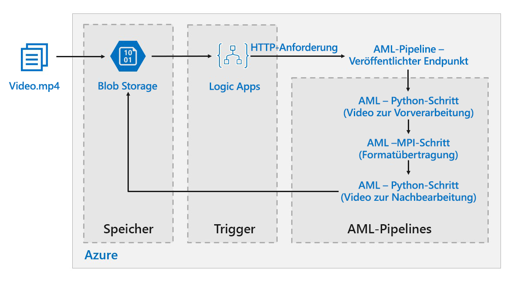

# Batchbewertung von Deep Learning-Modellen in Azure

Diese Referenzarchitektur zeigt, wie Sie mit Azure Machine Learning die neuronale Stilübertragung auf ein Video anwenden. *Stilübertragung* ist eine Deep Learning-Technik, bei der ein vorhandenes Bild im Stil eines anderen Bildes erstellt wird. Diese Architektur kann generell für jedes Szenario für Batchbewertung mit Deep Learning verwendet werden. [**Stellen Sie diese Lösung bereit**](#deploy-the-solution).

**Szenario:** Ein Medienunternehmen möchte den Stil eines Videos so ändern, dass er dem eines bestimmten Gemäldes entspricht. Das Unternehmen möchte diesen Stil schnell und automatisiert auf alle Videoframes anwenden. Weitere Informationen zu Algorithmen für die neuronale Stilübertragung finden Sie unter [Image Style Transfer Using Convolutional Neural Networks][image-style-transfer] („Bildstilübertragung mit Convolutional Neural Networks“, PDF).

<!-- markdownlint-disable MD033 -->

| Stilbild: | Eingabe-/Inhaltsvideo: | Ausgabevideo: |
|--------|--------|---------|
|  |  *Zum Wiedergeben klicken* |  *Zur Wiedergeben klicken* |

<!-- markdownlint-enable MD033 -->

Diese Referenzarchitektur ist für Workloads konzipiert, die durch das Vorhandensein neuer Medien im Azure-Speicher ausgelöst werden.

Die Verarbeitung umfasst die folgenden Schritte:

1. Eine Videodatei wird in den Speicher hochgeladen.
1. Die Videodatei löst für eine Logik-App das Senden einer Anforderung an den Endpunkt aus, der von der Azure Machine Learning-Pipeline veröffentlicht wird.
1. Die Pipeline verarbeitet das Video, wendet die Stilübertragung mit MPI an und führt die Nachbearbeitung des Videos durch.
1. Die Ausgabe wird wieder im Blobspeicher gespeichert, nachdem die Pipeline abgeschlossen wurde.

## Architecture

Diese Architektur umfasst die folgenden Komponenten.

### Compute

Für **[Azure Machine Learning Service][amls]** werden Azure Machine Learning-Pipelines verwendet, um reproduzierbare und einfach zu verwaltende Berechnungssequenzen zu erstellen. Darüber hinaus ist ein verwaltetes Computeziel mit dem Namen [Azure Machine Learning Compute][aml-compute] (auf dem eine Pipelineberechnung durchgeführt werden kann) verfügbar, mit dem Machine Learning-Modelle trainiert, bereitgestellt und bewertet werden können.

### Storage

**[Blobspeicher][blob-storage]** wird verwendet, um alle Bilder (Eingabebilder, Stilbilder und Ausgabebilder) zu speichern. Azure Machine Learning Service wird mit Blobspeicher integriert, damit Benutzer Daten nicht manuell über Computeplattformen und Blobspeicher hinweg verschieben müssen. Blob Storage ist außerdem sehr kostengünstig für die Leistung, die diese Workload erfordert.

### Trigger/Planung

**[Azure Logic Apps][logic-apps]** löst den Workflow aus. Wenn die Logik-App erkennt, dass dem Container ein Blob hinzugefügt wurde, löst sie die Azure Machine Learning-Pipeline aus. Logic Apps passt gut zu dieser Referenzarchitektur, da mit dem Dienst Änderungen an Blob Storage einfach erkannt und Trigger leicht geändert werden können.

### Vorabverarbeiten und Nachbearbeiten unserer Daten

Diese Referenzarchitektur verwendet Videomaterial von einem Orang-Utan auf einem Baum. Sie können das Material [hier][source-video] herunterladen.

1. Verwenden Sie [FFmpeg][ffmpeg], um die Audiodatei aus dem Videomaterial zu extrahieren, damit sie später wieder mit dem Ausgabevideo zusammengefügt werden kann.
1. Teilen Sie das Video mithilfe von FFmpeg in einzelne Frames auf. Die Frames werden unabhängig voneinander parallel verarbeitet.
1. An diesem Punkt können wir die neuronale Stilübertragung parallel auf die einzelnen Frames anwenden.
1. Nachdem die einzelnen Frames verarbeitet wurden, müssen wir FFmpeg verwenden, um die Frames wieder zusammenzufügen.
1. Abschließend fügen wir die Audiodatei wieder an das zusammengefügte Material an.

## Überlegungen zur Leistung

### Vergleich von GPU und CPU

Bei Deep Learning-Workloads bieten GPUs eine deutlich bessere Leistung als CPUs, sodass in der Regel ein großer Cluster von CPUs benötigt wird, um eine vergleichbare Leistung zu erzielen. Obwohl die Option besteht, in dieser Architektur nur CPUs zu verwenden, bieten GPUs ein viel besseres Preis-Leistungs-Verhältnis. Es wird empfohlen, die neueste GPU-optimierte VM-Größe (NCv3-Serie) zu verwenden.

GPUs sind nicht in allen Regionen standardmäßig aktiviert. Wählen Sie deshalb eine Region aus, in der GPUs aktiviert sind. Darüber hinaus haben Abonnements ein Standardkontingent von null Kernen für GPU-optimierte VMs. Sie können dieses Kontingent erhöhen, indem Sie eine Supportanfrage stellen. Stellen Sie sicher, dass Ihr Abonnement über ausreichend Kontingent verfügt, um Ihre Workload auszuführen.

### Vergleich des Parallelisierens auf VMs und Kernen

Wenn eine Stilübertragung als Batchauftrag ausgeführt wird, müssen die Aufträge, die hauptsächlich auf GPUs ausgeführt werden, über VMs hinweg parallelisiert werden. Zwei Ansätze sind möglich: Sie können einen größeren Cluster aus virtuellen Computern mit einer einzelnen GPU oder einen kleineren Cluster aus virtuellen Computern mit vielen GPUs erstellen.

Die beiden Optionen bieten für diese Workload eine vergleichbare Leistung. Die Verwendung von weniger VMs mit mehr GPUs pro VM kann dazu beitragen, die Datenverschiebung zu reduzieren. Das Datenvolumen pro Auftrag für diese Workload ist jedoch nicht sehr groß, sodass Blob Storage keine umfangreiche Drosselung vornehmen wird.

### MPI-Schritt

Beim Erstellen der Pipeline in Azure Machine Learning ist einer der Schritte zum Durchführen der parallelen Berechnung der MPI-Schritt. Im MPI-Schritt werden die Daten gleichmäßig auf die verfügbaren Knoten aufgeteilt. Der MPI-Schritt wird erst ausgeführt, wenn alle angeforderten Knoten bereit sind. Falls ein Knoten ausfällt oder vorzeitig entfernt wird (bei einem virtuellen Computer mit niedriger Priorität), muss der MPI-Schritt erneut ausgeführt werden.

## Sicherheitshinweise

### Einschränken des Zugriffs auf Azure Blob Storage

In dieser Referenzarchitektur ist Azure Blob Storage die wichtigste Speicherkomponente, die geschützt werden muss. Die im GitHub-Repository angezeigte Baselinebereitstellung verwendet Speicherkontoschlüssel für den Zugriff auf Blob Storage. Für noch mehr Kontrolle und Schutz sollten Sie stattdessen Shared Access Signatur (SAS) verwenden. Dadurch wird eingeschränkter Zugriff auf die gespeicherten Objekte gewährt, ohne dass die Kontoschlüssel hartcodiert oder im Klartext gespeichert werden müssen. Dieser Ansatz ist besonders nützlich, weil Kontoschlüssel im Klartext der Logik-App-Designerschnittstelle sichtbar sind. Mit SAS können Sie außerdem sicherstellen, dass das Speicherkonto über eine ordnungsgemäße Governance verfügt und der Zugriff nur ausgewählten Personen gewährt wird.

Stellen Sie in Szenarien mit sensibleren Daten sicher, dass alle Ihre Speicherschlüssel geschützt sind, weil diese Schlüssel den Vollzugriff auf alle Ein- und Ausgabedaten der Workload ermöglichen.

### Datenverschlüsselung und Datenverschiebung

Diese Referenzarchitektur verwendet Stilübertragung als Beispiel für einen Batchbewertungsvorgang. Für Szenarien mit noch sensibleren Daten sollten die gespeicherten Daten im Ruhezustand verschlüsselt werden. Sichern Sie die Datenübertragung jedes Mal mit SSL, wenn Daten von einem Ort an einen anderen verschoben werden. Weitere Informationen finden Sie im [Azure Storage-Sicherheitsleitfaden][storage-security].

### Schützen Ihrer Berechnung in einem virtuellen Netzwerk

Beim Bereitstellen Ihres Machine Learning Compute-Clusters können Sie diesen so konfigurieren, dass er im Subnetz eines [virtuellen Netzwerks][virtual-network] bereitgestellt wird. Auf diese Weise können die Computeknoten im Cluster sicher mit anderen virtuellen Computern kommunizieren.

### Schützen vor schädlichen Aktivitäten

Stellen Sie in Szenarien mit mehreren Benutzern sicher, dass sensible Daten vor schädlichen Aktivitäten geschützt sind. Wenn Sie anderen Benutzern Zugriff auf diese Bereitstellung gewähren, um die Eingabedaten anzupassen, beachten Sie die folgenden Vorsichtsmaßnahmen und Überlegungen:

- Verwenden Sie die rollenbasierte Zugriffssteuerung (RBAC), um den Zugriff von Benutzern auf die Ressourcen zu beschränken, die sie benötigen.
- Stellen Sie zwei separate Speicherkonten bereit. Speichern Sie Eingabe-und Ausgabedaten im ersten Konto. Externen Benutzern kann Zugriff auf dieses Konto gewährt werden. Speichern Sie ausführbare Skripts und ausgegebene Protokolldateien im anderen Konto. Externe Benutzer sollten keinen Zugriff auf dieses Konto haben. So wird sichergestellt, dass externe Benutzer keine ausführbaren Dateien ändern (um schädlichen Code einzufügen) und keinen Zugriff auf Protokolldateien haben, die ggf. vertrauliche Informationen enthalten.
- Böswillige Benutzer können einen DDoS auf die Auftragswarteschlange starten oder ungültige, nicht verarbeitbare Nachrichten in die Auftragswarteschlange einfügen, wodurch Systemsperren und Fehler beim Entfernen aus der Warteschlange entstehen können.

## Überwachung und Protokollierung

### Überwachen von Batch-Aufträgen

Beim Ausführen Ihres Auftrags ist es wichtig, den Fortschritt zu überwachen und zu überprüfen, ob alles wie erwartet funktioniert. Es kann jedoch eine Herausforderung sein, über einen Cluster von aktiven Knoten hinweg zu überwachen.

Um einen Eindruck vom Gesamtzustand des Clusters zu erhalten, können Sie im Azure-Portal zum Blatt „Machine Learning“ navigieren und den Zustand der Knoten im Cluster überprüfen. Wenn ein Knoten inaktiv oder ein Auftrag fehlgeschlagen ist, werden die Fehlerprotokolle im Blobspeicher gespeichert und sind auch im Azure-Portal verfügbar.

Die Überwachung kann durch das Verbinden von Protokollen mit Application Insights oder durch das Ausführen separater Prozesse zum Abrufen des Zustands des Clusters und seiner Aufträge verbessert werden.

### Protokollieren mit Azure Machine Learning

Azure Machine Learning protokolliert automatisch alle stdout/stderr-Ereignisse im entsprechenden Blobspeicherkonto. Sofern nicht anders angegeben, stellt Ihr Azure Machine Learning-Arbeitsbereich automatisch ein Speicherkonto bereit und legt darin eine Sicherung Ihrer Protokolle an. Sie können auch Speichernavigationstools verwenden, z.B. den Azure Storage-Explorer, um die Navigation durch Protokolldateien erheblich zu vereinfachen.

## Kostenbetrachtung

Im Vergleich zu den Speicher- und Planungskomponenten fallen für die in dieser Referenzarchitektur verwendeten Computeressourcen bei Weitem die meisten Kosten an. Eine der größten Herausforderungen besteht darin, Aufträge über ein Cluster von GPU-fähigen VMs hinweg effektiv zu parallelisieren.

Die Größe des Machine Learning Compute-Clusters kann je nach Auftrag in der Warteschlange automatisch zentral hoch- und herunterskaliert werden. Sie können die automatische Skalierung programmgesteuert aktivieren, indem Sie die minimalen und maximalen Knoten festlegen.

Konfigurieren Sie für Aufträge, die nicht direkt verarbeitet werden müssen, die automatische Skalierung so, dass der Standardzustand (Minimum) ein Cluster von null Knoten ist. Bei dieser Konfiguration hat der Cluster anfangs null Knoten. Er skaliert nur dann zentral hoch, wenn er Aufträge in der Warteschlange erkennt. Wenn die Batchbewertung maximal einige Male am Tag ausgeführt wird, können Sie mithilfe dieser Einstellung erheblich Kosten sparen.

Die automatische Skalierung ist ggf. nicht für Batchaufträge geeignet, die zeitlich zu nahe beieinander liegen. Für die benötigte Zeit zum Erstellen und Entfernen eines Cluster fallen ebenfalls Kosten an. Das heißt, wenn eine Batchworkload nur wenige Minuten nach dem Ende des vorherigen Auftrags startet, ist es ggf. kostengünstiger den Cluster permanent, also auch zwischen den Aufträgen, auszuführen.

Machine Learning Compute unterstützt auch virtuelle Computer mit niedriger Priorität. Auf diese Weise können Sie Ihre Berechnung auf virtuellen Computern ausführen, für die ein Rabatt gilt. Der Nachteil ist aber, dass diese jederzeit vorzeitig entfernt werden können. Virtuelle Computer mit niedriger Priorität sind für nicht kritische Batchbewertungsworkloads ideal geeignet.

## Bereitstellen der Lösung

Befolgen Sie die Schritte im Abschnitt [GitHub-Repository][deployment], um diese Referenzarchitektur bereitzustellen.

> [!NOTE]
> Sie können auch eine Batchbewertungsarchitektur für Deep Learning-Modelle bereitstellen, indem Sie den Azure Kubernetes Service verwenden. Führen Sie die Schritte aus, die in diesem [GitHub-Repository][deployment2] beschrieben sind.

<!-- links -->

[aml-compute]: /azure/machine-learning/service/how-to-set-up-training-targets#amlcompute
[amls]: /azure/machine-learning/service/overview-what-is-azure-ml
[azcopy]: /azure/storage/common/storage-use-azcopy-linux
[blob-storage]: /azure/storage/blobs/storage-blobs-introduction
[container-instances]: /azure/container-instances/
[container-registry]: /azure/container-registry/
[deployment]: https://github.com/Azure/Batch-Scoring-Deep-Learning-Models-With-AML
[deployment2]: https://github.com/Azure/Batch-Scoring-Deep-Learning-Models-With-AKS
[ffmpeg]: https://www.ffmpeg.org/
[image-style-transfer]: https://www.cv-foundation.org/openaccess/content_cvpr_2016/papers/Gatys_Image_Style_Transfer_CVPR_2016_paper.pdf
[logic-apps]: /azure/logic-apps/
[source-video]: https://happypathspublic.blob.core.windows.net/videos/orangutan.mp4
[storage-security]: /azure/storage/common/storage-security-guide
[vm-sizes-gpu]: /azure/virtual-machines/windows/sizes-gpu
[virtual-network]: /azure/machine-learning/service/how-to-enable-virtual-network
