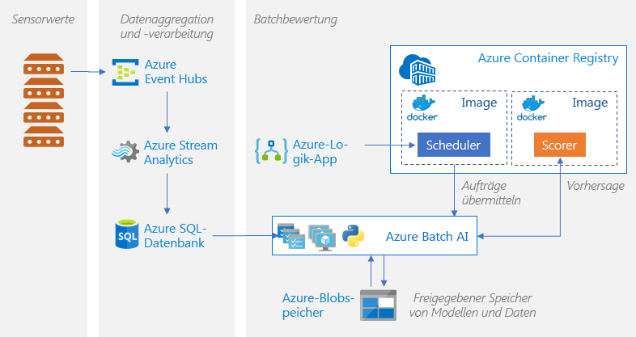
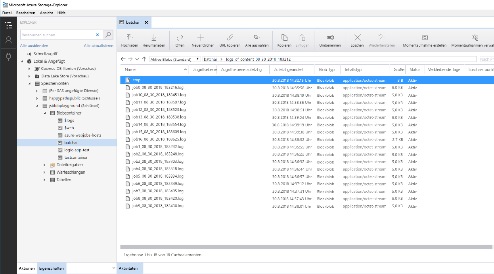

# Batchbewertung von Python-Modellen in Azure

Diese Referenzarchitektur veranschaulicht, wie Sie mit Azure Batch AI eine skalierbare Lösung für die parallele Batchbewertung vieler Modelle nach einem Zeitplan erstellen. Die Lösung kann als Vorlage genutzt und für unterschiedliche Probleme generalisiert werden.

Eine Referenzimplementierung für diese Architektur ist auf [GitHub][github] verfügbar.

**Szenario:** Diese Lösung überwacht den Betrieb einer großen Zahl von Geräten unter einer IoT-Einstellung, wobei jedes Gerät fortlaufend Sensormesswerte sendet. Es wird vorausgesetzt, dass jedes Gerät über vorab trainierte Modelle für die Anomalieerkennung verfügt, mit der Folgendes vorhergesagt werden kann: Entspricht eine Reihe von Messwerten, die für ein vordefiniertes Zeitintervall aggregiert werden, einer Anomalie? In der Praxis kann dies ein Datenstrom mit Sensormesswerten sein, die gefiltert und aggregiert werden müssen, bevor sie für das Training oder für Echtzeitbewertungen verwendet werden. Der Einfachheit halber wird für die Lösung beim Ausführen von Bewertungsaufträgen dieselbe Datendatei verwendet.

## Architecture

Diese Architektur umfasst die folgenden Komponenten:

[Azure Event Hubs][event-hubs]: Mit diesem Dienst für die Nachrichtenerfassung können Millionen von Ereignismeldungen pro Sekunde erfasst werden. In dieser Architektur senden Sensoren einen Datenstrom an den Event Hub.

[Azure Stream Analytics][stream-analytics]: Ein Modul für die Ereignisverarbeitung. Ein Stream Analytics-Auftrag liest die Datenströme aus dem Event Hub und führt die Datenstromverarbeitung durch.

[Azure Batch AI][batch-ai]: Dieses Modul für verteiltes Computing wird verwendet, um Machine Learning- und AI-Modelle in Azure bedarfsabhängig zu trainieren und zu testen. Mit Batch AI werden virtuelle Computer nach Bedarf mit einer Option für die automatische Skalierung erstellt, wobei auf jedem Knoten im Batch AI-Cluster ein Bewertungsauftrag für einen bestimmten Sensor ausgeführt wird. Das [Python-Skript][python-script] für die Bewertung wird in Docker-Containern ausgeführt, die auf jedem Knoten des Clusters erstellt werden. Hiermit werden die relevanten Sensordaten gelesen und Vorhersagen generiert und im Blobspeicher gespeichert.

[Azure Blob Storage][storage]: Blobcontainer werden zum Speichern der vorab trainierten Modelle, der Daten und der Ausgabevorhersagen verwendet. Die Modelle werden im Notebook [create\_resources.ipynb][create-resources] in den Blobspeicher hochgeladen. Diese Modelle vom Typ [Einklassige SVM][one-class-svm] werden mit Daten trainiert, die Werte unterschiedlicher Sensoren für unterschiedliche Geräte repräsentieren. Bei dieser Lösung wird davon ausgegangen, dass die Datenwerte während eines festen Zeitintervalls aggregiert werden.

[Azure Logic Apps][logic-apps]: Mit dieser Lösung wird eine Logik-App erstellt, mit der stündliche Batch AI-Aufträge ausgeführt werden. Logic Apps stellt eine einfache Möglichkeit zum Erstellen des Runtimeworkflows und der Planung für die Lösung dar. Die Batch AI-Aufträge werden mit einem Python-[Skript][script] übermittelt, das ebenfalls in einem Docker-Container ausgeführt wird.

[Azure Container Registry][acr]: Docker-Images werden sowohl in Batch AI als auch in Logic Apps verwendet und im Notebook [create\_resources.ipynb][create-resources] erstellt und dann per Pushvorgang an Container Registry übertragen. Dies ist eine bequeme Möglichkeit zum Hosten von Images und Instanziieren von Containern über andere Azure-Dienste (bei dieser Lösung sind dies Logic Apps und Batch AI).

## Überlegungen zur Leistung

Für Python-Standardmodelle sind CPUs, die zum Bewältigen der Workload ausreichen, in der Regel akzeptabel. In dieser Architektur werden CPUs verwendet. Bei [Deep Learning-Workloads][deep] bieten GPUs aber eine deutlich bessere Leistung als CPUs. In der Regel wird ein großer Cluster mit CPUs benötigt, um eine vergleichbare Leistung zu erzielen.

### Vergleich zwischen Parallelisieren auf VMs und Kernen

Beim Ausführen von Bewertungsprozessen für viele Modelle im Batchmodus müssen die Aufträge VM-übergreifend parallelisiert werden. Zwei Ansätze sind möglich:

* Erstellen eines größeren Clusters mit kostengünstigen VMs

* Erstellen eines kleineren Clusters mit Hochleistungs-VMs, die jeweils über mehr Kerne verfügen

Im Allgemeinen ist das Bewerten von Python-Standardmodellen nicht so anspruchsvoll wie das Bewerten von Deep Learning-Modellen. Mit einem kleinen Cluster sollte es möglich sein, eine große Zahl von in der Warteschlange befindlichen Modellen effizient zu verarbeiten. Sie können die Anzahl von Clusterknoten erhöhen, wenn die Größe der Datasets zunimmt.

Der Einfachheit halber wird in diesem Szenario eine Bewertungsaufgabe innerhalb von nur einem Batch AI-Auftrag übermittelt. Es kann aber auch effizienter sein, mehrere Datenblöcke innerhalb desselben Batch AI-Auftrags zu bewerten. Schreiben Sie in diesen Fällen benutzerdefinierten Code, mit dem mehrere Datasets eingelesen werden und das entsprechende Bewertungsskript während einer Ausführung des Batch AI-Auftrags ausgeführt wird.

### Dateiserver

Wenn Sie Batch AI verwenden, können Sie je nach Durchsatz, der für Ihr Szenario erforderlich ist, mehrere Speicheroptionen auswählen. Für Workloads mit geringem Durchsatz sollte die Verwendung von Blob Storage ausreichen. Alternativ unterstützt Batch AI auch einen [Batch AI-Dateiserver][bai-file-server] – ein verwaltetes NFS mit nur einem Knoten –, der automatisch auf Clusterknoten bereitgestellt werden kann, um für Aufträge einen zentral zugänglichen Speicherort zur Verfügung zu stellen. In der Regel wird in einem Arbeitsbereich nur ein Dateiserver benötigt. Sie können dann Daten für Ihre Trainingsaufträge in verschiedenen Verzeichnissen speichern.

Wenn das NFS mit nur einem Knoten für Ihre Workloads nicht geeignet ist, können Sie auch andere unterstützte Speicheroptionen von Batch AI nutzen, z.B. [Azure Files][azure-files] und benutzerdefinierte Lösungen wie ein Gluster- oder Lustre-Dateisystem.

## Überlegungen zur Verwaltung

### Überwachen von Batch AI-Aufträgen

Es ist wichtig, den Status von ausgeführten Aufträgen zu überwachen, aber es kann eine ziemliche Herausforderung darstellen, einen gesamten Cluster mit aktiven Knoten zu überwachen. Um einen Eindruck vom Gesamtzustand des Clusters zu bekommen, navigieren Sie im [Azure-Portal][portal] zum Blatt **Batch AI**, um den Zustand der Knoten im Cluster zu überprüfen. Wenn ein Knoten inaktiv oder ein Auftrag fehlgeschlagen ist, werden die Fehlerprotokolle in Blob Storage gespeichert und sind auch im Azure-Portal auf dem Blatt **Aufträge** verfügbar.

Verbinden Sie zum Durchführen einer umfassenderen Überwachung Protokolle mit [Application Insights][ai], oder führen Sie separate Prozesse aus, um den Status des Batch AI-Clusters und der zugehörigen Aufträge abzufragen.

### Protokollierung in Batch AI

Batch AI protokolliert alle stdout/stderr-Vorgänge für das zugeordnete Azure-Speicherkonto. Verwenden Sie ein Speichernavigationstool, z.B. [Azure Storage-Explorer][explorer], um die Navigation durch die Protokolldateien zu vereinfachen.

Beim Bereitstellen dieser Referenzarchitektur haben Sie die Möglichkeit, ein einfacheres Protokollierungssystem einzurichten. Mit dieser Option werden alle Protokolle für die unterschiedlichen Aufträge in demselben Verzeichnis Ihres Blobcontainers gespeichert. Dies ist unten dargestellt. Überwachen Sie anhand dieser Protokolle, wie lange die Verarbeitung der einzelnen Aufträge und Images dauert. So können Sie besser verstehen, wie der Prozess optimiert werden kann.

## Kostenbetrachtung

Die teuersten Komponenten, die in dieser Referenzarchitektur genutzt werden, sind die Computeressourcen.

Die Größe des Batch AI-Clusters wird je nach den Aufträgen in der Warteschlange zentral hoch- und herunterskaliert. Sie haben zwei Möglichkeiten, wie Sie die [automatische Skalierung][automatic-scaling] mit Batch AI aktivieren können. Bei der programmgesteuerten Variante wird sie in der ENV-Datei konfiguriert, die Teil der [Bereitstellungsschritte][github] ist. Alternativ können Sie die Skalierungsformel direkt im Portal ändern, nachdem der Cluster erstellt wurde.

Konfigurieren Sie für Aufträge, die nicht direkt verarbeitet werden müssen, die Formel für die automatische Skalierung so, dass der Standardzustand (Minimum) ein Cluster von null Knoten ist. Bei dieser Konfiguration hat der Cluster anfangs null Knoten. Er skaliert nur dann zentral hoch, wenn er Aufträge in der Warteschlange erkennt. Wenn die Batchbewertung maximal einige Male am Tag ausgeführt wird, können Sie mithilfe dieser Einstellung erheblich Kosten sparen.

Die automatische Skalierung ist ggf. nicht für Batchaufträge geeignet, die zeitlich zu nahe beieinander liegen. Für die benötigte Zeit zum Erstellen und Entfernen eines Cluster fallen ebenfalls Kosten an. Das heißt, wenn eine Batchworkload nur wenige Minuten nach dem Ende des vorherigen Auftrags startet, ist es ggf. kostengünstiger den Cluster permanent, also auch zwischen den Aufträgen, auszuführen. Dies hängt davon ab, ob die Ausführung von Bewertungsprozessen mit hoher Häufigkeit (z.B. jede Stunde) oder geringerer Häufigkeit (z.B. einmal pro Monat) geplant ist.

## Bereitstellen der Lösung

Die Referenzimplementierung dieser Architektur ist auf [GitHub][github] verfügbar. Befolgen Sie die dort angegebenen Installationsschritte zum Erstellen einer skalierbaren Lösung für das parallele Bewerten mit Batch AI.

[acr]: /azure/container-registry/container-registry-intro
[ai]: /azure/application-insights/app-insights-overview
[automatic-scaling]: /azure/batch/batch-automatic-scaling
[azure-files]: /azure/storage/files/storage-files-introduction
[batch-ai]: /azure/batch-ai/
[bai-file-server]: /azure/batch-ai/resource-concepts#file-server
[create-resources]: https://github.com/Azure/BatchAIAnomalyDetection/blob/master/create_resources.ipynb
[deep]: /azure/architecture/reference-architectures/ai/batch-scoring-deep-learning
[event-hubs]: /azure/event-hubs/event-hubs-geo-dr
[explorer]: https://azure.microsoft.com/en-us/features/storage-explorer/
[github]: https://github.com/Azure/BatchAIAnomalyDetection
[logic-apps]: /azure/logic-apps/logic-apps-overview
[one-class-svm]: http://scikit-learn.org/stable/modules/generated/sklearn.svm.OneClassSVM.html
[portal]: https://portal.azure.com
[python-script]: https://github.com/Azure/BatchAIAnomalyDetection/blob/master/batchai/predict.py
[script]: https://github.com/Azure/BatchAIAnomalyDetection/blob/master/sched/submit_jobs.py
[storage]: /azure/storage/blobs/storage-blobs-overview
[stream-analytics]: /azure/stream-analytics/
