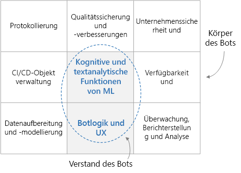

# Für Unternehmen konzipierter interaktiver BotEnterprise-grade conversational bot

Diese Referenzarchitektur beschreibt, wie Sie mit [Azure Bot Framework][bot-framework] einen für Unternehmen geeigneten interaktiven Bot (Chatbot) erstellen.This reference architecture describes how to build an enterprise-grade conversational bot (chatbot) using the [Azure Bot Framework][bot-framework]. Jeder Bot ist anders, es gibt jedoch einige allgemeine Muster, Workflows und Technologien, die Ihnen bekannt sein sollten.Each bot is different, but there are some common patterns, workflows, and technologies to be aware of. Insbesondere bei einem Bot für Unternehmensworkloads müssen neben den Kernfunktionen viele Überlegungen zum Entwurf berücksichtigt werden.Especially for a bot to serve enterprise workloads, there are many design considerations beyond just the core functionality. In diesem Artikel werden die wichtigsten Entwurfsaspekte erläutert und die erforderlichen Tools zum Erstellen eines stabilen, sicheren Bots, der aktives Lernen unterstützt, vorgestellt.This article covers the most essential design aspects, and introduces the tools needed to build a robust, secure, and actively learning bot.

[![Diagramm der Architektur][0]][0][![Diagram of the architecture][0]][0]

Bei den Hilfsprogrammbeispielen, die in dieser Architektur als bewährte Methoden verwendet werden, handelt es sich um reine Open-Source-Beispiele, die auf [GitHub][git-repo-base] verfügbar sind.The best practice utility samples used in this architecture are fully open-sourced and available on [GitHub][git-repo-base]. 

## ArchitectureArchitecture

Die hier gezeigte Architektur verwendet die folgenden Azure-Dienste.The architecture shown here uses the following Azure services. Ihr Bot kann beliebig viele dieser Dienste nutzen, und zudem können Sie zusätzliche Dienste einbinden.Your own bot may not use all of these services, or may incorporate additional services.

### Botlogik und BenutzererfahrungBot logic and user experience

- **[Bot Framework-Dienst][bot-framework-service]** (Bot Framework Service, BFS).**[Bot Framework Service][bot-framework-service]** (BFS). Dieser Dienst verbindet Ihren Bot mit einer Kommunikations-App wie Cortana, Facebook Messenger oder Slack.This service connects your bot to a communication app such as Cortana, Facebook Messenger, or Slack. Er ermöglicht die Kommunikation zwischen Ihrem Bot und dem Benutzer.It facilitates communication between your bot and the user.
- **[Azure App Service][app-service]**.**[Azure App Service][app-service]**. Die Anwendungslogik des Bots wird in Azure App Service gehostet.The bot application logic is hosted in Azure App Service.

### Kognitive und intelligente Funktionen des BotsBot cognition and intelligence

- **[Language Understanding Intelligent Service][luis]** (LUIS).**[Language Understanding][luis]** (LUIS). LUIS ist Teil von [Azure Cognitive Services][cognitive-services]. Der Dienst identifiziert Absichten des Benutzers sowie Entitäten und ermöglicht Ihrem Bot so das Verständnis natürliche Sprache.Part of [Azure Cognitive Services][cognitive-services], LUIS enables your bot to understand natural language by identifying user intents and entities.
- **[Azure Search][search]**.**[Azure Search][search]**. Search ist ein verwalteter Dienst, der einen schnell durchsuchbaren Dokumentindex bereitstellt.Search is a managed service that provides a quick searchable document index.
- **[QnA Maker][qna-maker]**.**[QnA Maker][qna-maker]**. QnA Maker ist ein cloudbasierter API-Dienst, mit dem eine Frage-und-Antwort-Ebene im Konversationsstil für Ihre Daten erstellt wird.QnA Maker is a cloud-based API service that creates a conversational, question-and-answer layer over your data. In der Regel werden teilweise strukturierte Inhalte wie häufig gestellte Fragen (Frequently Asked Questions, FAQs) in den Dienst geladen.Typically, it's loaded with semi-structured content such as FAQs. Verwenden Sie QnA Maker, um eine Wissensdatenbank zum Beantworten von Fragen in natürlicher Sprache zu erstellen.Use it to create a knowledge base for answering natural-language questions.
- **[Web-App][webapp]**.**[Web app][webapp]**. Wenn Ihr Bot KI-Lösungen (künstliche Intelligenz) erfordert, die nicht von einem vorhandenen Dienst bereitgestellt werden, können Sie Ihre eigene benutzerdefinierte KI implementieren und als Web-App hosten.If your bot needs AI solutions not provided by an existing service, you can implement your own custom AI and host it as a web app. Dadurch erhalten Sie einen Webendpunkt, der von Ihrem Bot aufgerufen werden kann.This provides a web endpoint for your bot to call.

### DatenerfassungData ingestion

Der Bot basiert auf Rohdaten, die erfasst und vorbereitet werden müssen.The bot will rely on raw data that must be ingested and prepared. Folgende Optionen stehen Ihnen zum Orchestrieren dieses Prozesses zur Auswahl:Consider any of the following options to orchestrate this process:

- **[Azure Data Factory][data-factory]**.**[Azure Data Factory][data-factory]**. Data Factory orchestriert und automatisiert die Datenverschiebung und -transformation.Data Factory orchestrates and automates data movement and data transformation.
- **[Logic Apps][logic-apps]**.**[Logic Apps][logic-apps]**. Logic Apps ist eine serverlose Plattform zum Erstellen von Workflows, die Anwendungen, Daten und Dienste integrieren.Logic Apps is a serverless platform for building workflows that integrate applications, data, and services. Logic Apps bietet Datenconnectors für viele Anwendungen, einschließlich Office 365.Logic Apps provides data connectors for many applications, including Office 365.
- **[Azure Functions][functions]**.**[Azure Functions][functions]**. Mit Azure Functions können Sie benutzerdefinierten serverlosen Code schreiben, der von einem [Trigger][functions-triggers]&mdash; aufgerufen wird (z. B. jedes Mal, wenn ein Dokument in Blob Storage oder Cosmos DB hinzugefügt wird).You can use Azure Functions to write custom serverless code that is invoked by a [trigger][functions-triggers] &mdash; for example, whenever a document is added to blob storage or Cosmos DB.

### Protokollierung und ÜberwachungLogging and monitoring

- **[Application Insights][app-insights]**.**[Application Insights][app-insights]**. Mit Application Insights können Sie Anwendungsmetriken zur Überwachung und Diagnose sowie für analytische Zwecke protokollieren.Use Application Insights to log the bot's application metrics for monitoring, diagnostic, and analytical purposes.
- **[Azure Blob Storage][blob]**.**[Azure Blob Storage][blob]**. Blobspeicher ist für die Speicherung großer Mengen unstrukturierter Daten optimiert.Blob storage is optimized for storing massive amounts of unstructured data.
- **[Cosmos DB][cosmosdb]**.**[Cosmos DB][cosmosdb]**. Cosmos DB eignet sich gut zum Speichern von teilweise strukturierten Daten wie Konversationen.Cosmos DB is well-suited for storing semi-structured log data such as conversations.
- **[Power BI][power-bi]**.**[Power BI][power-bi]**. Verwenden Sie Power BI, um Überwachungsdashboards für Ihren Bot zu erstellen.Use Power BI to create monitoring dashboards for your bot.

### Sicherheit und GovernanceSecurity and governance

- **[Azure Active Directory][aad]** (Azure AD).**[Azure Active Directory][aad]** (Azure AD). Benutzer werden über einen Identitätsanbieter wie Azure AD authentifiziert.Users will authenticate through an identity provider such as Azure AD. Der Bot Service ist für den Authentifizierungsflow und die Verwaltung der OAuth-Token zuständig.The Bot Service handles the authentication flow and OAuth token management. Siehe [Hinzufügen von Authentifizierung zu Ihrem Bot über Azure Bot Service][bot-authentication].See [Add authentication to your bot via Azure Bot Service][bot-authentication].
- **[Azure Key Vault][key-vault]**.**[Azure Key Vault][key-vault]**. Speichern Sie Anmeldeinformationen und andere Geheimnisse mithilfe von Key Vault.Store credentials and other secrets using Key Vault.

### Qualitätssicherung und VerbesserungenQuality assurance and enhancements

- **[Azure DevOps][devops]****[Azure DevOps][devops]**. bietet viele Dienste für die Verwaltung von Apps, darunter Quellcodeverwaltung, Erstellung, Tests, Bereitstellung und Projektnachverfolgung.Provides many services for app management, including source control, building, testing, deployment, and project tracking.
- **[VS Code][vscode]** ist ein reduzierter Code-Editor für die App-Entwicklung.**[VS Code][vscode]** A lightweight code editor for app development. Sie können eine beliebige andere integrierte Entwicklungsumgebung (Integrated Development Environment, IDE) mit ähnlichen Features verwenden.You can use any other IDE with similar features.

## Überlegungen zum EntwurfDesign considerations

Allgemein betrachtet lässt sich ein interaktiver Bot in die Botfunktionalität (das „Gehirn“) und eine Gruppe von umgebenden Anforderungen (den „Körper“) unterteilen.At a high level, a conversational bot can be divided into the bot functionality (the "brain") and a set of surrounding requirements (the "body"). Die Botfunktionalität umfasst die domänenfähigen Komponenten, einschließlich der Botlogik und ML-Funktionen (Machine Learning).The brain includes the domain-aware components, including the bot logic and ML capabilities. Andere Komponenten sind domänenagnostisch und dienen für nicht funktionsbezogenen Anforderungen, z. B. CI/CD, Qualitätssicherung und Sicherheit.Other components are domain agnostic and address non-functional requirements such as CI/CD, quality assurance, and security.

Bevor wir uns mit den Details dieser Architektur befassen, werfen wir einen Blick auf den Datenfluss durch die einzelnen Unterkomponenten des Entwurfs.Before getting into the specifics of this architecture, let's start with the data flow through each subcomponent of the design. Der Datenfluss umfasst vom Benutzer initiierte und vom System initiierte Datenflüsse.The data flow includes user-initiated and system-initiated data flows.

### BenutzernachrichtenflussUser message flow

**Authentifizierung**.**Authentication**. Benutzer authentifizieren sich zunächst anhand des von ihrem Kommunikationskanal bereitgestellten Mechanismus beim Bot.Users start by authenticating themselves using whatever mechanism is provided by their channel of communication with the bot. Bot Framework unterstützt viele Kommunikationskanäle, einschließlich Cortana, Microsoft Teams, Facebook Messenger, Kik und Slack.The bot framework supports many communication channels, including Cortana, Microsoft Teams, Facebook Messenger, Kik, and Slack. Eine Liste der Kanäle finden Sie unter [Verbinden eines Bots mit Kanälen](/azure/bot-service/bot-service-manage-channels).For a list of channels, see [Connect a bot to channels](/azure/bot-service/bot-service-manage-channels). Wenn Sie einen Bot mit Azure Bot Service erstellen, wird der [Webchatkanal][webchat] automatisch konfiguriert.When you create a bot with Azure Bot Service, the [Web Chat][webchat] channel is automatically configured. Über diesen Kanal können Benutzer direkt auf einer Webseite mit Ihrem Bot interagieren.This channel allows users to interact with your bot directly in a web page. Sie können den Bot mithilfe des [Direct Line](/azure/bot-service/bot-service-channel-connect-directline)-Kanals auch mit einer benutzerdefinierten App verbinden.You can also connect the bot to a custom app by using the [Direct Line](/azure/bot-service/bot-service-channel-connect-directline) channel. Die Identität des Benutzers wird verwendet, um die rollenbasierte Zugriffssteuerung und personalisierte Inhalte bereitzustellen.The user's identity is used to provide role-based access control, as well as to serve personalized content.

**Benutzernachricht**.**User message**. Nach der Authentifizierung sendet der Benutzer eine Nachricht an den Bot.Once authenticated, the user sends a message to the bot. Der Bot liest die Nachricht und leitet sie an einen Dienst weiter, der natürliche Sprache versteht (beispielsweise [LUIS](/azure/cognitive-services/luis/)).The bot reads the message and routes it to a natural language understanding service such as [LUIS](/azure/cognitive-services/luis/). In diesem Schritt werden die **Absichten** (was der Benutzer tun möchte) und **Entitäten** (die Dinge, für die sich der Benutzer interessiert) ermittelt.This step gets the **intents** (what the user wants to do) and **entities** (what things the user is interested in). Der Bot erstellt dann eine Abfrage und übergibt sie an einen Dienst, der Informationen bereitstellt, beispielsweise [Azure Search][search] für den Dokumentabruf, [QnA Maker](https://www.qnamaker.ai/) für häufig gestellte Fragen oder eine benutzerdefinierte Wissensdatenbank.The bot then builds a query that it passes to a service that serves information, such as [Azure Search][search] for document retrieval, [QnA Maker](https://www.qnamaker.ai/) for FAQs, or a custom knowledge base. Anhand dieser Ergebnisse erstellt der Bot eine Antwort.The bot uses these results to construct a response. Um das bestmögliche Ergebnis für eine bestimmte Abfrage bereitzustellen, führt der Bot möglicherweise mehrere Aufrufe zwischen diesen Remotediensten aus.To give the best result for a  given query, the bot might make several back-and-forth calls to these remote services.

**Antwort**.**Response**. Der Bot hat die beste Antwort bestimmt und sendet sie nun an den Benutzer.At this point, the bot has determined the best response and sends it to the user. Wenn die Zuverlässigkeitsbewertung der besten Antwort niedrig ist, ist die Antwort u. U. eine Frage zur Klärung von Mehrdeutigkeiten oder eine Bestätigung, dass der Bot nicht angemessen antworten konnte.If the confidence score of the best-matched answer is low, the response might be a disambiguation question or an acknowledgement that the bot could not reply adequately.

**Protokollierung**:**Logging**. Wenn eine Benutzeranforderung empfangen oder eine Antwort gesendet wird, sollten alle Konversationsaktionen zusammen mit Leistungsmetriken und allgemeinen Fehlern von externen Diensten in einem Protokollspeicher protokolliert werden.When a user request is received or a response is sent, all conversation actions should be logged to a logging store, along with performance metrics and general errors from external services. Diese Protokolle sind später hilfreich beim Diagnostizieren von Problemen und Verbessern des Systems.These logs will be useful later when diagnosing issues and improving the system.

**Feedback**.**Feedback**. Eine weitere bewährte Methode ist das Erfassen von Feedback und Zufriedenheitsbewertungen der Benutzer.Another good practice is to collect user feedback and satisfaction scores. Als Folgeaktion sollte der Bot den Benutzer nach dem Senden der endgültigen Antwort auffordern, seine Zufriedenheit mit der Antwort zu bewerten.As a follow up to the bot's final response, the bot should ask the user to rate their satisfaction with the reply. Feedback kann Ihnen dabei helfen, das Kaltstartproblem beim Verstehen natürlicher Sprache zu beheben und die Genauigkeit von Antworten kontinuierlich zu verbessern.Feedback can help you to solve the cold start problem of natural language understanding, and continually improve the accuracy of responses.

### SystemdatenflussSystem Data Flow

**ETL (Extrahieren, Transformieren und Laden)**.**ETL**. Die Informationen und das Wissen, auf denen der Bot beruht, werden von einem ETL-Prozess im Back-End aus den Rohdaten extrahiert.The bot relies on information and knowledge extracted from the raw data by an ETL process in the backend. Diese Daten können strukturiert (SQL-Datenbank), teilweise strukturiert (CRM-System, häufig gestellte Fragen) oder unstrukturiert (Word-Dokumente, PDF-Dateien, Webprotokolle) sein.This data might be structured (SQL database), semi-structured (CRM system, FAQs), or unstructured (Word documents, PDFs, web logs). Ein ETL-Subsystem extrahiert die Daten nach einem festen Zeitplan.An ETL subsystem extracts the data on a fixed schedule. Der Inhalt wird transformiert und angereichert und anschließend in einen Zwischendatenspeicher wie Cosmos DB oder Azure Blob Storage geladen.The content is transformed and enriched, then loaded into an intermediary data store, such as Cosmos DB or Azure Blob Storage.

Daten im Zwischenspeicher werden dann für den Dokumentabruf in Azure Search indiziert, in QnA Maker geladen, um Frage- und Antwort-Paare zu erstellen, oder in eine benutzerdefinierte Web-App zur Verarbeitung von unstrukturiertem Text geladen.Data in the intermediary store is then indexed into Azure Search for document retrieval, loaded into QnA Maker to create question and answer pairs, or loaded into a custom web app for unstructured text processing. Die Daten werden auch verwendet, um ein LUIS-Modell zum Extrahieren von Absichten und Entitäten zu trainieren.The data is also used to train a LUIS model for intent and entity extraction.

**Qualitätssicherung**.**Quality assurance**. Die Konversationsprotokolle werden zum Diagnostizieren und Beheben von Fehlern verwendet, liefern Erkenntnisse zur Nutzung des Bots und dienen zur Nachverfolgung der Gesamtleistung.The conversation logs are used to diagnose and fix bugs, provide insight into how the bot is being used, and track overall performance. Feedbackdaten können für das erneute Trainieren der KI-Modelle zum Verbessern der Leistung des Bots hilfreich sein.Feedback data is useful for retraining the AI models to improve bot performance.

## Erstellen eines BotsBuilding a bot

Bevor Sie auch nur eine einzige Zeile Code schreiben, sollten Sie unbedingt eine Funktionsspezifikation verfassen, damit das Entwicklungsteam eine klare Vorstellung davon hat, welche Funktionen vom Bot erwartet werden.Before you even write a single line of code, it's important to write a functional specification so the development team has a clear idea of what the bot is expected to do. Die Spezifikation sollte eine angemessen umfassende Liste von Benutzereingaben und erwarteten Botantworten in verschiedenen Wissensgebieten enthalten.The specification should include a reasonably comprehensive list of user inputs and expected bot responses in various knowledge domains. Dieses dynamische Dokument ist ein wertvoller Leitfaden für das Entwickeln und Testen Ihres Bots.This living document will be an invaluable guide for developing and testing your bot.

### Erfassen von DatenIngest data

Identifizieren Sie anschließend die Datenquellen, die dem Bot die intelligente Interaktion mit Benutzern ermöglichen.Next, identify the data sources that will enable the bot to interact intelligently with users. Wie bereits erwähnt, können diese Datenquellen strukturierte, teilweise strukturierte oder unstrukturierte Datasets enthalten.As mentioned earlier, these data sources could contain structured, semi-structured, or unstructured data sets. Es empfiehlt sich, zu Beginn eine einmalige Kopie der Daten in einem zentralen Speicher (z. B. Cosmos DB oder Azure Storage) zu erstellen.When you're getting started, a good approach is to make a one-off copy of the data to a central store, such as Cosmos DB or Azure Storage. Wenn die Erstellung Ihres Bots voranschreitet, sollten Sie eine automatisierte Datenerfassungspipeline erstellen, damit diese Daten stets aktuell sind.As you progress, you should create an automated data ingestion pipeline to keep this data current. Zu den verfügbaren Optionen für eine automatisierte Erfassungspipeline zählen Data Factory, Functions und Logic Apps.Options for an automated ingestion pipeline include Data Factory, Functions, and Logic Apps. Je nach Datenspeichern und Schemas können Sie eine Kombination dieser Ansätze nutzen.Depending on the data stores and the schemas, you might use a combination of these approaches.

Bei den ersten Schritten ist es sinnvoll, Azure-Ressourcen manuell im Azure-Portal zu erstellen.As you get started, it's reasonable to use the Azure portal to manually create Azure resources. Später sollten Sie erwägen, die Bereitstellung dieser Ressourcen zu automatisieren.Later on, you should put more thought into automating the deployment of these resources.

### Kernlogik und Benutzererfahrung (User Experience, UX) des BotsCore bot logic and UX

Sobald Sie eine Spezifikation erstellt haben und über einige Daten verfügen, ist es an der Zeit, mit der Realisierung Ihres Bots zu beginnen.Once you have a specification and some data, it's time to start making your bot into reality. Konzentrieren wir uns auf die Kernlogik des Bots.Let's focus on the core bot logic. Hierbei handelt es sich um den Code, der die Konversation mit dem Benutzer verwaltet, einschließlich der Routinglogik, der Mehrdeutigkeitsvermeidungslogik und Protokollierung.This is the code that handles the conversation with the user, including the routing logic, disambiguation logic, and logging. Machen Sie sich zunächst mit [Bot Framework][bot-framework] und Folgendem vertraut:Start by familiarizing yourself with the [Bot Framework][bot-framework], including:

- Grundlegende Konzepte und Terminologie des Frameworks, insbesondere [Konversationen], [Turns] und [Aktivitäten]Basic concepts and terminology used in the framework, especially [conversations], [turns], and [activities].
- Dem [Bot-Connectordienst](/azure/bot-service/rest-api/bot-framework-rest-connector-quickstart), der die Netzwerkverbindung zwischen dem Bot und Ihren Kanälen verwaltetThe [Bot Connector service](/azure/bot-service/rest-api/bot-framework-rest-connector-quickstart), which handles the networking between the bot and your channels.
- Der Beibehaltung des [Konversationszustands](/azure/bot-service/bot-builder-concept-state) im Arbeitsspeicher oder besser noch in einem Speicher wie Azure Blob Storage oder Azure Cosmos DBHow conversation [state](/azure/bot-service/bot-builder-concept-state) is maintained, either in memory or better yet in a store such as Azure Blob Storage or Azure Cosmos DB.
- [Middleware](/azure/bot-service/bot-builder-basics#middleware) und deren Verwendung zum Verbinden Ihres Bots mit externen Diensten wie Cognitive Services[Middleware](/azure/bot-service/bot-builder-basics#middleware), and how it can be used to hook up your bot with external services, such as Cognitive Services.

Zum Bereitstellen einer umfassenden [Benutzererfahrung](/azure/bot-service/bot-service-design-user-experience) stehen zahlreiche Optionen zur Verfügung.For a rich [user experience](/azure/bot-service/bot-service-design-user-experience), there are many options.

- Sie können [Karten](/azure/bot-service/bot-service-design-user-experience#cards) verwenden, um Schaltflächen, Bilder, Karusselle und Menüs einzubinden.You can use [cards](/azure/bot-service/bot-service-design-user-experience#cards) to include buttons, images, carousels, and menus.
- Ein Bot kann die Spracherkennung unterstützen.A bot can support speech.
- Sie können Ihren Bot sogar in eine App oder Website einbetten und die Funktionen der hostenden App nutzen.You can even embed your bot in an app or website and use the capabilities of the app hosting it.

Zum Einstieg können Sie Ihren Bot online mit dem [Azure Bot Service](/azure/bot-service/bot-service-quickstart) anhand der verfügbaren C#- und Node.js-Vorlagen erstellen.To get started, you can build your bot online using the [Azure Bot Service](/azure/bot-service/bot-service-quickstart), selecting from the available C# and Node.js templates. Wenn Ihr Bot komplexer wird, müssen Sie ihn jedoch lokal erstellen und anschließend im Web bereitstellen.As your bot gets more sophisticated, however, you will need to create your bot locally then deploy it to the web. Wählen Sie eine IDE wie Visual Studio oder Visual Studio Code und eine Programmiersprache aus.Choose an IDE, such as Visual Studio or Visual Studio Code, and a programming language. SDKs sind für folgende Programmiersprachen verfügbar:SDKs are available for the following languages:

- [C#C#](https://github.com/microsoft/botbuilder-dotnet)
- [JavaScriptJavaScript](https://github.com/microsoft/botbuilder-js)
- [Java](https://github.com/microsoft/botbuilder-java) (Vorschauversion)[Java](https://github.com/microsoft/botbuilder-java) (preview)
- [Python](https://github.com/microsoft/botbuilder-python) (Vorschauversion)[Python](https://github.com/microsoft/botbuilder-python) (preview)

Als Startpunkt können Sie den Quellcode für den mit dem Azure Bot Service erstellten Bot herunterladen.As a starting point, you can download the source code for the bot you created using the Azure Bot Service. Es ist auch [Beispielcode](https://github.com/Microsoft/BotBuilder-Samples/blob/master/README.md) für verschiedene Bottypen verfügbar, von einfachen Echobots bis hin zu komplexeren, in verschiedene KI-Dienste integrierten Bots.You can also find [sample code](https://github.com/Microsoft/BotBuilder-Samples/blob/master/README.md), from simple echo bots to more sophisticated bots that integrate with various AI services.

### Hinzufügen von intelligenten Funktionen zum BotAdd smarts to your bot

Bei einem einfachen Bot mit einer klar definierten Liste von Befehlen können Sie möglicherweise einen regelbasierten Ansatz verwenden, um die Benutzereingabe über RegEx zu analysieren.For a simple bot with a well-defined list of commands, you might be able to use a rules-based approach to parse the user input via regex. Dieser Ansatz hat den Vorteil, dass er deterministisch und verständlich ist.This has the advantage of being deterministic and understandable. Wenn Ihr Bot jedoch die Absichten und Entitäten in einer Nachricht in natürlicherer Sprache verstehen muss, können Sie auf KI-Dienste zurückgreifen.However, when your bot needs to understand the intents and entities of a more natural-language message, there are AI services that can help.

- LUIS wurde eigens dafür entwickelt, Absichten des Benutzers und Entitäten zu verstehen.LUIS is specifically designed to understand user intents and entities. LUIS wird mit einer mittelgroßen Sammlung von relevanten [Benutzereingaben](/azure/cognitive-services/luis/luis-concept-utterance) und gewünschten Antworten trainiert und gibt die Absichten und Entitäten für eine bestimmte Benutzernachricht zurück.You train it with a moderately sized collection of relevant [user input](/azure/cognitive-services/luis/luis-concept-utterance) and desired responses, and it returns the intents and entities for a user's given message.

- Azure Search kann zusammen mit LUIS eingesetzt werden.Azure Search can work alongside LUIS. Mithilfe von Search erstellen Sie durchsuchbare Indizes für alle relevanten Daten.Using Search, you create searchable indexes over all relevant data. Der Bot fragt diese Indizes für die von LUIS extrahierten Entitäten ab.The bot queries these indexes for the entities extracted by LUIS. Azure Search unterstützt auch [Synonyme][synonyms] und bietet dadurch die Möglichkeit, die Auswahl an korrekten Wortzuordnungen zu erweitern.Azure Search also supports [synonyms][synonyms], which can widen the net of correct word mappings.

- QnA Maker ist ein weiterer Dienst, der Antworten für bestimmte Fragen zurückgibt.QnA Maker is another service that is designed to return answers for given questions. Der Dienst wird in der Regel mit teilweise strukturierten Daten wie häufig gestellten Fragen trainiert.It's typically trained over semi-structured data such as FAQs.

Ihr Bot kann auch andere KI-Dienste nutzen, um die Benutzererfahrung zu verbessern.Your bot can use other AI services to further enrich the user experience. Die [Cognitive Services-Suite vorgefertigter KI](https://azure.microsoft.com/en-us/services/cognitive-services/?v=18.44a)-Dienste (beinhaltet LUIS und QnA Maker) umfasst Dienste für Bildanalyse, Spracherkennung, Suche und Standorterkennung.The [Cognitive Services suite of pre-built AI](https://azure.microsoft.com/en-us/services/cognitive-services/?v=18.44a) services (which includes LUIS and QnA Maker) has services for vision, speech, language, search, and location. Sie können schnell Funktionen wie Sprachübersetzung, Rechtschreibprüfung, Stimmungsanalyse, optische Zeichenerkennung (Optical Character Recognition, OCR), Standorterkennung und Inhaltsmoderation hinzufügen.You can quickly add functionality such as language translation, spell checking, sentiment analysis, OCR, location awareness, and content moderation. Diese Dienste können als Middlewaremodule in Ihrem Bot eingerichtet werden, um auf natürlichere und intelligentere Weise mit dem Benutzer zu interagieren.These services can be wired up as middleware modules in your bot to interact more naturally and intelligently with the user.

Eine weitere Option ist die Integration eines eigenen benutzerdefinierten KI-Diensts.Another option is to integrate your own custom AI service. Dieser Ansatz ist komplexer, bietet Ihnen jedoch vollständige Flexibilität in Bezug auf den Machine Learning-Algorithmus, das Training und das Modell.This approach is more complex, but gives you complete flexibility in terms of the machine learning algorithm, training, and model. Sie können beispielsweise Ihre eigene Themenmodellierung implementieren und einen Algorithmus wie [LDA][lda] verwenden, um nach ähnlichen oder relevanten Dokumenten zu suchen.For example, you could implement your own topic modeling and use algorithm such as [LDA][lda] to find similar or relevant documents. Ein guter Ansatz ist es, Ihre benutzerdefinierte KI-Lösung als Webdienstendpunkt verfügbar zu machen und den Endpunkt über die Kernlogik des Bots aufzurufen.A good approach is to expose your custom AI solution as a web service endpoint, and call the endpoint from the core bot logic. Der Webdienst kann in App Service oder in einem VM-Cluster gehostet werden.The web service could be hosted in App Service or in a cluster of VMs. [Azure Machine Learning][aml] bietet eine Reihe von Diensten und Bibliotheken, die Sie beim [Trainieren](https://github.com/Azure/MachineLearningNotebooks/tree/master/how-to-use-azureml/training) und [Bereitstellen](https://github.com/Azure/MachineLearningNotebooks/tree/master/how-to-use-azureml/deployment) Ihrer Modelle unterstützen.[Azure Machine Learning][aml] provides a number of services and libraries to assist you in [training](https://github.com/Azure/MachineLearningNotebooks/tree/master/how-to-use-azureml/training) and [deploying](https://github.com/Azure/MachineLearningNotebooks/tree/master/how-to-use-azureml/deployment) your models.

## Qualitätssicherung und VerbesserungQuality assurance and enhancement

**Protokollierung**:**Logging**. Protokollieren Sie Benutzerkonversationen mit dem Bot sowie die zugrunde liegenden Leistungsmetriken und etwaige Fehler.Log user conversations with the bot, including the underlying performance metrics and any errors. Diese Protokolle liefern wertvolle Informationen für das Debuggen von Problemen, Verstehen von Benutzerinteraktionen und Verbessern des Systems.These logs will prove invaluable for debugging issues, understanding user interactions, and improving the system. Für die unterschiedlichen Protokolltypen können verschiedene Datenspeicher zweckmäßig sein.Different data stores might be appropriate for different types of logs. Erwägen Sie beispielsweise die Verwendung von Application Insights für Webprotokolle, Cosmos DB für Konversationen und Azure Storage für große Nutzlasten.For example, consider Application Insights for web logs, Cosmos DB for conversations, and Azure Storage for large payloads. Weitere Informationen finden Sie unter [Direktes Schreiben in Azure Storage][transcript-storage].See [Write directly to Azure Storage][transcript-storage].

**Feedback**.**Feedback**. Zu wissen, wie zufrieden Benutzer mit ihren Botinteraktionen sind, ist ebenfalls wichtig.It's also important to understand how satisfied users are with their bot interactions. Wenn Sie einen Datensatz mit Benutzerfeedback haben, können Sie Ihre Aktivitäten mithilfe dieser Daten auf die Verbesserung bestimmter Interaktionen ausrichten und die KI-Modelle zum Verbessern der Leistung erneut trainieren.If you have a record of user feedback, you can use this data to focus your efforts on improving certain interactions and retraining the AI models for improved performance. Verwenden Sie das Feedback zum erneuten Trainieren der Modelle (z. B. LUIS) in Ihrem System.Use the feedback to retrain the models, such as LUIS, in your system.

**Testen**.**Testing**. Das Testen eines Bots umfasst Komponententests, Integrationstests, Regressionstests und Funktionstests.Testing a bot involves unit tests, integration tests, regression tests, and functional tests. Wir empfehlen, zum Testen echte HTTP-Antworten von externen Diensten wie Azure Search oder QnA Maker aufzuzeichnen. Diese Antworten können dann bei Komponententests wiedergegeben werden, ohne tatsächliche Netzwerkaufrufe an externe Dienste durchzuführen.For testing, we recommend recording real HTTP responses from external services, such as Azure Search or QnA Maker, so they can be played back during unit testing without needing to make real network calls to external services.

>[!NOTE]
> Sehen Sie sich die [Botbuilder-Hilfsprogramme für JavaScript][git-repo-base] an, die Ihnen bei der Entwicklung in diesen Bereichen als Einstiegshilfe dienen.To jump-start your development in these areas, look at the [Botbuilder Utils for JavaScript][git-repo-base]. Das Repository enthält Hilfsprogramm-Beispielcode für Bots, die mit [Microsoft Bot Framework v4][bot-framework] erstellt werden und Node.js ausführen.This repo contains sample utility code for bots built with [Microsoft Bot Framework v4][bot-framework] and running Node.js. Es enthält die folgenden Pakete:It includes the following packages:
>
> - [Cosmos DB-Protokollspeicher][cosmosdb-logger]:[Cosmos DB Logging Store][cosmosdb-logger]. Zeigt, wie Botprotokolle in Cosmos DB gespeichert und abgefragt werden.Shows how to store and query bot logs in Cosmos DB.
> - [Application Insights-Protokollspeicher][appinsights-logger]:[Application Insights Logging Store][appinsights-logger]. Zeigt, wie Botprotokolle in Application Insights gespeichert und abgefragt werden.Shows how to store and query bot logs in Application Insights.
> - [Feedback Collection Middleware][feedback-util] (Middleware zur Feedbackerfassung):[Feedback Collection Middleware][feedback-util]. Beispielmiddleware mit einem Mechanismus zum Anfordern von Feedback von Botbenutzern.Sample middleware that provides a bot user feedback-request mechanism.
> - [Http Test Recorder][testing util] (HTTP-Testaufzeichnung):[Http Test Recorder][testing util]. Zeichnet HTTP-Datenverkehr von Diensten auf, die außerhalb des Bots verwendet werden.Records HTTP traffic from services external to the bot. Das Paket umfasst vordefinierte Unterstützung für LUIS, Azure Search und QnAMaker, es sind jedoch Erweiterungen zur Unterstützung beliebiger Dienste verfügbar.It comes pre-built with support for LUIS, Azure Search, and QnAMaker, but extensions are available to support any service. Dies dient Ihnen als Hilfe beim Automatisieren von Bot-Tests.This helps you automate bot testing.
>
> Diese Pakete werden als Hilfsprogramm-Beispielcode ohne Garantie hinsichtlich Support oder Updates bereitgestellt.These packages are provided as utility sample code, and come with no guarantee of support or updates.

## Überlegungen zur VerfügbarkeitAvailability considerations

Wenn Sie neue Features oder Fehlerbehebungen für Ihren Bot einführen, empfiehlt sich die Verwendung mehrerer Bereitstellungsumgebungen (z. B. Staging und Produktion).As you roll out new features or bug fixes to your bot, it's best to use multiple deployment environments, such as staging and production. Mithilfe der [Bereitstellungsslots][slots] von [Azure DevOps][devops] ist dies ohne Downtime möglich.Using deployment [slots][slots] from [Azure DevOps][devops] allows you to do this with zero downtime. Sie können Ihre neuesten Aktualisierungen in der Stagingumgebung testen, bevor Sie sie in der Produktionsumgebung bereitstellen.You can test your latest upgrades in the staging environment before swapping them to the production environment. In Bezug auf die Verarbeitung der Last ist App Service für manuelles oder automatisches zentrales Hochskalieren konzipiert.In terms of handling load, App Service is designed to scale up or out manually or automatically. Da Ihr Bot in der globalen Rechenzentrumsinfrastruktur von Microsoft gehostet wird, garantiert die App Service-SLA Hochverfügbarkeit.Because your bot is hosted in Microsoft's global datacenter infrastructure, the App Service SLA promises high availability.

## SicherheitshinweiseSecurity considerations

Wie jede andere Anwendung kann der Bot sensible Daten verarbeiten.As with any other application, the bot can be designed to handle sensitive data. Daher müssen die Benutzer, die sich anmelden und den Bot nutzen können, eingeschränkt werden.Therefore, restrict who can sign in and use the bot. Schränken Sie auch die Daten, auf die zugegriffen werden kann, basierend auf der Identität oder Rolle des Benutzers ein.Also limit which data can be accessed, based on the user's identity or role. Verwenden Sie Azure AD für die Identitäts- und Zugriffsteuerung und Key Vault zum Verwalten von Schlüsseln und Geheimnissen.Use Azure AD for identity and access control and Key Vault to manage keys and secrets.

## Überlegungen zur VerwaltbarkeitManageability considerations

### Überwachung und BerichterstellungMonitoring and reporting

Wenn Ihr Bot in der Produktionsumgebung ausgeführt wird, benötigen Sie ein DevOps-Team, das für eine gleichbleibend hohe Leistung und einen unterbrechungsfreien Betrieb des Bots sorgt.Once your bot is running in production, you will need a DevOps team to keep it that way. Überwachen Sie das System lückenlos, um sicherzustellen, dass der Bot mit optimaler Leistung arbeitet.Continually monitor the system to ensure the bot operates at peak performance. Verwenden Sie die an Application Insights oder Cosmos DB gesendeten Protokolle, um mithilfe von Application Insights selbst oder mit Power BI Überwachungsdashboards oder ein benutzerdefiniertes Web-App-Dashboard zu erstellen.Use the logs sent to Application Insights or Cosmos DB to create monitoring dashboards, either using Application Insights itself, Power BI, or a custom web app dashboard. Senden Sie Benachrichtigungen an das DevOps-Team, wenn schwerwiegende Fehler auftreten oder die Leistung unter einen akzeptablen Schwellenwert fällt.Send alerts to the DevOps team if critical errors occur or performance falls below an acceptable threshold.

### Automatisierte Bereitstellung von RessourcenAutomated resource deployment

Der Bot selbst ist nur ein Teil eines größeren Systems, das den Bot mit den neuesten Daten versorgt und seinen ordnungsgemäßen Betrieb sicherstellt.The bot itself is only part of a larger system that provides it with the latest data and ensures its proper operation. All diese anderen Azure-Ressourcen &mdash; Datenorchestrierungsdienste wie Data Factory, Speicherdienste wie Cosmos DB usw. &mdash; müssen bereitgestellt werden.All of these other Azure resources &mdash; data orchestration services such as Data Factory, storage services such as Cosmos DB, and so forth &mdash; must be deployed. Azure Resource Manager bietet eine einheitliche Verwaltungsebene, auf die Sie über das Azure-Portal, PowerShell oder die Azure-Befehlszeilenschnittstelle (Azure CLI) zugreifen können.Azure Resource Manager provides a consistent management layer that you can access through the Azure portal, PowerShell, or the Azure CLI. Aus Gründen der Geschwindigkeit und Konsistenz empfiehlt es sich, die Bereitstellung mit einem dieser Ansätze zu automatisieren.For speed and consistency, it's best to automate your deployment using one of these approaches.

### Kontinuierliche BotbereitstellungContinuous bot deployment

Sie können die Botlogik direkt über die IDE oder über eine Befehlszeile wie die Azure CLI bereitstellen.You can deploy the bot logic directly from your IDE or from a command line, such as the Azure CLI. Bei fortschreitender Entwicklung Ihres Bots empfiehlt es sich jedoch, einen kontinuierlichen Bereitstellungsprozess mit einer CI/CD-Lösung wie Azure DevOps zu verwenden. Informationen dazu finden Sie im Artikel zum [Einrichten von Continuous Deployment](/azure/bot-service/bot-service-build-continuous-deployment).As your bot matures, however, it's best to use a continual deployment process using a CI/CD solution such as Azure DevOps, as described in the article [Set up continuous deployment](/azure/bot-service/bot-service-build-continuous-deployment). Auf diese Weise können Sie das Testen neuer Features und Fehlerbehebungen in Ihrem Bot in einer produktionsnahen Umgebung vereinfachen.This is a good way to ease the friction in testing new features and fixes in your bot in a near-production environment. Es empfiehlt sich auch, mit mehreren Bereitstellungsumgebungen zu arbeiten (in der Regel mindestens eine Stagingumgebung und eine Produktionsumgebung).It's also a good idea to have multiple deployment environments, typically at least staging and production. Azure DevOps unterstützt diesen Ansatz.Azure DevOps supports this approach.

<!-- links -->

[0]: ./_images/conversational-bot.png
[aad]: /azure/active-directory/
[Aktivitäten]: /azure/bot-service/rest-api/bot-framework-rest-connector-activities
[activities]: /azure/bot-service/rest-api/bot-framework-rest-connector-activities
[aml]: /azure/machine-learning/service/
[app-insights]: /azure/azure-monitor/app/app-insights-overview
[app-service]: /azure/app-service/
[blob]: /azure/storage/blobs/storage-blobs-introduction
[bot-authentication]: /azure/bot-service/bot-builder-authentication
[bot-framework]: https://dev.botframework.com/
[bot-framework-service]: /azure/bot-service/bot-builder-basics
[cognitive-services]: /azure/cognitive-services/welcome
[Konversationen]: /azure/bot-service/bot-service-design-conversation-flow
[conversations]: /azure/bot-service/bot-service-design-conversation-flow
[cosmosdb]: /azure/cosmos-db/
[data-factory]: /azure/data-factory/
[data-factory-ref-arch]: ../data/enterprise-bi-adf.md
[devops]: https://azure.microsoft.com/solutions/devops/
[functions]: /azure/azure-functions/
[functions-triggers]: /azure/azure-functions/functions-triggers-bindings
[git-repo-appinsights-logger]: https://github.com/Microsoft/botbuilder-utils-js/tree/master/packages/botbuilder-transcript-app-insights
[git-repo-base]: https://github.com/Microsoft/botbuilder-utils-js
[git-repo-cosmosdb-logger]: https://github.com/Microsoft/botbuilder-utils-js/tree/master/packages/botbuilder-transcript-cosmosdb
[git-repo-feedback-util]: https://github.com/Microsoft/botbuilder-utils-js/tree/master/packages/botbuilder-feedback
[git-repo-testing-util]: https://github.com/Microsoft/botbuilder-utils-js/tree/master/packages/botbuilder-http-test-recorder
[testing-util]: https://github.com/Microsoft/botbuilder-utils-js/tree/master/packages/botbuilder-http-test-recorder
[key-vault]: /azure/key-vault/
[lda]: https://wikipedia.org/wiki/Latent_Dirichlet_allocation/
[logic-apps]: /azure/logic-apps/logic-apps-overview
[luis]: /azure/cognitive-services/luis/
[power-bi]: /power-bi/
[qna-maker]: /azure/cognitive-services/QnAMaker/
[search]: /azure/search/
[slots]: /azure/app-service/deploy-staging-slots/
[synonyms]: /azure/search/search-synonyms
[transcript-storage]: /azure/bot-service/bot-builder-howto-v4-storage
[Turns]: /azure/bot-service/bot-builder-basics#defining-a-turn
[turns]: /azure/bot-service/bot-builder-basics#defining-a-turn
[vscode]: https://azure.microsoft.com/products/visual-studio-code/
[webapp]: /azure/app-service/overview
[webchat]: /azure/bot-service/bot-service-channel-connect-webchat?view=azure-bot-service-4.0/

[cosmosdb-logger]: https://github.com/Microsoft/botbuilder-utils-js/tree/master/packages/botbuilder-transcript-cosmosdb
[appinsights-logger]: https://github.com/Microsoft/botbuilder-utils-js/tree/master/packages/botbuilder-transcript-app-insights
[feedback-util]: https://github.com/Microsoft/botbuilder-utils-js/tree/master/packages/botbuilder-feedback
[testing util]: https://github.com/Microsoft/botbuilder-utils-js/tree/master/packages/botbuilder-http-test-recorder

