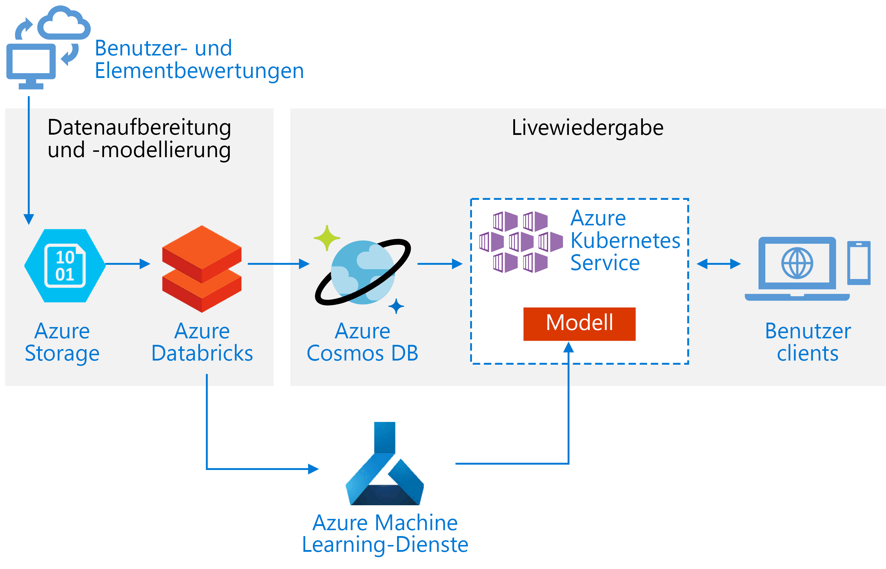
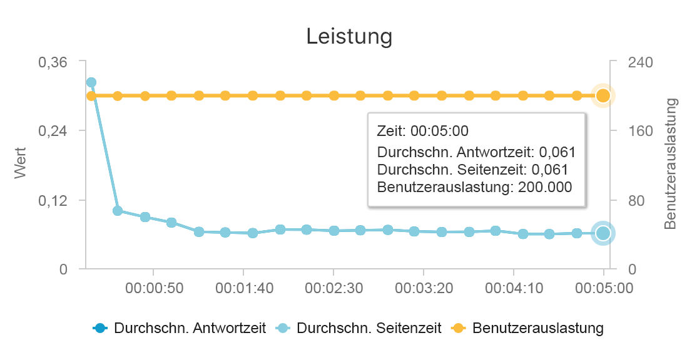
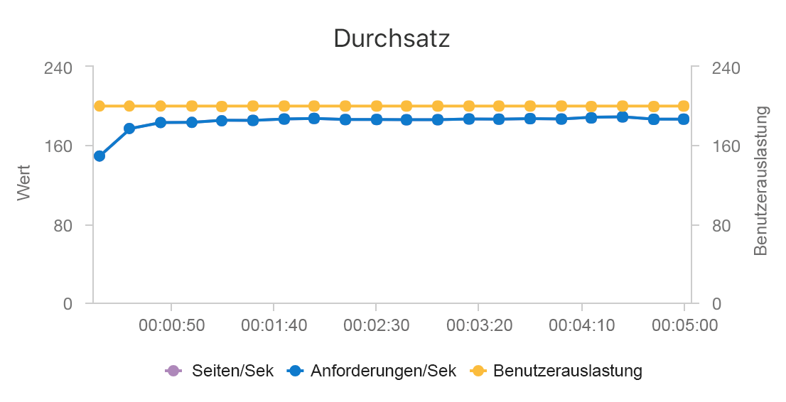

# Erstellen einer Echtzeitempfehlungs-API in Azure

Diese Referenzarchitektur veranschaulicht, wie Sie ein Empfehlungsmodell mit Azure Databricks trainieren und als API bereitstellen, indem Sie Azure Cosmos DB, Azure Machine Learning und Azure Kubernetes Service (AKS) verwenden. Diese Architektur kann für die meisten Empfehlungsmodulszenarien generalisiert werden, z.B. Empfehlungen für Produkte, Filme und Nachrichten.

Eine Referenzimplementierung für diese Architektur ist auf [GitHub][als-example] verfügbar.

**Szenario:** Ein Medienunternehmen möchte für seine Benutzer Empfehlungen zu Filmen bzw. Videos bereitstellen. Durch die Bereitstellung von personalisierten Empfehlungen kann das Unternehmen mehrere Geschäftsziele erreichen, z.B. höhere Durchklickraten, bessere Kundenbindung auf der Website und höhere Kundenzufriedenheit.

Diese Referenzarchitektur ist für das Trainieren und Bereitstellen einer Echtzeitempfehlungs-API ausgelegt, mit der für einen Benutzer die Top 10 der Filmempfehlungen angegeben werden kann.

Der Datenfluss für dieses Empfehlungsmodell lautet wie folgt:

1. Das Benutzerverhalten wird nachverfolgt. Beispielsweise kann von einem Back-End-Dienst protokolliert werden, wenn ein Benutzer einen Film bewertet oder auf ein Produkt oder einen Nachrichtenartikel klickt.

2. Laden Sie die Daten aus einer verfügbaren [Datenquelle][data-source] in Azure Databricks.

3. Bereiten Sie die Daten auf, und unterteilen Sie sie in Trainings- und Testsätze, um das Modell zu trainieren. (In [diesem Leitfaden][guide] werden Optionen zum Unterteilen von Daten beschrieben.)

4. Passen Sie das [Spark-Modell für das kombinierte Filtern][als] an die Daten an.

5. Werten Sie die Qualität des Modells aus, indem Sie Metriken für die Bewertung und die Rangfolge verwenden. ([Dieser Leitfaden][eval-guide] enthält ausführliche Informationen zu den Metriken, mit denen Sie Ihr Empfehlungssystem auswerten können.)

6. Berechnen Sie die Top 10 der Empfehlungen pro Benutzer voraus, und speichern Sie das Ergebnis als Cachedaten in Azure Cosmos DB.

7. Stellen Sie einen API-Dienst für AKS bereit, indem Sie die Azure Machine Learning-APIs zum Packen der API in einen Container und für die zugehörige Bereitstellung verwenden.

8. Wenn der Back-End-Dienst eine Anforderung von einem Benutzer erhält, können Sie die in AKS gehostete Empfehlungs-API aufrufen, um die Top 10 der Empfehlungen abzurufen und für den Benutzer anzuzeigen.

## Architecture

Diese Architektur umfasst die folgenden Komponenten:

[Azure Databricks][databricks]: Databricks ist eine Entwicklungsumgebung, die zum Aufbereiten von Eingabedaten und Trainieren des Empfehlungssystemmodells in einem Spark-Cluster genutzt wird. Mit Azure Databricks wird auch ein interaktiver Arbeitsbereich zum Ausführen von Notebooks und zum damit verbundenen gemeinsamen Durchführen der Datenverarbeitung oder von Machine Learning-Aufgaben bereitgestellt.

[Azure Kubernetes Service][aks] (AKS): AKS wird verwendet, um eine Machine Learning-Modelldienst-API in einem Kubernetes-Cluster bereitzustellen und zu operationalisieren. AKS hostet das Containermodell und sorgt für eine Skalierbarkeit, mit der Ihre Durchsatzanforderungen erfüllt werden, sowie für die Identitäts- und Zugriffsverwaltung und die Protokollierung und Systemüberwachung.

[Azure Cosmos DB][cosmosdb]: Cosmos DB ist ein global verteilter Datenbankdienst zum Speichern der empfohlenen Top-10-Filme für jeden Benutzer. Azure Cosmos DB ist für dieses Szenario gut geeignet, da das Lesen der empfohlenen Artikel für einen Benutzer nur mit einer geringen Latenz verbunden ist (10 ms, 99. Perzentil).

[Azure Machine Learning Service][mls]: Dieser Dienst wird verwendet, um Machine Learning-Modelle nachzuverfolgen und zu verwalten und diese dann zu verpacken und in einer skalierbaren AKS-Umgebung bereitzustellen.

[Microsoft Recommenders][github]: Dieses Open-Source-Repository enthält Hilfsprogrammcode und Beispiele, um Benutzer beim Einstieg in das Erstellen, Evaluieren und Operationalisieren eines Empfehlungssystems zu unterstützen.

## Überlegungen zur Leistung

Die Leistung ist für Echtzeitempfehlungen ein wichtiger Aspekt, da sich Empfehlungen normalerweise auf dem kritischen Pfad des Vorgangs befinden, den ein Benutzer auf Ihrer Website durchführt.

Dank der Kombination aus AKS und Azure Cosmos DB stellt diese Architektur einen guten Ausgangspunkt zum Bereitstellen von Empfehlungen für eine mittlere Workload bei minimalem Mehraufwand dar. Bei einem Auslastungstest mit 200 gleichzeitigen Benutzern werden bei dieser Architektur Empfehlungen mit einer durchschnittlichen Latenz von ca. 60 ms bereitgestellt, und der Durchsatz erreicht 180 Anforderungen pro Sekunde. Der Auslastungstest wurde mit der Standardkonfiguration für die Bereitstellung durchgeführt (drei AKS-Cluster vom Typ „D3 v2“ mit 12 vCPUs, 42 GB Arbeitsspeicher und 11.000 [Anforderungseinheiten (Request Units, RUs) pro Sekunde][ru] für Azure Cosmos DB).

Der Einsatz von Azure Cosmos DB wird empfohlen, weil dieser Dienst sofort global verteilt werden kann und nützlich ist, um alle Datenbankanforderungen Ihrer App zu erfüllen. Falls Sie eine etwas [niedrigere Latenz][latency] benötigen, können Sie anstelle von Azure Cosmos DB auch die Nutzung von [Azure Redis Cache][redis] für die Bereitstellung der Suche erwägen. Mit Redis Cache kann die Leistung von Systemen verbessert werden, für die eine starke Abhängigkeit von Daten in Back-End-Speichern besteht.

## Überlegungen zur Skalierbarkeit

Wenn Sie nicht die Nutzung von Spark planen oder über eine kleinere Workload verfügen, für die keine Verteilung erforderlich ist, können Sie erwägen, anstelle von Azure Databricks die [Data Science Virtual Machine][dsvm] (DSVM) zu verwenden. DSVM ist ein virtueller Computer mit Deep Learning-Frameworks und -Tools für Machine Learning und Data Science. Wie bei Azure Databricks auch, können alle Modelle, die Sie auf einer DSVM erstellen, per Azure Machine Learning als Dienst in AKS operationalisiert werden.

Stellen Sie während des Trainings in Azure Databricks einen größeren Spark-Cluster mit fester Größe bereit, oder konfigurieren Sie die [automatische Skalierung][autoscaling]. Wenn die automatische Skalierung aktiviert ist, überwacht Databricks die Auslastung Ihres Clusters und führt bei Bedarf das zentrale Hoch- oder Herunterskalieren durch. Stellen Sie einen größeren Cluster bereit bzw. skalieren Sie horizontal hoch, falls Sie über eine hohe Datengröße verfügen und die Verarbeitungsdauer in Bezug auf die Datenaufbereitungs- oder Modellierungsaufgaben verringern möchten.

Skalieren Sie den AKS-Cluster, um Ihre Anforderungen an die Leistung und den Durchsatz zu erfüllen. Achten Sie darauf, dass Sie die Anzahl von [Pods][scale] zentral hochskalieren, um den Cluster vollständig zu nutzen, und die [Knoten][nodes] des Clusters zu skalieren, um den Bedarf Ihres Diensts zu erfüllen. Weitere Informationen dazu, wie Sie Ihren Cluster skalieren, damit die Leistungs- und Durchsatzanforderungen Ihres Empfehlungsdiensts erfüllt werden, finden Sie unter [Scaling Azure Container Service Clusters][blog] (Skalieren von Azure Container Service-Clustern).

Schätzen Sie zum Verwalten der Azure Cosmos DB-Leistung die Anzahl von Lesevorgängen pro Sekunde, und stellen Sie die erforderliche Anzahl von [RUs pro Sekunde][ru] (Durchsatz) bereit. Befolgen Sie die bewährten Methoden für die [Partitionierung und horizontale Skalierung][partition-data].

## Kostenbetrachtung

Die Hauptkostenpunkte dieses Szenarios sind:

- Die Azure Databricks-Clustergröße, die für das Training benötigt wird.
- Die AKS-Clustergröße, die für die Erfüllung Ihrer Leistungsanforderungen erforderlich ist.
- Azure Cosmos DB-Anforderungseinheiten zur Erfüllung Ihrer Leistungsanforderungen.

Behalten Sie die Azure Databricks-Kosten im Griff, indem Sie weniger häufig erneut trainieren und den Spark-Cluster deaktivieren, wenn er nicht benötigt wird. Die Kosten für AKS und Azure Cosmos DB richten sich nach dem Durchsatz und der Leistung Ihrer Website und fallen je nach Datenverkehr auf Ihrer Website höher oder niedriger aus.

## Bereitstellen der Lösung

Stellen Sie diese Architektur gemäß der **Azure Databricks**-Anleitung aus dem [Einrichtungsdokument][setup] bereit. Dazu sind kurz gesagt folgende Schritte erforderlich:

1. Erstellen Sie einen [Azure Databricks-Arbeitsbereich][workspace].

2. Erstellen Sie in Azure Databricks einen neuen Cluster mit der folgenden Konfiguration:

    - Clustermodus: Standard
    - Databricks-Runtimeversion: 4.3 (enthält Apache Spark 2.3.1 und Scala 2.11)
    - Python-Version: 3
    - Treibertyp: Standard\_DS3\_v2
    - Worker-Typ: Standard\_DS3\_v2 (Minimum und Maximum je nach Bedarf)
    - Automatische Beendigung: (wie erforderlich)
    - Spark-Konfiguration: (wie erforderlich)
    - Umgebungsvariablen: (wie erforderlich)

3. Erstellen Sie ein persönliches Zugriffstoken innerhalb des [Azure Databricks-Arbeitsbereichs][workspace]. Ausführliche Informationen finden Sie in der [Dokumentation][adbauthentication] zur Azure Databricks-Authentifizierung.

3. Klonen Sie das Repository [Microsoft Recommenders][github] in einer Umgebung, in der Sie Skripts ausführen können (etwa auf Ihrem lokalen Computer).

4. Gehen Sie gemäß den Setupanweisungen für die **Schnellinstallation** vor, um in Azure Databricks die [relevanten Bibliotheken zu installieren][setup].

5. Gehen Sie gemäß den Setupanweisungen für die **Schnellinstallation** vor, um [Azure Databricks für die Operationalisierung vorzubereiten][setupo16n].

6. Importieren Sie das [Notebook „ALS Movie Operationalization“][als-example] in Ihren Arbeitsbereich. Führen Sie nach der Anmeldung bei Ihrem Azure Databricks-Arbeitsbereich die folgenden Schritte aus:

    a. Klicken Sie auf der linken Seite des Arbeitsbereichs auf **Home**.

    b. Klicken Sie in Ihrem Basisverzeichnis mit der rechten Maustaste auf den weißen Bereich. Wählen Sie **Importieren** aus.
    
    c. Wählen Sie **URL** aus, und fügen Sie Folgendes in das Textfeld ein: `https://github.com/Microsoft/Recommenders/blob/master/notebooks/05_operationalize/als_movie_o16n.ipynb`
    
    d. Klicken Sie auf **Importieren**.

7. Öffnen Sie das Notebook in Azure Databricks, und fügen Sie den konfigurierten Cluster an.

8. Führen Sie das Notebook aus, um die für die Erstellung einer Empfehlungs-API erforderlichen Azure-Ressourcen zu erstellen. Über die API werden die zehn besten Filmempfehlungen für einen Benutzer bereitgestellt.

## Verwandte Architekturen

Wir haben auch eine Referenzarchitektur erstellt, die Spark und Azure Databricks verwendet, um geplante [Batchbewertungsprozesse][batch-scoring] auszuführen. Sehen Sie sich diese Referenzarchitektur an, um eine empfohlene Vorgehensweise zum routinemäßigen Generieren neuer Empfehlungen zu verstehen.

<!-- links -->
[aci]: /azure/container-instances/container-instances-overview
[aad]: /azure/active-directory-b2c/active-directory-b2c-overview
[adbauthentication]: https://docs.azuredatabricks.net/api/latest/authentication.html#generate-a-token
[aks]: /azure/aks/intro-kubernetes
[als]: https://spark.apache.org/docs/latest/ml-collaborative-filtering.html
[als-example]: https://github.com/Microsoft/Recommenders/blob/master/notebooks/05_operationalize/als_movie_o16n.ipynb
[autoscaling]: https://docs.azuredatabricks.net/user-guide/clusters/sizing.html
[autoscale]: https://docs.azuredatabricks.net/user-guide/clusters/sizing.html#autoscaling
[availability]: /azure/architecture/checklist/availability
[batch-scoring]: /azure/architecture/reference-architectures/ai/batch-scoring-databricks
[blob]: /azure/storage/blobs/storage-blobs-introduction
[blog]: https://blogs.technet.microsoft.com/machinelearning/2018/03/20/scaling-azure-container-service-cluster/
[clusters]: https://docs.azuredatabricks.net/user-guide/clusters/configure.html
[cosmosdb]: /azure/cosmos-db/introduction
[data-source]: https://docs.azuredatabricks.net/spark/latest/data-sources/index.html
[databricks]: /azure/azure-databricks/what-is-azure-databricks
[dsvm]: /azure/machine-learning/data-science-virtual-machine/overview
[dsvm-ubuntu]: /azure/machine-learning/data-science-virtual-machine/dsvm-ubuntu-intro
[eval-guide]: https://github.com/Microsoft/Recommenders/blob/master/notebooks/03_evaluate/evaluation.ipynb
[free]: https://azure.microsoft.com/free/?WT.mc_id=A261C142F
[github]: https://github.com/Microsoft/Recommenders
[guide]: https://github.com/Microsoft/Recommenders/blob/master/notebooks/01_prepare_data/data_split.ipynb
[latency]: https://github.com/jessebenson/azure-performance
[mls]: /azure/machine-learning/service/
[n-tier]: /azure/architecture/reference-architectures/n-tier/n-tier-cassandra
[ndcg]: https://en.wikipedia.org/wiki/Discounted_cumulative_gain
[nodes]: /azure/aks/scale-cluster
[notebook]: https://github.com/Microsoft/Recommenders/notebooks/00_quick_start/als_pyspark_movielens.ipynb
[partition-data]: /azure/cosmos-db/partition-data
[redis]: /azure/redis-cache/cache-overview
[regions]: https://azure.microsoft.com/global-infrastructure/services/?products=virtual-machines&regions=all
[resiliency]: /azure/architecture/resiliency/
[ru]: /azure/cosmos-db/request-units
[sec-docs]: /azure/security/
[setup]: https://github.com/Microsoft/Recommenders/blob/master/SETUP.md#repository-installation
[setupo16n]: https://github.com/Microsoft/Recommenders/blob/master/SETUP.md#prepare-azure-databricks-for-operationalization
[scale]: /azure/aks/tutorial-kubernetes-scale
[sla]: https://azure.microsoft.com/support/legal/sla/virtual-machines/v1_8/
[vm-size]: /azure/virtual-machines/virtual-machines-linux-change-vm-size
[workspace]: https://docs.azuredatabricks.net/getting-started/index.html
