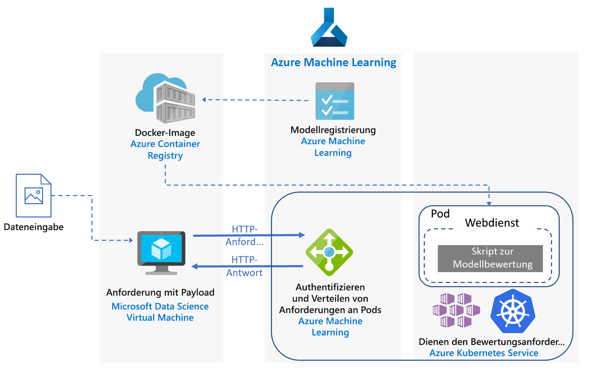
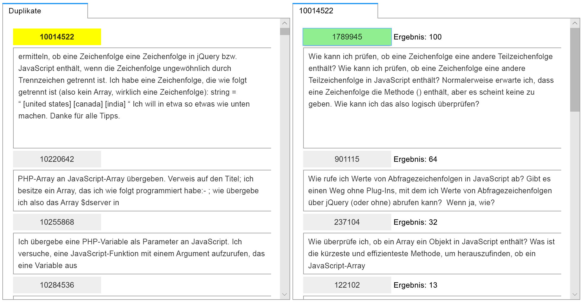
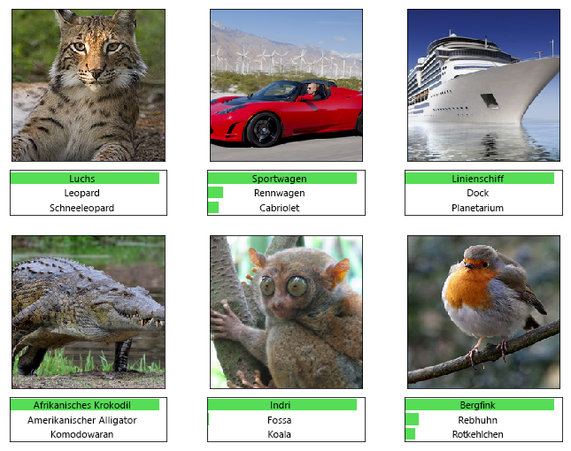

# Echtzeitbewertung von Python scikit-learn- und Deep Learning-Modellen in Azure

Diese Referenzarchitektur zeigt, wie Sie Python-Modelle als Webdienste bereitstellen, um in Echtzeit Vorhersagen zu treffen. In diesem Artikel werden zwei Szenarien behandelt: die Bereitstellung von regulären Python-Modellen und die spezifischen Anforderungen der Bereitstellung von Deep Learning-Modellen. Für beide Szenarien wird die hier dargestellte Architektur verwendet.

Auf GitHub sind zwei Referenzimplementierungen für diese Architektur verfügbar – eine für [reguläre Python-Modelle][github-python] und eine für [Deep Learning-Modelle][github-dl].

## Szenarien

Die Referenzimplementierungen veranschaulichen zwei Szenarien, in denen diese Architektur verwendet wird.

**Szenario 1: Abgleich von häufig gestellten Fragen (FAQ)**. Dieses Szenario zeigt, wie Sie ein Modell zum Abgleichen von häufig gestellten Fragen (FAQ) als Webdienst bereitstellen, um die Fragen von Benutzern vorherzusagen. In diesem Szenario bezieht sich der Begriff „Eingabedaten“ im Architekturdiagramm auf Textzeichenfolgen mit Fragen von Benutzern, die mit einer Liste von häufig gestellten Fragen abgeglichen werden. Dieses Szenario ist für die [scikit-learn][scikit]-Bibliothek für maschinelles Lernen für Python konzipiert, es kann jedoch für beliebige Szenarien mit Python-Modellen generalisiert werden, um in Echtzeit Vorhersagen zu treffen.

In diesem Szenario wird eine Teilmenge der Stack Overflow-Fragedaten verwendet, die die ursprünglichen Fragen (als JavaScript markiert), die zugehörigen doppelten Fragen und Antworten umfasst. Das Szenario trainiert eine scikit-learn-Pipeline zum Vorhersagen der Übereinstimmungswahrscheinlichkeit einer doppelten Frage mit den einzelnen ursprünglichen Fragen. Diese Vorhersagen werden in Echtzeit mithilfe eines REST-API-Endpunkts getroffen.

Der Anwendungsfluss für diese Architektur sieht wie folgt aus:

1.  Der Client sendet eine HTTP-POST-Anforderung mit den codierten Fragedaten.

2.  Die Flask-App extrahiert die Frage aus der Anforderung.

3.  Die Frage wird zur Featurebereitstellung und Bewertung an das scikit-learn-Pipelinemodell gesendet.

4.  Die übereinstimmenden häufig gestellten Fragen werden mit ihren Bewertungen an ein JSON-Objekt weitergeleitet und an den Client zurückgegeben.

Hier sehen Sie einen Screenshot der Beispiel-App, die die Ergebnisse nutzt:

**Szenario 2: Bildklassifizierung.** Dieses Szenario zeigt, wie Sie ein Modell für ein künstliches neuronales Netzwerk (Convolutional Neural Network, CNN) als Webdienst bereitstellen, um Vorhersagen für Bilder zu generieren. In diesem Szenario bezieht sich der Begriff „Eingabedaten“ im Architekturdiagramm auf Bilddateien. Für Aufgaben wie die Bildklassifizierung und Erkennung von Objekten sind CNNs eine äußerst effektive Lösung für maschinelles Sehen. Dieses Szenario ist für die Frameworks TensorFlow, Keras (mit dem TensorFlow-Back-End) und PyTorch konzipiert. Es kann jedoch für beliebige Szenarien generalisiert werden, die mithilfe von Deep Learning-Modellen in Echtzeit Vorhersagen treffen.

In diesem Szenario wird ein für ein ImageNet-1K-Dataset (1.000 Klassen) vortrainiertes ResNet-152-Modell verwendet, um die Kategorie vorherzusagen, zu der ein Bild gehört (siehe unten stehende Abbildung). Diese Vorhersagen werden in Echtzeit mithilfe eines REST-API-Endpunkts getroffen.

Der Anwendungsfluss für das Deep Learning-Modell sieht wie folgt aus:

1.  Der Client sendet eine HTTP-POST-Anforderung mit den codierten Bilddaten.

2.  Die Flask-App extrahiert das Bild aus der Anforderung.

3.  Das Bild wird vorverarbeitet und zur Bewertung an das Modell gesendet.

4.  Das Bewertungsergebnis wird an ein JSON-Objekt weitergeleitet und an den Client zurückgegeben.

## Architecture

Diese Architektur umfasst die folgenden Komponenten.

**[VM][vm]**. Die VM dient als Beispiel für ein Gerät (lokal oder in der Cloud), das eine HTTP-Anforderung senden kann.

**[Azure Kubernetes Service][aks]** (AKS) wird verwendet, um die Anwendung in einem Kubernetes-Cluster bereitzustellen. AKS vereinfacht die Bereitstellung und den Betrieb von Kubernetes. Der Cluster kann für reguläre Python-Modelle mit reinen CPU-VMs oder für Deep Learning-Modelle mit GPU-fähigen VMs konfiguriert werden.

**[Lastenausgleich][lb]**. Ein von AKS bereitgestellter Lastenausgleich wird verwendet, um den Dienst extern verfügbar zu machen. Datenverkehr vom Lastenausgleich wird an die Back-End-Pods geleitet.

Der **[Docker-Hub][docker]** dient zum Speichern des im Kubernetes-Cluster bereitgestellten Docker-Images. Der Docker-Hub wurde für diese Architektur ausgewählt, weil er benutzerfreundlich und das Standardimagerepository für Docker-Benutzer ist. [Azure Container Registry][acr] kann ebenfalls verwendet werden.

## Überlegungen zur Leistung

Für Architekturen zur Echtzeitbewertung ist die Durchsatzleistung ein entscheidender Faktor. Für reguläre Python-Modelle sind CPUs, die zum Bewältigen der Workload ausreichen, in der Regel akzeptabel. 

Für Deep Learning-Workloads, bei denen sich die Geschwindigkeit als Engpass erweisen kann, bieten GPUs im Allgemeinen jedoch eine bessere [Leistung][gpus-vs-cpus] als CPUs. Um die GPU-Leistung mit CPUs zu erreichen, ist normalerweise ein Cluster mit einer großen Anzahl von CPUs erforderlich.

Sie können in beiden Szenarien CPUs für diese Architektur verwenden. Für Deep Learning-Modelle bieten GPUs jedoch deutlich höhere Durchsatzwerte als ein CPU-Cluster mit vergleichbaren Kosten. AKS unterstützt die Verwendung von GPUs. Dies ist einer der Vorteile, die die Verwendung von AKS für diese Architektur bietet. Zudem werden bei Deep Learning-Bereitstellungen in der Regel Modelle mit einer hohen Anzahl von Parametern verwendet. Durch die Verwendung von GPUs werden Ressourcenkonflikte zwischen dem Modell und dem Webdienst vermieden, die bei reinen CPU-Bereitstellungen ein Problem darstellen.

## Überlegungen zur Skalierbarkeit

Bei regulären Python-Modellen mit einer AKS-Clusterbereitstellung mit reinen CPU-VMs ist beim [Erhöhen der Anzahl von Pods][manually-scale-pods] Vorsicht geboten. Das Ziel ist es, den Cluster vollständig zu nutzen. Die Skalierung ist von den CPU-Anforderungen und den für die Pods definierten Grenzwerten abhängig. Kubernetes unterstützt auch die [automatische Skalierung][autoscale-pods] der Pods, um die Anzahl von Pods in einer Bereitstellung basierend auf der CPU-Nutzung oder anderen ausgewählten Metriken anzupassen. Die [automatische Clusterskalierung][autoscaler] (Vorschauversion) kann Agent-Knoten basierend auf ausstehenden Pods skalieren.

Für Deep Learning-Szenarien mit GPU-fähigen VMs sind die Ressourceneinschränkungen für Pods so ausgelegt, dass eine GPU einem Pod zugewiesen wird. Je nach verwendetem VM-Typ müssen Sie die [Knoten des Clusters skalieren][scale-cluster], um die Anforderungen für den Dienst zu erfüllen. Dies ist mithilfe der Azure-Befehlszeilenschnittstelle (Azure CLI) und Kubectl ganz einfach möglich.

## Überlegungen zur Überwachung und Protokollierung

### AKS-Überwachung

Verwenden Sie das Feature [Azure Monitor für Container][monitor-containers], um Einblick in die AKS-Leistung zu erhalten. Das Feature erfasst anhand der Metrik-API die in Kubernetes verfügbaren Speicher- und Prozessormetriken von Controllern, Knoten und Containern.

Überwachen Sie während der Bereitstellung Ihrer Anwendung den AKS-Cluster, um sicherzustellen, dass er wie erwartet funktioniert, alle Knoten funktionsfähig sind und alle Pods ausgeführt werden. Sie können den Podstatus mit dem Befehlszeilentool [Kubectl][kubectl] abrufen, Kubernetes enthält jedoch auch ein Webdashboard für die grundlegende Überwachung des Clusterstatus und Verwaltung.

Den Gesamtzustand des Clusters und der Knoten können Sie im Abschnitt **Knoten** des Kubernetes-Dashboards einsehen. Wenn ein Knoten inaktiv oder ausgefallen ist, können Sie die Fehlerprotokolle auf dieser Seite anzeigen. Informationen zur Anzahl von Pods und zum Status Ihrer Bereitstellung finden Sie in den Abschnitten **Pods** und **Bereitstellungen**.

### AKS-Protokolle 

AKS protokolliert automatisch alle stdout-/stderr-Meldungen in den Protokollen der Pods im Cluster. Verwenden Sie Kubectl, um diese Meldungen und auch Ereignisse sowie Protokolle auf Knotenebene anzuzeigen. Ausführliche Informationen finden Sie in den Bereitstellungsschritten.

Verwenden Sie [Azure Monitor für Container][monitor-containers], um Metriken und Protokolle über eine Containerversion des Log Analytics-Agents für Linux zu erfassen, die in Ihrem Log Analytics-Arbeitsbereich gespeichert wird.

## Sicherheitshinweise

Verwenden Sie [Azure Security Center][security-center], um sich eine zentrale Übersicht über den Sicherheitszustand Ihrer Azure-Ressourcen zu verschaffen. Das Azure Security Center überwacht potenzielle Sicherheitsprobleme und bietet eine umfassende Darstellung der Sicherheitsintegrität Ihrer Bereitstellung, überwacht jedoch keine AKS-Agent-Knoten. Security Center wird für jedes Azure-Abonnement individuell konfiguriert. Aktivieren Sie die Erfassung von Sicherheitsdaten wie unter [Einbinden Ihres Azure-Abonnements in Security Center Standard][get-started] beschrieben. Nachdem die Datensammlung aktiviert wurde, durchsucht Security Center VMs automatisch, die unter diesem Abonnement erstellt werden.

**Vorgänge**. Wenn Sie sich mit Ihrem Azure Active Directory-Authentifizierungstoken (Azure AD) bei einem AKS-Cluster anmelden möchten, konfigurieren Sie AKS zur Verwendung von Azure AD für die [Benutzerauthentifizierung][aad-auth]. Clusteradministratoren können auch die rollenbasierte Zugriffssteuerung (Role-Based Access Control, RBAC) von Kubernetes auf der Grundlage einer Benutzeridentität oder Verzeichnisgruppenmitgliedschaft konfigurieren.

Steuern Sie den Zugriff auf die von Ihnen bereitgestellten Azure-Ressourcen mit [RBAC][rbac]. Mithilfe der RBAC können Sie Mitglieder Ihres DevOps-Teams Autorisierungsrollen zuweisen. Ein Benutzer kann mehreren Rollen zugewiesen werden. Außerdem können Sie für noch präzisere [Berechtigungen] benutzerdefinierte Rollen erstellen.

**HTTPS**. Als bewährte Sicherheitsmethode sollte die Anwendung HTTPS erzwingen und HTTP-Anforderungen umleiten. Verwenden Sie einen [Eingangscontroller][ingress-controller], um einen Reverseproxy bereitzustellen, der SSL beendet und HTTP-Anforderungen umleitet. Weitere Informationen finden Sie unter [Erstellen eines HTTPS-Eingangscontrollers in Azure Kubernetes Service (AKS)][https-ingress].

**Authentifizierung**. Diese Lösung beschränkt den Zugriff auf die Endpunkte nicht. Wenn Sie die Architektur in einer Unternehmensumgebung bereitstellen, sichern Sie die Endpunkte über API-Schlüssel, und fügen Sie der Clientanwendung eine Benutzerauthentifizierung hinzu.

**Containerregistrierung**. Diese Lösung verwendet eine öffentliche Registrierung zum Speichern des Docker-Images. Der Code, von dem die Anwendung abhängig ist, und das Modell sind in diesem Image enthalten. Unternehmensanwendungen sollten eine private Registrierung verwenden, um Schutz vor Schadsoftware bereitzustellen und zu verhindern, dass die Informationen im Container kompromittiert werden.

**DDoS Protection**. Aktivieren Sie ggf. [Azure DDoS Protection Standard][ddos]. DDoS Protection Basic wird als Teil der Azure-Plattform aktiviert. DDoS Protection Standard bietet jedoch Funktionen zur Risikominderung, die speziell für Azure Virtual Network-Ressourcen optimiert sind.

**Protokollierung**: Wenden Sie vor dem Speichern von Protokolldaten bewährte Methoden an. Bereinigen Sie beispielsweise Benutzerkennwörter und andere Informationen, die ein potenzielles Sicherheitsrisiko darstellen und zu betrügerischen Zwecken verwendet werden könnten.

## Bereitstellung

Befolgen Sie die Schritte im GitHub-Repository, um diese Referenzarchitektur bereitzustellen: 

  - [Reguläre Python-Modelle][github-python]
  - [Deep Learning-Modelle][github-dl]

[aad-auth]: /azure/aks/aad-integration
[acr]: /azure/container-registry/
[something]: https://kubernetes.io/docs/reference/access-authn-authz/authentication/
[aks]: /azure/aks/intro-kubernetes
[autoscaler]: /azure/aks/autoscaler
[autoscale-pods]: /azure/aks/tutorial-kubernetes-scale#autoscale-pods
[azcopy]: /azure/storage/common/storage-use-azcopy-linux
[ddos]: /azure/virtual-network/ddos-protection-overview
[docker]: https://hub.docker.com/
[get-started]: /azure/security-center/security-center-get-started
[github-python]: https://github.com/Azure/MLAKSDeployment
[github-dl]: https://github.com/Microsoft/AKSDeploymentTutorial
[gpus-vs-cpus]: https://azure.microsoft.com/en-us/blog/gpus-vs-cpus-for-deployment-of-deep-learning-models/
[https-ingress]: /azure/aks/ingress-tls
[ingress-controller]: https://kubernetes.io/docs/concepts/services-networking/ingress/
[kubectl]: https://kubernetes.io/docs/tasks/tools/install-kubectl/
[lb]: /azure/load-balancer/load-balancer-overview
[manually-scale-pods]: /azure/aks/tutorial-kubernetes-scale#manually-scale-pods
[monitor-containers]: /azure/monitoring/monitoring-container-insights-overview
[Berechtigungen]: /azure/aks/concepts-identity
[rbac]: /azure/active-directory/role-based-access-control-what-is
[scale-cluster]: /azure/aks/scale-cluster
[scikit]: https://pypi.org/project/scikit-learn/
[security-center]: /azure/security-center/security-center-intro
[vm]: /azure/virtual-machines/

