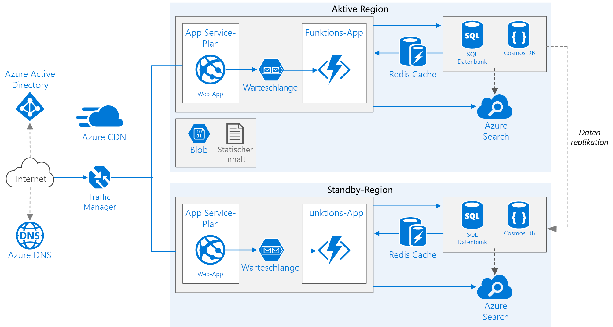

# <a name="run-a-web-application-in-multiple-azure-regions-for-high-availability"></a>Ausführen einer Webanwendung in mehreren Azure-Regionen für Hochverfügbarkeit

Diese Referenzarchitektur zeigt, wie Sie eine Azure App Service-Anwendung in mehreren Regionen ausführen, um Hochverfügbarkeit zu erzielen.



*Laden Sie eine [Visio-Datei][visio-download] mit dieser Architektur herunter.*

## <a name="architecture"></a>Architecture

Diese Architektur basiert auf der in [Verbessern der Skalierbarkeit in einer Webanwendung][guidance-web-apps-scalability] gezeigten. Im Folgenden werden die Hauptunterschiede erläutert:

- **Primäre und sekundäre Regionen**. Diese Architektur nutzt zwei Regionen, um eine höhere Verfügbarkeit zu erreichen. Die Anwendung wird in jeder Region bereitgestellt. Während des normalen Betriebs wird Netzwerkdatenverkehr an die primäre Region weitergeleitet. Wenn die primäre Region nicht verfügbar ist, wird der Datenverkehr an die sekundäre Region umgeleitet.
- **Azure DNS:** [Azure DNS][azure-dns] ist ein Hostingdienst für DNS-Domänen, der die Namensauflösung unter Verwendung der Microsoft Azure-Infrastruktur durchführt. Durch das Hosten Ihrer Domänen in Azure können Sie Ihre DNS-Einträge mithilfe der gleichen Anmeldeinformationen, APIs, Tools und Abrechnung wie für die anderen Azure-Dienste verwalten.
- **Azure Traffic Manager**. [Traffic Manager][traffic-manager] leitet eingehende Anforderungen an die primäre Region weiter. Wenn die in dieser Region ausgeführte Anwendung nicht verfügbar ist, führt Traffic Manager ein Failover zur sekundären Region aus.
- **Georeplikation** von SQL-Datenbank und Cosmos DB.

Eine Architektur mit mehreren Regionen kann eine höhere Verfügbarkeit als eine Bereitstellung in einer einzelnen Region bieten. Wenn ein regionaler Ausfall die primäre Region beeinträchtigt, können Sie mit [Traffic Manager][traffic-manager] ein Failover zur sekundären Region ausführen. Diese Architektur kann auch hilfreich sein, wenn bei einem einzelnen Subsystem der Anwendung ein Fehler auftritt.

Es gibt mehrere allgemeine Vorgehensweisen für das Erreichen von Hochverfügbarkeit mit mehreren Regionen:

- Aktiv/passiv mit Hot Standby. Der Datenverkehr wird an eine Region weitergeleitet, während die andere im Hot Standby wartet. Hot Standby (unmittelbar betriebsbereit) bedeutet, dass die virtuellen Computer in der sekundären Region jederzeit zugeordnet sind und ausgeführt werden.
- Aktiv/passiv mit Cold Standby. Der Datenverkehr wird an eine Region weitergeleitet, während die andere im Cold Standby wartet. Cold Standby (verzögert betriebsbereit) bedeutet, dass die virtuellen Computer in der sekundären Region erst zugewiesen werden, wenn sie für das Failover benötigt werden. Dieser Ansatz erfordert weniger Ausführungszeit, es dauert aber im Allgemeinen länger, bis bei einem Ausfall alle Komponenten online geschaltet sind.
- Aktiv/aktiv. Beide Regionen sind aktiv, und Anforderungen werden per Lastenausgleich zwischen ihnen verteilt. Wenn eine Region nicht verfügbar ist, wird sie aus der Rotation entfernt.

In dieser Referenzarchitektur liegt der Fokus auf aktiv/passiv mit Hot Standby, wobei Traffic Manager für das Failover verwendet wird.

## <a name="recommendations"></a>Empfehlungen

Ihre Anforderungen können von der hier beschriebenen Architektur abweichen. Verwenden Sie die Empfehlungen in diesem Abschnitt als Ausgangspunkt.

### <a name="regional-pairing"></a>Regionspaare

Jede Azure-Region ist mit einer anderen Region innerhalb desselben Gebiets gepaart. Sie wählen im Allgemeinen Regionen aus dem gleichen Regionspaar aus (z.B. „USA, Osten 2“ und „USA, Mitte“). Das bietet die folgenden Vorteile:

- Bei einem umfassenden Ausfall wird die Wiederherstellung mindestens einer Region aus jedem Paar priorisiert.
- Geplante Azure-Systemupdates werden in Regionspaaren nacheinander ausgeführt, um mögliche Ausfallzeiten zu minimieren.
- In den meisten Fällen befinden sich Regionspaare innerhalb desselben geografischen Gebiets, um spezifische regionale Anforderungen zu erfüllen.

Sie sollten allerdings sicherstellen, dass beide Regionen alle Azure-Dienste, die für Ihre Anwendung erforderlich sind, unterstützen. Weitere Informationen finden Sie unter [Dienste nach Region][services-by-region]. Weitere Informationen zu Regionspaaren finden Sie unter [Geschäftskontinuität und Notfallwiederherstellung: Azure-Regionspaare][regional-pairs].

### <a name="resource-groups"></a>Ressourcengruppen

Sie sollten die primäre Region, die sekundäre Region und Traffic Manager unterschiedlichen [Ressourcengruppen][resource groups] zuordnen. So können Sie die in jeder Region bereitgestellten Ressourcen als Einzelsammlungen verwalten.

### <a name="traffic-manager-configuration"></a>Traffic Manager-Konfiguration

**Routing:** Traffic Manager unterstützt mehrere [Routingalgorithmen][tm-routing]. Verwenden Sie für das in diesem Artikel beschriebenen Szenario Routing nach *Priorität* (ehemals Routingmethode *Failover*). Bei dieser Einstellung sendet Traffic Manager alle Anforderungen an die primäre Region, bis der Endpunkt für diese Region nicht mehr erreichbar ist. Zu diesem Zeitpunkt wird automatisch ein Failover zur sekundären Region ausgeführt. Weitere Informationen finden Sie unter [Konfigurieren der Routingmethode „Failover“][tm-configure-failover].

**Integritätstest:** Traffic Manager verwendet einen HTTP-Test (oder HTTPS), um die Verfügbarkeit aller Endpunkte zu überwachen. Der Test meldet Traffic Manager seinen erfolgreichen oder fehlerhaften Abschluss, damit ggf. ein Failover zur sekundären Region ausgeführt werden kann. Dies erfolgt durch das Senden einer Anforderung an einen angegebenen URL-Pfad. Wenn der Test innerhalb des Zeitlimits eine andere Antwort als „200“ erhält, löst er einen Fehler aus. Nach vier fehlerhaften Anforderungen kennzeichnet Traffic Manager den Endpunkt als heruntergestuft und führt ein Failover zum anderen Endpunkt aus. Weitere Informationen finden Sie unter [Traffic Manager-Endpunktüberwachung und -Failover][tm-monitoring].

Es hat sich bewährt, einen fehlerfreien Testendpunkt zu erstellen, der die Gesamtintegrität der Anwendung meldet, und diesen Endpunkt für den Integritätstest zu verwenden. Der Endpunkt sollte alle wichtigen Abhängigkeiten überprüfen, dazu gehören z.B. App Service-Apps, die Speicherwarteschlange und SQL-Datenbank. Andernfalls meldet der Test eventuell einen fehlerfreien Endpunkt, obwohl wichtige Teile der Anwendung fehlerhaft sind.

Andererseits sollten Sie den Integritätstest nicht zum Überprüfen von Diensten mit einer niedrigeren Priorität verwenden. Wenn beispielsweise ein E-Mail-Dienst ausfällt, kann die Anwendung zu einem zweiten Anbieter wechseln oder die E-Mails einfach später senden. Dies ist keine ausreichend hohe Priorität, die zu einem Failover der Anwendung führen sollte. Weitere Informationen finden Sie unter [Muster für Überwachung der Integrität von Endpunkten][health-endpoint-monitoring-pattern].

### <a name="sql-database"></a>SQL-Datenbank

Verwenden Sie die [aktive Georeplikation][sql-replication], um ein lesbares sekundäres Replikat in einer anderen Region zu erstellen. Sie können bis zu vier lesbare sekundäre Replikate nutzen. Führen Sie ein Failover zu einer sekundären Datenbank aus, wenn die primäre Datenbank ausfällt oder offline geschaltet werden muss. Die aktive Georeplikation kann für jede Datenbank in einem beliebigen Pool für elastische Datenbanken konfiguriert werden.

### <a name="cosmos-db"></a>Cosmos DB

Cosmos DB unterstützt die regionsübergreifende Georeplikation mit Multimaster (mehrere Schreibregionen). Alternativ können Sie eine Region als die schreibbare Region und die andere als schreibgeschützte Replikate festlegen. Fällt eine Region aus, können Sie ein Failover ausführen, indem Sie eine andere Region als schreibbare Region festlegen. Das Client-SDK sendet Schreibanforderungen automatisch an die aktuell schreibbare Region, daher müssen Sie die Clientkonfiguration nach einem Failover nicht aktualisieren. Weitere Informationen finden Sie unter [Globale Datenverteilung mit Azure Cosmos DB][cosmosdb-geo].

> [!NOTE]
> Alle Replikate gehören derselben Ressourcengruppe an.
>

### <a name="storage"></a>Storage

Bei Azure Storage verwenden Sie [RA-GRS][ra-grs] (Read-Access Geo-Redundant Storage, georedundanter Speicher mit Lesezugriff). Mit RA-GRS werden die Daten in eine sekundäre Region repliziert. Sie haben über einen eigenen Endpunkt lediglich schreibgeschützten Zugriff auf die Daten in der sekundären Region. Tritt in einer Region ein Ausfall oder ein anderer Notfall ein, kann das Azure Storage-Team ein geografisches Failover zur sekundären Region ausführen. Für dieses Failover ist keine Kundenaktion erforderlich.

Erstellen Sie für Queue Storage eine Sicherungswarteschlange in der sekundären Region. Während des Failovers kann die App die Sicherungswarteschlange verwenden, bis die primäre Region wieder verfügbar ist. Auf diese Weise kann die Anwendung weiterhin neue Anforderungen verarbeiten.

## <a name="availability-considerations---traffic-manager"></a>Überlegungen zur Verfügbarkeit: Traffic Manager

Traffic Manager führt automatisch ein Failover aus, wenn die primäre Region nicht verfügbar ist. Wenn Traffic Manager ein Failover ausführt, können die Clients die Anwendung für eine bestimmte Zeit nicht erreichen. Die Dauer wird durch folgende Faktoren beeinflusst:

- Der Integritätstest muss erkennen, dass das primäre Rechenzentrum nicht erreichbar ist.
- Die DNS-Server (Domain Name Service) müssen die zwischengespeicherten DNS-Einträge für die IP-Adresse aktualisieren, die von der DNS-Gültigkeitsdauer (TTL) abhängig ist. Die Standardgültigkeitsdauer beträgt 300 Sekunden (5 Minuten), Sie können diesen Wert aber bei der Erstellung des Traffic Manager-Profils anpassen.

Weitere Informationen finden Sie unter [Traffic Manager-Überwachung][tm-monitoring].

Traffic Manager ist eine mögliche Schwachstelle im System. Wenn beim Dienst ein Fehler auftritt, können Clients während der Ausfallzeit nicht auf Ihre Anwendung zugreifen. In der [Vereinbarung zum Servicelevel (SLA) für Traffic Manager][tm-sla] erfahren Sie, ob Ihre geschäftlichen Anforderungen für Hochverfügbarkeit mit Traffic Manager allein erfüllt werden. Wenn dies nicht der Fall ist, erwägen Sie als Alternative eine andere Verwaltungslösung für den Datenverkehr. Wenn der Azure Traffic Manager-Dienst fehlerhaft ist, ändern Sie die kanonischen Namensdatensätze (CNAME) im DNS, sodass sie auf die andere Verwaltungslösung für den Datenverkehr verweisen. Dieser Schritt muss manuell durchgeführt werden. Bis die DNS-Änderungen weitergegeben wurden, ist die Anwendung nicht verfügbar.

## <a name="availability-considerations---sql-database"></a>Überlegungen zur Verfügbarkeit: SQL-Datenbank

Die Recovery Point Objective (RPO) und die geschätzte Wiederherstellungszeit (ERT) für SQL-Datenbank sind in [Übersicht über die Geschäftskontinuität mit Azure SQL-Datenbank][sql-rpo] dokumentiert.

## <a name="availability-considerations---storage"></a>Überlegungen zur Verfügbarkeit: Speicher

RA-GRS stellt permanenten Speicher bereit. Trotzdem sollten Sie verstehen, was bei einem Ausfall passieren kann:

- Tritt ein Speicherausfall auf, haben Sie für eine gewisse Zeit keinen Schreibzugriff auf die Daten. Sie können während des Ausfalls weiterhin vom sekundären Endpunkt lesen.
- Wenn sich ein regionaler Ausfall oder Notfall auf den primären Standort auswirkt und die Daten nicht wiederhergestellt werden können, kann das Azure Storage-Team ein geografisches Failover zur sekundären Region ausführen.
- Die Datenreplikation zur sekundären Region wird asynchron ausgeführt. Wenn ein geografisches Failover durchgeführt wird, ist daher ein Datenverlust möglich, wenn die Daten nicht aus der primären Region wiederhergestellt werden können.
- Vorübergehende Fehler, etwa Netzwerkausfälle, lösen kein Speicherfailover aus. Entwerfen Sie Ihre Anwendung flexibel gegenüber vorübergehenden Fehlern. Mögliche Gegenmaßnahmen:

  - Lesen aus der sekundären Region.
  - Wechseln Sie vorübergehend für neue Schreibvorgänge (z.B. in Warteschlangennachrichten) zu einem anderen Speicherkonto.
  - Kopieren Sie Daten aus der sekundären Region in ein anderes Speicherkonto.
  - Stellen Sie eine eingeschränkte Funktionalität bereit, bis das Failback für das System ausgeführt wurde.

Weitere Informationen finden Sie unter [Vorgehensweise beim Ausfall von Azure Storage][storage-outage].

## <a name="manageability-considerations---traffic-manager"></a>Überlegungen zur Verwaltbarkeit: Traffic Manager

Bei Failovern durch Traffic Manager sollten Sie ein manuelles Failback ausführen, anstatt ein automatisches Failback zu implementieren. Andernfalls könnte eine Situation eintreten, bei der die Anwendung zwischen den Regionen hin und her wechselt. Überprüfen Sie vor einem Failback, ob alle Subsysteme der Anwendung fehlerfrei sind.

Beachten Sie, dass Traffic Manager in der Standardeinstellung automatisch Failbacks ausführt. Um dies zu verhindern, verringern Sie die Priorität der primären Region nach einem Failover manuell. Angenommen, die primäre Region hat die Priorität 1 und die sekundäre Datenbank die Priorität 2. Nach einem Failover legen Sie dann die Priorität der primären Region auf 3 fest, um ein automatisches Failback zu verhindern. Wenn Sie wieder zurück wechseln möchten, ändern Sie die Priorität wieder in 1.

Mit den folgenden Befehlen ändern Sie die Priorität.

### <a name="powershell"></a>PowerShell

```powershell
$endpoint = Get-AzureRmTrafficManagerEndpoint -Name <endpoint> -ProfileName <profile> -ResourceGroupName <resource-group> -Type AzureEndpoints
$endpoint.Priority = 3
Set-AzureRmTrafficManagerEndpoint -TrafficManagerEndpoint $endpoint
```

Weitere Informationen finden Sie unter [Azure Traffic Manager-Cmdlets][tm-ps].

### <a name="azure-cli"></a>Azure-Befehlszeilenschnittstelle

```azurecli
az network traffic-manager endpoint update --resource-group <resource-group> --profile-name <profile> \
    --name <endpoint-name> --type azureEndpoints --priority 3
```

## <a name="manageability-considerations---sql-database"></a>Überlegungen zur Verwaltbarkeit: SQL-Datenbank

Wenn die primäre Datenbank fehlerhaft ist, führen Sie ein manuelles Failover zur sekundären Datenbank aus. Weitere Informationen finden Sie unter [Wiederherstellen einer Azure SQL-Datenbank oder Failover auf eine sekundäre Datenbank][sql-failover]. Die sekundäre Datenbank bleibt schreibgeschützt, bis Sie ein Failover ausführen.

<!-- links -->

[azure-sql-db]: /azure/sql-database/
[azure-dns]: /azure/dns/dns-overview
[cosmosdb-geo]: /azure/cosmos-db/distribute-data-globally
[guidance-web-apps-scalability]: ./scalable-web-app.md
[health-endpoint-monitoring-pattern]: https://msdn.microsoft.com/library/dn589789.aspx
[ra-grs]: /azure/storage/storage-redundancy#read-access-geo-redundant-storage
[regional-pairs]: /azure/best-practices-availability-paired-regions
[resource groups]: /azure/azure-resource-manager/resource-group-overview#resource-groups
[services-by-region]: https://azure.microsoft.com/regions/#services
[sql-failover]: /azure/sql-database/sql-database-disaster-recovery
[sql-replication]: /azure/sql-database/sql-database-geo-replication-overview
[sql-rpo]: /azure/sql-database/sql-database-business-continuity#sql-database-features-that-you-can-use-to-provide-business-continuity
[storage-outage]: /azure/storage/storage-disaster-recovery-guidance
[tm-configure-failover]: /azure/traffic-manager/traffic-manager-configure-failover-routing-method
[tm-monitoring]: /azure/traffic-manager/traffic-manager-monitoring
[tm-ps]: /powershell/module/azurerm.trafficmanager
[tm-routing]: /azure/traffic-manager/traffic-manager-routing-methods
[tm-sla]: https://azure.microsoft.com/support/legal/sla/traffic-manager
[traffic-manager]: https://azure.microsoft.com/services/traffic-manager
[visio-download]: https://archcenter.blob.core.windows.net/cdn/app-service-reference-architectures.vsdx
