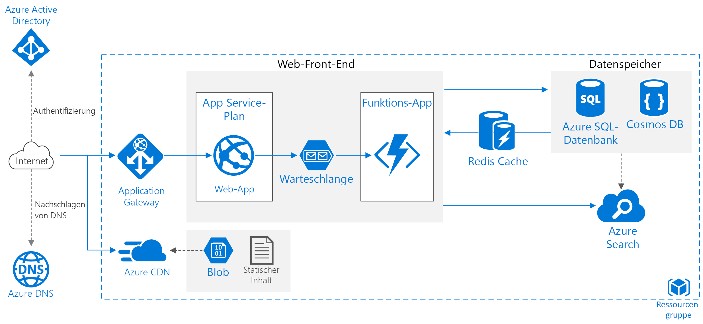

# Verbessern der Skalierbarkeit in einer Azure-WebanwendungImprove scalability in an Azure web application

Diese Referenzarchitektur zeigt bewährte Methoden zum Verbessern der Skalierbarkeit und Leistung in einer Azure App Service-Webanwendung.This reference architecture shows proven practices for improving scalability and performance in an Azure App Service web application.

*Laden Sie eine [Visio-Datei][visio-download] mit dieser Architektur herunter.**Download a [Visio file][visio-download] of this architecture.*

## ArchitectureArchitecture

Diese Architektur basiert auf der unter [Einfache Webanwendung][basic-web-app] gezeigten Architektur.This architecture builds on the one shown in [Basic web application][basic-web-app]. Sie enthält die folgenden Komponenten:It includes the following components:

- **Ressourcengruppe**.**Resource group**. Eine [Ressourcengruppe][resource-group] ist ein logischer Container für Azure-Ressourcen.A [resource group][resource-group] is a logical container for Azure resources.
- **[Web-App][app-service-web-app]**.**[Web app][app-service-web-app]**. Eine typische moderne Anwendung kann sowohl eine Website als auch ein oder mehrere RESTful-Web-APIs enthalten.A typical modern application might include both a website and one or more RESTful web APIs. Eine Web-API kann von Browserclients über AJAX, von systemeigenen Clientanwendungen oder von serverseitigen Anwendungen genutzt werden.A web API might be consumed by browser clients through AJAX, by native client applications, or by server-side applications. Hinweise zum Entwerfen von Web-APIs finden Sie unter [Leitfaden zum API-Design][api-guidance].For considerations on designing web APIs, see [API design guidance][api-guidance].
- **Funktions-App**.**Function App**. Verwenden Sie [Funktionen-Apps][functions] zum Ausführen von Hintergrundaufgaben.Use [Function Apps][functions] to run background tasks. Funktionen werden durch einen Trigger ausgelöst, etwa ein Timerereignis oder eine Nachricht, die in einer Warteschlange platziert wird.Functions are invoked by a trigger, such as a timer event or a message being placed on queue. Verwenden Sie für zustandsbehaftete Aufgaben mit langer Ausführungsdauer [Durable Functions][durable-functions].For long-running stateful tasks, use [Durable Functions][durable-functions].
- **Warteschlange**.**Queue**. Bei der hier gezeigten Architektur setzt die Anwendung Hintergrundaufgaben in eine Warteschlange, indem eine Nachricht in einer [Azure Queue Storage][queue-storage]-Warteschlange abgelegt wird.In the architecture shown here, the application queues background tasks by putting a message onto an [Azure Queue storage][queue-storage] queue. Die Nachricht löst eine Funktions-App aus.The message triggers a function app. Alternativ können Sie Service Bus-Warteschlangen verwenden.Alternatively, you can use Service Bus queues. Einen Vergleich finden Sie unter [Azure- und Service Bus-Warteschlangen – Vergleich und Gegenüberstellung][queues-compared].For a comparison, see [Azure Queues and Service Bus queues - compared and contrasted][queues-compared].
- **Cache**.**Cache**. Speichern Sie semistatische Daten in [Azure Redis Cache][azure-redis].Store semi-static data in [Azure Redis Cache][azure-redis].
- **CDN**.**CDN**. Verwenden Sie [Azure Content Delivery Network][azure-cdn] (CDN) zum Zwischenspeichern öffentlich verfügbarer Inhalte für geringere Latenz und schnellere Bereitstellung der Inhalte.Use [Azure Content Delivery Network][azure-cdn] (CDN) to cache publicly available content for lower latency and faster delivery of content.
- **Datenspeicher**.**Data storage**. Verwenden Sie eine [Azure SQL-Datenbank][sql-db] für relationale Daten.Use [Azure SQL Database][sql-db] for relational data. Ziehen Sie für nicht relationale Daten [Cosmos DB][cosmosdb] in Betracht.For non-relational data, consider [Cosmos DB][cosmosdb].
- **Azure Search**.**Azure Search**. Verwenden Sie [Azure Search][azure-search] zum Hinzufügen von Suchfunktionalität wie z. B. Suchvorschläge, Fuzzysuche und sprachspezifische Suchen.Use [Azure Search][azure-search] to add search functionality such as search suggestions, fuzzy search, and language-specific search. Azure Search wird normalerweise in Verbindung mit einem anderen Datenspeicher verwendet, insbesondere dann, wenn der primäre Datenspeicher strikte Konsistenz erfordert.Azure Search is typically used in conjunction with another data store, especially if the primary data store requires strict consistency. Bei dieser Vorgehensweise speichern Sie autorisierende Daten in dem anderen Datenspeicher und den Suchindex in Azure Search.In this approach, store authoritative data in the other data store and the search index in Azure Search. Azure Search kann auch zum Konsolidieren eines einzelnen Suchindex aus mehreren Datenspeichern verwendet werden.Azure Search can also be used to consolidate a single search index from multiple data stores.
- **Azure DNS:****Azure DNS**. [Azure DNS][azure-dns] ist ein Hostingdienst für DNS-Domänen, der die Namensauflösung unter Verwendung der Microsoft Azure-Infrastruktur durchführt.[Azure DNS][azure-dns] is a hosting service for DNS domains, providing name resolution using Microsoft Azure infrastructure. Durch das Hosten Ihrer Domänen in Azure können Sie Ihre DNS-Einträge mithilfe der gleichen Anmeldeinformationen, APIs, Tools und Abrechnung wie für die anderen Azure-Dienste verwalten.By hosting your domains in Azure, you can manage your DNS records using the same credentials, APIs, tools, and billing as your other Azure services.
- **Anwendungsgateway:****Application gateway**. [Application Gateway](/azure/application-gateway/) ist ein Lastenausgleich auf Schicht 7 (Anwendungsschicht).[Application Gateway](/azure/application-gateway/) is a layer 7 load balancer. Bei dieser Architektur werden HTTP-Anforderungen an das Web-Front-End geleitet.In this architecture, it routes HTTP requests to the web front end. Mit Application Gateway wird auch eine [Web Application Firewall](/azure/application-gateway/waf-overview) (WAF) bereitgestellt, mit der die Anwendung vor häufig auftretenden Exploits und Sicherheitsrisiken geschützt wird.Application Gateway also provides a [web application firewall](/azure/application-gateway/waf-overview) (WAF) that protects the application from common exploits and vulnerabilities.

## EmpfehlungenRecommendations

Ihre Anforderungen können von der hier beschriebenen Architektur abweichen.Your requirements might differ from the architecture described here. Verwenden Sie die Empfehlungen in diesem Abschnitt als Ausgangspunkt.Use the recommendations in this section as a starting point.

### App Service-AppsApp Service apps

Es wird empfohlen, die Webanwendung und die Web-API als separate App Service-Apps zu erstellen.We recommend creating the web application and the web API as separate App Service apps. Dieser Entwurf ermöglicht Ihnen die Ausführung in separaten App Service-Plänen, sodass sie unabhängig voneinander skaliert werden können.This design lets you run them in separate App Service plans so they can be scaled independently. Wenn Sie diesen Grad an Skalierbarkeit anfänglich nicht benötigen, können Sie die Apps in demselben Plan bereitstellen und sie später bei Bedarf in separate Pläne verschieben.If you don't need that level of scalability initially, you can deploy the apps into the same plan and move them into separate plans later if necessary.

> [!NOTE]
> Beim Basic-, Standard- und Premium-Plan werden Ihnen die VM-Instanzen im Plan und nicht pro App in Rechnung gestellt.For the Basic, Standard, and Premium plans, you are billed for the VM instances in the plan, not per app. Informationen finden Sie unter [App Service – Preise][app-service-pricing].See [App Service Pricing][app-service-pricing]
>

### CacheCache

Sie können die Leistung und Skalierbarkeit verbessern, indem Sie [Azure Redis Cache][azure-redis] zum Zwischenspeichern einiger Daten verwenden.You can improve performance and scalability by using [Azure Redis Cache][azure-redis] to cache some data. Ziehen Sie die Verwendung von Redis Cache für Folgendes in Betracht:Consider using Redis Cache for:

- Semistatische TransaktionsdatenSemi-static transaction data.
- SitzungszustandSession state.
- HTML-AusgabeHTML output. Dies kann in Anwendungen nützlich sein, die eine komplexe HTML-Ausgabe rendern.This can be useful in applications that render complex HTML output.

Ausführlichere Anweisungen zum Entwerfen einer Cachingstrategie finden Sie unter [Anleitungen zum Caching][caching-guidance].For more detailed guidance on designing a caching strategy, see [Caching guidance][caching-guidance].

### CDNCDN

Verwenden Sie [Azure CDN][azure-cdn] zum Zwischenspeichern statischer Inhalte.Use [Azure CDN][azure-cdn] to cache static content. Der wichtigste Vorteil eines CDN ist die verringerte Latenz für Benutzer, da Inhalte auf einem Edgeserver zwischengespeichert werden, der sich in geografischer Nähe zum Benutzer befindet.The main benefit of a CDN is to reduce latency for users, because content is cached at an edge server that is geographically close to the user. CDN kann auch die Auslastung der Anwendung verringern, da dieser Datenverkehr nicht von der Anwendung gehandhabt wird.CDN can also reduce load on the application, because that traffic is not being handled by the application.

Wenn Ihre App größtenteils aus statischen Seiten besteht, ziehen Sie die Verwendung von [CDN zum Zwischenspeichern der gesamten App][cdn-app-service] in Betracht.If your app consists mostly of static pages, consider using [CDN to cache the entire app][cdn-app-service]. Andernfalls speichern Sie statische Inhalte wie Bilder, CSS und HTML-Dateien in [Azure Storage, und verwenden Sie CDN zum Zwischenspeichern dieser Dateien][cdn-storage-account].Otherwise, put static content such as images, CSS, and HTML files, into [Azure Storage and use CDN to cache those files][cdn-storage-account].

> [!NOTE]
> Azure CDN kann keine Inhalte bereitstellen, die eine Authentifizierung erfordern.Azure CDN cannot serve content that requires authentication.
>

Ausführlichere Anleitungen finden Sie unter [Anleitungen zum Content Delivery Network (CDN)][cdn-guidance].For more detailed guidance, see [Content Delivery Network (CDN) guidance][cdn-guidance].

### StorageStorage

Moderne Anwendungen verarbeiten häufig große Datenmengen.Modern applications often process large amounts of data. Für eine Skalierung für die Cloud ist es wichtig, den richtigen Speichertyp auszuwählen.In order to scale for the cloud, it's important to choose the right storage type. Hier sind einige grundlegende Empfehlungen dafür.Here are some baseline recommendations.

| Zu speichernde ObjekteWhat you want to store | BeispielExample | Empfohlener SpeicherRecommended storage |
| --- | --- | --- |
| DateienFiles |Bilder, Dokumente, PDF-DateienImages, documents, PDFs |Azure Blob StorageAzure Blob Storage |
| Schlüssel/Wert-PaareKey/Value pairs |Nach Benutzer-ID gesuchte BenutzerprofildatenUser profile data looked up by user ID |Azure-TabellenspeicherAzure Table storage |
| Kurze Nachrichten zum Auslösen der WeiterverarbeitungShort messages intended to trigger further processing |BestellanforderungenOrder requests |Azure Queue-Speicher, Service Bus-Warteschlange oder Service Bus-ThemaAzure Queue storage, Service Bus queue, or Service Bus topic |
| Nicht relationale Daten mit einem flexiblen Schema, die grundlegende Abfragen erfordernNon-relational data with a flexible schema requiring basic querying |ProduktkatalogProduct catalog |Dokumentdatenbank, z. B. Azure Cosmos DB, MongoDB oder Apache CouchDBDocument database, such as Azure Cosmos DB, MongoDB, or Apache CouchDB |
| Relationale Daten, die eine umfassendere Abfrageunterstützung, ein striktes Schema und/oder starke Konsistenz erfordernRelational data requiring richer query support, strict schema, and/or strong consistency |ProduktbestandProduct inventory |Azure SQL-DatenbankAzure SQL Database |

 Weitere Informationen finden Sie unter [Auswählen des richtigen Datenspeichers][datastore].See [Choose the right data store][datastore].

## Überlegungen zur SkalierbarkeitScalability considerations

Ein großer Vorteil von Azure App Service ist die Möglichkeit, Ihre Anwendung abhängig von der Last zu skalieren.A major benefit of Azure App Service is the ability to scale your application based on load. Hier sind einige Punkte aufgeführt, die beim Planen der Skalierung für Ihre Anwendung zu bedenken sind.Here are some considerations to keep in mind when planning to scale your application.

### App Service-AppApp Service app

Wenn Ihre Lösung mehrere App Service-Apps enthält, sollten Sie deren Bereitstellung in separaten App Service-Plänen in Betracht ziehen.If your solution includes several App Service apps, consider deploying them to separate App Service plans. Dieser Ansatz ermöglicht es Ihnen, diese unabhängig voneinander zu skalieren, da sie auf separaten Instanzen ausgeführt werden.This approach enables you to scale them independently because they run on separate instances.

Ziehen Sie ebenso in Erwägung, für eine Funktions-App einen eigenen Plan zu nutzen, damit Hintergrundaufgaben nicht in denselben Instanzen ausgeführt werden, die auch HTTP-Anforderungen verarbeiten.Similarly, consider putting a function app into its own plan so that background tasks don't run on the same instances that handle HTTP requests. Werden Hintergrundaufgaben nur zeitweilig ausgeführt, empfiehlt sich die Nutzung eines [Verbrauchstarifs][functions-consumption-plan]. Bei diesem Tarif erfolgt die Abrechnung basierend auf der Anzahl von Ausführungen und nicht auf Stundenbasis.If background tasks run intermittently, consider using a [consumption plan][functions-consumption-plan], which is billed based on the number of executions, rather than hourly.

### SQL-DatenbankSQL Database

Erhöhen Sie die Skalierbarkeit einer SQL-Datenbank durch *Sharding* der Datenbank.Increase scalability of a SQL database by *sharding* the database. Sharding bezeichnet ein horizontales Partitionieren der Datenbank.Sharding refers to partitioning the database horizontally. Durch Sharding können Sie die Datenbank mithilfe von [Tools für elastische Datenbanken][sql-elastic] horizontal skalieren.Sharding allows you to scale out the database horizontally using [Elastic Database tools][sql-elastic]. Sharding kann unter anderem folgende Vorteile bieten:Potential benefits of sharding include:

- Besserer TransaktionsdurchsatzBetter transaction throughput.
- Abfragen können schneller für eine Teilmenge der Daten ausgeführt werdenQueries can run faster over a subset of the data.

### Azure SearchAzure Search

Azure Search erspart den Aufwand komplexer Datensuchen aus dem primären Datenspeicher und ermöglicht eine Skalierung zur Handhabung von Lasten.Azure Search removes the overhead of performing complex data searches from the primary data store, and it can scale to handle load. Weitere Informationen finden Sie unter [Skalieren von Ressourcenebenen für Abfrage und Indizierung von Arbeitslasten in Azure Search][azure-search-scaling].See [Scale resource levels for query and indexing workloads in Azure Search][azure-search-scaling].

## SicherheitshinweiseSecurity considerations

Dieser Abschnitt enthält Sicherheitshinweise, die für die in diesem Artikel beschriebenen Azure-Dienste spezifisch sind.This section lists security considerations that are specific to the Azure services described in this article. Es handelt sich nicht um eine vollständige Liste der bewährten Sicherheitsmethoden.It's not a complete list of security best practices. Weitere Sicherheitshinweise finden Sie unter [Schützen einer App in Azure App Service][app-service-security].For some additional security considerations, see [Secure an app in Azure App Service][app-service-security].

### Ressourcenfreigabe zwischen verschiedenen Ursprüngen (CORS)Cross-Origin Resource Sharing (CORS)

Wenn Sie eine Website und Web-API als separate Apps erstellen, kann die Website keine clientseitigen AJAX-Aufrufe an die API vornehmen, sofern Sie CORS nicht aktivieren.If you create a website and web API as separate apps, the website cannot make client-side AJAX calls to the API unless you enable CORS.

> [!NOTE]
> Die Browsersicherheit verhindert, dass eine Webseite AJAX-Anforderungen an eine andere Domäne richtet.Browser security prevents a web page from making AJAX requests to another domain. Diese Einschränkung wird als Richtlinie des gleichen Ursprungs bezeichnet und verhindert, dass eine schädliche Website sensible Daten von einer anderen Website liest.This restriction is called the same-origin policy, and prevents a malicious site from reading sentitive data from another site. CORS ist ein W3C-Standard, der einem Server eine weniger strenge Anwendung der Richtlinie des gleichen Ursprungs ermöglicht und einige Anforderungen zwischen verschiedenen Ursprüngen zulässt, während andere abgelehnt werden.CORS is a W3C standard that allows a server to relax the same-origin policy and allow some cross-origin requests while rejecting others.
>

App Services verfügt über integrierte Unterstützung für CORS, ohne dass Anwendungscode geschrieben werden muss.App Services has built-in support for CORS, without needing to write any application code. Informationen finden Sie unter [Nutzen einer API-App aus JavaScript mit CORS][cors].See [Consume an API app from JavaScript using CORS][cors]. Fügen Sie die Website zur Liste der zulässigen Ursprünge für die API hinzu.Add the website to the list of allowed origins for the API.

### Verschlüsselung in der SQL-DatenbankSQL Database encryption

Verwenden Sie [Transparent Data Encryption][sql-encryption], wenn in der Datenbank ruhende Daten verschlüsselt werden sollen.Use [Transparent Data Encryption][sql-encryption] if you need to encrypt data at rest in the database. Dieses Feature führt eine Ver- und Entschlüsselung einer gesamten Datenbank (einschließlich Sicherungen und Transaktionsprotokolldateien) in Echtzeit durch und erfordert keine Änderungen an der Anwendung.This feature performs real-time encryption and decryption of an entire database (including backups and transaction log files) and requires no changes to the application. Die Verschlüsselung führt zu höherer Latenz, und es empfiehlt sich daher, die Daten zu trennen, die in einer eigenen Datenbank gesichert werden müssen, und die Verschlüsselung nur für diese Datenbank zu aktiveren.Encryption does add some latency, so it's a good practice to separate the data that must be secure into its own database and enable encryption only for that database.

<!-- links -->

[api-guidance]: ../../best-practices/api-design.md
[app-service-security]: /azure/app-service-web/web-sites-security
[app-service-web-app]: /azure/app-service-web/app-service-web-overview
[app-service-api-app]: /azure/app-service-api/app-service-api-apps-why-best-platform
[app-service-pricing]: https://azure.microsoft.com/pricing/details/app-service/
[azure-cdn]: https://azure.microsoft.com/services/cdn/
[azure-dns]: /azure/dns/dns-overview
[azure-redis]: https://azure.microsoft.com/services/cache/
[azure-search]: https://azure.microsoft.com/documentation/services/search/
[azure-search-scaling]: /azure/search/search-capacity-planning
[basic-web-app]: basic-web-app.md
[basic-web-app-scalability]: basic-web-app.md#scalability-considerations
[caching-guidance]: ../../best-practices/caching.md
[cdn-app-service]: /azure/app-service-web/cdn-websites-with-cdn
[cdn-storage-account]: /azure/cdn/cdn-create-a-storage-account-with-cdn
[cdn-guidance]: ../../best-practices/cdn.md
[cors]: /azure/app-service-api/app-service-api-cors-consume-javascript
[cosmosdb]: /azure/cosmos-db/
[datastore]: ../..//guide/technology-choices/data-store-overview.md
[durable-functions]: /azure/azure-functions/durable-functions-overview
[functions]: /azure/azure-functions/functions-overview
[functions-consumption-plan]: /azure/azure-functions/functions-scale#consumption-plan
[queue-storage]: /azure/storage/storage-dotnet-how-to-use-queues
[queues-compared]: /azure/service-bus-messaging/service-bus-azure-and-service-bus-queues-compared-contrasted
[resource-group]: /azure/azure-resource-manager/resource-group-overview#resource-groups
[sql-db]: https://azure.microsoft.com/documentation/services/sql-database/
[sql-elastic]: /azure/sql-database/sql-database-elastic-scale-introduction
[sql-encryption]: https://msdn.microsoft.com/library/dn948096.aspx
[tm]: https://azure.microsoft.com/services/traffic-manager/
[visio-download]: https://archcenter.blob.core.windows.net/cdn/app-service-reference-architectures.vsdx
[web-app-multi-region]: ./multi-region.md
