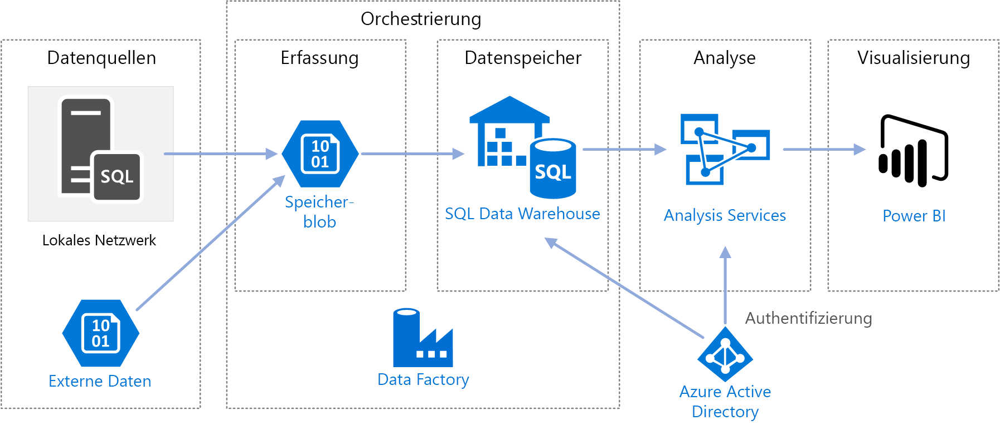
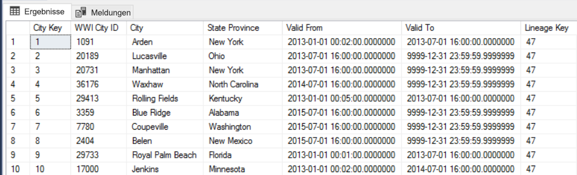
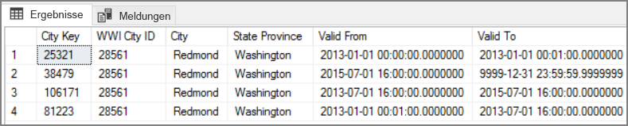

# <a name="automated-enterprise-bi-with-sql-data-warehouse-and-azure-data-factory"></a>Automatisierte Enterprise BI-Instanz mit SQL Data Warehouse und Azure Data Factory

Diese Referenzarchitektur veranschaulicht die Vorgehensweise für inkrementelles Laden in einer [ELT-Pipeline](../../data-guide/relational-data/etl.md#extract-load-and-transform-elt) (Extrahieren, Laden und Transformieren). Sie verwendet Azure Data Factory, um die ELT-Pipeline zu automatisieren. Die Pipeline verschiebt die neuesten OLTP-Daten inkrementell aus einer lokalen SQL Server-Datenbank in SQL Data Warehouse. Transaktionsdaten werden in ein tabellarisches Modell für die Analyse transformiert.

<!-- markdownlint-disable MD034 -->

> [!VIDEO https://www.microsoft.com/en-us/videoplayer/embed/RE2Gnz2]

<!-- markdownlint-enable MD034 -->

Eine Referenzimplementierung für diese Architektur ist auf [GitHub][github] verfügbar.



Diese Architektur baut auf der in [Enterprise BI mit SQL Data Warehouse](./enterprise-bi-sqldw.md) gezeigten auf, weist jedoch einige zusätzliche Funktionen auf, die für Data Warehousing-Szenarien für Unternehmen wichtig sind.

- Automatisierung der Pipeline mithilfe von Data Factory.
- Inkrementelles Laden.
- Integration mehrerer Datenquellen.
- Laden von binären Daten wie räumliche Daten und Bilder.

## <a name="architecture"></a>Architecture

Die Architektur umfasst die folgenden Komponenten.

### <a name="data-sources"></a>Datenquellen

**Lokaler SQL Server**. Die Quelldaten befinden sich in einer lokalen SQL Server-Datenbank. Um die lokale Umgebung zu simulieren, stellen die Bereitstellungsskripts für diese Architektur eine VM in Azure bereit, auf der SQL Server installiert ist. Die [OLTP-Beispieldatenbank von Wide World Importers][wwi] wird als Quelldatenbank verwendet.

**Externe Daten**. Ein gängiges Szenario für Data Warehouses ist die Integration mehrerer Datenquellen. Diese Referenzarchitektur lädt ein externes Dataset, das die Stadtbevölkerung nach Jahr enthält, und integriert es in die Daten aus der OLTP-Datenbank. Auf der Grundlage dieser Daten können Sie verschiedene Fragen beantworten. Beispiel: „Entspricht die Umsatzsteigerung in jeder Region dem Bevölkerungswachstum, oder ist sie unverhältnismäßig höher?“

### <a name="ingestion-and-data-storage"></a>Erfassung und Datenspeicherung

**Blobspeicher**. Blobspeicher wird als Stagingbereich für die Quelldaten vor dem Laden in SQL Data Warehouse verwendet.

**Azure SQL Data Warehouse**. [SQL Data Warehouse](/azure/sql-data-warehouse/) ist ein verteiltes System für die Analyse großer Datenmengen. Es unterstützt massive Parallelverarbeitung (Massive Parallel Processing, MPP), die die Ausführung von Hochleistungsanalysen ermöglicht.

**Azure Data Factory** [Data Factory][adf] ist ein verwalteter Dienst, der Datenverschiebung und Datentransformation orchestriert und automatisiert. In dieser Architektur koordiniert er die verschiedenen Phasen des ELT-Prozesses.

### <a name="analysis-and-reporting"></a>Analysen und Berichte

**Azure Analysis Services**: [Analysis Services](/azure/analysis-services/) ist ein vollständig verwalteter Dienst, der Datenmodellierungsfunktionen ermöglicht. Das semantische Modell wird in Analysis Services geladen.

**Power BI**: Power BI ist eine Suite aus Business Analytics-Tools zum Analysieren von Daten für Einblicke in Geschäftsvorgänge. In dieser Architektur dient sie zum Abfragen des in Analysis Services gespeicherten semantischen Modells.

### <a name="authentication"></a>Authentication

**Azure Active Directory** (Azure AD) authentifiziert Benutzer, die über Power BI eine Verbindung mit dem Analysis Services-Server herstellen.

Data Factory auch Azure AD für die Authentifizierung bei SQL Data Warehouse nutzen, indem ein Dienstprinzipal oder eine verwaltete Dienstidentität (MSI) verwendet wird. Der Einfachheit halber verwendet die Beispielbereitstellung die SQL Server-Authentifizierung.

## <a name="data-pipeline"></a>Datenpipeline

In [Azure Data Factory][adf] ist eine Pipeline eine logische Gruppierung von Aktivitäten zum Koordinieren einer &mdash;-Aufgabe, in diesem Fall das Laden und Transformieren von Daten in SQL Data Warehouse.

Diese Referenzarchitektur definiert eine Masterpipeline, die eine Sequenz von untergeordneten Pipelines ausführt. Jede untergeordnete Pipeline lädt Daten in eine oder mehrere Data Warehouse-Tabellen.


## <a name="incremental-loading"></a>Inkrementelles Laden

Beim Ausführen eines automatisierten ETL-oder ELT-Prozesses ist es am effizientesten, nur die Daten zu laden, die sich seit der vorhergehenden Ausführung geändert haben. Dies wird als *inkrementeller Ladevorgang* bezeichnet, im Gegensatz zu einem vollständige Ladevorgang, bei dem alle Daten geladen werden. Zum Ausführen eines inkrementellen Ladevorgangs benötigen Sie eine Möglichkeit zum Identifizieren, welche Daten sich geändert haben. Der gängigste Ansatz ist die Verwendung eines Werts zum *Erkennen von Änderungen mit oberem Grenzwert*, d.h. der aktuelle Wert einer Spalte in der Quelltabelle – entweder einer datetime-Spalte oder einer eindeutigen Integer-Spalte – wird nachverfolgt.

Ab SQL Server 2016 können Sie [temporale Tabellen](/sql/relational-databases/tables/temporal-tables) verwenden. Hierbei handelt es sich um Tabellen mit Systemversionsverwaltung, die einen vollständigen Verlauf aller Datenänderungen beibehalten. Die Datenbank-Engine zeichnet den Verlauf aller Änderungen automatisch in einer separaten Verlaufstabelle auf. Sie können die Verlaufsdaten abfragen, indem Sie eine FOR SYSTEM_TIME-Klausel an eine Abfrage anhängen. Intern fragt die Datenbank-Engine die Verlaufstabelle ab, dies ist für die Anwendung jedoch transparent.

> [!NOTE]
> Für frühere Versionen von SQL Server können Sie [Change Data Capture](/sql/relational-databases/track-changes/about-change-data-capture-sql-server) (CDC) verwenden. Dieser Ansatz ist weniger geeignet als temporale Tabellen, da Sie eine separate Änderungstabelle abfragen müssen, und Änderungen werden anhand einer Protokollfolgenummer anstatt eines Zeitstempels nachverfolgt.
>

Temporale Tabellen sind hilfreich für Dimensionsdaten, die sich im Laufe der Zeit ändern können. Faktentabellen stellen in der Regel eine unveränderliche Transaktion wie einen Verkauf dar, und in diesem Fall ist das Beibehalten des Systemversionsverlaufs nicht sinnvoll. Stattdessen weisen Transaktionen normalerweise eine Spalte auf, die das Transaktionsdatum darstellt, das als Wasserzeichenwert verwendet werden kann. Beispielsweise enthalten in der OLTP-Datenbank von Wide World Importers die Tabellen „Sales.Invoices“ und „Sales.InvoiceLines“ das Feld `LastEditedWhen`, dessen Standardwert `sysdatetime()` ist.

Hier ist der allgemeine Ablauf für die ELT-Pipeline:

1. Verfolgen Sie für jede Tabelle in der Quelldatenbank den Trennzeitpunkt der Ausführung des letzten ELT-Auftrags nach. Speichern Sie diese Informationen im Data Warehouse. (Bei der Ersteinrichtung sind alle Zeiten auf „1.1.1900“ festgelegt.)

2. Während des Datenexportschritts wird der Trennzeitpunkt als Parameter an einen Satz von gespeicherten Prozeduren in der Quelldatenbank übergeben. Diese gespeicherten Prozeduren fragen alle Datensätze ab, die nach dem Trennzeitpunkt geändert oder erstellt wurden. Für die Sales-Faktentabelle wird die Spalte `LastEditedWhen` verwendet. Für die Dimensionsdaten werden temporale Tabellen mit Systemversionsverwaltung verwendet.

3. Wenn die Datenmigration abgeschlossen ist, aktualisieren Sie die Tabelle, in der die Trennzeitpunkte gespeichert werden.

Es ist auch hilfreich, eine *Herkunft* für jede ELT-Ausführung aufzuzeichnen. Für einen bestimmten Datensatz ordnet die Herkunft diesen Datensatz der ELT-Ausführung zu, bei der die Daten erzeugt wurden. Bei jeder ETL-Ausführung wird für jede Tabelle ein neuer Herkunftsdatensatz erstellt, der die Start- und Endladezeiten anzeigt. Die Herkunftsschlüssel für die einzelnen Datensätze werden in den Dimensions- und Faktentabellen gespeichert.



Aktualisieren Sie das Analysis Services-Tabellenmodell, nachdem ein neuer Datenbatch in das Warehouse geladen wurde. Siehe [Asynchrones Aktualisieren mit der REST-API](/azure/analysis-services/analysis-services-async-refresh).

## <a name="data-cleansing"></a>Datenbereinigung

Die Datenbereinigung sollte Teil des ELT-Prozesses sein. In dieser Referenzarchitektur ist die Tabelle mit der Stadtbevölkerung eine Quelle ungültiger Daten, in der einige Städte keine Bevölkerung aufweisen, da möglicherweise keine Daten verfügbar waren. Während der Verarbeitung entfernt die ELT-Pipeline diese Städte aus der Tabelle mit der Stadtbevölkerung. Führen Sie die Datenbereinigung in Stagingtabellen statt in externen Tabellen durch.

Hier ist die gespeicherte Prozedur, die die Städte ohne Bevölkerung der Tabelle mit der Stadtbevölkerung entfernt. (Sie finden die Quelldatei [hier](https://github.com/mspnp/reference-architectures/blob/master/data/enterprise_bi_sqldw_advanced/azure/sqldw_scripts/citypopulation/%5BIntegration%5D.%5BMigrateExternalCityPopulationData%5D.sql).)

```sql
DELETE FROM [Integration].[CityPopulation_Staging]
WHERE RowNumber in (SELECT DISTINCT RowNumber
FROM [Integration].[CityPopulation_Staging]
WHERE POPULATION = 0
GROUP BY RowNumber
HAVING COUNT(RowNumber) = 4)
```

## <a name="external-data-sources"></a>Externe Datenquellen

Data Warehouses fassen häufig Daten aus mehreren Quellen zusammen. Diese Referenzarchitektur lädt eine externe Datenquelle, die demografische Daten enthält. Dieses Dataset in Azure Blob Storage als Teil des Beispiels [WorldWideImportersDW](https://github.com/Microsoft/sql-server-samples/tree/master/samples/databases/wide-world-importers/sample-scripts/polybase) verfügbar.

Azure Data Factory kann mithilfe des [Blob Storage-Connectors](/azure/data-factory/connector-azure-blob-storage) direkt aus Blob Storage kopieren. Der Connector erfordert jedoch eine Verbindungszeichenfolge oder eine Shared Access Signature, damit er nicht zum Kopieren eines Blobs mit öffentlichem Lesezugriff verwendet werden kann. Um dieses Problem zu umgehen, können Sie PolyBase zum Erstellen einer externen Tabelle über Blob Storage verwenden und die externen Tabellen dann in SQL Data Warehouse kopieren.

## <a name="handling-large-binary-data"></a>Verarbeiten von umfangreichen Binärdaten

In der Quelldatenbank weist die Tabelle mit Städten die Spalte „Ort“ auf, die den räumlichen Datentyp [Geografie](/sql/t-sql/spatial-geography/spatial-types-geography) enthält. SQL Data Warehouse unterstützt den Typ **Geografie** nicht systemintern, daher wird dieses Feld während des Ladens in einen **varbinary**-Typ konvertiert. (Siehe [Verwenden von Problemumgehungen für nicht unterstützte Datentypen](/azure/sql-data-warehouse/sql-data-warehouse-tables-data-types#unsupported-data-types).)

PolyBase unterstützt jedoch eine maximale Spaltengröße von `varbinary(8000)`, was bedeutet, dass einige Daten möglicherweise abgeschnitten werden. Dieses Problem lässt sich umgehen, indem die Daten während des Exports wie folgt in Blöcke aufgeteilt und dann wieder zusammengefügt werden:

1. Erstellen Sie eine temporäre Stagingtabelle für die Standort-Spalte.

2. Teilen Sie die Standortdaten für jede Stadt in Blöcke von 8000 Bytes auf. Dies ergibt 1 &ndash; N Zeilen für jede Stadt.

3. Um die Blöcke wieder zusammenzusetzen, verwenden Sie den T-SQL-[PIVOT](/sql/t-sql/queries/from-using-pivot-and-unpivot)-Operator, um Zeilen in Spalten umwandeln und dann die Spaltenwerte für jede Stadt zu verketten.

Die Herausforderung besteht darin, dass jede Stadt je nach Größe der geografischen Daten in eine unterschiedliche Anzahl von Zeilen aufgeteilt wird. Damit der PIVOT-Operator funktioniert, muss jede Stadt die gleiche Anzahl von Zeilen aufweisen. Dazu wendet die T-SQL-Abfrage (die Sie [hier][MergeLocation] anzeigen können) einige Tricks an, um die Zeilen mit leeren Werten aufzufüllen, sodass jede Stadt nach dem Pivot-Vorgang die gleiche Anzahl von Spalten aufweist. Die resultierende Abfrage erweist sich als wesentlich schneller als Durchlaufen der einzelnen Zeilen.

Der gleiche Ansatz wird für Bilddaten verwendet.

## <a name="slowly-changing-dimensions"></a>Langsam veränderliche Dimensionen

Dimensionsdaten sind relativ statisch, können sich jedoch ändern. Beispielsweise kann ein Produkt einer anderen Produktkategorie zugewiesen werden. Es gibt verschiedene Ansätze zur Handhabung von langsam veränderlichen Dimensionen. Ein gängiges Verfahren mit der Bezeichnung [Typ 2](https://wikipedia.org/wiki/Slowly_changing_dimension#Type_2:_add_new_row) ist das Hinzufügen eines neuen Datensatzes bei jeder Dimensionsänderung.

Zur Umsetzung des Typ 2-Ansatzes erfordern Dimensionstabellen zusätzliche Spalten, die den effektiven Datumsbereich für einen bestimmten Datensatz angeben. Außerdem werden Primärschlüssel aus der Quelldatenbank dupliziert, daher muss die Dimensionstabelle über einen künstlichen Primärschlüssel verfügen.

Die folgende Abbildung zeigt die Tabelle „Dimension.City“. Die Spalte `WWI City ID` ist der Primärschlüssel aus der Quelldatenbank. Die Spalte `City Key` ist ein künstlicher Schlüssel, der während der Verarbeitung der ETL-Pipeline generiert wurde. Beachten Sie auch, dass in der Tabelle die Spalten `Valid From` und `Valid To` vorhanden sind, die den Bereich definieren, in dem die einzelnen Zeilen gültig waren. Das `Valid To`-Element aktueller Werte entspricht „9999-12-31“.


Der Vorteil dieses Ansatzes ist, dass historische Daten beibehalten werden, die für die Analyse nützlich sein können. Allerdings sind dabei auch mehrere Zeilen für dieselbe Entität vorhanden. Hier sehen Sie beispielsweise Datensätze, die `WWI City ID` = 28561 entsprechen:



Ordnen Sie jeden Sales-Fakt einer einzelnen Zeile in der Tabelle „Dimension.City“ zu, die dem Rechnungsdatum entspricht. Erstellen Sie als Teil des ETL-Prozesses eine weitere Spalte, die 

Die folgende T-SQL-Abfrage erstellt eine temporäre Tabelle, die jede Rechnung dem richtigen City-Schlüssel aus der Tabelle „Dimension.City“ zuordnet.

```sql
CREATE TABLE CityHolder
WITH (HEAP , DISTRIBUTION = HASH([WWI Invoice ID]))
AS
SELECT DISTINCT s1.[WWI Invoice ID] AS [WWI Invoice ID],
                c.[City Key] AS [City Key]
    FROM [Integration].[Sale_Staging] s1
    CROSS APPLY (
                SELECT TOP 1 [City Key]
                    FROM [Dimension].[City]
                WHERE [WWI City ID] = s1.[WWI City ID]
                    AND s1.[Last Modified When] > [Valid From]
                    AND s1.[Last Modified When] <= [Valid To]
                ORDER BY [Valid From], [City Key] DESC
                ) c

```

Diese Tabelle wird verwendet, um eine Spalte in der Sales-Faktentabelle auszufüllen:

```sql
UPDATE [Integration].[Sale_Staging]
SET [Integration].[Sale_Staging].[WWI Customer ID] =  CustomerHolder.[WWI Customer ID]
```

Diese Spalte ermöglicht, dass eine Power BI-Abfrage den richtigen City-Datensatz für eine bestimmte Verkaufsrechnung findet.

## <a name="security-considerations"></a>Sicherheitshinweise

Für höhere Sicherheit können Sie [Virtual Network-Dienstendpunkte](/azure/virtual-network/virtual-network-service-endpoints-overview) zum Schützen von Azure-Dienstressourcen verwenden, indem diese ausschließlich auf Ihr virtuelles Netzwerk beschränkt sind. Der öffentliche Internetzugriff auf diese Ressourcen wird dadurch vollständig entfernt, sodass nur Datenverkehr aus Ihrem virtuellen Netzwerk zulässig ist.

Mit diesem Ansatz erstellen Sie ein VNET in Azure und dann private Dienstendpunkte für Azure-Dienste. Diese Dienste sind dann auf Datenverkehr aus diesem virtuellen Netzwerk beschränkt. Sie können auch über ein Gateway aus Ihrem lokalen Netzwerk darauf zugreifen.

Bedenken Sie dabei folgende Einschränkungen:

- Zum Zeitpunkt der Erstellung dieser Referenzarchitektur werden VNET-Dienstendpunkte für Azure Storage und Azure SQL Data Warehouse, aber nicht für Azure Analysis Services unterstützt. Überprüfen Sie den aktuellen Status [hier](https://azure.microsoft.com/updates/?product=virtual-network).

- Wenn Dienstendpunkte für Azure Storage aktiviert sind, kann PolyBase keine Daten aus Storage in SQL Data Warehouse kopieren. Dieses Problem kann entschärft werden. Weitere Informationen finden Sie unter [Auswirkungen der Verwendung von VNET-Dienstendpunkten mit Azure Storage](/azure/sql-database/sql-database-vnet-service-endpoint-rule-overview?toc=%2fazure%2fvirtual-network%2ftoc.json#impact-of-using-vnet-service-endpoints-with-azure-storage).

- Zum Verschieben von Daten aus einem lokalen Speicher in Azure Storage müssen Sie öffentliche IP-Adressen in Ihrem lokalen Speicher oder ExpressRoute auf die Whitelist setzen. Details finden Sie unter [Schützen von Azure-Diensten in virtuellen Netzwerken](/azure/virtual-network/virtual-network-service-endpoints-overview#securing-azure-services-to-virtual-networks).

- Stellen Sie im virtuellen Netzwerk einen virtuellen Windows-Computer bereit, der den SQL Data Warehouse-Dienstendpunkt enthält, damit Analysis Services Daten aus SQL Data Warehouse lesen kann. Installieren Sie auf diesem virtuellen Computer ein [lokales Azure-Datengateway](/azure/analysis-services/analysis-services-gateway). Verbinden Sie dann Ihren Azure Analysis-Dienst, mit dem Datengateway.

## <a name="deploy-the-solution"></a>Bereitstellen der Lösung

Führen Sie zum Bereitstellen und Ausführen der Referenzimplementierung die Schritte in der [GitHub-Infodatei][github] aus. Folgendes wird bereitgestellt:

- Eine Windows-VM, um einen lokalen Datenbankserver zu simulieren. Sie enthält SQL Server 2017 und zugehörige Tools zusammen mit Power BI Desktop.
- Ein Azure Storage-Konto, das Blobspeicher zum Speichern von Daten bereitstellt, die aus SQL Server-Datenbank exportiert wurden.
- Eine Instanz von Azure SQL Data Warehouse.
- Eine Azure Analysis Services-Instanz.
- Azure Data Factory und die Data Factory-Pipeline für den ELT-Auftrag.

## <a name="related-resources"></a>Zugehörige Ressourcen

Es wird empfohlen, sich das folgende [Azure-Beispielszenario](/azure/architecture/example-scenario) anzusehen. Darin wird veranschaulicht, wie einige dieser Technologien in spezifischen Lösungen verwendet werden:

- [Data Warehousing und Analysen für Vertrieb und Marketing](/azure/architecture/example-scenario/data/data-warehouse)
- [ETL-Hybridvorgänge mit vorhandenen lokalen SSIS-Bereitstellungen und Azure Data Factory](/azure/architecture/example-scenario/data/hybrid-etl-with-adf)

<!-- links -->

[adf]: /azure/data-factory
[github]: https://github.com/mspnp/azure-data-factory-sqldw-elt-pipeline
[MergeLocation]: https://github.com/mspnp/reference-architectures/blob/master/data/enterprise_bi_sqldw_advanced/azure/sqldw_scripts/city/%5BIntegration%5D.%5BMergeLocation%5D.sql
[wwi]: /sql/sample/world-wide-importers/wide-world-importers-oltp-database
