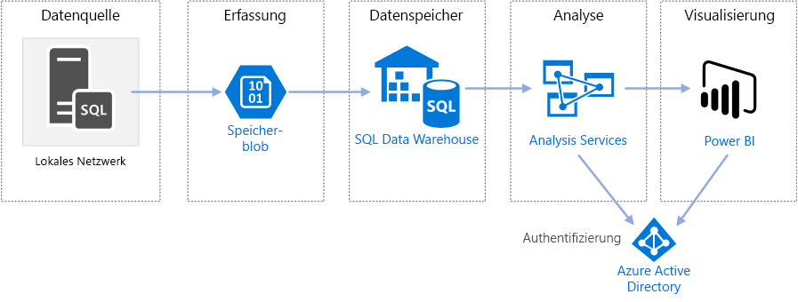
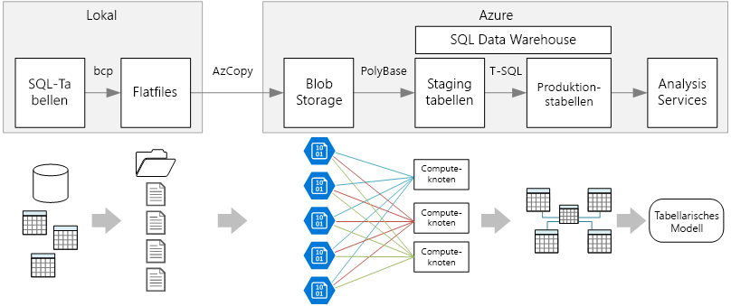

# Enterprise BI in Azure mit SQL Data WarehouseEnterprise BI in Azure with SQL Data Warehouse

Diese Referenzarchitektur implementiert eine [ELT-Pipeline](../../data-guide/relational-data/etl.md#extract-load-and-transform-elt) (Extrahieren, Laden und Transformieren), die Daten aus einer lokalen SQL Server-Datenbank in SQL Data Warehouse verschiebt und die Daten für die Analyse transformiert.This reference architecture implements an [extract, load, and transform (ELT)](../../data-guide/relational-data/etl.md#extract-load-and-transform-elt) pipeline that moves data from an on-premises SQL Server database into SQL Data Warehouse and transforms the data for analysis.

Eine Referenzimplementierung für diese Architektur ist auf [GitHub][github-folder] verfügbar.A reference implementation for this architecture is available on [GitHub][github-folder].

**Szenario:** Ein großes OLTP-Dataset einer Organisation ist lokal in einer SQL Server-Datenbank gespeichert.**Scenario**: An organization has a large OLTP data set stored in a SQL Server database on premises. Die Organisation möchte mittels SQL Data Warehouse eine Analyse mit Power BI ausführen.The organization wants to use SQL Data Warehouse to perform analysis using Power BI.

Diese Referenzarchitektur ist für einmalige oder bedarfsgesteuerte Aufträge bestimmt.This reference architecture is designed for one-time or on-demand jobs. Wenn Sie fortlaufend (stündlich oder täglich) Daten verschieben müssen, sollten Sie mit Azure Data Factory einen automatisierten Workflow definieren.If you need to move data on a continuing basis (hourly or daily), we recommend using Azure Data Factory to define an automated workflow. Eine Referenzarchitektur, die Data Factory verwendet, finden Sie unter [Automatisierte Enterprise BI-Instanz mit SQL Data Warehouse und Azure Data Factory][adf-ra].For a reference architecture that uses Data Factory, see [Automated enterprise BI with SQL Data Warehouse and Azure Data Factory][adf-ra].

## ArchitectureArchitecture

Die Architektur umfasst die folgenden Komponenten.The architecture consists of the following components.

### DatenquelleData source

**SQL Server**.**SQL Server**. Die Quelldaten befinden sich in einer lokalen SQL Server-Datenbank.The source data is located in a SQL Server database on premises. Um die lokale Umgebung zu simulieren, stellen die Bereitstellungsskripts für diese Architektur einen virtuellen Computer in Azure bereit, auf dem SQL Server installiert ist.To simulate the on-premises environment, the deployment scripts for this architecture provision a VM in Azure with SQL Server installed. Die [OLTP-Beispieldatenbank von Wide World Importers][wwi] wird als Datenquelle verwendet.The [Wide World Importers OLTP sample database][wwi] is used as the source data.

### Erfassung und DatenspeicherungIngestion and data storage

**Blobspeicher**.**Blob Storage**. Blobspeicher wird als Stagingbereich zum Kopieren der Daten vor dem Laden in SQL Data Warehouse verwendet.Blob storage is used as a staging area to copy the data before loading it into SQL Data Warehouse.

**Azure SQL Data Warehouse**.**Azure SQL Data Warehouse**. [SQL Data Warehouse](/azure/sql-data-warehouse/) ist ein verteiltes System für die Analyse großer Datenmengen.[SQL Data Warehouse](/azure/sql-data-warehouse/) is a distributed system designed to perform analytics on large data. Es unterstützt massive Parallelverarbeitung (Massive Parallel Processing, MPP), die die Ausführung von Hochleistungsanalysen ermöglicht.It supports massive parallel processing (MPP), which makes it suitable for running high-performance analytics.

### Analysen und BerichteAnalysis and reporting

**Azure Analysis Services**:**Azure Analysis Services**. [Analysis Services](/azure/analysis-services/) ist ein vollständig verwalteter Dienst, der Datenmodellierungsfunktionen ermöglicht.[Analysis Services](/azure/analysis-services/) is a fully managed service that provides data modeling capabilities. Verwenden Sie Analysis Services zum Erstellen eines semantischen Modells, das Benutzer abfragen können.Use Analysis Services to create a semantic model that users can query. Analysis Services ist in einem Szenario mit BI-Dashboard besonders nützlich.Analysis Services is especially useful in a BI dashboard scenario. In dieser Architektur liest Analysis Services Daten aus dem Data Warehouse, um das semantische Modell zu verarbeiten, und bedient Dashboardabfragen effizient.In this architecture, Analysis Services reads data from the data warehouse to process the semantic model, and efficiently serves dashboard queries. Darüber hinaus unterstützt der Dienst auch die elastische Parallelität durch zentrales Hochskalieren von Replikaten zur schnelleren Abfragenverarbeitung.It also supports elastic concurrency, by scaling out replicas for faster query processing.

Zurzeit unterstützt Azure Analysis Services tabellarische Modelle, aber keine mehrdimensionalen Modelle.Currently, Azure Analysis Services supports tabular models but not multidimensional models. Tabellarische Modelle verwenden relationale Modellierungskonstrukte (Tabellen und Spalten), wohingegen mehrdimensionale Modelle OLAP-Modellierungskonstrukte (Cubes, Dimensionen und Measures) verwenden.Tabular models use relational modeling constructs (tables and columns), whereas multidimensional models use OLAP modeling constructs (cubes, dimensions, and measures). Wenn Sie mehrdimensionale Modelle benötigen, verwenden Sie SQL Server Analysis Services (SSAS).If you require multidimensional models, use SQL Server Analysis Services (SSAS). Weitere Informationen finden Sie unter [Vergleichen von tabellarischen und mehrdimensionalen Lösungen](/sql/analysis-services/comparing-tabular-and-multidimensional-solutions-ssas).For more information, see [Comparing tabular and multidimensional solutions](/sql/analysis-services/comparing-tabular-and-multidimensional-solutions-ssas).

**Power BI**:**Power BI**. Power BI ist eine Suite aus Business Analytics-Tools zum Analysieren von Daten für Einblicke in Geschäftsvorgänge.Power BI is a suite of business analytics tools to analyze data for business insights. In dieser Architektur dient sie zum Abfragen des in Analysis Services gespeicherten semantischen Modells.In this architecture, it queries the semantic model stored in Analysis Services.

### AuthentifizierungAuthentication

**Azure Active Directory (Azure AD)** authentifiziert Benutzer, die über Power BI eine Verbindung mit dem Analysis Services-Server herstellen.**Azure Active Directory (Azure AD)** authenticates users who connect to the Analysis Services server through Power BI.

## DatenpipelineData pipeline

Diese Referenzarchitektur verwendet die Beispieldatenbank [WorldWideImporters](/sql/sample/world-wide-importers/wide-world-importers-oltp-database) als Datenquelle.This reference architecture uses the [WorldWideImporters](/sql/sample/world-wide-importers/wide-world-importers-oltp-database) sample database as a data source. Die Phasen der Datenpipeline sind:The data pipeline has the following stages:

1. Exportieren der Daten aus SQL Server in Flatfiles (BCP-Hilfsprogramm).Export the data from SQL Server to flat files (bcp utility).
2. Kopieren der Flatfiles in Azure Blob Storage (AzCopy).Copy the flat files to Azure Blob Storage (AzCopy).
3. Laden der Daten in SQL Data Warehouse (PolyBase).Load the data into SQL Data Warehouse (PolyBase).
4. Transformieren der Daten in ein Sternschema (T-SQL).Transform the data into a star schema (T-SQL).
5. Laden eines Semantikmodells in Analysis Services (SQL Server Data Tools).Load a semantic model into Analysis Services (SQL Server Data Tools).

> [!NOTE]
> Erwägen Sie für die Schritte 1 &ndash; 3 die Verwendung von Redgate Data Platform Studio.For steps 1 &ndash; 3, consider using Redgate Data Platform Studio. Data Platform Studio wendet optimal abgestimmte Kompatibilitätspatches und Optimierungen an und ermöglicht so den schnellsten Einstieg in die Verwendung von SQL Data Warehouse.Data Platform Studio applies the most appropriate compatibility fixes and optimizations, so it's the quickest way to get started with SQL Data Warehouse. Weitere Informationen finden Sie unter [Laden von Daten mit Redgate Data Platform Studio](/azure/sql-data-warehouse/sql-data-warehouse-load-with-redgate).For more information, see [Load data with Redgate Data Platform Studio](/azure/sql-data-warehouse/sql-data-warehouse-load-with-redgate).
>

In den folgenden Abschnitten werden diese Phasen ausführlicher beschrieben.The next sections describe these stages in more detail.

### Exportieren von Daten aus SQL ServerExport data from SQL Server

Das Hilfsprogramm [BCP](/sql/tools/bcp-utility) (Bulk Copy Program) ist eine schnelle Möglichkeit zum Erstellen von Textflatfiles aus SQL-Tabellen.The [bcp](/sql/tools/bcp-utility) (bulk copy program) utility is a fast way to create flat text files from SQL tables. In diesem Schritt wählen Sie die Spalten, die Sie exportieren möchten, jedoch nicht die zu transformierenden Daten.In this step, you select the columns that you want to export, but don't transform the data. Alle Datentransformationen sollten in SQL Data Warehouse erfolgen.Any data transformations should happen in SQL Data Warehouse.

**Empfehlungen****Recommendations**

Planen Sie die Datenextrahierung nach Möglichkeit außerhalb der Spitzenzeiten, um Ressourcenkonflikte in der Produktionsumgebung zu minimieren.If possible, schedule data extraction during off-peak hours, to minimize resource contention in the production environment.

Führen Sie BCP nicht auf dem Datenbankserver aus.Avoid running bcp on the database server. Führen Sie BCP stattdessen auf einem anderen Computer aus.Instead, run it from another machine. Schreiben Sie die Dateien auf ein lokales Laufwerk.Write the files to a local drive. Stellen Sie sicher, dass genügend E/A-Ressourcen für gleichzeitige Schreibvorgänge bereitstehen.Ensure that you have sufficient I/O resources to handle the concurrent writes. Um die Leistung zu optimieren, exportieren Sie die Dateien auf dedizierte schnelle Speicherlaufwerke.For best performance, export the files to dedicated fast storage drives.

Sie können die Netzwerkübertragung beschleunigen, indem Sie die exportierten Daten im komprimierten Gzip-Format speichern.You can speed up the network transfer by saving the exported data in Gzip compressed format. Allerdings ist das Laden komprimierter Dateien in Warehouse langsamer als das Laden dekomprimierter Dateien, sodass ein Kompromiss zwischen schneller Netzwerkübertragung und schnellerem Laden getroffen werden muss.However, loading compressed files into the warehouse is slower than loading uncompressed files, so there is a tradeoff between faster network transfer versus faster loading. Wenn Sie die Gzip-Komprimierung verwenden möchten, erstellen Sie keine einzelne Gzip-Datei.If you decide to use Gzip compression, don't create a single Gzip file. Teilen Sie die Daten stattdessen auf mehrere komprimierte Dateien auf.Instead, split the data into multiple compressed files.

### Kopieren von Flatfiles in BlobspeicherCopy flat files into blob storage

Das Hilfsprogramm [AzCopy](/azure/storage/common/storage-use-azcopy) ist für das Hochleistungskopieren von Daten in den Azure-Blobspeicher bestimmt.The [AzCopy](/azure/storage/common/storage-use-azcopy) utility is designed for high-performance copying of data into Azure blob storage.

**Empfehlungen****Recommendations**

Erstellen Sie das Speicherkonto in einer Region, die sich in der Nähe des Quelldatenspeicherorts befindet.Create the storage account in a region near the location of the source data. Stellen Sie das Speicherkonto und die SQL Data Warehouse-Instanz in der gleichen Region bereit.Deploy the storage account and the SQL Data Warehouse instance in the same region.

Führen Sie AzCopy und Ihre Produktionsworkloads nicht auf dem gleichen Computer aus, da CPU- und E/A-Verbrauch die Produktionsworkloads beeinträchtigen können.Don't run AzCopy on the same machine that runs your production workloads, because the CPU and I/O consumption can interfere with the production workload.

Testen Sie den Upload zuerst, um die Uploadgeschwindigkeit zu ermitteln.Test the upload first to see what the upload speed is like. Sie können in AzCopy mit der Option „/NC“ die Anzahl der gleichzeitigen Kopiervorgänge angeben.You can use the /NC option in AzCopy to specify the number of concurrent copy operations. Beginnen Sie mit dem Standardwert, und experimentieren Sie mit dieser Einstellung, um die Leistung zu optimieren.Start with the default value, then experiment with this setting to tune the performance. In einer Umgebung mit geringer Bandbreite können zu viele gleichzeitige Vorgänge die Netzwerkverbindung überlasten, sodass die Vorgänge nicht erfolgreich abgeschlossen werden können.In a low-bandwidth environment, too many concurrent operations can overwhelm the network connection and prevent the operations from completing successfully.

AZCopy verschiebt Daten über das öffentliche Internet in den Speicher.AzCopy moves data to storage over the public internet. Wenn dies nicht schnell genug ist, sollten Sie die Einrichtung einer [ExpressRoute](/azure/expressroute/)-Verbindung erwägen.If this isn't fast enough, consider setting up an [ExpressRoute](/azure/expressroute/) circuit. ExpressRoute ist ein Dienst, der Ihre Daten über eine dedizierte private Verbindung zu Azure weiterleitet.ExpressRoute is a service that routes your data through a dedicated private connection to Azure. Wenn Ihre Netzwerkverbindung zu langsam ist, können Sie die Daten auch physisch auf einem Datenträger an ein Azure-Rechenzentrum senden.Another option, if your network connection is too slow, is to physically ship the data on disk to an Azure datacenter. Weitere Informationen finden Sie unter [Übertragen von Daten in und aus Azure](/azure/architecture/data-guide/scenarios/data-transfer).For more information, see [Transferring data to and from Azure](/azure/architecture/data-guide/scenarios/data-transfer).

Während eines Kopiervorgangs erstellt AzCopy eine temporäre Journaldatei, mit der AzCopy den Vorgang bei einer Unterbrechung (z.B. aufgrund eines Netzwerkfehlers) neu starten kann.During a copy operation, AzCopy creates a temporary journal file, which enables AzCopy to restart the operation if it gets interrupted (for example, due to a network error). Stellen Sie sicher, dass auf dem Datenträger genügend Speicherplatz zum Speichern der Journaldateien vorhanden ist.Make sure there is enough disk space to store the journal files. Mit der Option „/Z“ können Sie angeben, wohin die Journaldateien geschrieben werden.You can use the /Z option to specify where the journal files are written.

### Laden von Daten in SQL Data WarehouseLoad data into SQL Data Warehouse

Laden Sie die Dateien mit [PolyBase](/sql/relational-databases/polybase/polybase-guide) aus dem Blobspeicher in das Data Warehouse.Use [PolyBase](/sql/relational-databases/polybase/polybase-guide) to load the files from blob storage into the data warehouse. PolyBase ist dafür ausgelegt, die MPP-Architektur (Massively Parallel Processing) von SQL Data Warehouse zu nutzen, und bietet damit die schnellste Möglichkeit, Daten in SQL Data Warehouse zu laden.PolyBase is designed to leverage the MPP (Massively Parallel Processing) architecture of SQL Data Warehouse, which makes it the fastest way to load data into SQL Data Warehouse.

Das Laden der Daten ist ein zweistufiger Prozess:Loading the data is a two-step process:

1. Erstellen eines Satzes externer Tabellen für die Daten.Create a set of external tables for the data. Eine externe Tabelle ist eine Tabellendefinition, die auf außerhalb des Warehouse gespeicherte Daten zeigt &mdash; in diesem Fall die Flatfiles im Blobspeicher.An external table is a table definition that points to data stored outside of the warehouse &mdash; in this case, the flat files in blob storage. Dieser Schritt verschiebt keine Daten in das Warehouse.This step does not move any data into the warehouse.
2. Erstellen von Stagingtabellen und Laden der Daten in die Stagingtabellen.Create staging tables, and load the data into the staging tables. Dieser Schritt kopiert die Daten in das Warehouse.This step copies the data into the warehouse.

**Empfehlungen****Recommendations**

Sie sollten SQL Data Warehouse verwenden, wenn Sie große Datenmengen (mehr als 1 TB) haben und eine Analyseworkload ausführen, die von der Parallelität profitiert.Consider SQL Data Warehouse when you have large amounts of data (more than 1 TB) and are running an analytics workload that will benefit from parallelism. SQL Data Warehouse ist nicht ideal für OLTP-Workloads oder kleinere Datasets (< 250GB).SQL Data Warehouse is not a good fit for OLTP workloads or smaller data sets (< 250GB). Verwenden Sie für Datasets unter 250GB Azure SQL-Datenbank oder SQL Server.For data sets less than 250GB, consider Azure SQL Database or SQL Server. Weitere Informationen finden Sie unter [Data Warehousing und Data Marts](../../data-guide/relational-data/data-warehousing.md).For more information, see [Data warehousing](../../data-guide/relational-data/data-warehousing.md).

Erstellen Sie die Stagingtabellen als Heaptabellen, die nicht indiziert werden.Create the staging tables as heap tables, which are not indexed. Die Abfragen, die die Produktionstabellen erstellen, resultieren in einem vollständigen Tabellenscan, sodass die Stagingtabellen nicht Indiziert werden müssen.The queries that create the production tables will result in a full table scan, so there is no reason to index the staging tables.

PolyBase nutzt automatisch die Vorteile der Parallelität im Warehouse.PolyBase automatically takes advantage of parallelism in the warehouse. Die Ladeleistung wird skaliert, indem Sie die DWUs heraufsetzen.The load performance scales as you increase DWUs. Die beste Leistung erzielen Sie mit einem einzelnen Ladevorgang.For best performance, use a single load operation. Die Aufteilung der Eingabedaten in Blöcke und das Ausführen mehrerer paralleler Ladevorgänge bringt keinen Leistungsvorteil.There is no performance benefit to breaking the input data into chunks and running multiple concurrent loads.

PolyBase kann mit GZip komprimierte Dateien lesen.PolyBase can read Gzip compressed files. Allerdings wird nur ein einziger Leser pro komprimierter Datei verwendet, weil das Dekomprimieren der Datei ein Singlethread-Vorgang ist.However, only a single reader is used per compressed file, because uncompressing the file is a single-threaded operation. Vermeiden Sie daher, eine einzelne große komprimierte Datei zu laden.Therefore, avoid loading a single large compressed file. Teilen Sie die Daten stattdessen in mehrere komprimierte Dateien auf, um den Vorteil der Parallelität zu nutzen.Instead, split the data into multiple compressed files, in order to take advantage of parallelism. 

Bedenken Sie dabei folgende Einschränkungen:Be aware of the following limitations:

- PolyBase unterstützt eine maximale Spaltengröße von `varchar(8000)`, `nvarchar(4000)` oder `varbinary(8000)`.PolyBase supports a maximum column size of `varchar(8000)`, `nvarchar(4000)`, or `varbinary(8000)`. Wenn Ihre Daten diese Grenzen überschreiten, können Sie die Daten in Blöcke unterteilen, wenn Sie sie exportieren, und die Blöcke nach dem Import wieder zusammensetzen.If you have data that exceeds these limits, one option is to break the data up into chunks when you export it, and then reassemble the chunks after import.

- PolyBase verwendet das feste Zeilenabschlusszeichen „\n“ oder einen Zeilenvorschub.PolyBase uses a fixed row terminator of \n or newline. Dies kann Probleme verursachen, wenn das Zeilenumbruchzeichen in den Quelldaten vorkommt.This can cause problems if newline characters appear in the source data.

- Ihr Quelldatenschema könnte Datentypen enthalten, die in SQL Data Warehouse nicht unterstützt werden.Your source data schema might contain data types that are not supported in SQL Data Warehouse.

Um diese Einschränkungen zu umgehen, können Sie eine gespeicherte Prozedur erstellen, die die erforderlichen Konvertierungen ausführt.To work around these limitations, you can create a stored procedure that performs the necessary conversions. Verweisen Sie auf diese gespeicherte Prozedur, wenn Sie BCP ausführen.Reference this stored procedure when you run bcp. Alternativ konvertiert [Redgate Data Platform Studio](/azure/sql-data-warehouse/sql-data-warehouse-load-with-redgate) automatisch Datentypen, die in SQL Data Warehouse nicht unterstützt werden.Alternatively, [Redgate Data Platform Studio](/azure/sql-data-warehouse/sql-data-warehouse-load-with-redgate) automatically converts data types that aren’t supported in SQL Data Warehouse.

Weitere Informationen finden Sie in den folgenden Artikeln:For more information, see the following articles:

- [Bewährte Methoden zum Laden von Daten in Azure SQL Data Warehouse](/azure/sql-data-warehouse/guidance-for-loading-data)[Best practices for loading data into Azure SQL Data Warehouse](/azure/sql-data-warehouse/guidance-for-loading-data).
- [Migrieren Ihrer Schemas nach SQL Data WarehouseMigrate your schemas to SQL Data Warehouse](/azure/sql-data-warehouse/sql-data-warehouse-migrate-schema)
- [Leitfaden zum Definieren von Datentypen für Tabellen in SQL Data WarehouseGuidance for defining data types for tables in SQL Data Warehouse](/azure/sql-data-warehouse/sql-data-warehouse-tables-data-types)

### Transformieren der DatenTransform the data

Transformieren Sie die Daten, und verschieben Sie sie in Produktionstabellen.Transform the data and move it into production tables. In diesem Schritt werden die Daten in ein Sternschema mit Dimensions- und Faktentabellen umgewandelt, sodass sie für die semantische Modellierung geeignet sind.In this step, the data is transformed into a star schema with dimension tables and fact tables, suitable for semantic modeling.

Erstellen Sie die Produktionstabellen mit gruppierten Columnstore-Indizes, die beste Abfragegesamtleistung bieten.Create the production tables with clustered columnstore indexes, which offer the best overall query performance. Columnstore-Indizes sind für Abfragen optimiert, die viele Datensätze überprüfen.Columnstore indexes are optimized for queries that scan many records. Columnstore-Indizes sind nicht für Singleton-Suchvorgänge (d.h. Suchen in einer einzelnen Zeile) geeignet.Columnstore indexes don't perform as well for singleton lookups (that is, looking up a single row). Wenn Sie häufig Singleton-Suchvorgänge ausführen müssen, können Sie einen nicht gruppierten Index einer Tabelle hinzufügen.If you need to perform frequent singleton lookups, you can add a non-clustered index to a table. Singleton-Suchvorgänge können mit einem nicht gruppierten Index erheblich schneller ausgeführt werden.Singleton lookups can run significantly faster using a non-clustered index. Jedoch sind Singleton-Suchvorgänge in der Regel in Data Warehouse-Szenarien weniger gebräuchlich als OLTP-Workloads.However, singleton lookups are typically less common in data warehouse scenarios than OLTP workloads. Weitere Informationen finden Sie unter [Indizieren von Tabellen in SQL Data Warehouse](/azure/sql-data-warehouse/sql-data-warehouse-tables-index).For more information, see [Indexing tables in SQL Data Warehouse](/azure/sql-data-warehouse/sql-data-warehouse-tables-index).

> [!NOTE]
> Gruppierte Columnstore-Tabellen unterstützen nicht die Datentypen `varchar(max)`, `nvarchar(max)` oder `varbinary(max)`.Clustered columnstore tables do not support `varchar(max)`, `nvarchar(max)`, or `varbinary(max)` data types. Ziehen Sie in diesem Fall einen Heap- oder gruppierten Index in Erwägung.In that case, consider a heap or clustered index. Sie können diese Spalten in eine separate Tabelle einfügen.You might put those columns into a separate table.

Da die Beispieldatenbank nicht sehr groß ist, haben wir replizierte Tabellen ohne Partitionen erstellt.Because the sample database is not very large, we created replicated tables with no partitions. Bei Produktionsworkloads verbessert die Verwendung von verteilten Tabellen wahrscheinlich die Abfrageleistung.For production workloads, using distributed tables is likely to improve query performance. Siehe [Leitfaden für das Entwerfen verteilter Tabellen in Azure SQL Data Warehouse](/azure/sql-data-warehouse/sql-data-warehouse-tables-distribute).See [Guidance for designing distributed tables in Azure SQL Data Warehouse](/azure/sql-data-warehouse/sql-data-warehouse-tables-distribute). Unsere Beispielskripts führen die Abfragen mithilfe einer statischen [Ressourcenklasse](/azure/sql-data-warehouse/resource-classes-for-workload-management) aus.Our example scripts run the queries using a static [resource class](/azure/sql-data-warehouse/resource-classes-for-workload-management).

### Laden des semantischen ModellsLoad the semantic model

Laden Sie die Daten in ein tabellarisches Modell in Azure Analysis Services.Load the data into a tabular model in Azure Analysis Services. In diesem Schritt erstellen Sie ein semantisches Datenmodell mithilfe von SQL Server Data Tools (SSDT).In this step, you create a semantic data model by using SQL Server Data Tools (SSDT). Sie können auch ein Modell erstellen, indem Sie es aus einer Power BI Desktop-Datei importieren.You can also create a model by importing it from a Power BI Desktop file. Da SQL Data Warehouse keine Fremdschlüssel unterstützt, müssen Sie dem Semantikmodell die Beziehungen hinzufügen, damit Sie eine tabellenübergreifende Verknüpfung durchführen können.Because SQL Data Warehouse does not support foreign keys, you must add the relationships to the semantic model, so that you can join across tables.

### Verwenden von Power BI zum Visualisieren von DatenUse Power BI to visualize the data

Power BI unterstützt zwei Optionen zum Herstellen einer Verbindung mit Azure Analysis Services:Power BI supports two options for connecting to Azure Analysis Services:

- Importieren.Import. Die Daten werden in das Power BI-Modell importiert.The data is imported into the Power BI model.
- Liveverbindung.Live Connection. Daten werden direkt per Pull aus Analysis Services abgerufen.Data is pulled directly from Analysis Services.

Verwenden Sie die Liveverbindung, da sie kein Kopieren von Daten in das Power BI-Modell erfordert.We recommend Live Connection because it doesn't require copying data into the Power BI model. Auch stellt die Verwendung von DirectQuery sicher, dass die Ergebnisse immer mit den neuesten Quelldaten konsistent sind.Also, using DirectQuery ensures that results are always consistent with the latest source data. Weitere Informationen finden Sie unter [Herstellen einer Verbindung mit Power BI](/azure/analysis-services/analysis-services-connect-pbi).For more information, see [Connect with Power BI](/azure/analysis-services/analysis-services-connect-pbi).

**Empfehlungen****Recommendations**

Vermeiden Sie, BI-Dashboardabfragen direkt im Data Warehouse auszuführen.Avoid running BI dashboard queries directly against the data warehouse. BI-Dashboards erfordern sehr kurze Antwortzeiten, die direkte Warehouse-Abfragen möglicherweise nicht leisten können.BI dashboards require very low response times, which direct queries against the warehouse may be unable to satisfy. Darüber hinaus schränkt das Aktualisieren des Dashboards die Anzahl gleichzeitiger Abfragen ein, was sich auf die Leistung auswirken könnte.Also, refreshing the dashboard will count against the number of concurrent queries, which could impact performance.

Azure Analysis Services dient zum Behandeln der Abfrageanforderungen eines BI-Dashboards, daher ist die empfohlene Vorgehensweise die Abfrage von Analysis Services über Power BI.Azure Analysis Services is designed to handle the query requirements of a BI dashboard, so the recommended practice is to query Analysis Services from Power BI.

## Überlegungen zur SkalierbarkeitScalability considerations

### SQL Data WarehouseSQL Data Warehouse

Sie können mit SQL Data Warehouse Serverressourcen bedarfsabhängig horizontal hochskalieren.With SQL Data Warehouse, you can scale out your compute resources on demand. Das Abfragemodul optimiert Abfragen für die parallele Verarbeitung basierend auf der Anzahl von Serverknoten und verschiebt Daten nach Bedarf zwischen Knoten.The query engine optimizes queries for parallel processing based on the number of compute nodes, and moves data between nodes as necessary. Weitere Informationen finden Sie unter [Verwalten von Computeressourcen in Azure SQL Data Warehouse](/azure/sql-data-warehouse/sql-data-warehouse-manage-compute-overview).For more information, see [Manage compute in Azure SQL Data Warehouse](/azure/sql-data-warehouse/sql-data-warehouse-manage-compute-overview).

### Analysis ServicesAnalysis Services

Bei Produktionsworkloads sollten Sie den Standard-Tarif für Azure Analysis Services nutzen, da er Partitionierung und DirectQuery unterstützt.For production workloads, we recommend the Standard Tier for Azure Analysis Services, because it supports partitioning and DirectQuery. Innerhalb eines Tarifs bestimmt die Größe der Instanz Arbeitsspeicher und Verarbeitungsleistung.Within a tier, the instance size determines the memory and processing power. Die Verarbeitungsleistung wird in Query Processing Units (QPUs) gemessen.Processing power is measured in Query Processing Units (QPUs). Beobachten Sie Ihre QPU-Nutzung, um die geeignete Größe auszuwählen.Monitor your QPU usage to select the appropriate size. Weitere Informationen finden Sie unter [Überwachen von Servermetriken](/azure/analysis-services/analysis-services-monitor).For more information, see [Monitor server metrics](/azure/analysis-services/analysis-services-monitor).

Bei hoher Last kann die Abfrageleistung durch parallele Abfragen beeinträchtigt werden.Under high load, query performance can become degraded due to query concurrency. Sie können Analysis Services horizontal hochskalieren, indem Sie einen Pool von Replikaten zum Verarbeiten von Abfragen erstellen, sodass mehrere Abfragen gleichzeitig ausgeführt werden können.You can scale out Analysis Services by creating a pool of replicas to process queries, so that more queries can be performed concurrently. Die Verarbeitung des Datenmodells erfolgt immer auf dem primären Server.The work of processing the data model always happens on the primary server. Standardmäßig behandelt der primäre Server auch Abfragen.By default, the primary server also handles queries. Optional können Sie den primären Server ausschließlich zum Ausführen der Verarbeitung festlegen, sodass der Abfragepool alle Abfragen verarbeitet.Optionally, you can designate the primary server to run processing exclusively, so that the query pool handles all queries. Wenn Sie hohe Anforderungen an die Verarbeitung stellen, sollten Sie die Verarbeitung vom Abfragepool trennen.If you have high processing requirements, you should separate the processing from the query pool. Bei hohen Abfragelasten und relativ unaufwändiger Verarbeitung können Sie den primären Server in den Abfragepool einschließen.If you have high query loads, and relatively light processing, you can include the primary server in the query pool. Weitere Informationen finden Sie unter [Horizontales Hochskalieren von Azure Analysis Services](/azure/analysis-services/analysis-services-scale-out).For more information, see [Azure Analysis Services scale-out](/azure/analysis-services/analysis-services-scale-out).

Um unnötigen Verarbeitungsaufwand zu verringern, sollten Sie das tabellarische Modell mit Partitionen in logische Bereiche unterteilen.To reduce the amount of unnecessary processing, consider using partitions to divide the tabular model into logical parts. Jede Partition kann separat verarbeitet werden.Each partition can be processed separately. Weitere Informationen finden Sie unter [Partitionen](/sql/analysis-services/tabular-models/partitions-ssas-tabular).For more information, see [Partitions](/sql/analysis-services/tabular-models/partitions-ssas-tabular).

## SicherheitshinweiseSecurity considerations

### IP-Positivlisten von Analysis Services-ClientsIP whitelisting of Analysis Services clients

Erwägen Sie, mit dem Firewallfeature von Analysis Services Positivlisten von Client-IP-Adressen zu erstellen.Consider using the Analysis Services firewall feature to whitelist client IP addresses. Bei Aktivierung blockiert die Firewall alle Clientverbindungen, die nicht in den Firewallregeln angegeben sind.If enabled, the firewall blocks all client connections other than those specified in the firewall rules. Die Standardregeln setzen den Power BI-Dienst auf die Positivliste, aber Sie können diese Regel falls gewünscht deaktivieren.The default rules whitelist the Power BI service, but you can disable this rule if desired. Weitere Informationen finden Sie unter [Härtung von Azure Analysis Services mit der neuen Firewallfunktion](https://azure.microsoft.com/blog/hardening-azure-analysis-services-with-the-new-firewall-capability/).For more information, see [Hardening Azure Analysis Services with the new firewall capability](https://azure.microsoft.com/blog/hardening-azure-analysis-services-with-the-new-firewall-capability/).

### AutorisierungAuthorization

Azure Analysis Services authentifiziert mit Azure Active Directory (Azure AD) Benutzer, die eine Verbindung mit dem Analysis Services-Server herstellen.Azure Analysis Services uses Azure Active Directory (Azure AD) to authenticate users who connect to an Analysis Services server. Sie können einschränken, welche Daten ein bestimmter Benutzer anzeigen kann, indem Sie Rollen erstellen und dann Azure AD-Benutzer oder Gruppen diesen Rollen zuweisen.You can restrict what data a particular user is able to view, by creating roles and then assigning Azure AD users or groups to those roles. Für jede Rolle können Sie:For each role, you can: 

- Tabellen oder einzelne Spalten schützen.Protect tables or individual columns. 
- Einzelne Zeilen basierend auf Filterausdrücken schützen.Protect individual rows based on filter expressions. 

Weitere Informationen finden Sie unter [Verwalten von Datenbankrollen und Benutzern](/azure/analysis-services/analysis-services-database-users).For more information, see [Manage database roles and users](/azure/analysis-services/analysis-services-database-users).

## Bereitstellen der LösungDeploy the solution

Führen Sie zum Bereitstellen und Ausführen der Referenzimplementierung die Schritte in der [GitHub-Infodatei][github-folder] aus.To the deploy and run the reference implementation, follow the steps in the [GitHub readme][github-folder]. Folgendes wird bereitgestellt:It deploys the following:

- Eine Windows-VM, um einen lokalen Datenbankserver zu simulieren.A Windows VM to simulate an on-premises database server. Sie enthält SQL Server 2017 und zugehörige Tools zusammen mit Power BI Desktop.It includes SQL Server 2017 and related tools, along with Power BI Desktop.
- Ein Azure Storage-Konto, das Blobspeicher zum Speichern von Daten bereitstellt, die aus SQL Server-Datenbank exportiert wurden.An Azure storage account that provides Blob storage to hold data exported from the SQL Server database.
- Eine Instanz von Azure SQL Data Warehouse.An Azure SQL Data Warehouse instance.
- Eine Azure Analysis Services-Instanz.An Azure Analysis Services instance.

## Nächste SchritteNext steps

- Verwenden Sie Azure Data Factory, um die ELT-Pipeline zu automatisieren.Use Azure Data Factory to automate the ELT pipeline. Siehe [Automatisierte Enterprise BI-Instanz mit SQL Data Warehouse und Azure Data Factory][adf-ra].See [Automated enterprise BI with SQL Data Warehouse and Azure Data Factory][adf-ra].

<!-- links -->

[adf-ra]: ./enterprise-bi-adf.md
[github-folder]: https://github.com/mspnp/reference-architectures/tree/master/data/enterprise_bi_sqldw
[wwi]: /sql/sample/world-wide-importers/wide-world-importers-oltp-database
