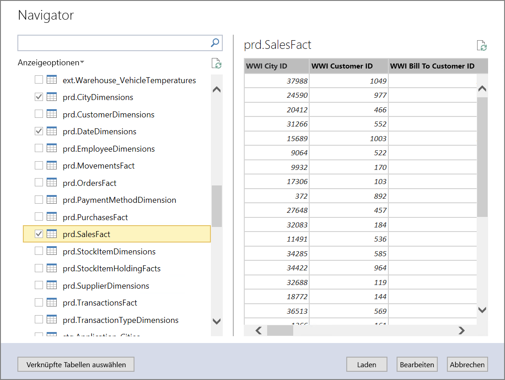
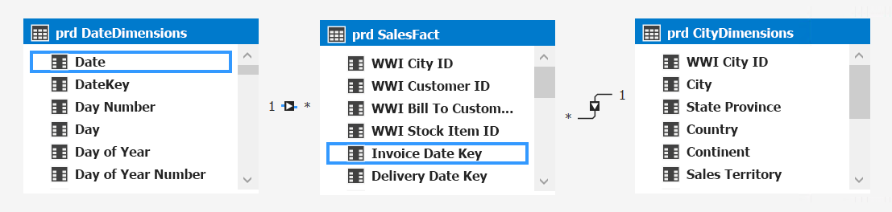
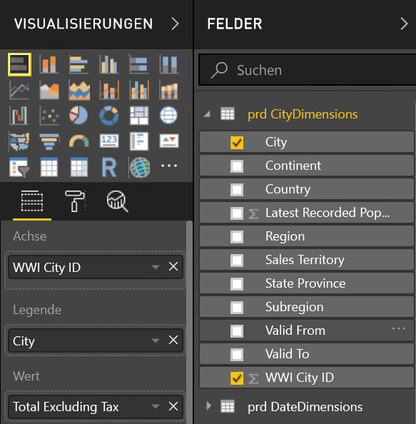
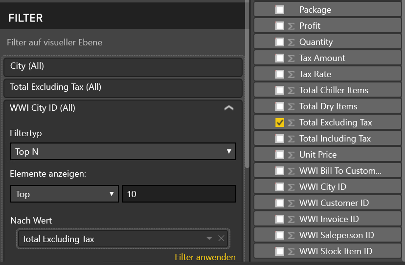
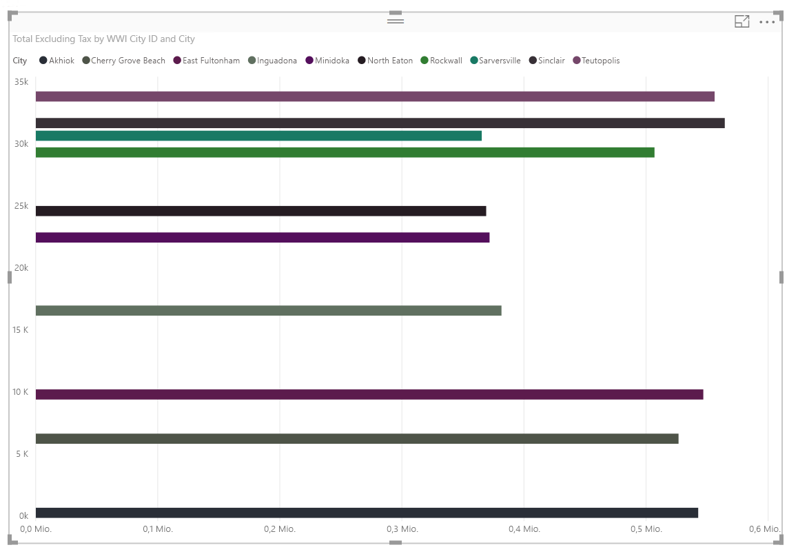

# <a name="enterprise-bi-with-sql-data-warehouse"></a><span data-ttu-id="ea4d3-103">Enterprise BI mit SQL Data Warehouse</span><span class="sxs-lookup"><span data-stu-id="ea4d3-103">Enterprise BI with SQL Data Warehouse</span></span>

<span data-ttu-id="ea4d3-104">Diese Referenzarchitektur implementiert eine [ELT](../../data-guide/relational-data/etl.md#extract-load-and-transform-elt)-Pipeline (Extract-Load-Transform), die Daten aus einer lokalen SQL Server-Datenbank in SQL Data Warehouse verschiebt und die Daten für die Analyse transformiert.</span><span class="sxs-lookup"><span data-stu-id="ea4d3-104">This reference architecture implements an [ELT](../../data-guide/relational-data/etl.md#extract-load-and-transform-elt) (extract-load-transform) pipeline that moves data from an on-premises SQL Server database into SQL Data Warehouse and transforms the data for analysis.</span></span> [<span data-ttu-id="ea4d3-105">**So stellen Sie diese Lösung bereit**.</span><span class="sxs-lookup"><span data-stu-id="ea4d3-105">**Deploy this solution**.</span></span>](#deploy-the-solution)


<span data-ttu-id="ea4d3-106">**Szenario**: Ein großes OLTP-Dataset einer Organisation ist in einer SQL Server-Datenbank lokal gespeichert.</span><span class="sxs-lookup"><span data-stu-id="ea4d3-106">**Scenario**: An organization has a large OLTP data set stored in a SQL Server database on premises.</span></span> <span data-ttu-id="ea4d3-107">Die Organisation möchte mittels SQL Data Warehouse eine Analyse mit Power BI ausführen.</span><span class="sxs-lookup"><span data-stu-id="ea4d3-107">The organization wants to use SQL Data Warehouse to perform analysis using Power BI.</span></span> 

<span data-ttu-id="ea4d3-108">Diese Referenzarchitektur ist für einmalige oder bedarfsgesteuerte Aufträge bestimmt.</span><span class="sxs-lookup"><span data-stu-id="ea4d3-108">This reference architecture is designed for one-time or on-demand jobs.</span></span> <span data-ttu-id="ea4d3-109">Wenn Sie fortlaufend (stündlich oder täglich) Daten verschieben müssen, sollten Sie mit Azure Data Factory einen automatisierten Workflow definieren.</span><span class="sxs-lookup"><span data-stu-id="ea4d3-109">If you need to move data on a continuing basis (hourly or daily), we recommend using Azure Data Factory to define an automated workflow.</span></span> <span data-ttu-id="ea4d3-110">Eine Referenzarchitektur, die Data Factory verwendet, finden Sie unter [Automatisierte Enterprise BI-Instanz mit SQL Data Warehouse und Azure Data Factory](./enterprise-bi-adf.md).</span><span class="sxs-lookup"><span data-stu-id="ea4d3-110">For a reference architecture that uses Data Factory, see [Automated enterprise BI with SQL Data Warehouse and Azure Data Factory](./enterprise-bi-adf.md).</span></span>

## <a name="architecture"></a><span data-ttu-id="ea4d3-111">Architecture</span><span class="sxs-lookup"><span data-stu-id="ea4d3-111">Architecture</span></span>

<span data-ttu-id="ea4d3-112">Die Architektur umfasst die folgenden Komponenten.</span><span class="sxs-lookup"><span data-stu-id="ea4d3-112">The architecture consists of the following components.</span></span>

### <a name="data-source"></a><span data-ttu-id="ea4d3-113">Datenquelle</span><span class="sxs-lookup"><span data-stu-id="ea4d3-113">Data source</span></span>

<span data-ttu-id="ea4d3-114">**SQL Server**.</span><span class="sxs-lookup"><span data-stu-id="ea4d3-114">**SQL Server**.</span></span> <span data-ttu-id="ea4d3-115">Die Quelldaten befinden sich in einer lokalen SQL Server-Datenbank.</span><span class="sxs-lookup"><span data-stu-id="ea4d3-115">The source data is located in a SQL Server database on premises.</span></span> <span data-ttu-id="ea4d3-116">Um die lokale Umgebung zu simulieren, stellen die Bereitstellungsskripts für diese Architektur einen virtuellen Computer in Azure bereit, auf dem SQL Server installiert ist.</span><span class="sxs-lookup"><span data-stu-id="ea4d3-116">To simulate the on-premises environment, the deployment scripts for this architecture provision a VM in Azure with SQL Server installed.</span></span> <span data-ttu-id="ea4d3-117">Die [OLTP-Beispieldatenbank von Wide World Importers][wwi] wird als Datenquelle verwendet.</span><span class="sxs-lookup"><span data-stu-id="ea4d3-117">The [Wide World Importers OLTP sample database][wwi] is used as the source data.</span></span>

### <a name="ingestion-and-data-storage"></a><span data-ttu-id="ea4d3-118">Erfassung und Datenspeicherung</span><span class="sxs-lookup"><span data-stu-id="ea4d3-118">Ingestion and data storage</span></span>

<span data-ttu-id="ea4d3-119">**Blobspeicher**.</span><span class="sxs-lookup"><span data-stu-id="ea4d3-119">**Blob Storage**.</span></span> <span data-ttu-id="ea4d3-120">Blobspeicher wird als Stagingbereich zum Kopieren der Daten vor dem Laden in SQL Data Warehouse verwendet.</span><span class="sxs-lookup"><span data-stu-id="ea4d3-120">Blob storage is used as a staging area to copy the data before loading it into SQL Data Warehouse.</span></span>

<span data-ttu-id="ea4d3-121">**Azure SQL Data Warehouse**.</span><span class="sxs-lookup"><span data-stu-id="ea4d3-121">**Azure SQL Data Warehouse**.</span></span> <span data-ttu-id="ea4d3-122">[SQL Data Warehouse](/azure/sql-data-warehouse/) ist ein verteiltes System für die Analyse großer Datenmengen.</span><span class="sxs-lookup"><span data-stu-id="ea4d3-122">[SQL Data Warehouse](/azure/sql-data-warehouse/) is a distributed system designed to perform analytics on large data.</span></span> <span data-ttu-id="ea4d3-123">Es unterstützt massive Parallelverarbeitung (Massive Parallel Processing, MPP), die die Ausführung von Hochleistungsanalysen ermöglicht.</span><span class="sxs-lookup"><span data-stu-id="ea4d3-123">It supports massive parallel processing (MPP), which makes it suitable for running high-performance analytics.</span></span> 

### <a name="analysis-and-reporting"></a><span data-ttu-id="ea4d3-124">Analysen und Berichte</span><span class="sxs-lookup"><span data-stu-id="ea4d3-124">Analysis and reporting</span></span>

<span data-ttu-id="ea4d3-125">**Azure Analysis Services**:</span><span class="sxs-lookup"><span data-stu-id="ea4d3-125">**Azure Analysis Services**.</span></span> <span data-ttu-id="ea4d3-126">[Analysis Services](/azure/analysis-services/) ist ein vollständig verwalteter Dienst, der Datenmodellierungsfunktionen ermöglicht.</span><span class="sxs-lookup"><span data-stu-id="ea4d3-126">[Analysis Services](/azure/analysis-services/) is a fully managed service that provides data modeling capabilities.</span></span> <span data-ttu-id="ea4d3-127">Verwenden Sie Analysis Services zum Erstellen eines semantischen Modells, das Benutzer abfragen können.</span><span class="sxs-lookup"><span data-stu-id="ea4d3-127">Use Analysis Services to create a semantic model that users can query.</span></span> <span data-ttu-id="ea4d3-128">Analysis Services ist in einem Szenario mit BI-Dashboard besonders nützlich.</span><span class="sxs-lookup"><span data-stu-id="ea4d3-128">Analysis Services is especially useful in a BI dashboard scenario.</span></span> <span data-ttu-id="ea4d3-129">In dieser Architektur liest Analysis Services Daten aus dem Data Warehouse, um das semantische Modell zu verarbeiten, und bedient Dashboardabfragen effizient.</span><span class="sxs-lookup"><span data-stu-id="ea4d3-129">In this architecture, Analysis Services reads data from the data warehouse to process the semantic model, and efficiently serves dashboard queries.</span></span> <span data-ttu-id="ea4d3-130">Darüber hinaus unterstützt der Dienst auch die elastische Parallelität durch zentrales Hochskalieren von Replikaten zur schnelleren Abfragenverarbeitung.</span><span class="sxs-lookup"><span data-stu-id="ea4d3-130">It also supports elastic concurrency, by scaling out replicas for faster query processing.</span></span>

<span data-ttu-id="ea4d3-131">Zurzeit unterstützt Azure Analysis Services tabellarische Modelle, aber keine mehrdimensionalen Modelle.</span><span class="sxs-lookup"><span data-stu-id="ea4d3-131">Currently, Azure Analysis Services supports tabular models but not multidimensional models.</span></span> <span data-ttu-id="ea4d3-132">Tabellarische Modelle verwenden relationale Modellierungskonstrukte (Tabellen und Spalten), wohingegen mehrdimensionale Modelle OLAP-Modellierungskonstrukte (Cubes, Dimensionen und Measures) verwenden.</span><span class="sxs-lookup"><span data-stu-id="ea4d3-132">Tabular models use relational modeling constructs (tables and columns), whereas multidimensional models use OLAP modeling constructs (cubes, dimensions, and measures).</span></span> <span data-ttu-id="ea4d3-133">Wenn Sie mehrdimensionale Modelle benötigen, verwenden Sie SQL Server Analysis Services (SSAS).</span><span class="sxs-lookup"><span data-stu-id="ea4d3-133">If you require multidimensional models, use SQL Server Analysis Services (SSAS).</span></span> <span data-ttu-id="ea4d3-134">Weitere Informationen finden Sie unter [Vergleichen von tabellarischen und mehrdimensionalen Lösungen](/sql/analysis-services/comparing-tabular-and-multidimensional-solutions-ssas).</span><span class="sxs-lookup"><span data-stu-id="ea4d3-134">For more information, see [Comparing tabular and multidimensional solutions](/sql/analysis-services/comparing-tabular-and-multidimensional-solutions-ssas).</span></span>

<span data-ttu-id="ea4d3-135">**Power BI**:</span><span class="sxs-lookup"><span data-stu-id="ea4d3-135">**Power BI**.</span></span> <span data-ttu-id="ea4d3-136">Power BI ist eine Suite aus Business Analytics-Tools zum Analysieren von Daten für Einblicke in Geschäftsvorgänge.</span><span class="sxs-lookup"><span data-stu-id="ea4d3-136">Power BI is a suite of business analytics tools to analyze data for business insights.</span></span> <span data-ttu-id="ea4d3-137">In dieser Architektur dient sie zum Abfragen des in Analysis Services gespeicherten semantischen Modells.</span><span class="sxs-lookup"><span data-stu-id="ea4d3-137">In this architecture, it queries the semantic model stored in Analysis Services.</span></span>

### <a name="authentication"></a><span data-ttu-id="ea4d3-138">Authentifizierung</span><span class="sxs-lookup"><span data-stu-id="ea4d3-138">Authentication</span></span>

<span data-ttu-id="ea4d3-139">**Azure Active Directory** (Azure AD) authentifiziert Benutzer, die über Power BI eine Verbindung mit dem Analysis Services-Server herstellen.</span><span class="sxs-lookup"><span data-stu-id="ea4d3-139">**Azure Active Directory** (Azure AD) authenticates users who connect to the Analysis Services server through Power BI.</span></span>

## <a name="data-pipeline"></a><span data-ttu-id="ea4d3-140">Datenpipeline</span><span class="sxs-lookup"><span data-stu-id="ea4d3-140">Data pipeline</span></span>
 
<span data-ttu-id="ea4d3-141">Diese Referenzarchitektur verwendet die Beispieldatenbank [WorldWideImporters](/sql/sample/world-wide-importers/wide-world-importers-oltp-database) als Datenquelle.</span><span class="sxs-lookup"><span data-stu-id="ea4d3-141">This reference architecture uses the [WorldWideImporters](/sql/sample/world-wide-importers/wide-world-importers-oltp-database) sample database as a data source.</span></span> <span data-ttu-id="ea4d3-142">Die Phasen der Datenpipeline sind:</span><span class="sxs-lookup"><span data-stu-id="ea4d3-142">The data pipeline has the following stages:</span></span>

1. <span data-ttu-id="ea4d3-143">Exportieren der Daten aus SQL Server in Flatfiles (BCP-Hilfsprogramm).</span><span class="sxs-lookup"><span data-stu-id="ea4d3-143">Export the data from SQL Server to flat files (bcp utility).</span></span>
2. <span data-ttu-id="ea4d3-144">Kopieren der Flatfiles in Azure Blob Storage (AzCopy).</span><span class="sxs-lookup"><span data-stu-id="ea4d3-144">Copy the flat files to Azure Blob Storage (AzCopy).</span></span>
3. <span data-ttu-id="ea4d3-145">Laden der Daten in SQL Data Warehouse (PolyBase).</span><span class="sxs-lookup"><span data-stu-id="ea4d3-145">Load the data into SQL Data Warehouse (PolyBase).</span></span>
4. <span data-ttu-id="ea4d3-146">Transformieren der Daten in ein Sternschema (T-SQL).</span><span class="sxs-lookup"><span data-stu-id="ea4d3-146">Transform the data into a star schema (T-SQL).</span></span>
5. <span data-ttu-id="ea4d3-147">Laden eines Semantikmodells in Analysis Services (SQL Server Data Tools).</span><span class="sxs-lookup"><span data-stu-id="ea4d3-147">Load a semantic model into Analysis Services (SQL Server Data Tools).</span></span>


 
> [!NOTE]
> <span data-ttu-id="ea4d3-148">Erwägen Sie für die Schritte 1 &ndash; 3 die Verwendung von Redgate Data Platform Studio.</span><span class="sxs-lookup"><span data-stu-id="ea4d3-148">For steps 1 &ndash; 3, consider using Redgate Data Platform Studio.</span></span> <span data-ttu-id="ea4d3-149">Data Platform Studio wendet optimal abgestimmte Kompatibilitätspatches und Optimierungen an und ermöglicht so den schnellsten Einstieg in die Verwendung von SQL Data Warehouse.</span><span class="sxs-lookup"><span data-stu-id="ea4d3-149">Data Platform Studio applies the most appropriate compatibility fixes and optimizations, so it's the quickest way to get started with SQL Data Warehouse.</span></span> <span data-ttu-id="ea4d3-150">Weitere Informationen finden Sie unter [Laden von Daten mit Redgate Data Platform Studio](/azure/sql-data-warehouse/sql-data-warehouse-load-with-redgate).</span><span class="sxs-lookup"><span data-stu-id="ea4d3-150">For more information, see [Load data with Redgate Data Platform Studio](/azure/sql-data-warehouse/sql-data-warehouse-load-with-redgate).</span></span> 

<span data-ttu-id="ea4d3-151">In den folgenden Abschnitten werden diese Phasen ausführlicher beschrieben.</span><span class="sxs-lookup"><span data-stu-id="ea4d3-151">The next sections describe these stages in more detail.</span></span>

### <a name="export-data-from-sql-server"></a><span data-ttu-id="ea4d3-152">Exportieren von Daten aus SQL Server</span><span class="sxs-lookup"><span data-stu-id="ea4d3-152">Export data from SQL Server</span></span>

<span data-ttu-id="ea4d3-153">Das Hilfsprogramm [BCP](/sql/tools/bcp-utility) (Bulk Copy Program) ist eine schnelle Möglichkeit zum Erstellen von Textflatfiles aus SQL-Tabellen.</span><span class="sxs-lookup"><span data-stu-id="ea4d3-153">The [bcp](/sql/tools/bcp-utility) (bulk copy program) utility is a fast way to create flat text files from SQL tables.</span></span> <span data-ttu-id="ea4d3-154">In diesem Schritt wählen Sie die Spalten, die Sie exportieren möchten, jedoch nicht die zu transformierenden Daten.</span><span class="sxs-lookup"><span data-stu-id="ea4d3-154">In this step, you select the columns that you want to export, but don't transform the data.</span></span> <span data-ttu-id="ea4d3-155">Alle Datentransformationen sollten in SQL Data Warehouse erfolgen.</span><span class="sxs-lookup"><span data-stu-id="ea4d3-155">Any data transformations should happen in SQL Data Warehouse.</span></span>

<span data-ttu-id="ea4d3-156">**Empfehlungen**</span><span class="sxs-lookup"><span data-stu-id="ea4d3-156">**Recommendations**</span></span>

<span data-ttu-id="ea4d3-157">Planen Sie die Datenextrahierung nach Möglichkeit außerhalb der Spitzenzeiten, um Ressourcenkonflikte in der Produktionsumgebung zu minimieren.</span><span class="sxs-lookup"><span data-stu-id="ea4d3-157">If possible, schedule data extraction during off-peak hours, to minimize resource contention in the production environment.</span></span> 

<span data-ttu-id="ea4d3-158">Führen Sie BCP nicht auf dem Datenbankserver aus.</span><span class="sxs-lookup"><span data-stu-id="ea4d3-158">Avoid running bcp on the database server.</span></span> <span data-ttu-id="ea4d3-159">Führen Sie BCP stattdessen auf einem anderen Computer aus.</span><span class="sxs-lookup"><span data-stu-id="ea4d3-159">Instead, run it from another machine.</span></span> <span data-ttu-id="ea4d3-160">Schreiben Sie die Dateien auf ein lokales Laufwerk.</span><span class="sxs-lookup"><span data-stu-id="ea4d3-160">Write the files to a local drive.</span></span> <span data-ttu-id="ea4d3-161">Stellen Sie sicher, dass genügend E/A-Ressourcen für gleichzeitige Schreibvorgänge bereitstehen.</span><span class="sxs-lookup"><span data-stu-id="ea4d3-161">Ensure that you have sufficient I/O resources to handle the concurrent writes.</span></span> <span data-ttu-id="ea4d3-162">Um die Leistung zu optimieren, exportieren Sie die Dateien auf dedizierte schnelle Speicherlaufwerke.</span><span class="sxs-lookup"><span data-stu-id="ea4d3-162">For best performance, export the files to dedicated fast storage drives.</span></span>

<span data-ttu-id="ea4d3-163">Sie können die Netzwerkübertragung beschleunigen, indem Sie die exportierten Daten im komprimierten Gzip-Format speichern.</span><span class="sxs-lookup"><span data-stu-id="ea4d3-163">You can speed up the network transfer by saving the exported data in Gzip compressed format.</span></span> <span data-ttu-id="ea4d3-164">Allerdings ist das Laden komprimierter Dateien in Warehouse langsamer als das Laden dekomprimierter Dateien, sodass ein Kompromiss zwischen schneller Netzwerkübertragung und schnellerem Laden getroffen werden muss.</span><span class="sxs-lookup"><span data-stu-id="ea4d3-164">However, loading compressed files into the warehouse is slower than loading uncompressed files, so there is a tradeoff between faster network transfer versus faster loading.</span></span> <span data-ttu-id="ea4d3-165">Wenn Sie die Gzip-Komprimierung verwenden möchten, erstellen Sie keine einzelne Gzip-Datei.</span><span class="sxs-lookup"><span data-stu-id="ea4d3-165">If you decide to use Gzip compression, don't create a single Gzip file.</span></span> <span data-ttu-id="ea4d3-166">Teilen Sie die Daten stattdessen auf mehrere komprimierte Dateien auf.</span><span class="sxs-lookup"><span data-stu-id="ea4d3-166">Instead, split the data into multiple compressed files.</span></span>

### <a name="copy-flat-files-into-blob-storage"></a><span data-ttu-id="ea4d3-167">Kopieren von Flatfiles in Blobspeicher</span><span class="sxs-lookup"><span data-stu-id="ea4d3-167">Copy flat files into blob storage</span></span>

<span data-ttu-id="ea4d3-168">Das Hilfsprogramm [AzCopy](/azure/storage/common/storage-use-azcopy) ist für das Hochleistungskopieren von Daten in den Azure-Blobspeicher bestimmt.</span><span class="sxs-lookup"><span data-stu-id="ea4d3-168">The [AzCopy](/azure/storage/common/storage-use-azcopy) utility is designed for high-performance copying of data into Azure blob storage.</span></span>

<span data-ttu-id="ea4d3-169">**Empfehlungen**</span><span class="sxs-lookup"><span data-stu-id="ea4d3-169">**Recommendations**</span></span>

<span data-ttu-id="ea4d3-170">Erstellen Sie das Speicherkonto in einer Region, die sich in der Nähe des Quelldatenspeicherorts befindet.</span><span class="sxs-lookup"><span data-stu-id="ea4d3-170">Create the storage account in a region near the location of the source data.</span></span> <span data-ttu-id="ea4d3-171">Stellen Sie das Speicherkonto und die SQL Data Warehouse-Instanz in der gleichen Region bereit.</span><span class="sxs-lookup"><span data-stu-id="ea4d3-171">Deploy the storage account and the SQL Data Warehouse instance in the same region.</span></span> 

<span data-ttu-id="ea4d3-172">Führen Sie AzCopy und Ihre Produktionsworkloads nicht auf dem gleichen Computer aus, da CPU- und E/A-Verbrauch die Produktionsworkloads beeinträchtigen können.</span><span class="sxs-lookup"><span data-stu-id="ea4d3-172">Don't run AzCopy on the same machine that runs your production workloads, because the CPU and I/O consumption can interfere with the production workload.</span></span> 

<span data-ttu-id="ea4d3-173">Testen Sie den Upload zuerst, um die Uploadgeschwindigkeit zu ermitteln.</span><span class="sxs-lookup"><span data-stu-id="ea4d3-173">Test the upload first to see what the upload speed is like.</span></span> <span data-ttu-id="ea4d3-174">Sie können in AzCopy mit der Option „/NC“ die Anzahl der gleichzeitigen Kopiervorgänge angeben.</span><span class="sxs-lookup"><span data-stu-id="ea4d3-174">You can use the /NC option in AzCopy to specify the number of concurrent copy operations.</span></span> <span data-ttu-id="ea4d3-175">Beginnen Sie mit dem Standardwert, und experimentieren Sie mit dieser Einstellung, um die Leistung zu optimieren.</span><span class="sxs-lookup"><span data-stu-id="ea4d3-175">Start with the default value, then experiment with this setting to tune the performance.</span></span> <span data-ttu-id="ea4d3-176">In einer Umgebung mit geringer Bandbreite können zu viele gleichzeitige Vorgänge die Netzwerkverbindung überlasten, sodass die Vorgänge nicht erfolgreich abgeschlossen werden können.</span><span class="sxs-lookup"><span data-stu-id="ea4d3-176">In a low-bandwidth environment, too many concurrent operations can overwhelm the network connection and prevent the operations from completing successfully.</span></span>  

<span data-ttu-id="ea4d3-177">AZCopy verschiebt Daten über das öffentliche Internet in den Speicher.</span><span class="sxs-lookup"><span data-stu-id="ea4d3-177">AzCopy moves data to storage over the public internet.</span></span> <span data-ttu-id="ea4d3-178">Wenn dies nicht schnell genug ist, sollten Sie die Einrichtung einer [ExpressRoute](/azure/expressroute/)-Verbindung erwägen.</span><span class="sxs-lookup"><span data-stu-id="ea4d3-178">If this isn't fast enough, consider setting up an [ExpressRoute](/azure/expressroute/) circuit.</span></span> <span data-ttu-id="ea4d3-179">ExpressRoute ist ein Dienst, der Ihre Daten über eine dedizierte private Verbindung zu Azure weiterleitet.</span><span class="sxs-lookup"><span data-stu-id="ea4d3-179">ExpressRoute is a service that routes your data through a dedicated private connection to Azure.</span></span> <span data-ttu-id="ea4d3-180">Wenn Ihre Netzwerkverbindung zu langsam ist, können Sie die Daten auch physisch auf einem Datenträger an ein Azure-Rechenzentrum senden.</span><span class="sxs-lookup"><span data-stu-id="ea4d3-180">Another option, if your network connection is too slow, is to physically ship the data on disk to an Azure datacenter.</span></span> <span data-ttu-id="ea4d3-181">Weitere Informationen finden Sie unter [Übertragen von Daten in und aus Azure](/azure/architecture/data-guide/scenarios/data-transfer).</span><span class="sxs-lookup"><span data-stu-id="ea4d3-181">For more information, see [Transferring data to and from Azure](/azure/architecture/data-guide/scenarios/data-transfer).</span></span>

<span data-ttu-id="ea4d3-182">Während eines Kopiervorgangs erstellt AzCopy eine temporäre Journaldatei, mit der AzCopy den Vorgang bei einer Unterbrechung (z.B. aufgrund eines Netzwerkfehlers) neu starten kann.</span><span class="sxs-lookup"><span data-stu-id="ea4d3-182">During a copy operation, AzCopy creates a temporary journal file, which enables AzCopy to restart the operation if it gets interrupted (for example, due to a network error).</span></span> <span data-ttu-id="ea4d3-183">Stellen Sie sicher, dass auf dem Datenträger genügend Speicherplatz zum Speichern der Journaldateien vorhanden ist.</span><span class="sxs-lookup"><span data-stu-id="ea4d3-183">Make sure there is enough disk space to store the journal files.</span></span> <span data-ttu-id="ea4d3-184">Mit der Option „/Z“ können Sie angeben, wohin die Journaldateien geschrieben werden.</span><span class="sxs-lookup"><span data-stu-id="ea4d3-184">You can use the /Z option to specify where the journal files are written.</span></span>

### <a name="load-data-into-sql-data-warehouse"></a><span data-ttu-id="ea4d3-185">Laden von Daten in SQL Data Warehouse</span><span class="sxs-lookup"><span data-stu-id="ea4d3-185">Load data into SQL Data Warehouse</span></span>

<span data-ttu-id="ea4d3-186">Laden Sie die Dateien mit [PolyBase](/sql/relational-databases/polybase/polybase-guide) aus dem Blobspeicher in das Data Warehouse.</span><span class="sxs-lookup"><span data-stu-id="ea4d3-186">Use [PolyBase](/sql/relational-databases/polybase/polybase-guide) to load the files from blob storage into the data warehouse.</span></span> <span data-ttu-id="ea4d3-187">PolyBase ist dafür ausgelegt, die MPP-Architektur (Massively Parallel Processing) von SQL Data Warehouse zu nutzen, und bietet damit die schnellste Möglichkeit, Daten in SQL Data Warehouse zu laden.</span><span class="sxs-lookup"><span data-stu-id="ea4d3-187">PolyBase is designed to leverage the MPP (Massively Parallel Processing) architecture of SQL Data Warehouse, which makes it the fastest way to load data into SQL Data Warehouse.</span></span> 

<span data-ttu-id="ea4d3-188">Das Laden der Daten ist ein zweistufiger Prozess:</span><span class="sxs-lookup"><span data-stu-id="ea4d3-188">Loading the data is a two-step process:</span></span>

1. <span data-ttu-id="ea4d3-189">Erstellen eines Satzes externer Tabellen für die Daten.</span><span class="sxs-lookup"><span data-stu-id="ea4d3-189">Create a set of external tables for the data.</span></span> <span data-ttu-id="ea4d3-190">Eine externe Tabelle ist eine Tabellendefinition, die auf außerhalb des Warehouse gespeicherte Daten zeigt &mdash; in diesem Fall die Flatfiles im Blobspeicher.</span><span class="sxs-lookup"><span data-stu-id="ea4d3-190">An external table is a table definition that points to data stored outside of the warehouse &mdash; in this case, the flat files in blob storage.</span></span> <span data-ttu-id="ea4d3-191">Dieser Schritt verschiebt keine Daten in das Warehouse.</span><span class="sxs-lookup"><span data-stu-id="ea4d3-191">This step does not move any data into the warehouse.</span></span>
2. <span data-ttu-id="ea4d3-192">Erstellen von Stagingtabellen und Laden der Daten in die Stagingtabellen.</span><span class="sxs-lookup"><span data-stu-id="ea4d3-192">Create staging tables, and load the data into the staging tables.</span></span> <span data-ttu-id="ea4d3-193">Dieser Schritt kopiert die Daten in das Warehouse.</span><span class="sxs-lookup"><span data-stu-id="ea4d3-193">This step copies the data into the warehouse.</span></span>

<span data-ttu-id="ea4d3-194">**Empfehlungen**</span><span class="sxs-lookup"><span data-stu-id="ea4d3-194">**Recommendations**</span></span>

<span data-ttu-id="ea4d3-195">Sie sollten SQL Data Warehouse verwenden, wenn Sie große Datenmengen (mehr als 1 TB) haben und eine Analyseworkload ausführen, die von der Parallelität profitiert.</span><span class="sxs-lookup"><span data-stu-id="ea4d3-195">Consider SQL Data Warehouse when you have large amounts of data (more than 1 TB) and are running an analytics workload that will benefit from parallelism.</span></span> <span data-ttu-id="ea4d3-196">SQL Data Warehouse ist nicht ideal für OLTP-Workloads oder kleinere Datasets (< 250GB).</span><span class="sxs-lookup"><span data-stu-id="ea4d3-196">SQL Data Warehouse is not a good fit for OLTP workloads or smaller data sets (< 250GB).</span></span> <span data-ttu-id="ea4d3-197">Verwenden Sie für Datasets unter 250GB Azure SQL-Datenbank oder SQL Server.</span><span class="sxs-lookup"><span data-stu-id="ea4d3-197">For data sets less than 250GB, consider Azure SQL Database or SQL Server.</span></span> <span data-ttu-id="ea4d3-198">Weitere Informationen finden Sie unter [Data Warehousing und Data Marts](../../data-guide/relational-data/data-warehousing.md).</span><span class="sxs-lookup"><span data-stu-id="ea4d3-198">For more information, see [Data warehousing](../../data-guide/relational-data/data-warehousing.md).</span></span>

<span data-ttu-id="ea4d3-199">Erstellen Sie die Stagingtabellen als Heaptabellen, die nicht indiziert werden.</span><span class="sxs-lookup"><span data-stu-id="ea4d3-199">Create the staging tables as heap tables, which are not indexed.</span></span> <span data-ttu-id="ea4d3-200">Die Abfragen, die die Produktionstabellen erstellen, resultieren in einem vollständigen Tabellenscan, sodass die Stagingtabellen nicht Indiziert werden müssen.</span><span class="sxs-lookup"><span data-stu-id="ea4d3-200">The queries that create the production tables will result in a full table scan, so there is no reason to index the staging tables.</span></span>

<span data-ttu-id="ea4d3-201">PolyBase nutzt automatisch die Vorteile der Parallelität im Warehouse.</span><span class="sxs-lookup"><span data-stu-id="ea4d3-201">PolyBase automatically takes advantage of parallelism in the warehouse.</span></span> <span data-ttu-id="ea4d3-202">Die Ladeleistung wird skaliert, indem Sie die DWUs heraufsetzen.</span><span class="sxs-lookup"><span data-stu-id="ea4d3-202">The load performance scales as you increase DWUs.</span></span> <span data-ttu-id="ea4d3-203">Die beste Leistung erzielen Sie mit einem einzelnen Ladevorgang.</span><span class="sxs-lookup"><span data-stu-id="ea4d3-203">For best performance, use a single load operation.</span></span> <span data-ttu-id="ea4d3-204">Die Aufteilung der Eingabedaten in Blöcke und das Ausführen mehrerer paralleler Ladevorgänge bringt keinen Leistungsvorteil.</span><span class="sxs-lookup"><span data-stu-id="ea4d3-204">There is no performance benefit to breaking the input data into chunks and running multiple concurrent loads.</span></span>

<span data-ttu-id="ea4d3-205">PolyBase kann mit GZip komprimierte Dateien lesen.</span><span class="sxs-lookup"><span data-stu-id="ea4d3-205">PolyBase can read Gzip compressed files.</span></span> <span data-ttu-id="ea4d3-206">Allerdings wird nur ein einziger Leser pro komprimierter Datei verwendet, weil das Dekomprimieren der Datei ein Singlethread-Vorgang ist.</span><span class="sxs-lookup"><span data-stu-id="ea4d3-206">However, only a single reader is used per compressed file, because uncompressing the file is a single-threaded operation.</span></span> <span data-ttu-id="ea4d3-207">Vermeiden Sie daher, eine einzelne große komprimierte Datei zu laden.</span><span class="sxs-lookup"><span data-stu-id="ea4d3-207">Therefore, avoid loading a single large compressed file.</span></span> <span data-ttu-id="ea4d3-208">Teilen Sie die Daten stattdessen in mehrere komprimierte Dateien auf, um den Vorteil der Parallelität zu nutzen.</span><span class="sxs-lookup"><span data-stu-id="ea4d3-208">Instead, split the data into multiple compressed files, in order to take advantage of parallelism.</span></span> 

<span data-ttu-id="ea4d3-209">Bedenken Sie dabei folgende Einschränkungen:</span><span class="sxs-lookup"><span data-stu-id="ea4d3-209">Be aware of the following limitations:</span></span>

- <span data-ttu-id="ea4d3-210">PolyBase unterstützt eine maximale Spaltengröße von `varchar(8000)`, `nvarchar(4000)` oder `varbinary(8000)`.</span><span class="sxs-lookup"><span data-stu-id="ea4d3-210">PolyBase supports a maximum column size of `varchar(8000)`, `nvarchar(4000)`, or `varbinary(8000)`.</span></span> <span data-ttu-id="ea4d3-211">Wenn Ihre Daten diese Grenzen überschreiten, können Sie die Daten in Blöcke unterteilen, wenn Sie sie exportieren, und die Blöcke nach dem Import wieder zusammensetzen.</span><span class="sxs-lookup"><span data-stu-id="ea4d3-211">If you have data that exceeds these limits, one option is to break the data up into chunks when you export it, and then reassemble the chunks after import.</span></span> 

- <span data-ttu-id="ea4d3-212">PolyBase verwendet das feste Zeilenabschlusszeichen „\n“ oder einen Zeilenvorschub.</span><span class="sxs-lookup"><span data-stu-id="ea4d3-212">PolyBase uses a fixed row terminator of \n or newline.</span></span> <span data-ttu-id="ea4d3-213">Dies kann Probleme verursachen, wenn das Zeilenumbruchzeichen in den Quelldaten vorkommt.</span><span class="sxs-lookup"><span data-stu-id="ea4d3-213">This can cause problems if newline characters appear in the source data.</span></span>

- <span data-ttu-id="ea4d3-214">Ihr Quelldatenschema könnte Datentypen enthalten, die in SQL Data Warehouse nicht unterstützt werden.</span><span class="sxs-lookup"><span data-stu-id="ea4d3-214">Your source data schema might contain data types that are not supported in SQL Data Warehouse.</span></span>

<span data-ttu-id="ea4d3-215">Um diese Einschränkungen zu umgehen, können Sie eine gespeicherte Prozedur erstellen, die die erforderlichen Konvertierungen ausführt.</span><span class="sxs-lookup"><span data-stu-id="ea4d3-215">To work around these limitations, you can create a stored procedure that performs the necessary conversions.</span></span> <span data-ttu-id="ea4d3-216">Verweisen Sie auf diese gespeicherte Prozedur, wenn Sie BCP ausführen.</span><span class="sxs-lookup"><span data-stu-id="ea4d3-216">Reference this stored procedure when you run bcp.</span></span> <span data-ttu-id="ea4d3-217">Alternativ konvertiert [Redgate Data Platform Studio](/azure/sql-data-warehouse/sql-data-warehouse-load-with-redgate) automatisch Datentypen, die in SQL Data Warehouse nicht unterstützt werden.</span><span class="sxs-lookup"><span data-stu-id="ea4d3-217">Alternatively, [Redgate Data Platform Studio](/azure/sql-data-warehouse/sql-data-warehouse-load-with-redgate) automatically converts data types that aren’t supported in SQL Data Warehouse.</span></span>

<span data-ttu-id="ea4d3-218">Weitere Informationen finden Sie in den folgenden Artikeln:</span><span class="sxs-lookup"><span data-stu-id="ea4d3-218">For more information, see the following articles:</span></span>

- <span data-ttu-id="ea4d3-219">[Bewährte Methoden zum Laden von Daten in Azure SQL Data Warehouse](/azure/sql-data-warehouse/guidance-for-loading-data)</span><span class="sxs-lookup"><span data-stu-id="ea4d3-219">[Best practices for loading data into Azure SQL Data Warehouse](/azure/sql-data-warehouse/guidance-for-loading-data).</span></span>
- [<span data-ttu-id="ea4d3-220">Migrieren Ihrer Schemas nach SQL Data Warehouse</span><span class="sxs-lookup"><span data-stu-id="ea4d3-220">Migrate your schemas to SQL Data Warehouse</span></span>](/azure/sql-data-warehouse/sql-data-warehouse-migrate-schema)
- [<span data-ttu-id="ea4d3-221">Leitfaden zum Definieren von Datentypen für Tabellen in SQL Data Warehouse</span><span class="sxs-lookup"><span data-stu-id="ea4d3-221">Guidance for defining data types for tables in SQL Data Warehouse</span></span>](/azure/sql-data-warehouse/sql-data-warehouse-tables-data-types)

### <a name="transform-the-data"></a><span data-ttu-id="ea4d3-222">Transformieren der Daten</span><span class="sxs-lookup"><span data-stu-id="ea4d3-222">Transform the data</span></span>

<span data-ttu-id="ea4d3-223">Transformieren Sie die Daten, und verschieben Sie sie in Produktionstabellen.</span><span class="sxs-lookup"><span data-stu-id="ea4d3-223">Transform the data and move it into production tables.</span></span> <span data-ttu-id="ea4d3-224">In diesem Schritt werden die Daten in ein Sternschema mit Dimensions- und Faktentabellen umgewandelt, sodass sie für die semantische Modellierung geeignet sind.</span><span class="sxs-lookup"><span data-stu-id="ea4d3-224">In this step, the data is transformed into a star schema with dimension tables and fact tables, suitable for semantic modeling.</span></span>

<span data-ttu-id="ea4d3-225">Erstellen Sie die Produktionstabellen mit gruppierten Columnstore-Indizes, die beste Abfragegesamtleistung bieten.</span><span class="sxs-lookup"><span data-stu-id="ea4d3-225">Create the production tables with clustered columnstore indexes, which offer the best overall query performance.</span></span> <span data-ttu-id="ea4d3-226">Columnstore-Indizes sind für Abfragen optimiert, die viele Datensätze überprüfen.</span><span class="sxs-lookup"><span data-stu-id="ea4d3-226">Columnstore indexes are optimized for queries that scan many records.</span></span> <span data-ttu-id="ea4d3-227">Columnstore-Indizes sind nicht für Singleton-Suchvorgänge (d.h. Suchen in einer einzelnen Zeile) geeignet.</span><span class="sxs-lookup"><span data-stu-id="ea4d3-227">Columnstore indexes don't perform as well for singleton lookups (that is, looking up a single row).</span></span> <span data-ttu-id="ea4d3-228">Wenn Sie häufig Singleton-Suchvorgänge ausführen müssen, können Sie einen nicht gruppierten Index einer Tabelle hinzufügen.</span><span class="sxs-lookup"><span data-stu-id="ea4d3-228">If you need to perform frequent singleton lookups, you can add a non-clustered index to a table.</span></span> <span data-ttu-id="ea4d3-229">Singleton-Suchvorgänge können mit einem nicht gruppierten Index erheblich schneller ausgeführt werden.</span><span class="sxs-lookup"><span data-stu-id="ea4d3-229">Singleton lookups can run significantly faster using a non-clustered index.</span></span> <span data-ttu-id="ea4d3-230">Jedoch sind Singleton-Suchvorgänge in der Regel in Data Warehouse-Szenarien weniger gebräuchlich als OLTP-Workloads.</span><span class="sxs-lookup"><span data-stu-id="ea4d3-230">However, singleton lookups are typically less common in data warehouse scenarios than OLTP workloads.</span></span> <span data-ttu-id="ea4d3-231">Weitere Informationen finden Sie unter [Indizieren von Tabellen in SQL Data Warehouse](/azure/sql-data-warehouse/sql-data-warehouse-tables-index).</span><span class="sxs-lookup"><span data-stu-id="ea4d3-231">For more information, see [Indexing tables in SQL Data Warehouse](/azure/sql-data-warehouse/sql-data-warehouse-tables-index).</span></span>

> [!NOTE]
> <span data-ttu-id="ea4d3-232">Gruppierte Columnstore-Tabellen unterstützen nicht die Datentypen `varchar(max)`, `nvarchar(max)` oder `varbinary(max)`.</span><span class="sxs-lookup"><span data-stu-id="ea4d3-232">Clustered columnstore tables do not support `varchar(max)`, `nvarchar(max)`, or `varbinary(max)` data types.</span></span> <span data-ttu-id="ea4d3-233">Ziehen Sie in diesem Fall einen Heap- oder gruppierten Index in Erwägung.</span><span class="sxs-lookup"><span data-stu-id="ea4d3-233">In that case, consider a heap or clustered index.</span></span> <span data-ttu-id="ea4d3-234">Sie können diese Spalten in eine separate Tabelle einfügen.</span><span class="sxs-lookup"><span data-stu-id="ea4d3-234">You might put those columns into a separate table.</span></span>

<span data-ttu-id="ea4d3-235">Da die Beispieldatenbank nicht sehr groß ist, haben wir replizierte Tabellen ohne Partitionen erstellt.</span><span class="sxs-lookup"><span data-stu-id="ea4d3-235">Because the sample database is not very large, we created replicated tables with no partitions.</span></span> <span data-ttu-id="ea4d3-236">Bei Produktionsworkloads verbessert die Verwendung von verteilten Tabellen wahrscheinlich die Abfrageleistung.</span><span class="sxs-lookup"><span data-stu-id="ea4d3-236">For production workloads, using distributed tables is likely to improve query performance.</span></span> <span data-ttu-id="ea4d3-237">Siehe [Leitfaden für das Entwerfen verteilter Tabellen in Azure SQL Data Warehouse](/azure/sql-data-warehouse/sql-data-warehouse-tables-distribute).</span><span class="sxs-lookup"><span data-stu-id="ea4d3-237">See [Guidance for designing distributed tables in Azure SQL Data Warehouse](/azure/sql-data-warehouse/sql-data-warehouse-tables-distribute).</span></span> <span data-ttu-id="ea4d3-238">Unsere Beispielskripts führen die Abfragen mithilfe einer statischen [Ressourcenklasse](/azure/sql-data-warehouse/resource-classes-for-workload-management) aus.</span><span class="sxs-lookup"><span data-stu-id="ea4d3-238">Our example scripts run the queries using a static [resource class](/azure/sql-data-warehouse/resource-classes-for-workload-management).</span></span>

### <a name="load-the-semantic-model"></a><span data-ttu-id="ea4d3-239">Laden des semantischen Modells</span><span class="sxs-lookup"><span data-stu-id="ea4d3-239">Load the semantic model</span></span>

<span data-ttu-id="ea4d3-240">Laden Sie die Daten in ein tabellarisches Modell in Azure Analysis Services.</span><span class="sxs-lookup"><span data-stu-id="ea4d3-240">Load the data into a tabular model in Azure Analysis Services.</span></span> <span data-ttu-id="ea4d3-241">In diesem Schritt erstellen Sie ein semantisches Datenmodell mithilfe von SQL Server Data Tools (SSDT).</span><span class="sxs-lookup"><span data-stu-id="ea4d3-241">In this step, you create a semantic data model by using SQL Server Data Tools (SSDT).</span></span> <span data-ttu-id="ea4d3-242">Sie können auch ein Modell erstellen, indem Sie es aus einer Power BI Desktop-Datei importieren.</span><span class="sxs-lookup"><span data-stu-id="ea4d3-242">You can also create a model by importing it from a Power BI Desktop file.</span></span> <span data-ttu-id="ea4d3-243">Da SQL Data Warehouse keine Fremdschlüssel unterstützt, müssen Sie dem Semantikmodell die Beziehungen hinzufügen, damit Sie eine tabellenübergreifende Verknüpfung durchführen können.</span><span class="sxs-lookup"><span data-stu-id="ea4d3-243">Because SQL Data Warehouse does not support foreign keys, you must add the relationships to the semantic model, so that you can join across tables.</span></span>

### <a name="use-power-bi-to-visualize-the-data"></a><span data-ttu-id="ea4d3-244">Verwenden von Power BI zum Visualisieren von Daten</span><span class="sxs-lookup"><span data-stu-id="ea4d3-244">Use Power BI to visualize the data</span></span>

<span data-ttu-id="ea4d3-245">Power BI unterstützt zwei Optionen zum Herstellen einer Verbindung mit Azure Analysis Services:</span><span class="sxs-lookup"><span data-stu-id="ea4d3-245">Power BI supports two options for connecting to Azure Analysis Services:</span></span>

- <span data-ttu-id="ea4d3-246">Importieren.</span><span class="sxs-lookup"><span data-stu-id="ea4d3-246">Import.</span></span> <span data-ttu-id="ea4d3-247">Die Daten werden in das Power BI-Modell importiert.</span><span class="sxs-lookup"><span data-stu-id="ea4d3-247">The data is imported into the Power BI model.</span></span>
- <span data-ttu-id="ea4d3-248">Liveverbindung.</span><span class="sxs-lookup"><span data-stu-id="ea4d3-248">Live Connection.</span></span> <span data-ttu-id="ea4d3-249">Daten werden direkt per Pull aus Analysis Services abgerufen.</span><span class="sxs-lookup"><span data-stu-id="ea4d3-249">Data is pulled directly from Analysis Services.</span></span>

<span data-ttu-id="ea4d3-250">Verwenden Sie die Liveverbindung, da sie kein Kopieren von Daten in das Power BI-Modell erfordert.</span><span class="sxs-lookup"><span data-stu-id="ea4d3-250">We recommend Live Connection because it doesn't require copying data into the Power BI model.</span></span> <span data-ttu-id="ea4d3-251">Auch stellt die Verwendung von DirectQuery sicher, dass die Ergebnisse immer mit den neuesten Quelldaten konsistent sind.</span><span class="sxs-lookup"><span data-stu-id="ea4d3-251">Also, using DirectQuery ensures that results are always consistent with the latest source data.</span></span> <span data-ttu-id="ea4d3-252">Weitere Informationen finden Sie unter [Herstellen einer Verbindung mit Power BI](/azure/analysis-services/analysis-services-connect-pbi).</span><span class="sxs-lookup"><span data-stu-id="ea4d3-252">For more information, see [Connect with Power BI](/azure/analysis-services/analysis-services-connect-pbi).</span></span>

<span data-ttu-id="ea4d3-253">**Empfehlungen**</span><span class="sxs-lookup"><span data-stu-id="ea4d3-253">**Recommendations**</span></span>

<span data-ttu-id="ea4d3-254">Vermeiden Sie, BI-Dashboardabfragen direkt im Data Warehouse auszuführen.</span><span class="sxs-lookup"><span data-stu-id="ea4d3-254">Avoid running BI dashboard queries directly against the data warehouse.</span></span> <span data-ttu-id="ea4d3-255">BI-Dashboards erfordern sehr kurze Antwortzeiten, die direkte Warehouse-Abfragen möglicherweise nicht leisten können.</span><span class="sxs-lookup"><span data-stu-id="ea4d3-255">BI dashboards require very low response times, which direct queries against the warehouse may be unable to satisfy.</span></span> <span data-ttu-id="ea4d3-256">Darüber hinaus schränkt das Aktualisieren des Dashboards die Anzahl gleichzeitiger Abfragen ein, was sich auf die Leistung auswirken könnte.</span><span class="sxs-lookup"><span data-stu-id="ea4d3-256">Also, refreshing the dashboard will count against the number of concurrent queries, which could impact performance.</span></span> 

<span data-ttu-id="ea4d3-257">Azure Analysis Services dient zum Behandeln der Abfrageanforderungen eines BI-Dashboards, daher ist die empfohlene Vorgehensweise die Abfrage von Analysis Services über Power BI.</span><span class="sxs-lookup"><span data-stu-id="ea4d3-257">Azure Analysis Services is designed to handle the query requirements of a BI dashboard, so the recommended practice is to query Analysis Services from Power BI.</span></span>

## <a name="scalability-considerations"></a><span data-ttu-id="ea4d3-258">Überlegungen zur Skalierbarkeit</span><span class="sxs-lookup"><span data-stu-id="ea4d3-258">Scalability considerations</span></span>

### <a name="sql-data-warehouse"></a><span data-ttu-id="ea4d3-259">SQL Data Warehouse</span><span class="sxs-lookup"><span data-stu-id="ea4d3-259">SQL Data Warehouse</span></span>

<span data-ttu-id="ea4d3-260">Sie können mit SQL Data Warehouse Serverressourcen bedarfsabhängig horizontal hochskalieren.</span><span class="sxs-lookup"><span data-stu-id="ea4d3-260">With SQL Data Warehouse, you can scale out your compute resources on demand.</span></span> <span data-ttu-id="ea4d3-261">Das Abfragemodul optimiert Abfragen für die parallele Verarbeitung basierend auf der Anzahl von Serverknoten und verschiebt Daten nach Bedarf zwischen Knoten.</span><span class="sxs-lookup"><span data-stu-id="ea4d3-261">The query engine optimizes queries for parallel processing based on the number of compute nodes, and moves data between nodes as necessary.</span></span> <span data-ttu-id="ea4d3-262">Weitere Informationen finden Sie unter [Verwalten von Computeressourcen in Azure SQL Data Warehouse](/azure/sql-data-warehouse/sql-data-warehouse-manage-compute-overview).</span><span class="sxs-lookup"><span data-stu-id="ea4d3-262">For more information, see [Manage compute in Azure SQL Data Warehouse](/azure/sql-data-warehouse/sql-data-warehouse-manage-compute-overview).</span></span>

### <a name="analysis-services"></a><span data-ttu-id="ea4d3-263">Analysis Services</span><span class="sxs-lookup"><span data-stu-id="ea4d3-263">Analysis Services</span></span>

<span data-ttu-id="ea4d3-264">Bei Produktionsworkloads sollten Sie den Standard-Tarif für Azure Analysis Services nutzen, da er Partitionierung und DirectQuery unterstützt.</span><span class="sxs-lookup"><span data-stu-id="ea4d3-264">For production workloads, we recommend the Standard Tier for Azure Analysis Services, because it supports partitioning and DirectQuery.</span></span> <span data-ttu-id="ea4d3-265">Innerhalb eines Tarifs bestimmt die Größe der Instanz Arbeitsspeicher und Verarbeitungsleistung.</span><span class="sxs-lookup"><span data-stu-id="ea4d3-265">Within a tier, the instance size determines the memory and processing power.</span></span> <span data-ttu-id="ea4d3-266">Die Verarbeitungsleistung wird in Query Processing Units (QPUs) gemessen.</span><span class="sxs-lookup"><span data-stu-id="ea4d3-266">Processing power is measured in Query Processing Units (QPUs).</span></span> <span data-ttu-id="ea4d3-267">Beobachten Sie Ihre QPU-Nutzung, um die geeignete Größe auszuwählen.</span><span class="sxs-lookup"><span data-stu-id="ea4d3-267">Monitor your QPU usage to select the appropriate size.</span></span> <span data-ttu-id="ea4d3-268">Weitere Informationen finden Sie unter [Überwachen von Servermetriken](/azure/analysis-services/analysis-services-monitor).</span><span class="sxs-lookup"><span data-stu-id="ea4d3-268">For more information, see [Monitor server metrics](/azure/analysis-services/analysis-services-monitor).</span></span>

<span data-ttu-id="ea4d3-269">Bei hoher Last kann die Abfrageleistung durch parallele Abfragen beeinträchtigt werden.</span><span class="sxs-lookup"><span data-stu-id="ea4d3-269">Under high load, query performance can become degraded due to query concurrency.</span></span> <span data-ttu-id="ea4d3-270">Sie können Analysis Services horizontal hochskalieren, indem Sie einen Pool von Replikaten zum Verarbeiten von Abfragen erstellen, sodass mehrere Abfragen gleichzeitig ausgeführt werden können.</span><span class="sxs-lookup"><span data-stu-id="ea4d3-270">You can scale out Analysis Services by creating a pool of replicas to process queries, so that more queries can be performed concurrently.</span></span> <span data-ttu-id="ea4d3-271">Die Verarbeitung des Datenmodells erfolgt immer auf dem primären Server.</span><span class="sxs-lookup"><span data-stu-id="ea4d3-271">The work of processing the data model always happens on the primary server.</span></span> <span data-ttu-id="ea4d3-272">Standardmäßig behandelt der primäre Server auch Abfragen.</span><span class="sxs-lookup"><span data-stu-id="ea4d3-272">By default, the primary server also handles queries.</span></span> <span data-ttu-id="ea4d3-273">Optional können Sie den primären Server ausschließlich zum Ausführen der Verarbeitung festlegen, sodass der Abfragepool alle Abfragen verarbeitet.</span><span class="sxs-lookup"><span data-stu-id="ea4d3-273">Optionally, you can designate the primary server to run processing exclusively, so that the query pool handles all queries.</span></span> <span data-ttu-id="ea4d3-274">Wenn Sie hohe Anforderungen an die Verarbeitung stellen, sollten Sie die Verarbeitung vom Abfragepool trennen.</span><span class="sxs-lookup"><span data-stu-id="ea4d3-274">If you have high processing requirements, you should separate the processing from the query pool.</span></span> <span data-ttu-id="ea4d3-275">Bei hohen Abfragelasten und relativ unaufwändiger Verarbeitung können Sie den primären Server in den Abfragepool einschließen.</span><span class="sxs-lookup"><span data-stu-id="ea4d3-275">If you have high query loads, and relatively light processing, you can include the primary server in the query pool.</span></span> <span data-ttu-id="ea4d3-276">Weitere Informationen finden Sie unter [Horizontales Hochskalieren von Azure Analysis Services](/azure/analysis-services/analysis-services-scale-out).</span><span class="sxs-lookup"><span data-stu-id="ea4d3-276">For more information, see [Azure Analysis Services scale-out](/azure/analysis-services/analysis-services-scale-out).</span></span> 

<span data-ttu-id="ea4d3-277">Um unnötigen Verarbeitungsaufwand zu verringern, sollten Sie das tabellarische Modell mit Partitionen in logische Bereiche unterteilen.</span><span class="sxs-lookup"><span data-stu-id="ea4d3-277">To reduce the amount of unnecessary processing, consider using partitions to divide the tabular model into logical parts.</span></span> <span data-ttu-id="ea4d3-278">Jede Partition kann separat verarbeitet werden.</span><span class="sxs-lookup"><span data-stu-id="ea4d3-278">Each partition can be processed separately.</span></span> <span data-ttu-id="ea4d3-279">Weitere Informationen finden Sie unter [Partitionen](/sql/analysis-services/tabular-models/partitions-ssas-tabular).</span><span class="sxs-lookup"><span data-stu-id="ea4d3-279">For more information, see [Partitions](/sql/analysis-services/tabular-models/partitions-ssas-tabular).</span></span>

## <a name="security-considerations"></a><span data-ttu-id="ea4d3-280">Sicherheitshinweise</span><span class="sxs-lookup"><span data-stu-id="ea4d3-280">Security considerations</span></span>

### <a name="ip-whitelisting-of-analysis-services-clients"></a><span data-ttu-id="ea4d3-281">IP-Positivlisten von Analysis Services-Clients</span><span class="sxs-lookup"><span data-stu-id="ea4d3-281">IP whitelisting of Analysis Services clients</span></span>

<span data-ttu-id="ea4d3-282">Erwägen Sie, mit dem Firewallfeature von Analysis Services Positivlisten von Client-IP-Adressen zu erstellen.</span><span class="sxs-lookup"><span data-stu-id="ea4d3-282">Consider using the Analysis Services firewall feature to whitelist client IP addresses.</span></span> <span data-ttu-id="ea4d3-283">Bei Aktivierung blockiert die Firewall alle Clientverbindungen, die nicht in den Firewallregeln angegeben sind.</span><span class="sxs-lookup"><span data-stu-id="ea4d3-283">If enabled, the firewall blocks all client connections other than those specified in the firewall rules.</span></span> <span data-ttu-id="ea4d3-284">Die Standardregeln setzen den Power BI-Dienst auf die Positivliste, aber Sie können diese Regel falls gewünscht deaktivieren.</span><span class="sxs-lookup"><span data-stu-id="ea4d3-284">The default rules whitelist the Power BI service, but you can disable this rule if desired.</span></span> <span data-ttu-id="ea4d3-285">Weitere Informationen finden Sie unter [Härtung von Azure Analysis Services mit der neuen Firewallfunktion](https://azure.microsoft.com/blog/hardening-azure-analysis-services-with-the-new-firewall-capability/).</span><span class="sxs-lookup"><span data-stu-id="ea4d3-285">For more information, see [Hardening Azure Analysis Services with the new firewall capability](https://azure.microsoft.com/blog/hardening-azure-analysis-services-with-the-new-firewall-capability/).</span></span>

### <a name="authorization"></a><span data-ttu-id="ea4d3-286">Autorisierung</span><span class="sxs-lookup"><span data-stu-id="ea4d3-286">Authorization</span></span>

<span data-ttu-id="ea4d3-287">Azure Analysis Services authentifiziert mit Azure Active Directory (Azure AD) Benutzer, die eine Verbindung mit dem Analysis Services-Server herstellen.</span><span class="sxs-lookup"><span data-stu-id="ea4d3-287">Azure Analysis Services uses Azure Active Directory (Azure AD) to authenticate users who connect to an Analysis Services server.</span></span> <span data-ttu-id="ea4d3-288">Sie können einschränken, welche Daten ein bestimmter Benutzer anzeigen kann, indem Sie Rollen erstellen und dann Azure AD-Benutzer oder Gruppen diesen Rollen zuweisen.</span><span class="sxs-lookup"><span data-stu-id="ea4d3-288">You can restrict what data a particular user is able to view, by creating roles and then assigning Azure AD users or groups to those roles.</span></span> <span data-ttu-id="ea4d3-289">Für jede Rolle können Sie:</span><span class="sxs-lookup"><span data-stu-id="ea4d3-289">For each role, you can:</span></span> 

- <span data-ttu-id="ea4d3-290">Tabellen oder einzelne Spalten schützen.</span><span class="sxs-lookup"><span data-stu-id="ea4d3-290">Protect tables or individual columns.</span></span> 
- <span data-ttu-id="ea4d3-291">Einzelne Zeilen basierend auf Filterausdrücken schützen.</span><span class="sxs-lookup"><span data-stu-id="ea4d3-291">Protect individual rows based on filter expressions.</span></span> 

<span data-ttu-id="ea4d3-292">Weitere Informationen finden Sie unter [Verwalten von Datenbankrollen und Benutzern](/azure/analysis-services/analysis-services-database-users).</span><span class="sxs-lookup"><span data-stu-id="ea4d3-292">For more information, see [Manage database roles and users](/azure/analysis-services/analysis-services-database-users).</span></span>

## <a name="deploy-the-solution"></a><span data-ttu-id="ea4d3-293">Bereitstellen der Lösung</span><span class="sxs-lookup"><span data-stu-id="ea4d3-293">Deploy the solution</span></span>

<span data-ttu-id="ea4d3-294">Eine Bereitstellung für diese Referenzarchitektur ist auf [GitHub][ref-arch-repo-folder] verfügbar.</span><span class="sxs-lookup"><span data-stu-id="ea4d3-294">A deployment for this reference architecture is available on [GitHub][ref-arch-repo-folder].</span></span> <span data-ttu-id="ea4d3-295">Folgendes wird bereitgestellt:</span><span class="sxs-lookup"><span data-stu-id="ea4d3-295">It deploys the following:</span></span>

  * <span data-ttu-id="ea4d3-296">Eine Windows-VM, um einen lokalen Datenbankserver zu simulieren.</span><span class="sxs-lookup"><span data-stu-id="ea4d3-296">A Windows VM to simulate an on-premises database server.</span></span> <span data-ttu-id="ea4d3-297">Sie enthält SQL Server 2017 und zugehörige Tools zusammen mit Power BI Desktop.</span><span class="sxs-lookup"><span data-stu-id="ea4d3-297">It includes SQL Server 2017 and related tools, along with Power BI Desktop.</span></span>
  * <span data-ttu-id="ea4d3-298">Ein Azure Storage-Konto, das Blobspeicher zum Speichern von Daten bereitstellt, die aus SQL Server-Datenbank exportiert wurden.</span><span class="sxs-lookup"><span data-stu-id="ea4d3-298">An Azure storage account that provides Blob storage to hold data exported from the SQL Server database.</span></span>
  * <span data-ttu-id="ea4d3-299">Eine Instanz von Azure SQL Data Warehouse.</span><span class="sxs-lookup"><span data-stu-id="ea4d3-299">An Azure SQL Data Warehouse instance.</span></span>
  * <span data-ttu-id="ea4d3-300">Eine Azure Analysis Services-Instanz.</span><span class="sxs-lookup"><span data-stu-id="ea4d3-300">An Azure Analysis Services instance.</span></span>

### <a name="prerequisites"></a><span data-ttu-id="ea4d3-301">Voraussetzungen</span><span class="sxs-lookup"><span data-stu-id="ea4d3-301">Prerequisites</span></span>

[!INCLUDE [ref-arch-prerequisites.md](../../../includes/ref-arch-prerequisites.md)]

### <a name="deploy-the-simulated-on-premises-server"></a><span data-ttu-id="ea4d3-302">Bereitstellen des simulierten lokalen Servers</span><span class="sxs-lookup"><span data-stu-id="ea4d3-302">Deploy the simulated on-premises server</span></span>

<span data-ttu-id="ea4d3-303">Zuerst stellen Sie einen virtuellen Computer als simulierten lokalen Server bereit, auf dem SQL Server 2017 und die zugehörigen Tools vorhanden sind.</span><span class="sxs-lookup"><span data-stu-id="ea4d3-303">First you'll deploy a VM as a simulated on-premises server, which includes SQL Server 2017 and related tools.</span></span> <span data-ttu-id="ea4d3-304">Dieser Schritt lädt auch die [OLTP-Datenbank von Wide World Importers][wwi] in SQL Server.</span><span class="sxs-lookup"><span data-stu-id="ea4d3-304">This step also loads the [Wide World Importers OLTP database][wwi] into SQL Server.</span></span>

1. <span data-ttu-id="ea4d3-305">Navigieren Sie zum Ordner `data\enterprise_bi_sqldw\onprem\templates` des Repositorys.</span><span class="sxs-lookup"><span data-stu-id="ea4d3-305">Navigate to the `data\enterprise_bi_sqldw\onprem\templates` folder of the repository.</span></span>

2. <span data-ttu-id="ea4d3-306">Ersetzen Sie in der `onprem.parameters.json`-Datei die Werte für `adminUsername` und `adminPassword`.</span><span class="sxs-lookup"><span data-stu-id="ea4d3-306">In the `onprem.parameters.json` file, replace the values for `adminUsername` and `adminPassword`.</span></span> <span data-ttu-id="ea4d3-307">Ändern Sie auch die Werte im Abschnitt `SqlUserCredentials` mit entsprechendem Benutzernamen und Kennwort.</span><span class="sxs-lookup"><span data-stu-id="ea4d3-307">Also change the values in the `SqlUserCredentials` section to match the user name and password.</span></span> <span data-ttu-id="ea4d3-308">Beachten Sie das `.\\`-Präfix in der userName-Eigenschaft.</span><span class="sxs-lookup"><span data-stu-id="ea4d3-308">Note the `.\\` prefix in the userName property.</span></span>
    
    ```bash
    "SqlUserCredentials": {
      "userName": ".\\username",
      "password": "password"
    }
    ```

3. <span data-ttu-id="ea4d3-309">Führen Sie `azbb` wie unten dargestellt aus, um den lokalen Server bereitzustellen.</span><span class="sxs-lookup"><span data-stu-id="ea4d3-309">Run `azbb` as shown below to deploy the on-premises server.</span></span>

    ```bash
    azbb -s <subscription_id> -g <resource_group_name> -l <region> -p onprem.parameters.json --deploy
    ```

    <span data-ttu-id="ea4d3-310">Geben Sie eine Region an, die SQL Data Warehouse und Azure Analysis Services unterstützt.</span><span class="sxs-lookup"><span data-stu-id="ea4d3-310">Specify a region that supports SQL Data Warehouse and Azure Analysis Services.</span></span> <span data-ttu-id="ea4d3-311">Informationen finden Sie unter [Azure-Produkte nach Region](https://azure.microsoft.com/global-infrastructure/services/).</span><span class="sxs-lookup"><span data-stu-id="ea4d3-311">See [Azure Products by Region](https://azure.microsoft.com/global-infrastructure/services/)</span></span>

4. <span data-ttu-id="ea4d3-312">Die Bereitstellung kann inklusive der Ausführung des [DSC](/powershell/dsc/overview)-Skripts zum Installieren der Tools und Wiederherstellen der Datenbank 20 bis 30 Minuten dauern.</span><span class="sxs-lookup"><span data-stu-id="ea4d3-312">The deployment may take 20 to 30 minutes to complete, which includes running the [DSC](/powershell/dsc/overview) script to install the tools and restore the database.</span></span> <span data-ttu-id="ea4d3-313">Überprüfen Sie die Bereitstellung im Azure-Portal, indem Sie die Ressourcen in der Ressourcengruppe überprüfen.</span><span class="sxs-lookup"><span data-stu-id="ea4d3-313">Verify the deployment in the Azure portal by reviewing the resources in the resource group.</span></span> <span data-ttu-id="ea4d3-314">Die VM `sql-vm1` und die zugehörigen Ressourcen sollten angezeigt werden.</span><span class="sxs-lookup"><span data-stu-id="ea4d3-314">You should see the `sql-vm1` virtual machine and its associated resources.</span></span>

### <a name="deploy-the-azure-resources"></a><span data-ttu-id="ea4d3-315">Bereitstellen der Azure-Ressourcen</span><span class="sxs-lookup"><span data-stu-id="ea4d3-315">Deploy the Azure resources</span></span>

<span data-ttu-id="ea4d3-316">Dieser Schritt stellt SQL Data Warehouse und Azure Analysis Services zusammen mit einem Storage-Konto bereit.</span><span class="sxs-lookup"><span data-stu-id="ea4d3-316">This step provisions SQL Data Warehouse and Azure Analysis Services, along with a Storage account.</span></span> <span data-ttu-id="ea4d3-317">Wenn Sie möchten, können Sie diesen Schritt parallel zu dem vorherigen Schritt ausführen.</span><span class="sxs-lookup"><span data-stu-id="ea4d3-317">If you want, you can run this step in parallel with the previous step.</span></span>

1. <span data-ttu-id="ea4d3-318">Navigieren Sie zum Ordner `data\enterprise_bi_sqldw\azure\templates` des Repositorys.</span><span class="sxs-lookup"><span data-stu-id="ea4d3-318">Navigate to the `data\enterprise_bi_sqldw\azure\templates` folder of the repository.</span></span>

2. <span data-ttu-id="ea4d3-319">Führen Sie den folgenden Azure CLI-Befehl aus, um eine Ressourcengruppe zu erstellen:</span><span class="sxs-lookup"><span data-stu-id="ea4d3-319">Run the following Azure CLI command to create a resource group.</span></span> <span data-ttu-id="ea4d3-320">Sie können in einer anderen Ressourcengruppe als im vorherigen Schritt bereitstellen, wählen Sie jedoch die gleiche Region.</span><span class="sxs-lookup"><span data-stu-id="ea4d3-320">You can deploy to a different resource group than the previous step, but choose the same region.</span></span> 

    ```bash
    az group create --name <resource_group_name> --location <region>  
    ```

3. <span data-ttu-id="ea4d3-321">Führen Sie den folgenden Azure CLI-Befehl aus, um die Azure-Ressourcen bereitzustellen:</span><span class="sxs-lookup"><span data-stu-id="ea4d3-321">Run the following Azure CLI command to deploy the Azure resources.</span></span> <span data-ttu-id="ea4d3-322">Ersetzen Sie die Parameterwerte in spitzen Klammern.</span><span class="sxs-lookup"><span data-stu-id="ea4d3-322">Replace the parameter values shown in angle brackets.</span></span> 

    ```bash
    az group deployment create --resource-group <resource_group_name> \
     --template-file azure-resources-deploy.json \
     --parameters "dwServerName"="<server_name>" \
     "dwAdminLogin"="<admin_username>" "dwAdminPassword"="<password>" \ 
     "storageAccountName"="<storage_account_name>" \
     "analysisServerName"="<analysis_server_name>" \
     "analysisServerAdmin"="user@contoso.com"
    ```

    - <span data-ttu-id="ea4d3-323">Beim `storageAccountName`-Parameter müssen Sie die [Benennungsregeln](../../best-practices/naming-conventions.md#naming-rules-and-restrictions) für Speicherkonten befolgen.</span><span class="sxs-lookup"><span data-stu-id="ea4d3-323">The `storageAccountName` parameter must follow the [naming rules](../../best-practices/naming-conventions.md#naming-rules-and-restrictions) for Storage accounts.</span></span>
    - <span data-ttu-id="ea4d3-324">Verwenden Sie für den `analysisServerAdmin`-Parameter Ihren Azure Active Directory-Benutzerprinzipalnamen (User Principal Name, UPN).</span><span class="sxs-lookup"><span data-stu-id="ea4d3-324">For the `analysisServerAdmin` parameter, use your Azure Active Directory user principal name (UPN).</span></span>

4. <span data-ttu-id="ea4d3-325">Überprüfen Sie die Bereitstellung im Azure-Portal, indem Sie die Ressourcen in der Ressourcengruppe überprüfen.</span><span class="sxs-lookup"><span data-stu-id="ea4d3-325">Verify the deployment in the Azure portal by reviewing the resources in the resource group.</span></span> <span data-ttu-id="ea4d3-326">Ein Speicherkonto, die Azure SQL Data Warehouse-Instanz und die Analysis Services-Instanz sollten angezeigt werden.</span><span class="sxs-lookup"><span data-stu-id="ea4d3-326">You should see a storage account, Azure SQL Data Warehouse instance, and Analysis Services instance.</span></span>

5. <span data-ttu-id="ea4d3-327">Rufen Sie den Zugriffsschlüssel für das Speicherkonto über das Azure-Portal ab.</span><span class="sxs-lookup"><span data-stu-id="ea4d3-327">Use the Azure portal to get the access key for the storage account.</span></span> <span data-ttu-id="ea4d3-328">Wählen Sie das Speicherkonto aus, um es zu öffnen.</span><span class="sxs-lookup"><span data-stu-id="ea4d3-328">Select the storage account to open it.</span></span> <span data-ttu-id="ea4d3-329">Wählen Sie unter **Einstellungen** die Option **Zugriffsschlüssel** aus.</span><span class="sxs-lookup"><span data-stu-id="ea4d3-329">Under **Settings**, select **Access keys**.</span></span> <span data-ttu-id="ea4d3-330">Kopieren Sie den Primärschlüsselwert.</span><span class="sxs-lookup"><span data-stu-id="ea4d3-330">Copy the primary key value.</span></span> <span data-ttu-id="ea4d3-331">Sie werden ihn im nächsten Schritt verwenden.</span><span class="sxs-lookup"><span data-stu-id="ea4d3-331">You will use it in the next step.</span></span>

### <a name="export-the-source-data-to-azure-blob-storage"></a><span data-ttu-id="ea4d3-332">Exportieren der Quelldaten in Azure Blob Storage</span><span class="sxs-lookup"><span data-stu-id="ea4d3-332">Export the source data to Azure Blob storage</span></span> 

<span data-ttu-id="ea4d3-333">In diesem Schritt führen Sie ein PowerShell-Skript aus, das mit BCP die SQL-Datenbank in Flatfiles auf dem virtuellen Computer exportiert und diese Dateien anschließend mit AzCopy in Azure Blob Storage kopiert.</span><span class="sxs-lookup"><span data-stu-id="ea4d3-333">In this step, you will run a PowerShell script that uses bcp to export the SQL database to flat files on the VM, and then uses AzCopy to copy those files into Azure Blob Storage.</span></span>

1. <span data-ttu-id="ea4d3-334">Stellen Sie mit Remotedesktop eine Verbindung mit dem simulierten lokalen virtuellen Computer her.</span><span class="sxs-lookup"><span data-stu-id="ea4d3-334">Use Remote Desktop to connect to the simulated on-premises VM.</span></span>

2. <span data-ttu-id="ea4d3-335">Während Sie bei der VM angemeldet sind, führen Sie die folgenden Befehle in einem PowerShell-Fenster aus.</span><span class="sxs-lookup"><span data-stu-id="ea4d3-335">While logged into the VM, run the following commands from a PowerShell window.</span></span>  

    ```powershell
    cd 'C:\SampleDataFiles\reference-architectures\data\enterprise_bi_sqldw\onprem'

    .\Load_SourceData_To_Blob.ps1 -File .\sql_scripts\db_objects.txt -Destination 'https://<storage_account_name>.blob.core.windows.net/wwi' -StorageAccountKey '<storage_account_key>'
    ```

    <span data-ttu-id="ea4d3-336">Ersetzen Sie für den `Destination`-Parameter `<storage_account_name>` mit dem Namen des Speicherkontos, das Sie zuvor erstellt haben.</span><span class="sxs-lookup"><span data-stu-id="ea4d3-336">For the `Destination` parameter, replace `<storage_account_name>` with the name the Storage account that you created previously.</span></span> <span data-ttu-id="ea4d3-337">Verwenden Sie für den `StorageAccountKey`-Parameter den Zugriffsschlüssel für das Speicherkonto.</span><span class="sxs-lookup"><span data-stu-id="ea4d3-337">For the `StorageAccountKey` parameter, use the access key for that Storage account.</span></span>

3. <span data-ttu-id="ea4d3-338">Stellen Sie im Azure-Portal sicher, dass die Quelldaten in den Blobspeicher kopiert wurden, indem zum Speicherkonto navigieren, den Blobdienst auswählen und den `wwi`-Container öffnen.</span><span class="sxs-lookup"><span data-stu-id="ea4d3-338">In the Azure portal, verify that the source data was copied to Blob storage by navigating to the storage account, selecting the Blob service, and opening the `wwi` container.</span></span> <span data-ttu-id="ea4d3-339">Daraufhin sollte eine Liste von Tabellen mit vorangestelltem `WorldWideImporters_Application_*` angezeigt werden.</span><span class="sxs-lookup"><span data-stu-id="ea4d3-339">You should see a list of tables prefaced with `WorldWideImporters_Application_*`.</span></span>

### <a name="run-the-data-warehouse-scripts"></a><span data-ttu-id="ea4d3-340">Ausführen der Data Warehouse-Skripts</span><span class="sxs-lookup"><span data-stu-id="ea4d3-340">Run the data warehouse scripts</span></span>

1. <span data-ttu-id="ea4d3-341">Starten Sie SQL Server Management Studio (SSMS) über die Remotedesktopsitzung.</span><span class="sxs-lookup"><span data-stu-id="ea4d3-341">From your Remote Desktop session, launch SQL Server Management Studio (SSMS).</span></span> 

2. <span data-ttu-id="ea4d3-342">Herstellen einer Verbindung mit SQL Data Warehouse</span><span class="sxs-lookup"><span data-stu-id="ea4d3-342">Connect to SQL Data Warehouse</span></span>

    - <span data-ttu-id="ea4d3-343">Servertyp: Datenbank-Engine</span><span class="sxs-lookup"><span data-stu-id="ea4d3-343">Server type: Database Engine</span></span>
    
    - <span data-ttu-id="ea4d3-344">Servername: `<dwServerName>.database.windows.net`, wobei `<dwServerName>` der Name ist, den Sie beim Bereitstellen der Azure-Ressourcen angegeben haben.</span><span class="sxs-lookup"><span data-stu-id="ea4d3-344">Server name: `<dwServerName>.database.windows.net`, where `<dwServerName>` is the name that you specified when you deployed the Azure resources.</span></span> <span data-ttu-id="ea4d3-345">Sie können diesen Namen im Azure-Portal abrufen.</span><span class="sxs-lookup"><span data-stu-id="ea4d3-345">You can get this name from the Azure portal.</span></span>
    
    - <span data-ttu-id="ea4d3-346">Authentifizierung: SQL Server-Authentifizierung.</span><span class="sxs-lookup"><span data-stu-id="ea4d3-346">Authentication: SQL Server Authentication.</span></span> <span data-ttu-id="ea4d3-347">Verwenden Sie die Anmeldeinformationen, die Sie beim Bereitstellen der Azure-Ressourcen angegeben haben, in den Parametern `dwAdminLogin` und `dwAdminPassword`.</span><span class="sxs-lookup"><span data-stu-id="ea4d3-347">Use the credentials that you specified when you deployed the Azure resources, in the `dwAdminLogin` and `dwAdminPassword` parameters.</span></span>

2. <span data-ttu-id="ea4d3-348">Navigieren Sie auf der VM zum Ordner `C:\SampleDataFiles\reference-architectures\data\enterprise_bi_sqldw\azure\sqldw_scripts`.</span><span class="sxs-lookup"><span data-stu-id="ea4d3-348">Navigate to the `C:\SampleDataFiles\reference-architectures\data\enterprise_bi_sqldw\azure\sqldw_scripts` folder on the VM.</span></span> <span data-ttu-id="ea4d3-349">Führen Sie die Skripts in diesem Ordner in numerischer Reihenfolge aus, `STEP_1` bis `STEP_7`.</span><span class="sxs-lookup"><span data-stu-id="ea4d3-349">You will execute the scripts in this folder in numerical order, `STEP_1` through `STEP_7`.</span></span>

3. <span data-ttu-id="ea4d3-350">Wählen Sie die `master`-Datenbank in SSMS aus, und öffnen Sie das `STEP_1`-Skript.</span><span class="sxs-lookup"><span data-stu-id="ea4d3-350">Select the `master` database in SSMS and open the `STEP_1` script.</span></span> <span data-ttu-id="ea4d3-351">Ändern Sie den Wert des Kennworts in der folgenden Zeile, und führen Sie das Skript aus.</span><span class="sxs-lookup"><span data-stu-id="ea4d3-351">Change the value of the password in the following line, then execute the script.</span></span>

    ```sql
    CREATE LOGIN LoaderRC20 WITH PASSWORD = '<change this value>';
    ```

4. <span data-ttu-id="ea4d3-352">Wählen Sie die `wwi`-Datenbank in SSMS aus.</span><span class="sxs-lookup"><span data-stu-id="ea4d3-352">Select the `wwi` database in SSMS.</span></span> <span data-ttu-id="ea4d3-353">Öffnen Sie das `STEP_2`-Skript, und führen Sie das Skript aus.</span><span class="sxs-lookup"><span data-stu-id="ea4d3-353">Open the `STEP_2` script and execute the script.</span></span> <span data-ttu-id="ea4d3-354">Wenn Sie eine Fehlermeldung erhalten, stellen Sie sicher, dass Sie das Skript für die Datenbank `wwi` und nicht `master` ausführen.</span><span class="sxs-lookup"><span data-stu-id="ea4d3-354">If you get an error, make sure you are running the script against the `wwi` database and not `master`.</span></span>

5. <span data-ttu-id="ea4d3-355">Öffnen Sie eine neue Verbindung mit SQL Data Warehouse unter Verwendung des `LoaderRC20`-Benutzers und des im `STEP_1`-Skript angegebenen Kennworts.</span><span class="sxs-lookup"><span data-stu-id="ea4d3-355">Open a new connection to SQL Data Warehouse, using the `LoaderRC20` user and the password indicated in the `STEP_1` script.</span></span>

6. <span data-ttu-id="ea4d3-356">Öffnen Sie mithilfe dieser Verbindung das `STEP_3`-Skript.</span><span class="sxs-lookup"><span data-stu-id="ea4d3-356">Using this connection, open the `STEP_3` script.</span></span> <span data-ttu-id="ea4d3-357">Legen Sie die folgenden Werte im Skript fest:</span><span class="sxs-lookup"><span data-stu-id="ea4d3-357">Set the following values in the script:</span></span>

    - <span data-ttu-id="ea4d3-358">SECRET: Verwenden Sie den Zugriffsschlüssel für Ihr Speicherkonto.</span><span class="sxs-lookup"><span data-stu-id="ea4d3-358">SECRET: Use the access key for your storage account.</span></span>
    - <span data-ttu-id="ea4d3-359">LOCATION: Verwenden Sie den Namen des Speicherkontos wie folgt: `wasbs://wwi@<storage_account_name>.blob.core.windows.net`.</span><span class="sxs-lookup"><span data-stu-id="ea4d3-359">LOCATION: Use the name of the storage account as follows: `wasbs://wwi@<storage_account_name>.blob.core.windows.net`.</span></span>

7. <span data-ttu-id="ea4d3-360">Führen Sie mithilfe derselben Verbindung die Skripts `STEP_4` bis `STEP_7` sequenziell aus.</span><span class="sxs-lookup"><span data-stu-id="ea4d3-360">Using the same connection, execute scripts `STEP_4` through `STEP_7` sequentially.</span></span> <span data-ttu-id="ea4d3-361">Stellen Sie sicher, dass jedes Skript vor der Ausführung des nächsten erfolgreich abgeschlossen wird.</span><span class="sxs-lookup"><span data-stu-id="ea4d3-361">Verify that each script completes successfully before running the next.</span></span>

<span data-ttu-id="ea4d3-362">In SMSS sollte eine Reihe von `prd.*`-Tabellen in der `wwi`-Datenbank angezeigt werden.</span><span class="sxs-lookup"><span data-stu-id="ea4d3-362">In SMSS, you should see a set of `prd.*` tables in the `wwi` database.</span></span> <span data-ttu-id="ea4d3-363">Führen Sie die folgende Abfrage aus, um sicherzustellen, dass die Daten generiert wurden:</span><span class="sxs-lookup"><span data-stu-id="ea4d3-363">To verify that the data was generated, run the following query:</span></span> 

```sql
SELECT TOP 10 * FROM prd.CityDimensions
```

## <a name="build-the-analysis-services-model"></a><span data-ttu-id="ea4d3-364">Erstellen des Analysis Services-Modells</span><span class="sxs-lookup"><span data-stu-id="ea4d3-364">Build the Analysis Services model</span></span>

<span data-ttu-id="ea4d3-365">In diesem Schritt erstellen Sie ein tabellarisches Modell, das Daten aus dem Data Warehouse importiert.</span><span class="sxs-lookup"><span data-stu-id="ea4d3-365">In this step, you will create a tabular model that imports data from the data warehouse.</span></span> <span data-ttu-id="ea4d3-366">Sie werden dann das Modell für Azure Analysis Services bereitstellen.</span><span class="sxs-lookup"><span data-stu-id="ea4d3-366">Then you will deploy the model to Azure Analysis Services.</span></span>

1. <span data-ttu-id="ea4d3-367">Starten Sie SQL Server Data Tools 2015 über die Remotedesktopsitzung.</span><span class="sxs-lookup"><span data-stu-id="ea4d3-367">From your Remote Desktop session, launch SQL Server Data Tools 2015.</span></span>

2. <span data-ttu-id="ea4d3-368">Wählen Sie **Datei** > **Neu** > **Projekt**.</span><span class="sxs-lookup"><span data-stu-id="ea4d3-368">Select **File** > **New** > **Project**.</span></span>

3. <span data-ttu-id="ea4d3-369">Wählen Sie im Dialogfeld **Neues Projekt** unter **Vorlagen** die Option **Business  Intelligence** > **Analysis Services** > **Analysis Services-Projekt für tabellarische Modelle** aus.</span><span class="sxs-lookup"><span data-stu-id="ea4d3-369">In the **New Project** dialog, under **Templates**, select  **Business Intelligence** > **Analysis Services** > **Analysis Services Tabular Project**.</span></span> 

4. <span data-ttu-id="ea4d3-370">Benennen Sie das Projekt, und klicken Sie auf **OK**.</span><span class="sxs-lookup"><span data-stu-id="ea4d3-370">Name the project and click **OK**.</span></span>

5. <span data-ttu-id="ea4d3-371">Wählen Sie im Dialogfeld **Designer für tabellarische Modelle** die Option **Integrierter Arbeitsbereich** aus, und legen Sie für **Kompatibilitätsgrad** `SQL Server 2017 / Azure Analysis Services (1400)` fest.</span><span class="sxs-lookup"><span data-stu-id="ea4d3-371">In the **Tabular model designer** dialog, select **Integrated workspace**  and set **Compatibility level** to `SQL Server 2017 / Azure Analysis Services (1400)`.</span></span> <span data-ttu-id="ea4d3-372">Klicken Sie auf **OK**.</span><span class="sxs-lookup"><span data-stu-id="ea4d3-372">Click **OK**.</span></span>

6. <span data-ttu-id="ea4d3-373">Klicken Sie im Fenster **Tabellarischer Modell-Explorer** mit der rechten Maustaste auf das Projekt, und wählen Sie **Aus Datenquelle importieren** aus.</span><span class="sxs-lookup"><span data-stu-id="ea4d3-373">In the **Tabular Model Explorer** window, right-click the project and select **Import from Data Source**.</span></span>

7. <span data-ttu-id="ea4d3-374">Wählen Sie **Azure SQL Data Warehouse** aus, und klicken Sie auf **Verbinden**.</span><span class="sxs-lookup"><span data-stu-id="ea4d3-374">Select **Azure SQL Data Warehouse** and click **Connect**.</span></span>

8. <span data-ttu-id="ea4d3-375">Geben Sie für **Server** den vollqualifizierten Namen Ihres Azure SQL Data Warehouse-Servers ein.</span><span class="sxs-lookup"><span data-stu-id="ea4d3-375">For **Server**, enter the fully qualified name of your Azure SQL Data Warehouse server.</span></span> <span data-ttu-id="ea4d3-376">Geben Sie für **Datenbank** `wwi` ein.</span><span class="sxs-lookup"><span data-stu-id="ea4d3-376">For **Database**, enter `wwi`.</span></span> <span data-ttu-id="ea4d3-377">Klicken Sie auf **OK**.</span><span class="sxs-lookup"><span data-stu-id="ea4d3-377">Click **OK**.</span></span>

9. <span data-ttu-id="ea4d3-378">Wählen Sie im nächsten Dialogfeld **Datenbank**-Authentifizierung aus, geben Sie Ihren Benutzernamen und Ihr Kennwort für Azure SQL Data Warehouse ein, und klicken Sie auf **OK**.</span><span class="sxs-lookup"><span data-stu-id="ea4d3-378">In the next dialog, choose **Database** authentication and enter your Azure SQL Data Warehouse user name and password, and click **OK**.</span></span>

10. <span data-ttu-id="ea4d3-379">Aktivieren Sie im Dialogfeld **Navigator** die Kontrollkästchen für **prd.CityDimensions**, **prd.DateDimensions** und **prd.SalesFact**.</span><span class="sxs-lookup"><span data-stu-id="ea4d3-379">In the **Navigator** dialog, select the checkboxes for **prd.CityDimensions**, **prd.DateDimensions**, and **prd.SalesFact**.</span></span> 

    

11. <span data-ttu-id="ea4d3-380">Klicken Sie auf **Laden**.</span><span class="sxs-lookup"><span data-stu-id="ea4d3-380">Click **Load**.</span></span> <span data-ttu-id="ea4d3-381">Wenn die Verarbeitung abgeschlossen ist, klicken Sie auf **Schließen**.</span><span class="sxs-lookup"><span data-stu-id="ea4d3-381">When processing is complete, click **Close**.</span></span> <span data-ttu-id="ea4d3-382">Jetzt sollte eine tabellarische Ansicht der Daten angezeigt werden.</span><span class="sxs-lookup"><span data-stu-id="ea4d3-382">You should now see a tabular view of the data.</span></span>

12. <span data-ttu-id="ea4d3-383">Klicken Sie im Fenster **Tabellarischer Modell-Explorer** mit der rechten Maustaste auf das Projekt, und wählen Sie **Modellansicht** > **Diagrammansicht** aus.</span><span class="sxs-lookup"><span data-stu-id="ea4d3-383">In the **Tabular Model Explorer** window, right-click the project and select **Model View** > **Diagram View**.</span></span>

13. <span data-ttu-id="ea4d3-384">Ziehen Sie das Feld **[prd.SalesFact].[WWI City ID]** auf das Feld **[prd.CityDimensions].[WWI City ID]**, um eine Beziehung zu erstellen.</span><span class="sxs-lookup"><span data-stu-id="ea4d3-384">Drag the **[prd.SalesFact].[WWI City ID]** field to the **[prd.CityDimensions].[WWI City ID]** field to create a relationship.</span></span>  

14. <span data-ttu-id="ea4d3-385">Ziehen Sie das Feld **[prd.SalesFact].[Invoice Date Key]** auf das Feld **[prd.DateDimensions].[Date]**.</span><span class="sxs-lookup"><span data-stu-id="ea4d3-385">Drag the **[prd.SalesFact].[Invoice Date Key]** field to the **[prd.DateDimensions].[Date]** field.</span></span>  
    

15. <span data-ttu-id="ea4d3-386">Klicken Sie im Menü **Datei** auf **Alle speichern**.</span><span class="sxs-lookup"><span data-stu-id="ea4d3-386">From the **File** menu, choose **Save All**.</span></span>  

16. <span data-ttu-id="ea4d3-387">Klicken Sie im **Projektmappen-Explorer** mit der rechten Maustaste auf das Projekt, und wählen Sie **Eigenschaften** aus.</span><span class="sxs-lookup"><span data-stu-id="ea4d3-387">In **Solution Explorer**, right-click the project and select **Properties**.</span></span> 

17. <span data-ttu-id="ea4d3-388">Geben Sie unter **Server** die URL Ihrer Azure Analysis Services-Instanz ein.</span><span class="sxs-lookup"><span data-stu-id="ea4d3-388">Under **Server**, enter the URL of your Azure Analysis Services instance.</span></span> <span data-ttu-id="ea4d3-389">Diesen Wert können Sie im Azure-Portal ermitteln.</span><span class="sxs-lookup"><span data-stu-id="ea4d3-389">You can get this value from the Azure Portal.</span></span> <span data-ttu-id="ea4d3-390">Wählen Sie im Portal die Analysis Services-Ressource aus, klicken Sie auf den Bereich „Übersicht“, und suchen Sie nach der Eigenschaft **Servername**.</span><span class="sxs-lookup"><span data-stu-id="ea4d3-390">In the portal, select the Analysis Services resource, click the Overview pane, and look for the **Server Name** property.</span></span> <span data-ttu-id="ea4d3-391">Sie ähnelt `asazure://westus.asazure.windows.net/contoso`.</span><span class="sxs-lookup"><span data-stu-id="ea4d3-391">It will be similar to `asazure://westus.asazure.windows.net/contoso`.</span></span> <span data-ttu-id="ea4d3-392">Klicken Sie auf **OK**.</span><span class="sxs-lookup"><span data-stu-id="ea4d3-392">Click **OK**.</span></span>

    

18. <span data-ttu-id="ea4d3-393">Klicken Sie im **Projektmappen-Explorer** mit der rechten Maustaste auf das Projekt, und wählen Sie **Bereitstellen** aus.</span><span class="sxs-lookup"><span data-stu-id="ea4d3-393">In **Solution Explorer**, right-click the project and select **Deploy**.</span></span> <span data-ttu-id="ea4d3-394">Melden Sie sich bei Azure an, wenn Sie aufgefordert werden.</span><span class="sxs-lookup"><span data-stu-id="ea4d3-394">Sign into Azure if prompted.</span></span> <span data-ttu-id="ea4d3-395">Wenn die Verarbeitung abgeschlossen ist, klicken Sie auf **Schließen**.</span><span class="sxs-lookup"><span data-stu-id="ea4d3-395">When processing is complete, click **Close**.</span></span>

19. <span data-ttu-id="ea4d3-396">Zeigen Sie im Azure-Portal die Details für Ihre Azure Analysis Services-Instanz an.</span><span class="sxs-lookup"><span data-stu-id="ea4d3-396">In the Azure portal, view the details for your Azure Analysis Services instance.</span></span> <span data-ttu-id="ea4d3-397">Stellen Sie sicher, dass Ihr Modell in der Liste der Modelle angezeigt wird.</span><span class="sxs-lookup"><span data-stu-id="ea4d3-397">Verify that your model appears in the list of models.</span></span>

    

## <a name="analyze-the-data-in-power-bi-desktop"></a><span data-ttu-id="ea4d3-398">Analysieren der Daten in Power BI Desktop</span><span class="sxs-lookup"><span data-stu-id="ea4d3-398">Analyze the data in Power BI Desktop</span></span>

<span data-ttu-id="ea4d3-399">In diesem Schritt verwenden Sie Power BI zum Erstellen eines Berichts aus den Daten in Analysis Services.</span><span class="sxs-lookup"><span data-stu-id="ea4d3-399">In this step, you will use Power BI to create a report from the data in Analysis Services.</span></span>

1. <span data-ttu-id="ea4d3-400">Starten Sie Power BI Desktop über die Remotedesktopsitzung.</span><span class="sxs-lookup"><span data-stu-id="ea4d3-400">From your Remote Desktop session, launch Power BI Desktop.</span></span>

2. <span data-ttu-id="ea4d3-401">Klicken Sie auf dem Begrüßungsbildschirm auf **Daten abrufen**.</span><span class="sxs-lookup"><span data-stu-id="ea4d3-401">In the Welcome Scren, click **Get Data**.</span></span>

3. <span data-ttu-id="ea4d3-402">Wählen Sie **Azure** > **Azure Analysis Services-Datenbank** aus.</span><span class="sxs-lookup"><span data-stu-id="ea4d3-402">Select **Azure** > **Azure Analysis Services database**.</span></span> <span data-ttu-id="ea4d3-403">Klicken Sie auf das Menü **Verbinden**</span><span class="sxs-lookup"><span data-stu-id="ea4d3-403">Click **Connect**</span></span>

    

4. <span data-ttu-id="ea4d3-404">Geben Sie die URL Ihrer Analysis Services-Instanz ein, und klicken Sie auf **OK**.</span><span class="sxs-lookup"><span data-stu-id="ea4d3-404">Enter the URL of your Analysis Services instance, then click **OK**.</span></span> <span data-ttu-id="ea4d3-405">Melden Sie sich bei Azure an, wenn Sie aufgefordert werden.</span><span class="sxs-lookup"><span data-stu-id="ea4d3-405">Sign into Azure if prompted.</span></span>

5. <span data-ttu-id="ea4d3-406">Erweitern Sie im Dialogfeld **Navigator** das Projekt für tabellarische Modelle, das Sie bereitgestellt haben, wählen Sie das Modell aus, das Sie erstellt haben, und klicken Sie auf **OK**.</span><span class="sxs-lookup"><span data-stu-id="ea4d3-406">In the **Navigator** dialog, expand the tabular project that you deployed, select the model that you created, and click **OK**.</span></span>

2. <span data-ttu-id="ea4d3-407">Wählen Sie im Bereich **Visualisierungen** das Symbol **Gestapeltes Balkendiagramm** aus.</span><span class="sxs-lookup"><span data-stu-id="ea4d3-407">In the **Visualizations** pane, select the **Stacked Bar Chart** icon.</span></span> <span data-ttu-id="ea4d3-408">Vergrößern Sie in der Berichtsansicht die Visualisierung.</span><span class="sxs-lookup"><span data-stu-id="ea4d3-408">In the Report view, resize the visualization to make it larger.</span></span>

6. <span data-ttu-id="ea4d3-409">Erweitern Sie im Bereich **Felder** **prd.CityDimensions**.</span><span class="sxs-lookup"><span data-stu-id="ea4d3-409">In the **Fields** pane, expand **prd.CityDimensions**.</span></span>

7. <span data-ttu-id="ea4d3-410">Ziehen Sie **prd.CityDimensions** > **WWI City ID** auf **Achse**.</span><span class="sxs-lookup"><span data-stu-id="ea4d3-410">Drag **prd.CityDimensions** > **WWI City ID** to the **Axis** well.</span></span>

8. <span data-ttu-id="ea4d3-411">Ziehen Sie **prd.CityDimensions** > **City** auf **Legende**.</span><span class="sxs-lookup"><span data-stu-id="ea4d3-411">Drag **prd.CityDimensions** > **City** to the **Legend** well.</span></span>

9. <span data-ttu-id="ea4d3-412">Erweitern Sie **prd.SalesFact** im Bereich **Felder**.</span><span class="sxs-lookup"><span data-stu-id="ea4d3-412">In the **Fields** pane, expand **prd.SalesFact**.</span></span>

10. <span data-ttu-id="ea4d3-413">Ziehen Sie **prd.SalesFact** > **Total Excluding Tax** auf **Wert**.</span><span class="sxs-lookup"><span data-stu-id="ea4d3-413">Drag **prd.SalesFact** > **Total Excluding Tax** to the **Value** well.</span></span>

    

11. <span data-ttu-id="ea4d3-414">Wählen Sie unter **Filter auf visueller Ebene** die Option **WWI City ID** aus.</span><span class="sxs-lookup"><span data-stu-id="ea4d3-414">Under **Visual Level Filters**, select **WWI City ID**.</span></span>

12. <span data-ttu-id="ea4d3-415">Legen Sie für **Filtertyp** `Top N` fest und für **Elemente anzeigen** `Top 10`.</span><span class="sxs-lookup"><span data-stu-id="ea4d3-415">Set the **Filter Type** to `Top N`, and set **Show Items** to `Top 10`.</span></span>

13. <span data-ttu-id="ea4d3-416">Ziehen Sie **prd.SalesFact** > **Total Excluding Tax** auf **Nach Wert**.</span><span class="sxs-lookup"><span data-stu-id="ea4d3-416">Drag **prd.SalesFact** > **Total Excluding Tax** to the **By Value** well</span></span>

    

14. <span data-ttu-id="ea4d3-417">Klicken Sie auf **Filter anwenden**.</span><span class="sxs-lookup"><span data-stu-id="ea4d3-417">Click **Apply Filter**.</span></span> <span data-ttu-id="ea4d3-418">Die Visualisierung zeigt die obersten 10 Gesamtumsätze nach Stadt.</span><span class="sxs-lookup"><span data-stu-id="ea4d3-418">The visualization shows the top 10 total sales by city.</span></span>

    

<span data-ttu-id="ea4d3-419">Weitere Informationen zu Power BI Desktop finden Sie unter [Erste Schritte mit Power BI Desktop](/power-bi/desktop-getting-started).</span><span class="sxs-lookup"><span data-stu-id="ea4d3-419">To learn more about Power BI Desktop, see [Getting started with Power BI Desktop](/power-bi/desktop-getting-started).</span></span>

## <a name="next-steps"></a><span data-ttu-id="ea4d3-420">Nächste Schritte</span><span class="sxs-lookup"><span data-stu-id="ea4d3-420">Next steps</span></span>

- <span data-ttu-id="ea4d3-421">Weitere Informationen zu dieser Referenzarchitektur finden Sie in unserem [GitHub-Repository][ref-arch-repo-folder].</span><span class="sxs-lookup"><span data-stu-id="ea4d3-421">For more information about this reference architecture, visit our [GitHub repository][ref-arch-repo-folder].</span></span>
- <span data-ttu-id="ea4d3-422">Informieren Sie sich über die [Azure-Bausteine][azbb-repo].</span><span class="sxs-lookup"><span data-stu-id="ea4d3-422">Learn about the [Azure Building Blocks][azbb-repo].</span></span>

<!-- links -->

[azure-cli-2]: /azure/install-azure-cli
[azbb-repo]: https://github.com/mspnp/template-building-blocks
[azbb-wiki]: https://github.com/mspnp/template-building-blocks/wiki/Install-Azure-Building-Blocks
[github-folder]: https://github.com/mspnp/reference-architectures/tree/master/data/enterprise_bi_sqldw
[ref-arch-repo]: https://github.com/mspnp/reference-architectures
[ref-arch-repo-folder]: https://github.com/mspnp/reference-architectures/tree/master/data/enterprise_bi_sqldw
[wwi]: /sql/sample/world-wide-importers/wide-world-importers-oltp-database
