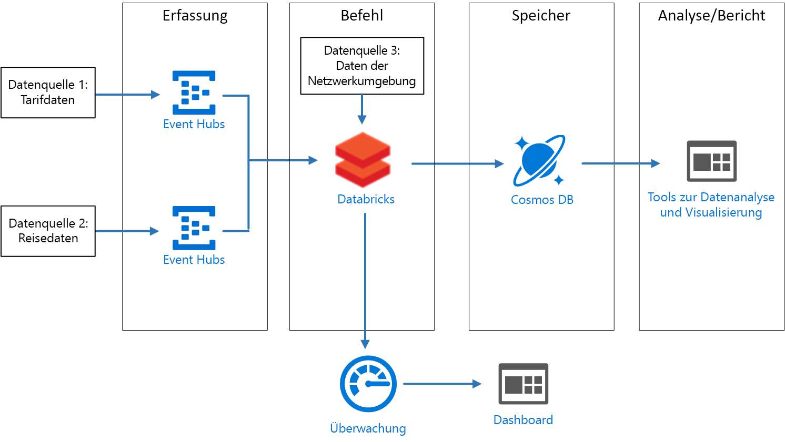
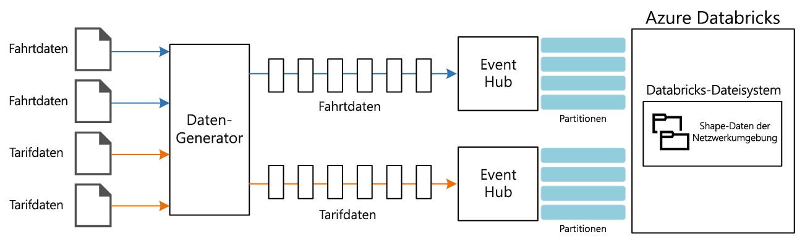

# <a name="create-a-stream-processing-pipeline-with-azure-databricks"></a>Erstellen einer Pipeline zur Datenstromverarbeitung mit Azure Databricks

Diese Referenzarchitektur zeigt eine End-to-End-Pipeline zur [Datenstromverarbeitung](/azure/architecture/data-guide/big-data/real-time-processing). Dieser Pipelinetyp hat vier Phasen: Erfassung, Verarbeitung, Speicherung und Analyse/Berichterstellung. In dieser Referenzarchitektur erfasst die Pipeline Daten aus zwei Quellen, verknüpft verwandte Datensätze aus den einzelnen Datenströmen, reichert das Ergebnis an und berechnet einen Durchschnitt in Echtzeit. Die Ergebnisse werden zur weiteren Analyse gespeichert. [**Stellen Sie diese Lösung bereit**](#deploy-the-solution).



**Szenario:** Ein Taxiunternehmen erfasst Daten zu jeder Taxifahrt. In diesem Szenario gehen wir davon aus, dass zwei separate Geräte Daten senden. Das Taxi verfügt ein Messgerät, das Informationen zu jeder Fahrt sendet – die Dauer, die Strecke sowie die Abhol- und Zielorte. Ein separates Gerät akzeptiert Zahlungen von Kunden und sendet Daten zu den Fahrpreisen. Das Taxiunternehmen möchte Fahrgasttrends ermitteln und dazu für jedes Stadtviertel in Echtzeit das durchschnittliche Trinkgeld pro gefahrener Meile berechnen.

## <a name="architecture"></a>Architecture

Die Architektur umfasst die folgenden Komponenten.

**Datenquellen:** In dieser Architektur gibt es zwei Datenquellen, die Datenströme in Echtzeit generieren. Der erste Datenstrom enthält Informationen zur Fahrt und der zweite Informationen zum Fahrpreis. Die Referenzarchitektur umfasst einen simulierten Datengenerator, der aus einem Satz von statischen Dateien liest und die Daten an Event Hubs pusht. Bei einer echten Anwendung stammen die Daten von Geräten, die in den Taxis installiert sind.

**Azure Event Hubs**: [Event Hubs](/azure/event-hubs/) ist ein Ereigniserfassungsdienst. Die hier gezeigte Architektur verwendet zwei Event Hub-Instanzen, eine für jede Datenquelle. Jede Datenquelle sendet einen Datenstrom an den zugehörigen Event Hub.

**Azure Databricks**: [Databricks](/azure/azure-databricks/) ist eine Apache Spark-basierte Analyseplattform, die für die Microsoft Azure-Clouddienstplattform optimiert ist. Sie wird verwendet, um die Taxifahrtdaten und die Fahrpreisdaten zu korrelieren und die korrelierten Daten mit den gespeicherten Stadtvierteldaten aus dem Databricks-Dateisystem anzureichern.

**Cosmos DB**: Der Azure Databricks-Auftrag gibt eine Reihe von Datensätzen aus, die unter Verwendung der Cassandra-API in [Cosmos DB](/azure/cosmos-db/) geschrieben werden. Die Cassandra-API wird verwendet, da sie Modelle mit Zeitreihendaten unterstützt.

**Azure Log Analytics**: Die von [Azure Monitor](/azure/monitoring-and-diagnostics/) erfassten Anwendungsprotokolldaten werden in einem [Log Analytics-Arbeitsbereich](/azure/log-analytics) gespeichert. Mithilfe von Log Analytics-Abfragen können Metriken analysiert und visualisiert sowie Protokollmeldungen auf Probleme innerhalb der Anwendung untersucht werden.

## <a name="data-ingestion"></a>Datenerfassung

<!-- markdownlint-disable MD033 -->

Um eine Datenquelle zu simulieren, verwendet die Referenzarchitektur das Dataset [New York City Taxi Data](https://uofi.app.box.com/v/NYCtaxidata/folder/2332218797)<sup>[[1]](#note1)</sup>. Dieses Dataset enthält Daten zu Taxifahrten in New York City für einen Zeitraum von vier Jahren (2010&ndash;2013). Es umfasst zwei Datensatztypen: Fahrtdaten und Fahrpreisdaten. Die Fahrtdaten enthalten die Fahrtdauer, die Fahrtstrecke sowie die Abhol- und Zielorte. Die Fahrpreisdaten enthalten die Beträge von Fahrpreis, Steuern und Trinkgeld. Gemeinsame Felder in beiden Datensatztypen sind die Taxinummer (Medallion), die Taxilizenz (Hack license) und die Anbieter-ID (Vendor ID). Anhand dieser drei Felder werden ein Taxi und ein Fahrer eindeutig identifiziert. Die Daten werden im CSV-Format gespeichert.

> [1] <span id="note1">Donovan, Brian; Work, Dan (2016): New York City Taxi Trip Data (2010 – 2013). Universität Illinois in Urbana-Champaign. <https://doi.org/10.13012/J8PN93H8>

<!-- markdownlint-enable MD033 -->

Der Datengenerator ist eine .NET Core-Anwendung, die Datensätze liest und an Azure Event Hubs sendet. Der Generator sendet Fahrtdaten im JSON-Format und Fahrpreisdaten im CSV-Format.

Event Hubs verwendet [Partitionen](/azure/event-hubs/event-hubs-features#partitions) zum Segmentieren der Daten. Partitionen ermöglichen es einem Consumer, die einzelnen Partitionen gleichzeitig zu lesen. Wenn Sie Daten an Event Hubs senden, können Sie den Partitionsschlüssel explizit angeben. Andernfalls werden Datensätze nach einem Roundrobinverfahren Partitionen zugewiesen.

In diesem Szenario sollen Fahrtdaten und Fahrpreisdaten für ein bestimmtes Taxi die gleiche Partitions-ID erhalten. Dies ermöglicht Databricks eine gewisse Parallelität beim Korrelieren der beiden Datenströme. Ein Datensatz in der Partition *n* der Fahrtdaten entspricht einem Datensatz in der Partition *n* der Fahrpreisdaten.



Im Datengenerator enthält das gemeinsame Datenmodell für beide Datensatztypen eine `PartitionKey`-Eigenschaft, bei der es sich um die Verkettung von `Medallion`, `HackLicense` und `VendorId` handelt.

```csharp
public abstract class TaxiData
{
    public TaxiData()
    {
    }

    [JsonProperty]
    public long Medallion { get; set; }

    [JsonProperty]
    public long HackLicense { get; set; }

    [JsonProperty]
    public string VendorId { get; set; }

    [JsonProperty]
    public DateTimeOffset PickupTime { get; set; }

    [JsonIgnore]
    public string PartitionKey
    {
        get => $"{Medallion}_{HackLicense}_{VendorId}";
    }
```

Diese Eigenschaft wird verwendet, um beim Senden der Daten an Event Hubs einen expliziten Partitionsschlüssel bereitzustellen:

```csharp
using (var client = pool.GetObject())
{
    return client.Value.SendAsync(new EventData(Encoding.UTF8.GetBytes(
        t.GetData(dataFormat))), t.PartitionKey);
}
```

### <a name="event-hubs"></a>Event Hubs

Die Durchsatzkapazität von Event Hubs wird in [Durchsatzeinheiten](/azure/event-hubs/event-hubs-features#throughput-units) gemessen. Sie können einen Event Hub automatisch skalieren, indem Sie die Funktion für [automatische Vergrößerung](/azure/event-hubs/event-hubs-auto-inflate) aktivieren. Dadurch werden die Durchsatzeinheiten basierend auf dem Datenverkehr automatisch bis zu einem konfigurierten Höchstwert hochskaliert.

## <a name="stream-processing"></a>Datenstromverarbeitung

Die Datenverarbeitung in Azure Databricks erfolgt durch einen Auftrag. Der Auftrag wird einem Cluster zugewiesen und darin ausgeführt. Bei dem Auftrag kann es sich um benutzerdefinierten Java-Code oder um ein Spark-[Notebook](https://docs.databricks.com/user-guide/notebooks/index.html) handeln.

In dieser Referenzarchitektur ist der Auftrag ein Java-Archiv mit Klassen (geschrieben in Java und Scala). Bei Angabe des Java-Archivs für einen Databricks-Auftrag wird die Klasse für die Ausführung durch den Databricks-Cluster angegeben. Hier enthält die **main**-Methode der Klasse **com.microsoft.pnp.TaxiCabReader** die Datenverarbeitungslogik.

### <a name="reading-the-stream-from-the-two-event-hub-instances"></a>Lesen des Datenstroms aus den beiden Event Hub-Instanzen

Die Datenverarbeitungslogik verwendet [strukturiertes Spark-Streaming](https://spark.apache.org/docs/2.1.2/structured-streaming-programming-guide.html), um Daten aus den beiden Azure Event Hub-Instanzen zu lesen:

```scala
val rideEventHubOptions = EventHubsConf(rideEventHubConnectionString)
      .setConsumerGroup(conf.taxiRideConsumerGroup())
      .setStartingPosition(EventPosition.fromStartOfStream)
    val rideEvents = spark.readStream
      .format("eventhubs")
      .options(rideEventHubOptions.toMap)
      .load

    val fareEventHubOptions = EventHubsConf(fareEventHubConnectionString)
      .setConsumerGroup(conf.taxiFareConsumerGroup())
      .setStartingPosition(EventPosition.fromStartOfStream)
    val fareEvents = spark.readStream
      .format("eventhubs")
      .options(fareEventHubOptions.toMap)
      .load
```

### <a name="enriching-the-data-with-the-neighborhood-information"></a>Anreichern der Daten mit Stadtviertelinformationen

Die Fahrtdaten enthalten die Koordinaten (Längen- und Breitengrad) des Start- und Zielorts. Diese Koordinaten sind zwar hilfreich, eignen sich aber nicht besonders für die Analyse. Daher werden die Daten mit Stadtvierteldaten aus einer [Shape-Datei](https://en.wikipedia.org/wiki/Shapefile) angereichert.

Das Shape-Dateiformat ist binär und lässt sich nicht so einfach analysieren. Die Bibliothek [GeoTools](http://geotools.org/) bietet jedoch Tools für Geodaten, die das Shape-Dateiformat verwenden. Diese Bibliothek wird in der Klasse **com.microsoft.pnp.GeoFinder** verwendet, um auf der Grundlage der Koordinaten des Start- und Zielorts den Namen des Stadtviertels zu bestimmen.

```scala
val neighborhoodFinder = (lon: Double, lat: Double) => {
      NeighborhoodFinder.getNeighborhood(lon, lat).get()
    }
```

### <a name="joining-the-ride-and-fare-data"></a>Verknüpfen von Fahrt- und Fahrpreisdaten

Zunächst werden die Fahrt- und Fahrpreisdaten transformiert:

```scala
    val rides = transformedRides
      .filter(r => {
        if (r.isNullAt(r.fieldIndex("errorMessage"))) {
          true
        }
        else {
          malformedRides.add(1)
          false
        }
      })
      .select(
        $"ride.*",
        to_neighborhood($"ride.pickupLon", $"ride.pickupLat")
          .as("pickupNeighborhood"),
        to_neighborhood($"ride.dropoffLon", $"ride.dropoffLat")
          .as("dropoffNeighborhood")
      )
      .withWatermark("pickupTime", conf.taxiRideWatermarkInterval())

    val fares = transformedFares
      .filter(r => {
        if (r.isNullAt(r.fieldIndex("errorMessage"))) {
          true
        }
        else {
          malformedFares.add(1)
          false
        }
      })
      .select(
        $"fare.*",
        $"pickupTime"
      )
      .withWatermark("pickupTime", conf.taxiFareWatermarkInterval())
```

Anschließend werden die Fahrtdaten mit den Fahrpreisdaten verknüpft:

```scala
val mergedTaxiTrip = rides.join(fares, Seq("medallion", "hackLicense", "vendorId", "pickupTime"))
```

### <a name="processing-the-data-and-inserting-into-cosmos-db"></a>Verarbeiten der Daten und Einfügen in Cosmos DB

Der durchschnittliche Fahrpreis für jedes Stadtviertel wird für ein bestimmtes Zeitintervall berechnet:

```scala
val maxAvgFarePerNeighborhood = mergedTaxiTrip.selectExpr("medallion", "hackLicense", "vendorId", "pickupTime", "rateCode", "storeAndForwardFlag", "dropoffTime", "passengerCount", "tripTimeInSeconds", "tripDistanceInMiles", "pickupLon", "pickupLat", "dropoffLon", "dropoffLat", "paymentType", "fareAmount", "surcharge", "mtaTax", "tipAmount", "tollsAmount", "totalAmount", "pickupNeighborhood", "dropoffNeighborhood")
      .groupBy(window($"pickupTime", conf.windowInterval()), $"pickupNeighborhood")
      .agg(
        count("*").as("rideCount"),
        sum($"fareAmount").as("totalFareAmount"),
        sum($"tipAmount").as("totalTipAmount")
      )
      .select($"window.start", $"window.end", $"pickupNeighborhood", $"rideCount", $"totalFareAmount", $"totalTipAmount")
```

Das Ergebnis wird schließlich in Cosmos DB eingefügt:

```scala
maxAvgFarePerNeighborhood
      .writeStream
      .queryName("maxAvgFarePerNeighborhood_cassandra_insert")
      .outputMode(OutputMode.Append())
      .foreach(new CassandraSinkForeach(connector))
      .start()
      .awaitTermination()
```

## <a name="security-considerations"></a>Sicherheitshinweise

Der Zugriff auf den Arbeitsbereich der Azure-Datenbank wird über die [Administratorkonsole](https://docs.databricks.com/administration-guide/admin-settings/index.html) gesteuert. Über die Administratorkonsole können Benutzer hinzugefügt, Benutzerberechtigungen verwaltet und einmaliges Anmelden eingerichtet werden. Die Zugriffssteuerung für Arbeitsbereiche, Cluster, Aufträge und Tabellen kann ebenfalls über die Administratorkonsole festgelegt werden.

### <a name="managing-secrets"></a>Verwaltung geheimer Schlüssel

Azure Databricks enthält einen [Geheimnisspeicher](https://docs.azuredatabricks.net/user-guide/secrets/index.html) zum Speichern von Geheimnissen (beispielsweise Verbindungszeichenfolgen, Zugriffsschlüssel, Benutzernamen und Kennwörter). Geheimnisse werden im Azure Databricks-Geheimnisspeicher nach **Bereichen** partitioniert:

```bash
databricks secrets create-scope --scope "azure-databricks-job"
```

Geheimnisse werden auf der Bereichsebene hinzugefügt:

```bash
databricks secrets put --scope "azure-databricks-job" --key "taxi-ride"
```

> [!NOTE]
> Anstelle des nativen Azure Databricks-Bereichs kann auch ein Azure Key Vault-basierter Bereich verwendet werden. Weitere Informationen finden Sie unter [Azure Key Vault-backed scopes](https://docs.azuredatabricks.net/user-guide/secrets/secret-scopes.html#azure-key-vault-backed-scopes) (Azure Key Vault-basierte Bereiche).

Im Code erfolgt der Zugriff auf Geheimnisse über die [secrets-Hilfsprogramme](https://docs.databricks.com/user-guide/dev-tools/dbutils.html#secrets-utilities) von Azure Databricks.

## <a name="monitoring-considerations"></a>Aspekte der Überwachung

Azure Databricks basiert auf Apache Spark. Beide Lösungen verwenden [log4j](https://logging.apache.org/log4j/2.x/) als Standardbibliothek für die Protokollierung. Zusätzlich zur von Apache Spark bereitgestellten Standardprotokollierung sendet diese Referenzarchitektur auch Protokolle und Metriken an [Azure Log Analytics](/azure/log-analytics/).

Die Klasse **com.microsoft.pnp.TaxiCabReader** konfiguriert das Apache Spark-Protokollierungssystem so, dass dessen Protokolle an Azure Log Analytics gesendet werden. Hierbei werden die Werte aus der Datei **log4j.properties** verwendet. Die Meldungen der Apache Spark-Protokollierung liegen als Zeichenfolgen vor. Für Azure Log Analytics werden jedoch Protokollmeldungen im JSON-Format benötigt. Die Klasse **com.microsoft.pnp.log4j.LogAnalyticsAppender** transformiert die Meldungen in das JSON-Format:

```scala

    @Override
    protected void append(LoggingEvent loggingEvent) {
        if (this.layout == null) {
            this.setLayout(new JSONLayout());
        }

        String json = this.getLayout().format(loggingEvent);
        try {
            this.client.send(json, this.logType);
        } catch(IOException ioe) {
            LogLog.warn("Error sending LoggingEvent to Log Analytics", ioe);
        }
    }

```

Bei der Verarbeitung von Fahrt- und Fahrpreismeldungen durch die Klasse **com.microsoft.pnp.TaxiCabReader** kann es zu Problemen mit der Formatierung und somit zu ungültigen Meldungen kommen. In einer Produktionsumgebung müssen diese falsch formatierten Meldungen unbedingt analysiert werden, um ein Problem mit den Datenquellen zu erkennen und schnell zu beheben, damit keine Daten verloren gehen. Die Klasse **com.microsoft.pnp.TaxiCabReader** registriert einen Apache Spark-Akkumulator zur Nachverfolgung der Anzahl falsch formatierter Fahrpreis- und Fahrtdatensätze:

```scala
    @transient val appMetrics = new AppMetrics(spark.sparkContext)
    appMetrics.registerGauge("metrics.malformedrides", AppAccumulators.getRideInstance(spark.sparkContext))
    appMetrics.registerGauge("metrics.malformedfares", AppAccumulators.getFareInstance(spark.sparkContext))
    SparkEnv.get.metricsSystem.registerSource(appMetrics)
```

Apache Spark verwendet die Dropwizard-Bibliothek, um Metriken zu senden. Einige der nativen Dropwizard-Metrikfelder sind jedoch nicht mit Azure Log Analytics kompatibel. Daher enthält diese Referenzarchitektur eine benutzerdefinierte Dropwizard-Senke und einen entsprechenden Reporter. Die Metriken werden so formatiert, wie es von Azure Log Analytics erwartet wird. Wenn Apache Spark Metriken meldet, werden auch die benutzerdefinierten Metriken für die falsch formatierten Fahrt- und Fahrpreisdaten gesendet.

Als letzte Metrik wird im Azure Log Analytics-Arbeitsbereich der kumulative Fortschritt des strukturierten Spark-Streamingauftrags protokolliert. Hierzu wird in der Klasse **com.microsoft.pnp.StreamingMetricsListener** ein benutzerdefinierter StreamingQuery-Listener implementiert. Diese Klasse wird beim Ausführen des Auftrags bei der Apache Spark-Sitzung registriert:

```scala
spark.streams.addListener(new StreamingMetricsListener())
```

Die Methoden in „StreamingMetricsListener“ werden von der Apache Spark-Runtime aufgerufen, wenn ein strukturiertes Streamingereignis auftritt. Dabei werden Protokollmeldungen und Metriken an den Azure Log Analytics-Arbeitsbereich gesendet. Zur Überwachung der Anwendung können Sie in Ihrem Arbeitsbereich die folgenden Abfragen verwenden:

### <a name="latency-and-throughput-for-streaming-queries"></a>Wartezeit und Durchsatz für Streamingabfragen

```shell
taxijob_CL
| where TimeGenerated > startofday(datetime(<date>)) and TimeGenerated < endofday(datetime(<date>))
| project  mdc_inputRowsPerSecond_d, mdc_durationms_triggerExecution_d
| render timechart
```

### <a name="exceptions-logged-during-stream-query-execution"></a>Ausnahmen, die während der Ausführung von Datenstromabfragen protokolliert wurden

```shell
taxijob_CL
| where TimeGenerated > startofday(datetime(<date>)) and TimeGenerated < endofday(datetime(<date>))
| where Level contains "Error"
```

### <a name="accumulation-of-malformed-fare-and-ride-data"></a>Kumulation falsch formatierter Fahrpreis- und Fahrtdaten

```shell
SparkMetric_CL
| where TimeGenerated > startofday(datetime(<date>)) and TimeGenerated < endofday(datetime(<date>))
| render timechart
| where name_s contains "metrics.malformedrides"

SparkMetric_CL
| where TimeGenerated > startofday(datetime(<date>)) and TimeGenerated < endofday(datetime(<date>))
| render timechart
| where name_s contains "metrics.malformedfares"
```

### <a name="job-execution-to-trace-resiliency"></a>Auftragsausführung zur Nachverfolgung der Resilienz

```shell
SparkMetric_CL
| where TimeGenerated > startofday(datetime(<date>)) and TimeGenerated < endofday(datetime(<date>))
| render timechart
| where name_s contains "driver.DAGScheduler.job.allJobs"
```

Weitere Informationen finden Sie unter [Überwachung von Azure Databricks](../../databricks-monitoring/index.md).

## <a name="deploy-the-solution"></a>Bereitstellen der Lösung

Führen Sie zum Bereitstellen und Ausführen der Referenzimplementierung die Schritte aus der [GitHub-Infodatei](https://github.com/mspnp/azure-databricks-streaming-analytics) aus.
